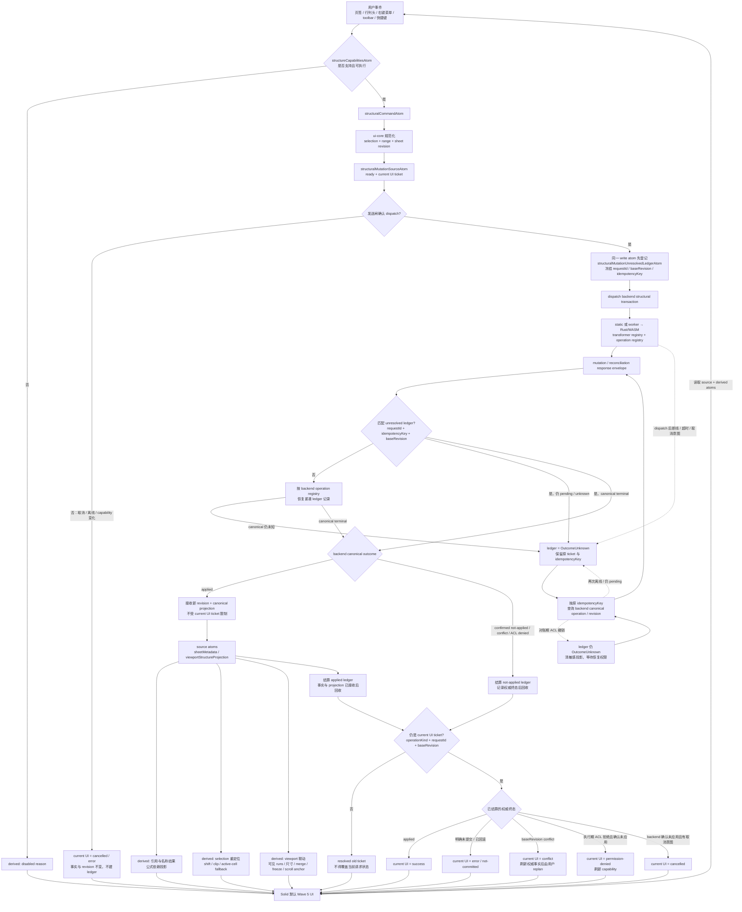
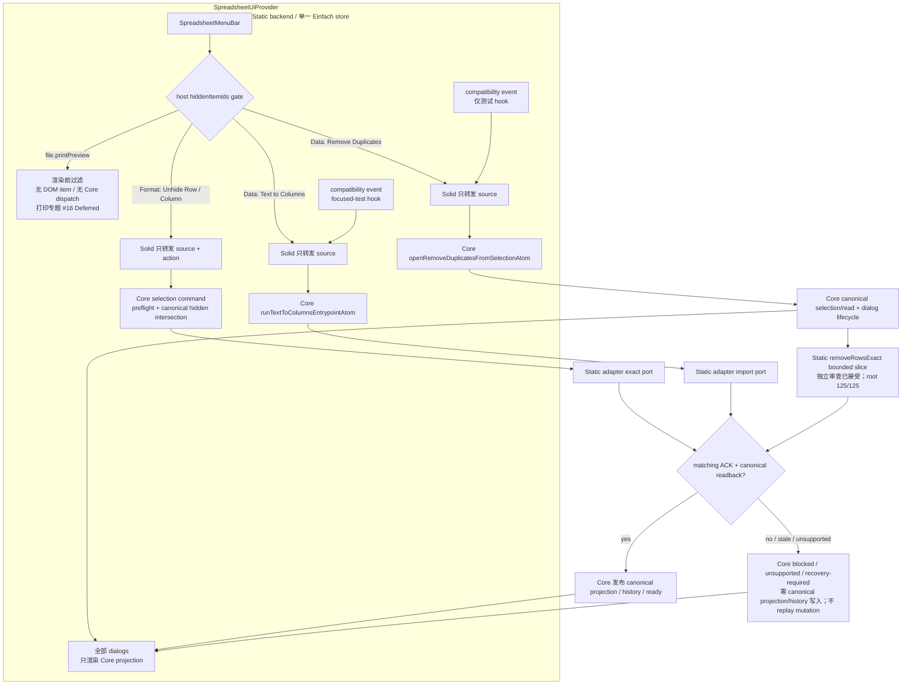
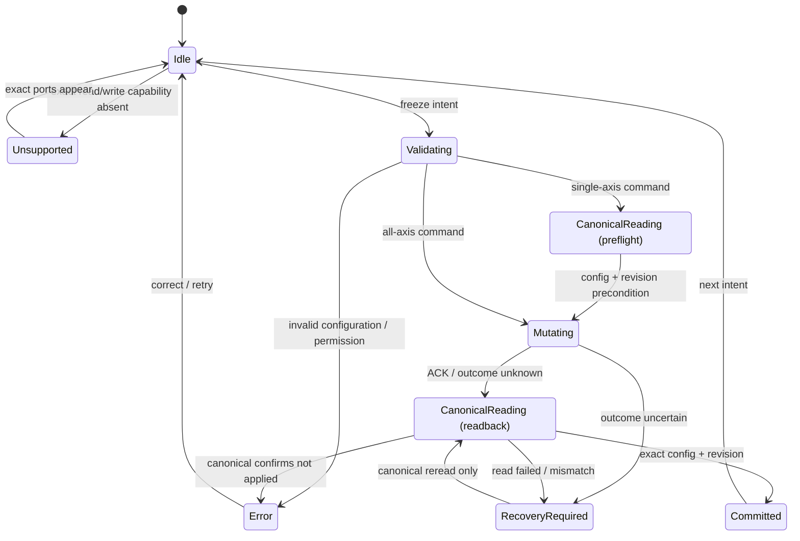
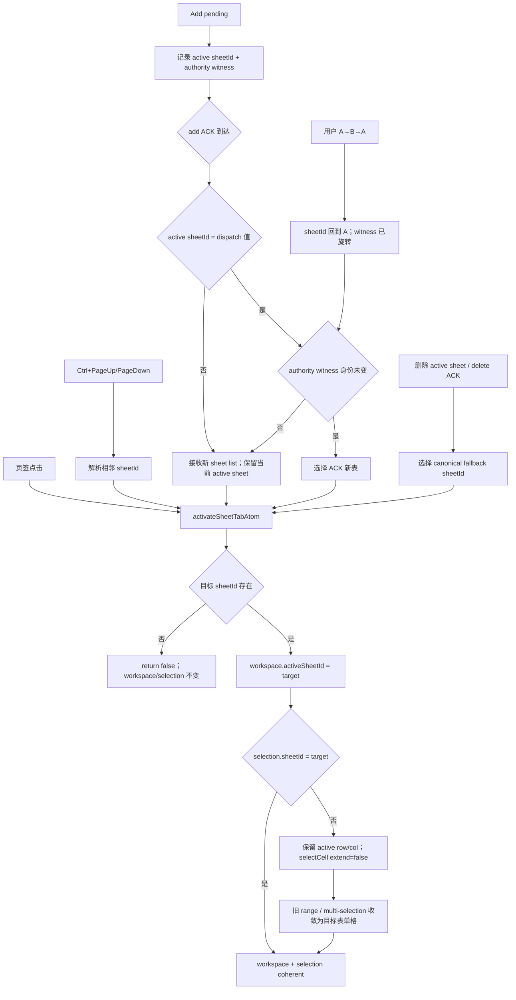
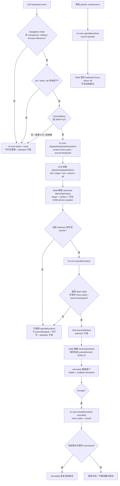

# 在线 Excel 对齐排期：02 工作表、行列与单元格结构

> 基线核对日期：2026-07-13
>
> 当前工作树架构复核：2026-07-14
>
> P0 主窗口：2026-07-20 ～ 2026-08-07
>
> 范围边界：本计划只覆盖工作表、行列、单元格结构；第 9 组“数据分析”和第 16 组“打印”完全延后，不占本计划工期。批注由对应专题计划负责。

> 架构审查：目标设计以 `@einfach/core` Source / Derived / Command atoms 为唯一前端产品状态核心，backend/Rust 保存可持久事实，`@einfach/solid` 只负责绑定。#03 隐藏行列的 Static authority、Grid exact-window metadata hydration 与 Format Top Menu selection Unhide，以及 #05 Freeze Panes 的 Static authority bounded slices 均已 `MAIN_REVIEW_ACCEPTED`：UI-core 使用 private backing/readonly projection 与 strict command lifecycle，Solid 只派发 intent；Static 保存 canonical authority，并按 matching sheet/request + valid revision ACK 与 strict same-ticket canonical readback 发布投影。默认 `VNextWave5Demo` 已把 `SpreadsheetMenuBar` 与全部 dialogs 挂在同一 `SpreadsheetUiProvider` / Einfach store 下；Format Unhide 只把 `{ source, action }` 交给 Core，Data 菜单也只调用既有 Core entrypoint，不建立第二份状态。当前可见入口与 E2E 证据只覆盖默认 Static host，不得外推为 Worker、TS engine 或 WASM parity；host 用 `hiddenItemIds` 在渲染前隐藏 Print Preview，第 16 组打印继续完全延后。#03 仍缺 Worker/transport、durable、稀疏 run 与系统门禁，因此产品仍为 `Partial`。

## 1. 结论

当前 #03 收口证据按集合分层：`/root` targeted **7 suites / 216 tests PASS**（owner Solid/Grid **3 suites / 101 tests** + UI-core/Core **4 suites / 115 tests**）；独立 reviewer 的 Grid 新增 **3 tests** + 相邻全量 **74 tests** = **77 tests**，core/menu/hidden/boundary **115 tests**，ContextMenu **24 tests**。UI-core build PASS；全量 UI-core **57/57 suites、1437/1437 tests PASS**；全量 Solid **70 passed + 1 skipped suites（71 total）、1125 passed + 6 skipped tests（1131 total），0 failed**；Vite **293 modules PASS**。Full Solid `tsc` 仍是 exit 2、恰 5 条未变化的 Worker baseline diagnostics，不能写成 PASS。

当前实现已经具备“工作表基础管理、整行整列增删、手动调整尺寸、静态后端合并、前端冻结”等可演示能力，但尚未达到在线 Excel 的结构能力闭环。主要问题不是缺少类型，而是默认 UI 可达性、结构变换完整性、static/worker 语义一致性、持久化与原子撤销没有同时成立。

本计划把已有主路径补齐放在 P0：先建立统一结构事务和能力契约，再完成行列结构变换、隐藏/冻结、合并、离屏自动适配和最大网格的 static/worker parity。复制/隐藏工作表、单元格位移和无损跨表剪贴放在 P1；拖拽移动与分组大纲放在 P2。按 4 名研发（其中 1 名 Rust/worker）+ 1 名测试并行估算，P0 可在 2026-08-07 关闭；人员少于该配置时，应保持优先级并顺延，不压缩 parity 与验收。

## 2. 状态口径

- ✅ 已实现：默认 Wave 5 页面中普通用户可发现、可操作，static 与 worker 主路径均有相同语义，并有有效测试证据。
- 🟡 部分实现：只有类型、ui-core、组件、局部状态或单一适配器；或者语义、持久化、撤销、默认入口、测试任一环节未闭合。
- ❌ 未实现：没有可用的端到端能力。

“存在组件/接口”“通过隐藏测试钩子调用”“非默认 demo 可演示”均不计为完成。

## 3. 现状基线与证据

| #   | 功能点                                     | 现状 | 默认 UI                                                  | static                                                                                             | worker/Rust            | 证据与主要缺口                                                                                                                                                                                                                                                                                                                                                                     | 目标优先级 |
| --- | ------------------------------------------ | ---- | -------------------------------------------------------- | -------------------------------------------------------------------------------------------------- | ---------------------- | ---------------------------------------------------------------------------------------------------------------------------------------------------------------------------------------------------------------------------------------------------------------------------------------------------------------------------------------------------------------------------------- | ---------- |
| 1   | 新建、切换、重命名、删除、拖拽排序工作表   | 🟡   | 可达                                                     | 已接入                                                                                             | 已接入                 | 生命周期可见 UI E2E 在 TS/WASM 合计 2/2，reorder 也有独立切片；页签、创建 ACK、删除 fallback 与相邻键盘切表已统一经 `activateSheetTabAtom` 对齐 workspace/selection，跨表保留 row/col 且多区收敛单格。worker undo/redo、完整 parity/历史/系统门禁仍未闭环。                                                                                                                        | P0         |
| 2   | 复制/创建副本工作表                        | ❌   | 无入口                                                   | 无端口                                                                                             | 无 RPC/引擎语义        | `SpreadsheetSheetMetadata` 只有 id/name/index；工作表端口仅 add/rename/delete/reorder。尚未定义公式、名称、格式及 sheet id 的复制规则。                                                                                                                                                                                                                                            | P1         |
| 3   | 隐藏/取消隐藏工作表                        | ❌   | 无入口                                                   | 无端口                                                                                             | 无 RPC/引擎语义        | 页签菜单只有 Rename/Delete；元数据没有 hidden；尚未定义“至少保留一张可见表”和激活表回退规则。                                                                                                                                                                                                                                                                                      | P1         |
| 4   | 插入/删除整行、整列                        | 🟡   | 可达                                                     | 可用但变换不完整                                                                                   | 有 RPC/Rust 主路径     | 默认右键菜单和 E2E 已证明基本位移。Static hidden Set 的 insert/delete/`removeRows` 迁移已有 bounded 证据，`removeRowsExact` 限定切片也已独立接受（reviewer 22/22、root 整文件 125/125、range 子审 3/3 + 101,928 穷举）；但这不覆盖 Worker/TS/WASM，也不证明 merge、名称、验证、条件格式、筛选、冻结等结构元数据随整行删除完整变换，故仍为 `Partial`。                              | P0         |
| 5   | 插入/删除单元格并右移/下移/左移/上移       | ❌   | 无入口                                                   | 无端口                                                                                             | 无 RPC/引擎语义        | 菜单类型和后端协议只有整行整列操作，没有 cell-shift 原语、冲突规则与原子历史。                                                                                                                                                                                                                                                                                                     | P1         |
| 6   | 拖拽移动行、列或选区                       | ❌   | 无入口                                                   | 无端口                                                                                             | 无 RPC/引擎语义        | 当前拖拽仅用于工作表排序；没有 move-range/move-axis 契约、插入指示线、冲突预检或撤销语义。                                                                                                                                                                                                                                                                                         | P2         |
| 7   | 手动调整行高、列宽                         | ✅   | 可达                                                     | 已持久化                                                                                           | 已持久化为稀疏尺寸事实 | Grid 有可见 resize handle；static 与 worker 均实现尺寸写入，`vnext-grid.test.tsx`、`vnext-worker-backend.spec.ts` 有证据。P0 增加统一契约回归。                                                                                                                                                                                                                                    | P0 守门    |
| 8   | 自动适配行高、列宽                         | 🟡   | 双击手柄可达                                             | 可写回                                                                                             | 可写回                 | 计算只读取当前已经渲染的 DOM 单元格，长文本位于离屏行时会低估；worker E2E 也只验证可见列。                                                                                                                                                                                                                                                                                         | P0         |
| 9   | 隐藏/取消隐藏行列                          | 🟡   | Format Unhide 与 Context Hide/Unhide 在 Static host 可达 | Static authority + exact-window hydration + Top Menu selection Unhide + Context Hide/Unhide 已接受 | 未实现                 | UI-core 四种 mutation 与 selection-Unhide 都走 matching sheet/request + valid revision ACK 与 strict same-ticket canonical readback；Static 有 canonical Set/history，Menu/Grid 只薄派发。默认 Wave5 MenuBar 与 Static-capable Context Menu 只证明 Static host 入口；Worker hidden capability/Context Menu reachability、durable、稀疏 run 与系统门禁仍缺，故 #03 保持 `Partial`。 | P0         |
| 10  | 行列分组/大纲、折叠/展开                   | ❌   | 无入口                                                   | 无端口                                                                                             | 无模型/RPC             | `hidden-rows-columns.md` 明确把 outline 延后；缺少层级、嵌套和折叠后的可见区投影。                                                                                                                                                                                                                                                                                                 | P2         |
| 11  | 合并/取消合并单元格                        | 🟡   | toolbar 可达                                             | 已实现                                                                                             | 未实现                 | static 与 Grid 已能合并渲染，`toolbar-merge.spec.ts` 有 UI 证据；worker 协议和 adapter 没有 merge/unmerge。                                                                                                                                                                                                                                                                        | P0         |
| 12  | 合并后居中（Merge & Center）               | 🟡   | 入口可达                                                 | 只执行合并                                                                                         | 未实现                 | toolbar 代码明确只调用 `mergeRange`，当前完全没有施加居中格式；并不存在“独立的居中历史项”。目标实现必须用 compound transaction 一次提交合并与对齐，并保持一次撤销。                                                                                                                                                                                                                | P0         |
| 13  | 冻结窗格、首行、首列与取消冻结             | 🟡   | 右键菜单可达                                             | Static authority bounded slice 已接受                                                              | 无 Worker parity       | UI-core 25/25、Solid 171/171、boundary 5/5、两个 build PASS；private backing、readonly projection、Static CAS/preflight/readback 已接受。Worker、durable hydration、结构变换/undo 与系统门禁仍缺。                                                                                                                                                                                 | P0         |
| 14  | Excel 最大网格（1,048,576 行 × 16,384 列） | 🟡   | 默认只配置 50×16                                         | 稀疏模型可扩展                                                                                     | Rust 常量已对齐        | Rust 与 selection 常量已对齐上限，但默认 `VNextWave5Demo` viewport 仍为 50×16；还未验证 XFD1048576 导航、浏览器滚动像素上限和内存界限。                                                                                                                                                                                                                                            | P0         |
| 15  | 跨工作表复制/剪切/粘贴                     | 🟡   | 可借助系统 TSV 走值/公式文本                             | 有文本路径                                                                                         | 有文本导入导出路径     | 当前路径主要是 TSV；不能无损携带格式、合并、验证、条件格式等结构信息，也没有跨表 move 的一次性事务与源区域清除保证。                                                                                                                                                                                                                                                               | P1         |
| 16  | 结构变换的一致性、原子撤销/重做与持久化    | 🟡   | 用户能触发部分命令                                       | 各功能独立实现                                                                                     | 能力缺口较多           | `STRUCTURAL_UNDO.md` 的大表 fallback 会丢失被删除带内的原内容；static/worker 尚无同一套结构契约测试，复杂元数据组合也未覆盖。                                                                                                                                                                                                                                                      | P0         |

补充基线：

- 默认 `VNextWave5Demo.tsx` 使用 Static backend，并在同一个 `SpreadsheetUiProvider` / Einfach store 内挂载 `SpreadsheetMenuBar`、toolbar、formula bar、grid、sheet tabs、状态栏、右键菜单及全部 dialogs。Format 的 Unhide Rows / Unhide Columns 已是可发现入口；Solid 只派发 `{ source, action }`，selection、canonical hidden 交集、ACK、readback 与 recovery 均归 Core。该事实只证明默认 Static host 的可达性，不证明 Worker、TS engine 或 WASM parity；Static-capable Context Menu 已具备 Hide/Unhide 可达链。
- host 向 MenuBar 传入 `hiddenItemIds={['file.printPreview']}`，Print Preview 在 DOM 与 dispatch 前即被过滤；这只是 host gate，不是打印功能完成证据，第 16 组打印继续完全延后。
- `backend/types.ts` 已声明 hidden、merge、freeze 等部分请求和可选投影字段；freeze 的 Static bounded slice 已实现并接受，但 Worker adapter 与持久化/结构语义仍不完整，类型存在也不等于产品完成。
- `viewport/window.ts` 的 UI projection 当前仍用每表 `number[]` 并由 readonly atom 暴露；Static canonical authority 已改为每表 `Set<number>`，但这仍不是百万行需要的稀疏区间/run 表示。UI-core mutation command 与 metadata hydration command 都按 exact window reconcile 并保留 off-window/sibling-sheet projection；Grid 仅派发 `hydrateViewportSizeProjectionAtom`，旧的整表替换 residual 已移除。稀疏 run 仍是 #03 的独立缺口。
- 已有测试主要证明单点功能：`sheet-tabs.test.ts`、`hidden-rows-columns.test.ts`、`frozen-panes.test.ts`、`vnext-grid.test.tsx`、`vnext-context-menu.test.tsx`、`audit-structural.spec.ts`、`freeze-panes.spec.ts`、`toolbar-merge.spec.ts` 与 worker E2E。它们尚未形成 static/worker 共用的结构契约矩阵。

当前工作树的具体边界是：sheet tabs、viewport、hidden/freeze/merge 的部分交互状态已经进入 framework-agnostic UI-core。#03 hidden 已有 private backing/readonly projection、四种 strict command、matching sheet/request + valid revision ACK 与 strict same-ticket canonical window readback；Static 以 canonical Set 提供有界 authority/history，Grid metadata hydration 与 Format Top Menu selection Unhide 都只派发 UI-core command。selection-Unhide 在 Core 内要求 exact single region、同 source/sheet、ready authority、非空 revision 与目标轴覆盖，再由 canonical private hidden ∩ selection 得出 indices；空交集零 transport，有效路径冻结完整 authority window 并复用既有 lifecycle。Data > Text to Columns 与兼容事件汇入同一个 `runTextToColumnsEntrypointAtom`；Data > Remove Duplicates 与仅用于测试兼容的事件汇入同一个 Core open command，真实菜单的 success/undo 路径已独立验收。二者都不允许 Solid 保存第二份 dialog 或 mutation lifecycle。默认 host 证据仍只限 Static；Static `removeRowsExact` bounded slice 已经二次独立审查接受（reviewer 22/22、root 整文件 125/125、range 子审 3/3 + 101,928 穷举），但不得外推为 Worker/TS/WASM parity 或整行删除的全 metadata parity。#05 freeze 也已有 exact capability、canonical preflight/mutation/readback 与真实 revision 的有界闭环。`SheetTabs`、`ContextMenu`、`Grid`、`Toolbar` 的其他结构能力仍有直接 backend mutation 路径，toolbar 的跨行列合并也由多次调用拼成。merge、name、validation、conditional formatting、filter、freeze 等结构 metadata 的统一变换仍缺；仓库里也还没有覆盖所有结构能力的 operation registry 与双后端 transaction/recovery 合同。因此下文通用状态图仍是目标架构；另列的 #03 三个 bounded slices、#05 Static bounded 流与 #30 Static `removeRowsExact` bounded slice 已主审接受。

## 4. 目标与非目标

### 4.1 目标

1. 所有排入当期的功能必须从默认 Wave 5 UI 可发现、可操作，具备键盘/菜单路径和禁用原因反馈。
2. static 和 worker/Rust 对相同命令给出相同的结果、revision、错误码、持久化与 undo/redo 行为。
3. 结构变换必须统一处理单元格、公式依赖、名称、格式、合并、验证、条件格式、筛选/排序范围、尺寸、隐藏、冻结和大纲等已支持元数据，不允许各 adapter 各写一套不完整规则。
4. 最大网格仍保持稀疏、虚拟化和按窗口投影；状态与内存不能随 1,048,576×16,384 的理论格数展开。
5. 产品状态只进入 Einfach atom/store；Solid 组件是薄绑定，不能用 local signal 形成第二事实源。

### 4.2 非目标

- 第 9 组“数据分析”全部延后，包括分析工具、透视、预测等；即使结构操作会影响分析对象，本期也只登记依赖，不设计或实现相关兼容接口与产品能力。
- 第 16 组“打印”全部延后，包括打印区域、分页、页眉页脚和打印预览；不得以打印需求阻塞本计划。
- 批注、协同编辑、权限、审计日志由各自专题负责。本计划仅保证结构变换接口可让这些模块后续挂接。
- P0 不做拖拽移动和分组大纲；P0 只为它们预留统一事务、区间和能力契约。

## 5. 分级范围

### P0：补齐已有主路径，2026-07-20 ～ 2026-08-07

- 建立统一 structural transaction、capability 和错误模型；static/worker 运行同一份契约测试。
- 修复整行整列增删的全元数据变换与精确 undo/redo，移除“大数据量只能近似恢复”的发布态语义。
- 把隐藏/取消隐藏行列接入默认 UI、后端持久化和历史；以稀疏区间表示，不展开索引数组。
- 保持手动尺寸能力，并把自动适配改为基于后端数据/测量服务的确定性计算，覆盖离屏内容。
- 复用已经声明的 `mergeRange`/`unmergeRange`、`readFreezeConfig`/`setFreezeConfig`、`hideRows`/`hideColumns` 端口形状，补齐缺失的 static/worker/Rust adapter 实现；把 Merge & Center 做成“合并 + 对齐格式”的单次原子事务，不重复定义平行端口。
- 把冻结状态纳入 static/worker/Rust 持久化和 hydration，并处理结构变换后的边界迁移。
- 默认网格开放到 Excel 上限，保持虚拟化；验证名称框/键盘/滚动导航到 `XFD1048576`。
- 为已完成的工作表管理与手动尺寸建立 parity 守门测试，防止迁移时回退。

### P1：新增常用结构能力，2026-08-10 ～ 2026-08-26

- 复制工作表；隐藏/取消隐藏工作表；定义 active sheet 回退、至少一张可见表和引用保持规则。
- 插入/删除单元格并按四个方向位移，复用同一结构变换引擎与原子历史。
- 建立应用内无损 clipboard payload，使跨工作表 copy/cut/paste 能携带值、公式、格式、合并、验证和条件格式；系统剪贴板继续提供 TSV 降级路径。

### P2：高交互与大纲，2026-08-27 ～ 2026-09-11

- 拖拽移动整行、整列和选区，包含插入指示、冲突预检、Esc 取消、键盘替代操作与一次 undo。
- 行列分组/大纲，支持嵌套层级、折叠/展开、隐藏合成、结构变换和持久化。
- 完成组合场景 soak、百万行稀疏性能基线与长期回归门禁。

## 6. 依赖与实施顺序

1. **统一契约先行**：backend types、capability、revision、错误码、结构事务和 undo payload 在 W0 冻结；后续 UI、static、worker、Rust 只消费同一语义。
2. **第 2 组受公式 F-1 consumer gate 约束**：2026-07-20 ～ 07-23 只合入非公式 sheet metadata、事务壳、transformer inventory、contract harness 或候选 core fixture 集成；公式引用重写相关 transformer、golden case 和产品合并必须等 07-24 gate 通过。不得用临时 parser、regex 重写或 adapter 私有语法绕过门禁。
3. **Rust/worker 结构引擎先于 worker UI 宣称完成**：公式引用与稀疏元数据变换应在引擎层实现，worker protocol 只负责可取消的 RPC 和版本协商。
4. **元数据登记表先于增删修复**：列出所有受结构操作影响的事实表及 transform/clip/reject 规则，新增元数据必须注册 transformer。
5. **原子历史先于 Merge & Center、cell-shift 和 cut**：compound transaction 需要一个 revision、一个 history frame、失败时完整回滚。
6. **稀疏区间先于隐藏/大纲和最大网格**：不能先把百万索引存进数组，再靠后续性能优化补救。
7. **默认 UI 与 adapter 同步合入**：只有 backend 或隐藏 demo 的实现维持 🟡；功能开关必须来自 capability atom，而不是散落的后端类型判断。
8. **跨表 clipboard 依赖 P0 结构事务**：P1 的无损复制、剪切和 sheet duplicate 共用序列化、id 重映射和引用规则。

## 7. 分层落点

| 层                            | 负责内容                                                                                                                                                                                                                                       | 明确禁止                                                                                                         |
| ----------------------------- | ---------------------------------------------------------------------------------------------------------------------------------------------------------------------------------------------------------------------------------------------- | ---------------------------------------------------------------------------------------------------------------- |
| `excel/spreadsheet-ui-core` | 纯数据的 command/intents、选择归一化、区间/run 运算、capability 派生、交互/执行状态 atoms、结构结果到 viewport/sheet-tabs 的投影；提供 static/worker 共用测试夹具。                                                                            | DOM 测量、Solid API、后端私有分支、每行/每列/每单元格无界 atom。                                                 |
| Solid `src-vnext`             | 在默认 Wave 5 的 sheet tabs、行列头右键菜单、toolbar 和 grid 暴露入口；焦点、ARIA、快捷键、菜单禁用原因；只做 DOM 测量适配并派发 ui-core command atom。                                                                                        | 用 `createSignal`/组件闭包保存产品真值；绕过 backend 直接永久修改隐藏、冻结或合并状态；隐藏测试入口代替真实 UI。 |
| shared backend types          | 复用现有 merge/unmerge、freeze、hide row/column 端口并补齐 adapter；只为缺失能力新增 structural transaction、duplicate/hide sheet、cell-shift、move-range、outline、auto-fit metrics 和 capability/version，统一 revision、错误和 abort 语义。 | 重复定义已有端口；只有 request type、没有 projection/持久化/错误契约；以 `any` 传递结构 payload。                |
| static backend                | 作为本地参考适配器执行完整结构事务，维护稀疏元数据、精确历史和导入导出；与 worker 跑同一 contract suite。                                                                                                                                      | 只移动 cells/formats 而遗忘其他元数据；出现 static-only 产品能力。                                               |
| worker adapter/protocol       | 为统一命令增加版本化 RPC、批量/事务提交、取消、失败回滚、projection hydration；不得在主线程展开整表。                                                                                                                                          | 用多次非原子 RPC 模拟一个命令；把 worker 缺能力静默降级成本地 atom。                                             |
| Rust/WASM                     | 作为 worker 权威结构引擎：稀疏行列/单元格变换、公式与名称引用重写、merge/visibility/freeze/outline 持久化、精确 history delta 和 Excel 边界检查。                                                                                              | O(理论网格大小) 扫描；大操作以近似 undo 进入发布态；panic 穿透为无说明的前端错误。                               |

## 8. Einfach 状态设计

### 8.1 唯一事实源

- 可持久化的 sheet metadata、尺寸、隐藏、冻结、合并、大纲及结构 revision 以 backend/Rust 为唯一事实源。
- ui-core atoms 只保存后端投影和有界交互状态；mutation 统一经过 `structuralCommandAtom → backend transaction → revision projection → history`，不能把“先改本地 atom”当成最终成功。
- 每个 workbook 使用独立 Einfach store/Provider；单测每例创建新 store，禁止模块级共享可变 store。

### 8.2 建议 atom 形态

- `structureCapabilitiesAtom`：由 adapter 握手结果派生，决定菜单显示/启用和降级说明。
- `structuralCommandAtom`：写入命令，规范化 selection 并经过发送闸；跨过 dispatch boundary 前，先原子登记同一 ticket，再调用 backend port。拒绝、冲突、取消均形成显式结果。
- `structuralMutationSourceAtom`：只保存当前 UI mutation ticket 与该 ticket 的展示终态；ticket 包含 `operationKind`、`requestId`、`baseRevision`、`idempotencyKey` 和紧凑范围摘要。新 UI 会话可替换它，但不能因此删除旧 mutation。
- `structuralMutationUnresolvedLedgerAtom`：独立保存已 dispatch、尚无权威终态的 mutation；每 workbook 最多 64 条。只有 canonical committed 且 revision/projection 已刷新，或 backend 明确确认 `NotCommitted` 后才回收；未知记录不得 LRU 淘汰。
- `viewportStructureProjectionAtom`：当前可见窗口的尺寸、隐藏区间、冻结边界、合并投影和 revision。
- `sheetMetadataAtom`：工作表数量天然有界，可保存页签元数据；复制/隐藏后由 backend 回传整体或增量投影。
- `rowSizeRuns`、`colSizeRuns`、`hiddenRowRuns`、`hiddenColRuns`、`outlineRuns`：使用排序稀疏 map/区间树/run-length 结构，结构操作对区间做 split/shift/merge；禁止 `number[1_048_576]` 和逐项 `includes`。

backend 的幂等 operation registry/工作簿存储是已 dispatch mutation 的持久事实源，不是 UI atom。static 与 worker/Rust 都必须能按 workbook 和原 `idempotencyKey` 查询 canonical outcome；重新 attach 时先恢复未决记录，再放行新的结构 mutation。

### 8.3 动态状态边界

- 不为每 row、column、cell 创建 atom family。窗口内渲染从一个有界 viewport projection 派生，单元格编辑复用现有稀疏 backend 数据路径。
- 如果确实需要按 sheet 缓存派生 atom，只能在 ui-core 使用 `@einfach/core` 的 `createCacheStom` / `createCacheStomById({ maxSize: 32 })`；key 由稳定的 workbook/sheet 标量组成，工厂归属 workbook/session，teardown 时销毁 store、订阅和工厂引用。不能使用“等价缓存”、框架 Provider 或无界 `Map<id, Atom>`。
- Solid 本地仅保留 DOM ref 和不构成产品事实的测量句柄；菜单打开、拖拽阶段、命令 pending/error、冻结/隐藏草稿等交互状态也由 Einfach atoms/stores 管理。
- 大范围变换以稀疏 delta/history segment 表示；禁止把全部受影响地址先物化到前端再提交。

### 8.4 结构命令与状态流转

以下是待实现的目标状态机。它刻意把 current UI ticket、未决 ledger 和 backend authority 分开：所有普通响应和对账响应都先结算对应 ledger，随后才判断能否更新当前 UI。

状态约束：

- `pending` 期间 UI 可显示进度和 dispatch 前取消入口，但不能把未经确认的隐藏/冻结/合并投影当作新事实；是否允许并行命令由 command atom 统一串行化/拒绝。dispatch 后只能等待权威结果或进入 `OutcomeUnknown`，不能把 UI 取消、超时或断联解释成“未提交”。
- `success` 只接受 backend 返回的新 revision 和 canonical projection，随后一次性派生引用、selection 与 viewport；三者不得由组件分别猜测。
- 所有普通 mutation 响应和对账响应都先用 `requestId + idempotencyKey + baseRevision` 定位 ledger，并接受 backend 的 canonical outcome；找不到前端记录时从 backend operation registry 恢复，不能把响应当作 stale 丢弃。`applied` 必须先接收事实、revision 和 projection 再结算 ledger；`confirmed not-applied` 直接结算。两者都只在结算后运行 current UI guard；guard 失败只阻止覆盖当前请求状态。
- `error` 和 `cancelled` 必须以 backend 明确确认未提交或完成回滚为前提，才能恢复旧 revision；UI 只更新有限的操作状态和焦点，不保留半成品 optimistic state。执行期 ACL 拒绝独立进入 `permission denied`，刷新 capability 并清除敏感投影，不得混入通用 error。
- `conflict` 与 resolved-old UI ticket 分开处理：baseRevision conflict 刷新 authoritative source，并在用户审查新 selection 后重新生成命令；旧 UI ticket 只失去更新当前请求状态的资格，不能阻止旧 mutation 的权威结果结算或事实入库。
- `OutcomeUnknown` 记录原命令摘要、`requestId`、`baseRevision` 和 `idempotencyKey`；重连后只查询 canonical operation/revision，禁止重新派发同一破坏性 mutation。对账只有“已提交”可进入 success，“确认未提交”才可进入可重试状态；查询仍未知、再次离线或权限撤销都必须保留未知记录。权限撤销时先清除敏感投影，重新授权后继续对账，绝不能据此假定未提交。
- 未决 mutation 使用固定上限的有界 ledger；达到上限时阻止新的破坏性结构命令并要求先完成对账，不得淘汰尚未决的 `idempotencyKey`，也不得按行、列或单元格展开状态。
- 引用变换、selection 重定位和 viewport scroll-anchor 联动属于同一结构事务的可观察结果；任一 projection 失败都不能把该命令标记为 success。

### 8.5 #03 隐藏行列 bounded 状态流

#03 的 Static authority、Grid hydration 与 Format Top Menu selection Unhide bounded slices 均已 `MAIN_REVIEW_ACCEPTED`。`runViewportHiddenMutationAtom` 是四种 hide/unhide 的唯一 mutation lifecycle；`runViewportHiddenSelectionMutationAtom` 是点击时 selection/authority gate，只接收 Solid 的 `{ source, action }`。active mutation 时返回 `blocked` 并保留当前 lifecycle/active ticket；invalid shape、invalid authority 或 canonical private hidden ∩ selection 为空时都进入 `blocked`，零 backend transport/hidden-projection commit并保留 active hydrate。非空交集只冻结完整 `authority.window` 并 delegate 既有 lifecycle；capability/readback 缺失进 `unsupported`，requestId 耗尽进 `blocked`，两者都保留 hydrate；只有 supported + requestId issued + mutation ticket installed 才 supersede hydrate。matching sheet/request + valid revision ACK、同 ticket canonical kind/sheet/request/revision/full-window readback、strict hidden arrays 与 local hidden-projection object identity（bounded ABA guard）全部通过才在完整冻结窗口 reconcile rows/columns、保留 off-window projection并回 `ready`；当前 ticket 校验失败进 `recovery-required`，被替换的旧 continuation 只 stale-return、零旧 projection 写入。Static 每表 canonical `Set` 的 history/revision/undo/redo 与结构迁移不变。

五张规范 Mermaid 分别画出 UI-core mutation lifecycle、Static canonical authority、Grid exact-window metadata hydration 与 selection-Unhide click-time flow，见 [README｜#03 隐藏行列 bounded 状态流](./README.md#03-隐藏行列-bounded-状态流main_review_accepted)。本轮前 Top Menu 历史定向快照为 **4 suites / 171 tests**：Core hidden **95/95** + UI-core menu **6/6** + Solid MenuBar **61/61** + package-boundary **9/9**；前三组 **162/162**，boundary 单独 **9/9**。此前 Solid Menu **58/58**、总计 **168/168** 与前三组 **159/159** 仅为历史时点证据。历史 hydration **36/36** + Grid **5/5**、root UI-core **98/98** + Grid **74/74** 独立保留。当前全量为 UI-core **57/57 suites、1437/1437 tests PASS**，UI-core build PASS，Solid **70 passed + 1 skipped suites（71 total）、1125 passed + 6 skipped tests（1131 total），0 failed**；既有 Vite build 为 293 modules PASS。Full Solid `tsc` 仍精确只有 5 条禁止扩围的 Worker baseline diagnostics。本轮三路为 #03 Context Hide/Unhide `MAIN_REVIEW_ACCEPTED / released`、#23 Shared-edge Contract `Blocker / Pending`、Docs Evidence `MAIN_REVIEW_ACCEPTED / released`，已分别完成上述最终流转；流转见 [README｜本轮三路并发→主审状态流](./README.md#本轮三路并发主审状态流)。#23 不是安全告警或产品失败，合同裁决前不得写实现；#03/#23 保持 `Partial`。

该接受不改变产品 `Partial`。默认 Wave5 的 Format Unhide 已可达，但只覆盖 Static host；Worker demo 没有 hidden capability，Static-capable Context Menu 已具备 Hide/Unhide 可达链。UI-core 在 visibility 与 click time 都重验 capability；Worker backend 没有 hidden capability 时隐藏命令并 fail-closed，绝不呈现可用命令。Worker/Rust/真实 transport、durable、稀疏 run 与系统门禁仍缺。九文件白名单与未 commit 状态以 README 逐项清单为准；adapter 脏改属于其他包，本切片未触碰 Core/Rust 或三份 Worker convergence 文件（`worker-runtime.ts`、`worker-runtime-ts.ts`、`worker-protocol.ts`）。

#### 8.5.1 默认 Wave5 Static host 的 MenuBar / Core 汇流

下图只陈述当前默认 Static host 的代码事实。MenuBar、Grid 和全部 dialogs 共用一个 `SpreadsheetUiProvider` / Einfach store；Solid 只转发 intent 或 Core entrypoint 参数，业务状态、票据、canonical projection 与 recovery 均由 Core 维护。任何 preflight/capability/ACK/readback 拒绝都保持零 canonical projection/history 写入；不能将这张图当成 Worker、TS engine 或 WASM parity 证据。

Text to Columns 的真实 Data 菜单与 compatibility event 已汇入同一 Core entrypoint；Remove Duplicates 的真实 Data 菜单 success/undo 已独立验收，compatibility event 仅保留为定向测试 hook。Static `removeRowsExact` bounded slice 也已经二次独立审查接受：reviewer 22/22、root 整文件 125/125、range 子审 3/3 且穷举 101,928。这些仍只是默认 Static host 与限定 adapter slice 的证据；不得据此宣称 Worker/TS/WASM parity、整行删除的全 metadata parity 或提升 #30 产品总账。merge、name、validation、conditional formatting、filter、freeze 等结构 metadata 缺口仍在，#30 保持 `Partial`。

### 8.6 #05 Freeze Panes Static authority 已接受状态流

#05 bounded slice 已 `MAIN_REVIEW_ACCEPTED`；owner、独立 reviewer 与 `/root` 主审证据为 UI-core **25/25**、Solid **171/171**、boundary **5/5**、两个 build **PASS**。该接受不改变产品 `Partial`。

owner 槽已释放。Worker/backend parity、durable persistence/hydration、结构变换与 undo/redo、完整 E2E/a11y/系统发布门禁仍是产品缺口；恢复只能 canonical reread，不能 replay mutation 或以 UI overlay/fake revision 代偿。

### 8.7 #01 当前 Worker Sheet activation coherence 状态流

下图只描述已获 `MAIN_REVIEW_ACCEPTED` 的 bounded slice，不是 8.4 的目标事务设计。`/root` 真实生命周期 E2E 在 TS **1/1**、WASM **1/1**（合计 **2/2 PASS**），通过可见页签、Grid 键盘、重命名输入框和删除确认覆盖创建、切换、重命名与删除；没有 debug client、`page.evaluate`、直接状态注入或切表后的补点单元格，console error 为 **0**。原 owner 定向证据仍单列为 UI-core + Solid sheet-tabs **2 suites / 22 tests PASS**、Grid 相邻切表 **1/1 PASS** 与 UI-core build PASS；第二位独立 reviewer 另行通过 UI-core sheet-tabs/workspace/selection **3 suites / 37 tests PASS**、Solid sheet-tabs + Grid **2 suites / 62 tests PASS**、UI-core no-emit / diff-check PASS。两组测试集合不相加、也不互相替换。

决定性代码边界与剩余缺口：

- `activateSheetTabAtom` 是这四条路径的 canonical UI-core command。`SpreadsheetSheetTabs` 只转发页签意图；`commitSheetProjection`/fallback 在 ACK 后选择目标；Grid 只为相邻键盘导航解析 sheetId，然后调用同一 command。
- 创建请求记录 dispatch 时的 active sheetId 和 `workspaceActiveSheetAuthorityWitnessAtom` 身份。正常 ACK 只有在二者都未变化时才激活新表；用户切表会旋转 witness，因此 A→B→A 虽回到同一 sheetId，晚 ACK 仍只接收新的 sheet list 并保留当前 active sheet，selection 继续与当前表对齐。创建失败也不改变既有 coherent 状态。
- 跨表激活保留 active cell 的 row/col，并以 `extend=false` 重建目标表单格 selection，因此旧表 range 和 secondary regions 不会泄漏到新表。真实 backend E2E 从 B4 出发，在 Add ACK、页签点击、`Ctrl+PageDown` 与删除 fallback 后都直接验证 Grid、Name Box、Formula Bar 和 status，无需重新选择单元格。
- 主审只接受页签点击、创建 ACK、删除 fallback、相邻键盘切表这四条激活路径，以及创建 late-ACK 的 ABA witness gate。旧的 workspace/selection mismatch blocker 只在这个 bounded slice 内关闭；worker 权威 undo/redo、完整生命周期的 revision/恢复合同、完整产品与系统发布门禁仍未闭环，所以 #01 产品状态保持 `Partial`，总账不变。

### Keyboard Context Menu lifecycle

下图是 #06 键盘打开右键菜单的 canonical 状态流，只描述已通过独立审查的 bounded slice。UI-core / Einfach atoms 是 keyboard intent、selection snapshot、menu state 与 menu intent 的唯一业务状态源；Solid Grid 只把 canonical selection 映射为当前可见 DOM anchor，Context Menu 只桥接焦点。焦点返回目标是组件内、不可持久化且不参与产品逻辑的 DOM ref，不是第二份菜单状态。

边界与验证证据：

- `ContextMenu` 与 `Shift+F10` 只在 navigation、非 IME composing、非编辑、非公式引用且无 `ctrl/meta/alt` 时生成 `context-menu.open`；普通 `F10` 和所有 gate 拒绝路径都不打开菜单，也不改变 selection。
- Grid 只从 `selectionSnapshotAtom` 派生 cell/range/row/column/all 的 canonical `MenuOpenInput`；可见 DOM 仅用于计算 anchor 坐标。无可见 anchor，或 `openMenuAtom` 未建立 `open` state 时，不消费浏览器键盘事件、不打开菜单、不改 selection。
- 键盘成功路径由 UI-core `openMenuAtom` 发布 `menu.open` 且 `source=keyboard`；Solid 通过 `menuIntentAtom` 触发 microtask 焦点桥。`Escape` 统一派发 UI-core `closeMenuAtom('cancelled')`，随后只在旧焦点元素仍 connected 时恢复焦点。pointer 路径继续使用同一 `openMenuAtom`，但不触发键盘焦点接管。
- 独立 reviewer 定向复验为主路径 **3 suites / 141 tests PASS**、相邻 menu/hidden/paste-special 回归 **8 suites / 148 tests PASS**；UI-core `tsc` 为 **0 diagnostics**。Solid 候选文件为 **0 diagnostics**，全量 Solid `tsc` 仍只有既有 **5 条 Worker baseline diagnostics**，不能写成 PASS；七个候选文件 `diff-check` PASS。
- 这些是 Jest、类型检查和 diff 边界证据，没有真实浏览器 E2E，也不证明 TS/WASM/Worker parity。因此 #06 仍为 `Partial`，41 项总账不变。全局功能清单 #9“数据分析”和 #16“打印”继续完全延后；#23 Shared-edge Contract 继续为 `Blocker / Pending`，本切片未改其合同或实现。

## 9. static / worker parity 门禁

| 能力族                                         | 当前 static                                                                                                                             | 当前 worker/Rust                 | P0/P1 门禁                                                                                                             |
| ---------------------------------------------- | --------------------------------------------------------------------------------------------------------------------------------------- | -------------------------------- | ---------------------------------------------------------------------------------------------------------------------- |
| 工作表基础管理                                 | 已实现                                                                                                                                  | 已实现                           | 同一 contract suite，顺序、active sheet、错误和 revision 一致。                                                        |
| 整行整列增删                                   | 基本可用，元数据不完整                                                                                                                  | 主路径可用                       | 同一结构 transformer 清单；公式/名称/格式/merge/validation/CF/filter/尺寸/隐藏/冻结均有 golden cases；精确 undo/redo。 |
| 尺寸与 auto-fit                                | 尺寸可持久化；auto-fit 前端可见 DOM                                                                                                     | 尺寸可持久化；同样依赖可见 DOM   | 后端数据 + 字体/格式测量协议得到确定结果；离屏长值在两后端结果一致。                                                   |
| 隐藏/冻结                                      | hidden Static authority + exact-window metadata hydration 与 freeze Static bounded authority 已接受；旧 Grid off-window residual 已移除 | hidden/freeze 均无 Worker parity | backend projection 可 durable hydration；刷新、切表、undo/redo 后一致；结构变换同步迁移边界；hidden 改为稀疏 run。     |
| merge/unmerge/center                           | merge 可用，center 非原子                                                                                                               | 无 merge RPC                     | worker 补齐；合并与对齐一个 transaction/history frame；冲突规则与 static 一致。                                        |
| 最大网格                                       | 稀疏路径可扩展但默认未开放                                                                                                              | Rust 上限已对齐                  | 默认页面同上限；两后端都不展开整表；末格导航、边界错误一致。                                                           |
| P1 sheet copy/hide、cell-shift、跨表 clipboard | 无                                                                                                                                      | 无                               | 只有两个 adapter 均通过共用 suite 且默认 UI 可达时才转为 ✅。                                                          |

每个新 RPC 必须同时提交：shared type、static 行为、worker binding、Rust/WASM 行为、capability、contract test 和默认 UI 调用。允许开发分支短暂 capability=false，不允许发布时静默降级。

## 10. 排期与人日

### 10.1 资源假设

- Core/State 工程师 1 人：ui-core、Einfach atoms、区间算法、共用 contract fixture。
- Solid UI 工程师 1 人：默认入口、交互、可访问性、DOM 测量适配。
- Backend/Worker 工程师 1 人：shared types、static、worker adapter/protocol。
- Rust 工程师 1 人：Rust/WASM 结构引擎、持久化与 history delta。
- QA/自动化 1 人：测试矩阵、双后端 E2E、MCP 和性能基线；研发在集成阶段共同补测。

人日为净投入估算，表内工作包并行。P0 合计约 58 人日；以上配置在 15 个工作日内有缓冲。若只有 3 名研发，预计 P0 至少顺延 5～7 个工作日。

### 10.2 P0 主窗口

F-1 consumer gate 是第 2 组 P0 的硬边界：07-20 ～ 07-23 的 W0/W1 只能推进非公式元数据、事务壳、transformer 清点、contract harness 与候选 core fixture 集成；引用改写 transformer、含公式 golden fixtures 和依赖它们的产品合并从 07-24 gate 通过后开始。前四天不得制作临时 parser、regex 重写或 adapter 私有解析器。

| 工作包                     | 日期           | 主责/协作                  | 人日 | 交付与退出条件                                                                                                                                                                                                               |
| -------------------------- | -------------- | -------------------------- | ---: | ---------------------------------------------------------------------------------------------------------------------------------------------------------------------------------------------------------------------------- |
| W0 契约与基线冻结          | 07-20 ～ 07-21 | Core、Backend、Rust、QA    |    4 | 功能/capability 矩阵、非公式元数据 transformer inventory、transaction/revision/error/abort 契约、双 adapter contract harness 与候选 core fixture 集成评审通过；性能样本和阈值冻结。公式语义只登记依赖，等待 07-24 F-1 gate。 |
| W1 结构变换与精确历史      | 07-20 ～ 07-29 | Rust、Backend，Core 协作   |   15 | 07-20 ～ 07-23 只推进非公式事务壳与 transformer 清点；07-24 gate 后接入共享引用重写，再使整行整列增删统一变换全部已支持元数据。static/worker golden result 一致；任何规模都可精确 undo/redo，失败全量回滚。                  |
| W2 尺寸、隐藏与自动适配    | 07-22 ～ 07-31 | Core、Solid、Backend/Rust  |   12 | hidden runs 替代索引数组；默认 UI 有 hide/unhide；两后端持久化；auto-fit 覆盖离屏值并得到一致结果；手动 resize 回归通过。                                                                                                    |
| W3 合并、居中与冻结 parity | 07-27 ～ 08-03 | Backend、Rust、Solid、Core |   10 | worker merge/unmerge；Merge & Center 单事务；freeze 持久化/hydration；插入删除后的 merge/freeze 边界有明确且一致结果。                                                                                                       |
| W4 最大网格与默认 UI 收口  | 07-30 ～ 08-05 | Solid、Core、Backend       |    7 | 默认网格到 Excel 上限；末格导航、边界选择、滚动像素分段/逻辑坐标可用；所有 P0 命令不依赖 menubar 隐藏入口或 test hook。                                                                                                      |
| W5 双后端验收与修复        | 08-03 ～ 08-07 | QA 主责，全员修复          |   10 | unit/contract/Rust/E2E 通过；static 与 worker 场景结果一致；MCP 默认页面验收、console/worker 错误检查、性能基线与 a11y 检查通过。                                                                                            |

里程碑：07-21 完成 M0 契约冻结；07-31 完成 M1 核心结构/尺寸 adapter；08-05 完成 M2 默认 UI 与 parity；08-07 完成 M3 P0 release-ready。

### 10.3 P1 溢出窗口

| 工作包                | 日期           | 主责/协作                  | 人日 | 交付与退出条件                                                                                                  |
| --------------------- | -------------- | -------------------------- | ---: | --------------------------------------------------------------------------------------------------------------- |
| W6 工作表复制与显隐   | 08-10 ～ 08-14 | Backend、Rust、Solid       |    8 | 完整复制 sheet graph 并重映射 id；隐藏/取消隐藏、active 回退、最后可见表保护；双 adapter + 默认页签菜单通过。   |
| W7 单元格位移         | 08-10 ～ 08-19 | Rust、Backend、Core、Solid |   12 | 四方向 insert/delete cells，受影响元数据和公式一致变换；冲突提示、一次 undo、默认右键入口完成。                 |
| W8 无损跨表 clipboard | 08-17 ～ 08-24 | Core、Backend、Solid、Rust |   10 | 应用内结构 payload、copy/cut 原子事务、引用与 id 重映射、TSV 降级；格式/merge/validation/CF 双后端 round-trip。 |
| W9 P1 集成验收        | 08-24 ～ 08-26 | QA，全员修复               |    5 | 共用 contract、双后端 E2E、MCP、a11y 和跨表组合用例通过。                                                       |

P1 合计约 35 人日，M4 目标为 2026-08-26。

### 10.4 P2 溢出窗口

| 工作包              | 日期           | 主责/协作                 | 人日 | 交付与退出条件                                                                            |
| ------------------- | -------------- | ------------------------- | ---: | ----------------------------------------------------------------------------------------- |
| W10 拖拽移动        | 08-27 ～ 09-04 | Core、Solid、Backend/Rust |   11 | 行/列/范围拖拽，冲突预检、插入指示、Esc 取消、键盘替代、原子 undo；双后端一致。           |
| W11 分组与大纲      | 08-31 ～ 09-09 | Core、Rust/Backend、Solid |   12 | 嵌套层级、折叠/展开、结构变换、持久化、可访问控件；与手动隐藏/冻结组合结果明确。          |
| W12 规模与组合 soak | 09-07 ～ 09-11 | QA，全员修复              |    8 | 百万行稀疏数据、嵌套大纲、合并+隐藏+冻结+增删、连续 undo/redo 压测；CI 性能回归门禁落地。 |

P2 合计约 31 人日，M5 目标为 2026-09-11。

## 11. 测试与验收

### 11.1 单元与契约测试

- ui-core：区间 split/shift/merge、隐藏与大纲合成、冻结边界、merge 冲突、selection 归一化、capability/enabled 派生、pending/error 状态清理。
- shared contract：同一测试向量分别运行 static 和 worker，断言 projection、revision、错误、持久化、undo/redo 完全一致。
- transformer golden matrix：分别和组合验证 cells、公式依赖、named ranges、cell/range formats、merges、data validation、conditional formatting、filter/sort ranges、dimensions、hidden、freeze、outline。
- Rust native/WASM：Excel 边界、稀疏大范围、引用重写、精确 history delta、失败回滚、导入导出 round-trip。
- Solid：入口真实可见、菜单启停原因、键盘和焦点、ARIA、命令只派发一次、失败后投影回滚；每例使用新 Einfach store。

### 11.2 E2E 矩阵

每个 P0 场景都分别跑 static 和 worker 默认路由，至少包含：

1. 工作表新增、重命名、删除、排序与 reload 后顺序一致。
2. 行列增删后，公式/格式/合并/验证/条件格式/尺寸/隐藏/冻结同步移动；连续 undo/redo 精确恢复。
3. 隐藏与取消隐藏连续区间，滚动和选择跳过隐藏项；刷新与切换工作表后保持。
4. 合并、取消合并、Merge & Center 一次撤销；冲突、越界和 worker 失败不会留下半完成状态。
5. 冻结首行/首列/任意窗格，滚动边界正确；增删跨过边界、reload 后结果一致。
6. 离屏长文本参与 auto-fit；静态和 worker 得到同一尺寸事实。
7. 直接导航到 `XFD1048576`、末行末列选择和越界拒绝；DOM、atom 数量不随理论网格展开。
8. worker RPC 中断/超时/版本不支持时显示可恢复错误，static 不存在额外产品能力。

P1/P2 在此矩阵上增加 sheet duplicate/hide、四向 cell-shift、跨表 copy/cut、拖拽和嵌套 outline 组合。

### 11.3 MCP 验收

- 使用 Playwright MCP 从默认 Wave 5 路由按真实用户路径操作，不调用页面注入函数、隐藏 test hook 或未挂载的 menubar。
- 使用 Chrome DevTools MCP 检查 console、worker 异常、RPC/network 失败、DOM 数量与长任务；关键前后状态留截图。
- 在 static 与 worker 两条路由重复同一脚本，并比对可见结果、持久化、撤销和错误反馈。
- 检查 100%/125% 缩放、键盘-only 操作、菜单焦点回归、屏幕阅读器名称和高对比度边界。
- 性能以 W0 固化的样本为准：内存复杂度必须是 `O(可见窗口 + 稀疏事实)`；CI 基线回归超过 20% 阻断合入。绝不通过降低最大网格或跳过 worker 场景规避失败。

## 12. 风险与缓解

| 风险                                     | 影响                                 | 缓解/门禁                                                                                          |
| ---------------------------------------- | ------------------------------------ | -------------------------------------------------------------------------------------------------- |
| 结构元数据分散，增删时继续遗漏           | 文件无声损坏，static/worker 结果分叉 | W0 建 transformer registry；新增事实类型没有 transform/clip/reject 规则和 golden case 就不能合入。 |
| worker protocol 同步改动面大             | UI 已上线但 worker capability 缺失   | 协议版本和 capability 握手；每个功能按 shared/static/worker/Rust/test 一组提交，发布门禁检查矩阵。 |
| 大范围精确撤销占用过高                   | 现有近似 fallback 会丢数据           | Rust 稀疏 delta/段式历史、持久化临时 journal 和基准测试；产品态禁止近似恢复。                      |
| hidden/freeze/outline 与滚动几何组合复杂 | 错位、跳动、选择落在不可见项         | 区间模型统一计算逻辑坐标；组合 property tests + 双后端 E2E。                                       |
| 浏览器无法直接承载百万行物理滚动高度     | 末端不可达或精度丢失                 | 逻辑坐标 + 分段/rebase scroll，不让 DOM 高度等于完整网格；末格 MCP 验收。                          |
| Merge & Center、多步 cut 出现半事务      | undo 多步或失败残留                  | 所有复合操作必须一个 transaction/revision/history frame；故障注入测试回滚。                        |
| 工作表复制导致 id、名称或跨表引用错误    | 公式指向原表或发生循环               | 明确 copy/remap policy，Rust 层完成 graph 克隆；跨表公式 golden cases。                            |
| 系统剪贴板不能保存自定义结构 payload     | 跨应用能力受限                       | 应用内有版本化无损 payload；跨应用明确降级 TSV/HTML，并在 UI 提示不支持的元数据。                  |
| 现有测试误把局部 atom/隐藏入口当完成     | 状态表虚高                           | 默认路由 MCP + 双 adapter contract 为最终证据，组件测试只算中间证据。                              |
| 并行资源不足                             | 主窗口延期                           | 保持 P0 顺序：W0 → W1/W2 → W3/W4 → W5；不得删 worker parity、精确撤销或默认 UI 验收换日期。        |

## 13. 完成定义（Definition of Done）

某个功能只有同时满足以下条件才能从 🟡/❌ 改为 ✅：

1. 普通用户可从默认 Wave 5 UI 发现并完成；快捷键、右键/页签/toolbar 入口及禁用原因明确，隐藏测试钩子不算。
2. ui-core 具有框架无关命令和状态模型，Solid 仅薄绑定；产品/交互/loading/error 状态只使用 Einfach atom/store。
3. static 和 worker/Rust 支持同一语义，能力、revision、错误、持久化和精确 undo/redo 一致；刷新/重开后结果保持。
4. 所有受影响结构元数据通过 transformer registry 和 golden matrix；复合操作只有一个事务、一个 history frame，失败完整回滚。
5. 不存在按理论行、列、单元格展开的数组、DOM 或无界 atom；动态派生 atom 有明确 LRU 上限和清理测试。
6. ui-core unit、shared contract、Solid component、Rust/WASM、static/worker E2E 全部通过；每例隔离 store。
7. Playwright/Chrome DevTools MCP 在默认路由完成真实操作，console/worker 无未处理错误，a11y 与性能门禁通过。
8. 用户可见文案、错误说明、capability fallback、变更记录和相应开发文档已更新。

P0 在 2026-08-07 只对 P0 范围做 release-ready 判定；P1/P2 未到期功能保持明确的 ❌/🟡，不得用预留接口提前标记完成。第 9 组“数据分析”和第 16 组“打印”不属于本计划 DoD，也不作为本计划延期理由。
