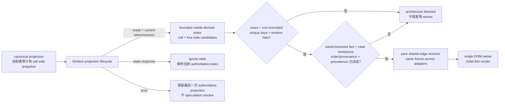
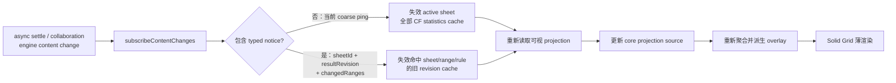
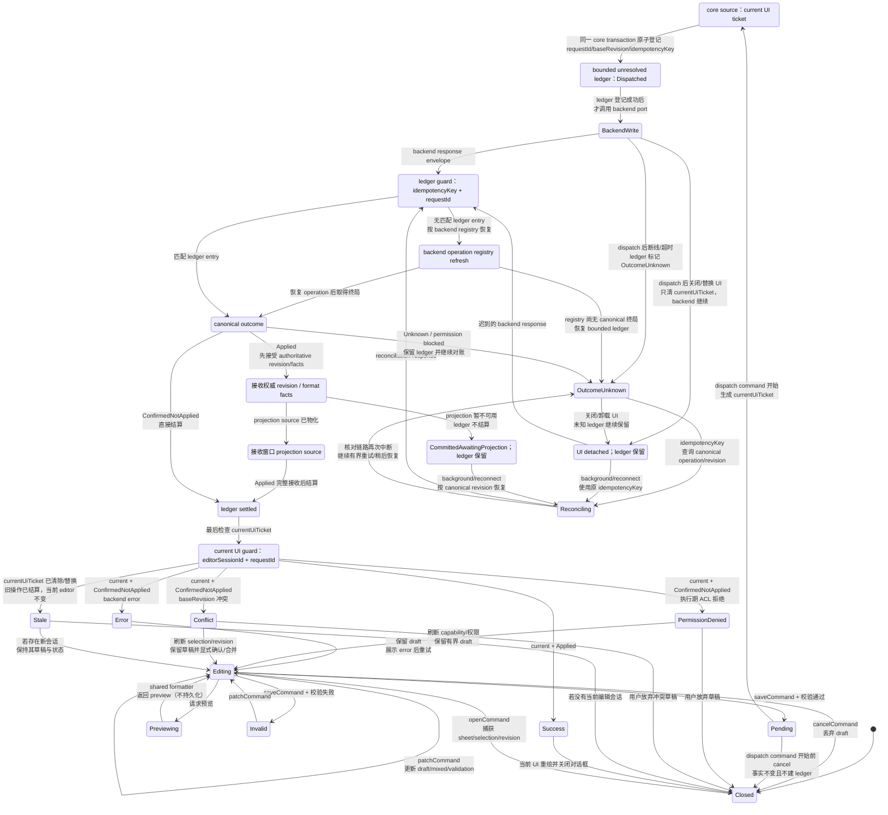
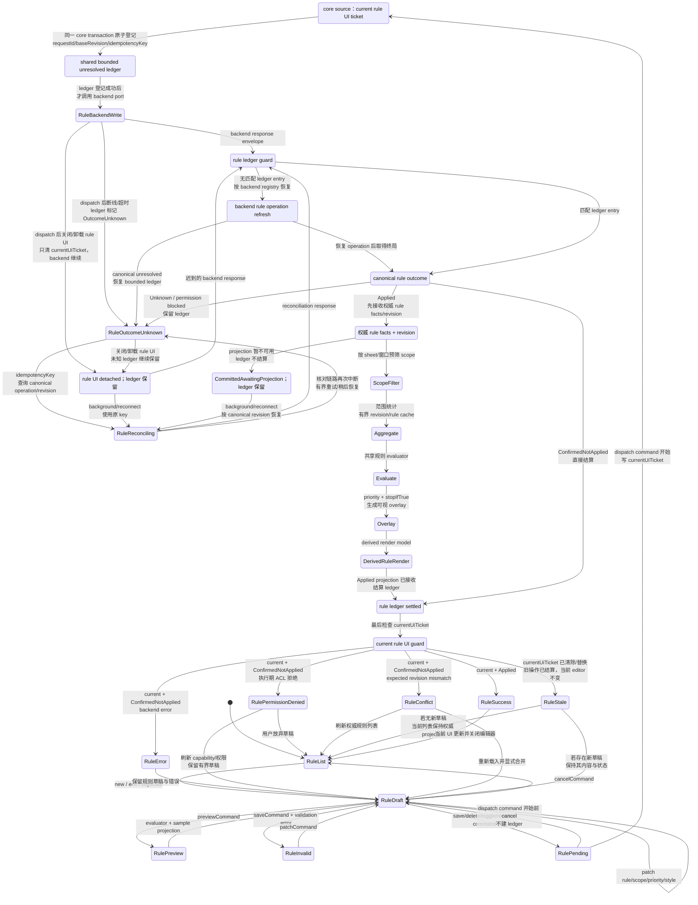

# 在线 Excel 功能对齐：04 单元格格式

> 版本：2026-07-13 现状审计稿
> 当前工作树架构复核：2026-07-14
> 共享边框架构阻断复核：2026-07-16
> #20 Static Wave5 visible witness 复核：2026-07-17
> 主交付窗口：2026-07-20 ～ 2026-08-07
> 后续增强窗口：2026-08-10 ～ 2026-08-21
> 估算口径：1 人日 = 1 名工程师 1 个完整工作日；估算含实现、自测和代码评审，不含跨组等待时间。

> 架构审查：目标设计以 `@einfach/core` 为唯一前端产品状态核心。当前工作树中的条件格式对话框已移除业务 `createSignal`，`selectedKind` 与草稿由 core atom 承载；但 pending/error 仍混在 editor draft 中，Solid 组件仍直接编排 backend 异步调用，因此还不是薄绑定。加上工具栏部分产品态弹层开关仍在组件中，本组只能标记为“部分收口”；当前条件格式迁移 diff 的主审结论是 `MainReview → Rework`。

## 1. 结论

当前版本已经具备一条可工作的基础格式链路：工具栏、格式对话框、网格投影、共享数字格式解析器、static/worker 后端，以及基础条件格式入口均已存在；加粗、斜体、颜色、基础对齐、换行、旋转、数字格式、格式刷和清除格式等也已有测试覆盖。#20 还新增了 default/empty source 捕获 `{}` 后清除 formatted target 基础格式的 visible-only Static Wave5 限定见证，但这不是 Worker parity。四边边框也已从单纯的 `data-borders` 标记推进为按本格 `DisplayCell.format.borders` 绘制 overlay，但相邻两格仍会为同一物理边各绘制一条线。

但它还不能视为“在线 Excel 单元格格式完成”，主要阻断项有四个：

1. 单格四边已经真实绘制，但共享边没有已冻结的 owner/优先级规则；例如 `A1.right` 与 `B1.left` 会形成两个 overlay，当前可见 winner 依赖 DOM/stacking 偶然性，冻结分隔线还可能覆盖数据边框。
2. “设置单元格格式”虽展示 12 类数字格式，但其中 7 类保存时被降级为 `general`，预览也没有复用真实格式化引擎。
3. 工作簿和单元格的 `locale` 后端已支持，前端没有完整入口；自定义格式缺少编辑、校验和真实预览闭环。
4. 条件格式只有五类模型和基本对话框骨架。static/worker 的公式、数据条、色阶、Top/Bottom 仍是占位语义，规则管理、优先级、范围编辑和图形效果未完成。

因此主窗口先完成 P0/P1，使“基础格式真实可见、可编辑、可回读，static/worker 结果一致”；高级文字/填充效果、图标集和样式库进入紧接主窗口的 P2，不挤压主链路质量。

## 2. 范围边界

### 2.1 本计划负责

- 字体、字号、字形、文字颜色与填充色。
- 四边边框、边框预设、线型/颜色和真实网格绘制。
- 水平/垂直对齐、缩进、换行、旋转、溢出、缩小字体填充。
- 12 类数字格式、工作簿/单元格 locale、自定义格式与预览。
- “设置单元格格式”对话框的完整映射、混合值、校验、保存与错误反馈。
- 条件格式的语义、规则管理、显示效果、static/worker 一致性。
- 格式刷、清除格式、快捷键、撤销/重做的格式回归保护。
- 与合并单元格、冻结区、缩放和虚拟滚动交叉处的格式呈现。

### 2.2 明确不负责

- **第 9 组“数据分析”完全延后**：分析工具、数据透视、预测、假设分析等不进入本排期。排序/筛选归第 6 组单独排期；数据验证也不由本格式计划实施。
- **第 16 组“打印”完全延后**：打印、PDF、分页、页眉页脚、打印区域与页面布局不进入本排期。
- 单元格保护、公式隐藏和权限归属保护/协作组。
- 图表、图片、批注、富文本分段编辑，以及导入导出的完整样式保真。
- 本文档不修改源码；它只定义后续实现计划与验收门槛。

## 3. 功能点现状表

状态说明：`已实现` 只用于同时满足默认入口、static/worker 语义、状态恢复和完整自动化证据的闭环；`部分实现` 表示已有模型、入口、映射或测试，但仍缺完整完成定义；`未实现` 表示没有可用闭环；`待复核` 表示已有实现但必须补强真实视觉或跨后端证据。仅有类型映射或单条 E2E 不计“已实现”。

| 功能域     | 功能点                                         | 当前状态 | 现状与证据                                                                                                                                                                                                                                                                          | 目标优先级  |
| ---------- | ---------------------------------------------- | -------- | ----------------------------------------------------------------------------------------------------------------------------------------------------------------------------------------------------------------------------------------------------------------------------------- | ----------- |
| 字体       | 字体族、字号、增大/减小字号                    | 部分实现 | Toolbar、Format Cells 和 Grid 均有映射并有字体类 E2E；仍需完整双后端与默认入口回归                                                                                                                                                                                                  | P1 回归     |
| 字体       | 加粗、斜体、删除线                             | 部分实现 | `SpreadsheetGrid.tsx` 已映射样式，工具栏与审计 E2E 已覆盖；尚未满足统一完成定义                                                                                                                                                                                                     | P1 回归     |
| 字体       | 单下划线                                       | 部分实现 | 当前为 boolean，网格只绘制单下划线；高级语义及跨后端证据不完整                                                                                                                                                                                                                      | P1 回归     |
| 字体       | 双下划线、会计下划线                           | 未实现   | 后端格式契约没有下划线样式枚举                                                                                                                                                                                                                                                      | P2          |
| 字体       | 文字颜色                                       | 部分实现 | 工具栏/对话框可写入 `foregroundColor`，网格可显示；仍需完整双后端验收                                                                                                                                                                                                               | P1 回归     |
| 字体       | 上标、下标                                     | 部分实现 | 仅存在 `FormatCellsDraftExtras.verticalScript`，未进入后端契约和网格渲染                                                                                                                                                                                                            | P2          |
| 字体       | 文字方向                                       | 部分实现 | 仅编辑器草稿字段，未保证 static/worker 回读和渲染                                                                                                                                                                                                                                   | P2          |
| 填充       | 纯色填充、无填充                               | 部分实现 | `backgroundColor` 已进入格式与网格投影；仍需默认入口和跨后端完整证据                                                                                                                                                                                                                | P1 回归     |
| 填充       | 图案填充                                       | 部分实现 | 对话框草稿存在 `fillPattern`，后端契约与网格未承接                                                                                                                                                                                                                                  | P2          |
| 填充       | 渐变填充                                       | 部分实现 | 对话框草稿存在 `fillGradient`，尚无持久化/渲染闭环                                                                                                                                                                                                                                  | P2          |
| 边框       | 上/右/下/左四边格式模型                        | 部分实现 | `SpreadsheetCellFormat.borders` 已有四边及线型、颜色；`SpreadsheetCellBorders` 已从本格 canonical projection 绘制四边，仍缺完整默认入口与 static/worker round-trip                                                                                                                  | P0 回归     |
| 边框       | 外框、全框、内部、单边、清除等工具栏预设       | 部分实现 | 写入链路和单格 overlay 已存在；共享边、清除语义与跨后端视觉证据未闭环                                                                                                                                                                                                               | P0          |
| 边框       | 线型与颜色                                     | 部分实现 | 网格 overlay 已映射线型/颜色；Format Cells 预览仍硬编码 `1px solid #333`                                                                                                                                                                                                            | P0          |
| 边框       | 网格真实绘制                                   | 部分实现 | 已按本格四边输出真实 overlay；相邻格会对同一物理边双重绘制，尚不能声称共享边结果确定                                                                                                                                                                                                | P0          |
| 边框       | 相邻边冲突、合并/冻结区边界                    | 未实现   | owner、omitted/`none`、style/color/tie/write-order 均未冻结；冻结 seam 还可能被更高 z-index 分隔线覆盖                                                                                                                                                                              | P0/P1       |
| 边框       | 对角线边框                                     | 未实现   | 当前格式契约仅四边                                                                                                                                                                                                                                                                  | P2          |
| 对齐       | 左/中/右、常规、填充                           | 部分实现 | 基础水平对齐可显示；`fill` 仅 best-effort 回退为 left                                                                                                                                                                                                                               | P1/P2       |
| 对齐       | 顶端/居中/底端                                 | 部分实现 | 网格已映射 `verticalAlign`；双后端、状态恢复与完整回归证据待补                                                                                                                                                                                                                      | P1 回归     |
| 对齐       | 两端对齐、分散对齐                             | 部分实现 | 类型/入口不完整，缺少真实布局语义                                                                                                                                                                                                                                                   | P2          |
| 对齐       | 自动换行                                       | 部分实现 | `wrap` 已有网格映射和 E2E；仍需完成统一完成定义                                                                                                                                                                                                                                     | P1 回归     |
| 对齐       | 溢出、裁剪、省略                               | 部分实现 | 有基本映射；需与相邻非空单元格、合并区和虚拟化统一                                                                                                                                                                                                                                  | P1          |
| 对齐       | 缩小字体填充                                   | 部分实现 | 目前为标记性支持，没有按可用宽度测量并缩放                                                                                                                                                                                                                                          | P2          |
| 对齐       | 缩进                                           | 部分实现 | `indent` 已映射为像素偏移；跨后端持久化与完整回归待补                                                                                                                                                                                                                               | P1 回归     |
| 对齐       | 旋转、竖排文本                                 | 部分实现 | 旋转可用；竖排与高度/命中区仍需视觉验证                                                                                                                                                                                                                                             | P1/P2       |
| 数字格式   | 常规、数值、货币、日期、百分比                 | 部分实现 | 工具栏和共享 `formatNumberValue` 链路可用；locale、三后端及完整验收未闭环                                                                                                                                                                                                           | P0/P1 回归  |
| 数字格式   | 会计、时间、分数、科学计数、文本、特殊、自定义 | 部分实现 | 核心类型和解析器支持，但 Format Cells 保存时全部降级成 `general`                                                                                                                                                                                                                    | P0          |
| 数字格式   | 千分位、增减小数位、负数显示                   | 部分实现 | 基础快捷操作存在；完整属性和负数样式 UI 未闭环                                                                                                                                                                                                                                      | P1          |
| 数字格式   | 工作簿 locale                                  | 部分实现 | `workbookLocaleAtom` 与后端回退已存在，Solid UI 无完整绑定                                                                                                                                                                                                                          | P1          |
| 数字格式   | 单元格 locale 覆盖                             | 部分实现 | `SpreadsheetCellFormat.locale` 已存在；UI、默认值与回读不完整                                                                                                                                                                                                                       | P1          |
| 数字格式   | 自定义格式编辑/校验/预览                       | 部分实现 | 解析器已支持 section、条件、颜色、日期、分数、科学计数等；UI 未形成闭环                                                                                                                                                                                                             | P1          |
| 数字格式   | 格式预览与网格结果同源                         | 未实现   | 对话框预览为手写示例，没有调用共享格式化引擎                                                                                                                                                                                                                                        | P0          |
| 格式对话框 | 数字、对齐、字体、边框、填充五页签             | 部分实现 | 五页签已存在，部分字段仅草稿态或预览态                                                                                                                                                                                                                                              | P0/P1       |
| 格式对话框 | 多选区域混合值                                 | 部分实现 | 需要明确 mixed/unchanged/explicit 三态，避免覆盖未修改属性                                                                                                                                                                                                                          | P1          |
| 格式对话框 | 保存中、失败、字段校验                         | 部分实现 | 宿主直接调用 backend 且吞掉错误；没有统一 pending/error atom                                                                                                                                                                                                                        | P0          |
| 格式对话框 | 格式归一化/克隆完整性                          | 部分实现 | `normalizeFormat` 未完整考虑 overflow、shrinkToFit、locale 和高级字段；嵌套对象克隆也不完整                                                                                                                                                                                         | P0          |
| 条件格式   | 单元格值比较                                   | 部分实现 | 类型和基础 evaluator 存在，UI 不能配置完整 operator/value                                                                                                                                                                                                                           | P0/P1       |
| 条件格式   | 公式规则                                       | 部分实现 | 当前 static/worker 以“公式非空”代替真实求值                                                                                                                                                                                                                                         | P0          |
| 条件格式   | 数据条                                         | 部分实现 | 数值单元格全匹配，投影仅叠加纯色，没有长度比例                                                                                                                                                                                                                                      | P1          |
| 条件格式   | 色阶                                           | 部分实现 | 数值单元格全匹配，只使用一个最大背景色，没有区间插值                                                                                                                                                                                                                                | P1          |
| 条件格式   | Top/Bottom、百分比                             | 部分实现 | 模型存在但没有集合统计语义，数值单元格全匹配                                                                                                                                                                                                                                        | P0/P1       |
| 条件格式   | 规则列表、编辑、删除、复制、启停               | 部分实现 | 列表只读；仅能移除当前草稿，不能完整管理规则                                                                                                                                                                                                                                        | P1          |
| 条件格式   | 范围、优先级、重排、停止后续规则               | 部分实现 | 模型有 scope/priority；UI 和 stop-if-true 语义缺失                                                                                                                                                                                                                                  | P1          |
| 条件格式   | 文本、日期、重复/唯一、平均值                  | 未实现   | 现有五类规则没有覆盖                                                                                                                                                                                                                                                                | P2          |
| 条件格式   | 图标集                                         | 未实现   | 类型、编辑器、投影和渲染均缺失                                                                                                                                                                                                                                                      | P2          |
| 通用操作   | 格式刷                                         | 部分实现 | 已有 Core-owned lifecycle、Solid 薄桥与 E2E；新增 default/empty C2 `{}` → formatted B2 清除粗体的 visible-only Static witness，owner 与独立复核各在 wasm/ts Playwright 项目合计 12/12，但两项目复用同一 Static backend；仍缺 Worker/真实 transport parity、失败恢复全矩阵与系统门禁 | P1 回归     |
| 通用操作   | 清除格式                                       | 部分实现 | 已有工具栏和 E2E 覆盖；仍需双后端、失败恢复和默认入口完成定义                                                                                                                                                                                                                       | P1 回归     |
| 通用操作   | Ctrl+1 与常用格式快捷键                        | 部分实现 | 审计 E2E 已覆盖基础入口；完整快捷键矩阵和跨后端证据待补                                                                                                                                                                                                                             | P1 回归     |
| 通用操作   | 撤销/重做格式变更                              | 待复核   | 依赖通用操作历史；需覆盖对话框批量提交和条件规则变更                                                                                                                                                                                                                                | P1          |
| 样式       | 预设单元格样式/命名样式/主题                   | 未实现   | 当前没有 Excel 式样式库和主题 token 闭环                                                                                                                                                                                                                                            | P2 后续评审 |

本次四边 overlay 证据不改变总账状态：功能组 #04 与其交叉验收项 #23 均保持 `部分实现（Partial）`。共享边决胜规则未冻结之前，不得用浏览器碰巧显示出的某一条线升级状态。

### Format Painter default-source lifecycle

这是 #20 当前状态流的唯一规范源。默认/空 source 捕获的 `{}` 是“清除 target 基础格式”的有效 payload，不是无效输入或 no-op。UI-core / `@einfach/core` 是唯一状态中心；Solid 只转发可见事件、读取只读投影并渲染，不保留第二份格式刷 lifecycle。

```mermaid
stateDiagram-v2
  [*] --> Idle
  state "capture {} (default / empty source)" as CapturedEmpty
  state "armed / ready\nCore owner retained" as ArmedReady
  state "target selected\napply event" as Targeted
  state "pending immutable ticket" as Pending
  state "exact ACK\nsheetId + requestId + affectedRange" as ExactAck
  state "local-acknowledged\nsingle-click mode closes; ticket retained" as LocalAck
  state "canonical projection refresh\nticket retained" as CanonicalRefresh
  state "settled idle" as SettledIdle
  state "outcome-unknown-blocked\nno inferred applied" as OutcomeUnknown
  state "honest-local-projection-unknown\nACK kept; local projection unknown" as ProjectionUnknown

  Idle --> CapturedEmpty: visible source has no format override
  CapturedEmpty --> ArmedReady: single-click painter
  ArmedReady --> Targeted: visible target selection
  Targeted --> ArmedReady: blocked / preflight-failed result; zero dispatch
  Targeted --> Pending: preflight passes; dispatch
  Pending --> ExactAck: exact correlation
  Pending --> OutcomeUnknown: reject / timeout / mismatched ACK
  ExactAck --> LocalAck: ledger local-acknowledged
  LocalAck --> CanonicalRefresh: keep immutable ticket
  CanonicalRefresh --> SettledIdle: refresh fulfilled
  CanonicalRefresh --> ProjectionUnknown: reject / timeout / reentrant refresh
  SettledIdle --> [*]
```

单击模式在 exact ACK 后就把对外 painter 状态收回 `idle`，但 immutable ticket 会保留到 canonical projection refresh 完成；图中的最终 `settled idle` 专指 refresh fulfilled 后 ticket 已清除。apply 直接返回 `blocked` 时通常是零状态迁移；`preflightFailure` 把 phase 留在/设回 `ready`、`blocked=false` 并保留 armed/sticky owner，二者都零 dispatch，因此图中将其画回 `ArmedReady`，不虚构一个 blocked atom phase。dispatch 后的 reject、timeout 或不匹配 ACK 才进入真实的 `outcome-unknown-blocked`；refresh reject、timeout 或 reentrant 才进入真实的 `honest-local-projection-unknown` 并保留 ACK。当前源码没有从这两个 blocked phase 发起 canonical reconciliation / refresh retry 的 command，所以图中不画回边；显式恢复能力属于后续必补项，当前不得猜测 applied 或伪装成功。

Static Wave5 visible-only 见证使用可见 UI 先把 B2 设为粗体，再从无格式覆盖的 C2 捕获 `{}`，经可见 Format Painter 选择 B2 后确认粗体被清除，且按钮 `aria-pressed` 按 `false → true → false` 流转、console error 为 0。owner 与独立复核都在 `wasm` / `ts` 两个 Playwright 项目标签下合计 **12/12**；两个项目实际都由 `VNextWave5Demo` 的同一 Static backend 驱动，因此只能登记 Static 见证，绝不能登记为 TS/WASM/Worker parity。#20 继续为 `Partial`；严格 41 项总账不变，第 9 组数据分析与第 16 组打印仍完全延后且在 41 项外。

## 4. 关键代码证据与缺口

| 层级           | 文件/模块                                                                             | 已有基础                                                                                                                                   | 必须修复的缺口                                                                                                                      |
| -------------- | ------------------------------------------------------------------------------------- | ------------------------------------------------------------------------------------------------------------------------------------------ | ----------------------------------------------------------------------------------------------------------------------------------- |
| 格式契约       | `excel/spreadsheet-ui-core/src/backend/types.ts`                                    | 数字格式 12 类；常用字体、对齐、四边边框、locale                                                                                           | 高级效果只在草稿层；需补齐类型版本、默认值和 round-trip 规则                                                                        |
| 格式归一化     | `excel/spreadsheet-ui-core/src/backend/projection-helpers.ts`                       | 有 `normalizeFormat`/克隆与条件覆盖合并                                                                                                    | 默认判断漏掉 `overflow`、`shrinkToFit`、`locale` 等；嵌套字段需深克隆                                                               |
| 格式对话框状态 | `excel/spreadsheet-ui-core/src/format-cells/index.ts`                               | 已使用 Einfach atom，具备 open/patch/save 命令                                                                                             | 需增加 mixed、validation、pending、error 和原子化提交语义                                                                           |
| 格式对话框 UI  | `excel/solid-excel/src-vnext/format-cells/SpreadsheetFormatCellsDialog.tsx`                 | 五页签和大部分基础控件已存在                                                                                                               | 7 类数字格式降级为 `general`；预览不同源；保存错误被吞掉                                                                            |
| 网格样式       | `excel/solid-excel/src-vnext/grid/SpreadsheetGrid.tsx`、`SpreadsheetCellBorders.tsx`        | 字体、颜色、基础对齐、旋转、换行及本格四边 overlay 已映射                                                                                  | 共享边仍双 overlay 且依赖 DOM/stacking；冻结 seam 可遮挡；缩小填充/高级对齐不足                                                     |
| 数字格式       | `excel/spreadsheet-ui-core/src/operations/format/numberFormatParser.ts`             | 已支持多 section、条件/颜色、转义、日期时间、分数、科学计数及 locale                                                                       | 对话框需直接复用，不得再写一套 preview formatter                                                                                    |
| locale         | `excel/spreadsheet-ui-core/src/workspace/index.ts`、static/worker backend           | 工作簿 atom 和 `cell.locale ?? workbookLocale` 回退已存在                                                                                  | 前端选择、继承/覆盖提示、变更刷新和回读测试缺失                                                                                     |
| 条件格式状态   | `excel/spreadsheet-ui-core/src/conditional-formatting/*`                            | 五类规则、active-sheet cache、最多 200 条                                                                                                  | 不能静默截断；需完整 editor/manager 状态与命令 atom                                                                                 |
| 条件格式 UI    | `excel/solid-excel/src-vnext/conditional-formatting/SpreadsheetConditionalFormatDialog.tsx` | 当前工作树已用 core editor atom 保存类别与草稿，产品字段通过 hooks 读写                                                                    | `MainReview → Rework`：pending/error 与 draft 混放，Solid 仍直接调用 backend 并负责异步 lifecycle；参数、范围、优先级和规则管理缺失 |
| 条件格式执行   | static backend、worker backend、`projection-helpers.ts`                               | 规则可进入窗口投影，worker 已按窗口预筛范围                                                                                                | 多数规则仍为占位语义；static 每格重复排序；数据条/色阶退化为纯色                                                                    |
| 自动化         | core test、Solid test、`excel/solid-excel/e2e/*format*.spec.ts`                             | 基础格式、格式刷、条件入口、数字格式及单格四边 overlay 已有覆盖；#20 default/empty → formatted visible-only Static 见证 owner/独立各 12/12 | 共享边 single-owner、Worker/真实 transport 黄金用例、冻结 seam、失败恢复全矩阵与系统视觉门禁仍缺证据                                |

## 5. 目标与非目标

### 5.1 主窗口目标

截至 2026-08-07：

- 所有已暴露的基础格式控件都能“写入、保存、回读、真实显示”，不存在仅写测试属性的假实现。
- Format Cells 的 12 类数字格式不再错误降级；预览与网格使用同一纯函数及同一 locale。
- static 与 worker 对相同格式、相同条件规则、相同窗口投影产生一致结果。
- 条件格式完成可编辑规则闭环：新增、编辑、复制、删除、启停、范围、优先级和重排；五类现有规则具备真实语义。
- 所有产品状态使用 Einfach，动态状态有明确生命周期和有界缓存；滚动路径不扫描整张表。
- 单测、契约测试、视觉 E2E、MCP 浏览器验收和性能门槛全部通过。

### 5.2 非目标

- 主窗口不承诺一次完成全部桌面 Excel 高级格式；P2 项目单独交付，不能成为 P0/P1 上线阻塞。
- 不重写数字格式解析器，不复制 static/worker 两套 evaluator。
- 不把整张工作表或每个单元格建成 atom，不以无界 Map 缓存格式结果。
- 不以 `data-*`、marker 或手写 preview 代替用户实际可见行为。
- 数据分析和打印不接受任何顺手开发；发现依赖时只登记阻断事实，不设计接口、不实现兼容层，也不扩展范围。

## 6. 优先级

### P0：阻断正确性，主窗口必须完成

1. 保持已落地的本格四边真实绘制；先冻结共享边架构决策，再实现 single-owner 决胜、清除与相邻边冲突。
2. 修复 Format Cells 的 12 类数字格式映射和同源预览。
3. 修复格式归一化、深克隆、patch/clear 和 static/worker round-trip。
4. 将 Format Cells 的校验、保存中、失败反馈建模到 Einfach。
5. 保持条件格式对话框不再使用业务 `createSignal`；把 editor draft、current UI ticket 和有界 unresolved ledger 分层，并将 backend 副作用收口到 command/write atom。
6. 完成 cell-value、formula、Top/Bottom 的真实语义；统一 static/worker evaluator。
7. 建立跨后端契约测试，杜绝相同工作簿在两种 adapter 下显示不同。

### P1：主窗口应完成

1. locale 继承/覆盖入口，自定义格式编辑、校验、真实预览和最近使用。
2. 数据条比例渲染、色阶插值和阈值配置。
3. 条件规则管理器：范围、优先级、重排、复制、启停、错误状态。
4. 多选区域 mixed-state、批量应用和撤销/重做原子提交。
5. 边框与合并、冻结、缩放、虚拟滚动的视觉回归。
6. 对已有字体、填充、对齐、换行、旋转、格式刷和清除格式补齐回归矩阵。

### P2：2026-08-10 起的增强窗口

1. 双/会计下划线、上标/下标、文字方向。
2. 图案/渐变填充、对角线边框。
3. 真实 shrink-to-fit、fill/justify/distributed、复杂竖排文本。
4. 文本/日期/重复唯一/平均值条件、图标集、`stopIfTrue` 的完整交互。
5. 预设单元格样式、命名样式和主题 token；该项先做设计评审，再决定是否并入格式组。

## 7. 实施架构

### 7.1 分层落点

| 层           | 建议落点                                                                        | 职责                                                                              |
| ------------ | ------------------------------------------------------------------------------- | --------------------------------------------------------------------------------- |
| 领域类型     | `excel/spreadsheet-ui-core/src/backend/types.ts`                              | 可持久化格式契约、版本兼容和默认值                                                |
| 格式纯函数   | `excel/spreadsheet-ui-core/src/operations/format/*`                           | normalize、clone、patch、数字格式；共享边 resolver 的归属须由架构决策冻结后再落位 |
| 条件规则引擎 | `excel/spreadsheet-ui-core/src/conditional-formatting/*`                      | 规则校验、集合统计、求值、overlay 生成；static/worker 共用                        |
| 编辑器状态   | `excel/spreadsheet-ui-core/src/format-cells/*`、`conditional-formatting/*`    | Einfach atom、derived atom、命令 atom、校验/提交状态                              |
| 后端适配     | static/worker backend                                                           | 只负责取数、revision、窗口和 I/O；不得复制业务语义                                |
| Solid 宿主   | `excel/solid-excel/src-vnext/format-cells/*`、`conditional-formatting/*`、`toolbar/*` | 订阅 atom、发送命令、渲染可访问 UI                                                |
| 网格投影     | `excel/solid-excel/src-vnext/grid/*`                                                  | 将投影结果变为 DOM；建议拆出 `cell-format-style.ts` 和边框 overlay 组件           |
| 测试         | core test、Solid unit、`excel/solid-excel/e2e`                                        | 纯函数、状态、adapter 契约、真实视觉、性能与控制台验收                            |

### 7.2 边框绘制原则

- 已落地的 `SpreadsheetCellBorders` 使用不参与表格布局的四边 overlay，并按本格的 `DisplayCell.format.borders` 独立映射 `none/thin/medium/thick/dashed/dotted/double` 与颜色。
- 这只是单格绘制基线，不是共享边 resolver。`A1.right` 与 `B1.left` 同时存在时会生成两个 overlay；当前 winner 由 DOM 顺序、stacking context 和像素覆盖偶然决定。冻结 seam 的更高层分隔线也可能遮住数据边框。
- 现阶段是**架构决策阻断**：不得把“最后写入”“粗线优先”“某一坐标优先”或“由每个 adapter 自行决定”当作既定规则。实现前必须由格式组 owner 冻结一份跨 static/worker/renderer 共用的 policy 与 fixture。
- 部分写入入口可以用删除 side/字段表达 clear；某个 patch 入口里的 omitted 也可能表示“不改写”。这只是**写入阶段的入口语义**。进入当前 canonical visible projection 后通常只剩 side absent，既没有 clear tombstone，也没有来源与写入顺序，无法区分 never proposed、explicit clear 或后续覆盖；因此不得从 `omitted`、`none` 或字段缺失自行推导 veto、优先级或显示 winner。
- 共享边 resolver 必须是无副作用纯函数，并且只能消费 canonical 层已确认的 per-edge owner/resolved fact；不得从相邻两格的现有 side snapshot 反推丢失的 clear、顺序或来源。Solid 只渲染最终的 single-owner 结果，不新增本地产品状态，也不让 stale/error 响应驱动推测性边框。

最小架构决策表如下。表内是必须冻结的问题，不是本文替产品选择的答案：

| 决策维度                                          | 必须明确的选项/契约                                                                                                   | 未冻结时的风险                                                        |
| ------------------------------------------------- | --------------------------------------------------------------------------------------------------------------------- | --------------------------------------------------------------------- |
| per-edge owner / resolved fact                    | canonical projection 为每条逻辑共享边给出唯一 edge key、最终 owner 与 resolved border fact；水平/垂直方向使用同一合同 | 两个 overlay 继续竞争，或 renderer 从相邻 cell snapshot 各自猜 winner |
| clear tombstone                                   | explicit clear 必须有可投影的 tombstone/等价 canonical fact，并与 never proposed、字段缺失区分                        | projection 只剩 side absent，无法判断 clear 是否具有否决含义          |
| style/color/tie                                   | `thin/medium/thick/dashed/dotted/double`、`weight`、颜色与完全同级冲突如何解析，结果由 canonical resolved fact 承载   | adapter/renderer 各自定义优先级，同一工作簿显示不同                   |
| write order / provenance                          | 若策略依赖 last-write，必须携带稳定、可重放的顺序与来源；若不依赖，也要由合同明确排除                                 | 仅靠当前格式对象无法复现先后，ABA、重载或跨 adapter 后翻转            |
| exact projection / duplicate reject               | 响应必须声明 exact、non-truncated 的合同范围；重复 cell/edge key 必须整体拒绝，不能 last-one-wins 或静默去重          | 半份窗口或重复事实被误当 authoritative，产生非确定 owner              |
| window halo                                       | 可视窗口必须连同足够的相邻行列/edge halo 一起投影，并明确工作表外边界                                                 | 窗口边缘缺邻格时，同一条边随滚动进入/离开窗口而翻转                   |
| merge/freeze/hidden/filter/conditional precedence | 明确合并格外框、冻结 seam、隐藏/筛选行列与条件格式 overlay 相对数据 border 的 owner、裁剪和层级                       | 普通格 resolver 正确，特殊边界仍重复、丢失或被偶然遮挡                |

策略冻结后的第一刀只能是有界切片：当前可视窗口加明确 halo、相邻两格都在 exact/non-truncated derived index、无重复 key、未合并、未冻结、行列未隐藏/筛选且无条件格式边框覆盖的普通单元格。merge、freeze seam、hidden/filtered row/column、conditional overlay 与窗口外 shared edge 必须先补相应 canonical precedence、邻接/halo 与 owner 规则，不能沿用 DOM 猜测。

共享边状态流必须沿用 Einfach 的 canonical projection 生命周期：

只有 `ready + current revision` 能进入校验；还必须确认 exact/non-truncated 范围、拒绝重复 key、取得窗口 halo，并由 canonical contract 给出 per-edge owner/resolved fact、clear tombstone、稳定 order/provenance 与特殊区域 precedence，才能渲染 single-owner 结果。stale 结果直接忽略，error 保留最后一次权威投影并呈现既有状态，不从半份/失败响应合成新边框。当前这些合同未冻结且 projection 信息不足，因此图中的 `BLOCKED` 是真实状态，#04/#23 仍为 `Partial`；本文不宣告实现完成。

### 7.3 Einfach-only 状态模型

- 扩展 `formatCellsEditorAtom`：只保存当前编辑会话的 `sessionId`、`selectionSnapshot`、各页签 mixed 值、`draft`、`validationErrors` 和 `dirty`；保存成功后由命令 atom 原子关闭，失败保留草稿。不得在这里复制 mutation ticket、未决 ledger 或 backend revision。
- 新建/扩展 `conditionalFormatEditorAtom`：只保存当前规则编辑会话的 `sessionId`、`mode`、`selectedRuleId`、`draft` 和 `dirty`；新增 open/patch/save/delete/duplicate/toggle/reorder 命令 atom。pending/error/unknown/reconciling 由 mutation source 派生，不在两个 editor atom 各存一份。
- 在 `excel/spreadsheet-ui-core` 新增 framework-agnostic `formatMutationSourceAtom`，使用 `@einfach/core` 定义，作为当前 UI 写入票据的唯一 source。它只保存 `currentUiTicket` 与该票据的当前结果；ticket 至少包含 `editorSessionId`、`operationKind`、`workbookId`、`sheetId`、`requestId`、`baseRevision`、`idempotencyKey` 和 dispatch phase。command atom 是唯一写入者；关闭或替换编辑会话只清理/替换 `currentUiTicket`，不得据此结算后台操作。
- 独立新增 `formatMutationUnresolvedLedgerAtom`，按 `idempotencyKey` 保存已经跨过 dispatch boundary、但尚未安全回收的紧凑记录：上述 ticket 字段、`Dispatched | OutcomeUnknown | Reconciling | PermissionBlocked | CommittedAwaitingProjection` phase、重试次数和最近对账时间；不保存格式 draft、规则正文或单元格矩阵。ledger 每 workbook 最多 64 条，达到上限时阻止新的格式 mutation 并优先对账，绝不能 LRU 淘汰未知结果或换新 key 盲重放。
- dispatch write atom 必须在调用 backend port 前，把 `formatMutationSourceAtom.currentUiTicket` 与同一 ticket 的 bounded unresolved ledger 记录作为一次 core 原子写入；完成登记后才允许跨过 dispatch boundary。只有 canonical `Applied` 的权威 revision、facts 与 projection source 均已接收，或 backend 明确确认 `ConfirmedNotApplied` 时才删除 ledger 条目；超时、断线、取消请求、stale UI ticket 或对账期权限撤销都不能删除。
- backend 的幂等 operation registry/工作簿存储是 dispatched mutation 的持久事实源，static/worker 都必须支持按 workbook 和原 `idempotencyKey` 查询/恢复。编辑器关闭只解除 UI ticket；工作簿重新 attach 或重连时，先从 backend 恢复未决操作到有界 ledger，再启用新 mutation。
- `formatCellsEditorStatusAtom` 和 `conditionalFormatEditorStatusAtom` 是 derived atoms：只有 `editorSessionId + requestId` 仍匹配 `currentUiTicket` 时，才把 pending/error/`OutcomeUnknown`/`Reconciling` 映射给当前 UI；stale 或已 detached 的票据只能结算 ledger 和刷新权威投影，不能覆盖新草稿。
- `SpreadsheetConditionalFormatDialog.tsx` 的 `selectedKind` 与草稿在当前工作树已迁入 core；这部分不得回退，但整份 diff 尚未通过主审。必须把 pending/error 从 editor draft 拆为 current UI ticket 的派生状态，把 backend 副作用移入 command/write atom，并用独立有界 unresolved ledger 保存已 dispatch、尚未权威结算的操作。Solid 本地信号只允许保存焦点、DOMRect、测量值等不可共享且短生命周期的视图瞬态。
- 工具栏的数字格式、边框、字体、对齐和旋转弹层开关进入 Einfach；锚点 DOMRect 保留在组件本地。
- 上述业务 atoms/commands 全部留在 framework-agnostic core；Solid 只通过 `@einfach/solid` Provider/hooks 订阅和派发。每个测试创建独立 `createStore()`，不依赖全局 store，验证打开、修改、校验、并发保存失败、重开与销毁生命周期。

### 7.4 有界缓存与可视投影

- 不为每个单元格创建 atom；单元格格式继续作为投影值对象传递。
- 条件格式规则按 sheet/revision 缓存，最多 200 条时不得静默截断；超限要返回可见诊断或拒绝新增。
- 范围统计缓存按 `sheetId + revision + ruleId` 建立有界 LRU，初始上限 128 项；sheet 关闭或 revision 变化时释放。
- 当前 `subscribeContentChanges(handler: () => void)` 只有无 payload 的 coarse ping，不能据此得知新 revision。端口升级前，收到 ping 必须保守失效 active sheet 的全部条件格式统计 cache，并重新读取可视 projection；不能继续复用旧 revision key。端口升级后统一携带 `sheetId + resultRevision + changedRanges? + cause`，按受影响范围精准失效。
- 文字测量只为 shrink-to-fit 等高级效果建立有界缓存，初始上限 4096 项，并在字体、列宽、revision 变化时失效。
- worker/static 都先把规则裁剪到可视投影窗口，再对相关范围聚合；滚动期间不得对全表、全部规则或全部单元格重复排序。
- 数据条、色阶等需要集合统计的规则分为“聚合阶段”和“可视 overlay 阶段”，不把全量单元格结果保存在 UI atom 中。

引擎自发内容变更不进入 mutation ledger；它只负责让现有 projection/cache 失效并重新读取：

这条 read/refetch 流与 mutation 的 `idempotencyKey → ledger/registry → canonical outcome` 流并存，不能用 push 猜测某次写入是否提交，也不能借 current UI ticket 丢弃引擎已经产生的新事实。

### 7.5 static/worker parity

- 抽出一个共享的纯规则 evaluator；static/worker 仅提供单元格读取、公式计算、revision 和范围窗口。
- 建立同一 fixture 双跑测试，逐项比对 normalized format、display text、conditional overlay、规则顺序和错误码。
- locale 解析统一走 `cell.format.locale ?? workbookLocale`；Format Cells preview 也调用相同入口。
- 公式条件必须使用现有公式求值/依赖能力，不允许继续把“非空公式字符串”视为 true。
- 所有新增契约先在 core 层定义，再同时接入 static/worker；禁止只补某一个 adapter。
- `subscribeContentChanges` 在 static/worker 使用同一 typed notice 契约；迁移期仍接受无 payload coarse ping，但 contract test 必须证明它会整表级失效 active sheet 的条件统计缓存，而不是复用旧 overlay。

### 7.6 格式编辑状态流转

以下各图都是待实现的目标状态机，不代表当前工作树已经闭环。格式编辑只有一套 framework-agnostic Einfach 状态：editor atom 保存草稿，`formatMutationSourceAtom` 保存 current UI ticket，`formatMutationUnresolvedLedgerAtom` 独立保存已派发未决操作；三者不能互相复制。预览读取 draft，但调用与 backend/grid 同源的纯格式函数；提交通过 command atom 串行化，并用打开对话框时捕获的 sheet/selection/revision 防止陈旧草稿覆盖新数据。

取消只允许发生在 dispatch command 开始前；同一 core transaction 必须先登记 current ticket 与 bounded unresolved ledger，随后才允许调用 backend。一旦 `BackendWrite` 已开始，关闭视图只能 detach：清除匹配的 `currentUiTicket`，但 ledger 和 backend operation record 必须保留。若写入最终成功，只能等待 canonical revision/facts/projection 接收完成后结算，并通过正常 undo transaction 回退；若连接中断且结果未知，ledger 必须进入 `OutcomeUnknown → Reconciling`，按原幂等键查询 canonical operation/revision，不得直接假定未提交。

普通响应和 reconcile 响应都先经过 ledger guard；本地记录缺失时必须从 backend operation registry 恢复紧凑记录，再取得 canonical outcome。`Applied` 必须先接受权威 revision、format facts 与 projection source，再结算 ledger；`ConfirmedNotApplied` 可以直接结算；`Unknown` 继续保留原 ledger 并对账。current UI guard 永远最后执行，只决定是否更新当前 editor。stale/detached 的已 dispatch mutation 绝不能被丢弃：它仍照常更新权威事实或确认未提交并结算自己的 ledger，只是不能关闭、报错或覆盖更新的编辑会话。

数据流对应关系：

```mermaid
flowchart LR
    UI[Toolbar / Format Cells UI] -->|open / patch / preview / save / cancel| CMD[Einfach command atoms]
    CMD -->|open / patch result| DRAFT[(editor atom<br/>sessionId + draft + mixed<br/>validation + snapshot)]
    DRAFT -->|saveCommand 读取草稿 / cancelCommand| CMD
    DRAFT --> PREVIEW[共享 normalize + formatNumberValue]
    PREVIEW --> UI
    CMD -->|创建 current UI ticket| SOURCE[(formatMutationSourceAtom)]
    SOURCE -->|同一 write atom 登记 Dispatched| LEDGER[(bounded unresolved ledger<br/>max 64 / workbook)]
    SOURCE --> STATUS[derived editor status]
    LEDGER --> STATUS
    STATUS --> UI
    LEDGER -->|normalized patch + 原 ticket| BACKEND[Backend port + persistent operation registry]
    BACKEND --> STATIC[Static adapter]
    BACKEND --> WORKER[Worker adapter]
    STATIC --> RESPONSE[response envelope]
    WORKER --> RESPONSE
    STATIC -->|dispatch 后断线/超时| UNKNOWN[outcome unknown]
    WORKER -->|dispatch 后断线/超时| UNKNOWN
    UNKNOWN -->|phase = OutcomeUnknown| LEDGER
    LEDGER -->|重连 / background resume| RECON[idempotency reconcile<br/>查询 canonical operation/revision]
    RECON -->|phase = Reconciling| LEDGER
    RECON --> RESPONSE
    RESPONSE --> LGUARD{idempotencyKey + requestId<br/>匹配 ledger entry?}
    LGUARD -->|否| RECOVER[按 backend operation registry<br/>恢复 bounded entry]
    RECOVER --> KIND{canonical outcome}
    LGUARD -->|是| KIND
    KIND -->|仍 unknown / permission blocked| LEDGER
    KIND -->|Applied| AUTH[接收 authoritative revision<br/>与 format facts]
    AUTH --> PROJ[接收窗口化 projection source]
    PROJ --> DERIVED[derived render model<br/>style + displayText + borders]
    DERIVED --> GRID[Grid UI]
    DERIVED --> SETA[结算 Applied ledger]
    KIND -->|ConfirmedNotApplied| SETN[结算 NotApplied ledger]
    SETA --> UGUARD{editorSessionId + requestId<br/>仍匹配 currentUiTicket?}
    SETN --> UGUARD
    UGUARD -->|否：stale/detached| OLDUI[旧操作已完成结算<br/>当前 editor 保持不变]
    UGUARD -->|是| UIOUTCOME{current UI outcome}
    UIOUTCOME -->|Applied：success / close| SOURCE
    UIOUTCOME -->|ConfirmedNotApplied：error/conflict/permission| SOURCE
```

### 7.7 条件格式规则流转

条件格式编辑器和规则列表共享同一套 `formatMutationSourceAtom`、`formatMutationUnresolvedLedgerAtom` 与 guard 语义，`operationKind` 区分 save/delete/toggle/reorder。规则 mutation 在 backend 调用前登记 ledger；普通/对账响应先匹配 ledger 或 backend registry，再取得 canonical outcome。`Applied` 先接收权威规则事实、revision 和窗口 projection，之后结算 ledger；`ConfirmedNotApplied` 直接结算；`Unknown` 保留 ledger。最后才用 current ticket 决定是否更新当前规则编辑器。匹配、集合统计和 overlay 均由共享引擎派生，不把每格结果写回 UI 状态。

规则求值链路：

```mermaid
flowchart LR
    MANAGER[Rule Manager UI] -->|command| RCMD[Einfach rule command atoms]
    RCMD -->|open / patch result| RSTATE[(rule editor atom<br/>sessionId + draft + dirty + snapshot)]
    RSTATE -->|save/delete/toggle/reorder command| RCMD
    RCMD -->|创建 current UI ticket| RSOURCE[(formatMutationSourceAtom)]
    RSOURCE -->|登记 Dispatched| RLEDGER[(shared bounded unresolved ledger)]
    RSOURCE --> RSTATUS[derived rule editor status]
    RLEDGER --> RSTATUS
    RSTATUS --> MANAGER
    RLEDGER -->|validated rule + 原 ticket| PORT[Conditional-format backend port]
    PORT --> RRESPONSE[response envelope]
    PORT -->|dispatch 后断线/超时| RUNKNOWN[outcome unknown]
    RUNKNOWN -->|phase = OutcomeUnknown| RLEDGER
    RLEDGER -->|重连 / background resume| RRECON[idempotency reconcile<br/>查询 canonical operation/revision]
    RRECON -->|phase = Reconciling| RLEDGER
    RRECON --> RRESPONSE
    RRESPONSE --> RLGUARD{idempotencyKey + requestId<br/>匹配 ledger entry?}
    RLGUARD -->|否| RRECOVER[按 backend registry<br/>恢复 bounded entry]
    RRECOVER --> RKIND{canonical outcome}
    RLGUARD -->|是| RKIND
    RKIND -->|仍 unknown / permission blocked| RLEDGER
    RKIND -->|Applied| RFACTS[接收 authoritative rule facts<br/>与 workbook revision]
    RFACTS --> WINDOW[规则 scope 与可视窗口求交]
    WINDOW --> AGG[共享聚合器<br/>min/max/rank/duplicates]
    AGG --> EVAL[共享 evaluator<br/>cell/formula/bar/scale/top-bottom]
    EVAL --> ORDER[priority / stopIfTrue]
    ORDER --> OVERLAY[接收窗口化 canonical overlay]
    OVERLAY --> RENDER[Derived Grid Render]
    RENDER --> GRIDUI[Grid UI]
    RENDER --> RSETTLEA[结算 Applied ledger]
    RKIND -->|ConfirmedNotApplied| RSETTLEN[结算 NotApplied ledger]
    RSETTLEA --> RUGUARD{editorSessionId + requestId<br/>仍匹配 currentUiTicket?}
    RSETTLEN --> RUGUARD
    RUGUARD -->|否：stale/detached| ROLDUI[旧操作已完成结算<br/>当前 rule editor 保持不变]
    RUGUARD -->|是| RUIOUTCOME{current rule UI outcome}
    RUIOUTCOME -->|Applied：success / close| RSOURCE
    RUIOUTCOME -->|ConfirmedNotApplied：error/conflict/permission| RSOURCE
    EVAL -->|sample only| RSTATE
```

## 8. 工作包与排期

并行建议：3 名工程师持续投入，主窗口约 **39 人日**，增强窗口约 **15 人日**。工作包可由独立子 agent/工程师负责，但跨层契约由格式组 owner 统一评审。

| 工作包                                         | 日期           | 人日 | 优先级 | 负责人建议         | 交付物                                                                                                                      | 前置/并行关系                                          |
| ---------------------------------------------- | -------------- | ---: | ------ | ------------------ | --------------------------------------------------------------------------------------------------------------------------- | ------------------------------------------------------ |
| WP0 现状基线与契约冻结                         | 07-20          |  1.5 | P0     | 三人共同（各 0.5） | 功能矩阵测试清单；12 类数字格式、格式字段和条件规则黄金 fixture                                                             | 首日完成，所有包共用                                   |
| WP1 格式 normalize/clone/patch 与 adapter 契约 | 07-20 ～ 07-22 |    3 | P0     | Agent A            | 修复遗漏字段、深克隆、clear/default；static/worker round-trip 双跑测试                                                      | 与 WP2/WP3 并行                                        |
| WP2 边框真实绘制                               | 07-20 ～ 07-23 |    4 | P0     | Agent B            | 复核四边 overlay；先产出 owner/none/style/color/tie/write-order 决策记录，再做有界 single-owner resolver；合并/冻结另行验收 | 依赖 WP0 且 policy 冻结；未冻结则阻断实现，不猜 winner |
| WP3 Einfach 编辑状态分层                       | 07-20 ～ 07-23 |  3.5 | P0     | Agent C            | 复核既有 core editor；拆分 current UI ticket；64 条未决 ledger/对账 guard；command 副作用收口；独立 store 测试              | 依赖 WP0                                               |
| WP4 Format Cells 数字格式与真实预览            | 07-23 ～ 07-28 |    4 | P0     | Agent A            | 12 类无降级映射、完整字段、共享 formatter preview、错误反馈                                                                 | 依赖 WP1/WP3                                           |
| WP5 locale 与自定义格式闭环                    | 07-29 ～ 08-03 |  3.5 | P1     | Agent A            | 工作簿/单元格继承 UI、自定义编辑/校验/最近使用、zh-CN/en-US 测试                                                            | 依赖 WP4                                               |
| WP6 条件格式共享 evaluator                     | 07-24 ～ 07-30 |    6 | P0/P1  | Agent B            | cell-value/formula/top-bottom 真语义；聚合接口；static/worker parity；性能基线                                              | 依赖 WP0/WP1，可与 WP4 并行                            |
| WP7 数据条/色阶真实 overlay                    | 07-31 ～ 08-04 |    3 | P1     | Agent B            | 数据条比例、色阶插值、阈值与最小/最大策略；窗口化渲染                                                                       | 依赖 WP6                                               |
| WP8 条件规则管理器                             | 07-27 ～ 08-03 |    5 | P1     | Agent C            | 新增/编辑/复制/删除/启停、范围、优先级、重排、错误/脏态                                                                     | 依赖 WP3；07-27 使用 WP6 冻结接口并行开发，08-03 联调  |
| WP9 交叉场景与回归收口                         | 08-04 ～ 08-06 |  3.5 | P1     | A/B/C              | mixed selection、undo/redo、格式刷、清除、合并/冻结/缩放矩阵                                                                | 依赖 WP2/4/5/7/8                                       |
| WP10 视觉、MCP、性能与发布门槛                 | 08-06 ～ 08-07 |    2 | P0/P1  | 三人共同           | Playwright 视觉基线、MCP 证据、console 清零、性能报告、遗留项登记                                                           | 主窗口最终门禁                                         |

主窗口节奏：

- **第 1 周（07-20 ～ 07-24）**：冻结契约，完成归一化修复、边框渲染和 Einfach 状态底座。
- **第 2 周（07-27 ～ 07-31）**：完成数字格式/locale/自定义格式闭环，以及条件格式共享语义。
- **第 3 周（08-03 ～ 08-07）**：完成规则管理器、数据条/色阶、跨场景回归、视觉/MCP/性能门禁。

### P2 增强窗口

| 工作包                        | 日期           | 人日 | 交付物                                                               |
| ----------------------------- | -------------- | ---: | -------------------------------------------------------------------- |
| WP11 高级字体与对齐           | 08-10 ～ 08-13 |    4 | 双/会计下划线、上下标、方向、真实 shrink-to-fit、justify/distributed |
| WP12 高级填充与边框           | 08-10 ～ 08-14 |    4 | 图案、渐变、对角线边框及 round-trip/视觉测试                         |
| WP13 高级条件格式             | 08-17 ～ 08-20 |    5 | 文本/日期/重复唯一/平均值、图标集、stop-if-true                      |
| WP14 样式库方案评审与最小实现 | 08-20 ～ 08-21 |    2 | 命名样式/主题契约 RFC；若评审通过，交付最小预设样式库                |

若主窗口出现 P0 延迟，WP11～WP14 顺延，不得以降低边框真实性、后端一致性或测试门槛换取日期。

## 9. 测试与验收

### 9.1 单元与状态测试

- `normalize/clone/patch/clear` 对每个格式字段做表驱动测试，包含“仅设置 locale/overflow/shrinkToFit”不被归一化丢失。
- 12 类数字格式使用真实值覆盖正数、负数、零、文本、日期序列、错误值和空值。
- 自定义格式覆盖多 section、颜色/条件、转义、日期时间、分数、科学计数和非法格式。
- 边框基线覆盖四边、每种线型、颜色和清除；共享边测试必须等 policy 冻结后使用同一决策 fixture，并分别覆盖有界普通格、合并区、冻结 seam、隐藏行列、窗口边缘与缩放。
- 条件规则覆盖每个 operator、空值/错误值、公式 true/false/错误、Top/Bottom 数量与百分比、并列值、色阶相同最小最大值。
- 条件格式缓存覆盖两种引擎推送：legacy coarse ping 使 active sheet 全部统计 key 失效；typed notice 只失效命中的 sheet/range/rule，随后基于 `resultRevision` 重建 overlay。
- 编辑器状态用独立 `createStore()` 验证 mixed、dirty、derived pending/error、失败重试、重开、切换 sheet 和卸载清理。
- mutation 状态测试必须覆盖：backend 调用前已原子登记 current ticket 与 ledger；dispatch command 开始前取消不建 ledger；dispatch 后关闭 UI 只清 current ticket；旧 ticket 的迟到 `Applied` 响应先接受权威 facts/revision/projection 再结算 ledger，且不覆盖新草稿；`ConfirmedNotApplied` 结算后才经过 current guard；`Unknown → Reconciling` 始终保留 ledger 并复用原 `idempotencyKey`；第 65 条 mutation 被阻止且未知记录不被淘汰；重连/重新 attach 能从 backend operation registry 恢复。

### 9.2 static/worker 契约测试

同一 fixture 在两种 adapter 下必须逐项一致：

- 保存后格式对象和再次读取结果。
- `displayText`、locale、custom pattern。
- 条件规则匹配集合、优先级、最终 overlay。
- 可视窗口前后滚动、冻结区、合并区和 revision 更新。
- 无效规则/格式的错误码和降级策略。
- 幂等 operation registry 的 `Dispatched`/`Unknown`/`Applied`/`ConfirmedNotApplied` 查询、恢复、权威 facts 与 revision 结果。

任何只在一个 adapter 通过的实现均不得合并。

### 9.3 DOM 与视觉 E2E

- 边框不再只断言 `data-borders`；单格检查实际 overlay/计算样式，共享边在 policy 冻结后还必须断言只有一个 DOM owner，并加入截图差异。
- 在 80%、100%、125% 缩放下覆盖普通区、冻结区、合并区、滚动后复用节点。
- 覆盖 Format Cells 五页签、混合选择、保存失败、重开回读，以及 zh-CN/en-US locale。
- 覆盖数据条长度、色阶端点/中点、规则重排、启停、范围变更和 overlay 叠加。
- 覆盖键盘入口、焦点返回、Esc/Enter、读屏标签和颜色/错误不只依赖视觉提示。

### 9.4 MCP 浏览器验收

每个 UI 工作包合并前执行 DeepFOS 前端验证流程：

1. 启动本地前端并记录准确 URL、路由和工作表 tab。
2. 优先使用 Playwright MCP；不可用时使用 Chrome DevTools MCP，并在记录中说明。
3. 复现新增/编辑/保存/滚动/重开的完整用户路径，不只看静态 DOM。
4. 强制刷新后再次验证，并检查相关 console warning/error、network failure 和浏览器 issues 为 0。
5. 保存关键截图与操作说明；验收完成后停止本地服务。

本文档阶段只做排期，不伪造 MCP 运行结果；上述证据由实现 PR 产出。

### 9.5 性能门槛

- 采用约定的大表 fixture：至少 100k 已用单元格、200 条条件规则、50×50 可视窗口。
- 连续滚动期间不得出现按整表单元格数线性增长的主线程工作；规则先按窗口/范围预筛。
- 相对基线的滚动 p95 不回退超过 10%；目标单次可视投影 p95 小于 30 ms，硬件与脚本固定后记录。
- 缓存上限通过测试可观测：规则聚合默认 ≤128 项，文本测量默认 ≤4096 项；切换 sheet/revision 后旧项可释放。
- 200 条规则超限必须给出可见错误，不允许 `slice` 静默丢规则。

## 10. 风险与缓解

| 风险                                 | 影响                             | 缓解措施                                                                  |
| ------------------------------------ | -------------------------------- | ------------------------------------------------------------------------- |
| CSS 表格边框互相吞边或改变布局       | 列宽抖动、冻结区错位、截图不稳定 | 使用绝对定位四边 overlay；先冻结共享边决胜规则                            |
| 格式类型新增后旧数据不兼容           | 读取失败或字段静默丢失           | 契约版本化、旧值归一化、static/worker 双向 fixture                        |
| 条件规则集合统计触发全表扫描         | 大表滚动卡顿                     | 聚合与可视 overlay 分阶段；按 revision/rule 有界缓存；性能门禁            |
| 引擎自发变更没有 revision payload    | 继续复用旧统计并显示陈旧 overlay | coarse ping 先整表级失效 active sheet；端口升级后按 typed notice 精准失效 |
| 公式条件与公式引擎耦合复杂           | 语义不一致、循环依赖             | 复用现有求值接口；错误值显式传播；禁止自建迷你公式解释器                  |
| UI 同时保留 Solid signal 和 atom     | 双源状态、重开/切表不同步        | 业务状态全部 Einfach；本地信号仅 DOM/测量瞬态；review guardrail           |
| 自定义格式预览与网格分叉             | 用户保存后结果变化               | 预览、网格、static、worker 共用 `formatNumberValue`                       |
| mixed selection 批量保存覆盖未改字段 | 数据损坏                         | mixed/unchanged/explicit 三态 patch；原子提交和撤销测试                   |
| P2 高级效果挤占主窗口                | P0 正确性延期                    | P2 独立窗口；只有契约前置可提前，不提前做视觉扩展                         |

## 11. Definition of Done

该组只有同时满足以下条件才可标记完成：

- 功能点表中所有 P0/P1 均有可用 UI、持久化、回读和真实视觉结果。
- 边框在网格中真实可见，现有属性型假通过测试已被替换；共享边 policy 已有 owner 批准的决策记录，普通格只有一个 DOM owner，合并/冻结/隐藏/窗口边缘均有独立验收证据。
- Format Cells 12 类数字格式无错误降级；locale 和自定义格式预览与网格一致。
- 五类现有条件规则具备真实语义，规则管理器可完成完整生命周期；数据条/色阶不是纯色占位。
- 所有新增业务/UI/form/loading/error 状态均由 Einfach 管理；不存在新增 Redux/Zustand/Jotai/Recoil/MobX/Valtio 或业务 `createSignal`。
- 动态缓存有上限、可释放；可视投影路径无整表扫描和 per-cell atom。
- current UI ticket 与最多 64 条 unresolved ledger 分离；backend 调用前完成 ledger 登记；普通/对账响应先取得 canonical outcome；stale/detached 的已 dispatch mutation 仍按“`Applied` facts/projection → settle”或“`ConfirmedNotApplied` → settle”完成，最后的 current guard 只禁止它覆盖当前 editor；未知记录不被静默淘汰，static/worker 均可按原幂等键恢复和对账。
- static/worker 黄金 fixture 全部一致，单测、Solid 测试、视觉 E2E、MCP 验收和性能门禁全部通过。
- 实现 PR 附精确本地 URL、验证路径、截图、console/issues 结果与性能数据；无未解释 warning/error。
- 第 9 组数据分析和第 16 组打印保持完全延后，本组没有产生相关源码改动。
- P2 未完成项有独立 issue、owner、日期和验收标准，不以模糊“后续优化”关闭。
