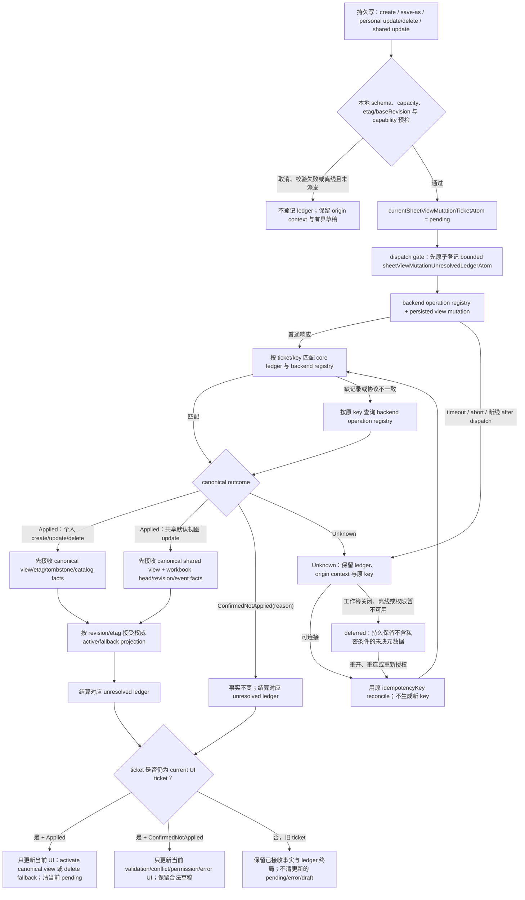

# 13. 更改、工作表视图与版本历史

> 基线日期：2026-07-13
>
> 专属小组技术最早窗口：P0/P1 为 2026-09-07～2026-10-02；若另行批准，P2 工作窗口为 2026-10-05～2026-10-16，含 P2 最早完成日为 10-16。组合计划将本组 P2 放入 2026-10-19 起的 P2-A，且启动与发布均需用户决定。
>
> 状态口径：✅ 已实现；🟡 局部实现/仅可复用基础；❌ 未实现
>
> 架构审查（2026-07-14）：目标设计以 `@einfach/core` 为唯一前端状态核心；当前只有本地 history 的 Source/Derived/Command 基础符合，durable revision、版本与 Sheet Views 尚未实现。

## 1. 结论与范围

当前默认入口只有本地撤销/重做时间线，不能等同于“显示更改”或“版本历史”：记录存在于当前后端实例的内存里，缺少持久 revision、操作者与服务端时间、值差异、权限、筛选、分页和跨会话恢复。筛选/排序可以作为工作表视图的计算基础，但状态只按 `sheetId` 保存，尚无 `viewId`、个人/共享边界或视图 CRUD。

本专题补齐三个独立但共用 revision 基座的产品能力：

1. **显示更改（Show Changes）**：持久变更清单、详情、筛选、分页、定位、权限与保留策略。
2. **版本历史（Version History）**：持久 revision、快照 + delta、命名版本、只读预览，以及“恢复为一个新 revision”。
3. **工作表视图（Sheet Views）**：默认共享视图、持久个人视图和临时视图；个人筛选/排序不得污染共享工作簿状态。

不把以下能力混在本专题内：

- 本地撤销/重做仍服务于短期编辑纠错，不承担审计、合规或版本恢复职责。
- **第 9 组“数据分析”与第 16 组“打印”完全延后：本排期不估算、不占人、不做接口或模型预研。**
- 评论/批注的编辑能力由其专题负责；C0/C1 只证明 annotation 领域对 identity/ACL、storage、audit 与 resumable event 能力的接入，不外推为通用 workbook revision 平台已经零成本可用。[总排期阶段 0.5](./README.md)用从本组原 84 人日中拆出的 8 人日冻结并验证通用 transaction/revision/event 合同；本专题保留 76 人日交付 Show Changes、版本物化/恢复与 Sheet Views 的领域扩展。两者仍合计 84 人日，组合总账不变。

## 2. 当前实现盘点

### 2.1 功能状态表

| 功能点                         | 状态 | 当前证据与边界                                                                                              | 与目标的差距                                                                                 |
| ------------------------------ | ---- | ----------------------------------------------------------------------------------------------------------- | -------------------------------------------------------------------------------------------- |
| 本地撤销/重做                  | 🟡   | `historyStackAtom` 保存内存栈和 cursor，默认上限 100；静态后端另有上限 200 的 `StateDelta` 栈               | 刷新即失；worker 后端无同等 undo/redo 端口；不是持久审计记录，部分 mutation 路径仍需统一接入 |
| 当前时间线 UI                  | 🟡   | `SpreadsheetHistoryTimeline` 可显示 transaction kind、projection revision，并通过循环 undo/redo 跳转 cursor | 无作者、服务端时间、旧值/新值、可读范围、筛选、分页和权限；源码明确没有 wall-clock timestamp |
| 持久 transaction/revision 日志 | ❌   | 后端契约只有可选 `undoTransaction` / `redoTransaction`；`projectionRevision` 仅是投影失效版本               | 缺原子提交、不可变 revision ID、actor、时间、差异指针、幂等键、审计和持久存储                |
| 显示更改列表与详情             | ❌   | 无 list/detail/locate/subscribe API 和默认入口                                                              | 需作者、时间、范围、旧/新值、操作类型、服务端筛选、cursor 分页、定位、权限和保留策略         |
| 版本历史                       | ❌   | 无版本清单、版本详情和可物化历史投影                                                                        | 需 snapshot + delta、分页、权限和并发语义                                                    |
| 命名版本                       | ❌   | 未发现命名版本模型或 API                                                                                    | 需创建、重命名、删除/保留权限和名称冲突规则                                                  |
| 版本预览/恢复                  | ❌   | 本地 cursor 跳转会直接撤销/重做当前实例，不是只读历史预览                                                   | 需只读预览、确认、冲突检查、幂等恢复；恢复必须追加新 revision，永不抹除旧历史                |
| 筛选/排序基础                  | 🟡   | `FilterSortState` 已有 rules/directives；静态及 worker adapter 可保存/应用，UI 有异步状态                   | 只按 `sheetId` 建模；无视图上下文、所有者、共享范围、版本、CRUD 与持久服务                   |
| 工作表视图                     | ❌   | 未发现个人/默认/临时视图及管理 UI                                                                           | 需 create/rename/apply/update/delete、容量、并发和筛选/排序隔离                              |
| 协作在线状态                   | 🟡   | presence 端口和最多 32 名参与者的有界状态可复用；latest remote edit 仅含参与者、范围、transactionId         | presence 不是审计身份或事件流，不能证明 mutation 的 actor，也不能跨会话追溯                  |
| 评论事件接入                   | 🟡   | 已有评论 UI/端口基础                                                                                        | 需评论专题输出可授权、可脱敏的持久 revision 事件；本专题不重复实现评论编辑                   |
| 持久事件流                     | ❌   | `onCellsDirty` 只做本地投影失效                                                                             | 需可续传 cursor、顺序、去重、断档检测与重新拉取                                              |
| 能力声明                       | ❌   | 现有后端没有 changes/versions/sheetViews capability                                                         | 需静态、worker 组合后端、生产服务分别明确支持等级和限制，UI 不得猜测                         |

### 2.2 现有结构的准确定位

- `excel/spreadsheet-ui-core/src/history/` 是框架无关的本地命令历史：Source atom 保存栈，Derived atom 计算 `canUndo/canRedo`，Command atom 执行游标变化。
- `excel/solid-excel/src-vnext/history/SpreadsheetHistoryTimeline.tsx` 是上述本地历史的 Solid 薄视图，不是 Show Changes。
- `excel/solid-excel/src-vnext/adapter/static-backend.ts` 的 undo/redo delta 只在模块实例内存中存在；即使 revision 数值增长，也不构成可查询、可审计、可恢复的持久 revision 日志。
- worker/Rust 路径没有静态后端同等的 undo/redo 实现；筛选/排序元数据仍主要由主线程 host map 持有。
- `workspaceSessionAtom` 的 revision 字段用于刷新/判 stale，不是版本历史。
- 默认 `VNextWave5Demo` 使用静态后端；因此生产级持久性、身份、ACL 和事件续传必须由服务能力决定，不能用 demo 成功代替完成度。

## 3. 统一领域模型与后端契约

### 3.1 后端是事实源

所有会改变工作簿共享事实的命令，必须在同一个后端事务中提交业务 mutation 与 revision record；提交成功后才发布事件。客户端不得自行生成权威 actor、服务端时间或 revision 顺序。服务端 operation registry 以 `idempotencyKey` 保存 `Applied(canonical facts, revision, eventCursor)`、`ConfirmedNotApplied(reason)` 或 `Unknown`；普通响应与 reconcile 必须读取同一个终局。

这段通用 envelope 不是第 13 组在 09-07 才首次定义的领域私约：阶段 0.5 于 07-24 冻结、08-07 通过 M0.5，且必须由 annotation 与至少一个第 2～6 组 mutation 运行同一 conformance fixture。第 2～6 组缺 revision 登记或原子提交的 mutation 在 M0.5 前后都不得合入；本专题 W1 只能消费已接受的通用合同，再增加 revision 查询、snapshot/delta、restore 和 Sheet Views 语义。若 M0.5 暴露平台缺口，先重估并顺延，不在这里按“0 人日接线”吸收。

```ts
type CanonicalMutationOutcome<TFacts> =
  | { status: 'applied'; facts: TFacts; revision?: RevisionRecord; eventCursor?: string }
  | { status: 'confirmed-not-applied'; reason: MutationRejectionReason }
  | { status: 'unknown' }

getRevisionMutationOutcome(idempotencyKey: string): Promise<CanonicalMutationOutcome<unknown>>
```

transport timeout、断线或 abort 只能产生 `Unknown`，不能伪造 `ConfirmedNotApplied`。backend registry 记录缺失或本地 ledger 暂时不可见时，仍用原 key 恢复查询；不得生成新 key 重新猜测提交结果。

```ts
interface RevisionRecord {
  revisionId: string
  transactionId: string
  workbookId: string
  sheetIds: string[]
  actor: { userId: string; displayNameSnapshot: string }
  committedAt: string // server timestamp
  operationType: RevisionOperationType
  affectedRanges: StableRangeAnchor[]
  beforeAfterSummary?: BoundedValueDiff[]
  detailRef?: string // 大批量变更的分块差异指针
  baseRevisionId?: string
  restoredFromRevisionId?: string
  correlationId: string
  idempotencyKey: string
}
```

约束如下：

- revision 日志只追加，不原地改写；删除或恢复工作表也保留符合策略的 tombstone/anchor。
- 单条内联差异有字节数和单元格数上限；大粘贴、填充、排序等只返回有界摘要，详情用 cursor 分块读取，不能把百万格差异塞进 atom 或事件。
- actor 取提交时已认证身份的不可变展示快照；改名不重写旧 revision。
- 每次列表、详情、定位、预览和恢复均在服务端重新校验权限；无权读取的值要脱敏，而不是只在 UI 隐藏。
- `idempotencyKey` 防止重试重复提交；`baseRevisionId` 用于乐观并发检查。
- 保留天数、最早可读 revision、法律保留和已删除对象策略由租户/产品能力返回，仓库中没有可证明的固定值，不在客户端硬编码。

### 3.2 必需能力声明

```ts
interface RevisionCapabilities {
  mode: 'unavailable' | 'local-ephemeral' | 'durable-service'
  showChanges: boolean
  versionHistory: boolean
  namedVersions: boolean
  sheetViews: boolean
  maxPageSize: number
  maxInlineDiffCells: number
  retentionDays?: number
  earliestRevisionId?: string
  maxPersistedSheetViewsPerSheet: number
}
```

- 静态后端可提供确定性的 `local-ephemeral` fixture，用于契约测试和 demo，并明确标注刷新后丢失；它不得伪装为持久版本历史。
- worker/Rust 负责原子 workbook mutation、快照物化和 delta replay；身份、ACL、持久 revision/event store 由组合服务负责，避免在 Rust 和 host 各维护一套权威日志。
- 生产服务未连接或 capability 为 `unavailable` 时，隐藏/禁用持久功能并给出原因；不得静默降级成“看似持久”的内存数据。
- static、worker 组合后端、service adapter 共享一套 contract fixtures；能力差异由字段表达，不靠运行时探测方法是否存在。

## 4. 显示更改（Show Changes）

### 4.1 用户能力

P0 完成以下闭环：

- 每条记录显示作者、服务端时间、工作表、单元格范围、旧值/新值摘要和操作类型。
- 支持按作者、时间范围、工作表、范围和操作类型组合筛选；筛选在服务端执行。
- 使用 opaque cursor 分页，默认页 50、服务端硬上限 100；滚动只保留有界页缓存。
- 详情按需加载；大批量变更展示摘要并分页展开。
- “定位”先由后端把 stable anchor 映射到当前投影；对象已删除时显示 tombstone，禁止用陈旧 A1 地址误跳。
- 新事件到达时仅更新未读/失效标志；若用户正在看历史页，不强行打乱当前顺序。事件 cursor 断档则丢弃受影响缓存并重新拉取。
- 权限变化立即生效。列表可根据策略保留元数据，但值详情必须脱敏；无工作簿权限则整个请求拒绝。
- UI 明示保留边界，例如“可查看自 YYYY-MM-DD 起的更改”；保留策略由 capability/API 返回。

建议契约：

```ts
listChanges(query, cursor?, pageSize?): Promise<ChangePage>
readChangeDetails(revisionId, cursor?): Promise<ChangeDetailPage>
locateChange(revisionId, anchorId): Promise<LocateResult>
subscribeRevisionEvents(resumeCursor): Unsubscribe
```

`query` 是稳定、可序列化的服务端查询；页 cursor 不允许由数组下标推导。`LocateResult` 必须区分 `located`、`deleted`、`moved`、`permissionDenied` 和 `unavailable`。

### 4.2 状态流转

```mermaid
stateDiagram-v2
    [*] --> Editing
    Editing --> CommitPrepared: mutation command + current ticket + idempotency key
    CommitPrepared --> CommitCancelled: cancel before dispatch
    CommitPrepared --> CommitValidationError: local validation fails; not dispatched
    CommitPrepared --> CommitOffline: offline before dispatch
    CommitCancelled --> Editing: retain current projection
    CommitValidationError --> Editing: retain draft and field errors
    CommitOffline --> Editing: retain draft; reconnect before a new dispatch
    CommitPrepared --> CommitLedgerRegistered: dispatch gate atomically registers bounded ledger
    CommitLedgerRegistered --> CommitDispatched: backend operation registry + atomic mutation/revision transaction
    CommitDispatched --> CommitOperationMatch: normal response
    CommitDispatched --> CommitOutcomeUnknown: timeout / abort / disconnect after dispatch
    CommitOutcomeUnknown --> CommitReconcilePending: query original idempotency key
    CommitReconcilePending --> CommitOperationMatch: authoritative reconcile response
    CommitReconcilePending --> CommitOutcomeUnknown: offline / query failure
    CommitReconcilePending --> CommitReconcileDeferred: panel/workbook closed or permission unavailable
    CommitReconcileDeferred --> CommitReconcilePending: reopen / reauthorize / background resume
    CommitOperationMatch --> CommitCanonicalOutcome: core ledger + backend registry matched
    CommitOperationMatch --> CommitRegistryRecovery: missing or ambiguous operation record
    CommitRegistryRecovery --> CommitCanonicalOutcome: query backend registry with original key
    CommitCanonicalOutcome --> RevisionCommitted: Applied; first accept canonical head/revision/projection facts
    CommitCanonicalOutcome --> CommitLedgerSettled: ConfirmedNotApplied(reason)
    CommitCanonicalOutcome --> CommitOutcomeUnknown: Unknown; retain ledger
    RevisionCommitted --> CommitLedgerSettled: facts accepted or idempotently present
    CommitLedgerSettled --> CommitCurrentGuard: terminal ledger settlement is unconditional
    CommitCurrentGuard --> Editing: current ticket; update only active success/error/conflict UI
    CommitCurrentGuard --> CommitResolvedOld: old ticket; leave newer UI untouched
    CommitResolvedOld --> Editing: authoritative facts and ledger terminal remain

    RevisionCommitted --> EventPublished: backend event cursor accepted after atomic commit
    EventPublished --> PageInvalidated: matching server filter
    EventPublished --> Editing: event does not match filter
    PageInvalidated --> PagePending: listChanges(cursor, query)
    PagePending --> PageSuccess: current request succeeds
    PageSuccess --> PageReady: accept matching requestId
    PagePending --> PageError: current request fails
    PagePending --> PageOffline: offline
    PagePending --> PageCancelled: query changed / panel closed
    PagePending --> PageStale: response requestId is obsolete
    PageCancelled --> Editing
    PageStale --> PagePending: fetch current query
    PageError --> PagePending: retry
    PageOffline --> PageReady: show bounded cache as stale and read-only
    PageOffline --> PagePending: reconnect and refresh
    PageReady --> SourceAtoms: bounded page summaries + event cursor
    SourceAtoms --> DerivedAtoms: permission + filters + selection + locate capability
    DerivedAtoms --> HistoryReady: render list / details / unread state
    HistoryReady --> LocatePending: locate selected stable anchor
    LocatePending --> HistoryReady: located / moved / deleted
    LocatePending --> LocatePermissionDenied: access revoked
    LocatePending --> LocateError: service / projection error
    LocatePending --> LocateCancelled: panel closed / selection changed
    LocatePending --> LocateStale: locate requestId obsolete
    LocatePending --> LocateOffline: connection lost
    LocatePending --> LocateUnavailable: anchor cannot be resolved or retained data is unavailable
    LocatePermissionDenied --> HistoryReady: refresh list/capability; retain only permitted metadata
    LocateError --> HistoryReady: retain selected change and allow retry
    LocateCancelled --> HistoryReady: clear pending; retain current viewport
    LocateStale --> HistoryReady: discard old response silently
    LocateOffline --> HistoryReady: show bounded cached detail read-only
    LocateOffline --> LocatePending: reconnect and retry current selection
    LocateUnavailable --> HistoryReady: retain selected change and explain that no location can be shown
```



这条链路里，事务、revision 与 event 都由后端权威化；Source atom 只缓存服务端返回的有界页，Derived atom 不复制整份历史，Solid 组件只订阅并渲染。已派发 mutation 即使 ticket 已旧，也必须先接收权威事实并结算对应 ledger；最后的 current guard 只决定是否更新当前编辑器 UI。分页、详情和定位属于 read flow，仍可按 requestId 丢弃旧响应。

## 5. 版本历史与命名版本

### 5.1 存储与读取

- revision 是不可变 delta 序列；服务端按“revision 数量或累计字节”策略生成周期快照。
- 历史投影由最近快照 + 后续有界 delta 物化；校验 snapshot hash、delta 顺序和 schema version。
- 命名版本固定指向一个 revision，不复制整个工作簿。创建、重命名和删除命名标签均检查权限、名称冲突与幂等键。
- compaction 不得破坏仍受 retention、命名版本或 legal hold 保护的物化能力。
- 版本列表使用 cursor 分页；预览只返回只读 projection descriptor 和按需 viewport 数据，不把整本工作簿载入 UI atom。

建议契约：

```ts
listVersions(query, cursor?, pageSize?): Promise<VersionPage>
createNamedVersion(input): Promise<CanonicalMutationOutcome<NamedVersionAppliedFacts>>
renameNamedVersion(input): Promise<CanonicalMutationOutcome<NamedVersionAppliedFacts>>
deleteNamedVersion(input): Promise<CanonicalMutationOutcome<NamedVersionDeleteAppliedFacts>>
openVersionPreview(versionId): Promise<ReadOnlyProjectionDescriptor>
restoreVersion(input: {
  versionId: string
  baseHeadRevisionId: string
  idempotencyKey: string
}): Promise<CanonicalMutationOutcome<RestoreAppliedFacts>>
```

### 5.2 命名版本写入状态流

创建、重命名和删除共用同一套协议，但 current UI ticket 与有界 unresolved ledger 必须分离。ledger 保存 `operationOrigin`、`idempotencyKey`、目标 `etag`、base revision 和 dispatch phase；删除成功返回 canonical tombstone/目标 revision 引用，不以空响应猜测成功，也不删除标签指向的 revision。普通响应和对账响应先归一 canonical outcome，最后才以 current ticket 决定当前草稿/错误 UI。

```mermaid
stateDiagram-v2
    [*] --> VersionCatalogReady
    VersionCatalogReady --> CreateDraft: create named version
    VersionCatalogReady --> RenameDraft: rename selected label
    VersionCatalogReady --> DeleteConfirm: delete selected label
    CreateDraft --> NamedPreDispatchRejected: local validation / cancel / offline
    RenameDraft --> NamedPreDispatchRejected: local validation / cancel / offline
    DeleteConfirm --> NamedPreDispatchRejected: missing target / cancel / offline
    NamedPreDispatchRejected --> NamedOriginRestored: no service mutation; retain bounded draft
    NamedOriginRestored --> CreateDraft: origin=create
    NamedOriginRestored --> RenameDraft: origin=rename
    NamedOriginRestored --> DeleteConfirm: origin=delete

    CreateDraft --> NamedWritePrepared: valid create + current ticket + key
    RenameDraft --> NamedWritePrepared: valid rename + etag + current ticket + key
    DeleteConfirm --> NamedWritePrepared: valid delete + etag + current ticket + key
    NamedWritePrepared --> NamedLedgerRegistered: dispatch gate atomically registers bounded ledger
    NamedLedgerRegistered --> NamedDispatched: backend operation registry + mutation
    NamedDispatched --> NamedOperationMatch: normal response
    NamedDispatched --> NamedOutcomeUnknown: timeout / abort / disconnect after dispatch
    NamedOutcomeUnknown --> NamedReconcilePending: query original idempotency key
    NamedReconcilePending --> NamedOperationMatch: authoritative reconcile response
    NamedReconcilePending --> NamedOutcomeUnknown: offline / query failure
    NamedReconcilePending --> NamedReconcileDeferred: panel closed / permission unavailable
    NamedReconcileDeferred --> NamedReconcilePending: reopen / reauthorize / background resume
    NamedOperationMatch --> NamedCanonicalOutcome: core ledger + backend registry matched
    NamedOperationMatch --> NamedRegistryRecovery: missing or ambiguous record
    NamedRegistryRecovery --> NamedCanonicalOutcome: query backend registry with original key
    NamedCanonicalOutcome --> NamedFactsAccepted: Applied
    NamedFactsAccepted --> NamedLedgerSettled: first accept canonical label/tombstone/etag/revision/event cursor and bounded catalog projection
    NamedCanonicalOutcome --> NamedLedgerSettled: ConfirmedNotApplied(reason)
    NamedCanonicalOutcome --> NamedOutcomeUnknown: Unknown; retain ledger
    NamedLedgerSettled --> NamedCurrentGuard: terminal ledger settlement is unconditional
    NamedCurrentGuard --> VersionCatalogReady: current + Applied; refresh bounded catalog read if required
    NamedCurrentGuard --> NamedOriginRestored: current + ConfirmedNotApplied; expose validation/conflict/permission/retry UI
    NamedCurrentGuard --> NamedResolvedOld: old ticket; do not touch newer draft/pending/error
    NamedResolvedOld --> VersionCatalogReady: accepted facts remain visible through derived catalog
```



### 5.3 恢复语义

恢复不是“把 head 指针退回去”，也不是删除目标版本之后的 revision。流程必须先打开只读预览，再确认恢复；服务端比较 `baseHeadRevisionId` 与当前 head。若期间出现其他提交，则返回冲突，让用户刷新预览或显式基于新 head 重试。成功恢复时，服务端把目标版本状态作为一次新 transaction 写入，并追加带 `restoredFromRevisionId` 的新 revision。

```mermaid
stateDiagram-v2
    [*] --> VersionList
    VersionList --> SnapshotPending: select revision / named version
    SnapshotPending --> PreviewSuccess: materialize snapshot + bounded deltas
    PreviewSuccess --> PreviewReady: accept current requestId
    SnapshotPending --> PreviewError: corrupt / network
    SnapshotPending --> OfflineError: offline and no complete cached preview
    SnapshotPending --> PermissionDenied: ACL rejected
    SnapshotPending --> PreviewCancelled: close or select another version
    SnapshotPending --> PreviewStale: response requestId or head is obsolete
    PreviewCancelled --> VersionList
    PreviewStale --> SnapshotPending: load current selection
    OfflineError --> SnapshotPending: reconnect
    PermissionDenied --> VersionList: dismiss / refresh permission
    PreviewError --> SnapshotPending: retry

    PreviewReady --> Confirming: choose restore
    Confirming --> RestoreCancelled: cancel before dispatch
    RestoreCancelled --> PreviewReady: no workbook mutation
    Confirming --> RestoreOfflineBeforeDispatch: offline before dispatch
    RestoreOfflineBeforeDispatch --> PreviewReady: no mutation; reconnect then confirm again
    Confirming --> RestorePrepared: current ticket + baseHeadRevisionId + targetRevisionId + key
    RestorePrepared --> RestoreLedgerRegistered: dispatch gate atomically registers bounded restore ledger
    RestoreLedgerRegistered --> RestoreDispatched: backend atomically restores target and appends revision in operation registry
    RestoreDispatched --> RestoreOperationMatch: normal response
    RestoreDispatched --> RestoreOutcomeUnknown: timeout / abort / disconnect after dispatch
    RestoreOutcomeUnknown --> ReconcilePending: query original idempotency key
    ReconcilePending --> RestoreOperationMatch: authoritative reconcile response
    ReconcilePending --> RestoreOutcomeUnknown: offline / query failure
    ReconcilePending --> ReconcileDeferred: preview/workbook closed or permission unavailable
    ReconcileDeferred --> ReconcilePending: reopen / reauthorize / background resume
    RestoreOperationMatch --> RestoreCanonicalOutcome: core ledger + backend registry matched
    RestoreOperationMatch --> RestoreRegistryRecovery: missing or ambiguous record
    RestoreRegistryRecovery --> RestoreCanonicalOutcome: query backend registry with original key
    RestoreCanonicalOutcome --> RestoreFactsAccepted: Applied
    RestoreFactsAccepted --> RestoreProjectionAccepted: first accept canonical new head/revision/projection with restoredFromRevisionId
    RestoreProjectionAccepted --> RestoreLedgerSettled: accept canonical event cursor; facts are authoritative
    RestoreCanonicalOutcome --> RestoreLedgerSettled: ConfirmedNotApplied(reason)
    RestoreCanonicalOutcome --> RestoreOutcomeUnknown: Unknown; retain ledger
    RestoreLedgerSettled --> RestoreCurrentGuard: terminal ledger settlement is unconditional
    RestoreCurrentGuard --> VersionList: current + Applied; refresh bounded list, old history remains
    RestoreCurrentGuard --> SnapshotPending: current + conflict; refresh head and preview
    RestoreCurrentGuard --> PreviewReady: current + validation/permission/retry/cancel confirmed not applied
    RestoreCurrentGuard --> RestoreResolvedOld: old ticket; leave newer preview/pending/error untouched
```



`Applied` 返回已经包含服务端原子产生的 `newRevisionId`、`restoredFromRevisionId`、新 head、投影描述符与 event cursor；客户端只按版本接受这些权威事实，不自行追加 revision。旧 ticket 的恢复成功同样必须进入事实层并结算自己的 ledger，只是不再改动用户后来打开的预览、pending 或错误 UI。

## 6. 工作表视图（Sheet Views）

### 6.1 三种作用域

| 类型         | 持久性与所有者                                           | 协作语义                                                    | v1 支持操作                                |
| ------------ | -------------------------------------------------------- | ----------------------------------------------------------- | ------------------------------------------ |
| 默认共享视图 | 工作簿/工作表事实，由有权限用户维护                      | 更新会生成共享 revision 并通知协作者                        | apply、update；作为无个人视图时的 fallback |
| 个人视图     | 服务端按用户持久化，owner-only，除管理员审计外不广播内容 | 应用或编辑只改变本人的投影上下文，绝不写回共享默认筛选/排序 | create、rename、apply、update、delete      |
| 临时视图     | 当前 session 的 Einfach Source atom，未保存              | 不持久、不广播；可“另存为个人视图”                          | create、apply、update、discard/save-as     |

P1 首版的 view definition 只纳入已定义契约的筛选/排序状态；后续若加入隐藏行列或冻结窗格，必须先扩展版本化 schema。打印设置不进入本专题。

服务端持久视图以 `{workbookId, sheetId, viewId}` 为稳定上下文，包含 `scope`、`ownerId`、`name`、`definitionVersion`、`filterSortState`、`etag`、创建/更新时间。默认共享视图使用共享 ACL；个人视图必须校验 owner。

仓库无法证明在线 Excel 的精确容量，因此提出 **每张工作表最多 256 个持久命名视图** 作为本产品目标，不把它声称为外部产品事实。临时视图不计数；最终上限由 capability `maxPersistedSheetViewsPerSheet` 返回，达到上限时服务端给出结构化错误。

### 6.2 隔离规则

- 应用个人/临时视图时，projection read 必须携带 `viewId` 或临时 context ID；当前仅按 `sheetId` 的 `filterSortStateAtom` 需迁移为稳定视图上下文 key。
- 个人视图的筛选/排序命令只更新个人 view definition，不调用共享 workbook filter mutation。
- 共享默认视图更新成功后才切换本地 active context；失败、取消或冲突保留旧视图。
- `etag` 处理 rename/update/delete 的乐观并发；冲突时展示服务端版本和本地草稿，不做静默 last-write-wins。
- capability 与按钮权限只是派发前快照；个人视图 update/delete 必须在服务端执行时重新校验 owner ACL。已派发写响应先以原 `idempotencyKey` 匹配 core ledger 与 backend operation registry：`Applied` 先接收权威事实，`ConfirmedNotApplied` 直接结算，`Unknown` 保留原 ledger 对账；结算后才由 current-ticket guard 决定是否更新当前 UI。`permissionDenied` 只有在 registry 确认未提交时才能归入 `ConfirmedNotApplied`，无法证明是否提交时必须保持 `Unknown`。
- update/delete 得到 canonical `ConfirmedNotApplied(permissionDenied)` 后，刷新 capability 并按最新 read ACL 重读。仍可读时只接受 canonical 服务端缓存，update 可保留有界、仅当前用户可见的本地草稿；不可读时清除该视图缓存、受保护草稿和删除确认，再转入最新权限允许的 fallback。若结果为 `Applied`，即使后来撤权或 ticket 已旧，也先接受已提交的 canonical tombstone/view/revision；若为 `Unknown`，不得提前清缓存或假装回滚。
- 删除当前个人视图后回退到默认共享视图；若默认视图不可读，则回退到无筛选的临时安全投影，并明确提示。
- presence 可以广播“某用户处于个人视图”这一非敏感状态，但不得广播个人筛选条件或私有视图名称。

### 6.3 状态流转

临时视图的本地状态与持久写入分开建模。应用已存在视图是可取消 read flow，可按 current read ticket 丢弃旧投影；临时筛选/排序始终是 core Source，不进入 mutation ledger。

```mermaid
stateDiagram-v2
    [*] --> DefaultShared
    DefaultShared --> TemporaryActive: create unsaved view in core Source
    TemporaryActive --> TemporaryActive: local filter / sort / rename
    TemporaryActive --> DefaultShared: discard; apply safe shared fallback

    DefaultShared --> ApplyPending: apply persisted view with read ticket
    PersonalActive --> ApplyPending: apply another persisted view
    TemporaryActive --> ApplyPending: apply persisted view
    ApplyPending --> PersonalActive: current read accepts personal projection
    ApplyPending --> DefaultShared: current read accepts shared projection
    ApplyPending --> ApplyStale: obsolete read requestId
    ApplyPending --> PriorViewRestored: error / cancel / offline / permission denied
    ApplyStale --> ApplyPending: load current selection
    PriorViewRestored --> DefaultShared: origin scope was shared
    PriorViewRestored --> PersonalActive: origin scope was personal
    PriorViewRestored --> TemporaryActive: origin scope was temporary
```



所有 create、temporary save-as、personal update/rename/delete 和 shared-default update 共用下面的持久写合同；独立 store 可并行执行不同 workbook/sheet 的 ledger，不能用一个全局 current 状态互相覆盖。



个人和临时分支中的筛选/排序始终停留在该 view projection；只有 `DefaultShared` 的获授权更新才成为共享 workbook revision。`sheetViewMutationUnresolvedLedgerAtom` 的每条记录必须保留 `originScope + originViewId/contextId + operationKind + idempotencyKey + dispatchPhase`：`Applied` 先接收 canonical personal/shared view、etag、tombstone、revision/event 与投影事实，再结算；`ConfirmedNotApplied` 结算后才恢复准确的 origin UI；`Unknown` 保留原记录继续对账。目录刷新属于后续 read flow，失败不能反推写入未发生；临时视图 save-as 失败也不能落回 `DefaultShared` 并丢掉临时定义。

## 7. Einfach 状态模型与分层

### 7.1 分层边界

- `excel/spreadsheet-ui-core` 新增框架无关的 revision、version 和 sheet-view domain，定义类型、Source/Derived/Command atoms、请求 ticket、取消和错误语义。
- backend adapter 只翻译端口与 transport，不保存第二份产品事实；持久服务是权威源。
- `excel/solid-excel` 只提供 Provider、hook 和视图绑定。产品状态、UI 状态、筛选条件、loading/error、选中项、确认框与冲突框均进入 Einfach atom/store。
- 禁止为这些状态新增 `createSignal`；仅 DOM ref、测量值、rAF/observer handle 等非产品瞬时句柄可留在组件局部。
- core 不导入 Solid；每个测试创建独立 store，禁止共享全局状态污染测试。

### 7.2 Source / Derived / Command

| 层级    | 建议 atom                                                          | 内容与约束                                                                                              |
| ------- | ------------------------------------------------------------------ | ------------------------------------------------------------------------------------------------------- |
| Source  | `revisionCapabilitiesAtom`                                         | 后端能力、保留边界、页/差异/视图容量上限                                                                |
| Source  | `changeQueryAtom`                                                  | 作者、时间、sheet、range、operation 等稳定服务端 query                                                  |
| Source  | `changePagesAtom`                                                  | cursor 页摘要、read requestId、status、error、event cursor；不存全量历史                                |
| Source  | `selectedChangeAtom`                                               | 当前 revision/anchor 与有界详情页                                                                       |
| Source  | `versionPagesAtom`                                                 | 有界版本摘要页与命名标签的 canonical projection                                                         |
| Source  | `versionPreviewAtom`                                               | 单个只读 projection descriptor、当前 viewport read ticket、确认/冲突 UI；不承载 restore 写终局          |
| Source  | `sheetViewCatalogAtom`                                             | 某 sheet 的有界 canonical view 摘要与 etag；不混入 CRUD pending/error                                   |
| Source  | `activeSheetViewAtom`                                              | default/personal/temporary canonical context；临时 definition 也在 core atom 中                         |
| Source  | `currentWorkbookMutationTicketAtom`                                | 当前编辑器提交的 UI ticket；每个独立 store 仅 1 个，不负责证明旧 mutation 是否提交                      |
| Source  | `workbookMutationUnresolvedLedgerAtom`                             | 已 dispatch 的 workbook mutation 元数据，按 workbook 最多 100 条；保存原 key 到 canonical 终局          |
| Source  | `currentNamedVersionMutationTicketAtom`                            | 当前命名版本弹窗的 UI ticket；与未决写账本分离                                                          |
| Source  | `namedVersionMutationUnresolvedLedgerAtom`                         | 已 dispatch 的 create/rename/delete，按 workbook 最多 64 条；`Unknown` 不得逐出                         |
| Source  | `currentRestoreMutationTicketAtom`                                 | 当前 restore 确认/结果 UI ticket；与只读 preview ticket 分离                                            |
| Source  | `restoreMutationUnresolvedLedgerAtom`                              | 已 dispatch 的 restore，按 workbook 最多 16 条；保存 target/base head/origin/key                        |
| Source  | `currentSheetViewMutationTicketAtom`                               | 当前 Sheet View 写 UI ticket；不同 store/workbook 不共享                                                |
| Source  | `sheetViewMutationUnresolvedLedgerAtom`                            | 已 dispatch 的持久视图写，按 workbook 最多 64 条；保存 scope/context/origin/key，`Unknown` 持久化并对账 |
| Derived | `visibleChangeRowsAtom`                                            | 页顺序、权限脱敏标记、选中和 locate 可用性，不复制详情                                                  |
| Derived | `canRestoreVersionAtom`                                            | capability、权限、预览状态、head/stale 条件                                                             |
| Derived | `effectiveFilterSortAtom`                                          | 只从 active view context 推导当前 projection 的 filter/sort                                             |
| Derived | `sheetViewActionsAtom`                                             | 根据 scope、owner、ACL、capacity、current UI ticket 与 canonical conflict 推导按钮权限                  |
| Command | `loadChangePageAtom` / `loadChangeDetailAtom` / `locateChangeAtom` | 只读分页、取消、requestId stale 丢弃、权限错误与 retry                                                  |
| Command | `openVersionPreviewAtom`                                           | 只读预览可取消并以 read requestId 防旧响应                                                              |
| Command | `restoreVersionAtom`                                               | dispatch gate 先登记 restore ledger；统一处理 registry 三态，事实优先，settlement 后执行 current guard  |
| Command | `applySheetViewAtom`                                               | 只读投影切换可按 current read ticket 丢弃旧响应                                                         |
| Command | `create/rename/update/deleteSheetViewAtom`                         | 持久写先登记 ledger，经 operation registry 三态归一；不得用 read stale 规则丢弃已 dispatch 写           |

动态 atom/cache 必须使用稳定 key 和有界生命周期：

- change 页按 `{workbookId, normalizedQueryHash, cursor}` 缓存，LRU 最多 12 页；切 workbook、权限变化或事件断档时失效。
- version 页最多 8 页；预览只保留当前 1 个和最近 2 个 descriptor，viewport 数据沿用既有有界投影缓存。
- sheet view catalog 最多缓存 16 个 `{workbookId,sheetId}` 上下文，离开 workbook 时清理。
- 普通已结算 ledger 可按上述领域上限和 TTL 清理；处于 `Unknown` 的记录不得因 LRU/TTL 直接逐出，超限时停止新 dispatch、告警并先对账最旧记录。只持久化恢复所需的非私密元数据，个人筛选条件和密码不得进入 ledger。
- 不创建 per-cell、per-change、per-revision 的永久 atom；行组件通过页 Source + ID selector 读取摘要。
- 只读请求采用 AbortSignal；无法取消的旧只读响应比较 store 内 read requestId，进入 `stale` 且不覆盖当前 read projection。已 dispatch mutation 不适用这条丢弃规则，必须以 ledger/registry 取得 canonical outcome、接收权威事实并结算，最后才检查 current UI ticket。

## 8. 权限、并发、保留与审计

| 场景      | 必须行为                                                                                |
| --------- | --------------------------------------------------------------------------------------- |
| 身份      | mutation 的 actor 只能来自认证上下文；presence participant 不能替代审计身份             |
| 列表/详情 | 服务端逐请求 ACL；详情字段可按单元格权限脱敏，响应携带 redaction reason                 |
| 定位      | 使用当前结构映射 stable anchor；删除返回 tombstone，权限变化返回 denied                 |
| 事件流    | cursor 可续传、去重并检测 gap；gap 后按服务端页重建，不能从事件猜全量事实               |
| 恢复      | 要求 restore 权限、最新 head 校验和幂等键；恢复追加 revision，记录发起人和来源版本      |
| 命名版本  | create/rename/delete 均记审计事件；标签删除不删除其目标 revision                        |
| 默认视图  | 是共享事实，更新需 edit 权限并产生 revision                                             |
| 个人视图  | owner-only；管理员审计策略由服务端决定，其他协作者不可读取条件/名称                     |
| 保留      | capability 返回策略和最早 revision；到期、法律保留、删除数据的行为需产品/法务在 P0 冻结 |
| 评论/批注 | 只接收评论专题输出的授权事件；正文或旧/新值依其可见性脱敏                               |

P0 的放行证据门之一是完成“保留 + 删除 + 权限变化”决策记录。若服务端尚无租户策略，功能保持 capability 关闭，而不是前端自行决定永久保留；证据通过后仍只提交用户作发布决策。

## 9. 实施优先级与排期

### 9.1 人力假设与总量

排期按 **4 名工程师并行 + 0.75 名共享 QA/自动化** 测算；工程角色可交叉，但版本/视图持久化扩展、domain/core、Solid UI 与 adapter/worker 至少各有明确 owner。P0/P1 测试包含在总人日内，不能在减员时删除测试来守日期。

P0/P1 的专属席位为：1 名版本/视图存储扩展工程师、1 名 revision/version 领域与服务工程师、1 名 ui-core/Solid 工程师、1 名 worker/service adapter 集成工程师，以及 0.75 名 QA/自动化/安全与可访问性工程师。P2 缩为 1 名后端/运维、1 名 core/Solid 和 0.5 名 QA；未列入的产品、设计、法务和身份平台只参加评审，不计实施容量。

[总排期阶段 0.5](./README.md)单列 8 人日建立通用 transaction/revision/event envelope、operation registry 三态与跨领域 conformance，预算从本组原 84 人日拆出。本组领域 P0/P1 因而为 **76 人日**；只消费通过 M0.5 的公共合同，并为 workbook revision 查询、snapshot/delta、版本/恢复、Sheet Views 及 UI/core/adapter/test 扩展计费。批注 C0/C1 的 12 人日是 annotation 领域工作，不作为“本组接线必然 0 成本”的依据；实际能力或 owner 不足时重新基线。

| 优先级  | 日期                   |   人日 | 并行人力                                    | 交付结果                                                                                                                                            |
| ------- | ---------------------- | -----: | ------------------------------------------- | --------------------------------------------------------------------------------------------------------------------------------------------------- |
| P0      | 2026-09-07～2026-09-18 |     32 | 峰值 4 工程师 + 0.75 QA                     | 消费 M0.5 公共合同；交付 workbook revision/capability 领域扩展，以及 Show Changes 列表、详情、筛选、分页、定位、权限、保留提示与事件续传闭环        |
| P1      | 2026-09-14～2026-10-02 |     44 | 峰值 4 工程师 + 0.75 QA，与 P0 后半并行启动 | 版本列表/命名版本/快照 + delta/预览/恢复为新 revision；三类 Sheet Views CRUD、filter/sort 隔离、并发冲突、端到端验证及显式 adapter/conformance 缓冲 |
| P0 + P1 | 2026-09-07～2026-10-02 | **76** | **4 工程师 + 0.75 QA**                      | 主体证据窗口，技术最早结束日期 **2026-10-02**；是否发布由用户决定                                                                                   |
| P2      | 2026-10-05～2026-10-16 |     18 | 2 工程师 + 0.5 QA                           | 高级运维/审计导出元数据、批量版本标签管理、保留策略管理入口和性能/可访问性增强；不含数据分析与打印                                                  |
| 全部    | 2026-09-07～2026-10-16 | **94** | 主窗口峰值 **4 工程师 + 0.75 QA**           | 含 P2 的技术最早结束日期 **2026-10-16**；P2 启动和实际发布均需用户决定                                                                              |

P0/P1 领域人日明确拆为：版本/视图存储扩展与物化 22、revision/version 领域与服务 18、ui-core/Solid 16、static/worker/service adapter 集成 10、QA/自动化/可访问性 6、**adapter/conformance 专用缓冲 4**，合计 76 人日。最后 4 人日是显式保留项，用于三 adapter 同 fixture、事件断档/重放和契约偏差返工；不得预先摊进功能开发，也不得在主审前移作 P2。若实际发现超过 4 人日的通用平台缺口，触发重新基线而不是吞掉测试。阶段 0.5 的公共 8 人日与这 76 人日合计 84，组合 P0/P1 总账仍为 521；P2 另加后端/运维 7、core/Solid 7、QA/性能/可访问性 4，共 18 人日。

### 9.2 周计划与依赖门

| 周次             | 工作包                                                                                                                                                                  | 前置/退出条件                                                                                             |
| ---------------- | ----------------------------------------------------------------------------------------------------------------------------------------------------------------------- | --------------------------------------------------------------------------------------------------------- |
| W1：09-07～09-11 | 消费已通过 M0.5 的 identity/ACL、transaction/revision/event 与 registry 合同；冻结版本领域查询/schema delta，实现版本专用 append-only、静态 fixture 和 adapter contract | M0.5 跨领域 fixture 已通过；产品/法务确认保留与删除语义；扩展服务能以原 key 查询 mutation + revision 终局 |
| W2：09-14～09-18 | Show Changes 页、详情、筛选、定位、event resume/gap；Einfach atoms；Solid 面板                                                                                          | P0 契约、权限、分页、断档、脱敏和双用户 E2E 全绿                                                          |
| W3：09-21～09-25 | 快照 + delta 物化、版本列表/命名版本/只读预览；Sheet Views 服务 CRUD 与 view-context projection                                                                         | snapshot replay/property test；个人/共享数据边界通过安全测试                                              |
| W4：09-28～10-02 | restore-as-new-revision、冲突/幂等；三类视图 UI、filter/sort 隔离；worker/service 组合与全链路回归                                                                      | P1 双用户隔离、恢复冲突、默认入口、无障碍与性能门槛通过                                                   |
| P2：10-05～10-16 | 管理/批量体验、可观测性、长历史性能和可访问性增强                                                                                                                       | 不反向阻塞 P0/P1；形成独立 capability 放行证据，待用户决定，不自动发布                                    |

关键依赖：

1. 阶段 0.5 已在 2026-08-07 前让 annotation 与至少一个第 2～6 组 mutation 通过同一 transaction/revision/event、registry 三态、cursor/gap、ACL fixture；未通过时本组 W1 不启动。
2. 批注 C0/C1 提供 annotation 领域的 production identity/ACL 接入、服务端时钟与事件验证；能否复用到 workbook revision 以 M0.5 证据为准，不假设零成本通用化。
3. 本组在公共原子提交合同上增加 version transaction/query schema、snapshot/delta materializer 与可续传领域事件，不重新定义通用 envelope。
4. [第 6 组表格与数据管理](./06-tables-data-management.md)在 2026-09-18 前交付稳定 filter/sort command、规范化语义和 revision/cancel/error 合同；本组只增加 view context 与个人/共享隔离，不重复实现比较器、distinct 分页或排序引擎。
5. [批注专题](./comments-notes-tasks.md)在 2026-08-28 前交付评论/备注 mutation 的 canonical revision event、stable anchor、actor/ACL 和脱敏合同；本组只把已授权领域事件展示到 Show Changes，不重复建设批注读写、提及、通知或任务。
6. static/worker/service capability 和契约测试完成且 4 人日 adapter/conformance 缓冲未被未决 blocker 吞没后，Solid UI 才允许曝光入口。

本表中的 **4 名工程师 + 0.75 QA 是第 13 组专属峰值资源**：2026-09-07～09-18 不与第 6 组 P1、批注 P2 共用同一人；2026-09-21～10-02 也不与第 6 组 P2 共用同一人。阶段 0.5 的 8 人日和本组领域 76 人日使用组合计划同一本 FTE/Agent 容量账；批注 C0/C1、公共合同和第 6 组前置只按已验收合同作为输入，任何额外平台接线都须进入重新估算，不能写成 0 人日。若只能复用其实施人员，本专题最早须在人员释放后重排，不能仍承诺 2026-10-02。

若无法提供上述专属 4 + 0.75 的并行配置，日期顺延，范围和测试门槛不压缩。第 9 组数据分析和第 16 组打印不会用来填补人员空档，也不做预研。

## 10. 验收标准

### 10.1 P0：显示更改

- 任一获支持 mutation 成功后，业务事实与 revision 要么同时存在、要么同时回滚；重复同一幂等键只产生一个 revision。
- 两个登录用户并发编辑时，列表按服务端顺序稳定显示正确 actor/time/range/type；跨页无重复和遗漏。
- 作者、时间、sheet、range、operation 组合筛选由服务端执行；切 query 时旧请求进入 cancel/stale，不能覆盖新结果。
- 旧/新值和大批量详情受 ACL 与页上限约束；撤权后已有缓存立即失效并重新鉴权。
- 定位能区分当前位置、移动、删除和无权限；结构变化后不跳错单元格。
- reload/reconnect 后从 event cursor 续传；人为制造 cursor gap 时自动重新拉页。
- UI 所有 pending/success/error/cancel/stale/permission 分支均有可操作反馈，键盘和读屏可用。
- 已派发 workbook mutation 的旧 ticket 返回 `Applied` 时，仍先接受 canonical head/revision/projection/event 并结算其 ledger；仅当前 UI 不被旧响应覆盖。timeout 后 `Unknown` 使用原 key 对账，不能被 LRU/关闭面板清除。

### 10.2 P1：版本历史

- 任意被保留 revision 可从快照 + delta 复现确定性 hash；schema 升级和损坏快照有明确失败/回退路径。
- 版本/命名版本分页、创建、重命名、删除标签均权限正确；删除标签不删 revision。
- 预览只读且不污染当前 workspace、selection、undo/redo 或 active sheet view。
- 恢复期间 head 未变时只新增一个带 `restoredFromRevisionId` 的 revision；旧历史完整保留。
- head 已变返回 conflict；取消/失败不改变工作簿；网络重试不产生重复恢复 revision。
- 命名版本与恢复分别使用独立 current ticket 和有界 unresolved ledger；对账得到 `Applied` 时先接受事实，`ConfirmedNotApplied` 才恢复当前 origin UI，`Unknown` 保留原 key，不被后开的弹窗覆盖或逐出。

### 10.3 P1：工作表视图

- 个人 A 的筛选/排序对用户 B、默认共享视图及其 revision 均无影响；两浏览器可重复验证。
- 获授权更新默认视图后协作者收到共享 revision/event；无权限用户不能更新。
- create/rename/apply/update/delete 覆盖 pending/success/error/cancel/stale/conflict；etag 冲突不静默覆盖。
- 删除 active personal view 后按规则回退；临时视图刷新后消失，另存个人视图后可跨会话恢复。
- 达到服务端返回的 256 产品目标上限时给出结构化容量错误；UI 不继续乐观插入第 257 个持久视图。
- 持久视图写的旧 ticket 返回 `Applied` 时仍更新 canonical catalog/etag/tombstone/revision 并结算对应 ledger；只有 apply/目录等 read flow 可按 read requestId 丢弃 stale 响应，写入 `Unknown` 必须持续对账。

## 11. 测试与发布护栏

| 层级             | 必测内容                                                                                                                                                                                                                   |
| ---------------- | -------------------------------------------------------------------------------------------------------------------------------------------------------------------------------------------------------------------------- |
| ui-core 单元测试 | 每个测试独立 store；Source/Derived/Command、查询归一化、分页合并、LRU、取消/read stale、权限失效；四类 current ticket 与 ledger 分离；旧 ticket Applied 接事实、ConfirmedNotApplied 结算、Unknown 保留及 registry recovery |
| adapter contract | static fixture、worker + host 组合、service adapter 运行同一套 capability/revision/version/view 与 operation-registry 三态合同；不支持项必须显式返回 unavailable，timeout/abort 不得谎报未提交                             |
| 服务集成         | DB 原子性、幂等、ACL/脱敏、cursor 分页、retention、事件续传/gap、snapshot compaction、restore conflict；mutation 与 revision/event 原子写入，原 key 对账只产生一个 canonical 终局                                          |
| Rust/worker      | snapshot/delta replay 属性测试、hash 一致性、大 delta 分块、结构变更 anchor 映射、主线程不保留第二份权威状态                                                                                                               |
| Solid 组件       | 默认入口、键盘/焦点/读屏、loading/error/empty/permission/conflict、列表虚拟化与 dialog 状态全部来自 Einfach；旧 mutation 终局不覆盖新 UI，但 canonical facts 仍可见                                                        |
| E2E              | 两用户作者归属、撤权、筛选与定位、跨会话历史、命名版本、恢复冲突/重试、个人视图隔离、默认视图协作；人为制造“响应丢失但后端已提交”、关闭/重开面板与 reload 后按原 key 收敛                                                  |
| 浏览器验收       | 在默认入口用 Playwright/Chrome DevTools 流程检查 console、只读请求取消、mutation timeout/reconcile、长任务、样式和路由回归                                                                                                 |

建议发布性能门槛（属于本产品验收目标，不是当前仓库已实现事实）：

- `listChanges` 单页最多 100 条；一百万条历史场景也不得全量下发或全量建 atom。
- 目标测试环境中首个 50 条页面 p95 在 1 秒内可交互，追加页不出现超过 50ms 的主线程长任务。
- 单次事件只携带有界摘要；详情分块大小由 capability 返回。
- 打开版本预览只拉首个 viewport，不能等待整本工作簿 materialize 到浏览器内存后才展示。

若用户在证据门后决定发布，建议采用 capability 灰度：先只读 Show Changes，再开放命名版本/恢复，最后开放个人和共享 Sheet Views 写操作。每一步均保留快速关闭写 capability 的服务端开关；关闭后已持久数据仍可按权限读取，不能被客户端清空。Agent 只提交测试证据、风险与发布建议，不执行 push、tag、workflow 修改或实际发布。

## 12. 风险与待定决策

| 风险/决策                                            | 截止点   | 处理                                                                                                              |
| ---------------------------------------------------- | -------- | ----------------------------------------------------------------------------------------------------------------- |
| retention、legal hold、删除账户/工作簿后的可见性未定 | P0 W1    | 产品、安全、法务冻结策略并进入 capability；未定则保持功能关闭                                                     |
| 当前 mutation 路径未全部走统一 revision dispatch     | 阶段 0.5 | 公共 registry/contract fixture 覆盖第 2～6 组；缺 revision 登记或原子提交的 mutation 禁止合入，本组 W1 也不得启动 |
| worker 与静态后端能力不对齐                          | P0 W2    | 以 capability + contract fixture 明示差异，生产持久功能只走 service 组合路径                                      |
| 大粘贴/排序产生巨大 before/after                     | P0 W1    | 有界摘要 + detailRef + cursor 分块，禁止事件和 atom 承载全量 diff                                                 |
| anchor 经结构变更后无法精确定位                      | P0 W2    | stable ID + tombstone；不可映射时明确 unavailable，不猜 A1 地址                                                   |
| 快照损坏或 schema 演进                               | P1 W3    | hash、版本化 codec、从更早快照 replay、灾备与告警演练                                                             |
| 个人视图泄露筛选条件                                 | P1 W3    | owner ACL、日志脱敏、presence 只广播非敏感模式，不广播名称/条件                                                   |
| 256 容量目标需产品确认                               | P1 W3    | 服务端 capability 可配置；压测后冻结默认值，UI 始终读取服务端值                                                   |

本专题完成的判断标准不是“出现三个菜单”，而是三条服务端权威状态链路均可在 reload、并发、撤权、错误、取消和事件断档下恢复到确定状态，并且 UI 中不存在另一套 `createSignal` 产品事实源。
