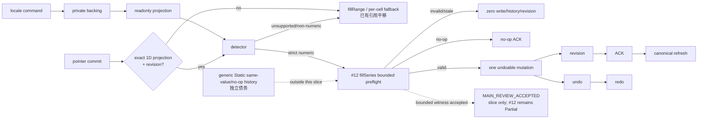
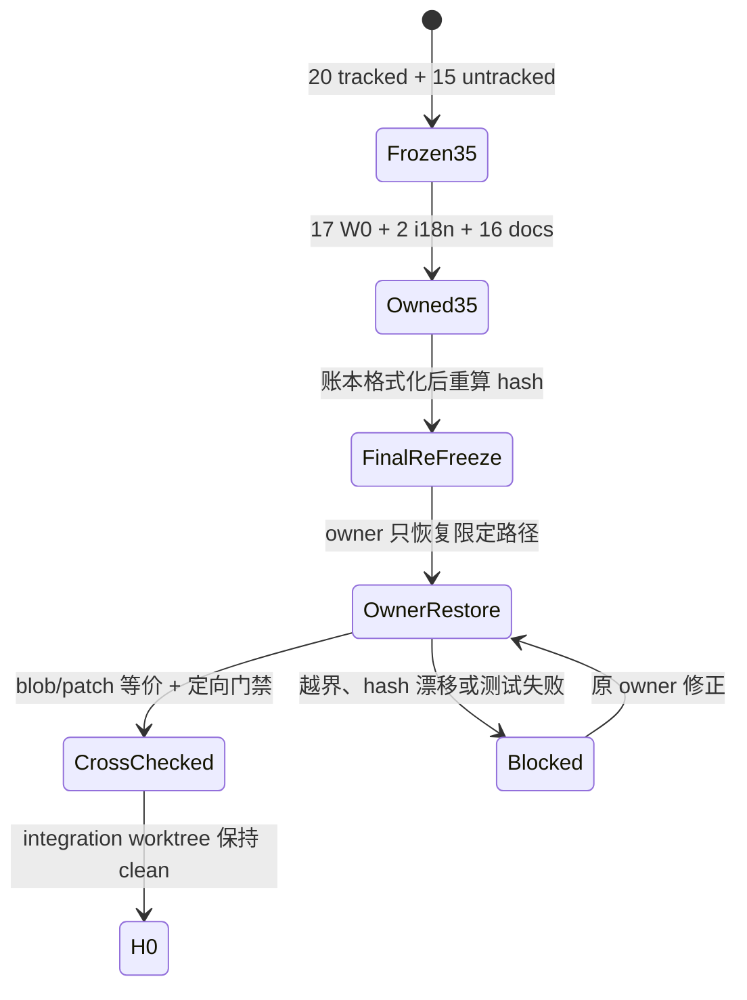

# In-flight 三槽日账

## 2026-07-19 canonical 归属口径已翻转（指针）

canonical 归属的唯一规范源自 2026-07-19 起是 [CANONICAL_OWNERSHIP.md](./CANONICAL_OWNERSHIP.md)：纯视口事实（freeze、hidden 行列、行高列宽、filter 可见性、protection 门禁）翻转为 UI-core canonical，数据事实维持引擎 canonical，undo 改为宿主编排（UI-core history + 引擎快照原语），WASM 为唯一真实后端口径、TS worker 降级 fail-closed 开发后备。本账旧口径中与该文件冲突处（如 #03/#05/#29/#40 的"等 Worker parity"闭环路径、#40 的 host-overlay 禁令表述）以该文件为准；严格产品总账 41 = 0/35/5/1 与"严格产品状态需要真实验证"原则不变。三槽流程相应改为"纵向闭环 + 主控合并"。

## 2026-07-17 当前并发账

唯一工作根：`/Volumes/work/self/einfach`。本节取代下方 2026-07-14 worktree 日账作为当前执行事实；所有 `pending` 必须由对应 owner 提供真实输出，其他 Agent 不得代填为通过。

严格产品盘点固定为 **41 项 = 0 `Verified` / 35 `Partial` / 5 `Missing` / 1 `Deferred`**。同时保留层级事实：UI-core 中 **31 项已有直接实现和直接测试、4 项已有部分实现**，不能把产品未闭环误写成“代码没做”。当前是 **40 项 active unfinished（35 Partial + 5 Missing）+ 1 项 Deferred**；35 项 `Partial` 的唯一主归属为 **C1 = 6、C2 = 21、C3 = 8**。

### #06 Keyboard Context Menu bounded 已接受状态

#06 keyboard-open Context Menu bounded slice 经独立审查 `ACCEPT`，但只覆盖键盘打开与焦点/关闭合同；#06 产品继续为 `Partial`，严格总账仍为 **41 = 0/35/5/1**。只有 `Shift+F10` / `ContextMenu` key 在 navigation、non-composing、non-editing、non-formula 且无 Ctrl/Meta/Alt 时进入 UI-core；普通 F10 与 gated 路径均返回 `none`。UI-core / `@einfach/core` 是唯一菜单业务状态源并产生 intent；Grid 只把 `selectionSnapshot` 映射为 canonical `MenuOpenInput` 与可见 DOM anchor，其余 Solid 仅做 DOM anchor / focus bridge。缺失 anchor 或 `openMenu` 拒绝时，不调用 `preventDefault`、不打开菜单、selection 不变；成功以 `source: keyboard` 打开，Solid 聚焦首个 visible enabled menuitem。Escape 以 `cancelled` 关闭并恢复仍 connected 的 opener；pointer 打开不抢焦点。

接受证据为独立 reviewer **3 suites / 141 tests PASS**、回归 **8 suites / 148 tests PASS**、UI-core `tsc` **0 diagnostics**、Solid 候选文件 **0 diagnostics** 与 **7-file diff-check**。这不是 full Solid `tsc` PASS；已知 Worker baseline 仍为 5 diagnostics。未运行真实浏览器 E2E，row/column/all selection 与 missing-anchor 等部分仍是源码审查边界，不得外推 TS/WASM/Worker parity 或产品完成。唯一规范图见 [02｜Keyboard Context Menu lifecycle](./02-worksheet-structure.md#keyboard-context-menu-lifecycle)，本日账不复制第二套状态机。第 9 组数据分析与第 16 组打印继续完全延后；#23 继续为 `Blocker / Pending`。

### #03 隐藏行列三切片 bounded 已接受状态

当前 #03 收口证据按集合分层：`/root` targeted **7 suites / 216 tests PASS**（owner Solid/Grid **3 suites / 101 tests** + UI-core/Core **4 suites / 115 tests**）；独立 reviewer 的 Grid 新增 **3 tests** + 相邻全量 **74 tests** = **77 tests**，core/menu/hidden/boundary **115 tests**，ContextMenu **24 tests**。UI-core build PASS；全量 UI-core **57/57 suites、1437/1437 tests PASS**；全量 Solid **70 passed + 1 skipped suites（71 total）、1125 passed + 6 skipped tests（1131 total），0 failed**；Vite **293 modules PASS**。Full Solid `tsc` 仍是 exit 2、恰 5 条未变化的 Worker baseline diagnostics，不能写成 PASS。

#03 Static authority、Grid exact-window hydration 与 Format Top Menu selection Unhide 三个 bounded slices 均已获 `MAIN_REVIEW_ACCEPTED`，但产品项保持 `Partial`。UI-core 独占 mutation lifecycle；Solid Menu 只转发 `{ source, action }` 到 `runViewportHiddenSelectionMutationAtom`。Core 依次校验 action/source、单 region/primary sheet/range、authority ready/source object identity/sheet/revision/window/axis coverage，再由 canonical private hidden ∩ selection 得出 indices。active mutation 及 invalid/空交集都为 `blocked`，零 backend transport/hidden-projection commit并保留既有 lifecycle/ticket 或 active hydrate；非空交集只冻结完整 authority window 并 delegate 底层 lifecycle。capability/readback 缺失进 `unsupported`，requestId 耗尽进 `blocked`，两者都保留 hydrate；只有 supported + requestId issued + mutation ticket installed 才 supersede hydrate。matching sheet/request + valid revision ACK、同 ticket canonical full-window strict readback 与 local hidden-projection object identity（bounded ABA guard）共同决定 `ready` / `recovery-required`；旧 continuation 被替换后只 stale-return。五张规范状态流统一见 [README 的 #03 bounded 状态流](./README.md#03-隐藏行列-bounded-状态流main_review_accepted)。

Top Menu 本轮前历史定向快照为 **4 suites / 171 tests**：Core hidden **95/95** + UI-core menu **6/6** + Solid MenuBar **61/61** + package-boundary **9/9**；前三组 **162/162**，boundary 单独 **9/9**。此前 Solid Menu **58/58**、总计 **168/168** 与前三组 **159/159** 仅保留为历史时点证据。历史 hydration **36/36** + Grid **5/5**、root UI-core **98/98** + Grid **74/74** 独立保留。当前 full 为 UI-core **57/57 suites、1437/1437 tests PASS**，UI-core build PASS；Solid **70 passed / 1 skipped suites（71 total）、1125 passed / 6 skipped tests（1131 total），0 failed**。既有 Vite build 为 **293 modules PASS**。Full Solid `tsc` 仍恰有 5 条禁止扩围的 Worker baseline diagnostics。本轮三路是 #03 Context Hide/Unhide `MAIN_REVIEW_ACCEPTED / released`、#23 Shared-edge Contract `Blocker / Pending`、Docs Evidence `MAIN_REVIEW_ACCEPTED / released`，统一流转见 [README｜本轮三路并发→主审状态流](./README.md#本轮三路并发主审状态流)。#23 只因 canonical projection 尚缺 write-order / owner / explicit-none / tie 合同而等待 `/root` 裁决，不是安全告警或产品失败；#03/#23 均保持 `Partial`。

默认 `VNextWave5Demo` 现在把真实 `SpreadsheetMenuBar` 挂在与 Workbook 相同的 `SpreadsheetUiProvider` 内，Format 菜单中的 Row Unhide / Column Unhide 在默认 Wave5 Static host 可达；新增 E2E 只证明该 **Static host**。产品闭环仍受阻：两种 Worker backend 无 hidden projection/mutation capability，Static-capable Context Menu 已具备 Hide/Unhide 可达链。UI-core 在 visibility 与 click time 都重验 capability；Worker backend 没有 hidden capability 时隐藏命令并 fail-closed，绝不呈现可用命令。九文件白名单以 README 逐项清单为准；adapter 脏改属于其他包，本切片未触碰 Core/Rust/三份 Worker convergence 文件且未 commit。#03 保持 `Partial`，严格总账仍为 **41 = 0/35/5/1**。

同一默认 Wave5 host 的真实 `SpreadsheetMenuBar`、Workbook、Text to Columns / Remove Duplicates dialogs 都位于同一个 `SpreadsheetUiProvider`。可见 Data > Text to Columns 菜单与兼容 `CustomEvent` 都只调用 UI-core 的 `runTextToColumnsEntrypointAtom`；Solid 不复制 hydrate/dialog/apply/ACK/recovery 状态。默认真实 MenuBar 的 Data > Remove Duplicates success / undo E2E 已独立验收，只证明 Static host，#30 仍为 `Partial`。host 以 `hiddenItemIds={['file.printPreview']}` 在渲染前过滤打印入口，因此没有打印菜单 DOM、click 或 Core dispatch；#16 Print 仍为完全 `Deferred`，generic registry item / shell 不能据此升级为实现。新增 Wave5 E2E 只覆盖 Static host，不替代此前 #13 可见菜单 TS/WASM **2/2** 真实 backend 证据。完整状态流见 [README｜Wave5 真实菜单、Text to Columns 与打印 host gate](./README.md#wave5-真实菜单text-to-columns-与打印-host-gatestatic-only-e2e)。数据分析与打印继续完全延后。

### #20 格式刷 default-source visible-only Static 证据

新增见证从可见 UI 把 B2 设为粗体开始，再从无格式覆盖的 C2 捕获 `{}`，点击可见 Format Painter 并选择 B2，确认目标粗体被清除；按钮 `aria-pressed` 按 `false → true → false` 流转，console error 为 0。owner 与独立复核各自在 `wasm` / `ts` Playwright 项目标签下合计 **12/12**。这两组项目标签都运行 `VNextWave5Demo` 的同一个 Static backend，所以只登记 Static visible witness，不能登记为 TS/WASM/Worker parity。

#20 仍为 `Partial`：Worker/真实 transport parity、失败恢复全矩阵和系统门禁仍未闭环。capture `{}` → armed → target → pending → exact ACK → local-ack → canonical refresh → idle，以及 reject / outcome-unknown / blocked 不伪成功的唯一规范图维护在 [04｜Format Painter default-source lifecycle](./04-cell-formatting.md#format-painter-default-source-lifecycle)；本日账不复制第二套状态机。UI-core / `@einfach/core` 继续独占产品状态，Solid 仅为薄桥；严格 **41 = 0/35/5/1** 不变，第 9 组数据分析和第 16 组打印继续完全延后且在 41 项外。

### #12 自动填充 bounded 已接受状态

#12 当前不是“仅逐格 fallback”，也尚未完成。locale 只经 command 写 private backing / readonly projection；Grid 在 pointer commit 后只对 exact、未截断、无重复、严格一维且带 revision 的 canonical source 调 detector，并仅派发有限非零的整数/小数 `fillSeries`。其余路径保留 `fillRange` / 受限逐格 fallback，其中 bounded per-cell fallback 已有引用平移。只有 #12 `fillSeries` bounded path 会在 Static 完成全计划预检后才允许一次 undoable mutation、一次 revision、精确 ACK 与 canonical refresh；invalid/stale 零副作用，空有效计划 no-op ACK，并支持 undo/redo。

该包现为 bounded `MAIN_REVIEW_ACCEPTED`：独立 reviewer **4 suites / 144 tests PASS**；`/root` 主审 adapter **99/99**、fill **17/17**、scaling **16/16**；该 bounded 包接受时的历史 Solid full 快照为 **69 passed / 1 skipped suites（70 total）、1080 passed / 6 skipped tests（1086 total）**；当前权威 Solid full 为 **70 passed / 1 skipped suites（71 total）、1125 passed / 6 skipped tests（1131 total），0 failed**，Vite build **PASS**；Full Solid `tsc` 仍仅 5 条禁止扩围的 Worker baseline diagnostics。接受范围仅限上述 #12 `fillSeries` witness，不得外推为 Static 全局 history/no-op 原子性完成；generic Static same-value/no-op history 仍是独立债务。bounded per-cell fallback 已有引用平移，但完整 formula-series、Worker/真实 transport parity、date/weekday/month/custom、可见命令和系统门禁均未实现。#12 保持 `Partial`，严格总账仍为 **41 = 0/35/5/1**；数据分析与打印继续完全延后且不进入 41 项。

`/root` 固定负责主设计、公共合同、限定 diff 和最终 review，不替专题 owner 编码。已接受包立即释放 owner 槽；下表同时展示当前 active 和刚释放的 bounded 包：

| 槽位状态 | Owner                                              | 当前工作包与限定路径                                                        | owner 回执                                                                                                                                                             | 未通过门禁 / blocker                                                                                                                                       |
| -------- | -------------------------------------------------- | --------------------------------------------------------------------------- | ---------------------------------------------------------------------------------------------------------------------------------------------------------------------- | ---------------------------------------------------------------------------------------------------------------------------------------------------------- |
| released | #03 Context Hide/Unhide owner                      | 主审冻结白名单内的限定 diff 与直接测试                                      | `MAIN_REVIEW_ACCEPTED / released`；`/root` targeted 7 suites / 216 tests PASS                                                                                          | 不改 engine/Core 保护边界；#03 仍为 `Partial`                                                                                                              |
| pending  | #23 Shared-edge contract owner                     | 只交 canonical projection 合同与可验证规则                                  | `Contract Blocker / Pending`；等待 `/root` 裁决                                                                                                                        | 缺 write-order / owner / explicit-none / tie；裁决前不写实现；#23 仍为 `Partial`                                                                           |
| released | `/root/docs_evidence_refresh`                      | `excel/solid-excel/docs/online-excel-parity/**`                                   | `Docs Evidence MAIN_REVIEW_ACCEPTED / released`；facts / links / Mermaid / Prettier gates                                                                              | 不改源码、不预宣称另两路成功                                                                                                                               |
| released | `/root/freeze_panes_static_authority`              | #05 Static authority 有界实现与测试                                         | `MAIN_REVIEW_ACCEPTED`；owner 槽已释放                                                                                                                                 | bounded slice only；#05 仍为 `Partial`                                                                                                                     |
| released | `/root/update_parity_docs_current_truth`           | #05 与 #11 Phase A+B + Context Menu + 状态边界 accepted 状态流              | `MAIN_REVIEW_ACCEPTED`；Context 3/40、状态边界 4/42                                                                                                                    | 不改 TS/Rust/Core 源码，不提升严格产品行                                                                                                                   |
| released | `/root/find_replace_capability_truth`              | #14 capability + Static regex/provenance + CAS/Replace All                  | `MAIN_REVIEW_ACCEPTED`；82/82 + build、root/agent 4 suites / 165 tests                                                                                                 | UTF-16 非空半开 span、zero-width omit/reject 已闭合；Worker/real transport/E2E、generic ABA/durable 缺；#14 `Partial`                                      |
| released | #04/#23 canonical border rendering                 | canonical `format.borders` 四边渲染                                         | `MAIN_REVIEW_ACCEPTED`；root 8 suites / 258 tests                                                                                                                      | 相邻共享边冲突、merge/freeze、对角线/完整 Excel parity 缺；两项仍 `Partial`                                                                                |
| released | #23 canonical rotation evidence                    | canonical rotation style / refresh 回归测试                                 | `MAIN_REVIEW_ACCEPTED`；targeted 2/2、adjacent 5 suites / 95 tests                                                                                                     | 仅新增测试；browser auto-fit/hit-area、merge/freeze/virtualization 缺；#23 `Partial`                                                                       |
| released | Static format / merge exact ACK                    | `set-format` / `merge` / `unmerge` strict correlation                       | `MAIN_REVIEW_ACCEPTED`；adapter 88/88、Toolbar 10/10、Vite build PASS                                                                                                  | Wave5 仅 Static；Worker parity 未证明；相关产品行仍 `Partial`                                                                                              |
| released | #20 Format Painter Static visible witness          | default/empty C2 `{}` → formatted B2 清除粗体                               | owner 与独立复核各自在 wasm/ts Playwright 项目合计 12/12、console error 0                                                                                              | 两项目复用同一 Static backend；不是 Worker parity；#20 仍 `Partial`；状态流见 [04 规范源](./04-cell-formatting.md#format-painter-default-source-lifecycle) |
| released | #06 Keyboard Context Menu bounded slice            | gated keyboard intent + canonical input/anchor + focus/close contract       | 独立 3 suites / 141 tests、回归 8 suites / 148 tests；UI-core `tsc` 0、Solid 候选 0 diagnostics、7-file diff-check                                                     | 无真实浏览器 E2E；部分路径仅源码审查；#06 `Partial`；状态流见 [02 规范源](./02-worksheet-structure.md#keyboard-context-menu-lifecycle)                     |
| released | Static `removeRowsExact` bounded slice             | exact preflight / mutation / revision / ACK / history / recovery            | `MAIN_REVIEW_ACCEPTED`；root adapter 125/125、reviewer 22/22、range child 3/3 + 101,928 穷举                                                                           | Static-only；完整 metadata parity 与 Worker/TS/WASM 未证明；#30 `Partial`                                                                                  |
| released | #29 filter/sort capability truth                   | Worker unsupported + bounded canonical read                                 | `MAIN_REVIEW_ACCEPTED`；3 suites / 108 tests                                                                                                                           | 无 overlay/cache/fake revision；#29 仍 `Partial`                                                                                                           |
| released | #12 bounded numeric `fillSeries`                   | exact canonical 1D + Static preflight/history witness                       | `MAIN_REVIEW_ACCEPTED`；reviewer 4/144，root 99/99 + 17/17 + 16/16                                                                                                     | generic Static no-op debt、formula/Worker/transport 缺；#12 `Partial`                                                                                      |
| released | #03 hidden authority + hydration + Top Menu Unhide | UI-core lifecycle + Static Set/history + hydration + selection intersection | `MAIN_REVIEW_ACCEPTED`；历史 4 suites / 171 = 95 + 6 + 61 + 9，前三组 162；旧 168/159 仅为历史；历史 hydration 36/36 + Grid 5/5、root 98/98 + Grid 74/74；full 57/1437 | 默认 Wave5 同 Provider 真实菜单只证明 Static host 可达；Worker 菜单无 hidden capability、Static-capable Context Menu 已可达；#03 `Partial`                 |

只有 `/root` 独立复核通过后，owner 回执才能升级为 `MAIN_REVIEW_ACCEPTED`。#03 hidden rows/columns Static authority、#05 Static authority、#11 Paste Special Phase A+B + Context Menu + 状态边界、#12 numeric `fillSeries` witness、#14 Static CAS/Replace All、#04/#23 canonical four-border rendering、#23 rotation evidence、Static format / merge exact ACK 与 Static `removeRowsExact` bounded slices 均已达到该状态；它们都不能据此升级产品行。

Static `set-format`、`merge`、`unmerge` 现在回传精确 `kind`，并携带 `requestId` / `revision`（适用时含 range）。UI-core strict validator 因此把精确 ACK 从此前的 `outcome-unknown` 恢复为 `local-ack → canonical projection refresh → ready`；缺失或错误 `kind` 仍必须停在 `outcome-unknown`，只能重读 canonical facts，不能猜测 mutation 已应用。主审证据为 adapter Jest **88/88**、Toolbar Playwright **10/10**、Vite build **PASS**。Wave5 demo 固定使用 Static backend，Playwright 的 wasm/ts 项目只是重复同一 Static 链路，不是 Worker parity；Worker adapter 原本已有 `kind` 且本包未改。UI-core / `@einfach/core` 仍为唯一状态中心，Solid 只做薄事件与渲染桥。

#20 Format Painter 的 default/empty → formatted 可见见证同样固定在 Static host：owner 与独立复核各自的 wasm/ts 项目合计 **12/12** 不能外推 Worker parity。它的完整成功与失败状态流只引用 [04 规范源](./04-cell-formatting.md#format-painter-default-source-lifecycle)。

已接受的限定包必须分包记账：`/root/c1_dialog_thin_binding` 只对应旧的 10 passed / 2 skipped 限定 E2E；`/root/c1_worker_dialog_mount` 只对应 Worker Go To/TTC 挂载 12/12 切片；`/root/c2_custom_formula_capacity` 只对应 capacity/lifecycle 四文件包；`C2-PROVIDER` 是另一个 Provider late-ACK 限定包；status hard-cap、projection lifecycle 与 Sheet reorder 又是三个独立有界切片。`/root/provider_projection_authority` 的 #31 Provider projection-owner 是新的独立 owner-handoff 包，现已 `MAIN_REVIEW_ACCEPTED`；不得与前述已接受包混记。所有限定包都不升级对应产品行。

Formula Reference 与 Copy-As 是另外两个已关闭主审的状态边界限定包，不占当前三槽。Formula Reference 由 Solid 把 DOM caret、grid pointer 与 keyboard intent 转发给 UI-core command，private backing 经 readonly atoms 暴露；主审证据为 **5 suites / 56 tests PASS**、UI-core build PASS，Full Solid `tsc` 仍仅有 5 条禁止扩围的 `worker-runtime*` baseline，#09 保持产品 `Partial`。Copy-As 成功编码后先由 UI-core command 发布 private backing / readonly snapshot 与测试 mirror，再调用 clipboard；失败只更新 status 并保留 snapshot；证据为 **3 suites / 62 tests PASS**、UI-core build PASS、public atom direct setter **0** 与 publish-before-clipboard 顺序回归，#10 保持产品 `Partial`。两包都维持 `@einfach/core` + UI-core 为状态中心，Solid 只做薄事件/DOM 适配。

Top Menu 与 Context Menu 也是两个已关闭主审的状态边界限定包，均为 `MAIN_REVIEW_ACCEPTED`，不占当前三槽且不提升产品行。Top Menu 的 3 个 public atoms 是 private backing 的 readonly projections，4 个 command atoms 保持 getter / args / result 兼容；UI-core + Solid 定向 **2 suites / 53 tests PASS**，build / 定点 `tsc` PASS，public atom direct setter **0**。Context Menu 的 2 个 public atoms 同样只读投影 private backing，command getter / args / result 兼容；UI-core menu **6 tests PASS**、Solid 定向 **75 tests PASS**，build / 定点 `tsc` PASS，public atom direct setter **0**。Solid 经 `useSpreadsheetUiStore` / `store.setter` 调用 UI-core command，并把真实返回的 `MenuCommandIntent` 直接交给 dispatcher/backend；执行不订阅 `menuIntentAtom`。两包继续以 `@einfach/core` + UI-core 为唯一产品状态中心，Solid 只是薄适配。

#30 Remove Duplicates bounded exact-bridge 切片已 `MAIN_REVIEW_ACCEPTED`：owner 定向 Jest **4 suites / 15 tests PASS**，`/root` 稳定复跑同一真实 E2E spec 的 WASM/TS 两项目合计 **4/4 PASS**。capability 缺失或为 `false` 时入口隐藏；WASM 只有所有降序连续 band 都严格 ACK `true` 且观测到不同于扫描基线的新数值 revision，才返回 exact witness 并提交 history；任一 `false`、reject 或 partial 都进入 `outcome-unknown` 且不写 history。TS runtime 的结构删除仍是 no-op，故显式 capability 为 `false`；多个 band 也仍不是单次原子事务，所以限定包接受不升级 #30，产品继续为 `Partial`。

与前一包分开记账的 Static `removeRowsExact` bounded slice 也已最终 `MAIN_REVIEW_ACCEPTED`：`/root` adapter 整文件 **125/125**、独立 reviewer **22/22**、range child **3/3 + 101,928 exhaustive cases**。本包只接受 Static 的完整 exact-plan preflight、invalid/stale 零写入/零 history/revision 不变，以及有效请求经 `recordFullSheetBefore` / `captureFullSheet` 建立一个 `fullSheet` history capture（当前 `FullSheetCapture` 覆盖的 per-sheet tables，O(one sheet)，非 O(workbook)）和一个 undo entry，再执行一次 mutation/revision + exact ACK；该 capture 不等于完整 metadata parity。接受范围还包括 UI-core / `@einfach/core` 的 history、canonical refresh 与 canonical-read-only recovery。它不替换也不累加前述 owner 4/15、WASM/TS 4/4 证据；不宣称 Worker、TS 或 WASM `removeRowsExact`，merge、name、validation、conditional formatting、filter、freeze 等结构 metadata 缺口仍在，故 #30 仍为 `Partial`。

Protection（工作表/范围编辑锁，不是通用安全子系统）保持明确 blocker：Core/Solid 直连测试已覆盖 A dispatch 后 close、尝试 reopen B、晚 ACK 不越过 canonical read、refresh A 后才能打开 B；但 protocol/engine 仍没有生产 `setRangeLock` / `readSheetProtection`。当前波次不得用 mock、optional no-op、host overlay 或 UI atom 冒充真实 backend 能力。

Named Range strict ACK 包只收紧 adapter 合同：Static 补 mutation outcome/authority 与 list authority；Worker 只有收到 engine boolean/unsupported ACK 后才发布 overlay，拒绝时不发布、不 bump revision，并守住 dispose 后 late ACK 和串行 mutation。显式 capability factory 只区分 static、worker-ts、worker-wasm，4/4 demo 显式注入；主审已复跑 adapter/provider/name-manager/core named-ranges 4 suites / 154 tests，并通过定点 strict `tsc`、Vite build、diff check。真实 WASM 支持/持久化仍缺，产品项保持 `Partial`；禁止扩大到 worker runtime/protocol、`excel/excel-core-ts`、Rust 或 Protection。

Named Range 与 custom-formula capacity/lifecycle 都是已经主审接受的前置限定包，不占当前 C2 实现范围。capacity owner 门禁为 direct Jest 1 suite / 59 tests、UI-core full 55 suites / 1261 tests、Solid caller 1 suite / 13 tests、package build、额外 strict targeted `tsc` 与 scoped diff-check PASS，ESLint 0 errors / 1 个既有 `@jest/globals` warning；`/root` 独立复跑 direct + Solid 2 suites / 72 tests、UI-core build、全仓 direct-setter `rg`、diff-check并接受。`customFormulaRegistryAtom` 的 getter/subscriber 和 command callers 保持调用兼容；direct setter 类型能力有意移除，是外部 setter consumer 的 type-level breaking boundary。

已接受的 C2-PROVIDER 包当时只允许改 `excel/solid-excel/src-vnext/provider/SpreadsheetUiProvider.tsx` 与 `excel/solid-excel/test/vnext-custom-formulas.test.tsx`，仅必要时在 provider 下抽纯 helper。Provider 第一版串行补偿泵曾因 stale unregister failure 跨 generation 的无限重试/cleanup barrier 漏洞被主审退回；owner 已按最新 desired 与 installed 是否仍不一致修复，并补 deferred failure 与持续 churn 的有界回归。owner targeted Jest exit 0、2 suites / 26 tests、0 snapshots，唯一 warning 是故障注入 `worker boom`；Vite build exit 0、291 modules、2.97s，仅既有 JSX/chunk warnings；full Solid `tsc` exit 2、仍仅 5 条 `worker-runtime*` baseline，两个触及文件 0 error；scoped ESLint exit 0、0 errors / 2 test dependency warnings；Prettier 与 scoped diff-check exit 0。`/root` 又独立通过 custom-formulas 1 suite / 18 tests 与 provider 1 suite / 8 tests，合计 2 suites / 26 tests，并完成 code review、Prettier 与 diff-check，现已 `MAIN_REVIEW_ACCEPTED`。非可取消 register ACK 晚到后仍须按远端实际 ACK 更新 installed，再对 registry 最新 desired 串行补偿；失败不得伪造 installed，也不得无限自动重试。本包仅触及 Provider 与 vnext custom-formulas test，未改 Core/runtime/adapter/TS/Rust；限定包接受不升级产品状态，#26 保持 `Partial`。

共同禁区：`core/core/**`、`excel/excel-core-ts/**`、`excel/rust/**`。当前 `/root` UI-core full 是 **57/57 suites、1437/1437 tests PASS**，UI-core build PASS；当前实测 Solid full `--silent` 是 **70 suites passed / 1 skipped（71 total）、1125 tests passed / 6 skipped（1131 total）、0 failed，exit 0**。既有 Vite build 为 **PASS（293 modules）**。首次 full log capture 因约 11 万 token 的 jsdom canvas 噪声 exit 139，是瞬时日志捕获问题，不是产品 FAIL。历史 projection-lifecycle 接受时的 55/1274 与 61+1/966+6 只保留为对应时点证据。Full Solid `tsc` 命令 `npx tsc --noEmit --pretty false -p excel/solid-excel/tsconfig.json` 仍为 exit 2 / 恰好 5 diagnostics：`worker-runtime-ts.ts` 864、1306×2、1312，`worker-runtime.ts` 264，均位于未修改且禁止扩围的 worker baseline；不能写成全量 PASS。第 9 组数据分析、第 16 组打印完全延后，不进入 41 项或任一槽。C3、完整 E2E、a11y、性能和发布均为 `pending / unverified`。

C1 旧 Playwright 8 passed / 4 skipped 不能再作为当前根证据：`reuseExistingServer` 命中了 PID 48572，其 cwd 是另一个 integration-v2 worktree。owner 在 5293 首次隔离复跑并在 5294 格式化复验，两次均为 WASM 5 passed / 1 fixme、TS 5 passed / 1 fixme，合计 10 passed / 2 skipped。`/root` 再以 `EINFACH_E2E_PORT=5393 npx playwright test e2e/vnext-real-backend-smoke.spec.ts --workers=1` 独立复跑；Playwright 自启 Vite PID 6441、cwd 为 `/Volumes/work/self/einfach/solid/excel`、HTTP 200，仍为 10 passed / 2 skipped、exit 0。native dblclick commit+Escape 在两 backend 均通过 backend debug/UI projection 断言，每个真跑测试 browser console error = 0；Vite 仅有既有 JSX transform 与 wasm-pack 更新 warning。该旧限定包当时的唯一 fixme 是 Worker demo 未挂 Go To/Text to Columns，现已由下述新挂载切片解除；没有为旧假阴性修改 Grid、Core、Provider、runtime 或 Rust。旧限定 E2E 已 `MAIN_REVIEW_ACCEPTED`，但对应产品项仍因多选、完整分列语义与系统门禁等缺口保持 `Partial`。

当前 `/root/c1_worker_dialog_mount` 已获限定包 `MAIN_REVIEW_ACCEPTED`。owner 在 5318 回执 TS 6/6 + WASM 6/6、0 skip / 0 fixme、console error 0、3 suites / 78 tests 和 build PASS；`/root` 又在独立端口 5418 复核，Vite PID 11473、cwd 为 `/Volumes/work/self/einfach/solid/excel`、HTTP 200，TS/WASM 合计 12/12、0 skip / 0 fixme，并独立通过目标 Jest 3 suites / 78 tests。该结论只接受 Worker demo Go To/TTC 挂载切片，不能回写成产品已完成；#06、#13 与其余 C1 产品行仍保持 `Partial`。

#06 的后续限定证据为 Go To parser **87/87**、Name Box **18/18**、真实 backend 多选 WASM **1/1** + TS **1/1**，console error **0**。已覆盖名称解析与 Excel 边界、跨 sheet 先切 workspace 再 scroll、失败不改变 workspace/viewport/selection，以及修饰键追加多选后普通单击恢复单区；这不是 #06 完整产品或系统门禁，#06 继续为 `Partial`。

status-hard-cap 限定包已 `MAIN_REVIEW_ACCEPTED`。UI-core 独占 raw selection snapshot、selection coverage/sheet truth、50k cell cap 与 50k membership-check cap；Solid 仅同步 raw sheetId/window/cells/upstream truncated 并渲染派生结果，不持有本地业务状态/cache/coverage。`/root` 独立 targeted status + core **2 suites / 47 tests PASS**，接受时 UI-core full **55 suites / 1274 tests PASS**；#31 仍为产品 `Partial`。

#14 find/replace capability truth、Static regex/provenance 与 Static CAS/Replace All bounded slices 已 `MAIN_REVIEW_ACCEPTED`：capability 独立门禁 **82/82 + build PASS**，最新 root/agent 合并定向门禁 **4 suites / 165 tests PASS**。`Unknown` 只按 port presence 收敛为 `Unsupported` / `FindOnly` / `FindAndReplace`，pending transport 与 capability capture 相互独立。span 合同已冻结为按 UTF-16 code units 计数的非空半开区间 `[start, end)`；纯 zero-width regex 结果安全 skip/advance 后省略。UI-core 在 ticket / mutation 前拒绝 zero / reversed span 并 fail-closed；Static 直接 zero-width replacement 精确返回 `{kind: 'replace-matches-not-applied'}`，保持零写入、零 undo、零 revision bump。Static 还已返回真实 consuming spans、支持同单元格 multi/global、invalid regex fail-closed，并按 `displayValue` / `formula` target 查找和定向替换。`SpreadsheetBackend.replaceMatches` 复用现有 `ReplaceMatchesResponse` union：缺失或畸形 `requestId` 因无法关联 ACK，在 mutation 前抛错；可关联的安全 `requestId` 下，缺失/陈旧 revision、不可推进 revision 或整份 plan 预检失败均返回 `{kind: 'replace-matches-not-applied'}`，且零写入、零 undo、零 revision bump。整份 plan 在 `beginUndoableMutation` 前 fail-closed 预检 duplicate / overlap / out-of-bounds / target / span；no-op 返回 ACK 但不建 undo、不 bump revision；有效变更只建一次 undo、应用整份 plan、只 bump 一次 revision，并 ACK 实际 revision。剩余 blocker 恰为 Worker parity / real transport / E2E，以及 generic ABA / durable cross-runtime concerns；#14 保持 `Partial`。

#04/#23 canonical four-border rendering bounded slice 已 `MAIN_REVIEW_ACCEPTED`：Solid Grid 只读取 canonical `cell()?.format?.borders`，真实渲染 top/right/bottom/left，覆盖 thin / medium / thick / dashed / dotted / double；`none` 不绘制，也不发布 `data-borders` claim。projection publish 可更新或移除 borders，内容变化或 projection refresh 后从 canonical projection 重新渲染；selection parent outline 与 fill handle 位于 z-index 3，高于 `pointer-events: none` / z-index 1 的 border overlay。实现没有 `createSignal`、Solid store 或镜像状态；root 独立合并定向门禁 **8 suites / 258 tests PASS**。剩余 blocker 恰为相邻 shared-edge conflict、merge/freeze、diagonal/full Excel parity；#04 与 #23 均保持 `Partial`。

#23 canonical rotation evidence bounded slice 已 `MAIN_REVIEW_ACCEPTED`：本包只新增 `vnext-grid-cell-rotation.test.tsx`，未改实现、合同、Core 或 Worker。canonical `DisplayCell.format.rotation` 经 Grid style projection 覆盖 default / positive / negative / vertical；content-change refetch 后 updated / cleared 值都从 canonical projection 重渲染，edit input 不继承 rotation。targeted **2/2 PASS**、adjacent **5 suites / 95 tests PASS**。剩余 blocker 是 browser auto-fit/hit-area 与 merge/freeze/virtualization；#23 保持 `Partial`。

#29 filter/sort capability truth 限定切片已 `MAIN_REVIEW_ACCEPTED`：独立门禁 **3 suites / 108 tests PASS**。Worker 无 `setFilterSort`，因此 UI-core capability unsupported、入口禁用；bounded canonical window 只读，不做 mutation、main-thread overlay、row permutation、`Map`/cache 或 fake revision bump，Static 保持。#29 继续 `Partial`。

#05 Freeze Panes Static authority bounded slice 已 `MAIN_REVIEW_ACCEPTED`，owner 槽已释放。owner、独立 reviewer 与 `/root` 主审证据为 UI-core **25/25**、Solid **171/171**、boundary **5/5**、两个 build **PASS**。后续 Static bounded history targeted **10/10 PASS**：freeze 已进入 bounded delta 与 full-sheet capture，精确保留 absent / `{0,0}`；覆盖 `Freeze A → B → undo B → undo A → redo A → redo B`、delete configured → undo restore → redo delete、invalid/stale 不建历史。仍缺 Worker/real transport parity、durable persistence/hydration、structural-transform 与完整系统门禁，#05 保持 `Partial`。规范 Mermaid 见 [README｜Pointer / Freeze bounded 状态流](./README.md#pointer-freeze-bounded-state-flows)。

Pointer readonly boundary 也已 `MAIN_REVIEW_ACCEPTED`：public `pointerSessionAtom` / `pointerIntentAtom` 是 private backing 的 readonly projections，start/update/commit/cancel command atoms 是唯一写入口；状态为 `idle → active(update*) → commit intent → idle`，cancel 从 active 回 idle。唯一 Solid direct-setter fixture 已迁移为 command，UI-core **7/7**、Solid overlay **18/18 PASS**、setter scan **0**。该边界不升级任何产品行；规范 Mermaid 同见 [README｜Pointer / Freeze bounded 状态流](./README.md#pointer-freeze-bounded-state-flows)。

#11 Paste Special Phase A + Phase B、Context Menu 与状态边界 bounded slices 已 `MAIN_REVIEW_ACCEPTED`。Phase A 独立 reviewer 通过 **2 suites / 33 tests**、UI-core tsc 与 **11-file diff-check**，接受 UI-core lifecycle、Provider port capture 与 worker demo dialog mount。Phase B 接受 Top Menu 与 Grid keyboard 统一读取 canonical capability，Top Menu 有 dispatch-time second guard；Grid 先尊重 `defaultPrevented`，再做 capability/clipboard gate，unsupported 时不 `preventDefault` 且零 transport。Phase B reviewer **6 suites / 123 tests PASS**，root **5 suites / 135 tests PASS**。Context Menu 响应式读取 `pasteSpecialCapabilityAtom`，click-time second guard 通过后才派发 `openPasteSpecialAtom`；unsupported / stale revoke 零 transport，root **3 suites / 40 tests PASS**。状态边界将 7 个 public state atoms 改为 private backing + readonly projections，外部 runtime setter fail-closed，真实 lifecycle 覆盖 `pending → local-acknowledged → refreshing → closed`；root **4 suites / 42 tests PASS**，仅有既知 jsdom canvas console noise。Worker `pasteRange` / real transport、comments / column-widths 与完整 E2E 仍缺；#11 保持 `Partial`。

#31 raw-number canonical projection 限定切片已 `MAIN_REVIEW_ACCEPTED`。adapter 在 display format 前写 `valueKind` / `numericValue`，Provider 负责 canonical projection，UI-core 持有 backing/derived aggregates，Status Bar 只读消费；formula string 保持 string，number 缺 raw/non-finite 时仍计数并置 `truncated`，不得反解析格式化 `displayValue`。owner **5 suites / 157 tests**、UI-core build PASS；root UI-core **2 suites / 45 tests**、Solid **3 suites / 112 tests** 与 build PASS；独立终审 **5 suites / 157 tests**、UI-core no-emit 并接受。真实 E2E 合计 **9/10**；唯一预期失败是 TS worker/runtime 尚未实现 number formatting。源码整文件 Prettier 有 6 个共享树既有基线红项，禁区 diff 为空；#31 保持 `Partial`。

projection-refresh-lifecycle 限定包已 `MAIN_REVIEW_ACCEPTED`。UI-core 每 store 最多保留一个 active 与一个 latest queued visible request；Solid 只有一条共享 transport loop，queued caller 不启动第二次 transport。主审证据为 UI-core full **55 suites / 1274 tests PASS**、Solid full **61 suites passed / 1 skipped、966 tests passed / 6 skipped、0 failed** 与 Vite build **PASS**；Full Solid `tsc` 仍只有 5 条禁止扩围的既有 diagnostics。#41 保持产品 `Partial`。

Sheet reorder 有界 adapter 切片已 `MAIN_REVIEW_ACCEPTED`。worker adapter 在 `moveSheet` stable-id/index remap 窗口打开 gate，将早到的 `cellsDirty` 合并延迟；move ACK 后读取 canonical sheet list、重建 lookup，再 flush dirty 并稳定 active projection，失败路径用 `finally` 解门。`/root` 独立通过 full vnext-adapter **1 suite / 82 tests**；真实 backend reorder E2E 为 TS **1/1**、WASM **1/1**。本包未改 runtime/engine/Grid；#01 仍为产品 `Partial`。

#01 sheet activation coherence bounded slice 已 `MAIN_REVIEW_ACCEPTED`。原 owner 证据仍单列为 sheet-tabs **2 suites / 22 tests PASS**、Grid 相邻切表 **1/1 PASS**、UI-core build PASS；第二位独立 reviewer 另行通过 UI-core sheet-tabs/workspace/selection **3 suites / 37 tests PASS**、Solid sheet-tabs + Grid **2 suites / 62 tests PASS**、UI-core no-emit / diff-check PASS，两组集合不得相加或互相替换。`/root` 独立复核真实 backend E2E 保持 TS **1/1**、WASM **1/1**。页签点击、add ACK、delete fallback 与 `Ctrl+PageUp/PageDown` 均进入 `activateSheetTabAtom`；add dispatch 捕获 active-sheet authority witness，ACK 只有在 active sheetId 与 witness 身份都未变化时才可激活新表，A→B→A 也不会夺权。主审只接受这四条激活路径与 ABA gate；worker 权威 undo/redo、完整产品与系统发布门禁仍缺，#01 保持 `Partial`，不改变总账。

```mermaid
stateDiagram-v2
  [*] --> CodeTruthFrozen: 41 = 0 Verified / 35 Partial / 5 Missing / 1 Deferred
  note right of CodeTruthFrozen
    UI-core 层级事实：31 项直接实现和测试 + 4 项部分实现
    35 Partial：C1=6 / C2=21 / C3=8
  end note
  CodeTruthFrozen --> AcceptedPredecessors: C1 10/2 + C1 mount 12/12 + C2 capacity/Provider 已接受
  AcceptedPredecessors --> FormulaReferenceAccepted: 5/56 + UI-core build
  FormulaReferenceAccepted --> C2RemainingPartial: #09 跨引擎语义仍未闭环
  AcceptedPredecessors --> CopyAsAccepted: 3/62 + setter 0 + 顺序回归
  CopyAsAccepted --> C1RemainingPartial: #10 完整剪切/粘贴仍未闭环
  AcceptedPredecessors --> TopMenuBoundaryAccepted: 3 readonly + 4 commands + 2/53
  TopMenuBoundaryAccepted --> ProductLedgerUnchanged: 不提升产品行
  AcceptedPredecessors --> ContextMenuBoundaryAccepted: 2 readonly + menu 6 + Solid 75
  ContextMenuBoundaryAccepted --> ProductLedgerUnchanged: returned intent transport
  AcceptedPredecessors --> RemoveDuplicatesAccepted: owner Jest 4/15 + root E2E WASM/TS 4/4
  RemoveDuplicatesAccepted --> RemoveDuplicatesEntryHidden: capability absent/false
  RemoveDuplicatesAccepted --> RemoveDuplicatesWasmRequest: WASM exact opt-in
  RemoveDuplicatesWasmRequest --> RemoveDuplicatesCommitted: all bands true + 新 numeric revision
  RemoveDuplicatesWasmRequest --> RemoveDuplicatesUnknown: false/reject/partial
  RemoveDuplicatesUnknown --> RemoveDuplicatesNoHistory: outcome-unknown / no history
  RemoveDuplicatesEntryHidden --> C2RemainingPartial: TS no-op
  RemoveDuplicatesCommitted --> C2RemainingPartial: 跨 band 非原子；TS no-op
  RemoveDuplicatesNoHistory --> C2RemainingPartial: #30 仍为 Partial
  AcceptedPredecessors --> GoToNameBoxEvidence: #06 parser 87/87 + Name Box 18/18
  GoToNameBoxEvidence --> MultiSelectEvidence: TS/WASM 真实多选 2/2
  MultiSelectEvidence --> C1RemainingPartial: #06 完整产品与系统门禁未闭环
  AcceptedPredecessors --> BoundedPackagesTracked: /root 主审；accepted 包释放 owner 槽
  BoundedPackagesTracked --> StaticRemoveRowsExactAccepted: root adapter 125/125
  StaticRemoveRowsExactAccepted --> StaticRemoveRowsReviewed: reviewer 22/22 + range 3/3 + exhaustive 101,928
  StaticRemoveRowsReviewed --> StaticRemoveRowsScope: exact preflight / one mutation+revision / ACK+history+recovery
  StaticRemoveRowsScope --> C2RemainingPartial: Static-only；metadata + Worker/TS/WASM gaps；#30 Partial
  BoundedPackagesTracked --> FindReplaceAccepted: #14 capability + regex/provenance + Static CAS/Replace All
  FindReplaceAccepted --> FindReplaceSpanContractFrozen: UTF-16 + nonempty half-open span
  FindReplaceSpanContractFrozen --> FindReplaceGuard: exact safe requestId + revision guard
  FindReplaceSpanContractFrozen --> FindReplaceZeroWidthClosed: pure zero-width omit；UI-core reject；Static not-applied
  FindReplaceGuard --> FindReplaceRejected: uncorrelatable requestId 抛错；其余 reject 返回 not-applied
  FindReplaceGuard --> FindReplacePreflight: full plan preflight before undo
  FindReplacePreflight --> FindReplaceRejected: stale/missing/unadvanceable revision 或 invalid plan
  FindReplacePreflight --> FindReplaceNoOpAck: no-op / no undo / no revision bump
  FindReplacePreflight --> FindReplaceApply: one undo / full apply / one revision bump
  FindReplaceApply --> FindReplaceAck: ACK actual revision
  FindReplaceRejected --> FindReplaceZeroSideEffects: zero write / zero undo / zero bump
  FindReplaceZeroSideEffects --> FindReplaceRemaining
  FindReplaceZeroWidthClosed --> FindReplaceRemaining: Worker/transport/E2E + generic ABA/durable
  FindReplaceNoOpAck --> FindReplaceRemaining
  FindReplaceAck --> FindReplaceRemaining
  FindReplaceRemaining --> C2RemainingPartial: root/agent 4 suites / 165 tests；#14 Partial
  BoundedPackagesTracked --> CanonicalBordersAccepted: #04/#23 root 8 suites / 258 tests
  CanonicalBordersAccepted --> CanonicalBorderProjection: cell format.borders
  CanonicalBorderProjection --> FourSideOverlays: top/right/bottom/left + six styles；none 不绘制
  FourSideOverlays --> BorderRerender: content change / projection refresh
  BorderRerender --> CanonicalBorderProjection: 更新或移除 canonical borders
  BorderRerender --> BorderRemaining: shared-edge + merge/freeze + diagonal/full parity
  BorderRemaining --> C2RemainingPartial: #04/#23 仍为 Partial
  BoundedPackagesTracked --> RotationEvidenceAccepted: #23 test-only targeted 2/2 + adjacent 5/95
  RotationEvidenceAccepted --> RotationProjection: DisplayCell.format.rotation -> Grid style
  RotationProjection --> RotationRefresh: content-change refetch -> updated/cleared rerender
  RotationRefresh --> RotationEditIsolation: edit input 不继承 rotation
  RotationEditIsolation --> RotationRemaining: browser auto-fit/hit-area + merge/freeze/virtualization
  RotationRemaining --> C2RemainingPartial: #23 仍为 Partial
  BoundedPackagesTracked --> FilterSortAccepted: #29 3 suites / 108 tests
  FilterSortAccepted --> FilterSortWorkerDisabled: unsupported + bounded canonical read
  FilterSortWorkerDisabled --> C2RemainingPartial: #29 仍为 Partial
  BoundedPackagesTracked --> FreezePanesAccepted: #05 Static authority MAIN_REVIEW_ACCEPTED
  FreezePanesAccepted --> FreezePanesOwnerReleased: UI-core 25/25 + Solid 171/171 + boundary 5/5 + two builds
  FreezePanesOwnerReleased --> FreezeHistoryAccepted: Static bounded history 10/10
  FreezeHistoryAccepted --> FreezeHistorySequences: A→B→undo B→undo A→redo A→redo B；delete/restore/delete
  FreezeHistoryAccepted --> FreezeHistoryRejected: invalid/stale 不建历史
  FreezeHistorySequences --> C2RemainingPartial: Worker / transport / persistence / structural / system gaps
  FreezeHistoryRejected --> C2RemainingPartial
  BoundedPackagesTracked --> PointerBoundaryAccepted: readonly public + private backing + command-only writes
  PointerBoundaryAccepted --> ProductLedgerUnchanged: idle→active(update*)→commit intent→idle；cancel→idle
  BoundedPackagesTracked --> PasteSpecialPhaseABAccepted: #11 Phase A 2/33 + Phase B reviewer 6/123 / root 5/135
  PasteSpecialPhaseABAccepted --> PasteSpecialContextMenuAccepted: canonical visibility + click guard；root 3/40
  PasteSpecialContextMenuAccepted --> PasteSpecialReadonlyBoundaryAccepted: 7 readonly + setter fail-closed；root 4/42
  PasteSpecialReadonlyBoundaryAccepted --> C2RemainingPartial: Worker / real transport / comments / column-widths / E2E gaps remain
  BoundedPackagesTracked --> StaticMutationAckAccepted: set-format / merge / unmerge；88/88 + 10/10 + build
  StaticMutationAckAccepted --> StaticAckCorrelation: exact kind + requestId + revision
  StaticAckCorrelation --> StaticLocalAck: exact -> UI-core local-ack
  StaticLocalAck --> StaticProjectionRefresh: canonical projection refresh
  StaticProjectionRefresh --> StaticReady: ready；Solid thin render
  StaticAckCorrelation --> StaticOutcomeUnknown: missing / wrong kind
  StaticOutcomeUnknown --> C2RemainingPartial: do not infer applied；canonical reconciliation
  StaticReady --> C2RemainingPartial: Wave5 Static-only；Worker parity pending
  BoundedPackagesTracked --> C1StatusHardCapAccepted: historical root 2/47 + UI-core 55/1274
  C1StatusHardCapAccepted --> StatusNarrowEvidence: raw-number owner 5/157；E2E WASM 5/5 + TS 4/5
  StatusNarrowEvidence --> StatusProviderOwnerAccepted: Provider owner accepted
  StatusProviderOwnerAccepted --> RawNumberAccepted: pre-format numericValue -> Provider -> UI-core aggregates
  RawNumberAccepted --> TsFormatExpectedFailure: E2E 9/10；worker-ts number-format 未实现
  TsFormatExpectedFailure --> C1RemainingPartial: #31 仍为 Partial
  BoundedPackagesTracked --> C2ProjectionAccepted: historical UI-core 55/1274 + Solid 0 fail + build PASS
  BoundedPackagesTracked --> DocsSyncActive: 当前事实与 Mermaid 同步
  C2ProjectionAccepted --> C2RemainingPartial: 限定接受仍不升级 #41
  BoundedPackagesTracked --> C1SheetReorderAccepted: adapter 1/82 + TS/WASM 1/1
  C1SheetReorderAccepted --> C1RemainingPartial: 限定接受仍不升级 #01
  BoundedPackagesTracked --> SheetActivationCoherenceAccepted: bounded slice MAIN_REVIEW_ACCEPTED；root TS/WASM 2/2
  SheetActivationCoherenceAccepted --> AddAckWitnessGate: 四条激活路径；add dispatch 捕获 active-sheet witness
  AddAckWitnessGate --> AddAckAbaSafe: A→B→A 旋转 witness；晚 ACK 不夺权
  AddAckAbaSafe --> C1RemainingPartial: #01 worker undo/redo 与完整门禁仍未闭环
  AcceptedPredecessors --> ProtectionBackendBlocked: 缺真实 lock mutation + canonical read
  DocsSyncActive --> MainReview: totals / Mermaid / links 检查后交接
  MainReview --> C3AndSystemPending: E2E / a11y / 性能仍未验证
```

已接受切片与新增限定证据的规范细流（#14 capability + Static regex/provenance + CAS/Replace All、#04/#23 canonical four-border rendering、#23 canonical rotation、Static format / merge exact ACK、Static `removeRowsExact`、#29 unsupported/bounded-read、Formula Reference、Copy-As、Top/Context Menu、Remove Duplicates exact bridge、Go To parser、Name Box、多选、status bounded aggregation/config、Provider projection-owner lifecycle、projection latest-only、Sheet reorder remap gate、Sheet activation coherence、#05 Static authority 与 #11 Paste Special Phase A+B + Context Menu + 状态边界 accepted）统一维护在 [README｜已实现关键 Core 状态流](./README.md#已实现关键-core-状态流)。Pointer readonly 与 #05 Static bounded history 的完整 Mermaid 单独见 [README｜Pointer / Freeze bounded 状态流](./README.md#pointer-freeze-bounded-state-flows)：Freeze 明确画出连续 set/undo/redo、delete/restore/delete 和 invalid/stale 零历史；Pointer 明确画出 idle/active/update/commit-intent/cancel 且 commands 为唯一 writers。所有限定包均不改变 0/35/5/1 产品总账。

---

以下保留 2026-07-14 历史日账。

> 规则见 [已确认分工](./WORK_SPLIT_PROPOSAL-2026-07-14.md#3-两会话与全局三执行槽)：每日记录 active/queued/blocked、会话、Axx owner、槽位、基线与交接 commit。两会话共用本账，不得另立并发账。用户确认开工不豁免 dirty cutover 或 H0。

## 2026-07-14

| 状态                 | 会话        | Owner                     | 工作包                                                                       | 槽位                 | 基线           | worktree/分支                                  | 备注                                                                               |
| -------------------- | ----------- | ------------------------- | ---------------------------------------------------------------------------- | -------------------- | -------------- | ---------------------------------------------- | ---------------------------------------------------------------------------------- |
| active               | 两会话      | `dirty_cutover_inventory` | dirty 根最终 `N/N` 路径、owner 与 hash 只读盘点                              | 执行槽 1             | `2feea483eefb` | root dirty（只读 rescue source）               | 35/35 owner 已守恒；等待账本格式化后的最终 hash 复冻                               |
| done                 | CC-B review | `revise_formula_review`   | A05-F-1 / AC-C0 Stage 0 readiness 只读审计                                   | 已释放执行槽 2       | `2feea483eefb` | root dirty（只读）                             | 2026-07-14 完成；producer 可准备，consumer/production gate 仍 blocked              |
| active / quarantined | CC-A        | A05                       | `F-1` 共享 tokenizer/AST/引用改写 + 条件公式 evaluator port + golden fixture | 执行槽 3             | `2feea483eefb` | `excel-parity/cc-a-a05-f1`                     | 已出现隔离的 `src/rewrite/` WIP；计槽但在 H0/cutover 关闭前不得进入 H1、交接或集成 |
| queued               | CC-B        | 待具名非 `/root` worker   | `W0-DIALOG` 对话框迁移 Rework                                                | 最终复冻后执行槽候选 | root dirty     | 待 owner 独立 worktree                         | 领取释放出的执行槽；先消费既有跨会话 review，不重做                                |
| queued               | CC-A        | S0.5-IMP                  | Stage 0.5 envelope 定向实现                                                  | W1-A 槽 2            | —              | —                                              | 等 `/root` 完成 CF-07-24 合同冻结及跨会话合同预审                                  |
| blocked              | 两会话      | `/root` gate              | dirty rescue patch 的迁移与集成门禁                                          | 不占执行槽           | root dirty     | `excel-parity/integration-2026-07-14`（clean） | 35/35 已归属且 integration worktree 已建；待最终复冻、owner 限定恢复和内容等价复核 |

### CC-A 时点记录（2026-07-14，已由后续 `/root` 裁决覆盖）

1. 接受裁决：F-1 保持 `queued`，不以"用户已确认开工"豁免 cutover/H0。
2. 执行槽 1（cutover 盘点，两会话共担）CC-A 侧已交付：**[CUTOVER_INVENTORY.md](./CUTOVER_INVENTORY.md)**——34/34 路径哈希 + CC-A 归属声明；待 CC-B 确认其名下 29 行即可进 `PatchCaptured`。
3. F-1 的 H0 材料就绪：基线 `2feea48`；owner CC-A/A05；具名 worker：CC-A 会话本体；限定路径 `excel/excel-core-ts/src/rewrite/**`、`src/condition/**`、`test/fixtures/formula-core-golden.v1.json`、`test/golden-formula-core.test.ts`、`src/index.ts`（仅导出行）；不碰汇聚文件；上游合同：无（F-1 自身是 2/3/4 组上游）；窗口 07-14~07-17。
4. 披露：裁决前 CC-A 已在隔离 worktree 写入 1 个预研文件（详见 CUTOVER_INVENTORY「盘点外披露」）；不计交付、不占槽、H0 通过前不提交。

### `/root` 裁决（2026-07-14）

1. F-1 与 W0-DIALOG 都不得因“用户已确认开工”跳过 cutover/H0；F-1 worktree 与 dirty 根隔离，但已出现 WIP，因此必须如实计槽并保持 quarantined。
2. cutover 关闭后，F-1 和 W0-DIALOG 必须分别登记并占用可用执行槽；两者可在不同槽并行，任何审计、cross-review、E2E 或 MCP 同样计槽，合计不得超过三槽。
3. CF-07-24 冻结前安排一次非作者跨会话合同预审；第二签只能给 `ApproveForMainReview`，最终冻结仍由 `/root` 裁决。
4. F-1 隔离 worktree 中已经出现的 WIP 按真实占槽记为 `active / quarantined`，不追认 H0；允许保留，但在 H0 与 cutover 关闭前不能标 `LocalCommit`、不能被消费方接线，也不能进入 integration worktree。
5. F-1 H0 的 producer 路径暂限 `parser/**`、`refs/**`、`rewrite/**`、必要的 `types.ts` 与 golden fixture/tests；`src/index.ts` 只能作为公共导出提案交给 `/root` 串行接入。不得新建条件格式专用 parser/evaluator；若确需 evaluator 变更，必须复用现有 generic `eval/**` 并先经合同 review。
6. CC-A 新增的 `CUTOVER_INVENTORY.md` 是第 35 个 dirty 路径；其中“34/34”“预研不占槽”与把 docs/i18n 归 CC-B 的文字只是时点声明，不是最终裁决。最终守恒按 17 W0 + 2 i18n rescue-only + 16 docs = 35 执行。

### Stage 0 readiness 裁决

| 工作包    | 当前可做                                                                                    | 当前阻断                                                                                                                        | `/root` 冻结的状态边界                                                                                                                   |
| --------- | ------------------------------------------------------------------------------------------- | ------------------------------------------------------------------------------------------------------------------------------- | ---------------------------------------------------------------------------------------------------------------------------------------- |
| A05 `F-1` | clean worktree 中准备 canonical tokenizer/span、reference rewrite、共享 golden fixture      | 07-24 consumer gate 仍缺单一 AST/span、TS public rewrite、真实 conditional evaluator port，以及 A02/A03/A04 consumer commit     | parser/rewrite/evaluator 是纯 domain；不得创建第二 parser、正则 rewriter、per-cell atom 或 UI 私有公式事实                               |
| AC `C0`   | Stage 0.5 冻结后在 clean worktree 提交 annotation capability/schema/error/anchor 的合同骨架 | production identity/ACL/authoritative time、revision、operation registry、cursor/gap、resumable event 仍无 Service owner 和实现 | durable thread/note/author/time/ACL/revision/event/registry 属 Service；ui-core 后续只保留有界 session/draft/pending/error/ticket/ledger |

F-1 的 producer 实现不能把“各自测试通过”写成共享 conformance；AC C0 也不能用 optional no-op、前端 author 或 mock adapter 写成生产能力。两者都不得扩大到 P2。

### Dirty cutover 35/35 归属清单

冻结基线为 `2feea483eefbb09823e86de98acc251ac363dd55`。最终集合由 20 个 tracked modified 和 15 个 untracked 文件组成；35 个路径已恰好一次归属，无重复、无遗漏。逐 blob 哈希与三类 patch 哈希由 `/root` 在本账最后一次格式化后复冻；本节只记录不会因账本文字变化而失效的路径所有权。

| Owner / disposition                                       | 数量 | 路径                                                                                                                                                                                                                                                                                                                                                                                                                                                                                                                                                                                                                                                                                                                                                                                                                                                                                                                                                                                                                                                                                                                                                    |
| --------------------------------------------------------- | ---: | ------------------------------------------------------------------------------------------------------------------------------------------------------------------------------------------------------------------------------------------------------------------------------------------------------------------------------------------------------------------------------------------------------------------------------------------------------------------------------------------------------------------------------------------------------------------------------------------------------------------------------------------------------------------------------------------------------------------------------------------------------------------------------------------------------------------------------------------------------------------------------------------------------------------------------------------------------------------------------------------------------------------------------------------------------------------------------------------------------------------------------------------------------- |
| W0-DIALOG / CC-B 具名非-root worker；限定恢复后返工       |   17 | `excel/solid-excel/src-vnext/conditional-formatting/SpreadsheetConditionalFormatDialog.tsx` `excel/solid-excel/src-vnext/data-validation/SpreadsheetDataValidationDialog.tsx` `excel/solid-excel/src-vnext/find-replace/SpreadsheetFindReplaceDialog.tsx` `excel/solid-excel/src-vnext/name-box/SpreadsheetNameBox.tsx` `excel/solid-excel/src-vnext/protection/SpreadsheetProtectionUnlockDialog.tsx` `excel/spreadsheet-ui-core/src/conditional-formatting/index.ts` `excel/spreadsheet-ui-core/src/conditional-formatting/types.ts` `excel/spreadsheet-ui-core/src/data-validation/index.ts` `excel/spreadsheet-ui-core/src/data-validation/types.ts` `excel/spreadsheet-ui-core/src/find-replace/index.ts` `excel/spreadsheet-ui-core/src/find-replace/types.ts` `excel/spreadsheet-ui-core/src/name-box/index.ts` `excel/spreadsheet-ui-core/src/protection/index.ts` `excel/spreadsheet-ui-core/test/conditional-formatting.test.ts` `excel/spreadsheet-ui-core/test/data-validation.test.ts` `excel/spreadsheet-ui-core/test/find-replace.test.ts` `excel/spreadsheet-ui-core/test/protection.test.ts` |
| i18n preservation-only；等待用户另行授权具名非-root owner |    2 | `excel/solid-excel/src/LocaleSwitcher.tsx` `excel/solid-excel/src/i18n/index.ts`                                                                                                                                                                                                                                                                                                                                                                                                                                                                                                                                                                                                                                                                                                                                                                                                                                                                                                                                                                                                                                                                                 |
| DOCS / `/root` 文档主审与限定集成                         |   16 | `excel/solid-excel/README.md` `excel/solid-excel/docs/online-excel-parity/02-worksheet-structure.md` `excel/solid-excel/docs/online-excel-parity/03-editing.md` `excel/solid-excel/docs/online-excel-parity/04-cell-formatting.md` `excel/solid-excel/docs/online-excel-parity/05-formulas.md` `excel/solid-excel/docs/online-excel-parity/06-tables-data-management.md` `excel/solid-excel/docs/online-excel-parity/13-changes-views-versions.md` `excel/solid-excel/docs/online-excel-parity/CUTOVER_INVENTORY.md` `excel/solid-excel/docs/online-excel-parity/INFLIGHT.md` `excel/solid-excel/docs/online-excel-parity/MULTI_AGENT_EXECUTION.md` `excel/solid-excel/docs/online-excel-parity/README.md` `excel/solid-excel/docs/online-excel-parity/REVIEW-2026-07-14.md` `excel/solid-excel/docs/online-excel-parity/WORK_SPLIT_PROPOSAL-2026-07-14.md` `excel/solid-excel/docs/online-excel-parity/comments-notes-tasks.md` `excel/solid-excel/docs/online-excel-parity/reviews/2026-07-14-CC-A-w0-dialog-migration.md` `excel/solid-excel/docs/online-excel-parity/reviews/README.md`                                                                                                                |

