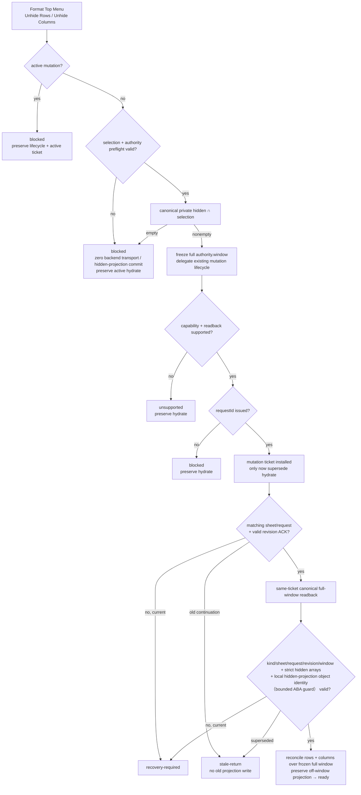
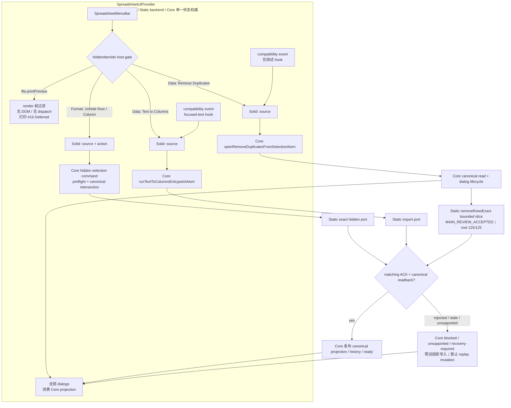
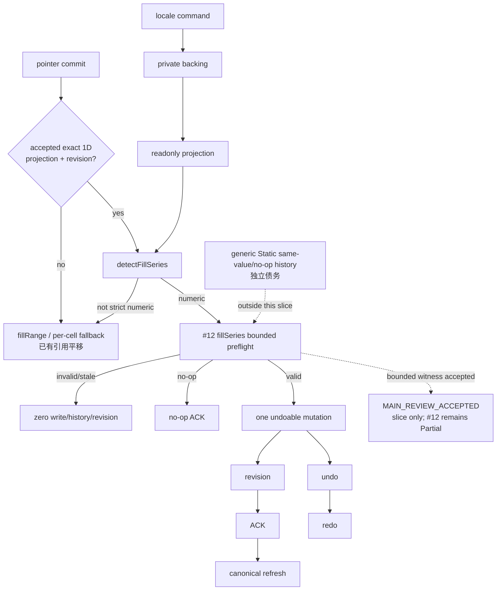
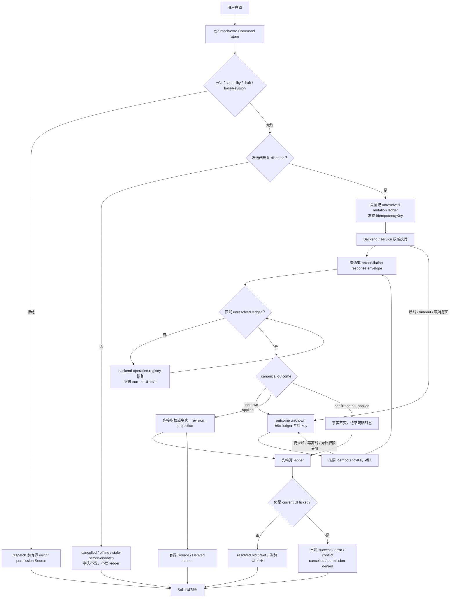
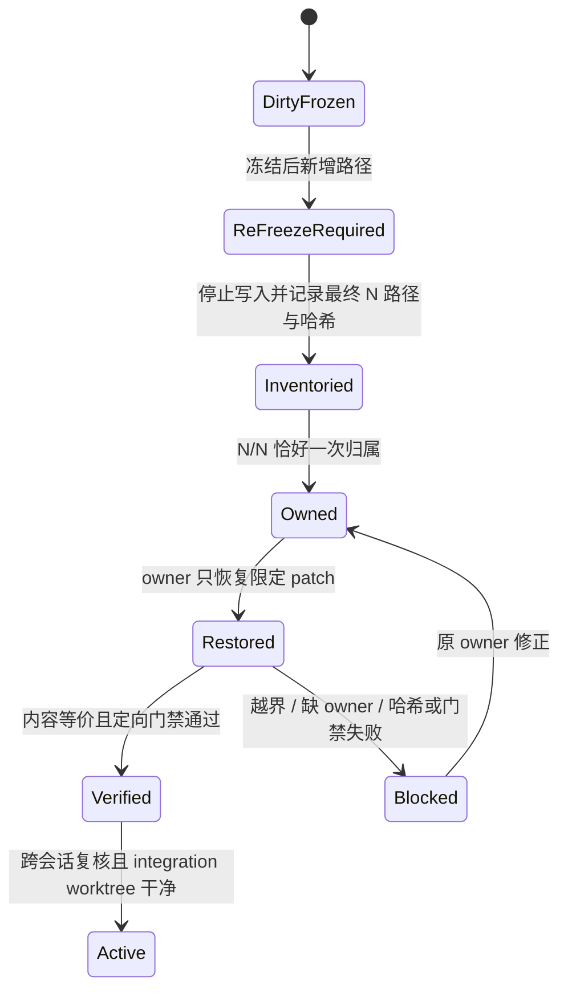
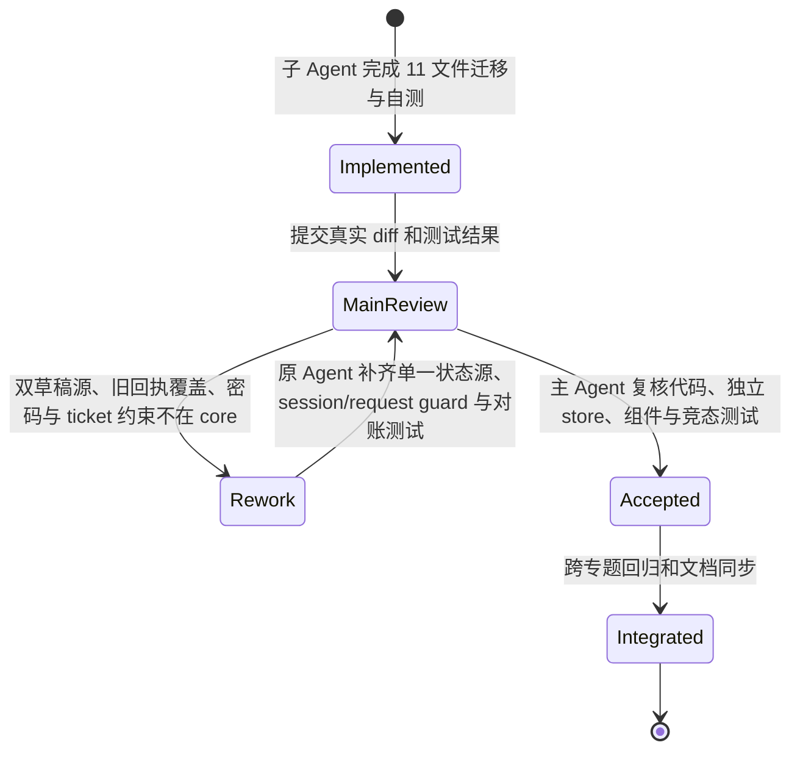
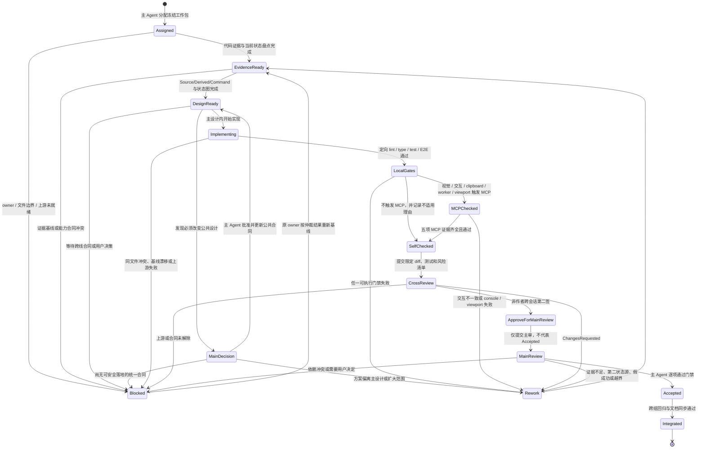

# 在线 Excel 多 Agent 执行与主审计划

更新时间：2026-07-17（当前执行附录）；下方保留 2026-07-14 历史计划

## 2026-07-17 当前执行协议

### 当前事实

当前 #03 收口证据按集合分层：`/root` targeted **7 suites / 216 tests PASS**（owner Solid/Grid **3 suites / 101 tests** + UI-core/Core **4 suites / 115 tests**）；独立 reviewer 的 Grid 新增 **3 tests** + 相邻全量 **74 tests** = **77 tests**，core/menu/hidden/boundary **115 tests**，ContextMenu **24 tests**。UI-core build PASS；全量 UI-core **57/57 suites、1437/1437 tests PASS**；全量 Solid **70 passed + 1 skipped suites（71 total）、1125 passed + 6 skipped tests（1131 total），0 failed**；Vite **293 modules PASS**。Full Solid `tsc` 仍是 exit 2、恰 5 条未变化的 Worker baseline diagnostics，不能写成 PASS。

1. 唯一交付源为 `/Volumes/work/self/einfach`；旧 worktree 只读追溯，不再参与复制、恢复或集成。
2. 41 项严格产品口径为 **0 `Verified` / 35 `Partial` / 5 `Missing` / 1 `Deferred`**，即 **40 项 active unfinished + 1 项 Deferred**。UI-core 层仍有 **31 项直接实现和直接测试 + 4 项部分实现**；不能把产品未闭环写成“代码没做”。
3. 35 项 `Partial` 只有一个主归属：**C1 = 6、C2 = 21、C3 = 8**。协作 Agent 可以补证据，不得另建平行 owner 或第二状态源。
4. #03 hidden rows/columns Static authority + Grid exact-window hydration + Format Top Menu selection Unhide、`/root/freeze_panes_static_authority` 的 #05 Static authority、#11 Paste Special Phase A+B + Context Menu + 状态边界、#12 numeric `fillSeries` witness、#14 Static CAS/Replace All、#04/#23 canonical four-border rendering、#23 rotation evidence、Static format / merge exact ACK 与 #30 Static `removeRowsExact` bounded slices 均已 `MAIN_REVIEW_ACCEPTED`；`removeRowsExact` 证据为 reviewer 22/22、root 整文件 125/125、range 子审 3/3 + 101,928 穷举。默认 Wave5 现已把 MenuBar 与全部 dialogs 置于同一个 `SpreadsheetUiProvider` / Einfach store，Solid 只转发 `{ source, action }` 或既有 Core entrypoint 参数。当前文档同步包只整理 accepted 状态流与最新证据。`/root` 固定为主设计与 review owner，不替专题 owner 实现。
5. UI-core 最新独立全量证据为 build / typecheck / diff-check、**57/57 suites、1437/1437 tests PASS**；C0 原始主审基线 55/1253、capacity/lifecycle 历史时点 55/1261、status/projection 历史时点 55/1274 均保留为对应时点证据。所有数字只覆盖对应层级，不表示 41 项产品完成。
6. Solid 当前 `/root` 全量 `--silent` 为 **70 suites passed / 1 skipped（71 total）、1125 tests passed / 6 skipped（1131 total）、0 failed，exit 0**；本轮前历史快照为 **69+1 suites / 1122+6 tests**；既有 Vite build 证据为 **PASS（293 modules）**，本轮没有把它冒充同时重跑。首次 full log capture 因约 11 万 token 的 jsdom canvas 噪声 exit 139，是瞬时捕获问题，不是产品 FAIL；历史 projection-lifecycle 接受时为 61+1 suites / 966+6 tests。旧 C1 8 passed / 4 skipped 因命中错误 worktree 已撤销；其后 5293/5294 owner 与 5393 root 的 10 passed / 2 skipped 限定 E2E 已接受。最近完成的 `c1_worker_dialog_mount` 又在 owner 5318 取得 TS/WASM 合计 12/12、0 skip / 0 fixme、console error 0、目标 Jest 3 suites / 78 tests 与 build PASS；`/root` 在 5418 独立复核并接受。HTTP 200 本身仍只证明服务可访问，产品保持 `Partial`。
7. Full Solid `tsc` 最终命令 `npx tsc --noEmit --pretty false -p excel/solid-excel/tsconfig.json` exit 2 / 恰好 5 diagnostics，均位于未修改且禁止扩围的 `worker-runtime*` baseline；C1 新测试 typing 已修，仍不得写成 `tsc PASS`。
8. Protection 生产 mutation/canonical read 仍 blocked；Named Range strict ACK 前置限定包已由主审复跑 4 suites / 154 tests 与定点 strict `tsc`、Vite、diff check，4/4 demo 显式注入。#14 capability truth、Static regex/provenance 与 Static CAS/Replace All 已独立接受，最新 root/agent 合并定向证据为 **4 suites / 165 tests PASS**；UTF-16 code units 的非空半开 `[start, end)` span 合同与 zero-width omit/reject 已闭合，剩余 blocker 恰为 Worker parity / real transport / E2E、generic ABA / durable cross-runtime concerns。#04/#23 canonical four-border rendering 已接受 **8 suites / 258 tests PASS**；剩余相邻 shared-edge conflict、merge/freeze、diagonal/full Excel parity。#23 rotation 纯测试证据 targeted **2/2**、adjacent **5 suites / 95 tests PASS**，未改实现/合同/Core/Worker；仍缺 browser auto-fit/hit-area、merge/freeze/virtualization。Static `set-format` / `merge` / `unmerge` exact ACK 已以 adapter **88/88**、Toolbar Playwright **10/10**、Vite build **PASS** 接受；Wave5 固定 Static，`wasm` / `ts` 两项目不是 Worker parity，Worker adapter 原有 `kind` 未改。#29 capability truth 已独立接受 **3 suites / 108 tests**；#05 Static authority 已接受 **UI-core 25/25 + Solid 171/171 + boundary 5/5 + two builds PASS**；#11 Phase A **2/33**、Phase B reviewer **6/123** + root **5/135**、Context Menu root **3/40**、状态边界 root **4/42** 已接受。所有限定包都不提升产品行；C3、完整系统 E2E、a11y、性能和发布全部 `pending / unverified`。
9. 第 9 组数据分析、第 16 组打印完全延后，位于 41 项严格总账之外；不得占并发槽，也不得把已有壳改写为完成。
10. `core/core`、`excel/excel-core-ts`、`excel/rust/**` 是本次迁移保护边界，当前 Agent 不得为了 UI parity 重写 engine。

#20 Format Painter 新增 default/empty source → formatted target 的 visible-only Static Wave5 见证：owner 与独立复核各自在 `wasm` / `ts` Playwright 项目标签下合计 **12/12**、console error 0；两组项目都运行同一个 Static backend，不能登记成 TS/WASM/Worker parity。#20 保持 `Partial`，唯一规范状态流见 [04｜Format Painter default-source lifecycle](./04-cell-formatting.md#format-painter-default-source-lifecycle)。

#06 keyboard-open Context Menu bounded slice 经独立审查 `ACCEPT`，但只覆盖键盘打开与焦点/关闭合同；#06 产品仍为 `Partial`，严格总账仍为 **41 = 0/35/5/1**。只有 `Shift+F10` / `ContextMenu` key 在 navigation、non-composing、non-editing、non-formula 且无 Ctrl/Meta/Alt 时进入 UI-core，普通 F10 与 gated 路径返回 `none`。UI-core / `@einfach/core` 是唯一菜单业务状态源并产生 intent；Grid 只把 `selectionSnapshot` 映射为 canonical `MenuOpenInput` 与可见 DOM anchor，其余 Solid 仅做 DOM anchor / focus bridge。缺失 anchor 或 `openMenu` 拒绝时，不调用 `preventDefault`、不打开菜单、selection 不变；成功以 `source: keyboard` 打开，Solid 聚焦首个 visible enabled menuitem；Escape 以 `cancelled` 关闭并恢复仍 connected 的 opener，pointer 打开不抢焦点。证据为独立 reviewer **3 suites / 141 tests PASS**、回归 **8 suites / 148 tests PASS**、UI-core `tsc` **0 diagnostics**、Solid 候选文件 **0 diagnostics** 与 **7-file diff-check**；这不是 full Solid `tsc` PASS，已知 Worker baseline 仍为 5 diagnostics。未跑真实浏览器 E2E，row/column/all selection 与 missing-anchor 等部分仍是源码审查边界；不得外推 TS/WASM/Worker parity 或产品完成。唯一规范图见 [02｜Keyboard Context Menu lifecycle](./02-worksheet-structure.md#keyboard-context-menu-lifecycle)，本执行计划不复制第二套状态机。第 9 组数据分析与第 16 组打印继续完全延后；#23 继续为 `Blocker / Pending`。

本轮实时三路为 #03 Context Hide/Unhide `MAIN_REVIEW_ACCEPTED / released`、#23 Shared-edge Contract `Blocker / Pending` 与 Docs Evidence `MAIN_REVIEW_ACCEPTED / released`，全部汇入 `/root MainReview`；规范流见 [README｜本轮三路并发→主审状态流](./README.md#本轮三路并发主审状态流)。#23 只因 canonical projection 尚缺 write-order / owner / explicit-none / tie 合同而等待裁决，不是安全告警或产品失败；裁决前不得发明优先级或写实现。#03/#23 继续 `Partial`，严格总账不变。

### #03 隐藏行列三切片 bounded 已接受流

#03 Static authority、Grid exact-window metadata hydration 与 Format Top Menu selection Unhide 三个 bounded slices 均已获 `MAIN_REVIEW_ACCEPTED`，产品项仍为 `Partial`。UI-core 的 `runViewportHiddenMutationAtom` 独占 hide/unhide lifecycle；Static backend 使用 per-sheet canonical `Set<number>` 保存隐藏事实与 history；Grid 只派发 hydration command。新 Top Menu 入口也不在 Solid 派生 selection 或 indices，只把 `{ source, action }` 转发给 UI-core `runViewportHiddenSelectionMutationAtom`。

selection Unhide 在 active mutation 时返回 `blocked` 并保留当前 lifecycle/active ticket；否则按 action/source、exactly one region、primary sheet、region sheet、range、authority ready、authority sheet/revision/window 与 target-axis coverage 顺序预检，再由 canonical private hidden ∩ selection 得出 indices。invalid 或空交集进入 `blocked`，零 backend transport/hidden-projection commit，并保留 active hydrate。非空交集只冻结完整 `authority.window` 并 delegate 既有 mutation lifecycle；capability/readback 缺失进入 `unsupported`，requestId 耗尽进入 `blocked`，两者都保留 hydrate。只有 capability/readback supported + requestId issued + mutation ticket installed 才 supersede hydrate。

ticket 安装后只接受 matching sheet/request + valid revision ACK；随后同 ticket canonical kind/sheet/request/revision/full-window readback、strict hidden arrays 与 local hidden-projection object identity（bounded ABA guard）均通过，才在冻结 full window 上同时 reconcile rows/columns、保留 off-window projection 并进入 `ready`。当前 ticket 的 ACK/readback/correlation/hidden-arrays/object-identity 失败进入 `recovery-required`；已被替换的旧 continuation 只 stale-return，不写旧 projection。五张规范 Mermaid 统一见 [README｜#03 bounded 状态流](./README.md#03-隐藏行列-bounded-状态流main_review_accepted)。



本轮前 Top Menu 历史定向快照为 **4 suites / 171 tests**：Core hidden **95/95** + UI-core menu registry **6/6** + Solid MenuBar **61/61** + package-boundary **9/9**；前三组为 **162/162**。此前 Solid Menu **58/58**、合计 **168/168**、前三组 **159/159** 是旧时点证据，不再代表当前包。历史 authority/hydration 证据继续独立保留为 adapter **106/106**、UI hidden **53/53**、Solid Menu **54/54**、hydration **36/36**、Grid **5/5**，以及 root UI-core **98/98** + Grid **74/74**，不得与当前切片数字混算。最新全量为 UI-core **57/57 suites、1437/1437 tests PASS**，build/typecheck PASS；Solid **70 passed / 1 skipped suites（71 total）、1125 passed / 6 skipped tests（1131 total），0 failed**；Vite **293 modules PASS** 为既有证据。Full Solid `tsc` 仍恰有 5 条禁止扩围的 Worker baseline diagnostics，不能记为全量通过。

Grid hydration 的旧 off-window residual 已移除，但 Top Menu 入口接受不等于产品链闭合：默认 App 选中的 `VNextWave5Demo` 已挂 `MenuBar`，Format Unhide 在默认 Static host 可达；这不证明 Worker、TS engine 或 WASM parity。两个 Worker backend 仍没有 hidden projection/mutation capability，Static-capable Context Menu 已具备真实 Hide/Unhide 可达链。UI-core 在 visibility 与 click time 都重验 capability；Worker backend 没有 hidden capability 时隐藏命令并 fail-closed，绝不呈现可用命令。Worker/Rust/真实 transport hidden parity、durable persistence/hydration、sparse runs、完整 E2E/a11y/perf/system closure 仍缺；严格总账保持 **41 = 0/35/5/1**，#03 仍为 `Partial`，数据分析/打印继续完全延后且位于 41 项外。

### 默认 Wave5 Static host：Provider、Menu 与 Core 汇流

默认 `VNextWave5Demo` 的 MenuBar、Grid 与全部 dialogs 共用同一个 `SpreadsheetUiProvider` / Einfach store。Solid 不拥有 selection、dialog、mutation、ACK 或 recovery 的第二份状态，只把 `{ source, action }` 或 `{ source }` 交给 Core。host 通过 `hiddenItemIds={['file.printPreview']}` 在渲染前移除 Print Preview；该入口不会进入 DOM、不会 dispatch，第 16 组打印因此继续完全延后。



Text to Columns 的真实 Data 菜单和 compatibility event 汇入同一 `runTextToColumnsEntrypointAtom`。Remove Duplicates 的真实 Data 菜单 success/undo 路径已独立验收；compatibility event 仅是定向测试 hook。Static `removeRowsExact` bounded slice 已经二次独立审查接受，证据为 reviewer 22/22、root 整文件 125/125、range 子审 3/3 且穷举 101,928。该结论只覆盖 Static bounded adapter slice；不得改写为 Worker、TS engine 或 WASM parity，也不证明整行删除的 merge、name、validation、conditional formatting、filter、freeze 等全 metadata parity。拒绝、陈旧、unsupported 或 ACK/readback 不匹配路径均不得写 canonical projection/history，也不得由 Solid 猜测成功。#30 保持 `Partial`，严格总账仍为 **41 = 0/35/5/1**。

#20 的 default/empty C2 `{}` → formatted B2 清除粗体也只是在该 Static host 上获得 visible-only 见证。capture、armed、target、pending、exact ACK、local-ack、canonical refresh、idle，以及 reject / outcome-unknown / blocked 不伪成功的完整图只维护在 [04 规范源](./04-cell-formatting.md#format-painter-default-source-lifecycle)；此处不复制第二套状态机。

### #12 自动填充 bounded 已接受流

#12 当前实现边界是“Solid Grid 调 UI-core detector + Static 数值序列 mutation”，不是引擎重写。locale 由 command 写 private backing、readonly atom 对外投影；pointer commit 只有通过 exact/non-truncated/unique/strict-1D/revision gate 才进入 detector，且仅有限非零整数/小数序列走 `fillSeries`，其余回落 `fillRange` / 受限逐格 fallback，其中 bounded per-cell fallback 已有引用平移。只有 #12 `fillSeries` bounded path 会先在 Static 完成整份预检，再做一次 undoable mutation、一次 revision、精确 ACK 与 canonical refresh；invalid/stale 零副作用，空有效计划 no-op ACK，undo/redo 继续由该 bounded history witness 承担。



主 Agent 已完成该 bounded 包的数值 canonicalization 与 undo/redo revision 身份审查并标记 `MAIN_REVIEW_ACCEPTED`：独立 reviewer **4 suites / 144 tests PASS**；`/root` adapter **99/99**、fill **17/17**、scaling **16/16**；该 bounded 包接受时的历史 Solid full 快照为 **69+1 suites / 1080+6 tests**，本轮前历史 Solid full 为 **69+1 suites / 1122+6=1128 tests**，当前权威为 **70+1 suites / 1125+6=1131 tests（0 failed）**；Vite build **PASS**；Full Solid `tsc` 仍仅 5 条禁止扩围的 Worker baseline diagnostics。接受只覆盖 #12 `fillSeries` 的 plan/no-op/preflight/单 mutation/单 revision 与 undo/redo witness，不得外推为 Static 全局 history/no-op 原子性完成；generic Static same-value/no-op history 仍是独立债务。bounded per-cell fallback 已有引用平移；完整 formula-series、Worker/真实 transport parity、date/weekday/month/custom、可见命令和 E2E/a11y/perf/系统门禁继续由后续 owner 处理。#12 保持 `Partial`，严格总账仍是 **41 = 0/35/5/1**；第 9 组数据分析和第 16 组打印仍完全延后且位于 41 项之外。

### 主设计检查表

| 层                            | 当前强制设计                                                                              | 主审拒绝条件                                                                  |
| ----------------------------- | ----------------------------------------------------------------------------------------- | ----------------------------------------------------------------------------- |
| backend/service               | 工作簿事实、权限、revision、批注身份/存储和权威回执的唯一来源                             | atom/mock/no-op 冒充持久能力                                                  |
| `excel/spreadsheet-ui-core` | `@einfach/core` Source/Derived/Command atoms、独立 store、有界 projection、严格 lifecycle | 引入其他状态库、Solid/DOM 依赖、无界产品事实缓存                              |
| Solid                         | Provider/hooks、渲染、事件、焦点、DOM bridge                                              | `createSignal`/store/闭包复制业务 draft、pending、error、selection 等产品状态 |
| adapter/runtime               | 精确实现已冻结 backend port，保留 capability/ACK/revision 语义                            | 宽化成功、猜测 applied、mutation recovery replay、隐式 fallback               |

### 当前限定包与并发槽

| 槽位状态 | Agent / 包                                         | 可以改                                                                      | 当前状态                                                                                                                                                                                                                      | 明确不能做                                                                                                                                                      |
| -------- | -------------------------------------------------- | --------------------------------------------------------------------------- | ----------------------------------------------------------------------------------------------------------------------------------------------------------------------------------------------------------------------------- | --------------------------------------------------------------------------------------------------------------------------------------------------------------- |
| released | #03 Context Hide/Unhide                            | 主审冻结白名单内的限定 diff 与直接测试                                      | `MAIN_REVIEW_ACCEPTED / released`；`/root` targeted 7 suites / 216 tests PASS                                                                                                                                                 | 不扩到 engine/Core 保护边界；#03 仍 `Partial`                                                                                                                   |
| pending  | #23 Shared-edge contract                           | canonical projection 合同与可验证规则                                       | `Contract Blocker / Pending`；待 `/root` 裁决                                                                                                                                                                                 | 裁决前不写实现、不发明优先级；#23 仍 `Partial`                                                                                                                  |
| released | `/root/docs_evidence_refresh`                      | `excel/solid-excel/docs/online-excel-parity/**`                                   | `Docs Evidence MAIN_REVIEW_ACCEPTED / released`；主审已接受                                                                                                                                                                   | 不改源码、不预宣称代码路线成功                                                                                                                                  |
| released | `/root/freeze_panes_static_authority`              | #05 Static authority 有界实现与测试                                         | `MAIN_REVIEW_ACCEPTED`；owner 槽已释放                                                                                                                                                                                        | bounded slice only；#05 仍为 `Partial`                                                                                                                          |
| released | `/root/update_parity_docs_current_truth`           | #05 与 #11 Phase A+B + Context Menu + 状态边界 accepted 状态流              | `MAIN_REVIEW_ACCEPTED`；Context 3/40、状态边界 4/42                                                                                                                                                                           | 不改 TS/Rust/Core 源码，不提升严格产品行                                                                                                                        |
| released | `/root/find_replace_capability_truth`              | #14 capability + Static regex/provenance + CAS/Replace All                  | `MAIN_REVIEW_ACCEPTED`；root/agent 4 suites / 165 tests                                                                                                                                                                       | UTF-16 非空半开 span、zero-width omit/reject 已闭合；Worker/transport/E2E、generic ABA/durable 缺；#14 `Partial`                                                |
| released | #04/#23 canonical border rendering                 | canonical `format.borders` 四边渲染                                         | `MAIN_REVIEW_ACCEPTED`；root 8 suites / 258 tests                                                                                                                                                                             | shared-edge、merge/freeze、diagonal/full parity 缺；两项 `Partial`                                                                                              |
| released | #23 canonical rotation evidence                    | rotation style / refresh 回归测试                                           | `MAIN_REVIEW_ACCEPTED`；targeted 2/2、adjacent 5 suites / 95 tests                                                                                                                                                            | 仅测试；browser auto-fit/hit-area、merge/freeze/virtualization 缺；#23 `Partial`                                                                                |
| released | Static format / merge exact ACK                    | `set-format` / `merge` / `unmerge` adapter ACK                              | `MAIN_REVIEW_ACCEPTED`；88/88 + 10/10 + build                                                                                                                                                                                 | Wave5 Static-only；Worker parity pending；相关行 `Partial`                                                                                                      |
| released | #20 Format Painter Static visible witness          | default/empty C2 `{}` → formatted B2 清除粗体                               | owner 与独立复核各自在 wasm/ts Playwright 项目合计 12/12、console error 0                                                                                                                                                     | 两项目复用同一 Static backend；不是 Worker parity；#20 `Partial`；状态流见 [04 规范源](./04-cell-formatting.md#format-painter-default-source-lifecycle)         |
| released | #06 Keyboard Context Menu bounded slice            | gated keyboard intent + canonical input/anchor + focus/close contract       | 独立 3 suites / 141 tests、回归 8 suites / 148 tests；UI-core `tsc` 0、Solid 候选 0 diagnostics、7-file diff-check                                                                                                            | 无真实浏览器 E2E；部分路径仅源码审查；#06 `Partial`；状态流见 [02 规范源](./02-worksheet-structure.md#keyboard-context-menu-lifecycle)                          |
| released | #30 Static `removeRowsExact` bounded slice         | Static exact row-range removal contract                                     | `MAIN_REVIEW_ACCEPTED`；reviewer 22/22、root 整文件 125/125、range 3/3 + 101,928 穷举                                                                                                                                         | Static-only；Worker/TS/WASM 与整行删除全 metadata parity 缺；#30 `Partial`                                                                                      |
| released | #29 filter/sort capability truth                   | Worker unsupported + bounded canonical read                                 | `MAIN_REVIEW_ACCEPTED`；3 suites / 108 tests                                                                                                                                                                                  | 无 overlay/cache/fake revision；#29 `Partial`                                                                                                                   |
| released | #12 bounded numeric `fillSeries`                   | exact canonical 1D + Static preflight/history witness                       | `MAIN_REVIEW_ACCEPTED`；reviewer 4/144，root 99/99 + 17/17 + 16/16                                                                                                                                                            | generic Static no-op debt、formula/Worker/transport 缺；#12 `Partial`                                                                                           |
| released | #03 hidden authority + hydration + Top Menu Unhide | UI-core lifecycle + Static Set/history + hydration + selection intersection | `MAIN_REVIEW_ACCEPTED`；历史 4 suites / 171 = 95 + 6 + 61 + 9，前三组 162；旧时点 168/159；历史 hydration 36/36 + Grid 5/5、root 98/98 + Grid 74/74；本轮前 UI-core full 56/56 suites、1432/1432 tests，当前 57/57、1437/1437 | 默认 Wave5 Static host 与 Static-capable Context Menu 已可达；Worker hidden capability/Context Menu reachability、durable/sparse/system 缺口仍在；#03 `Partial` |

Static `set-format` / `merge` / `unmerge` 响应现在回传精确 `kind`，并关联 `requestId` / `revision`（适用时含 range）。UI-core strict validator 接受后，唯一 lifecycle 为 `dispatch → Static mutation → local-ack → canonical projection refresh → ready`；缺失或错误 `kind` 继续进入 `outcome-unknown`，不得推断 mutation 已应用。接受证据为 adapter Jest **88/88**、Toolbar Playwright **10/10**、Vite build **PASS**。Wave5 demo 固定使用 Static backend，因此 Playwright 的 `wasm` / `ts` 项目只是重复验证同一 Static 链路，不是 Worker parity；Worker adapter 原有 `kind` 未改。UI-core / `@einfach/core` 仍是唯一状态中心，Solid 只做薄事件与渲染桥，相关产品行保持 `Partial`。

#20 Format Painter 的新可见见证同样不改变 backend：owner 与独立复核各自的 wasm/ts 项目合计 **12/12** 都是同一 Static 路径。成功/失败 lifecycle 只引用 [04 规范源](./04-cell-formatting.md#format-painter-default-source-lifecycle)，不在本执行计划内另建状态源。

`/root/provider_projection_authority` 的 #31 独立终审已完成并接受，也不占当前槽。

Formula Reference 与 Copy-As 是两个额外完成主审的状态边界包，不占当前三槽。Formula Reference 的 Solid DOM/caret/grid/keyboard intent 仅派发 UI-core command，private backing 再投影 readonly state；证据为 **5 suites / 56 tests PASS**、UI-core build PASS，Full Solid `tsc` 仍仅 5 条禁止扩围的 `worker-runtime*` baseline，#09 仍为 `Partial`。Copy-As 在 clipboard 前先通过 UI-core command 发布 private backing / readonly snapshot 与测试 mirror，失败 status 不覆盖既有 snapshot；证据为 **3 suites / 62 tests PASS**、UI-core build PASS、public atom direct setter **0** 与 publish-before-clipboard 顺序回归，#10 仍为 `Partial`。两包都遵守 `@einfach/core` + UI-core 状态中心、Solid 薄适配的主设计。

Top Menu 与 Context Menu 是另外两个额外完成主审的状态边界包，也不占当前三槽，均为 `MAIN_REVIEW_ACCEPTED`。Top Menu 的 3 个 public atoms 是 private backing 的 readonly projections，4 个 command atoms 保持 getter / args / result 兼容；UI-core + Solid 定向 **2 suites / 53 tests PASS**，build / 定点 `tsc` PASS，public atom direct setter **0**。Context Menu 的 2 个 public atoms 同样只读投影 private backing，command getter / args / result 兼容；UI-core menu **6 tests PASS**、Solid 定向 **75 tests PASS**，build / 定点 `tsc` PASS，public atom direct setter **0**；Solid 通过 `store.setter` 取得 UI-core command 真实返回的 `MenuCommandIntent`，再直接派发 backend，执行不订阅 `menuIntentAtom`。两包都遵守 `@einfach/core` + UI-core 状态中心、Solid 薄适配的主设计，限定接受不提升产品行。

#30 既有 Worker bounded exact-bridge 切片的历史 `MAIN_REVIEW_ACCEPTED` 结论保持不变：owner 定向 Jest **4 suites / 15 tests PASS**；只有所有降序连续 band 都 strict `true` ACK，并返回不同于扫描基线的新数值 revision，才向 UI-core 提交 exact witness/history，任一 `false`、reject 或 partial 都进入 `outcome-unknown` 且零 history。当前新增事实必须与该历史切片分开：默认 Wave5 的真实 Data > Remove Duplicates 菜单 success/undo 路径已独立验收，它只证明 Static host 入口与 Core dialog/history 流；compatibility event 仅是测试 hook。Static `removeRowsExact` bounded slice 已经二次独立审查接受：reviewer **22/22**、root 整文件 **125/125**、range 子审 **3/3** 且穷举 **101,928**。不得用默认 Wave5 的 `wasm` / `ts` Playwright 项目名外推 Worker/TS/WASM parity，也不得把 bounded acceptance 扩写为整行删除的 merge、name、validation、conditional formatting、filter、freeze 等全 metadata parity。跨 band 非原子、TS runtime no-op 与上述结构 metadata 缺口仍在，#30 保持产品 `Partial`。

Protection 是工作表/范围编辑锁，不是通用安全子系统。当前 direct-test 证据已覆盖 A mutation dispatch 后关闭/重开、晚 ACK、canonical refresh 和 B 会话隔离；但生产 protocol/engine 没有 `setRangeLock` / `readSheetProtection`，因此仍是 C2 blocker。mock、optional no-op、host overlay 或 UI atom 均不能解除 blocker。

Named Range strict ACK 的修复范围冻结为：Static 明确 mutation outcome/authority 与 list authority；Worker 等 engine boolean/unsupported ACK 后才发布 adapter overlay，拒绝时不发布、不 bump revision；dispose 后 late ACK 不得落地；mutation 串行化；capability factory 显式区分 static、worker-ts、worker-wasm。4/4 demo 已显式注入；`/root` 复跑 adapter/provider/name-manager/core named-ranges 4 suites / 154 tests，并通过定点 strict `tsc`、Vite build、diff check。真实 WASM 支持/持久化等产品链仍缺，#27 保持 `Partial`。本包未修改 runtime/protocol、TS/Rust engine 或 Protection。

Named Range 与 custom-formula capacity/lifecycle 已是当前波次的前置接受证据。capacity owner 通过 direct Jest 1 suite / 59 tests、UI-core full 55 suites / 1261 tests、Solid caller 1 suite / 13 tests、package build、额外 strict targeted `tsc`、scoped diff-check；ESLint 0 errors / 1 个既有 `@jest/globals` warning。`/root` 独立复跑 direct + Solid 2 suites / 72 tests、UI-core build、全仓 direct-setter `rg` 与 diff-check并接受。readonly projection 的 getter/subscriber 与 command callers 保持调用兼容；direct setter 类型能力有意移除，是外部 setter consumer 的 type-level breaking boundary，不能虚称全面 API 兼容。

已接受的 C2-PROVIDER 当时只允许改 `excel/solid-excel/src-vnext/provider/SpreadsheetUiProvider.tsx`、`excel/solid-excel/test/vnext-custom-formulas.test.tsx`，仅必要时在 provider 下抽纯 helper。Provider 第一版串行补偿泵曾因 stale unregister failure 跨 generation 的无限重试/cleanup barrier 漏洞被主审退回；owner 已按最新 desired 与 installed 是否仍不一致修复，并补 deferred failure 与持续 churn 的有界回归。owner targeted Jest exit 0、2 suites / 26 tests、0 snapshots，唯一 warning 是故障注入 `worker boom`；Vite build exit 0、291 modules、2.97s，仅既有 JSX/chunk warnings；full Solid `tsc` exit 2、仍仅 5 条 `worker-runtime*` baseline，两个触及文件 0 error；scoped ESLint exit 0、0 errors / 2 test dependency warnings；Prettier 与 scoped diff-check exit 0。`/root` 又独立通过 custom-formulas 1 suite / 18 tests 与 provider 1 suite / 8 tests，合计 2 suites / 26 tests，并完成 code review、Prettier 与 diff-check，现已 `MAIN_REVIEW_ACCEPTED`。非可取消 register ACK 晚到后仍须用远端实际 ACK 更新 installed，再针对最新 desired 串行补偿；失败不得伪造 installed，也不得无限自动重试。本包仅触及 Provider 与 vnext custom-formulas test，未改 Core/runtime/adapter/TS/Rust；限定包接受不升级产品状态，#26 保持 `Partial`。

当前 C1 Worker Go To/TTC 挂载切片已获 `MAIN_REVIEW_ACCEPTED`。owner 在 5318 回执 TS/WASM 各 6/6、0 skip / 0 fixme、console error 0、目标 Jest 3 suites / 78 tests 与 build PASS；`/root` 在独立端口 5418 复核，Vite PID 11473、cwd 为 `/Volumes/work/self/einfach/solid/excel`、HTTP 200，E2E 合计 12/12、0 skip / 0 fixme，并独立通过目标 Jest 3 suites / 78 tests。限定包接受不升级产品完成度，#06、#13 与其余 C1 产品行继续 `Partial`。

status-hard-cap 限定包已 `MAIN_REVIEW_ACCEPTED`。UI-core 独占 raw selection snapshot、selection coverage/sheet truth、50k cell cap 和 50k membership-check cap；Solid 只同步 raw sheetId/window/cells/upstream truncated 并渲染派生结果，不持有本地业务状态/cache/coverage。`/root` 独立 targeted status + core **2 suites / 47 tests PASS**，接受时 UI-core full **55 suites / 1274 tests PASS**；#31 保持产品 `Partial`。

#14 find/replace capability truth、Static regex/provenance 与 Static CAS/Replace All bounded slices 已 `MAIN_REVIEW_ACCEPTED`：最新 root/agent 合并定向证据为 **4 suites / 165 tests PASS**。能力由 port presence 派生为 `Unsupported` / `FindOnly` / `FindAndReplace`，pending transport 期间的 capability capture 不覆盖或重启请求。span 合同已冻结为按 UTF-16 code units 计数的非空半开区间 `[start, end)`；纯 zero-width regex 结果安全 skip/advance 后省略。UI-core 在 ticket / mutation 前拒绝 zero / reversed span 并 fail-closed；Static 直接 zero-width replacement 精确返回 `{kind: 'replace-matches-not-applied'}`，保持零写入、零 undo、零 revision bump。Static 还已闭合真实 consuming spans、同单元格 multi/global、invalid regex fail-closed、`displayValue` / `formula` target 与定向替换。`SpreadsheetBackend.replaceMatches` 返回现有 `ReplaceMatchesResponse` union：缺失/畸形 `requestId` 因不可关联 ACK，在 mutation 前抛错；有效可关联 `requestId` 下，缺失/陈旧 revision、不可推进 revision 或 duplicate/overlap/out-of-bounds/target/span 等整份 plan 预检失败，均返回 `{kind: 'replace-matches-not-applied'}`，并保持零写入、零 undo、零 revision bump。no-op ACK 不建 undo、不 bump revision；有效变更只建一次 undo、整份应用、只 bump 一次 revision，并 ACK 实际 revision。剩余 blocker 恰为 Worker parity / real transport / E2E，以及 generic ABA / durable cross-runtime concerns。#14 保持 `Partial`。

#04/#23 canonical four-border rendering bounded slice 已 `MAIN_REVIEW_ACCEPTED`：Solid Grid 只读 `cell()?.format?.borders`，以 top/right/bottom/left overlay 真实渲染 thin / medium / thick / dashed / dotted / double；`none` 不绘制，也不发布 `data-borders` claim。projection publish 可更新/移除 canonical borders，content change 或 projection refresh 后重新渲染；selection parent outline 与 fill handle 的 z-index 3 高于 `pointer-events: none` / z-index 1 border overlay。没有 `createSignal`、Solid store 或镜像状态；root 独立合并定向证据 **8 suites / 258 tests PASS**。剩余 blocker 恰为相邻 shared-edge conflict、merge/freeze、diagonal/full Excel parity；#04/#23 保持 `Partial`。

#23 canonical rotation evidence bounded slice 已 `MAIN_REVIEW_ACCEPTED`：本包只新增 `vnext-grid-cell-rotation.test.tsx`，没有实现、合同、Core 或 Worker 变更。`DisplayCell.format.rotation` 经 Grid style projection 覆盖 default / positive / negative / vertical；content-change refetch 后 updated / cleared 都从 canonical projection 重渲染，edit input 不继承 rotation。targeted **2/2 PASS**、adjacent **5 suites / 95 tests PASS**；browser auto-fit/hit-area、merge/freeze/virtualization 仍缺，#23 保持 `Partial`。

#29 filter/sort capability truth 限定切片已 `MAIN_REVIEW_ACCEPTED`：独立门禁 **3 suites / 108 tests PASS**。Worker 没有 `setFilterSort`，UI-core capability 因而 unsupported、入口禁用；只读取 bounded canonical window，不做 mutation、main-thread overlay、row permutation、`Map`/cache 或 fake revision bump，Static 路径保持。#29 保持 `Partial`。

#05 Freeze Panes Static authority bounded slice 已 `MAIN_REVIEW_ACCEPTED`，owner 槽已释放；证据为 UI-core **25/25**、Solid **171/171**、boundary **5/5**、两个 build **PASS**。后续 Static bounded history targeted **10/10 PASS**：freeze 已进入 bounded delta 与 full-sheet capture，精确保留 absent / `{0,0}`；覆盖 `Freeze A → B → undo B → undo A → redo A → redo B`、delete configured → undo restore → redo delete、invalid/stale 不建历史。仍缺 Worker/real transport parity、durable persistence/hydration、structural-transform 与完整系统门禁，#05 保持 `Partial`。规范 Mermaid 见 [README｜Pointer / Freeze bounded 状态流](./README.md#pointer-freeze-bounded-state-flows)。

Pointer readonly boundary 已 `MAIN_REVIEW_ACCEPTED`：public `pointerSessionAtom` / `pointerIntentAtom` 是 private backing 的 readonly projections，start/update/commit/cancel commands 是唯一 writers；`idle → active(update*) → commit intent → idle`，cancel 从 active 回 idle。唯一 Solid direct-setter fixture 已迁移为 command，UI-core **7/7**、Solid overlay **18/18 PASS**、setter scan **0**。该边界不升级产品行；规范 Mermaid 同见 [README｜Pointer / Freeze bounded 状态流](./README.md#pointer-freeze-bounded-state-flows)。

#11 Paste Special Phase A + Phase B、Context Menu 与状态边界 bounded slices 已 `MAIN_REVIEW_ACCEPTED`。Phase A 独立 reviewer **2 suites / 33 tests**，接受 UI-core lifecycle、Provider backend-port capture 与 real-worker demo dialog mount。Phase B 接受 Top Menu + Grid keyboard 的 canonical capability gate、dispatch-time second guard 与 `defaultPrevented` 语义；reviewer **6 suites / 123 tests PASS**，root **5 suites / 135 tests PASS**。Context Menu 通过同一 capability atom 响应式控制可见性，click-time second guard 通过后才创建 Core session，unsupported / stale revoke 零 transport；root **3 suites / 40 tests PASS**。状态边界把 7 个 public state atoms 收口为 private backing + readonly projections，外部 runtime setter fail-closed，真实 lifecycle 为 `pending → local-acknowledged → refreshing → closed`；root **4 suites / 42 tests PASS**，仅有既知 jsdom canvas console noise。Worker `pasteRange` / real transport、comments / column-widths 与完整 E2E 仍缺，#11 保持 `Partial`。

#31 raw-number canonical projection 限定切片已 `MAIN_REVIEW_ACCEPTED`：adapter 在 display format 前写 `valueKind` / `numericValue`，Provider 投影到 UI-core backing/derived aggregates，Status Bar 只读消费；formula string 保持 string，number 缺 raw/non-finite 时仍计数并置 `truncated`，不反解析格式化 `displayValue`。owner **5 suites / 157 tests**；root UI-core **2 suites / 45 tests**、Solid **3 suites / 112 tests**；独立终审 **5 suites / 157 tests**。真实 backend E2E 合计 **9/10**；唯一预期失败是 TS worker/runtime 尚未实现 number formatting。#31 保持 `Partial`。

projection-refresh-lifecycle 限定包已 `MAIN_REVIEW_ACCEPTED`。UI-core 每 store 最多保留一个 active 与一个 latest queued visible request；Solid 只运行一条共享 transport loop，queued caller 不启动第二 transport。主审证据为 UI-core full **55 suites / 1274 tests PASS**、Solid full **61 suites passed / 1 skipped、966 tests passed / 6 skipped、0 failed** 与 Vite build **PASS**；Full Solid `tsc` 仍只有 5 条禁止扩围的既有 diagnostics。#41 保持产品 `Partial`。

Sheet reorder 有界 adapter 切片已 `MAIN_REVIEW_ACCEPTED`。worker adapter 在 `moveSheet` stable-id/index remap 窗口合并早到的 `cellsDirty`；move ACK 后读取 canonical sheet list、重建 lookup，再 flush dirty 并稳定 active projection，失败路径以 `finally` 解门。`/root` 独立通过 full vnext-adapter **1 suite / 82 tests**，真实 backend reorder E2E 为 TS **1/1**、WASM **1/1**。本包未改 runtime/engine/Grid；#01 仍为产品 `Partial`。

### 并发状态与交接门

```mermaid
stateDiagram-v2
  [*] --> CodeTruthFrozen
  note right of CodeTruthFrozen
    产品口径：0 Verified / 35 Partial / 5 Missing / 1 Deferred
    UI-core 层级事实：31 项直接实现和测试 + 4 项部分实现
  end note
  CodeTruthFrozen --> AcceptedPredecessors: C1 10/2 + C1 mount 12/12 + C2 capacity/Provider 已接受
  AcceptedPredecessors --> FormulaReferenceAccepted: 5/56 + UI-core build
  FormulaReferenceAccepted --> C2RemainingPartial: #09 跨引擎语义仍未闭环
  AcceptedPredecessors --> CopyAsAccepted: 3/62 + setter 0 + 顺序回归
  CopyAsAccepted --> C1RemainingPartial: #10 完整剪切/粘贴仍未闭环
  AcceptedPredecessors --> TopMenuBoundaryAccepted: 3 readonly + 4 commands + 2/53
  TopMenuBoundaryAccepted --> ProductLedgerUnchanged: 不提升产品行
  AcceptedPredecessors --> ContextMenuBoundaryAccepted: 2 readonly + menu 6 + Solid 75
  ContextMenuBoundaryAccepted --> ProductLedgerUnchanged: returned intent transport
  AcceptedPredecessors --> HistoricalRemoveDuplicatesBridgeAccepted: historical worker bridge Jest 4/15
  HistoricalRemoveDuplicatesBridgeAccepted --> RemoveDuplicatesEntryHidden: capability absent/false
  HistoricalRemoveDuplicatesBridgeAccepted --> RemoveDuplicatesWasmRequest: WASM exact opt-in
  RemoveDuplicatesWasmRequest --> RemoveDuplicatesCommitted: all bands true + 新 numeric revision
  RemoveDuplicatesWasmRequest --> RemoveDuplicatesUnknown: false/reject/partial
  RemoveDuplicatesUnknown --> RemoveDuplicatesNoHistory: outcome-unknown / no history
  RemoveDuplicatesEntryHidden --> C2RemainingPartial: TS no-op
  RemoveDuplicatesCommitted --> C2RemainingPartial: 跨 band 非原子
  RemoveDuplicatesNoHistory --> C2RemainingPartial: #30 仍为 Partial
  AcceptedPredecessors --> DefaultStaticMenuMounted: MenuBar + dialogs share one Provider/Core store
  DefaultStaticMenuMounted --> PrintPreviewHostHidden: hiddenItemIds；zero DOM / zero dispatch；#16 Deferred
  DefaultStaticMenuMounted --> TextToColumnsCoreEntrypoint: Data menu + compatibility hook -> same Core entrypoint
  DefaultStaticMenuMounted --> RemoveDuplicatesRealMenuAccepted: Data menu success/undo accepted；compatibility event test-only
  RemoveDuplicatesRealMenuAccepted --> StaticRemoveRowsExactAccepted: bounded accepted；reviewer 22/22 + root 125/125
  StaticRemoveRowsExactAccepted --> C2RemainingPartial: Static-only；no Worker/TS/WASM or full-metadata parity
  AcceptedPredecessors --> BoundedPackagesTracked: /root 只主审；accepted 包释放 owner 槽
  BoundedPackagesTracked --> FindReplaceAccepted: #14 capability + regex/provenance + Static CAS/Replace All
  FindReplaceAccepted --> FindReplaceSpanContractFrozen: UTF-16 + nonempty half-open span
  FindReplaceSpanContractFrozen --> FindReplaceGuard: exact safe requestId + revision guard
  FindReplaceSpanContractFrozen --> FindReplaceZeroWidthClosed: pure zero-width omit；UI-core reject；Static not-applied
  FindReplaceGuard --> FindReplaceRejected: uncorrelatable requestId 抛错；其余 reject 返回 not-applied
  FindReplaceGuard --> FindReplacePreflight: full plan preflight before undo
  FindReplacePreflight --> FindReplaceRejected: stale/missing/unadvanceable revision 或 invalid plan
  FindReplacePreflight --> FindReplaceNoOpAck: no-op / no undo / no bump
  FindReplacePreflight --> FindReplaceApply: one undo / full apply / one bump
  FindReplaceApply --> FindReplaceAck: ACK actual revision
  FindReplaceRejected --> FindReplaceZeroSideEffects: zero write / zero undo / zero bump
  FindReplaceZeroSideEffects --> FindReplaceRemaining
  FindReplaceZeroWidthClosed --> FindReplaceRemaining: Worker/transport/E2E + generic ABA/durable
  FindReplaceNoOpAck --> FindReplaceRemaining
  FindReplaceAck --> FindReplaceRemaining
  FindReplaceRemaining --> C2RemainingPartial: root/agent 4 suites / 165 tests；#14 Partial
  BoundedPackagesTracked --> CanonicalBordersAccepted: #04/#23 root 8 suites / 258 tests
  CanonicalBordersAccepted --> CanonicalBorderProjection: cell format.borders
  CanonicalBorderProjection --> FourSideOverlays: top/right/bottom/left + six styles；none 不绘制
  FourSideOverlays --> BorderRerender: content change / projection refresh
  BorderRerender --> CanonicalBorderProjection: 更新或移除 canonical borders
  BorderRerender --> BorderRemaining: shared-edge + merge/freeze + diagonal/full parity
  BorderRemaining --> C2RemainingPartial: #04/#23 仍为 Partial
  BoundedPackagesTracked --> RotationEvidenceAccepted: #23 test-only targeted 2/2 + adjacent 5/95
  RotationEvidenceAccepted --> RotationProjection: DisplayCell.format.rotation -> Grid style
  RotationProjection --> RotationRefresh: content-change refetch -> updated/cleared rerender
  RotationRefresh --> RotationEditIsolation: edit input 不继承 rotation
  RotationEditIsolation --> RotationRemaining: browser auto-fit/hit-area + merge/freeze/virtualization
  RotationRemaining --> C2RemainingPartial: #23 仍为 Partial
  BoundedPackagesTracked --> FilterSortAccepted: #29 3 suites / 108 tests
  FilterSortAccepted --> FilterSortWorkerDisabled: unsupported + bounded canonical read
  FilterSortWorkerDisabled --> C2RemainingPartial: #29 仍为 Partial
  BoundedPackagesTracked --> HiddenRowsColumnsAccepted: #03 authority + hydration + Top Menu selection Unhide
  HiddenRowsColumnsAccepted --> HiddenCanonicalReadback: UI-core lifecycle + Static Set/history + exact-window hydration
  HiddenCanonicalReadback --> HiddenSelectionPreflight: source/action + one region + authority sheet/revision/window/axis coverage
  HiddenSelectionPreflight --> HiddenSelectionZeroTransport: invalid / empty intersection；blocked + preserve hydrate
  HiddenSelectionPreflight --> HiddenSelectionDelegate: nonempty canonical private hidden ∩ selection；freeze full window
  HiddenSelectionDelegate --> HiddenSelectionNoSupersede: capability/readback unsupported 或 requestId exhausted；preserve hydrate
  HiddenSelectionDelegate --> HiddenSelectionTicket: capability/readback supported + requestId + ticket installed；supersede hydrate
  HiddenSelectionTicket --> HiddenSelectionReady: matching sheet/request + valid revision ACK + strict full-window readback + local hidden-projection object identity（bounded ABA guard）
  HiddenSelectionTicket --> HiddenSelectionRecovery: current failure -> recovery-required；old continuation -> stale-return
  HiddenSelectionReady --> C2RemainingPartial: 当前 4 suites / 171；default Static menu reachable；Worker capability + Static-capable Context Menu reachable
  HiddenSelectionZeroTransport --> C2RemainingPartial: #03 remains Partial
  HiddenSelectionNoSupersede --> C2RemainingPartial: durable/sparse/system gaps remain
  HiddenSelectionRecovery --> C2RemainingPartial
  BoundedPackagesTracked --> FreezePanesAccepted: #05 Static authority MAIN_REVIEW_ACCEPTED
  FreezePanesAccepted --> FreezePanesOwnerReleased: UI-core 25/25 + Solid 171/171 + boundary 5/5 + two builds
  FreezePanesOwnerReleased --> FreezeHistoryAccepted: Static bounded history 10/10
  FreezeHistoryAccepted --> FreezeHistorySequences: A→B→undo B→undo A→redo A→redo B；delete/restore/delete
  FreezeHistoryAccepted --> FreezeHistoryRejected: invalid/stale 不建历史
  FreezeHistorySequences --> C2RemainingPartial: Worker / transport / persistence / structural / system gaps
  FreezeHistoryRejected --> C2RemainingPartial
  BoundedPackagesTracked --> PointerBoundaryAccepted: readonly public + private backing + command-only writes
  PointerBoundaryAccepted --> ProductLedgerUnchanged: 7/7 + Solid 18/18 + setter 0；总账不变
  BoundedPackagesTracked --> PasteSpecialPhaseABAccepted: #11 Phase A 2/33 + Phase B reviewer 6/123 / root 5/135
  PasteSpecialPhaseABAccepted --> PasteSpecialContextMenuAccepted: canonical visibility + click guard；root 3/40
  PasteSpecialContextMenuAccepted --> PasteSpecialReadonlyBoundaryAccepted: 7 readonly + setter fail-closed；root 4/42
  PasteSpecialReadonlyBoundaryAccepted --> C2RemainingPartial: Worker / real transport / comments / column-widths / E2E gaps remain
  BoundedPackagesTracked --> StaticMutationAckAccepted: set-format / merge / unmerge exact ACK
  StaticMutationAckAccepted --> StaticAckCorrelation: kind + requestId + revision
  StaticAckCorrelation --> StaticLocalAck: exact ACK
  StaticLocalAck --> StaticProjectionRefresh: canonical projection refresh
  StaticProjectionRefresh --> StaticReady: ready；Solid thin render
  StaticAckCorrelation --> StaticOutcomeUnknown: missing / wrong kind
  StaticOutcomeUnknown --> C2RemainingPartial: do not infer applied；canonical reconciliation
  StaticReady --> C2RemainingPartial: Wave5 Static-only；Worker parity pending
  BoundedPackagesTracked --> C1StatusHardCapAccepted: historical root 2/47 + UI-core 55/1274
  C1StatusHardCapAccepted --> StatusProviderOwnerAccepted: Provider owner 2/23 + related 4/33；root 3/31
  StatusProviderOwnerAccepted --> RawNumberAccepted: pre-format numericValue -> Provider -> UI-core aggregates
  RawNumberAccepted --> TsFormatExpectedFailure: E2E 9/10；worker-ts number-format 未实现
  TsFormatExpectedFailure --> C1RemainingPartial: #31 仍为 Partial
  BoundedPackagesTracked --> C2ProjectionAccepted: historical UI-core 55/1274 + Solid 0 fail + build PASS
  C2ProjectionAccepted --> C2RemainingPartial: 限定接受仍不升级 #41
  BoundedPackagesTracked --> C1SheetReorderAccepted: adapter 1/82 + TS/WASM 1/1
  C1SheetReorderAccepted --> C1RemainingPartial: 限定接受仍不升级 #01
  BoundedPackagesTracked --> DocsSyncActive: 同步 #03/#05/#11/#14/#04/#23 + rotation + Static exact ACK
  DocsSyncActive --> DocsMainReview: totals / Mermaid / links 检查后交接
  AcceptedPredecessors --> ProtectionAdapterBlocked: 缺生产 lock mutation + canonical read
  ProtectionAdapterBlocked --> NextCapabilityPackage: /root 另行冻结真实端口包
  C1RemainingPartial --> SystemVerification: 其余 C1 / C3 / 系统门禁
  C2RemainingPartial --> SystemVerification: 其余 C2 / C3 / 系统门禁
  DocsMainReview --> SystemVerification
  NextCapabilityPackage --> SystemVerification
  SystemVerification --> Revision: E2E / a11y / 性能失败
  Revision --> BoundedPackagesTracked: 原 owner 在限定范围修订
  SystemVerification --> ReleaseCandidate: 所有承诺范围门禁通过
  ReleaseCandidate --> [*]: 用户明确发布
```



关键 feature Core 的 mutation、#03 hidden rows/columns UI-core lifecycle + Static authority + Grid hydration + Top Menu selection Unhide、#14 capability + Static regex/provenance + CAS/Replace All、#04/#23 canonical four-border rendering、#23 canonical rotation、Static format / merge exact ACK、#05 Static authority、#11 Paste Special Phase A+B + Context Menu + 状态边界、#29 unsupported/bounded-read、Formula Reference command/backing/readonly、Copy-As snapshot-before-clipboard、Top/Context Menu、Remove Duplicates exact bridge、Protection、status bounded aggregation、Provider projection-owner lifecycle、projection latest-only 与 Sheet reorder remap gate 状态流统一维护在 [README｜已实现关键 Core 状态流](./README.md#已实现关键-core-状态流)。#03 的 UI-core lifecycle、Static canonical authority、Grid exact-window hydration 与 selection Unhide 五张 Mermaid 见 [README｜#03 bounded 状态流](./README.md#03-隐藏行列-bounded-状态流main_review_accepted)；Pointer readonly 与 #05 Static bounded history 的完整 Mermaid 见 [README｜Pointer / Freeze bounded 状态流](./README.md#pointer-freeze-bounded-state-flows)；#20 default-source Format Painter lifecycle 只见 [04 规范源](./04-cell-formatting.md#format-painter-default-source-lifecycle)。Wave5 双项目只覆盖 Static，不代表 Worker parity；UI-core / `@einfach/core` 仍是唯一状态中心，Solid 不持有第二份 lifecycle。所有 bounded acceptance 都不改变 0/35/5/1 总账；专题 owner 改变任何 transition、事实归属、revision witness 或 recovery 语义时，必须先更新状态图并交主审。

### 当前交付表

| 并发线                   | 输入                                                                                                | 必交证据                                                                                                                                                                                                                              | 当前状态                                                                                                                                                                        |
| ------------------------ | --------------------------------------------------------------------------------------------------- | ------------------------------------------------------------------------------------------------------------------------------------------------------------------------------------------------------------------------------------- | ------------------------------------------------------------------------------------------------------------------------------------------------------------------------------- |
| C1 status hard-cap       | status-bar UI-core/Solid 四文件                                                                     | 50k membership budget、coverage/outside/sheet/upstream truncated 真值与限定测试                                                                                                                                                       | `MAIN_REVIEW_ACCEPTED`；root 2/47 + UI-core 55/1274；#31 仍 `Partial`                                                                                                           |
| C1 status Provider owner | Provider projection sync bridge + Status Bar consumer                                               | canonical snapshot、latest-provider-wins、cleanup/late isolation、targeted 2/23 + related 4/33、root 3/31                                                                                                                             | `MAIN_REVIEW_ACCEPTED`；#31 仍 `Partial`                                                                                                                                        |
| C1 Copy-As boundary      | UI-core copy-as state + Solid thin dispatch                                                         | 3 suites / 62 tests、build、setter 0、snapshot-before-clipboard 顺序回归                                                                                                                                                              | `MAIN_REVIEW_ACCEPTED`；#10 仍 `Partial`                                                                                                                                        |
| Top Menu boundary        | UI-core menu-bar state + Solid thin dispatch                                                        | 3 readonly / private backing、4 command 兼容、2 suites / 53 tests、build/定点 tsc、setter 0                                                                                                                                           | `MAIN_REVIEW_ACCEPTED`；不提升产品行                                                                                                                                            |
| Context Menu boundary    | UI-core menu state + Solid returned-intent dispatch                                                 | 2 readonly / private backing、menu 6 + Solid 75 tests、build/定点 tsc、setter 0                                                                                                                                                       | `MAIN_REVIEW_ACCEPTED`；不提升产品行                                                                                                                                            |
| C2 projection refresh    | UI-core projection 与 Solid refresh lifecycle                                                       | 单飞期间 mutation 不丢 refresh、static 旧读回归、限定测试与主审                                                                                                                                                                       | `MAIN_REVIEW_ACCEPTED`；UI-core 55/1274、Solid 0 fail、build；#41 `Partial`                                                                                                     |
| C2 Formula Reference     | UI-core reference state + Solid thin events                                                         | 5 suites / 56 tests、build、Full Solid `tsc` 仅 5 条 forbidden worker baseline                                                                                                                                                        | `MAIN_REVIEW_ACCEPTED`；#09 仍 `Partial`                                                                                                                                        |
| C2 Find / Replace        | capability + Static regex/provenance + CAS/Replace All                                              | response union、UTF-16 非空半开 span、zero-width omit/reject、exact guard、full preflight、not-applied 零副作用、no-op、single undo/apply/bump/ACK；root/agent 4 suites / 165 tests                                                   | `MAIN_REVIEW_ACCEPTED`；仍缺 Worker/transport/E2E、generic ABA/durable；#14 `Partial`                                                                                           |
| C2 canonical borders     | canonical `format.borders` → Solid Grid overlays                                                    | 四边 + 6 styles、none 无 claim、publish 更新/移除、refresh rerender、selection 层级；root 8 suites / 258 tests                                                                                                                        | `MAIN_REVIEW_ACCEPTED`；仍缺 shared-edge、merge/freeze、diagonal/full parity；#04/#23 `Partial`                                                                                 |
| C3 canonical rotation    | `DisplayCell.format.rotation` → Grid style projection                                               | test-only；default/positive/negative/vertical、content refetch、updated/cleared rerender、edit input 隔离；targeted 2/2、adjacent 5/95                                                                                                | `MAIN_REVIEW_ACCEPTED`；仍缺 browser auto-fit/hit-area、merge/freeze/virtualization；#23 `Partial`                                                                              |
| C2 Static mutation ACK   | `set-format` / `merge` / `unmerge` Static adapter                                                   | exact `kind` + `requestId` / `revision`；strict `local-ack → refresh → ready`；bad kind unknown；88/88 + 10/10 + build                                                                                                                | `MAIN_REVIEW_ACCEPTED`；Wave5 Static-only；Worker parity pending；相关行 `Partial`                                                                                              |
| C2 #20 Format Painter    | Wave5 default/empty source → formatted target visible-only Static witness                           | C2 `{}` → B2 clear-bold；owner 与独立复核各在 wasm/ts 项目合计 12/12、console error 0；[04 唯一状态流](./04-cell-formatting.md#format-painter-default-source-lifecycle)                                                               | 同一 Static backend，不是 Worker parity；#20 `Partial`                                                                                                                          |
| C2 Filter / Sort         | Worker unsupported + bounded canonical read                                                         | 无 setFilterSort/overlay/permutation/cache/fake revision；Static 保持；3 suites / 108 tests                                                                                                                                           | `MAIN_REVIEW_ACCEPTED`；bounded slice；#29 `Partial`                                                                                                                            |
| C2 Hidden rows/columns   | UI-core hidden lifecycle + Static Set/history + exact-window hydration + Top Menu selection Unhide  | matching sheet/request + valid revision ACK；canonical intersection + full-window readback/reconcile；历史 4 suites / 171 = 95 + 6 + 61 + 9，前三组 162；full 57/1437                                                                 | `MAIN_REVIEW_ACCEPTED`；默认 Wave5 Static host 与 Static-capable Context Menu 可达；Worker capability/Context Menu reachability、durable/sparse/system gaps 仍在；#03 `Partial` |
| C2 Freeze Panes          | private backing + readonly projection + Static port                                                 | authority 25/25 + 171/171 + boundary 5/5；Static history 10/10，含连续 set/undo/redo、delete/restore/delete、invalid/stale 零历史                                                                                                     | `MAIN_REVIEW_ACCEPTED`；余 Worker/transport、persistence/hydration、structural-transform、系统门禁；#05 `Partial`                                                               |
| C2 Paste Special         | lifecycle + Provider + three-entry gates + readonly boundary                                        | Phase A 2/33；Phase B reviewer 6/123、root 5/135；Context 3/40；7 readonly + setter fail-closed、状态边界 4/42                                                                                                                        | `MAIN_REVIEW_ACCEPTED`；Worker / real transport / comments / column-widths / E2E 缺；#11 `Partial`                                                                              |
| C2 Remove Duplicates     | 历史 Worker exact bridge + 默认 Static host 真实 Data 菜单 + Static `removeRowsExact` bounded slice | 历史 bridge：all bands strict true + 新数值 revision；false/reject/partial unknown/no history。当前菜单：success/undo 独立验收、compatibility event 仅测试 hook。Static exact：reviewer 22/22、root 125/125、range 3/3 + 101,928 穷举 | 三个 bounded 证据均已接受；Static exact 不代表 Worker/TS/WASM 或 merge/name/validation/CF/filter/freeze 全 metadata parity，跨 band 非原子、TS no-op；#30 `Partial`             |
| C1 Sheet reorder         | worker adapter remap gate + real-backend E2E                                                        | early dirty coalesce、canonical list/lookup、flush、failure finally gate                                                                                                                                                              | `MAIN_REVIEW_ACCEPTED`；adapter 1/82、TS/WASM 1/1；#01 仍 `Partial`                                                                                                             |
| 历史代码真值文档交接     | 当时的代码、测试输出与冻结归属                                                                      | 41 项 0/35/5/1、UI-core 31+4、C1=6/C2=21/C3=8、历史三 Agent 波次、四份 Mermaid、Prettier                                                                                                                                              | 历史本地门禁 PASS；`HANDOFF_READY`                                                                                                                                              |
| 当前代码真值文档交接     | 当前代码、主审回执与冻结归属                                                                        | 41 项 0/35/5/1、40+1、#05/#11/#14/#04/#23 + rotation + Static exact ACK accepted 与精确剩余 blockers、Mermaid 与链接                                                                                                                  | 当前同步后交 root review                                                                                                                                                        |
| `/root` 主审             | 各限定 diff 与门禁输出                                                                              | 不扩围审查、状态源审查、证据与声明一致性                                                                                                                                                                                              | #05/#11 等 bounded 包与文档均 root review accepted                                                                                                                              |
| 后续系统门禁             | 主审接受后的 C1/C2/C3 候选                                                                          | E2E、a11y、性能、真实恢复/失败路径                                                                                                                                                                                                    | `pending / unverified`                                                                                                                                                          |

---

## 2026-07-14 历史执行计划（保留）

本计划把第 2、3、4、5、6、13 组和“批注 / 备注 / 任务”分配给独立专题 Agent；主 Agent `/root` 持有架构、跨组合同、验收和最终文档的唯一裁决权。多 Agent 用来并行收集证据和实现已冻结的工作包，不得自行改变 [总排期](./README.md) 的范围、优先级或主设计。第 9 组“数据分析”和第 16 组“打印”继续完全延后。发布与否始终由用户决定，Agent 只汇总建议和证据。

- **分工状态**：`UserConfirmed`。人日与会话归属以 [双会话分工提案](./WORK_SPLIT_PROPOSAL-2026-07-14.md) 为唯一分配账，本文件只承载执行 gate 与实时编排。
- **执行状态**：`CutoverPending / QuarantinedWork`。用户确认已经生效，但不豁免 dirty worktree、H0 或公共合同门禁；隔离 worktree 中已出现的 WIP 计执行槽，但在 `N/N` 路径守恒与 H0 关闭前不得交接或集成。

## 1. 不可偏离的主设计

| 层                            | 唯一职责                                                                                   | 禁止事项                                                                                     |
| ----------------------------- | ------------------------------------------------------------------------------------------ | -------------------------------------------------------------------------------------------- |
| Backend / service             | 持久工作簿事实、身份与 ACL、revision、幂等执行、分页和权威回执                             | 用前端 atom、mock 或可选 no-op 冒充持久能力                                                  |
| `excel/spreadsheet-ui-core` | 用 `@einfach/core` 定义 Source / Derived / Command atoms、状态机、有界缓存和 backend ports | 依赖 Solid；创建第二套 parser；使用无界 module `Map` 保存产品事实                            |
| `@einfach/solid`              | Provider、`useAtomValue`、`useSetAtom` 等绑定                                              | 承载业务规则或复制一份状态                                                                   |
| Solid host                    | 渲染、事件转发、焦点与 DOM bridge                                                          | 用 `createSignal`、Solid store 或组件闭包保存业务、表单、loading/error/offline/conflict 状态 |

所有专题共用同一条状态闭环：



任何 Agent 若需要改变事实归属、公开 port、revision 语义、公式 parser/reference model、缓存策略或跨组依赖，必须停止该部分实现并提交设计变更说明，由主 Agent 决定；不得在专题内部另起一套兼容层。

## 2. Agent 拆分与所有权

### 2.1 与既有协作协议的主从关系

[Spreadsheet UI Core Agent Collaboration](../../../../vanilla/spreadsheet-ui-core/docs/AGENT_COLLABORATION.md) 是共享工作台、In-flight 看板、状态词汇、文件冲突处理、交接格式和命令门禁的**流程主协议**。本文件是 Online Excel parity 范围内的**执行附录**，只细化专题拆分、冻结架构、主审门禁、波次与发布边界，不另立第三套协作协议，也不替代主协议中的 `blocked`。

两份文档出现歧义时：共享文件占用、交接、测试和冲突处理先按流程主协议暂停；Online Excel 的范围、`@einfach/core` 状态归属和跨组合同由 `/root` 仲裁。仲裁结论必须先同步到两份文档，再恢复实现，不能用口头约定绕过任一门禁。

| 本计划角色                        | 既有协议角色映射                                                                              | 责任边界                                                                              |
| --------------------------------- | --------------------------------------------------------------------------------------------- | ------------------------------------------------------------------------------------- |
| A02/A03/A04/A05/A06/AC/A13        | core 部分映射 CC 的 feature core / core test / feature doc；Solid 部分是 Codex 职责的定向委派 | 逻辑工作包名，不是额外并发额度；只拥有表中分配的专题边界，汇聚文件除外                |
| `/root`                           | Codex 的架构 review、跨 feature 冲突仲裁、Solid adapter/UI 合同 review、package/release gate  | 固定占用一个主审槽；只做主设计、接受/返工和机械串行集成，不写功能、测试或语义冲突修复 |
| 审计、conformance、E2E、MCP Agent | Codex 验证职责的可委派执行者                                                                  | 每启动一个就占用一个专题并发槽，不是“免费”后台工作                                    |

状态映射如下；In-flight 看板只写主协议允许的状态，细分节点保留在本文件的交付状态图中：

| 本文件细分节点                                                        | In-flight 状态                                                  |
| --------------------------------------------------------------------- | --------------------------------------------------------------- |
| `Assigned` / `EvidenceReady` / `DesignReady`                          | `planned`                                                       |
| `Implementing` / `LocalGates` / `MCPChecked`                          | `in progress`                                                   |
| `SelfChecked` / `CrossReview` / `ApproveForMainReview` / `MainReview` | `needs review`                                                  |
| `Blocked`                                                             | `blocked`                                                       |
| `Accepted` / `Integrated`                                             | 仅 `Integrated` 后标 `done`；`Accepted` 期间仍写 `needs review` |

### 2.2 专题 owner 与并发上限

每个专题最终都有一个独立 Agent owner。运行环境总并发上限为 4，`/root` 固定占 1 个槽，因此任一时刻最多还有 3 个执行槽。专题实现、只读审计、独立 review、conformance、E2E、性能和 MCP 验证都从这 3 个槽中扣除；同一任务不能同时按“专题线”和“审计线”重复记账。Agent 波次是执行编排，不替代总排期中的人日和团队容量估算，也不能拿 3 个执行槽冒充 11 FTE 的持续吞吐。

| Agent 工作包       | 独占范围                                             | 必须复用的上游                                | 交付物                                                                           |
| ------------------ | ---------------------------------------------------- | --------------------------------------------- | -------------------------------------------------------------------------------- |
| A02 工作表结构     | 02 文档、结构命令与其直接测试                        | 统一 revision、公式 reference rewrite         | 状态盘点、Source/Derived/Command 清单、结构命令状态机、static/worker parity 证据 |
| A03 基础编辑       | 03 文档、编辑事务与其直接测试                        | 结构变换、统一命令票据                        | 编辑/粘贴/填充事务状态机、失败回滚、取消与 stale response 测试                   |
| A04 单元格格式     | 04 文档、格式命令/投影与其直接测试                   | 统一命令票据、条件公式 evaluator              | 格式与条件格式状态机、边框/格式 projection、双后端契约证据                       |
| A05 公式与计算     | 05 文档、共享 tokenizer/AST/reference/evaluator      | 结构命令合同                                  | 单一公式模型、计算 lifecycle、取消/重算状态机、三后端 conformance                |
| A06 表格与数据管理 | 06 文档、筛选/排序/Table 与其直接测试                | 公式结构化引用、结构操作                      | 有界筛选草稿、Table 生命周期状态机、原子 mutation 与后端权威证据                 |
| AC 批注/备注/任务  | 批注文档、annotation core/port/UI 与直接测试         | 身份/ACL、revision/event platform             | 持久线程读写状态机、任务/通知状态机、能力降级与对账测试                          |
| A13 更改/视图/版本 | 13 文档、revision projections/Sheet Views 与直接测试 | durable revision、筛选排序、annotation events | Show Changes、恢复、Sheet Views 三套状态机和持久化证据                           |

会话归属已经由用户确认，不能由专题 Agent 在实施时重新分配：

| 会话 | P0/P1 owner 与人日                                     | P0/P1 小计 | P2 owner 与人日                            |      P2 小计 |
| ---- | ------------------------------------------------------ | ---------: | ------------------------------------------ | -----------: |
| CC-A | Stage 0.5 `8`、A02 `93`、A03 `60`、A05 `63`、A06 `122` |    **346** | A02 `31`、A03 `19～23`、A05 `25`、A06 `40` | **115～119** |
| CC-B | A04 `39`、AC `60`、A13 `76`                            |    **175** | A04 `15`、AC `25`、A13 `18`                |       **58** |

P0/P1 总量为 521 人日；`/root` 的架构、review 与 integration 容量已经包含在该总量及固定主审槽内，不是额外实施预算。P2 只有用户另行开启后才生效；AC P2 的 25 人日还需要单独确认，未确认时项目 P2 只能记 148～152 人日。CC-B 的任何实现都必须登记具名非 `/root` worker。

跨专题文件默认由主 Agent 持有，包括 backend 公共类型、共享 revision envelope、公式 reference model、根导出、总排期和本文件。专题 Agent 可以提出补丁，但未经主审不得自行扩展公共合同。

### 2.3 汇聚文件的单一 integration owner

以下高冲突文件统一由 `/root` 作为唯一 integration owner。专题 Agent 可以在自己的独立 worktree 提交定向 patch、调用点说明和测试证据，但不得把这些文件纳入专题所有权，不得直接合入集成分支。`/root` 每次只审和接入一条线；出现重叠 patch 时，后到工作包进入 `blocked`，待前一个集成并重新基线后再继续。

| 汇聚文件                                                   | 唯一 integration owner | 专题线交付方式                                    | 仲裁门禁                                                       |
| ---------------------------------------------------------- | ---------------------- | ------------------------------------------------- | -------------------------------------------------------------- |
| `excel/solid-excel/src-vnext/grid/SpreadsheetGrid.tsx`           | `/root`                | 提交单一交互入口的定向 patch 与对应 grid/E2E 证据 | 检查 projection 有界、UI 无第二状态源、事件只派发 core command |
| `excel/solid-excel/src-vnext/adapter/worker-runtime.ts`          | `/root`                | 提交单一 RPC/能力接线 patch 与双引擎证据          | 检查 TS/Rust 语义、optional capability 和错误合同              |
| `excel/solid-excel/src-vnext/adapter/worker-runtime-ts.ts`       | `/root`                | 提交与 wasm runtime 同合同的定向 patch            | 与 `worker-runtime.ts` 串行接入并跑 conformance                |
| `excel/solid-excel/src-vnext/adapter/worker-protocol.ts`         | `/root`                | 提交协议字段提案、兼容性说明和调用点清单          | 公共协议冻结后才允许实现；不得专题私自扩展                     |
| `excel/solid-excel/src-vnext/adapter/worker-workbook-backend.ts` | `/root`                | 提交 backend port 接线 patch 与窗口化读取证据     | 保留 capability 和有界 projection，不复制权威事实              |
| `excel/solid-excel/src-vnext/provider/SpreadsheetUiProvider.tsx` | `/root`                | 提交 provider 生命周期 patch 与 teardown 测试     | Provider 只桥接 store/backend；产品状态仍归 `@einfach/core`    |

`worker-runtime*.ts` 的所有当前文件和后续同模式文件都受此表约束；新增 runtime 变体不能借文件名变化绕开 `/root` 的单一 owner。

### 2.4 worktree、分支与串行集成纪律

1. 每条专题线、审计修复线和 E2E 修复线都从主 Agent 记录的同一基线 commit 创建独立 worktree 与独立分支；分支名带工作包，例如 `excel-parity/a05-remote-provider`。两个 Agent 不得共享一个工作树或同一分支。
2. 当前仓库根工作树是 dirty rescue source，只读保留，不承担集成。`/root` 的串行集成必须在从记录基线创建的干净 integration worktree 中进行；专题 Agent 不得在根工作树留下未完成源码、临时生成物或只完成一半的重命名，也不得为“帮忙过提交”整理、回退或格式化其他 Agent 的 dirty file。
3. 专题分支只有在本线定向 lint、类型、单测和适用的 E2E/MCP 全绿后才能交接。交接必须附基线 SHA、分支/commit SHA、限定路径 diff、实际命令输出和已知风险；红态或无法复现时标为 `blocked`，不能进入集成队列。
4. `/root` 按依赖顺序一次只接入一个绿态工作包。每次接入后先跑受影响的定向门禁，再接下一条；全部候选接入后，在干净集成树运行与 `.husky/pre-commit` 一致的全仓 `npm run build` 和 `npm test`。
5. 串行接入发生冲突、基线漂移或公共合同变化时，不自动重写另一条线。冲突线在 In-flight 看板标 `blocked`，写明文件、冲突类型和要保留的合同，由 `/root` 仲裁并要求原 owner 重新基线。

### 2.5 dirty 根工作树切换门

首次冻结记录为 HEAD `2feea483eefb`、33 个 dirty 路径（20 tracked modified + 13 untracked）。用户确认后先新增共享日账 `INFLIGHT.md`，再新增 `CUTOVER_INVENTORY.md`，因此 33/33 与 34/34 都只保留为来源证据；当前最终集合必须重冻为 35/35，若仍有并发新增则自动提升为最终 `N/N`。

在 `N/N` 清单、逐路径 owner、tracked diff/untracked blob 哈希、限定 patch、跨会话复核和干净 integration worktree 全部齐备前，切换保持 `Blocked`。禁止对 dirty 根执行混合 stash、`reset`、`checkout`、`clean`、覆盖或提交。已创建但保持 clean 的专题 worktree 只代表环境预备完成，不代表 H0 通过或实现已经 `Active`。



## 3. 执行波次

| 波次              | 日期              | 3 个并发执行槽                                                                                   | 主 Agent 工作                                                       | 退出门禁                                                                                                          |
| ----------------- | ----------------- | ------------------------------------------------------------------------------------------------ | ------------------------------------------------------------------- | ----------------------------------------------------------------------------------------------------------------- |
| W0 架构审计       | 2026-07-14～07-17 | 槽 1：dirty `N/N` 盘点；槽 2：F-1/AC Stage 0 readiness；槽 3：cutover 后 F-1 或 W0-DIALOG 二选一 | 同步确认分工、冻结状态归属与公共 ports；复核真实 diff 和每条证据    | `N/N` 切换门关闭；七份文档明确“当前/目标”并有状态图；无隐式第二状态源                                             |
| W1-A 公共合同冻结 | 2026-07-20～07-24 | 槽 1：AC + Stage 0.5；槽 2：A02 非批注 mutation fixture；槽 3：A03/A04 日账轮转                  | 审 envelope、registry、ACL/cursor/gap 和首个跨领域 fixture          | 07-24 冻结通用合同；annotation 与至少一个第 2～6 组 mutation 使用同一 fixture，未登记 revision 的 mutation 不合入 |
| W1-B 基础体验     | 2026-07-27～08-07 | 槽 1：AC C1 + M0.5；槽 2～3：A02/A03/A04 按 In-flight 日账轮转                                   | 逐包 review diff、core 测试、backend 合同和默认入口；不代做公共实现 | 08-07 M0.5 与 02/03/04 阶段门禁通过；未通过项退回原 Agent，不带病传给下游                                         |
| W2 数据语义       | 2026-08-10～09-04 | 槽 1：A05；槽 2：A06；槽 3：AC                                                                   | 审公式单一模型、Table/结构化引用边界、annotation 权威事实           | 三后端不撒谎；批注无可选 no-op；取消/冲突/离线/对账路径可测                                                       |
| W3 持久闭环       | 2026-09-07～10-02 | 槽 1：A13；槽 2：跨组 conformance；槽 3：E2E/性能                                                | 审 durable revision、恢复只追加 revision、Sheet View 隔离           | Show Changes/版本/视图不复用本地 undo 冒充；跨组契约全部冻结                                                      |
| W4 决策门         | 2026-10-05～10-16 | 槽 1：缺陷修复；槽 2：双后端回归；槽 3：可访问性/性能                                            | 汇总唯一发布建议与全套证据；复核数据安全、内存、MCP 与文档          | P0/P1 DoD 全过后提交用户决策；任何数据损坏、双后端分叉或无界缓存都阻断                                            |

表中“E2E/性能”“跨组 conformance”和任何临时审计都已经占槽；不能在三槽满载时再启动审计 Agent。W1 中 AC 从 07-20 起连续占一个执行槽，A02/A03/A04 只能在余下两槽轮转：In-flight 日账必须写明当日 active/queued/blocked owner、映射的 FTE 与交接 commit，不能把暂停的专题算作隐藏第四 Agent。若 C1 或 Stage 0.5 返工，它继续占用原槽并更新日账，A02/A03/A04 相应顺延；不得挪给 `/root` 代做，也不得把返工记入未使用的 11 FTE 容量。某槽工作进入 `blocked` 后可以释放运行时槽，但 In-flight 的 `blocked` 记录保留，直到原 owner 或 `/root` 明确解除。

`CF-07-24 ContractFreeze` 只表示 `/root` 接受共享 transaction/revision/event 合同、类型与 fixture skeleton；`M0.5-08-07` 才要求一条 annotation mutation 和至少一条第 2～6 组非批注 mutation 在同一 fixture 上完成原子 facts/revision、ACL、gap 与 reconciliation 证据。两者不能合并成一个“07-24 已实现”的假里程碑。

P2 仍按总排期的 P2-A / P2-B 独立启动门执行；专题 Agent 不得用“顺手实现”提前扩大范围。

### W0 当前并发账本

下面按**同时段**记账，而不是把所有任务写成一个“当前批次”。实时细节只写入 [INFLIGHT.md](./INFLIGHT.md)；本表记录本轮冻结编排，不另造第二本日账。

| 时段            | 总槽 0（固定）                      | 执行槽 1                                   | 执行槽 2                                           | 执行槽 3                                               |
| --------------- | ----------------------------------- | ------------------------------------------ | -------------------------------------------------- | ------------------------------------------------------ |
| W0-A 当前       | `/root`：确认同步、主设计与主审     | `dirty_cutover_inventory`：最终 35/35 复冻 | 已完成：A05-F-1 / AC-C0 Stage 0 readiness 只读审计 | CC-A A05-F-1：隔离 WIP，`active / quarantined`         |
| W0-B cutover 后 | `/root`：复核清单、真实 diff 与仲裁 | CC-A A05-F-1 producer                      | CC-B 具名 worker：W0-DIALOG 限定恢复与返工         | 余量仅供已登记 cross-review/复验；日账满三槽即停止派单 |

`fix_formula_cancel_race` 是历史任务名，真实范围仅为 data-validation、find-replace、protection-unlock 三组对话框及直接 core/tests，未授权修改公式。`excel-parity/cc-a-a05-f1` 已出现隔离的 `rewrite/` WIP，必须真实计入执行槽；在 H0 和 cutover 未通过前只能写成 `active / quarantined`，不得进入 H1 或集成。W0-B 的审计输出只提供证据，接收或返工仍由 `/root` 裁决。

### H0～H6 强制交接门

| Gate | 状态              | 必须证据                                                                                       | 未通过时                       |
| ---- | ----------------- | ---------------------------------------------------------------------------------------------- | ------------------------------ |
| H0   | `ScopeFrozen`     | 基线、Axx owner、具名 worker、限定路径、core 状态边界、上游合同、槽位与日期均登记              | `Blocked`；不得实现            |
| H1   | `LocalCommit`     | owner worktree 仅有限定 diff；可审计 commit/patch、路径清单和哈希齐全                          | 退回原 owner                   |
| H2   | `LocalGates`      | `diff --check`、定向 lint/type/test 及必要 conformance/UI 证据真实可复现                       | `Rework`；继续占原槽           |
| H3   | `CrossReview`     | 另一会话非作者 reviewer 第二签，仅可给 `ApproveForMainReview`、`ChangesRequested` 或 `Blocked` | `Rework` 或 `Blocked`          |
| H4   | `MainReview`      | `/root` 审主设计、状态边界、合同、限定 diff 与证据后给 `Accepted`                              | 退回原 owner；`/root` 不修代码 |
| H5   | `SerialIntegrate` | `/root` 在干净 integration worktree 机械应用 handoff 并复跑门禁                                | 失败退回原 owner               |
| H6   | `Integrated`      | 集成证据、依赖与 In-flight 日账同步完成                                                        | 未达成前不得标 `done`          |

### W0 主审记录：三组对话框迁移

主审结论为 **`MainReview → Rework`**，暂不计为“已收口”。这批改动把多个 Solid `createSignal` 产品状态迁到了 `@einfach/core`，方向正确，也补了独立 store 测试；但“状态放进 atom”不等于满足主设计，当前仍有以下阻断项：

| 子范围            | 已符合的部分                                                      | 阻断接收的问题                                                                                                                                      | 返工门禁                                                                                                                                                        |
| ----------------- | ----------------------------------------------------------------- | --------------------------------------------------------------------------------------------------------------------------------------------------- | --------------------------------------------------------------------------------------------------------------------------------------------------------------- |
| Data Validation   | 表单字段由 core atom 暴露，Solid 改为 hooks 绑定                  | `validationRuleEditorAtom.draft` 与 `validationRuleFormAtom` 同时保存可编辑规则，两个写入口可漂移；保存/清除晚回执会无条件关闭后来重开的编辑器      | 只保留一个规则草稿事实源；所有成功/失败回执都校验 core session/request ticket，旧回执不得关闭或覆盖新会话                                                       |
| Find / Replace    | open、表单、query、cursor、cap notice 已迁入 core                 | search/replace 仍由 Solid 直接调 backend；结果、错误、选区聚焦没有 session/request ticket，关闭重开或发起新查询后，旧回执仍可覆盖结果并移动当前选区 | backend 调用和 lifecycle 进入 framework-agnostic command/write atom；query key、request id、base revision 共同守卫晚回执，并区分 read ticket 与 mutation ledger |
| Protection Unlock | open、target、password、pending、error 和 sync ticket 已进入 core | 关闭命令不清空明文密码，也不在 core 内作废 ticket；作废约束只存在于 Solid `handleClose`，其他调用者可绕过，旧解锁回执可关闭新 target                | core close/open/retarget 命令统一清理密码并递增 ticket；校验 target/session；dispatch 后 mutation 按权威回执/对账处理，不能只把 UI 回执变成 no-op               |

这批改动的实际流转为：



返工必须至少覆盖三条可复现竞态：请求 A 未完成时关闭并重开为会话 B；请求 A 未完成时发起请求 B；保护 target A 未完成时切换到 target B。每条都要证明 A 的 UI 回执不能改变 B，而 backend 已 dispatch mutation 的权威结果仍会进入 ledger/reconciliation，不能被 ticket guard 静默丢失。

## 4. 单 Agent 交付状态流



Agent 自报“完成”只代表进入 `CrossReview`；跨会话 reviewer 只能给 `ApproveForMainReview`，也不自动变成 `Accepted`。只有 `/root MainReview` 可以接受工作包，发现的问题必须回到原专题 Agent，避免由另一 Agent 在不了解上下文时横向修补。`blocked` 是必须保留的真实状态，不等于完成或返工；解除前要有 `/root` 仲裁、上游绿态或用户决定之一，并由原 owner 重新核对基线。

视觉、交互、clipboard、worker 或 viewport 相关改动触发 MCP 验证时，必须在进入 `SelfChecked` 前记录既有协议要求的五项证据：URL、操作路径、可视 cell 数、console warning/error、与 Excel 交互一致性结论。MCP 或 E2E 若委派给另一个 Agent，该 Agent 同样占一个执行槽；不能先报 `SelfChecked`，再到 W4 补证据。

## 5. 专题 Agent 交接模板

每次交接必须包含以下内容，缺一项即退回：

1. **范围**：完成与未完成的功能编号；明确没有触碰第 9、16 组。
2. **状态清单**：每个 Source、Derived、Command atom 的文件、owner、容量、初始化和 teardown。
3. **事实归属**：哪些事实属于 backend，哪些是有界 UI projection；说明没有第二状态源。
4. **状态图**：成功、失败、取消、离线、权限撤销、冲突、stale response 和 outcome unknown；不适用分支要给理由。
5. **代码变更**：限定路径的 diff；公共合同变更单独列出并关联主 Agent 决策。
6. **验证证据**：独立 `createStore()` 单测、backend conformance、Solid 交互、关键 E2E/MCP，以及实际运行命令与结果。
7. **剩余风险**：未覆盖后端、性能上限、迁移/回滚和下游依赖，不用“后续优化”隐藏阻断项。

## 6. 可执行验证门禁

命令在各自独立 worktree 中运行。交接记录必须写实际文件或测试路径、退出码和结果摘要，不能只勾“已测试”。以下是最低门禁；专题文档要求的双引擎 conformance、Rust 测试或性能上限要在此基础上追加。

文档-only：

```bash
git diff --check -- excel/solid-excel/docs/online-excel-parity
npx prettier --check excel/solid-excel/docs/online-excel-parity/*.md
```

UI core 类型、atom 或 backend port：

```bash
npx tsc -p excel/spreadsheet-ui-core/tsconfig.json --noEmit --pretty false
npx jest excel/spreadsheet-ui-core/test/<feature>.test.ts --runInBand
npx jest excel/spreadsheet-ui-core/test/package-boundary.test.ts --runInBand
```

执行时必须把 `<feature>` 替换成真实测试文件；若跨多个 feature，显式列出每个文件，不能用一次全局成功掩盖遗漏。

影响 `excel/solid-excel/src-vnext` adapter、provider 或 UI：

```bash
npx tsc -p excel/solid-excel/tsconfig.json --noEmit --pretty false
npx jest excel/solid-excel/test/vnext-*.test.tsx excel/solid-excel/test/vnext-adapter.test.ts --runInBand
NO_PROXY=localhost,127.0.0.1 npm run e2e -w @einfach/solid-excel -- e2e/vnext-smoke.spec.ts
```

定向 ESLint 直接调用 ESLint，并显式列出本工作包改动文件：

```bash
npx eslint --config rules/.eslintrc <changed-file.ts> <changed-file.tsx>
```

禁止使用 `npm run eslint` 做定向检查，也禁止给定向命令加 `--fix`。仓库脚本固定扫描 `./ --fix`，追加文件参数不能缩小范围，反而会改写其他工作包。需要格式化时，只对本工作包拥有的文件运行 formatter，并把 diff 纳入交接。

主 Agent 串行接入全部绿态候选后，在干净集成树运行 `.husky/pre-commit` 的全仓门禁：

```bash
npm run build
npm test
```

任一命令失败即不能进入 `SelfChecked` 或 `Integrated`。如果失败来自已确认的上游或同文件冲突，标 `blocked` 并附证据；不能跳过、静默缩小范围或在共享工作树修别人的中间态。

## 7. 发布决策边界

W4 是“发布建议与用户决策门”，不是 Agent 自动发布阶段。`/root` 只汇总 P0/P1 DoD、全仓门禁、双后端 conformance、E2E/MCP、数据安全、内存上限、未决风险和回滚建议，并给出 `建议发布` 或 `建议不发布`。最终是否发布及何时发布由用户明确决定。

本计划不授权任何 Agent（包括 `/root`）执行 `git push`、创建 tag、发布 package、建立 release 或修改 `.github/workflows`。即使所有门禁全绿，也必须停在用户决策门；后续发布动作需要用户另行明确授权。

## 8. 主 Agent review 门禁

- [ ] `@einfach/core` 是唯一前端产品状态源，`@einfach/solid` 只绑定；没有新增 Redux/Zustand/Jotai/Signal/store 等平行产品状态。
- [ ] backend 是持久事实源；optional method、fake、host map 或 UI 乐观值没有被写成“已实现”。
- [ ] Source / Derived / Command 分工明确；command 是产品状态的唯一写入口，派生值不镜像存储。
- [ ] 动态 atoms 使用稳定 key、有界缓存和 teardown；没有逐格 atom、无界 Map 或跨测试共享 store。
- [ ] dispatch 前取消与 dispatch 后结果未知分开；幂等键、revision、stale response、冲突和权限撤销有测试。
- [ ] static 与 worker/Rust 共享语义；不支持的能力由 capability 明示并禁用入口，不静默降级。
- [ ] 公式和结构化引用只使用共享 tokenizer/AST/reference rewrite，不新增 regex/adapter 私有 parser。
- [ ] 专题状态图与真实实现一致，且文档明确区分“当前实现”和“目标设计”。
- [ ] 改动没有扩大到完全延后的数据分析或打印，也没有越过专题文件所有权。
- [ ] 工作包来自独立 worktree/分支；汇聚文件只由 `/root` 串行接入，同文件冲突保留为 `blocked`。
- [ ] 非作者跨会话 reviewer 已给 `ApproveForMainReview`；没有用作者自测或 `/root MainReview` 替代 H3 第二签。
- [ ] 定向 lint、类型、单测和适用的 E2E 命令有真实输出；未运行 `npm run eslint` 或定向 `--fix`。
- [ ] 触发 MCP 的工作在 `SelfChecked` 前已有 URL、操作路径、可视 cell 数、console、Excel 一致性五项证据。
- [ ] 主 Agent 已 review 实际 diff 和测试输出；只有主 Agent 可以把工作包标记为 `Accepted`。

## 9. 返工与停止规则

出现以下任一情况，主 Agent 立即停止集成并退回原 Agent：新增第二状态系统；把 backend 事实搬到 atom；可选调用造成假成功；引入第二公式解析器；无界缓存；擅改公共合同；隐藏 static/worker 分叉；删除失败/取消/冲突分支；或扩大到第 9、16 组。若公共设计本身需要调整，先更新本文件、总排期和相关专题状态图，再恢复实现，保证代码不先于设计分叉。
