# 在线 Excel 功能补齐总排期

更新时间：2026-07-17（当前收口基线）；下方保留 2026-07-14 历史规划

## 2026-07-16 当前代码收口结论

### 唯一交付源与状态口径

当前 #03 收口证据按集合分层：`/root` targeted **7 suites / 216 tests PASS**（owner Solid/Grid **3 suites / 101 tests** + UI-core/Core **4 suites / 115 tests**）；独立 reviewer 的 Grid 新增 **3 tests** + 相邻全量 **74 tests** = **77 tests**，core/menu/hidden/boundary **115 tests**，ContextMenu **24 tests**。UI-core build PASS；全量 UI-core **57/57 suites、1437/1437 tests PASS**；全量 Solid **70 passed + 1 skipped suites（71 total）、1125 passed + 6 skipped tests（1131 total），0 failed**；Vite **293 modules PASS**。Full Solid `tsc` 仍是 exit 2、恰 5 条未变化的 Worker baseline diagnostics，不能写成 PASS。

- 唯一交付目录是 `/Volumes/work/self/einfach`。本轮只认该目录当前代码与在该目录实际运行的验证结果；其他 worktree、临时集成目录和旧救援副本只可用于历史追溯，不得再复制、覆盖或作为完成证据。
- 本批次 `src-vnext` 涉及的在线 Excel 产品状态已收敛到 `excel/spreadsheet-ui-core` 中的 `@einfach/core` atoms / store；这不表示整个 legacy Solid 已迁完。对应 Solid vnext 接线只负责 Provider、渲染、事件和 DOM bridge；工作簿内容、revision、权限和持久批注仍以 backend/service 为权威事实。
- `Core 已验证` 仅表示 UI-core 实现存在并通过直接测试，不等于 Solid 接线、worker/backend parity、demo、E2E 或发布已经完成。
- C0 已验证基线：`@einfach/spreadsheet-ui-core` build 通过；UI-core 全量 **55 suites / 1253 tests** 通过；`git diff --check` 通过；C0 已由 `/root` 完成 `MainReview verified`。随后 C2 自定义公式容量/lifecycle 的历史门禁为 **55 suites / 1261 tests PASS**，status hard-cap / projection lifecycle 接受时为 **55 suites / 1274 tests PASS**；本轮前历史快照为 **56/56 suites、1432/1432 tests PASS**。当前 `/root` 全量为 **57/57 suites、1437/1437 tests PASS**，UI-core build PASS。这些数字都只是对应时点的层级证据，不能倒写成整个产品项完成。
- Solid 当前实测全量 `--silent` 复跑为 **70 suites passed + 1 skipped（71 total），1125 tests passed + 6 skipped（1131 total），0 failed，exit 0**。既有 Vite build 证据为 **PASS（293 modules）**。本轮前历史快照为 **69 suites passed + 1 skipped（70 total），1122 tests passed + 6 skipped（1128 total）**；更早 projection-lifecycle 接受时为 **61 suites passed / 1 skipped、966 tests passed / 6 skipped**。Full Solid `tsc` 仍是 exit 2、恰 5 条未变化的 Worker baseline diagnostics，严禁写成 PASS。默认 demo `http://127.0.0.1:5173/` 的既有 HTTP 200 证据只证明服务可访问，不等于功能路径已人工验证。
- Full Solid `tsc` 最终复跑命令 `npx tsc --noEmit --pretty false -p excel/solid-excel/tsconfig.json` 为 **exit 2，恰好 5 条 diagnostics**：`worker-runtime-ts.ts` 864 一条、1306 两条、1312 一条，`worker-runtime.ts` 264 一条；全部位于本轮未修改且禁止扩围的 runtime baseline。C1 新测试 typing 已修复；禁止把结果写成 `tsc PASS`。C2 其余项、C3、完整系统 E2E、a11y、性能与人工关键路径仍为 **pending / unverified**。
- C1 旧 Playwright **8 passed / 4 skipped** 已撤销为当前根证据：`reuseExistingServer` 命中 PID 48572，其 cwd 是另一个 integration-v2 worktree。其后 owner 5293/5294 与 root 5393 的 **10 passed / 2 skipped** commit+Escape 限定 E2E 已 `MAIN_REVIEW_ACCEPTED`。当前 `/root/c1_worker_dialog_mount` 又补齐 Worker demo Go To/TTC 挂载：owner 5318 为 TS/WASM 合计 **12/12**、0 skip / 0 fixme、console error 0、目标 Jest **3 suites / 78 tests** 与 build PASS；`/root` 在独立端口 5418 复核，Vite PID 11473、cwd 为 `/Volumes/work/self/einfach/solid/excel`、HTTP 200，E2E **12/12** 和目标 Jest **3/78**，并将该切片标记为 `MAIN_REVIEW_ACCEPTED`。两个限定包接受都不等于 C1 产品完成，#06、#13 与其余 C1 产品项仍为 `Partial`。
- #06 新增限定验收证据：Go To parser `go-to.test.ts` **87/87**，Name Box `vnext-name-box.test.tsx` **18/18**，真实多选 E2E `vnext-selection-real-backend.spec.ts` 为 WASM **1/1** + TS **1/1**、console error **0**。该证据只闭合 parser 边界、Name Box 跨 sheet 切换后滚动/失败无副作用，以及修饰键追加多选再普通单击恢复单区的窄链路；#06 的完整产品与系统门禁仍未闭环，保持 `Partial`。
- #06 keyboard-open Context Menu bounded slice 经独立审查 `ACCEPT`，但只接受键盘打开与焦点/关闭合同，#06 产品仍为 `Partial`，严格总账仍为 **41 = 0/35/5/1**。只有 `Shift+F10` / `ContextMenu` key 在 navigation、non-composing、non-editing、non-formula 且无 Ctrl/Meta/Alt 时进入 UI-core；普通 F10 与所有 gated 路径返回 `none`。UI-core / `@einfach/core` 是唯一菜单业务状态源并产生 intent；Grid 只把 `selectionSnapshot` 映射为 canonical `MenuOpenInput` 与可见 DOM anchor，其余 Solid 仅做 DOM anchor / focus bridge。缺失 anchor 或 `openMenu` 拒绝时，不调用 `preventDefault`、不打开菜单、selection 不变；成功以 `source: keyboard` 打开，Solid 聚焦首个 visible enabled menuitem。Escape 以 `cancelled` 关闭并把焦点恢复到仍 connected 的 opener；pointer 打开不抢焦点。独立 reviewer **3 suites / 141 tests PASS**，回归 **8 suites / 148 tests PASS**，UI-core `tsc` **0 diagnostics**、Solid 候选文件 **0 diagnostics**、**7-file diff-check**；这不是 full Solid `tsc` PASS，已知 Worker baseline 仍为 5 diagnostics。未运行真实浏览器 E2E，row/column/all selection 与 missing-anchor 等部分仍是源码审查边界；不得外推 TS/WASM/Worker parity 或产品完成。唯一规范图见 [02｜Keyboard Context Menu lifecycle](./02-worksheet-structure.md#keyboard-context-menu-lifecycle)，本总账不复制第二套状态机。第 9 组数据分析与第 16 组打印继续完全延后；#23 继续为 `Blocker / Pending`。
- #14 capability truth、Static regex/provenance 与 CAS/Replace All 原子预校验 bounded slices 均已 `MAIN_REVIEW_ACCEPTED`。`SpreadsheetBackend.replaceMatches` 返回既有 `ReplaceMatchesResponse` 联合；Static 要求精确安全的 `requestId` 与 `revision`。畸形或缺失 `requestId` 因无法关联 ACK，在 mutation 前直接抛错；对可关联请求，missing/stale revision、不可推进 revision 或非法 replacement plan 返回 exact `replace-matches-not-applied`，零写入、零 undo、revision 不变。完整计划在 `beginUndoableMutation` 前预检 duplicate/overlap/bounds/target/span；no-op 不 bump revision、不建 undo，成功路径只建一次 undo、应用一次完整计划、只 bump 一次 revision，并 ACK 实际 revision。原 capability 门禁为 **82/82 + build PASS**，regex/provenance 为 root **4 suites / 157 tests PASS** + focused **6/6 PASS**；本次 CAS/atomic 包为 root/agent **4 suites / 165 tests PASS**，UI-core build/typecheck PASS，Solid `tsc` 仍仅原有 5 条 Worker diagnostics。Find/replace span 合同已冻结为按 UTF-16 code units 计数的非空半开区间 `[start, end)`：纯 zero-width regex 结果安全推进后省略；UI-core 在 ticket / mutation 前拒绝 zero / reversed span 并 fail-closed；Static 直接 zero-width replacement 精确返回 `replace-matches-not-applied`，保持零写入、零 undo、revision 不变。剩余仅为 **Worker parity / real transport / E2E，以及 generic ABA / durable cross-runtime concerns**；#14 保持产品 `Partial`。
- #04/#23 canonical 四边框 rendering bounded slice 已 `MAIN_REVIEW_ACCEPTED`。Solid Grid 只读 `cell()?.format?.borders` canonical projection，按 top/right/bottom/left 渲染 thin/medium/thick/dashed/dotted/double；`none` 不绘制，也不宣称 `data-borders`。projection publish 可更新或移除边框；selection 父 outline 与 fill handle 为 `z-index: 3`，高于 `pointer-events: none; z-index: 1` 的边框层；无 `createSignal`、store 或 mirror。root 独立合并定向 **8 suites / 258 tests PASS**。该切片不覆盖 adjacent shared-edge conflict、merge/freeze、diagonal 或完整 Excel border parity，因此 #04/#23 均保持 `Partial`。
- #23 rotation 证据切片已 `MAIN_REVIEW_ACCEPTED`。本包只新增 `vnext-grid-cell-rotation.test.tsx`，未改实现、合同、Core 或 Worker：`DisplayCell.format.rotation` 作为 canonical 值，经 Grid style projection 覆盖 default / positive / negative / vertical；content-change refetch 后 updated / cleared 值都从 canonical projection 重渲染，编辑 input 不继承 rotation。定向 **2/2 PASS**，相邻合并门禁 **5 suites / 95 tests PASS**；剩余 browser auto-fit / hit-area 与 merge/freeze/virtualization，#23 继续为 `Partial`。
- Static `set-format` / `merge` / `unmerge` 精确 ACK bounded slice 已 `MAIN_REVIEW_ACCEPTED`。这三类 mutation 现在回传与请求一致的 `kind`，并携带 `requestId` / `revision`（适用时含 range），因此 UI-core strict ACK correlation 可从此前因缺失 `kind` 进入的 `outcome-unknown`，恢复到 `local-ack → canonical projection refresh → ready`；缺失或错误 `kind` 仍必须 fail-closed 到 `outcome-unknown`。接受证据为 adapter Jest **88/88**、Toolbar Playwright **10/10**、Vite build **PASS**。Wave5 demo 固定使用 Static backend，所以 Playwright 的 `wasm` / `ts` 两项目只是重复验证同一 Static 路径，**不是 Worker 双后端 parity**；Worker adapter 原本已回传 `kind`，本切片未修改。UI-core / `@einfach/core` 仍是唯一状态中心，Solid 只做薄事件与渲染桥；#04、#17、#18 及相关格式产品行继续为 `Partial`，总账不变。
- #20 Format Painter 新增 default/empty source → formatted target 的 visible-only Static Wave5 限定见证：可见 UI 先把 B2 设为粗体，再从无格式覆盖的 C2 捕获 `{}` 并刷到 B2，最终清除粗体；按钮 `aria-pressed` 为 `false → true → false`，console error 为 0。owner 与独立复核各自在 `wasm` / `ts` Playwright 项目标签下合计 **12/12**；两个项目都执行同一个 Static backend，**绝不是 TS/WASM/Worker parity**。#20 仍为 `Partial`；唯一规范状态流见 [04｜Format Painter default-source lifecycle](./04-cell-formatting.md#format-painter-default-source-lifecycle)。
- Static `removeRowsExact` bounded slice 已最终 `MAIN_REVIEW_ACCEPTED`。本包在 mutation 前一次性严格预检 Core/session/revision/rows 与完整删除计划；invalid/stale 为零 Static 写入、零 history、revision 不变。有效请求经 `recordFullSheetBefore` / `captureFullSheet` 建立一个 `fullSheet` history capture（当前 `FullSheetCapture` 覆盖的 per-sheet tables，O(one sheet)，非 O(workbook)）和一个 undo entry；该 capture 不等于完整 metadata parity。随后只执行一次 exact row mutation、推进一次 revision 并返回 exact ACK，再由 UI-core / `@einfach/core` 推进 history、canonical refresh 与只重读 canonical facts 的 recovery。最终证据分层为 `/root` adapter 整文件 **125/125**、独立 reviewer **22/22**、range child **3/3 + 101,928 exhaustive cases**；三组集合不与下方既有 exact-bridge 的 4/15、WASM/TS 4/4 混算。接受范围严格为 **Static-only**：不宣称 Worker、TS 或 WASM 实现；merge、name、validation、conditional formatting、filter、freeze 等结构元数据仍有缺口，因此 #30 继续为产品 `Partial`。
- #29 filter/sort capability truth 限定切片已 `MAIN_REVIEW_ACCEPTED`：独立门禁为 **3 suites / 108 tests PASS**。Worker 没有 `setFilterSort`，因此 UI-core capability 明确为 unsupported、入口禁用；只读取 bounded canonical window，不做主线程 mutation/overlay、row permutation、`Map`/cache 或 fake revision bump，Static 路径保持不变。整文件 Prettier 红项与 HEAD baseline 相同，新测试段格式通过，diff-check 与禁区检查通过；#29 保持产品 `Partial`。
- #03 隐藏/取消隐藏行列的 Static authority、Grid exact-window metadata hydration 与 Format Top Menu selection Unhide 三个 bounded slices 均已 `MAIN_REVIEW_ACCEPTED`。UI-core 以 private backing + readonly projection 承载每表 UI hidden projection，四种 hide/unhide command 统一执行 matching sheet/request + valid revision ACK 与 same-ticket canonical readback lifecycle；Static 以每表 canonical `Set` 保存隐藏事实，Grid 只派发 hydration command。新接受的 Top Menu 入口仅由 Solid 转发 `{ source, action }` 给 UI-core `runViewportHiddenSelectionMutationAtom`：active mutation 时 `blocked` 且保留当前 lifecycle/active ticket；点击时按 action/source、exactly one region、primary sheet、region sheet、range、authority/source object identity/sheet/revision/window/axis coverage 的顺序预检，再以 canonical private hidden ∩ selection 导出 indices。invalid/空交集为 `blocked`，零 backend transport/hidden-projection commit，并保留 active hydrate；有效交集只冻结完整 `authority.window` 并 delegate 既有 mutation lifecycle。capability/readback 缺失进 `unsupported`，requestId 耗尽进 `blocked`，两者都保留 hydrate；只有 supported + requestId issued + mutation ticket installed 才 supersede hydrate。此后只有 matching sheet/request + valid revision ACK、同 ticket canonical kind/sheet/request/revision/full-window readback、strict hidden arrays 与 local hidden-projection object identity（bounded ABA guard）均通过，才在冻结 full window 上同时 reconcile rows/columns、保留 off-window projection 并回 `ready`；当前 ticket 的 ACK/readback/correlation/hidden-arrays/object-identity 失败进入 `recovery-required`，已被替换的旧 continuation 只 stale-return，不写旧 projection。本轮前 Top Menu 历史定向快照为 **4 suites / 171 tests**：Core hidden **95/95** + UI-core menu **6/6** + Solid MenuBar **61/61** + package-boundary **9/9**；前三组合计 **162/162**，boundary 单独 **9/9**。此前 Solid Menu **58/58**、总计 **168/168** 与前三组 **159/159** 仅保留为历史时点证据；历史 hydration **36/36** + Grid **5/5** 与 root UI-core **98/98** + Grid **74/74** 继续单列，不与当前数字混算。当前全量为 UI-core **57/57 suites、1437/1437 tests PASS**，UI-core build PASS，Solid **70 passed + 1 skipped suites（71 total）、1125 passed + 6 skipped tests（1131 total），0 failed**；既有 Vite build 为 **293 modules PASS**。Full Solid `tsc` 仍仅既有 5 条 Worker baseline diagnostics。默认 `VNextWave5Demo` 现已在同一个 `SpreadsheetUiProvider` 内挂载真实 `SpreadsheetMenuBar`，Format 菜单下的 Row/Column Unhide 在默认 Static host 可达；Data > Text to Columns 与兼容 `CustomEvent` 也都只调用 UI-core `runTextToColumnsEntrypointAtom`。host 通过 `hiddenItemIds={['file.printPreview']}` 在渲染前隐藏打印预览入口，因此没有点击或 Core dispatch，#16 打印仍完全延后。新增 Wave5 E2E 只证明默认 Static host，不能替代既有 #13 可见 Worker UI 的 TS/WASM 真实 backend 证据，也不能宣称本切片具备 TS/WASM parity。Worker demo 仍无 hidden projection/mutation capability，Static-capable Context Menu 已具备 Hide/Unhide 可达链，durable/sparse、Worker/Rust/真实 transport 与 E2E/a11y/perf/系统门禁也未闭环，因此 #03 保持 `Partial`。
- #03 Format Top Menu Unhide 本切片的精确实现围栏只有九文件：`excel/spreadsheet-ui-core/src/viewport/window.ts`、`excel/spreadsheet-ui-core/test/hidden-rows-columns.test.ts`、`excel/spreadsheet-ui-core/src/menu-bar/types.ts`、`excel/spreadsheet-ui-core/src/menu-bar/index.ts`、`excel/spreadsheet-ui-core/test/menu-bar.test.ts`、`excel/solid-excel/src-vnext/menu-bar/SpreadsheetMenuBar.tsx`、`excel/solid-excel/src/i18n/locales/en.ts`、`excel/solid-excel/src/i18n/locales/zh.ts`、`excel/solid-excel/test/vnext-menu-bar.test.tsx`。`excel/spreadsheet-ui-core/test/package-boundary.test.ts` 仅提供独立 **9/9** 验证，不是九个改动文件之一。工作树中的 `excel/solid-excel/src-vnext/adapter/**` 脏改（包括 `worker-workbook-backend.ts`）属于其他包，不计入本切片；本切片未触碰三份 Worker convergence 文件 `worker-runtime.ts`、`worker-runtime-ts.ts`、`worker-protocol.ts`，也未触碰 `core/core/**`、`excel/excel-core-ts/**` 或 `excel/rust/**`。九文件切片当前尚未 commit。
- #05 Freeze Panes Static authority 有界切片已 `MAIN_REVIEW_ACCEPTED`，owner 已释放：owner、独立 reviewer 与 `/root` 主审证据为 UI-core **25/25**、Solid **171/171**、boundary **5/5**、UI-core 与 Solid 两个 build 均 **PASS**。后续 Static bounded history 也已接受，定向 **10/10 PASS**：freeze 被纳入 bounded delta 与 full-sheet capture，精确保留 absent 与 `{0,0}` 的区别；连续 `Freeze A → B → undo B → undo A → redo A → redo B`、删除 configured 后 undo/redo，以及 invalid/stale 不建历史均有回归。仍缺 Worker/real transport parity、durable persistence/hydration、structural-transform 语义、完整 E2E/a11y/系统发布门禁，因此 #05 保持产品 `Partial`。
- Pointer 状态边界限定包已接受：public `pointerSessionAtom` / `pointerIntentAtom` 是 private backing 的 readonly projections，`startPointerAtom` / `updatePointerAtom` / `commitPointerAtom` / `cancelPointerAtom` 是唯一写入口；commit 先发布 intent 再回 `idle`。仓库唯一 Solid public-pointer direct-setter fixture 已迁移为 command 调用，全仓 direct-setter 扫描为 **0**；UI-core pointer **7/7**、Solid overlay **18/18 PASS**。该包只收口状态权威，不升级任何产品行或 41 项总账。
- #12 自动填充已有一条 **bounded 数值序列接线，现为 `MAIN_REVIEW_ACCEPTED`**：locale 只能经 command 写 private backing，并由 readonly atom 投影；Solid Grid 仅在 pointer commit 获得未截断、无重复、精确覆盖且带 revision 的一维 canonical source 时调用 `detectFillSeries`，且只把有限、非零的整数/小数步长派发为 `fillSeries`。其余情况保留 `fillRange` / 受限逐格 fallback；该 bounded per-cell fallback 已有引用平移。只有 #12 `fillSeries` bounded path 会在 Static mutation 前完成整份计划预检，成功只建一次 undoable mutation、推进一次 revision、返回精确 ACK 并触发 canonical projection refresh；invalid/stale 为零写入、零历史、revision 不变，空有效计划走 no-op ACK。独立 reviewer **4 suites / 144 tests PASS**；`/root` 主审 adapter **99/99**、fill **17/17**、scaling **16/16**；该 bounded 包接受时的历史 Solid full 快照为 **69 passed / 1 skipped suites（70 total）、1080 passed / 6 skipped tests（1086 total）**；当前权威 Solid full 为 **70 passed / 1 skipped suites（71 total）、1125 passed / 6 skipped tests（1131 total），0 failed**，Vite build **PASS**。Full Solid `tsc` 仍仅有 5 条禁止扩围的 Worker baseline diagnostics。该接受只覆盖上述 bounded witness，不得外推为 Static 全局 history/no-op 原子性完成；generic Static same-value/no-op history 仍是独立债务。完整 formula-series、Worker/real transport parity、date/weekday/month/custom、可见命令与 E2E/a11y/perf/系统门禁均未实现，因此 #12 继续为 `Partial`。
- #31 raw-number canonical projection 限定切片已 `MAIN_REVIEW_ACCEPTED`：adapter 在 display format 前写入 `valueKind` / `numericValue`，Provider 投影到 UI-core backing/derived aggregates，Status Bar 只读消费；formula string 保持 `valueKind: string`，number 缺 raw 或 non-finite 时仍计数并标记 `truncated`，绝不反解析格式化 `displayValue`。owner **5 suites / 157 tests**、UI-core build PASS；root 独立复跑 UI-core **2 suites / 45 tests**、Solid **3 suites / 112 tests** 与 build PASS；独立终审再跑 **5 suites / 157 tests**、UI-core no-emit 并接受。真实 backend E2E 合计 **9/10**；唯一预期失败是 TS worker/runtime 尚未实现 number formatting（`1234.5` 尚未格式化为 `1,234.50`）。源码整文件 Prettier 仍有 6 个共享树既有基线红项，不能写成 PASS；禁区 diff 为空。#31 保持 `Partial`，总账不变。
- C1 Sheet reorder 限定切片也已 `MAIN_REVIEW_ACCEPTED`：worker adapter 在 stable-id/index remap 窗口合并 `cellsDirty`，收到 move ACK 后先以 canonical sheet list 重建 lookup，再 flush 延迟 dirty；失败路径在 `finally` 解开 remap gate。`/root` 独立通过 full vnext-adapter **1 suite / 82 tests**，真实 backend reorder E2E 为 TS **1/1**、WASM **1/1**。该结论只覆盖 reorder 的有界 adapter/E2E 切片，#01 仍为产品 `Partial`，不能扩写成整组工作表生命周期完成。
- #01 sheet activation coherence bounded slice 已 `MAIN_REVIEW_ACCEPTED`：页签点击、创建 ACK、删除 active sheet 后的 fallback、`Ctrl+PageUp/PageDown` 相邻切表都进入 UI-core `activateSheetTabAtom`。该 command 使 `workspace.activeSheetId` 与 `selection.sheetId` 对齐；跨表时保留 active cell 的 row/col，并把旧表 range/multi-selection 收敛为目标表单格。创建请求在 dispatch 时记录 active-sheet authority witness；晚 ACK 只有在 active sheetId 和 witness 身份都未变化时才可激活新表，所以用户 A→B→A 后即使回到同一 ID，ACK 也只接收新 sheet projection，不夺回 active sheet。原 owner 定向证据继续单列为 sheet-tabs Jest **2 suites / 22 tests PASS**、Grid 相邻切表 **1/1 PASS**、UI-core build PASS；第二位独立 reviewer 另行通过 UI-core sheet-tabs/workspace/selection **3 suites / 37 tests PASS**、Solid sheet-tabs + Grid **2 suites / 62 tests PASS**、UI-core no-emit / diff-check PASS。两组测试集合不相加、也不互相替换。`/root` 保留真实 backend E2E TS **1/1**、WASM **1/1**（合计 **2/2 PASS**），全程只用可见控件且 console error **0**，切表后不再靠补点单元格恢复 selection。主审只接受上述四条激活路径与 ABA witness gate；worker 权威 undo/redo、完整生命周期/产品与系统发布门禁仍未闭环，所以 #01 继续为 `Partial`，总账不变。
- #08 新增真实 backend 直接编辑限定 E2E：`vnext-direct-edit-real-backend.spec.ts` 在 TS/WASM 合计 **2/2**，通过 native double-click、可见编辑器、Enter 提交下移和 Escape 丢弃草稿覆盖 Grid、Name Box、Formula Bar 与 status 的 canonical 投影；没有 debug client、`page.evaluate` 或直接状态注入，console error **0**。worker 的权威 undo/redo 与完整系统/发布门禁仍缺，#08 保持 `Partial`。
- C2 自定义公式容量/lifecycle 限定包已由 `/root` 主审接受。owner 门禁：direct Jest **1 suite / 59 tests PASS**、UI-core 全量 **55 suites / 1261 tests PASS**、Solid caller **1 suite / 13 tests PASS**、package build **0 errors**、额外 strict targeted `tsc` **0 diagnostics**、scoped diff-check **PASS**，ESLint **0 errors / 1 个既有 `@jest/globals` warning**；root 独立复跑 direct + Solid **2 suites / 72 tests PASS**、UI-core build PASS、全仓 direct-setter `rg` 为 0、diff-check PASS。主审接受 readonly invariant boundary，同时明确外部 direct-setter 是 type-level breaking；后续 Provider late-ACK 限定包也已在完整 owner 门禁与 root 独立 2/26/code review/diff 后主审接受，但 #26 仍是产品 `Partial`。
- Formula Reference 状态边界限定包已 `MAIN_REVIEW_ACCEPTED`：Solid 只把 DOM caret、grid pointer 与 keyboard intent 转发给 UI-core command，session/caret 由 private backing 持有并通过 readonly atoms 暴露。主审证据为目标 **5 suites / 56 tests PASS**、UI-core build PASS；Full Solid `tsc` 仍仅有 5 条禁止扩围的 `worker-runtime*` baseline。该结论不证明跨引擎引用/计算语义，#09 仍为产品 `Partial`。
- Copy-As 状态边界限定包已 `MAIN_REVIEW_ACCEPTED`：成功编码后先经 typed command 发布 private backing、readonly snapshot 与测试 mirror，再尝试 system clipboard；编码或 clipboard 失败只更新 status 并保留既有 snapshot。主审证据为目标 **3 suites / 62 tests PASS**、UI-core build PASS、public atom direct setter 扫描为 **0**，并包含 publish-before-clipboard 顺序回归。完整剪切/粘贴产品链仍未闭环，#10 保持 `Partial`。
- #10 新增真实 backend 限定 E2E：TS/WASM 的 copy + paste 与 cut + paste 合计 **4/4**、console error **0**，覆盖真实 UI 的值、选区、Name Box、Formula Bar 与 status 投影。该证据未覆盖 undo/redo，且 worker backend 尚无 `undoTransaction` / `redoTransaction`；测试已移除 paste 前“源值为空”的断言，避免固化立即清源的非 Excel 语义。#10 继续为 `Partial`。
- #11 Paste Special Phase A + Phase B、Context Menu 与状态边界 bounded slices 已 `MAIN_REVIEW_ACCEPTED`。Phase A 接受 UI-core capability/session/lifecycle、Provider backend-port capture 与两个 real-worker demo 的 `SpreadsheetPasteSpecialDialog` mount；独立 reviewer 通过 **2 suites / 33 tests**、UI-core tsc 与 **11-file diff-check**。Phase B 接受 Top Menu 与 Grid keyboard 统一读取 canonical `pasteSpecialCapabilityAtom`，Top Menu unsupported 时隐藏并在 dispatch 前做第二次 stale-capability guard；Grid 先尊重 `defaultPrevented`，再做 capability/clipboard gate，unsupported 时不 `preventDefault` 且零 transport。Phase B 独立 reviewer **6 suites / 123 tests PASS**，root 定向复跑 **5 suites / 135 tests PASS**。Context Menu 后续切片以同一 capability atom 响应式控制可见性，点击时再次校验 capability，只有仍支持时才派发 `openPasteSpecialAtom` 创建 Core session；unsupported 或 stale revoke 均零 transport，`/root` **3 suites / 40 tests PASS**。状态边界切片将 7 个 public state atoms 收口为 private backing + readonly projections，外部 runtime setter fail-closed；真实 lifecycle 覆盖 `pending → local-acknowledged → refreshing → closed`，root **4 suites / 42 tests PASS**（仅有既知 jsdom canvas console noise）。Worker `pasteRange` / real transport、comments / column-widths 与完整 E2E 仍缺；#11 保持 `Partial`。
- #13 新增独立真实 backend E2E：`vnext-text-to-columns-real-backend.spec.ts` 在 TS/WASM 合计 **2/2**，只经可见 Grid、Data 菜单与 wizard 把 A4 的 `north,south` 拆为 A4/B4 的 `north`/`south`，并验证 ACK 后关闭、projection、选区与 status；没有 debug client、`page.evaluate` 或直接状态注入，console error **0**。该证据只接受 `importCellChunks` 的限定链路，worker undo/redo 和完整系统门禁仍缺，#13 保持 `Partial`。
- #30 删除重复项 exact bridge 的 owner 定向 Jest 为 **4 suites / 15 tests PASS**：capability 缺失或为 `false` 时入口隐藏；WASM 只有在每个降序连续 band 的 `deleteRows` 都严格 ACK `true`，并观测到不同于扫描基线的新数值 revision 后，才向 UI-core 返回 exact witness 并提交 history。任一 band 返回 `false`、reject 或只完成部分 band，都进入 `outcome-unknown` 且不记录 history。TS runtime 的结构删除仍为 no-op，因此显式 capability 为 `false`；跨 band 也仍不是单次原子事务。`/root` 已稳定复跑同一真实 E2E spec 的 WASM/TS 两项目合计 **4/4 PASS**，bounded exact-bridge 切片为 `MAIN_REVIEW_ACCEPTED`；#30 继续为产品 `Partial`。
- Top Menu 状态边界限定包已 `MAIN_REVIEW_ACCEPTED`：3 个 public atoms 均为 private backing 的 readonly projections，4 个 command atoms 保持 getter / args / result 兼容；UI-core + Solid 定向 **2 suites / 53 tests PASS**，build 与定点 `tsc` PASS，public atom direct setter 扫描为 **0**。该结论只接受 `@einfach/core` + UI-core 状态权威和 Solid 薄适配，不提升任何产品行。
- Context Menu 状态边界限定包已 `MAIN_REVIEW_ACCEPTED`：2 个 public atoms 均为 private backing 的 readonly projections，command getter / args / result 保持兼容；UI-core menu **6 tests PASS**、Solid 定向 **75 tests PASS**，build 与定点 `tsc` PASS，public atom direct setter 扫描为 **0**。Solid 通过 `store.setter` 获取 command 的真实 returned `MenuCommandIntent` 后直接派发 backend，不订阅 intent atom 执行命令；限定接受不提升任何产品行。
- 第 9 组“数据分析”和第 16 组“打印”本批次 **无新增并继续完全延后**：不排实现日期、不占本轮 Agent 槽位。默认 Wave5 host 以 `hiddenItemIds={['file.printPreview']}` 在渲染前隐藏入口；这只是延期策略门，不是打印实现，仓库中已有的通用菜单项、print 配置/测试壳也不能据此改写为“已实现”。

| `/root` 最终验收项                  | 当前值                                                                                                                                                                                                                      |
| ----------------------------------- | --------------------------------------------------------------------------------------------------------------------------------------------------------------------------------------------------------------------------- |
| C0 / 最新 UI-core                   | 当前 `/root` 全量 57/57 suites、1437/1437 tests，UI-core build PASS；本轮前 56/56、1432/1432 仅为历史快照                                                                                                                   |
| C1 Solid Jest                       | 当前 `/root` 全量 70 passed + 1 skipped suites（71 total）；1125 passed + 6 skipped tests（1131 total）；0 failed，exit 0；本轮前 69+1 / 1122+6 仅为历史快照                                                                |
| C1 Solid Vite build                 | PASS；293 modules                                                                                                                                                                                                           |
| C1 Full Solid `tsc`                 | exit 2；恰好 5 diagnostics，全部为未修改/禁止扩围的 `worker-runtime*` baseline；不声明 PASS                                                                                                                                 |
| C1 status / config                  | raw-number bounded slice 已接受；owner 5/157、root 2/45 + 3/112；E2E 9/10；唯一预期失败为 TS number-format；#31 `Partial`                                                                                                   |
| C2 Find / Replace                   | capability 82/82 + build；regex/provenance root 4/157 + focused 6/6；Static CAS/atomic root/agent 4/165；UTF-16 非空半开 span 与 zero-width omit/reject 已闭合；余 Worker/transport/E2E、generic ABA/durable；#14 `Partial` |
| C1/C3 canonical 四边框              | `MAIN_REVIEW_ACCEPTED`；Grid canonical projection → 四边 overlay，root 8 suites / 258 tests；余 shared-edge、merge/freeze、diagonal/full parity；#04/#23 `Partial`                                                          |
| C3 canonical rotation               | `MAIN_REVIEW_ACCEPTED`；纯测试证据，targeted 2/2、adjacent 5 suites / 95 tests；余 browser auto-fit/hit-area、merge/freeze/virtualization；#23 `Partial`                                                                    |
| C2 Filter / Sort capability         | `MAIN_REVIEW_ACCEPTED`；独立 3 suites / 108 tests；Worker unsupported/入口禁用、bounded canonical read；#29 `Partial`                                                                                                       |
| C2 Freeze Panes authority           | `MAIN_REVIEW_ACCEPTED`；authority 25/25 + 171/171 + boundary 5/5 + 两个 build，Static bounded history 10/10；余 Worker/real transport、persistence/hydration、structural-transform、系统门禁；#05 `Partial`                 |
| C1 Go To / Name Box / 多选          | parser 87/87、Name Box 18/18、WASM 1/1 + TS 1/1、console error 0；仅限定链路通过；#06 `Partial`                                                                                                                             |
| C1 Sheet activation coherence       | `MAIN_REVIEW_ACCEPTED`；四条激活路径 + ABA witness gate，root TS/WASM 2/2；其余门禁未闭环，#01 `Partial`                                                                                                                    |
| C1 direct edit / TTC                | 两个独立 spec 各 TS/WASM 2/2、visible-only、console error 0；worker undo/redo 与系统门禁仍缺；#08/#13 `Partial`                                                                                                             |
| C1 Copy / Cut / Paste / Copy-As     | Copy-As 边界 3/62；TS/WASM 真实 copy+paste 与 cut+paste 4/4、console error 0；不含 undo/redo，#10 `Partial`                                                                                                                 |
| C2 Paste Special                    | Phase A 2/33；Phase B reviewer 6/123、root 5/135；Context Menu root 3/40；状态边界 7 readonly + setter fail-closed、root 4/42；Worker `pasteRange` / real transport、comments / column-widths、E2E 缺；#11 `Partial`        |
| C2 Remove Duplicates exact bridge   | `MAIN_REVIEW_ACCEPTED`；owner Jest 4 suites / 15 tests、root 真实 E2E WASM/TS 4/4；strict per-band ACK + 新数值 revision；#30 `Partial`                                                                                     |
| C2 Static `removeRowsExact` bounded | `MAIN_REVIEW_ACCEPTED`；root adapter 125/125、reviewer 22/22、range child 3/3 + 101,928 穷举；Static-only，完整 metadata parity 与 Worker/TS/WASM 均未证明；#30 `Partial`                                                   |
| Top Menu 状态边界                   | `MAIN_REVIEW_ACCEPTED`；3 readonly / private backing、4 command 兼容、2 suites / 53 tests、build/定点 tsc、setter 0                                                                                                         |
| Context Menu 状态边界               | `MAIN_REVIEW_ACCEPTED`；2 readonly / private backing、menu 6 + Solid 75 tests、build/定点 tsc、setter 0、return-intent transport                                                                                            |
| C1 Sheet reorder                    | `MAIN_REVIEW_ACCEPTED`；vnext-adapter full 1 suite / 82 tests；TS 1/1、WASM 1/1 reorder E2E；#01 仍 `Partial`                                                                                                               |
| C1 real-backend 浏览器证据          | 旧 10/2 与新挂载均 `MAIN_REVIEW_ACCEPTED`；新挂载 owner 5318、root 5418 均 12/12，目标 Jest 3/78                                                                                                                            |
| C2 projection lifecycle             | `MAIN_REVIEW_ACCEPTED`；UI-core full 55/1274，Solid full 61/1 suites、966/6 tests、0 fail，build PASS；#41 Partial                                                                                                          |
| C2 Formula Reference 状态边界       | `MAIN_REVIEW_ACCEPTED`；5 suites / 56 tests、UI-core build；Solid `tsc` 仍仅 5 条 worker baseline；#09 Partial                                                                                                              |
| C2 自定义公式容量/lifecycle         | `MAIN_REVIEW_ACCEPTED`；owner 1/59、55/1261、Solid caller 1/13；root 复跑 2/72、build、setter rg、diff PASS                                                                                                                 |
| default demo 可访问性               | `http://127.0.0.1:5173/` 返回 HTTP 200；仅证明服务可访问                                                                                                                                                                    |
| C3 未闭环能力                       | `PENDING_ROOT_VERIFICATION`                                                                                                                                                                                                 |
| E2E / a11y / 性能                   | `PENDING_ROOT_VERIFICATION`                                                                                                                                                                                                 |
| 整体 `Integrated` / 发布建议        | `PENDING_ROOT_DECISION`                                                                                                                                                                                                     |

### 功能点与当前代码状态总表

下表是 2026-07-16 按当前代码重新审计的 **41 项严格产品总账**。产品 `Verified` 必须同时具备 UI-core、Solid 接线、真实 backend/adapter、必要的持久服务和当前发布证据；文件存在、直接单测或 demo HTTP 200 都不能单独升级产品状态。证据列中的 `src/`、`test/` 均以 `excel/spreadsheet-ui-core/` 为基准。

严格总数固定为 **0 `Verified` / 35 `Partial` / 5 `Missing` / 1 `Deferred`**，即 **40 项 active unfinished + 1 项 Deferred**；限定包接受不得改写这组产品口径。

| 严格产品状态 |   数量 | 解释                                                                |
| ------------ | -----: | ------------------------------------------------------------------- |
| `Verified`   |      0 | 尚无条目同时通过全部产品层与当前系统门禁                            |
| `Partial`    |     35 | 已有一层或多层代码，但仍有明确的 Solid、adapter、service 或验证缺口 |
| `Missing`    |      5 | 当前没有可验收的生产功能链路                                        |
| `Deferred`   |      1 | 外部数据、查询与连接在本里程碑明确延后                              |
| **合计**     | **41** | 不含另外完全延后的第 9、16 组                                       |

这不是“代码没做”。只看 UI-core 层，41 项中 **31 项已有直接实现和直接测试，4 项已有部分实现**；另外 5 项缺失、1 项延后。`31 + 4` 是层级事实，不是 35 项产品 `Verified`。当前仍有 **40 项 active unfinished（35 Partial + 5 Missing）**，另有 **1 项 Deferred**。35 项 `Partial` 只有一个主归属：**C1 = 6、C2 = 21、C3 = 8**；协作层可以提供证据，但不得再给同一项创建第二主 owner。

|   # | 组别 | 功能点                                   | 产品状态   | 唯一主归属 | 当前代码真值 / 决定性缺口                                                                                                                                                                                                                                                                                             |
| --: | ---- | ---------------------------------------- | ---------- | ---------- | --------------------------------------------------------------------------------------------------------------------------------------------------------------------------------------------------------------------------------------------------------------------------------------------------------------------- |
|  01 | 2    | 工作表创建、切换、重命名、删除、排序     | `Partial`  | C1         | activation bounded slice 已主审：四条路径 + ABA gate、TS/WASM 2/2；worker undo/redo 与完整门禁未闭环                                                                                                                                                                                                                  |
|  02 | 2    | 行列插入、删除、清空及操作派发           | `Partial`  | C2         | Core/Static 有实现；TS worker 结构操作仍为 no-op                                                                                                                                                                                                                                                                      |
|  03 | 2    | 行高、列宽、隐藏/取消隐藏                | `Partial`  | C2         | Static authority、exact-window hydration、Format Top Menu selection Unhide 与 Static-capable Context Menu Hide/Unhide 已主审；默认 Wave5 同 Provider 的真实菜单仅证明 Static host；Worker hidden capability/Context Menu reachability、持久化/稀疏/系统门禁仍缺                                                       |
|  04 | 2    | 合并与取消合并                           | `Partial`  | C2         | Static merge/unmerge exact ACK 已接受；canonical 四边框切片已接受，但 merge/freeze 与 Worker parity 仍缺                                                                                                                                                                                                              |
|  05 | 2    | 冻结窗格                                 | `Partial`  | C2         | Static authority + bounded undo/redo 已主审（history 10/10）；仍缺 Worker/real transport、持久化/hydration、structural-transform 与系统门禁                                                                                                                                                                           |
|  06 | 2    | 选区、多选区、名称框与定位               | `Partial`  | C1         | parser 87/87、Name Box 18/18、TS/WASM 真实多选 2/2；keyboard-open Context Menu bounded slice 独立 3 suites / 141 tests、回归 8 suites / 148 tests，状态流只见 [02 规范源](./02-worksheet-structure.md#keyboard-context-menu-lifecycle)；无真实浏览器 E2E，完整产品/系统门禁未闭环                                     |
|  07 | 2    | 分组、大纲、折叠层级                     | `Missing`  | C3（新建） | 未找到产品实现                                                                                                                                                                                                                                                                                                        |
|  08 | 3    | 单元格直接编辑、提交、取消               | `Partial`  | C1         | visible-only native dblclick / Enter / Escape TS/WASM 2/2；worker undo/redo 与系统门禁未过                                                                                                                                                                                                                            |
|  09 | 3    | 公式栏输入与引用模式                     | `Partial`  | C2         | Formula Reference 状态边界已主审；跨引擎引用/计算语义未证明                                                                                                                                                                                                                                                           |
|  10 | 3    | 复制、剪切、粘贴与 Copy As               | `Partial`  | C1         | Copy-As 已主审、真实 copy/cut + paste 4/4；cut 仍立即清源，worker 无 undo/redo                                                                                                                                                                                                                                        |
|  11 | 3    | 选择性粘贴                               | `Partial`  | C2         | Phase A+B + Context Menu + 状态边界已接受；7 readonly、setter fail-closed、lifecycle 4/42；Worker transport、comments / column-widths 与 E2E 缺                                                                                                                                                                       |
|  12 | 3    | 自动填充与序列                           | `Partial`  | C2         | Grid 已接 exact canonical 1D projection + revision 下的数值 detector；Static 单 mutation/ACK/refetch bounded slice 已接受，Worker/date/weekday/month/custom/公式/系统门禁仍缺                                                                                                                                         |
|  13 | 3    | 分列                                     | `Partial`  | C1         | 挂载与 visible-only TS/WASM 2/2 已主审；worker undo/redo 与完整系统门禁未闭环                                                                                                                                                                                                                                         |
|  14 | 3    | 查找、全部查找、替换、全部替换           | `Partial`  | C2         | Static CAS/atomic 4/165 已主审；UTF-16 非空半开 span、zero-width omit/reject 已闭合；Worker/transport/E2E 与 generic ABA/durable 仍缺                                                                                                                                                                                 |
|  15 | 3    | 撤销、重做与本地历史时间线               | `Partial`  | C2         | Core/Static 有本地历史；worker 无权威 undo/redo                                                                                                                                                                                                                                                                       |
|  16 | 3    | 富值/特殊单元格类型                      | `Partial`  | C3         | Core/Static 部分存在；worker 数据模型和完整渲染缺失                                                                                                                                                                                                                                                                   |
|  17 | 4    | 工具栏常用格式命令                       | `Partial`  | C2         | Static set-format exact ACK 已接受；Wave5 10/10 仅重复 Static，TS worker 格式能力仍为 no-op                                                                                                                                                                                                                           |
|  18 | 4    | “设置单元格格式”会话                     | `Partial`  | C2         | Static strict ACK 已恢复 local-ack/refresh；Worker parity 与完整 backend 格式投影仍不对称                                                                                                                                                                                                                             |
|  19 | 4    | 数字格式与数字格式对话框                 | `Partial`  | C3         | 有 UI/直接测试；缺完整 locale/Excel 语义和 TS 格式支持                                                                                                                                                                                                                                                                |
|  20 | 4    | 格式刷                                   | `Partial`  | C2         | default/empty C2 `{}` → formatted B2 清除粗体的 visible-only Static Wave5 见证已登记；owner 与独立复核各在 wasm/ts 项目合计 12/12，但两项目复用同一 Static backend；仍缺 Worker/真实 transport parity、失败恢复全矩阵与系统门禁；见 [#20 唯一状态流](./04-cell-formatting.md#format-painter-default-source-lifecycle) |
|  21 | 4    | 条件格式                                 | `Partial`  | C2         | worker 主要是主线程 overlay，不是引擎/服务权威事实                                                                                                                                                                                                                                                                    |
|  22 | 4/6  | 数据验证                                 | `Partial`  | C3         | 规则 UI/存储存在；完整运行时 enforcement 未闭环                                                                                                                                                                                                                                                                       |
|  23 | 4    | 边框、旋转及完整格式投影                 | `Partial`  | C3         | 四边框 8/258 已接受；rotation 纯测试证据 targeted 2/2、adjacent 5/95 已接受；仍缺 shared-edge、browser auto-fit/hit-area、merge/freeze/virtualization、diagonal 与完整 parity                                                                                                                                         |
|  24 | 5    | 公式解析、函数调用与引用解析             | `Partial`  | C3         | 共享模块和直接测试存在；完整 Excel conformance 未证明                                                                                                                                                                                                                                                                 |
|  25 | 5    | 函数目录与函数 atom                      | `Partial`  | C2         | UI-core 已实现；不同引擎目录一致性未证明                                                                                                                                                                                                                                                                              |
|  26 | 5    | 自定义公式                               | `Partial`  | C2         | 容量/lifecycle 与 Provider 限定包均已主审接受；完整产品链仍缺                                                                                                                                                                                                                                                         |
|  27 | 5    | 命名区域与名称管理                       | `Partial`  | C2         | adapter strict ACK 门禁已过；真实 WASM 支持、持久化等产品链仍缺                                                                                                                                                                                                                                                       |
|  28 | 5    | 重算、异步公式、worker/Rust parity       | `Partial`  | C3         | UI-core 测试不能证明三 backend 与异步语义一致                                                                                                                                                                                                                                                                         |
|  29 | 6    | 排序与筛选                               | `Partial`  | C2         | capability truth 3 suites/108 已主审；Worker unsupported、入口禁用，只读 bounded canonical window                                                                                                                                                                                                                     |
|  30 | 6    | 删除重复项                               | `Partial`  | C2         | exact bridge 已主审：WASM 逐 band strict true ACK + 新数值 revision；TS no-op 故入口隐藏；跨 band 非原子                                                                                                                                                                                                              |
|  31 | 6    | 状态栏计数、求和等摘要                   | `Partial`  | C1         | raw-number canonical projection 已主审；E2E 9/10，唯一预期失败为 TS number-format                                                                                                                                                                                                                                     |
|  32 | 6    | Excel Table、结构化引用、小计            | `Missing`  | C3（新建） | 未找到 Table 生命周期、结构化引用和小计闭环                                                                                                                                                                                                                                                                           |
|  33 | 6    | 外部数据、查询与连接                     | `Deferred` | 延后       | 当前无生产连接/刷新闭环；不得并入第 9 组偷跑                                                                                                                                                                                                                                                                          |
|  34 | 批注 | 批注线程、草稿、提交与刷新               | `Partial`  | C3         | Core/Solid 有状态机；没有生产 backend/持久服务                                                                                                                                                                                                                                                                        |
|  35 | 批注 | 备注、resolve/reopen、任务化与通知       | `Partial`  | C3         | 只有部分 Core/UI；任务、通知、身份和持久链路缺失                                                                                                                                                                                                                                                                      |
|  36 | 13   | 本地 undo/redo 历史                      | `Partial`  | C2         | 本地历史存在；不是 backend 权威 durable revision                                                                                                                                                                                                                                                                      |
|  37 | 13   | Show Changes / 更改列表                  | `Missing`  | C3（新建） | 未找到 durable revision log 产品链路                                                                                                                                                                                                                                                                                  |
|  38 | 13   | 版本历史、快照与恢复                     | `Missing`  | C3（新建） | 未找到版本服务；局部 restore 不能代替版本历史                                                                                                                                                                                                                                                                         |
|  39 | 13   | Sheet Views / 个人视图                   | `Missing`  | C3（新建） | 未找到隔离且持久的个人视图链路                                                                                                                                                                                                                                                                                        |
|  40 | 横切 | 工作表/范围保护与解锁                    | `Partial`  | C2         | Core/Solid 竞态证据存在；生产 adapter 缺锁写入和 canonical read，仍是 blocker                                                                                                                                                                                                                                         |
|  41 | 横切 | 工作区加载、投影、恢复与 stale-read 防护 | `Partial`  | C2         | latest-only/单 transport 限定包已主审；权威恢复与系统门禁未闭环                                                                                                                                                                                                                                                       |

第 9 组“数据分析”和第 16 组“打印”不计入上述 41 项；两组继续 **完全延后**，无日期、无实现包、无 Agent 槽位，已有壳或测试不能改写为完成。

### 当前限定包与 Agent 状态

`/root` 固定负责主设计、限定 diff 和最终 review，不代写专题实现。已经主审接受的 owner 立即释放执行槽；下表同时列出当前 active 与刚释放的限定包，避免把已完成 owner 误报成仍占槽。

| 槽位状态 | Agent / 包                                         | 严格范围                                                                                                  | 当前证据位置                                                                                                                                             | 状态边界                                                                                                                                                                                           |
| -------- | -------------------------------------------------- | --------------------------------------------------------------------------------------------------------- | -------------------------------------------------------------------------------------------------------------------------------------------------------- | -------------------------------------------------------------------------------------------------------------------------------------------------------------------------------------------------- |
| released | `/root/freeze_panes_static_authority`              | #05 冻结窗格 Static authority 有界实现与测试                                                              | `MAIN_REVIEW_ACCEPTED`；owner 槽已释放                                                                                                                   | 仅接受 bounded slice；#05 仍为 `Partial`                                                                                                                                                           |
| released | `/root/update_parity_docs_current_truth`           | #05 与 #11 Phase A+B + Context Menu + 状态边界 accepted 状态流                                            | `MAIN_REVIEW_ACCEPTED`；Context 3/40、状态边界 4/42                                                                                                      | 不碰 TS/Rust/Core 源码；不提升任何严格产品行                                                                                                                                                       |
| released | `/root/find_replace_capability_truth`              | #14 capability + Static regex/provenance + CAS/atomic                                                     | `MAIN_REVIEW_ACCEPTED`；82/82 + build、root 4/157 + 6/6、root/agent 4/165                                                                                | UTF-16 非空半开 span、zero-width omit/reject 已闭合；余 Worker/transport/E2E、generic ABA/durable；#14 `Partial`                                                                                   |
| released | #29 filter/sort capability truth                   | #29 Worker unsupported + bounded read                                                                     | `MAIN_REVIEW_ACCEPTED`；3 suites / 108 tests                                                                                                             | 无 overlay/cache/fake revision；#29 仍为 `Partial`                                                                                                                                                 |
| released | canonical four-border rendering                    | #04/#23 Grid canonical projection 与四边 overlay                                                          | `MAIN_REVIEW_ACCEPTED`；root 8 suites / 258 tests                                                                                                        | shared-edge、merge/freeze、diagonal/full parity 缺；#04/#23 `Partial`                                                                                                                              |
| released | #23 canonical rotation evidence                    | `DisplayCell.format.rotation` → Grid style projection → refresh rerender                                  | `MAIN_REVIEW_ACCEPTED`；targeted 2/2、adjacent 5 suites / 95 tests                                                                                       | 仅新增测试；browser auto-fit/hit-area、merge/freeze/virtualization 缺；#23 `Partial`                                                                                                               |
| released | Static format / merge exact ACK                    | `set-format` / `merge` / `unmerge` strict ACK                                                             | `MAIN_REVIEW_ACCEPTED`；adapter 88/88、Toolbar 10/10、build PASS                                                                                         | Wave5 Static-only；Worker parity 未闭环；相关产品行仍 `Partial`                                                                                                                                    |
| released | #20 Format Painter Static visible witness          | default/empty C2 `{}` → formatted B2 清除粗体                                                             | owner 与独立复核各自在 wasm/ts Playwright 项目合计 12/12、console error 0                                                                                | 两项目复用同一 Static backend，不是 Worker parity；#20 仍 `Partial`；状态流只引用 [04 规范源](./04-cell-formatting.md#format-painter-default-source-lifecycle)                                     |
| released | #06 Keyboard Context Menu bounded slice            | gated keyboard intent、canonical input/anchor bridge、focus/close contract                                | 独立 3 suites / 141 tests、回归 8 suites / 148 tests；UI-core `tsc` 0、Solid 候选 0 diagnostics、7-file diff-check                                       | 无真实浏览器 E2E；row/column/all 与 missing-anchor 部分为源码审查边界；#06 `Partial`；状态流只见 [02 规范源](./02-worksheet-structure.md#keyboard-context-menu-lifecycle)                          |
| released | Static `removeRowsExact` bounded slice             | exact preflight / mutation / revision / ACK / history / recovery                                          | `MAIN_REVIEW_ACCEPTED`；root adapter 125/125、reviewer 22/22、range child 3/3 + 101,928 穷举                                                             | Static-only；merge/name/validation/conditional-formatting/filter/freeze metadata 与 Worker/TS/WASM 未闭环；#30 `Partial`                                                                           |
| released | #05 Static bounded history                         | freeze bounded delta / full-sheet capture                                                                 | `MAIN_REVIEW_ACCEPTED`；targeted 10/10 PASS                                                                                                              | Worker/real transport、persistence/hydration、structural-transform、系统门禁仍缺；#05 `Partial`                                                                                                    |
| released | Pointer readonly boundary                          | public readonly / private backing / commands                                                              | `MAIN_REVIEW_ACCEPTED`；pointer 7/7、Solid overlay 18/18、setter 0                                                                                       | 唯一 Solid fixture 已迁移；不提升产品行或总账                                                                                                                                                      |
| released | #03 hidden authority + hydration + Top Menu Unhide | UI-core strict lifecycle + Static canonical Set/history + exact-window hydration + selection intersection | `MAIN_REVIEW_ACCEPTED`；历史 4 suites / 171 = 95 + 6 + 61 + 9，前三组 162；旧 168/159 仅为历史；历史 hydration 36/36 + Grid 5/5、root 98/98 + Grid 74/74 | 九文件未 commit；默认 Wave5 真实菜单与 Static-capable Context Menu 仅闭合 Static host 可达性，Worker hidden capability/Context Menu reachability 与 durable/sparse/system gaps 仍缺；#03 `Partial` |

上一波 `/root/c1_status_hard_cap`、`/root/c2_projection_refresh_lifecycle`、`/root/code_truth_remaining_inventory` 与 #31 raw-number 包均已结束，属于历史波次，不是当前执行槽；其接受证据继续保留在下方状态流和证据表中。

`/root/provider_projection_authority` 的独立 #31 终审已经完成并接受，不再占当前执行槽；它复跑 **5 suites / 157 tests** 与 UI-core no-emit，并确认 raw seed、依赖公式、string formula、worker pre-format raw 以及 missing/invalid truncation 语义。

Formula Reference、Copy-As、Top Menu 与 Context Menu 是另外四个已经关闭主审的状态边界限定包，不占上表当前执行槽。Formula Reference 与 Copy-As 的证据分别为 5 suites / 56 tests 和 3 suites / 62 tests；Top Menu 为 3 readonly / private backing、4 command 兼容、2 suites / 53 tests；Context Menu 为 2 readonly / private backing、menu 6 + Solid 75 tests 与真实 return-intent transport。四包的 build/定点类型门禁均通过，两个 menu 包的 public atom direct setter 扫描均为 0；它们都只接受 `@einfach/core` + UI-core 状态边界与 Solid 薄适配，不提升任何产品行，#09/#10 仍为产品 `Partial`。

Protection 当前 blocker 不是“安全系统”建设，而是工作表/范围编辑锁的生产事实链缺失：Core/Solid 已证明 dispatch 后关闭/重开、晚回执和 canonical refresh 的竞态守卫，但 protocol/engine 没有可用的 `setRangeLock` 与 `readSheetProtection` 生产能力。真实 adapter/browser 闭环存在前，产品状态保持 `Partial`，不得用 mock、optional no-op 或 UI atom 冒充成功。

Named Range 当前修复只收紧 ACK，不改变公式引擎：Static 明确 mutation outcome/authority 与 list authority；Worker 必须等 engine boolean/unsupported ACK 后才能发布 adapter overlay，拒绝时不得发布或 bump revision，并守住 dispose 后 late ACK 与串行 mutation。4/4 demo 已显式注入 capability；`/root` 定点复跑 adapter/provider/name-manager/core named-ranges **4 suites / 154 tests PASS**，strict `tsc`、Vite build、diff check PASS。能力工厂只显式区分 static、worker-ts、worker-wasm；真实 WASM 支持、持久化等产品链仍缺，#27 保持 `Partial`。本包未修改 `worker-runtime-ts`、protocol、`excel/excel-core-ts`、Rust 或 Protection。

已接受的 C2 capacity/lifecycle 包不是继续改 Named Range，而是把自定义公式 registry 的容量与 lifecycle 做成 `@einfach/core` store 内的单一事实：上限可按 store 配置，达到容量时拒绝且不改变既有 registry，reset/dispose 清理当前 store。owner 已通过 direct Jest 1 suite / 59 tests、UI-core full 55 suites / 1261 tests、Solid caller 1 suite / 13 tests、package build、额外 strict targeted `tsc` 与 scoped diff-check；除一个既有 `@jest/globals` warning 外均通过。`/root` 又独立复跑 direct + Solid 2 suites / 72 tests、UI-core build、全仓 direct-setter `rg` 和 diff-check并接受限定包。`customFormulaRegistryAtom` 从 writable source 改为 readonly projection：getter/subscriber 与既有 command caller 保持调用兼容，但直接 setter 类型能力被有意移除，是外部 setter consumer 的 type-level breaking boundary；仓库未发现 direct setter 依赖，不能笼统写成“公共 API 全面向后兼容”。

已接受的 C2-PROVIDER 当时只允许改 `excel/solid-excel/src-vnext/provider/SpreadsheetUiProvider.tsx` 与 `excel/solid-excel/test/vnext-custom-formulas.test.tsx`，仅必要时在 provider 下抽纯 helper。Provider 第一版串行补偿泵曾因 stale unregister failure 跨 generation 的 catch 判定会造成无限重试/cleanup barrier 漏洞被退回；owner 已按“最新 desired 是否仍与 installed 不一致”修复，并补 deferred failure 与持续 churn 的有界回归。owner targeted Jest **exit 0、2 suites / 26 tests、0 snapshots**，唯一 warning 是故障注入 `worker boom`；Vite build **exit 0、291 modules、2.97s**，只有既有 JSX/chunk warnings；full Solid `tsc` **exit 2、仍仅 5 条已知 `worker-runtime*` baseline**，两个触及文件 0 error；scoped ESLint **exit 0、0 errors / 2 test dependency warnings**；Prettier 与 scoped diff-check exit 0。`/root` 又独立通过 custom-formulas **1 suite / 18 tests** 与 provider **1 suite / 8 tests**，合计 **2 suites / 26 tests**，并完成 code review、Prettier 与 diff-check，现已 `MAIN_REVIEW_ACCEPTED`。非可取消 register ACK 晚到后仍必须按远端实际 ACK 更新 installed，再针对最新 desired 串行补偿；失败不得伪造 installed，也不得无限自动重试。本包仅触及 Provider 与 vnext custom-formulas test，未改 Core/runtime/adapter/TS/Rust；限定包接受不等于产品完成，#26 仍为 `Partial`。

当前 C1 Worker Go To/TTC 挂载切片已获 `MAIN_REVIEW_ACCEPTED`。owner 在 5318 回执 TS/WASM 各 6/6、0 skip / 0 fixme、console error 0、目标 Jest 3 suites / 78 tests 与 build PASS；`/root` 在独立端口 5418 复核 Vite PID 11473、正确 cwd、HTTP 200、E2E 合计 12/12、0 skip / 0 fixme，并独立通过目标 Jest 3 suites / 78 tests。限定包接受不升级产品完成度，#06、#13 与其余 C1 产品行继续 `Partial`。

#06 另有已验收窄链路：Go To parser **87/87**、Name Box **18/18**，以及真实 backend 多选 E2E 的 WASM **1/1** + TS **1/1**、console error **0**。parser 证据覆盖 A1/R1C1、名称查找优先级及 Excel 行列边界；Name Box 证据覆盖跨 sheet 先切换 workspace 再 scroll、同 sheet 不重写 workspace、失败不改变 workspace/viewport/selection；多选证据覆盖修饰键追加后由普通单击恢复为单区。它们不代表 #06 完整产品或系统门禁已经通过，#06 保持 `Partial`。

status-bar hard-cap/coverage truth 限定包已获 `MAIN_REVIEW_ACCEPTED`。UI-core 独占 raw projection snapshot、selection coverage/sheet truth、50k cell cap 和 50k membership-check cap；Solid 只转发 raw sheetId/window/cells/upstream truncated 并渲染派生结果，不持有本地业务状态、cache 或 coverage。`/root` 独立 targeted status + core **2 suites / 47 tests PASS**，接受时 UI-core full **55 suites / 1274 tests PASS**。限定包接受不升级完整产品状态，#31 保持 `Partial`。

#31 raw-number canonical projection 已完成限定主审：backend raw number 由 adapter 在 display format 前写入 `numericValue`，再经 Provider canonical projection 进入 UI-core backing/derived aggregates，Status Bar 只读消费。number 缺 raw/non-finite 时 `count` 仍递增并置 `truncated`，formula string 保持 `valueKind: string`，任何路径都不得反解析格式化 `displayValue`。真实 backend E2E 合计 **9/10**；唯一预期失败是 TS worker/runtime 尚未实现 number formatting。完整系统发布门禁仍是总体验收项；#31 继续为 `Partial`。

projection-refresh-lifecycle 限定包已获 `MAIN_REVIEW_ACCEPTED`。UI-core 维护 latest-only 有界 visible queue：每 store 最多一个 active 和一个 latest queued；Solid 只运行一条共享 transport loop，queued caller 不会启动第二条 transport。主审接受证据为 UI-core full **55 suites / 1274 tests PASS**、Solid full **61 suites passed / 1 skipped、966 tests passed / 6 skipped、0 failed** 与 Vite build **PASS**。Full Solid `tsc` 仍只有 5 条禁止扩围的 `worker-runtime*` 既有 diagnostics，不能写成 `tsc PASS`。限定包接受不等于权威恢复和系统门禁闭环，#41 保持 `Partial`。

Sheet reorder 限定包已获 `MAIN_REVIEW_ACCEPTED`。worker adapter 在 `moveSheet` 的 stable-id/index remap 期间打开 gate，将窗口内早到的 `cellsDirty` 合并为一次待 flush 事实；move ACK 后重新读取 canonical sheet list/lookup，随后才释放 dirty 并稳定 active projection。失败路径必须在 `finally` 解门，不能把错误态永久变成 busy。`/root` 独立复跑 full vnext-adapter **1 suite / 82 tests PASS**，真实 backend reorder E2E 为 TS **1/1**、WASM **1/1**。本包未改 runtime/engine/Grid；限定切片接受不升级整项，#01 仍为 `Partial`。

#01 sheet activation coherence bounded slice 已 `MAIN_REVIEW_ACCEPTED`。原 owner 证据仍是 UI-core 与 Solid sheet-tabs **2 suites / 22 tests PASS**、Grid 相邻切表 **1/1 PASS**、UI-core build PASS；第二位独立 reviewer 的独立集合是 UI-core sheet-tabs/workspace/selection **3 suites / 37 tests PASS**、Solid sheet-tabs + Grid **2 suites / 62 tests PASS**、UI-core no-emit / diff-check PASS；两组不得相加或互相替换。`/root` 真实 backend E2E 保持 TS **1/1**、WASM **1/1**。`activateSheetTabAtom` 是页签点击、创建 ACK、删除 fallback 和 `Ctrl+PageUp/PageDown` 的唯一激活 command；add dispatch 记录 active-sheet authority witness，late ACK 只有在 active sheetId 与 witness 身份都未变化时才可激活新表，A→B→A 也不会夺权。主审只接受这四条激活路径与 ABA gate；worker 权威 undo/redo、完整产品/系统门禁不在本切片，#01 仍为 `Partial`，总账不变。

### 收口排期（以 gate 放行为准）

日期是建议窗口，不是跳过测试的承诺；前一 gate 未绿，后一阶段自动顺延。第 9、16 组不进入任何阶段。

| 阶段                                          | 建议窗口          | 并发 owner                  | 交付门                                                                         | 当前状态                                                                                                                                                                                                                        |
| --------------------------------------------- | ----------------- | --------------------------- | ------------------------------------------------------------------------------ | ------------------------------------------------------------------------------------------------------------------------------------------------------------------------------------------------------------------------------- |
| C0 UI-core 收口                               | 2026-07-16        | UI-core owner；`/root` 主审 | 正确目录代码、build、历史 C0 55/1253、本轮前 56/1432、当前 57/1437、diff check | **MainReview verified**；build/typecheck/diff-check PASS；限定切片证据逐包接受，不升级产品行                                                                                                                                    |
| C1 Solid 接线收口（6 项）                     | 2026-07-16～07-17 | Solid owner                 | build、定向测试、无第二状态源、real-backend 浏览器证据                         | 当前全量 70+1 suites / 1125+6 tests（1131 total）；本轮前历史 69+1 / 1122+6；既有 Vite 293 modules；#04/#23 四边框 8/258；#23 rotation targeted 2/2、adjacent 5/95；#31 E2E 9/10；其余既有 bounded 证据保留，产品行仍 `Partial` |
| C2 adapter/权威状态（21 项）                  | 2026-07-16～07-18 | runtime owner               | 权威 ACK、canonical refresh、restore/stale gates、必要 port 裁决               | #14 capability + Static regex/provenance + CAS/atomic、#29、#05 Static 与 #11 Paste Special Phase A+B + Context Menu + 状态边界 bounded slices 已接受；其余限定包保持原状态；Protection 仍 blocked                              |
| C3 新能力/服务（8 项 Partial + 5 项 Missing） | 2026-07-20～07-24 | 按冻结工作包拆 owner        | worker parity、durable revision、identity/ACL/storage 与新功能证据             | #04/#23 四边框有界绘制与 #23 rotation 证据已接受；shared-edge、browser auto-fit/hit-area、merge/freeze/virtualization、diagonal/full parity 与其余 C3 仍 `pending / unverified`                                                 |
| C4 系统验收                                   | 2026-07-27～07-31 | 独立验证 owner              | E2E、a11y、性能、恢复/失败路径和人工 demo                                      | **pending / unverified**                                                                                                                                                                                                        |
| C5 发布决定                                   | C4 通过后         | `/root` 汇总；用户裁决      | 证据清单、已知缺口、回滚方案                                                   | 仅用户决定                                                                                                                                                                                                                      |

### 本轮三路并发→主审状态流

下图表示本轮最终交付流转：#03 Context Hide/Unhide 与 Docs Evidence 已经 `/root` 独立复核后进入 `MAIN_REVIEW_ACCEPTED / released`；#23 始终留在 `Contract Blocker / Pending`，没有与已接受路线合流。#23 不是安全告警或产品失败，而是 shared-edge 的 canonical projection 尚缺 write-order / owner / explicit-none / tie 合同；`absent`、`none`、`omitted` 均不得推断 winner，禁止实现侧自行发明优先级。三路都不升级产品总账。

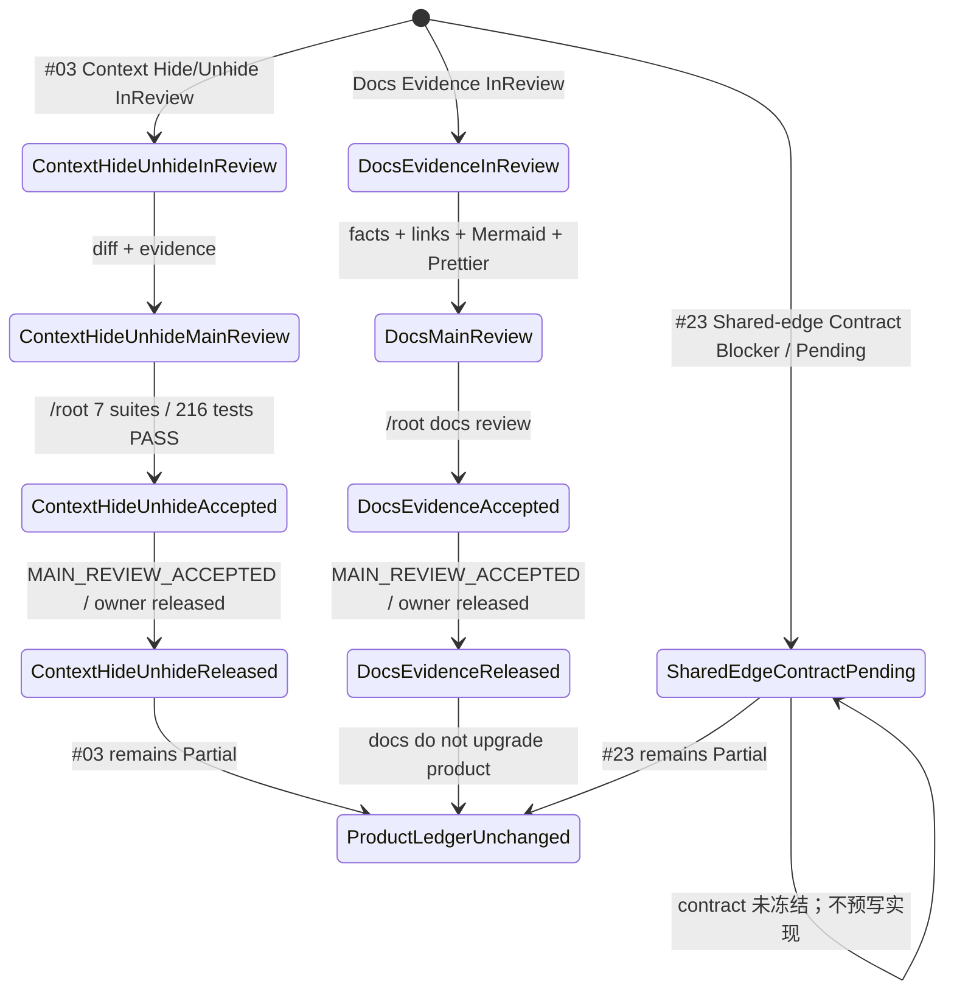

### 总体交付状态流

```mermaid
stateDiagram-v2
  [*] --> CorrectRootConverged: 代码只收口到 /Volumes/work/self/einfach
  CorrectRootConverged --> CodeTruthAudited: 41 项按完整产品链重审
  note right of CodeTruthAudited
    产品口径：0 Verified / 35 Partial / 5 Missing / 1 Deferred
    UI-core 层级事实：31 项直接实现和测试 + 4 项部分实现
  end note
  CodeTruthAudited --> CoreEvidenceReady: C0 UI-core build + 55 suites / 1253 tests
  CoreEvidenceReady --> CoreMainReviewVerified: /root 完成 C0 主审
  CoreMainReviewVerified --> AcceptedPredecessors: Named Range + C1 10/2 + C1 mount 12/12 + C2 capacity/Provider
  note right of AcceptedPredecessors
    当前独立 UI-core 全量：57 suites / 1437 tests；本轮前 56 / 1432
    当前 Solid 全量：70+1 suites / 1125+6 tests（1131 total）；本轮前历史 69+1 / 1122+6；既有 Vite 293 modules
    限定包接受不升级产品状态
  end note
  AcceptedPredecessors --> HistoricalThreeAgentWave: 历史已结束：C1 status hard-cap + C2 projection + code-truth 文档
  AcceptedPredecessors --> FormulaReferenceAccepted: 5 suites / 56 tests + UI-core build
  FormulaReferenceAccepted --> C2RemainingPartial: #09 跨引擎语义仍未闭环
  AcceptedPredecessors --> CopyAsAccepted: 3 suites / 62 tests + setter 0 + 顺序回归
  CopyAsAccepted --> C1RemainingPartial: #10 完整剪切/粘贴仍未闭环
  AcceptedPredecessors --> TopMenuBoundaryAccepted: 3 readonly + 4 commands + 2/53
  TopMenuBoundaryAccepted --> ProductLedgerUnchanged: 状态边界接受，不提升产品行
  AcceptedPredecessors --> ContextMenuBoundaryAccepted: 2 readonly + menu 6 + Solid 75
  ContextMenuBoundaryAccepted --> ProductLedgerUnchanged: returned intent transport；不提升产品行
  AcceptedPredecessors --> GoToNameBoxEvidence: #06 parser 87/87 + Name Box 18/18
  GoToNameBoxEvidence --> MultiSelectEvidence: TS/WASM 真实多选 2/2
  MultiSelectEvidence --> C1RemainingPartial: #06 完整产品与系统门禁未闭环
  AcceptedPredecessors --> FindReplaceCapabilityAccepted: #14 capability 82/82 + build
  FindReplaceCapabilityAccepted --> FindReplaceRegexProvenanceAccepted: Static root 4/157 + focused 6/6
  FindReplaceRegexProvenanceAccepted --> FindReplaceSpanContractFrozen: UTF-16 + nonempty half-open span
  FindReplaceSpanContractFrozen --> FindReplaceZeroWidthClosed: pure zero-width omit；UI-core reject；Static not-applied
  FindReplaceZeroWidthClosed --> FindReplaceCasAtomicAccepted: exact response union + root/agent 4/165
  FindReplaceCasAtomicAccepted --> FindReplaceRemaining: Worker/transport/E2E + generic ABA/durable
  FindReplaceRemaining --> C2RemainingPartial: bounded slices only
  AcceptedPredecessors --> FourBorderAccepted: #04/#23 canonical projection + root 8/258
  FourBorderAccepted --> FourBorderRemaining: shared-edge + merge/freeze + diagonal/full parity
  FourBorderRemaining --> ProductLedgerUnchanged: #04/#23 bounded rendering only；均仍 Partial
  AcceptedPredecessors --> RotationEvidenceAccepted: #23 test-only targeted 2/2 + adjacent 5/95
  RotationEvidenceAccepted --> RotationRefreshFlow: canonical rotation -> style projection -> content refetch -> rerender
  RotationRefreshFlow --> RotationRemaining: browser auto-fit/hit-area + merge/freeze/virtualization
  RotationRemaining --> ProductLedgerUnchanged: #23 仍为 Partial
  AcceptedPredecessors --> FilterSortCapabilityAccepted: #29 3 suites / 108 tests
  FilterSortCapabilityAccepted --> FilterSortWorkerDisabled: Worker unsupported；入口禁用
  FilterSortWorkerDisabled --> C2RemainingPartial: bounded canonical read only
  AcceptedPredecessors --> FreezePanesAccepted: #05 Static authority MAIN_REVIEW_ACCEPTED
  FreezePanesAccepted --> FreezePanesOwnerReleased: UI-core 25/25 + Solid 171/171 + boundary 5/5 + two builds
  FreezePanesOwnerReleased --> FreezeHistoryAccepted: Static bounded history 10/10
  FreezeHistoryAccepted --> C2RemainingPartial: Worker / real transport / persistence / structural / system gaps remain
  AcceptedPredecessors --> PointerBoundaryAccepted: public readonly + private backing + command-only writes
  PointerBoundaryAccepted --> ProductLedgerUnchanged: 7/7 + Solid 18/18 + setter 0
  HistoricalThreeAgentWave --> C1StatusHardCapAccepted: root 2/47 + UI-core 55/1274
  C1StatusHardCapAccepted --> StatusNarrowEvidence: raw-number owner 5/157；E2E WASM 5/5 + TS 4/5
  StatusNarrowEvidence --> StatusProviderOwnerAccepted: Provider owner 2/23 + related 4/33；root 3/31
  StatusProviderOwnerAccepted --> RawNumberAccepted: adapter pre-format raw -> Provider -> UI-core aggregates
  RawNumberAccepted --> TsNumberFormatExpectedFailure: E2E 9/10；worker-ts number-format 未实现
  TsNumberFormatExpectedFailure --> C1RemainingPartial: #31 仍为 Partial
  HistoricalThreeAgentWave --> C2ProjectionAccepted: UI-core 55/1274 + Solid 0 fail + build PASS
  C2ProjectionAccepted --> C2RemainingPartial: 限定包接受仍不升级 #41
  HistoricalThreeAgentWave --> C1SheetReorderAccepted: adapter 1/82 + TS/WASM E2E 1/1
  C1SheetReorderAccepted --> C1RemainingPartial: 限定包接受仍不升级 #01
  HistoricalThreeAgentWave --> SheetActivationCoherenceAccepted: bounded slice MAIN_REVIEW_ACCEPTED；root TS/WASM 2/2
  SheetActivationCoherenceAccepted --> AddAckWitnessGate: 四条激活路径；add dispatch 捕获 active-sheet witness
  AddAckWitnessGate --> AddAckAbaSafe: A→B→A 旋转 witness；晚 ACK 不夺权
  AddAckAbaSafe --> C1RemainingPartial: #01 worker undo/redo 与完整门禁仍未闭环
  HistoricalThreeAgentWave --> DocsHandoffReady: 历史四份执行文档本地门禁 PASS
  DocsHandoffReady --> DocsMainReview: 文档交接
  AcceptedPredecessors --> PasteSpecialPhaseBAccepted: #11 Top Menu + Grid capability gating
  PasteSpecialPhaseBAccepted --> PasteSpecialContextMenuAccepted: reactive visibility + click guard；root 3/40
  PasteSpecialContextMenuAccepted --> PasteSpecialReadonlyBoundaryAccepted: 7 readonly projections + setter fail-closed；root 4/42
  PasteSpecialReadonlyBoundaryAccepted --> C2RemainingPartial: Worker pasteRange / real transport / comments / column-widths / E2E missing
  AcceptedPredecessors --> CurrentDocsSync: 同步 #14 CAS/atomic + #04/#23 四边框 + #23 rotation accepted
  CurrentDocsSync --> DocsMainReview: Mermaid / totals / links 检查后交接
  AcceptedPredecessors --> ProtectionAdapterBlocked: 缺生产 lock mutation + canonical read
  ProtectionAdapterBlocked --> FutureCapabilityPackage: /root 另行冻结真实端口包
  C1RemainingPartial --> SystemVerification: 其余 C1 / C3 / 系统门禁
  C2RemainingPartial --> SystemVerification: 其余 C2 / C3 / 系统门禁
  DocsMainReview --> SystemVerification
  FutureCapabilityPackage --> SystemVerification
  SystemVerification --> Revision: E2E / a11y / 性能失败
  Revision --> BoundedOwnerWave: /root 重新冻结并发槽与限定范围
  BoundedOwnerWave --> SystemVerification: owner 证据 + root 独立主审
  SystemVerification --> ReleaseCandidate: 所有承诺范围通过
  ReleaseCandidate --> Released: 用户明确发布
```

### 已实现关键 Core 状态流

所有产品可观察状态都由独立 `@einfach/core` store 驱动；Solid 组件局部只允许 DOM 引用、测量值等渲染瞬态。

#### #03 隐藏行列 bounded 状态流（`MAIN_REVIEW_ACCEPTED`）

以下五张图描述已主审接受的 Static authority、Grid exact-window metadata hydration、Format Top Menu selection Unhide，以及真实 Grid → ContextMenu → UI-core 可达链。Grid 右键命中同 sheet、同轴、单 region 且位于当前选区内时保留整段选区；选区外、错轴、错 sheet 或多 region 时回退为右键点。隐藏表头不在 DOM 中，但选区内相邻可见表头可触发 Unhide，并由 Core 计算 canonical hidden intersection。UI-core 在菜单可见性与点击时都重验 intent、selection、sheet、target、capability、lifecycle、authority、revision 与 window，再 delegate 既有 canonical mutation atoms；blocked、unsupported 或派发前 revoked 的路径保持 **0 mutation transport / 0 canonical read**。Solid 只转发 intent，不保存第二份状态。Worker backend 没有 hidden capability 时隐藏命令并 fail-closed，绝不呈现可用命令。默认 Wave5 E2E 只证明 Static host，不是 TS/WASM parity；Worker/Rust/真实 transport、durable persistence/hydration、稀疏 run 与 E2E/a11y/perf/系统门禁仍缺，因此 #03 保持 `Partial`。

Grid / Context Menu 可达性与 Core lifecycle：

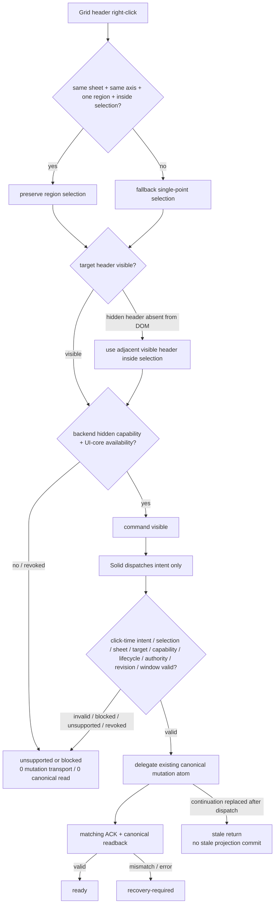

UI-core lifecycle：

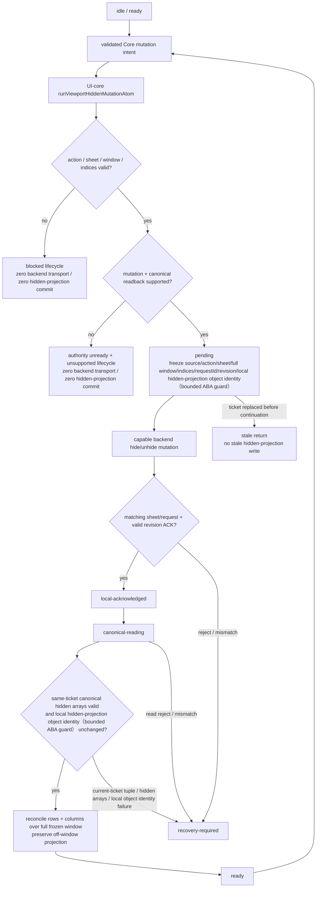

Static canonical authority：

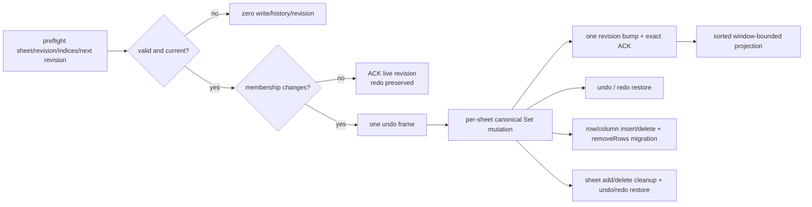

Grid exact-window metadata hydration：

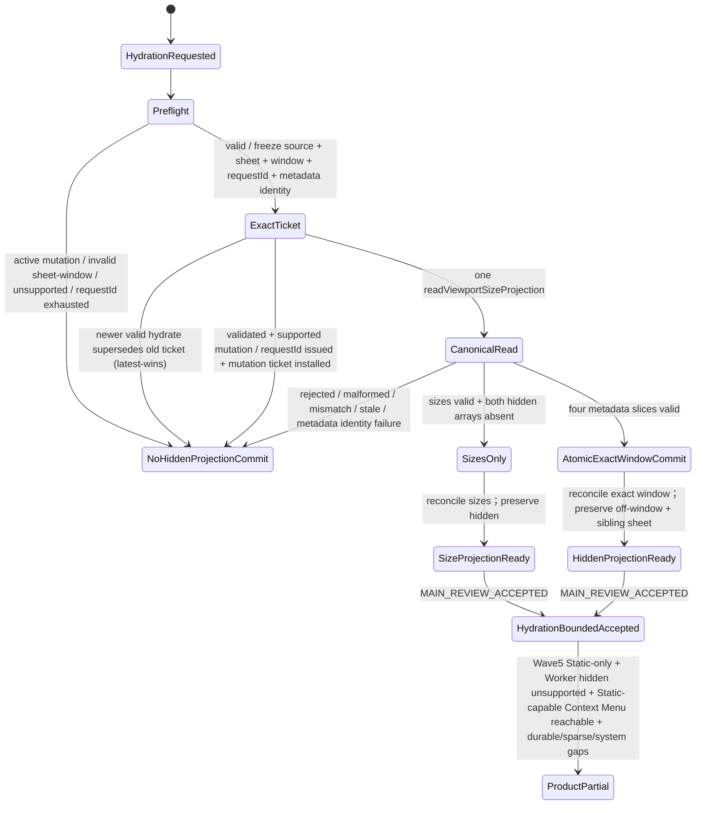

Format Top Menu selection Unhide：

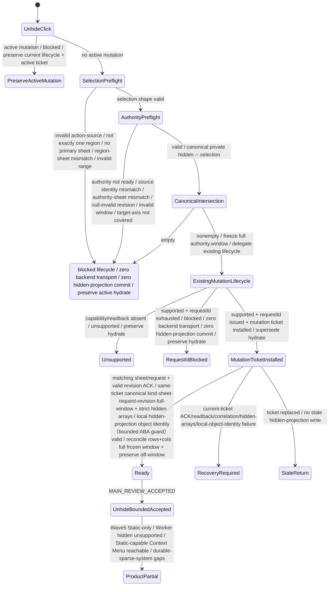

本轮前 Top Menu 历史定向快照为 **4 suites / 171 tests**：Core hidden **95/95** + UI-core menu **6/6** + Solid MenuBar **61/61** + package-boundary **9/9**；前三组 **162/162**，boundary 单独 **9/9**。此前 Solid Menu **58/58**、总计 **168/168** 与前三组 **159/159** 仅是历史时点证据。历史 authority/hydration 证据继续独立保留为 adapter **106/106**、UI hidden **53/53**、Solid Menu **54/54**、hydration **36/36**、Grid **5/5**，以及 root UI-core **98/98** + Grid **74/74**，不得与当前切片数字混算。当前全量回执为 UI-core **57/57 suites、1437/1437 tests PASS**，UI-core build PASS；Solid **70 passed + 1 skipped suites（71 total）、1125 passed + 6 skipped tests（1131 total），0 failed**。既有 Vite build 为 **293 modules PASS**。Full Solid `tsc` 非绿且精确仅剩 5 条未修改、禁止扩围的 `worker-runtime*` baseline diagnostics。Top Menu 九文件白名单已在本页“当前代码收口结论”逐项列明；adapter 脏改属于其他包，Core/Rust/三份 Worker convergence 文件（`worker-runtime.ts`、`worker-runtime-ts.ts`、`worker-protocol.ts`）不在该切片，且切片尚未 commit。

#### Wave5 真实菜单、Text to Columns 与打印 host gate（Static-only E2E）

默认 `VNextWave5Demo` 的真实 `SpreadsheetMenuBar`、Workbook、Text to Columns / Remove Duplicates dialogs 都位于同一个 `SpreadsheetUiProvider`。可见 Data > Text to Columns 菜单和兼容 `CustomEvent` 都只调用 UI-core 的 `runTextToColumnsEntrypointAtom`；Solid 只转发事件，hydrate、dialog、apply、严格 ACK 与 recovery 状态仍由 UI-core / `@einfach/core` 独占。默认真实 MenuBar 的 Data > Remove Duplicates success / undo E2E 已独立验收，只证明 Static host，#30 仍为 `Partial`。Wave5 host 通过 `hiddenItemIds={['file.printPreview']}` 在渲染前过滤打印入口，因此默认 host 没有打印菜单 DOM，也没有 click/Core dispatch；这是 #16 Print 完全延后的 host policy，不是打印实现，也不删除其他 host 可用的 generic registry item / shell。

新 Wave5 E2E 只证明默认 **Static host** 的真实菜单、Format Unhide 可达性、Remove Duplicates success / undo 与打印入口隐藏，不能外推为 TS/WASM parity。此前 #13 通过可见菜单获得的 TS/WASM **2/2** 真实 backend 证据继续独立保留，不被这组 Static-only E2E 覆盖或改写。

#20 的同一 Static host 另有 default/empty source → formatted target 的 visible-only 见证：owner 与独立复核各在 `wasm` / `ts` Playwright 项目标签下合计 **12/12**，但项目标签没有改变 `VNextWave5Demo` 固定的 Static backend，不能写成 Worker parity。capture `{}`、armed、target、pending、exact ACK、local-ack、canonical refresh、idle 以及 reject / outcome-unknown / blocked 的唯一规范图见 [04｜Format Painter default-source lifecycle](./04-cell-formatting.md#format-painter-default-source-lifecycle)；本页不复制第二套状态机。

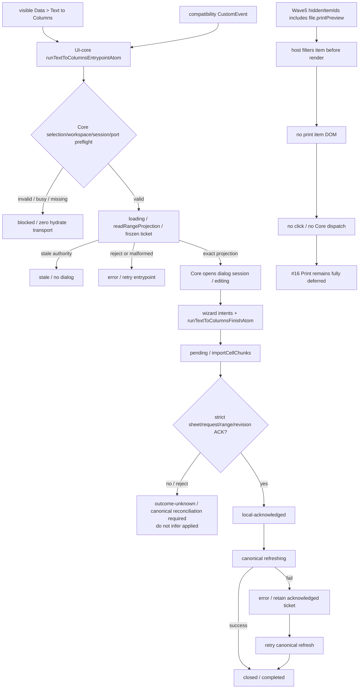

#### #12 自动填充 bounded 状态流（`MAIN_REVIEW_ACCEPTED`）

这张图只描述当前代码已有的 Static 数值序列窄链路，不是产品完成声明。图中的 plan/no-op/preflight/单 mutation/单 revision 与 undo/redo witness 已获 bounded `MAIN_REVIEW_ACCEPTED`：独立 reviewer 4 suites / 144 tests，`/root` adapter 99/99、fill 17/17、scaling 16/16；该 bounded 包接受时的历史 Solid full 快照为 69+1 suites / 1080+6 tests，本轮前历史 Solid full 为 69+1 suites / 1122+6=1128 tests，当前权威为 70+1 suites / 1125+6=1131 tests（0 failed）；Vite build PASS，Full Solid `tsc` 仍仅 5 条禁止扩围的 Worker baseline diagnostics。该接受不得外推为 Static 全局 history/no-op 原子性完成，generic Static same-value/no-op history 仍是独立债务。bounded per-cell fallback 已有引用平移；完整 formula-series、Worker/真实 transport parity、date/weekday/month/custom、可见命令及系统门禁仍在图外阻断，#12 保持 `Partial`。

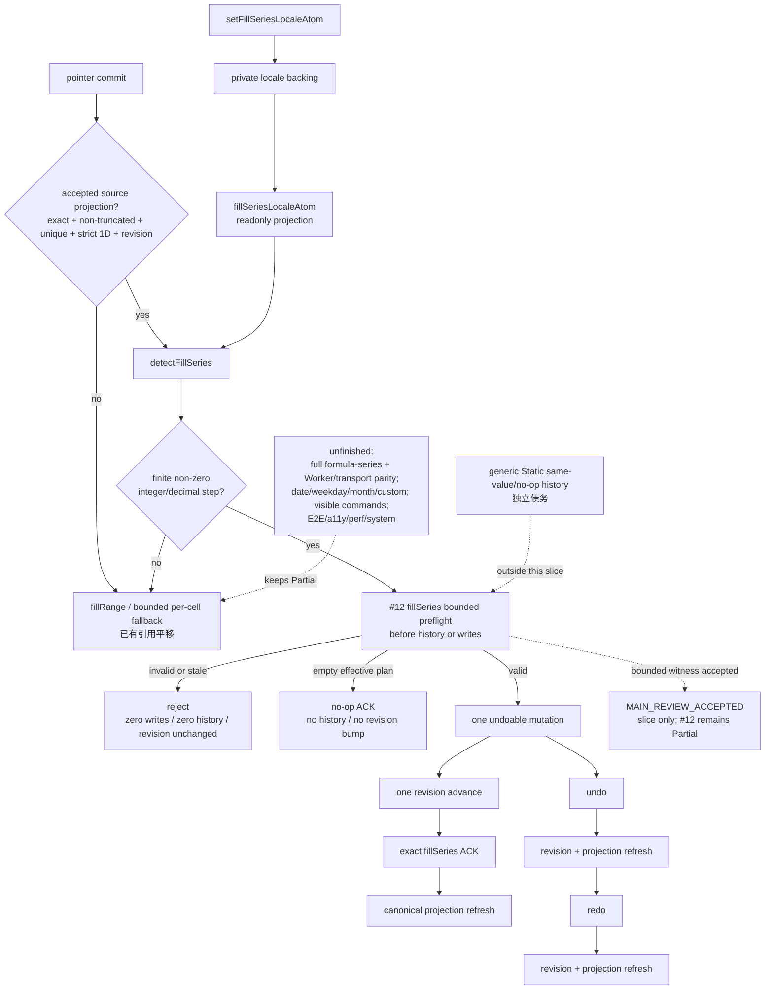

#14 capability、Static regex/provenance 与 CAS/Replace All 原子预校验的已接受状态流（`MAIN_REVIEW_ACCEPTED`；capability **82/82 + build PASS**；regex/provenance root **4 suites / 157 tests PASS** + focused **6/6 PASS**；CAS/atomic root/agent **4 suites / 165 tests PASS**；产品仍为 `Partial`）：

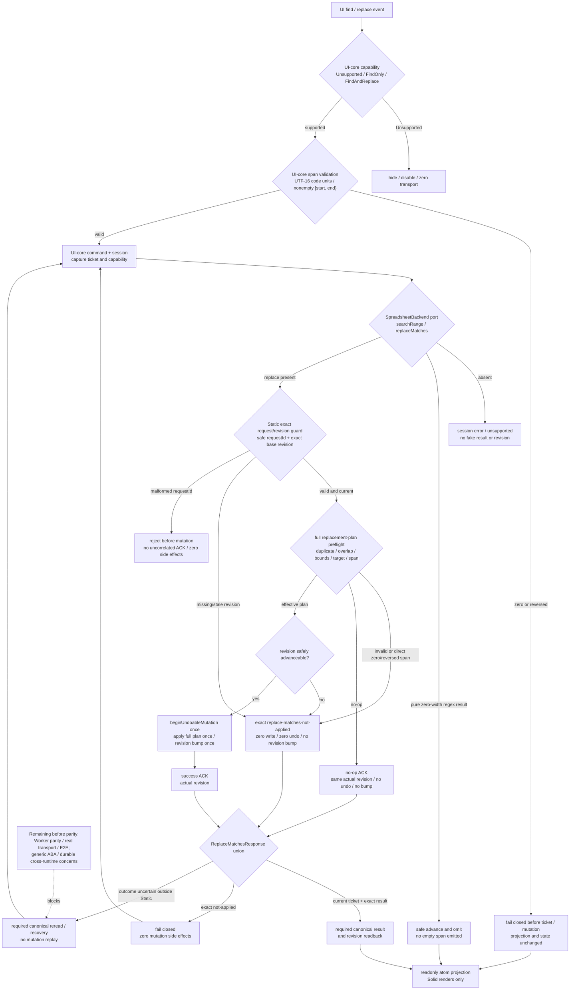

`replaceMatches` 的公开返回保持既有 `ReplaceMatchesResponse` 联合。Find/replace span 合同按 UTF-16 code units 计数，只允许非空半开区间 `[start, end)`；纯 zero-width regex 结果会安全推进并省略，不会向合同发出空 span。UI-core 对 zero / reversed span 在 ticket / mutation 前 fail-closed，Static 直接 zero-width replacement 精确返回 `replace-matches-not-applied`，零写入、零 undo、revision 不变。Static bounded slice 还已闭合 consuming regex spans、同单元格 multi/global、target provenance/定向替换、精确 revision guard 与全计划原子预检；这些成功语义不能外推到 Worker、真实 transport/E2E、generic ABA 或 durable cross-runtime，不能宣称产品 parity 完成。

#04/#23 canonical 四边框 rendering 的已接受状态流（`MAIN_REVIEW_ACCEPTED`；root 独立合并定向 **8 suites / 258 tests PASS**；产品仍为 `Partial`）：

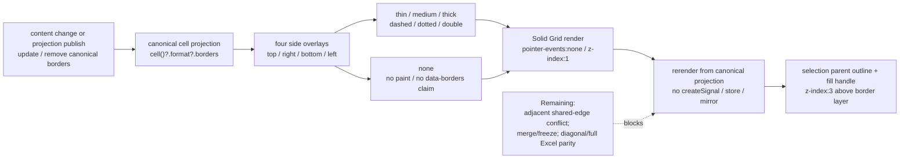

边框层只消费 canonical projection；content-change/projection refresh 后重新渲染，可新增、更新或移除四边。它不另建 Solid 业务状态，也不把本次视觉切片扩写成相邻共享边冲突裁决、merge/freeze 或完整 Excel 格式 parity。

#23 canonical rotation 的已接受证据流（`MAIN_REVIEW_ACCEPTED`；本包仅新增 `vnext-grid-cell-rotation.test.tsx`；targeted **2/2 PASS**、adjacent **5 suites / 95 tests PASS**；产品仍为 `Partial`）：

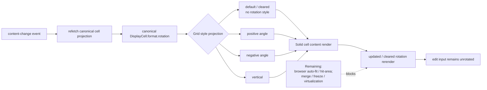

该切片只把现有 canonical rotation 投影和 refresh 行为固定为回归证据，没有新增业务状态或修改 Core/Worker 合同；因此不能外推为浏览器布局、命中区域、合并/冻结或虚拟化 parity 已完成。

Static 格式 / 合并 mutation 精确 ACK 的已接受状态流（`MAIN_REVIEW_ACCEPTED`；adapter Jest **88/88**、Toolbar Playwright **10/10**、Vite build **PASS**；产品仍为 `Partial`）：

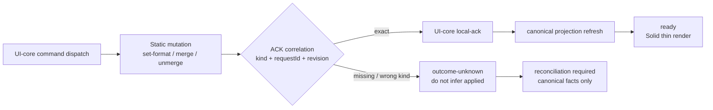

Wave5 demo 固定到 Static backend；Playwright 的 `wasm` / `ts` 项目都走同一 `createStaticSpreadsheetBackend`，所以 **10/10 只证明 Static UI 链路**，不能写成 Worker parity。Worker adapter 的 ACK `kind` 早已存在且本包未改；错误或缺失 `kind` 继续进入 `outcome-unknown`，不得被宽化为成功。状态权威始终位于 UI-core / `@einfach/core`，Solid 不持有第二份 mutation lifecycle。

#05 Freeze Panes Static authority 的已接受状态流（`MAIN_REVIEW_ACCEPTED`；UI-core **25/25**、Solid **171/171**、boundary **5/5**、两个 build **PASS**；后续 Static bounded history **10/10 PASS**；产品仍为 `Partial`）：

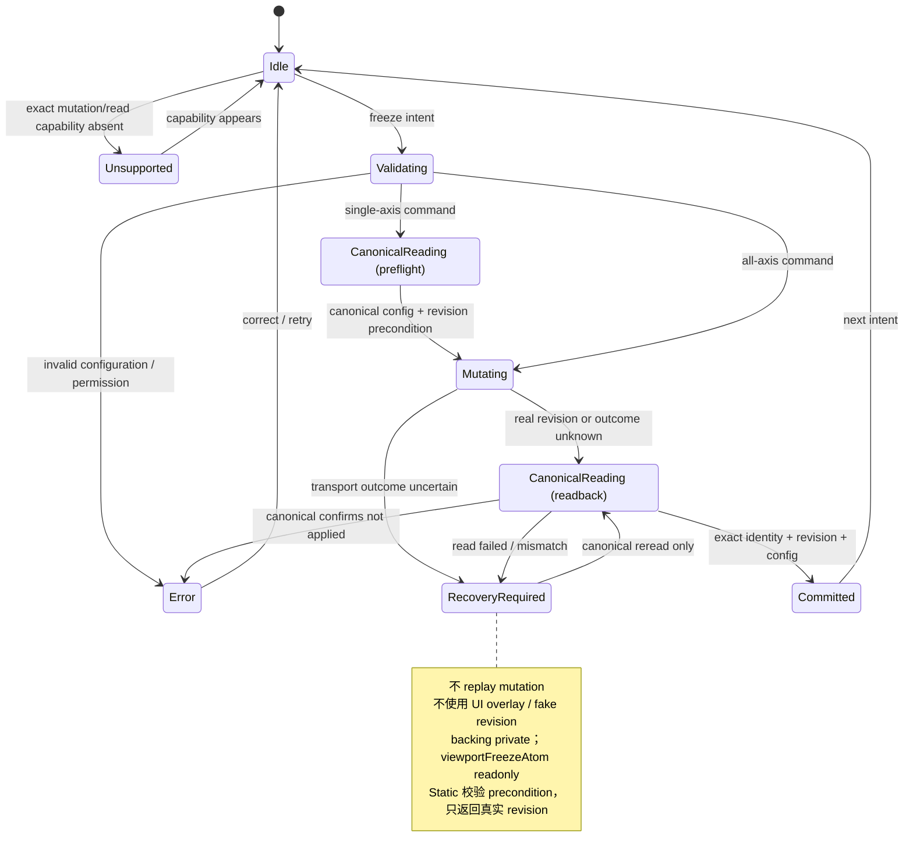

owner 槽已释放。Static bounded history 已把 freeze 纳入 bounded delta 与 full-sheet capture，并精确保留 absent 与 `{0,0}` 的区别；这只接受 Static 内存态的有界 undo/redo，不覆盖 Worker/real transport parity、durable persistence/hydration、structural-transform 语义，也不覆盖完整 E2E、a11y 与系统发布门禁。这些缺口禁止由本地 projection 或 fake revision 代偿。

<a id="pointer-freeze-bounded-state-flows"></a>

#### Pointer readonly 与 #05 Static bounded history 状态流

Freeze 的 accepted bounded history 明确覆盖三条链；其中 `undo B` / `undo A` 表示撤销对应 set 操作，invalid / stale intent 不改变 canonical facts，也不创建历史：

```mermaid
flowchart TD
  subgraph SETS["consecutive Freeze set / undo / redo"]
    Empty0["absent"] -->|set Freeze A| FreezeA0["Freeze A"]
    FreezeA0 -->|set Freeze B| FreezeB0["Freeze B"]
    FreezeB0 -->|undo B| FreezeA1["Freeze A restored"]
    FreezeA1 -->|undo A| Empty1["absent restored"]
    Empty1 -->|redo A| FreezeA2["Freeze A redone"]
    FreezeA2 -->|redo B| FreezeB2["Freeze B redone"]
  end
  subgraph DELETE["configured delete / undo / redo"]
    Configured0["configured"] -->|delete configured| Deleted0["absent"]
    Deleted0 -->|undo restore| Configured1["configured restored"]
    Configured1 -->|redo delete| Deleted1["absent again"]
  end
  subgraph REJECT["invalid / stale"]
    FreezeIntent["freeze intent"] -->|invalid or stale| FreezeRejected["canonical facts unchanged"]
    FreezeRejected --> FreezeNoHistory["no history entry"]
  end
```

Pointer 的 public session / intent atoms 只读，private backing 只能由四个 command atoms 写入。commit 顺序是先发布 intent，再把 session 收回 `idle`；仓库唯一 Solid direct-setter fixture 已迁移为 `startPointerAtom`：

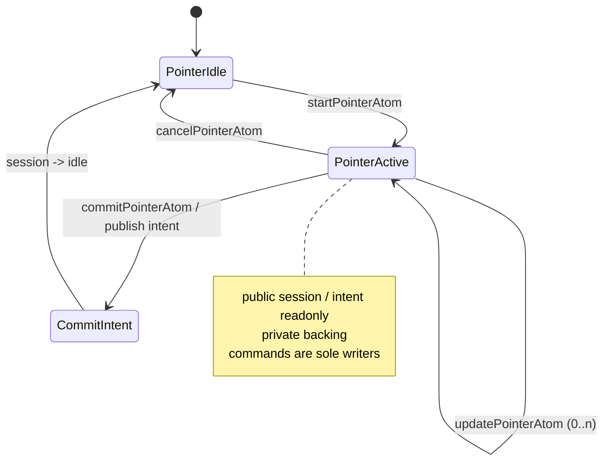

验收证据为 Freeze targeted **10/10 PASS**、Pointer UI-core **7/7 PASS**、Solid overlay **18/18 PASS**、public pointer direct-setter scan **0**。这些都是 bounded slice 证据；#05 仍为 `Partial`，Pointer 边界也不新增或升级 41 项中的任何产品行。

#11 Paste Special Phase A + Phase B + Context Menu + 状态边界的已接受状态流（Phase A 独立 **2 suites / 33 tests**；Phase B reviewer **6 suites / 123 tests PASS**、root **5 suites / 135 tests PASS**；Context Menu root **3 suites / 40 tests PASS**；状态边界 root **4 suites / 42 tests PASS**；产品仍为 `Partial`）：

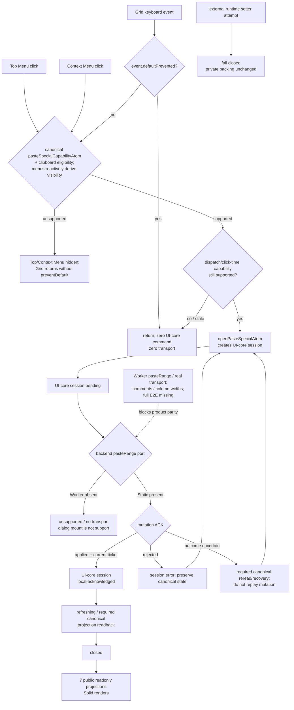

Phase A + B、Context Menu 与状态边界 bounded slices 只闭合 UI-core lifecycle、Provider port capture、worker demo dialog mount，Top Menu / Grid keyboard / Context Menu 的 capability 与 second guard，以及 7 个 public state atoms 的 readonly/private-backing 边界、外部 setter fail-closed 与 `pending → local-acknowledged → refreshing → closed` 生命周期。Worker `pasteRange`、real transport、comments / column-widths 和完整 E2E 未闭环；状态边界测试的既知 jsdom canvas console noise 不构成产品门禁，full Solid tsc 仍只有 5 条禁止扩围的 runtime baseline，不能写成全量类型门禁 PASS。

#29 filter/sort capability truth 的已接受状态流（`MAIN_REVIEW_ACCEPTED`；独立 **3 suites / 108 tests PASS**；产品仍为 `Partial`）：

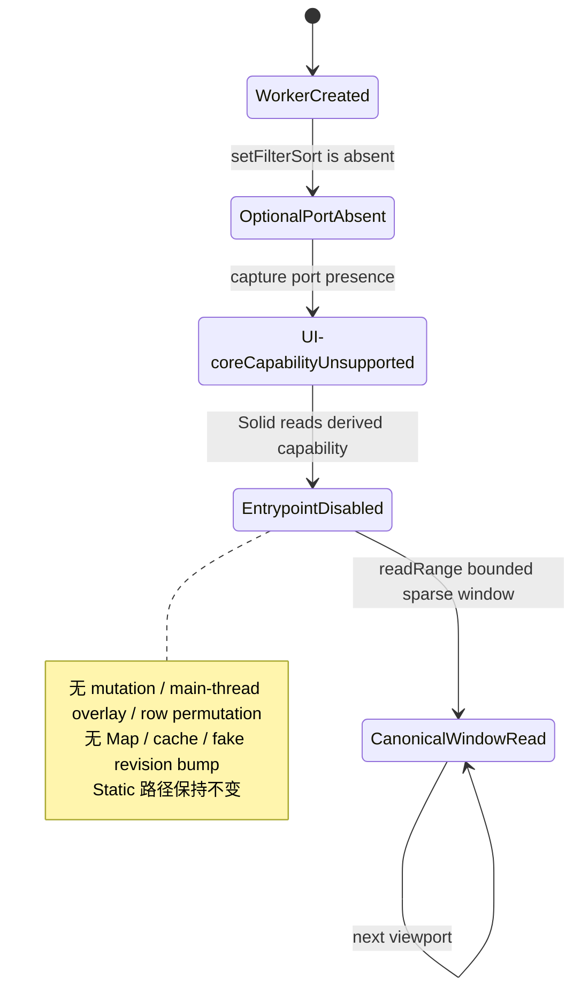

#01 sheet activation coherence bounded slice 的已接受状态流（`MAIN_REVIEW_ACCEPTED`；原 owner **2 suites / 22 tests** + Grid **1/1**，独立 reviewer UI-core **3/37**、Solid **2/62**、no-emit/diff PASS；root 真实 TS/WASM **2/2**；测试集合不相加）：

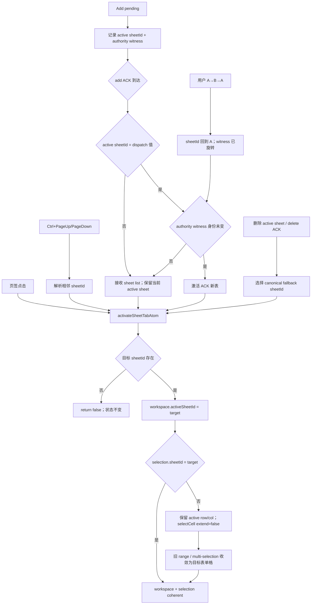

Go To parser 的名称解析与边界流（限定证据：`go-to.test.ts` 87/87）：

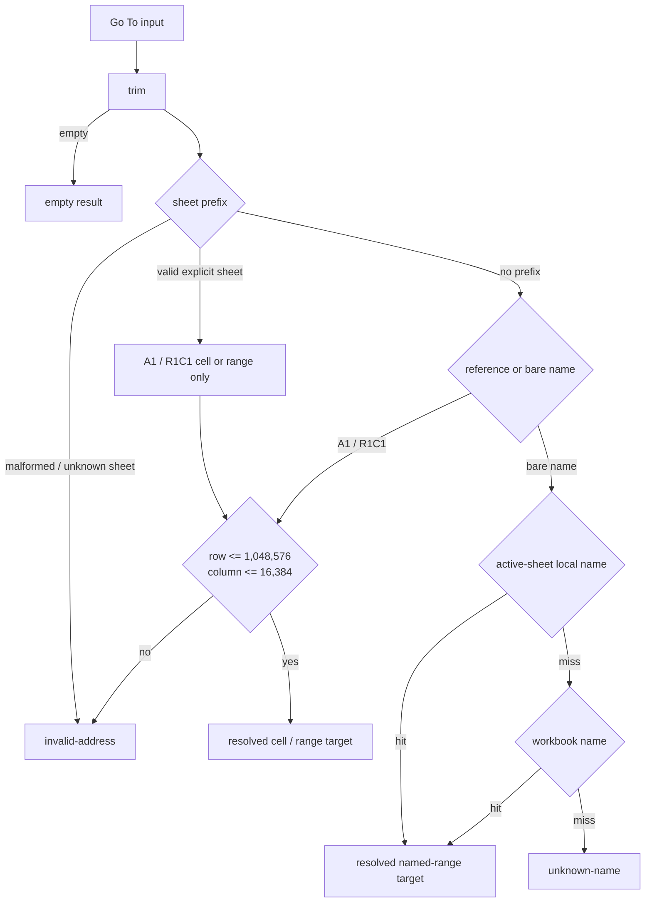

名称只在没有显式 sheet prefix 时解析；active sheet 的 local name 优先于 workbook name，不能泄漏其他 sheet 的 local name。越过 Excel 最大行列边界统一进入 `invalid-address`。

Name Box 的跨 sheet 顺序与失败无副作用流（限定证据：`vnext-name-box.test.tsx` 18/18）：

```mermaid
stateDiagram-v2
  [*] --> Editing
  Editing --> CoreCommitted: commitNameBoxAtom resolves target
  Editing --> ErrorVisible: invalid / unknown target
  CoreCommitted --> SameSheetReady: target stays on active sheet
  CoreCommitted --> WorkspaceSwitched: cross-sheet named target
  WorkspaceSwitched --> ViewportScrolled: setWorkspaceActiveSheetAtom then scrollToCellAtom
  SameSheetReady --> ViewportScrolled: workspace object unchanged; scrollToCellAtom
  ViewportScrolled --> [*]
  ErrorVisible --> Editing: user corrects input
  note right of ErrorVisible
    workspace / viewport / selection unchanged
    不产生部分副作用
  end note
```

真实 backend 多选的追加与恢复流（限定证据：WASM 1/1 + TS 1/1，console error 0）：

```mermaid
stateDiagram-v2
  [*] --> SingleB4: plain click B4
  SingleB4 --> MultiB4C2: modifier click C2 appends
  note right of MultiB4C2
    B4 + C2 selected
    C2 is active / primary
    Name Box + status expose C2
    sum 23 / average 11.5 / count 2
  end note
  MultiB4C2 --> SingleB4Restored: plain click B4 replaces selection
  note right of SingleB4Restored
    C2 deselected
    sum 10 / average 10 / count 1
  end note
  SingleB4Restored --> [*]
```

#31 raw-number canonical projection 与唯一预期 E2E 失败（`MAIN_REVIEW_ACCEPTED`）：

```mermaid
flowchart TD
  TRUE["readonly config: true"] -->|"UI toggle command"| PRIVATE_FALSE["private backing: false"]
  PRIVATE_FALSE --> UI_FALSE["DOM aria-pressed: false"]
  UI_FALSE -->|"UI toggle command"| PRIVATE_TRUE["private backing: true"]
  PRIVATE_TRUE --> UI_TRUE["DOM aria-pressed: true"]
  UI_TRUE -. "可观察 UI 回执<br/>不是 backend 持久化 ACK" .-> TRUE
  BACKEND["backend raw number"] --> ADAPTER["adapter: display format 前写<br/>valueKind + numericValue"]
  ADAPTER --> DISPLAY["display format 只生成 displayValue"]
  DISPLAY --> PROVIDER["Provider canonical projection"]
  PROVIDER --> AGG["UI-core backing + derived aggregates"]
  AGG --> STATUS["Status Bar readonly consumer"]
  MISSING["number 缺 raw / non-finite"] --> TRUNCATED["count + 1；truncated<br/>不解析 displayValue"]
  FORMULA["formula string"] --> STRING["valueKind = string"]
  E2E["real-backend E2E 9/10"] --> TSFORMAT_GAP["唯一预期失败：worker-ts number-format<br/>runtime 尚未实现"]
  TSFORMAT_GAP --> PARTIAL["#31 remains Partial"]
```

```mermaid
stateDiagram-v2
  [*] --> NoOwner
  NoOwner --> ProviderAOwner: Provider A attach / prime + store.sub
  note right of ProviderAOwner
    spreadsheetProjectionSnapshotAtom 是 canonical source
    Provider 是 canonical status projection 的唯一同步生命周期 owner
    snapshot 通过 syncStatusBarProjectionAtom 写入 UI-core
    Status Bar 只是 readonly consumer
  end note
  ProviderAOwner --> ProviderAOwner: snapshot change / sync UI-core mirror
  ProviderAOwner --> ProviderBOwner: Provider B attach to same store
  note right of ProviderBOwner
    latest-provider-wins
    A inactive + unsubscribed
  end note
  ProviderBOwner --> ProviderBOwner: A cleanup or late callback ignored
  ProviderBOwner --> ProviderBOwner: snapshot change / sync UI-core mirror
  ProviderBOwner --> Cleared: current B unmount / unsubscribe + clear mirror
  Cleared --> Cleared: later snapshot change ignored
  Cleared --> [*]
```

Formula Reference 的已接受状态边界：

```mermaid
flowchart LR
  DOM["DOM caret / selectionchange<br/>grid pointer / keyboard intent"]
  SOLID["Solid thin event bridge<br/>不复制产品状态"]
  COMMAND["UI-core command atoms<br/>setCaret / enter / pick / exit"]
  BACKING["private backing atoms<br/>caret + session"]
  READONLY["public readonly atoms<br/>caret + session"]
  DERIVED["derived active / tokenRange<br/>Solid render"]
  DOM --> SOLID --> COMMAND --> BACKING --> READONLY --> DERIVED
```

Copy-As 的已接受发布与失败流：

```mermaid
flowchart TD
  DOM["DOM shortcut / menu event"] --> SOLID["Solid thin dispatch<br/>调用 UI-core encoder"]
  SOLID --> ENCODE{"encode result"}
  ENCODE -- success --> PUBLISH["publishCopyAsResultAtom"]
  PUBLISH --> RESULT_BACKING["private result backing"]
  RESULT_BACKING --> RESULT["readonly lastCopyAsAtom snapshot"]
  RESULT --> MIRROR["test mirror published"]
  MIRROR --> CLIPBOARD["attempt system clipboard"]
  CLIPBOARD -- success --> CLEAR["reportCopyAsStatusAtom(null)"]
  CLIPBOARD -- failure --> STATUS["reportCopyAsStatusAtom(failure)"]
  ENCODE -- failure --> STATUS
  CLEAR --> STATUS_BACKING["private status backing"]
  STATUS --> STATUS_BACKING["private status backing"]
  STATUS_BACKING --> ERROR["readonly copyAsErrorAtom"]
  STATUS -. preserves previous snapshot .-> RESULT
```

Top Menu 的已接受状态边界：

```mermaid
stateDiagram-v2
  [*] --> Idle
  Idle --> Open: openTopMenu(menu)
  Open --> Open: openTopMenu(other menu) / clear highlight
  Open --> Idle: closeTopMenu() / clear highlight
  Idle --> Idle: closeTopMenu() / clear highlight
  state HelpOverlay {
    [*] --> Closed
    Closed --> Shortcuts: openHelpOverlay(shortcuts)
    Closed --> About: openHelpOverlay(about)
    Shortcuts --> About: openHelpOverlay(about)
    About --> Shortcuts: openHelpOverlay(shortcuts)
    Shortcuts --> Closed: closeHelpOverlay()
    About --> Closed: closeHelpOverlay()
  }
```

3 个 public atoms 只投影 private backing；4 个 command atoms 保持原 getter / args / result 合同。Solid 只读取投影并派发 command，不持有第二份 menu / Help overlay 状态。

Context Menu 的已接受状态与真实执行 transport：

```mermaid
flowchart LR
  DOM["Solid DOM event"] --> STORE["useSpreadsheetUiStore / store.setter"]
  STORE --> COMMAND["UI-core menu command atom"]
  COMMAND --> STATE["private menuState backing"]
  COMMAND --> INTENT["private menuIntent backing"]
  COMMAND -->|"returned MenuCommandIntent"| DISPATCH["Solid command dispatcher"]
  DISPATCH --> BACKEND["workbook backend"]
  STATE --> STATE_VIEW["readonly menuStateAtom"]
  INTENT --> INTENT_VIEW["readonly menuIntentAtom"]
  STATE_VIEW --> RENDER["Solid render"]
  INTENT_VIEW -. optional observer .-> OBSERVER["observer"]
```

有效 open / reopen、invalid no-write、highlight intent、command intent、close 与 clear-intent 的状态迁移都留在 UI-core；命令执行使用 command 的返回值，不依赖订阅 `menuIntentAtom`。

#30 删除重复项 exact bridge 的当前限定状态流（`MAIN_REVIEW_ACCEPTED`；owner Jest **4 suites / 15 tests PASS**，root 真实 E2E WASM/TS **4/4 PASS**）：

```mermaid
flowchart TD
  CAP{"removeRowsExact capability?"}
  TS["TS runtime structural delete = no-op"] --> TS_OFF["显式 capability=false"] --> CAP
  ABSENT["capability absent"] --> CAP
  CAP -- "absent / false" --> HIDDEN["删除重复项入口隐藏"]
  CAP -- "WASM explicit opt-in" --> REQUEST["UI-core exact request<br/>冻结 scan revision 与 workspace witness"]
  REQUEST --> BAND["按降序连续 band 调用 deleteRows"]
  BAND --> ACK{"当前 band ACK === true?"}
  ACK -- "是，仍有 band" --> BAND
  ACK -- "所有 band 均 strict true" --> REV{"返回 revision 是新数值<br/>且不同于 scan revision?"}
  REV -- "是" --> WITNESS["exact witness"] --> COMMITTED["Core committed<br/>记录 history"]
  ACK -- "false / reject / partial" --> UNKNOWN["Core outcome-unknown"]
  REV -- "否" --> UNKNOWN
  UNKNOWN --> NO_HISTORY["不记录 history<br/>不伪造 exact ACK"]
  COMMITTED --> ACCEPTED["bounded exact-bridge<br/>MAIN_REVIEW_ACCEPTED"]
  NO_HISTORY --> ACCEPTED
  HIDDEN --> ACCEPTED
  ACCEPTED --> PARTIAL["#30 remains Partial<br/>跨 band 非原子 + TS no-op"]
```

这里的 exact witness 只证明当前 WASM adapter 的每个 band 都收到严格成功回执且 revision 前进，不证明多个 band 是一个原子事务；因此不能据此升级产品总账。

#30 Static `removeRowsExact` bounded lifecycle（`MAIN_REVIEW_ACCEPTED`；root adapter **125/125**、reviewer **22/22**、range child **3/3 + 101,928 exhaustive cases**）：

```mermaid
flowchart TD
  CORE["UI-core immutable exact ticket"] --> PRE{"Core / session / revision / rows preflight"}
  PRE -- "invalid / stale / unsupported" --> ZERO["zero Static write / history / revision"]
  PRE -- valid --> PLAN["Static removeRowsExact<br/>full exact-plan preflight"]
  PLAN -- invalid --> ZERO
  PLAN -- valid --> MUT["one fullSheet history capture + one undo entry<br/>FullSheetCapture per-sheet tables; O(one sheet), not O(workbook)<br/>not complete metadata parity<br/>exact row mutation + one revision"]
  MUT --> ACK{"exact request / sheet / range / rows / revision ACK?"}
  ACK -- no --> UNKNOWN["outcome-unknown / canonical recovery<br/>never infer or replay mutation"]
  ACK -- yes --> HISTORY["Core pushHistoryAtom<br/>local-acknowledged"]
  HISTORY --> REFRESH["canonical refresh"]
  REFRESH -- success --> CLOSED["closed / completed"]
  REFRESH -- fail --> RECOVERY["retain acknowledged ticket<br/>retry canonical refresh only"]
  RECOVERY --> REFRESH
  CLOSED --> ACCEPT["bounded MAIN_REVIEW_ACCEPTED<br/>Static-only"]
  ACCEPT --> GAPS["#30 Partial<br/>merge / name / validation / CF / filter / freeze metadata gaps"]
```

该接受结论与上方 WASM/TS exact bridge 分包记账；它不证明 Worker、TS、WASM `removeRowsExact`，也不证明完整结构删除 metadata parity。

通用 mutation/editor 严格闭环：

```mermaid
stateDiagram-v2
  [*] --> Closed
  Closed --> Editing: open / hydrate draft
  Editing --> Validating: submit intent
  Validating --> Editing: invalid / permission denied
  Validating --> Dispatching: valid + capability allowed
  Dispatching --> CanonicalRefreshing: applied / outcome unknown
  Dispatching --> Editing: confirmed not-applied
  CanonicalRefreshing --> Closed: canonical facts match witness
  CanonicalRefreshing --> RecoveryRequired: read failed / identity or revision mismatch
  RecoveryRequired --> CanonicalRefreshing: retry canonical read only
  note right of RecoveryRequired
    禁止重放 mutation
  end note
```

Protection 的严格恢复闭环：

下图前半段已有 Core/Solid 直连竞态测试；`AdapterCapabilityBlocked` 之后仍是产品 blocker，当前没有生产 `setRangeLock` / `readSheetProtection` 能力，不能把目标 transition 写成已完成。

```mermaid
stateDiagram-v2
  [*] --> Editing
  Editing --> Verifying: unlock intent
  Verifying --> Editing: credential / permission rejected
  Verifying --> Mutating: verification accepted
  Mutating --> CanonicalRefreshing: mutation ACK 或 outcome unknown
  CanonicalRefreshing --> Closed: exact identity + valid revision witness
  CanonicalRefreshing --> Editing: canonical confirmed not-applied
  CanonicalRefreshing --> RecoveryRequired: missing/invalid revision、mismatch 或 read failure
  RecoveryRequired --> CanonicalRefreshing: retry canonical read only
  Closed --> Editing: protection restored / load lifecycle
  Editing --> Editing: stale A/B response ignored
  CanonicalRefreshing --> AdapterCapabilityBlocked: production mutation/read port absent
  AdapterCapabilityBlocked --> CanonicalRefreshing: 后续能力包提供真实 ACK + canonical read
  note right of AdapterCapabilityBlocked
    当前产品状态：Partial
    mock / optional no-op 不能解除 blocker
  end note
```

status-bar hard-cap/coverage truth 的已接受派生流：

```mermaid
flowchart LR
  RAW["raw selection snapshot<br/>sheetId / window / cells / upstream truncated"]
  SCAN["UI-core bounded scan<br/>最多 50k cells + 50k membership checks"]
  AGG["aggregate + coverage truth<br/>count / sum / average / outside / sheet / truncated"]
  VIEW["Solid thin render<br/>只读取派生结果"]
  RAW --> SCAN --> AGG --> VIEW
```

Sheet reorder 的已接受有界 adapter 状态流：

```mermaid
stateDiagram-v2
  [*] --> StableActiveProjection
  StableActiveProjection --> RemapGate: moveSheet request / stable-id + index remap
  RemapGate --> EarlyDirtyDeferred: cellsDirty arrives before move settles
  EarlyDirtyDeferred --> EarlyDirtyDeferred: coalesce more early dirty
  RemapGate --> MoveAcked: move ACK
  EarlyDirtyDeferred --> MoveAcked: move ACK
  MoveAcked --> CanonicalLookupReady: read sheetList + rebuild lookup
  CanonicalLookupReady --> FlushingDeferredDirty: canonical list / lookup ready
  FlushingDeferredDirty --> StableActiveProjection: flush deferred dirty once
  RemapGate --> GateReleasedAfterFailure: move/list failure / finally
  EarlyDirtyDeferred --> GateReleasedAfterFailure: move/list failure / finally
  MoveAcked --> GateReleasedAfterFailure: canonical refresh failure / finally
  CanonicalLookupReady --> GateReleasedAfterFailure: lookup/flush failure / finally
  FlushingDeferredDirty --> GateReleasedAfterFailure: flush failure / finally
  GateReleasedAfterFailure --> StableActiveProjection: gate open; error remains observable
  note right of EarlyDirtyDeferred
    只合并 remap 窗口内的 cellsDirty
    不改 runtime / engine / Grid
  end note
```

Projection/workspace 的 latest-read 闭环：

```mermaid
stateDiagram-v2
  [*] --> Idle
  Idle --> ActiveA: visible request A starts one transport
  ActiveA --> QueuedLatestB: newer B queues behind A
  QueuedLatestB --> QueuedLatestB: newer C replaces queued B
  QueuedLatestB --> ActiveLatest: exact A settle atomically promotes latest
  ActiveLatest --> Terminal: exact latest settle / no successor
  ActiveA --> Terminal: exact A settle / no successor
  ActiveA --> ActiveA: stale settle ignored; lane not released
  QueuedLatestB --> QueuedLatestB: stale settle ignored; lane not released
  Idle --> RangeActive: range request starts
  RangeActive --> RangeActive: concurrent range request = busy; never queued
  RangeActive --> Terminal: exact range settle
  Terminal --> Idle: next lifecycle
  note right of QueuedLatestB
    每 store 最多 active + latest queued 各 1
    queued caller 不启动第二 transport
  end note
```

## 2026-07-14 历史规划基线（保留，不再作为当前执行事实）

本文把在线 Excel 功能盘点中第 2、3、4、5、6、13 组以及“批注 / 备注 / 任务”拆成七条实施线。排期以当前 `vnext-wave5` 默认演示、`@einfach/spreadsheet-ui-core`、static backend、worker / Rust backend 和现有测试为基线；它不是按“已有组件文件”估算，而是按一条功能能否在默认入口真实完成业务闭环估算。

多 Agent 的分工、并发波次、交付物和主审门禁见 [MULTI_AGENT_EXECUTION](./MULTI_AGENT_EXECUTION.md)。该计划只改变执行方式，不改变本文的功能范围、依赖顺序和架构设计。

本轮 MainReview 以 [REVIEW-2026-07-14](./REVIEW-2026-07-14.md) 为不可回写的评审基线；修订文档只回应其中发现，不改写评审原文。主 Agent 已于 2026-07-14 对照 HEAD `2feea48`、排期总账和执行协议逐项复核 B1～B4，并把本轮**计划文档修订**标记为 `Accepted`。这只表示计划可作为后续实施基线：W0 的三组对话框源码仍是 `MainReview → Rework`，Stage 0.5 和 W1 的实现门禁尚未执行，也不构成开工、集成或发布授权。

| MainReview blocker           | 当前修订状态                                   | 放行门与证据引用                                                                                                                                                                                                            |
| ---------------------------- | ---------------------------------------------- | --------------------------------------------------------------------------------------------------------------------------------------------------------------------------------------------------------------------------- |
| B1：公式线对 07-14 HEAD 失准 | `Accepted（计划文档）`；实现现状已按 HEAD 重校 | [05-formulas](./05-formulas.md) 已区分 Wave 8.2 既有 async read/settle、仅缺 worker RPC 的 LAMBDA、`#BUSY!` pending 和未来 remote provider；实施仍按专题门禁验收                                                            |
| B2：revision log 时序倒挂    | `Accepted（计划设计）`；M0.5 尚未执行          | 本文“组合总体日历”的阶段 0.5、本文“关键依赖”的硬合入门、[批注 M0.5](./comments-notes-tasks.md)及[第 13 组排期](./13-changes-views-versions.md)总账一致；通用 fixture 未由批注和至少一个第 2～6 组 mutation 共同通过时不放行 |
| B3：汇聚文件无 owner/仲裁    | `Accepted（执行设计）`；执行时持续核验         | [MULTI_AGENT_EXECUTION §2.3](./MULTI_AGENT_EXECUTION.md#23-汇聚文件的单一-integration-owner)已指定唯一 integration owner、定向 patch 与串行仲裁门；实际 diff 仍须按 owner 表接入                                            |
| B4：无 worktree/提交纪律     | `Accepted（执行设计）`；执行证据尚未产生       | [MULTI_AGENT_EXECUTION §2.4](./MULTI_AGENT_EXECUTION.md#24-worktree分支与串行集成纪律)已冻结独立 worktree/分支、绿态交接和主 Agent 串行集成；每个工作包仍须提交实际分支、退出码和接入证据                                   |

本轮文档主审的四项 blocker 已全绿；实施门禁则从关闭态重新开始。Stage 0.5 合同、跨领域 conformance、实际 worktree/commit 和源码验收中任一项进入 `Rework` 或 `blocked`，对应 W1 工作包立即保持或退回关闭态。Agent 不能把文档 `Accepted` 等同于功能完成、集成、发布或自行开工授权。

## 范围决定

| 功能组                     | 本轮决定 | 计划文档                                                    |
| -------------------------- | -------- | ----------------------------------------------------------- |
| 2 工作表、行列与单元格结构 | 排期实施 | [02-worksheet-structure](./02-worksheet-structure.md)       |
| 3 数据输入与基础编辑       | 排期实施 | [03-editing](./03-editing.md)                               |
| 4 单元格格式               | 排期实施 | [04-cell-formatting](./04-cell-formatting.md)               |
| 5 公式与计算               | 排期实施 | [05-formulas](./05-formulas.md)                             |
| 6 表格与数据管理           | 排期实施 | [06-tables-data-management](./06-tables-data-management.md) |
| 批注、备注与任务           | 排期实施 | [comments-notes-tasks](./comments-notes-tasks.md)           |
| 13 更改、视图与版本历史    | 排期实施 | [13-changes-views-versions](./13-changes-views-versions.md) |
| 9 数据分析                 | 完全延后 | 不估时、不占本轮资源、不做前置实现                          |
| 16 打印                    | 完全延后 | 不估时、不占本轮资源、不做前置实现                          |

“完全延后”包括现有打印预览壳的扩展工作。两组功能只有在本轮计划完成后，经重新盘点和单独确认，才进入新的排期。

## Einfach 核心状态审查

结论必须拆成“目标设计”和“当前实现”两层理解：

- **目标设计：是。** 七条实施线都必须以 framework-agnostic `@einfach/core` Source / Derived / Command atoms 和独立 store 为前端状态核心；`@einfach/solid` 只提供 Provider 与 hooks，不拥有第二份产品状态。
- **当前实现：否，仍是部分迁移。** 已有 history、批注会话以及一部分编辑/格式/公式 core 状态可复用；查找替换、数据验证和保护解锁虽已有 core 迁移 diff，但因双草稿源、stale response、明文密码清理和 ticket 约束尚未通过主审，当前仍处于 `MainReview → Rework`。筛选草稿、若干工具栏状态和命令 lifecycle 也仍散落在 Solid 局部状态或 host map；批注写入还会直接调用可选 backend 方法并表现成假成功。
- **持久事实不归 atom。** 工作簿内容、公式结果、表模型、批注正文、权限、revision 与版本必须由 backend/service 权威持有；core atoms 只持有有界会话、请求状态、分页索引和可见投影。

| 功能组              | 目标以 `@einfach/core` 为核心 | 当前实现审查            | 进入实现前必须收口的偏差                                                                                                                                      |
| ------------------- | ----------------------------- | ----------------------- | ------------------------------------------------------------------------------------------------------------------------------------------------------------- |
| 2 工作表结构        | 是                            | 部分                    | 结构命令虽有 core 状态基础，但完整 revision、worker parity、持久化与精确撤销未闭环                                                                            |
| 3 基础编辑          | 是                            | 部分、主审返工中        | 查找替换表单已迁入 core，但 backend 调用仍在 Solid，且结果/错误/选区聚焦缺 session/request ticket；批事务、取消和 stale response 必须统一回 command lifecycle |
| 4 单元格格式        | 是                            | 部分、迁移中            | 条件格式对话框的产品字段已有 core 迁移，但 mutation ticket、pending/error、权威回执与工具栏 open state 尚未统一；不得用一份 editor draft 镜像命令 lifecycle   |
| 5 公式与计算        | 是                            | 部分                    | 公式会话已有 core 化基础，但 static、TS worker、Rust/WASM 的 parser、求值和取消 lifecycle 尚未统一                                                            |
| 6 表格与数据管理    | 是                            | 未完成收口              | 筛选条件草稿仍可见组件局部产品状态，部分后端投影由 host map 维护；需迁入有界 core 状态并以 backend 为事实源                                                   |
| 批注、备注与任务    | 是                            | 仅会话壳部分符合        | session/draft 已是 core atom；提交、resolve 等 mutation 仍绕过 command atom，缺 pending/error/capability/reconciliation                                       |
| 13 更改、视图与版本 | 是                            | 仅本地 history 基础符合 | 本地 core undo/redo 不是 durable revision；Show Changes、Version History、Sheet Views 的权威事实尚未实现                                                      |

审查中的“目标以 core 为核心”不等于完成状态。只有对应专题的状态图、实现、独立 store 测试、backend 契约和 Solid 薄绑定同时通过主 Agent review，才允许把该行改成“已收口”。DOM 引用、测量值、`requestAnimationFrame` 句柄等纯渲染瞬态可留在组件局部；它们不得承载用户可观察的产品状态。

### 完全延后功能目录

下表只补齐第 9、16 组的功能点目录和当前状态，不代表需求拆分、接口设计或前置预研。功能命名按可独立验收的用户能力归并，参考 Microsoft 对 [Analyze Data](https://support.microsoft.com/en-us/office/analyze-data-in-excel-3223aab8-f543-4fda-85ed-76bb0295ffc4)、[数据透视表](https://support.microsoft.com/en-us/excel/get-started/create-a-pivottable-to-analyze-worksheet-data)、[假设分析](https://support.microsoft.com/en-US/Excel/introduction-to-what-if-analysis)、[Analysis ToolPak](https://support.microsoft.com/en-US/Excel/use-the-analysis-toolpak-to-perform-complex-data-analysis)、[Web 版 Power Query](https://support.microsoft.com/en-US/Excel/use-power-query-in-excel-for-the-web)、[打印](https://support.microsoft.com/en-US/Excel/get-started/print-a-worksheet-or-workbook)和[页面设置](https://support.microsoft.com/en-us/excel/page-setup)的公开分类；浏览器版与桌面版并不等价。所有条目统一执行“完全延后”，不附带日期、工期、人力、依赖或准备动作。

#### 9｜数据分析

| 编号 | 功能点                   | 包含的用户能力                                                                           | 当前判定         | 本轮决定 |
| ---- | ------------------------ | ---------------------------------------------------------------------------------------- | ---------------- | -------- |
| 9.1  | Analyze Data / 智能分析  | 自然语言提问、推荐问题与洞察、生成表格、图表或数据透视表                                 | 未形成可验收闭环 | 完全延后 |
| 9.2  | 数据透视表               | 创建、字段布局、聚合、小计/总计、排序/筛选、分组、刷新                                   | 未形成可验收闭环 | 完全延后 |
| 9.3  | 数据透视图与交互筛选     | 从透视结果建图、字段切换、切片器/时间线联动、刷新                                        | 未形成可验收闭环 | 完全延后 |
| 9.4  | 假设分析                 | 单变量求解、方案管理器、单变量/双变量数据表                                              | 未形成可验收闭环 | 完全延后 |
| 9.5  | 预测                     | 预测工作表、趋势/季节性、置信区间、缺失点与重复时间点处理                                | 未形成可验收闭环 | 完全延后 |
| 9.6  | 统计与工程分析工具库     | 描述统计、相关/协方差、回归、方差分析、直方图、移动平均/指数平滑、抽样、假设检验、傅里叶 | 未形成可验收闭环 | 完全延后 |
| 9.7  | Solver / 优化求解        | 目标单元格、可变单元格、约束、求解方法、结果报告                                         | 未形成可验收闭环 | 完全延后 |
| 9.8  | 数据模型与 Power Pivot   | 多表关系、计算列、度量值/DAX、KPI、层次结构、模型刷新                                    | 未形成可验收闭环 | 完全延后 |
| 9.9  | Power Query / 查询与连接 | 数据源认证、导入、转换、合并、参数、加载、查询管理与刷新错误                             | 未形成可验收闭环 | 完全延后 |
| 9.10 | Python in Excel          | Python 公式、DataFrame、分析输出与可视化、云端执行状态、安全和共享                       | 未形成可验收闭环 | 完全延后 |

#### 16｜打印

| 编号  | 功能点           | 包含的用户能力                                                     | 当前判定                     | 本轮决定 |
| ----- | ---------------- | ------------------------------------------------------------------ | ---------------------------- | -------- |
| 16.1  | 打印入口与预览   | 打开/关闭预览、页缩略图、翻页、缩放、预览刷新                      | 仅有预览壳，未形成可验收闭环 | 完全延后 |
| 16.2  | 打印范围         | 当前选区、活动工作表、指定工作表、整个工作簿                       | 未形成可验收闭环             | 完全延后 |
| 16.3  | 打印区域         | 设置、追加、清除或忽略打印区域                                     | 未形成可验收闭环             | 完全延后 |
| 16.4  | 纸张与方向       | 纸张大小、纵向/横向、页面顺序                                      | 未形成可验收闭环             | 完全延后 |
| 16.5  | 页边距与居中     | 预设/自定义边距、水平/垂直居中                                     | 未形成可验收闭环             | 完全延后 |
| 16.6  | 缩放与适配       | 原始比例、自定义百分比、适合一页、适合指定页宽/页高                | 未形成可验收闭环             | 完全延后 |
| 16.7  | 分页符与分页预览 | 自动分页、插入/移动/删除手动分页符、重置分页符、分页预览           | 未形成可验收闭环             | 完全延后 |
| 16.8  | 打印标题         | 每页重复顶端标题行与左侧标题列                                     | 未形成可验收闭环             | 完全延后 |
| 16.9  | 页眉、页脚与页码 | 内置/自定义页眉页脚、页码/总页数、日期时间、文件/工作表信息        | 未形成可验收闭环             | 完全延后 |
| 16.10 | 工作表显示选项   | 打印网格线、行列标题、对象、批注/备注及单元格错误                  | 未形成可验收闭环             | 完全延后 |
| 16.11 | 输出参数         | 份数、逐份打印、彩色/黑白、打印质量及浏览器/系统打印对话框交接     | 未形成可验收闭环             | 完全延后 |
| 16.12 | 输出与异常闭环   | 打印/PDF 输出、取消、渲染失败、字体/图片缺失、超大工作簿分页与重试 | 未形成可验收闭环             | 完全延后 |
| 16.13 | 设置持久化       | 工作簿级页面设置保存、重新打开与导入导出保真                       | 未形成可验收闭环             | 完全延后 |

这里只保留范围决策的状态流，不定义两组产品能力的实现状态机：

```mermaid
stateDiagram-v2
  [*] --> FullyDeferred: 功能目录已登记
  FullyDeferred --> FullyDeferred: 仅更新盘点结论
  FullyDeferred --> Reassessment: 收到新的明确范围确认
  Reassessment --> FullyDeferred: 未批准进入新计划
  Reassessment --> NewPlanning: 明确批准重新排期
  NewPlanning --> [*]
```

## 现状总览

| 功能组                     | 当前判定       | 已有基础                                                                                                                        | 主要阻断                                                                                |
| -------------------------- | -------------- | ------------------------------------------------------------------------------------------------------------------------------- | --------------------------------------------------------------------------------------- |
| 2 工作表、行列与单元格结构 | 部分实现       | 工作表基础管理、整行整列增删、手动尺寸、static 合并、前端冻结可演示                                                             | 结构变换不完整；worker parity、持久化、精确撤销、大纲未闭环                             |
| 3 数据输入与基础编辑       | 部分实现       | 直接编辑、公式栏、基础剪贴板/填充/查找替换和粘贴特殊已有骨架；Static Replace All CAS/原子预检与 UTF-16 非空半开 span 合同已接受 | Worker/真实 transport/E2E、generic ABA/durable 与部分编辑产品链仍未闭环                 |
| 4 单元格格式               | 部分实现       | 常用格式、格式对话框、共享数字格式器、条件格式入口，以及 canonical 四边框真实绘制已有主链                                       | shared-edge、merge/freeze、diagonal、7 类降级、locale、自定义格式和条件格式语义仍未闭环 |
| 5 公式与计算               | 部分实现       | 公式栏、引用选取、补全、名称管理，以及 TS/Rust 公式资产可复用                                                                   | 默认 static 只支持小型 evaluator；三后端、生命周期、引用改写和高级公式能力分叉          |
| 6 表格与数据管理           | 部分实现       | 默认工具栏可做基础排序/筛选；删除重复项有组件和 adapter                                                                         | 完整数据域、原子性和后端权威不足；Excel Table、结构化引用和高级数据能力未实现           |
| 批注、备注与任务           | 仅有交互壳     | 默认页有编辑会话、草稿 atom、线程组件和可选 mutation 类型                                                                       | 没有真实读写服务、持久线程、身份/权限、列表、通知或任务闭环；可选端口会静默 no-op       |
| 13 更改、视图与版本历史    | 目标能力未实现 | 现有历史时间线可展示本地 undo/redo 游标                                                                                         | 没有 durable revision log、Show Changes、版本快照/恢复或隔离的 Sheet Views              |

详细功能点、证据、优先级和验收口径在七份专题文档中逐项列出；上表只用于组合排期，不替代专题审计。

## 排期口径

- 专题文档中的日期是“给该专题独立配置专属小组”时的最早日期，用于说明依赖和工作包，不可直接叠加为组合承诺。下表把 **P0/P1 最早结束**与**含 P2 最早结束**拆成两列；P2 未获用户启动决策时，后一列只表示技术上最早可能日期，不是承诺。
- 组合基线使用 **11 名稳定交付人员**：8 名实现工程师、2 名 QA/自动化/性能与无障碍工程师、1 名共享架构/安全/发布 owner。角色可交叉，但 11 人必须是净投入，不含只参加评审的外部产品、设计、身份平台和法务人员。
- Multi-Agent 与 FTE 使用同一本容量账：最多 3 个并发专题 agent 是任务编排上限，不是额外人力；每个 agent 的工作必须映射到上述 11 个实施/QA/owner 席位，审计、E2E 和主 Agent review 同样占对应席位。一个 agent 可组织多个明确席位，但不能凭 agent 数增加人日；同一人在同一天也不得被两个 agent 重复计费。任一阶段可确认吞吐始终以“净 FTE × 工作日”为上限。
- 2026-07-20 至 2026-10-16 共 65 个工作日，名义容量 715 人日；预留 20% 给跨组联调、缺陷、接口等待、请假和发布风险后，功能计划上限约 572 人日。P0/P1 总账仍为 **521 人日**，由七组领域交付 513 人日和阶段 0.5 通用契约 8 人日组成；2026-10-16 只是提交用户发布决策的目标日期，不是 agent 可自行发布的授权。
- 其中阶段 0 的 9 人日发生在 2026-07-14 至 07-17，由 **2 名公式/core 工程师 + 1 名批注平台/owner** 提前启动。该 9 人日已计入 521 人日，但不占 07-20 起算的 715 人日名义容量；因此用 521 与风险后 572 比较是保守口径，阶段 0 没有在后续容量中重复计算。
- 阶段 0.5 的 8 人日从原第 13 组 84 人日中拆出，第 13 组领域工作相应变为 76 人日；这 8 人日在 07-20 起算容量内执行，不是新增预算。07-24 冻结通用 transaction/revision/event envelope，08-07 以 M0.5 完成跨领域 conformance 验收。
- 七组全部 P2 另需 **173～177 人日**，不能塞进上述风险储备；组合排期把它们放到 2026-10-19 至 2026-11-20，并设置独立启动门和用户发布决策门。
- 如果按各专题最早日期全部并行，2026-08-17 至 08-21 的峰值约需 21 名交付人员，再加 1 名共享架构/发布 owner，即约 22 人。没有这组资源时，应使用本文的组合日历；增加并发 agent 不会改变这个 FTE 缺口。
- 日期按每周 5 个工作日估算，未扣除公司假期、请假和发布冻结；资源变化时优先保持阶段顺序，顺延里程碑。
- P0 是正确性、默认入口可达性和双后端一致性缺口；P1 是主流在线 Excel 闭环；P2 是高复杂度或低频高级能力。
- 每个功能必须同时落到 UI core、Solid host 和可承担事实的 backend；组件只能通过 `@einfach/solid` 读写 atom，业务、表单、弹窗草稿、加载和错误状态不得新增 `createSignal`。
- 大表格不创建逐单元格或逐行 atom。动态状态必须有稳定 key、明确容量上限和驱逐策略；筛选结果、历史记录、批注线程等大事实由 backend 分页或投影提供。

### 人日与专题最早日期

| 专题                          | P0/P1 人日 |            P2 人日 | 专属小组 P0/P1 最早结束 | 专属小组含 P2 最早结束         | 专题资源假设           | 组合排期归属                                             |
| ----------------------------- | ---------: | -----------------: | ----------------------- | ------------------------------ | ---------------------- | -------------------------------------------------------- |
| 0.5 通用 revision/transaction |          8 |                  — | 07-24 冻结；08-07 验收  | 不适用                         | Core/Service/QA 公共线 | 阶段 0.5；预算从第 13 组拆出                             |
| 2 工作表结构                  |         93 |                 31 | 2026-08-26              | 2026-09-11                     | 4 研发 + 1 QA          | 阶段 1 完成 P0；阶段 2 完成 P1；P2-A                     |
| 3 基础编辑                    |         60 |             19～23 | 2026-08-07              | 2026-08-21；富粘贴另待跨组合同 | 4 实现线 + 1 QA 线     | 阶段 1/2 完成 P0/P1；P2-B                                |
| 4 单元格格式                  |         39 |                 15 | 2026-08-07              | 2026-08-21                     | 3 工程师               | 阶段 1/2 完成 P0/P1；P2-A                                |
| 5 公式与计算                  |         63 |                 25 | 2026-09-18              | 2026-10-02                     | 主窗口 3 工程师        | 阶段 2 完成公式主链；阶段 3 完成 P1 F11 结构化引用；P2-A |
| 6 表格与数据管理              |        122 |                 40 | 2026-09-18              | 2026-10-02                     | 4 研发 + 0.5～1 QA     | 阶段 2 完成 P0；阶段 3 完成 P1；P2-B                     |
| 批注、备注与任务              |         60 | 25（用户门禁确认） | 2026-08-28              | 2026-09-18                     | 4 研发 + 0.5 QA        | 阶段 0/0.5/1 参与通用门；阶段 2 完成 P0/P1；P2-B 待决策  |
| 13 更改、视图与版本           |         76 |                 18 | 2026-10-02              | 2026-10-16                     | 4 研发 + 0.75 QA       | 阶段 3 完成领域 P0/P1；P2-A                              |
| **合计**                      |    **521** |       **173～177** | 不叠加为组合承诺        | 不叠加为组合承诺               | 独立并行峰值约 22 人   | P0/P1 决策目标 10-16；P2 决策目标 11-20                  |

人日包含专题文档已计入的实现、自测、契约、评审和 QA；跨组公共稳定化使用组合团队的风险容量，不在专题间重复计数。

## 组合总体日历

| 阶段                 | 日期                                          | 组合团队主任务                                                                                                                              |                  计划人日 | 容量用途与退出条件                                                                                                                                     |
| -------------------- | --------------------------------------------- | ------------------------------------------------------------------------------------------------------------------------------------------- | ------------------------: | ------------------------------------------------------------------------------------------------------------------------------------------------------ |
| 0 基线与门禁         | 2026-07-14 ～ 2026-07-17（消费验收到 07-24）  | 七组合同/owner 冻结；公式 F-1 最小 tokenizer/AST/reference/evaluator 底座；批注 C0 权限、revision、事件合同                                 |                         9 | 2 名公式/core 工程师与 1 名批注平台/owner 提前启动；5 人日公式底座和 4 人日批注合同均计入专题总量；第 2、3、4 组在 07-24 前通过消费门禁                |
| 0.5 通用修订契约门   | 2026-07-20 ～ 2026-07-24（M0.5 验收到 08-07） | 冻结通用 transaction/revision/event envelope、operation registry 三态、cursor/gap、ACL 与 conformance fixture；批注 C1 和第 2～6 组共同消费 |                         8 | 从第 13 组拆出；与阶段 1 共用 165 人日容量。冻结后，未登记 revision 的第 2～6 组 mutation 不得合入；08-07 至少以批注和一个非批注 mutation 通过同一合同 |
| 1 基础体验           | 2026-07-20 ～ 2026-08-07                      | 第 2 组 P0 主链、第 3/4 组 P0/P1 主链；批注 C1 annotation 领域 identity/ACL/storage/event adapter                                           |                       140 | 阶段 0.5 + 阶段 1 合计 **148 / 165 人日**，明确保留 **17 人日（10.3%）**；原阶段 1 中 25 人日依赖契约的跨后端收口与验收尾项移到阶段 2                  |
| 2 数据语义           | 2026-08-10 ～ 2026-09-04                      | 承接阶段 1 的 25 人日尾项；第 2 组 P1、第 5 组剩余 P0/P1、第 6 组 P0、批注专题剩余 P0/P1                                                    |                       203 | 20 天名义容量 220 人日，保留 17 人日用于跨后端/服务联调；不得把这 17 人日提前透支给 P2                                                                 |
| 3 持久闭环           | 2026-09-07 ～ 2026-10-02                      | 第 5 组 P1 F11 结构化引用、第 6 组 P1、第 13 组剩余 76 人日领域 P0/P1                                                                       |                       161 | 20 天名义容量 220 人日；阶段 0.5 已冻结通用合同，本阶段只做 revision log/版本/Sheet Views 的领域扩展和集成，不回头重建 transaction 基座                |
| 4 P0/P1 稳定与决策门 | 2026-10-05 ～ 2026-10-16                      | 跨组缺陷清零、迁移/回滚、大数据与 worker 压测、安全、a11y、i18n、全量 E2E/MCP                                                               |            公共稳定化容量 | agent 只在 **2026-10-16** 汇总 DoD 证据与发布建议；是否发布由用户决定。任何数据损坏、双后端分叉或无界内存问题都使建议为“不放行”                        |
| P2-A                 | 2026-10-19 ～ 2026-10-30                      | 第 2 组拖拽/大纲、第 4 组高级格式、第 5 组剩余 P2、第 13 组 P2                                                                              |                        89 | F11 已在阶段 3 交付，不在此重复计数；先完成第 2 组通用大纲，再允许第 6 组消费；全部能力保持 capability gate                                            |
| P2-B                 | 2026-11-02 ～ 2026-11-13                      | 第 3 组 P2、第 6 组 P2；批注专题 P2 仅在 10-16 门禁批准后进入                                                                               | 59～63；获批批注后 84～88 | 富粘贴只在批注/列宽等版本化合同可用后打开；批注 P2 未获批时不得用机动容量暗中启动                                                                      |
| P2 稳定与决策门      | 2026-11-16 ～ 2026-11-20                      | 组合回归、性能、安全、导入导出、MCP 与发布缓冲                                                                                              |                公共稳定化 | agent 目标在 **2026-11-20** 提交 P2 证据与建议；是否发布由用户决定。若 10-16 门禁未通过，P2 整体顺延而非并行抢修                                       |

组合决策目标分两级：2026-10-16 提交 P0/P1 放行证据与建议，2026-11-20 提交 P2 放行证据与建议；两次实际发布都只由用户决定。两者都以 11 人稳定投入和阶段门禁成立为前提。第 9 组数据分析、第 16 组打印没有日期、估时、资源或隐含预研，不出现在任何阶段。

容量重算只有一次搬移，不新增范围：`9 + 8 + 140 + 203 + 161 = 521` 人日。07-20 起算窗口中，阶段 0.5/1、2、3 的名义容量依次为 165、220、220 人日，计划依次占 148、203、161 人日；每个数都同时约束 FTE 排班和 agent 领取工作，不能再另立“agent 吞吐”账。

## 关键依赖

| 上游                             | 下游                       | 原因                                                                                                                                                      |
| -------------------------------- | -------------------------- | --------------------------------------------------------------------------------------------------------------------------------------------------------- |
| 第 2 组结构操作                  | 第 3、4、5、6、13 组       | 行列插删、移动、隐藏、合并会影响引用改写、格式范围、筛选表格和修订日志                                                                                    |
| 第 3 组编辑事务                  | 批注、第 13 组             | 稳定的命令、事务 ID 和撤销边界是归因与变更记录的基础                                                                                                      |
| 阶段 0 公式 F-1 最小共享底座     | 第 2、3、4 组              | 07-24 前冻结 tokenizer/AST/reference rewrite/条件公式 evaluator；结构引用变换、编辑复制与条件格式禁止各自实现临时 parser、regex 重写或 adapter 私有解析器 |
| 第 5 组公式 tokenizer / 引用模型 | 第 6 组 Excel Table        | 结构化引用、总计行和表格扩缩必须共享同一公式重写规则                                                                                                      |
| 第 6 组筛选与排序                | 第 13 组 Sheet Views       | 个人视图需要隔离并持久化筛选、排序和隐藏状态，不能复用全局临时 UI 状态                                                                                    |
| 阶段 0.5 通用契约与 M0.5         | 第 2～6 组、批注、第 13 组 | 统一 transaction/revision/event envelope、operation registry、cursor/gap 和 ACL conformance；未通过同一 fixture 的 mutation 不得合入                      |
| 批注 C0/C1 annotation 实现       | 批注主链、第 13 组         | 接入 identity/ACL/storage/audit/event 能力并以批注领域验证通用合同；不预设这些平台对 workbook revision 已零成本通用，M0.5 未过则下游顺延                  |
| durable revision log 领域扩展    | 第 13 组                   | 本地 undo 栈不能代替 Show Changes 或版本历史；第 13 组在阶段 0.5 通用合同上增加修订查询、快照和恢复事实，不重复定义 transaction envelope                  |

跨组接口变更先落 framework-agnostic core 和 backend port，再接 static / worker 适配器，最后接 Solid UI。第 5、6 组对结构化引用的接口由公式线负责语法与求值、表格线负责表模型与生命周期，避免两套解析器。

阶段 0.5 是硬合入门：第 2～6 组的每一条 mutation 都必须在 backend transaction 中把持久业务事实与 revision/event 原子提交，并在 dispatch 前由 `@einfach/core` 登记有界 unresolved ledger；普通响应或原 key 对账都通过 operation registry 归一为 `Applied / ConfirmedNotApplied / Unknown`。缺 revision 登记、幂等键、canonical outcome 或 conformance fixture 的 mutation，即使 UI 可演示、static 测试通过，也不得合入。Solid 只派发 core command 并渲染投影，不能在组件内补第二份事务状态。

## 跨功能状态流转

下图是七条实施线共同遵守的状态闭环。每份专题文档还必须画出本功能的细化状态机；只画组件调用关系、没有失败和失效分支，不通过设计门禁。

```mermaid
flowchart TD
  A["用户事件：菜单 / 键盘 / 指针 / 输入"] --> B["@einfach/core Command atom<br/>生成 current UI ticket"]
  B --> C{"ACL、capability、draft、baseRevision 预检"}
  C -- 拒绝 --> PRE["dispatch 前 error / permission / unsupported<br/>保留有界草稿，事实不变"]
  C -- 通过 --> G{"发送闸确认 dispatch？"}
  G -- 否：取消 / 离线 / 会话替换 --> PC["cancelled / offline / stale-before-dispatch<br/>不建 mutation ledger"]
  G -- 是 --> REG["同一 core write 先登记 unresolved ledger<br/>requestId + baseRevision + idempotencyKey"]
  REG --> BE["Backend / service 权威执行"]
  BE --> ENV["普通或 reconciliation response envelope"]
  BE -- dispatch 后取消意图 / 断线 / 超时 --> UNK["ledger = outcome-unknown<br/>不得推断未提交"]
  UNK --> RECON["按原 idempotencyKey 对账"]
  RECON --> ENV
  RECON -- 仍未知 / 再次离线 --> UNK
  RECON -- 对账期 ACL 撤销 --> RP["ledger 保持 unknown<br/>恢复权限后继续原对账"]
  RP --> RECON
  ENV --> LM{"匹配 unresolved ledger？<br/>requestId + idempotencyKey + baseRevision"}
  LM -- 否 --> REC["从 backend operation registry 恢复<br/>或标记协议异常；不按 current UI 丢弃"]
  REC -- unresolved --> UNK
  REC -- terminal --> OUT
  LM -- 是 --> OUT{"backend canonical outcome"}
  OUT -- pending / unknown --> UNK
  OUT -- applied --> FACT["先接收权威事实、revision 与 canonical projection<br/>不受 current UI ticket 限制"]
  OUT -- confirmed not-applied --> NF["事实不变；保存 cancel / conflict / error / permission 终态"]
  FACT --> SET["结算并移除 unresolved ledger"]
  NF --> SET
  SET --> CUR{"仍是 current UI ticket？"}
  CUR -- 否 --> OLD["resolved old ticket<br/>不覆盖当前请求状态"]
  CUR -- 是 --> TERM["发布当前 success / cancelled / conflict<br/>error / permission-denied / not-committed"]
  FACT --> SRC["有界 Source atoms：会话 / 投影 / 分页索引"]
  SRC --> DER["Derived atoms：可见值、权限、按钮态、装饰层"]
  DER --> UI["Solid 薄视图：重绘、焦点与选区"]
  PRE --> UI
  PC --> UI
  RP --> UI
  OLD --> UI
  TERM --> UI
  UI -- 新意图 / 显式重试 --> B
```

持久数据、公式结果、表模型、评论正文和修订记录属于 backend 事实；atom 保存请求状态、当前会话、有限页索引和可见窗口投影。DOM 引用、一次性测量值和 `requestAnimationFrame` 句柄可以留在组件局部，但不得承载业务状态。

前端 ACL 检查只负责尽早禁用入口，backend 仍须在执行时重新鉴权；执行期 `PERMISSION_DENIED` 不得归并成普通业务错误。dispatch 后取消只能记录取消意图，不能宣称命令未提交。普通响应和对账响应都先按 ledger 身份接受 canonical outcome：已提交事实与 revision 必须入库，确认未提交后才能结算为取消/错误。current-ticket guard 永远位于事实接收和 ledger 结算之后，只阻止旧票据覆盖当前 UI。权限在对账期间被撤销时仍保留原 idempotency key，待重新授权后继续确认权威结果。

## 当前基线与统一完成定义

当前默认入口是 `vnext-wave5`，已经挂载工具栏、公式栏、表格、状态栏及多种对话框；但菜单栏没有挂进默认演示，一些能力仅有组件、测试桩或单后端实现。批注目前只有编辑会话与可选 backend 命令，历史时间线本质是本地 undo / redo 游标，均不能直接按完整功能计数。

一项功能只有同时满足以下条件才标记“已完成”：

1. 用户能从默认 `vnext-wave5` UI 或明确快捷键进入，完成成功、取消、错误和空态路径。
2. 事实状态由真实 backend 持有或返回；UI atom 只保存有边界的交互状态和投影，不用 mock 数据伪装持久能力。
3. static 和 worker / Rust 路径行为一致；不支持时通过 backend capability 隐藏入口，而不是点击后静默失败。
4. 所有业务状态以 `@einfach/core` atom / store 为唯一前端状态源，并声明 Source、Derived、Command、容量上限及清理时机；Solid 只通过 `@einfach/solid` 绑定。
5. core 单测、adapter 契约测试、Solid 交互测试和关键 Playwright E2E 通过；涉及交互、worker、视口或样式的改动完成 MCP 浏览器验证且无新增控制台警告。
6. 大数据量下没有逐格 atom、无界缓存、全表同步扫描或主线程长任务；必要时使用分页、可见窗口投影、取消令牌和 worker。
7. 文档、i18n、可访问性、错误码、撤销 / 重做和跨 sheet 边界与实现同步。

## 发布与调整规则

- 每阶段结束只按上述完成定义验收，不以 PR 数量、组件数量或单测数量替代用户闭环。
- 任一 P0 发现数据损坏、引用错写、static/worker 结果不一致或无界内存增长，立即阻断下一阶段入口扩展。
- P2 可以在不破坏数据模型和公开接口的前提下移出目标基线；P0/P1 不以隐藏入口的方式假完成。
- 第 9、16 组不吸收任何机动容量。若业务要求提前，必须先重新确认范围并重排七条已承诺实施线。
- agent 的终点是提交 DoD 全绿证据、风险清单和发布建议；只有用户能决定实际发布。未经用户明确授权，agent 不执行 push、不创建 tag、不修改 `.github/workflows`，也不把 capability 打开视为已经发布。
