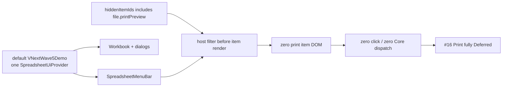
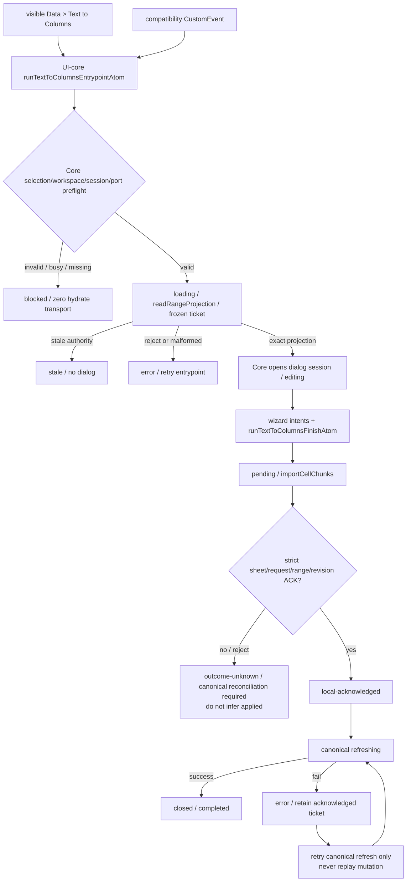
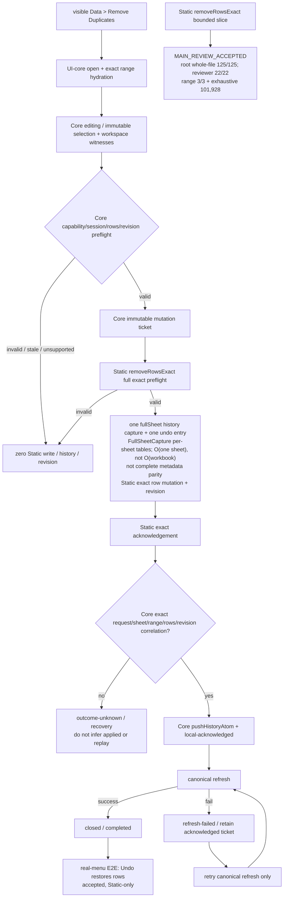
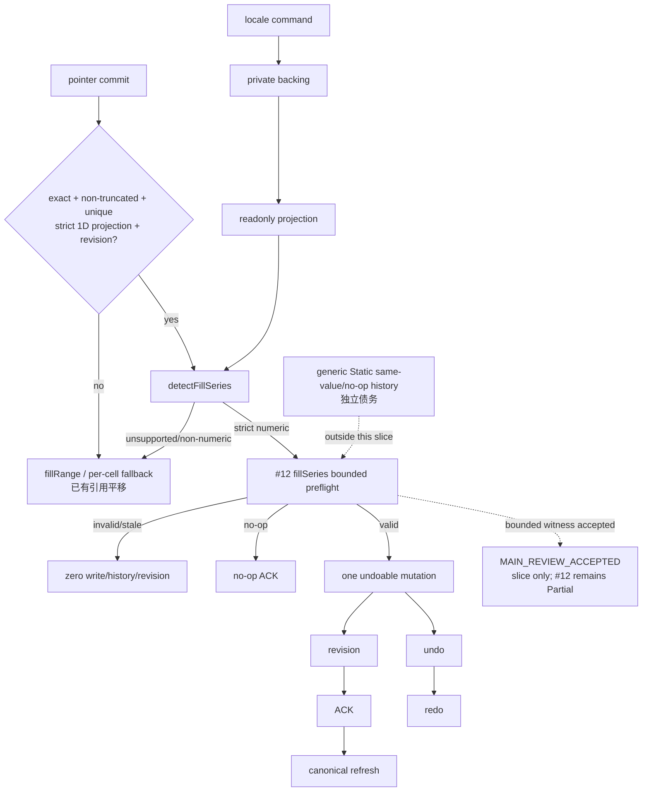
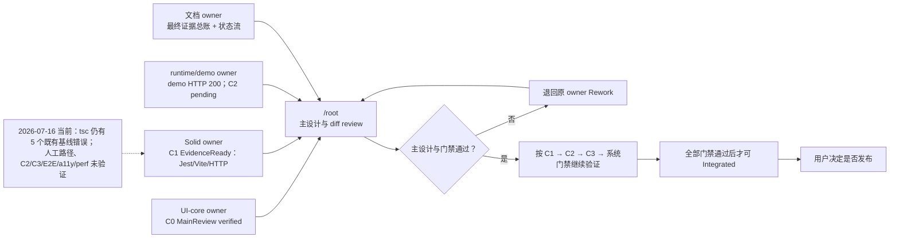
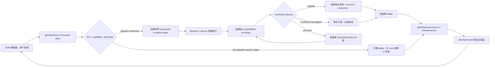
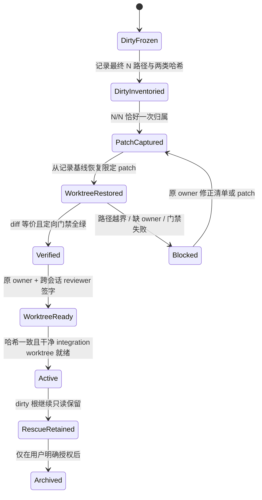
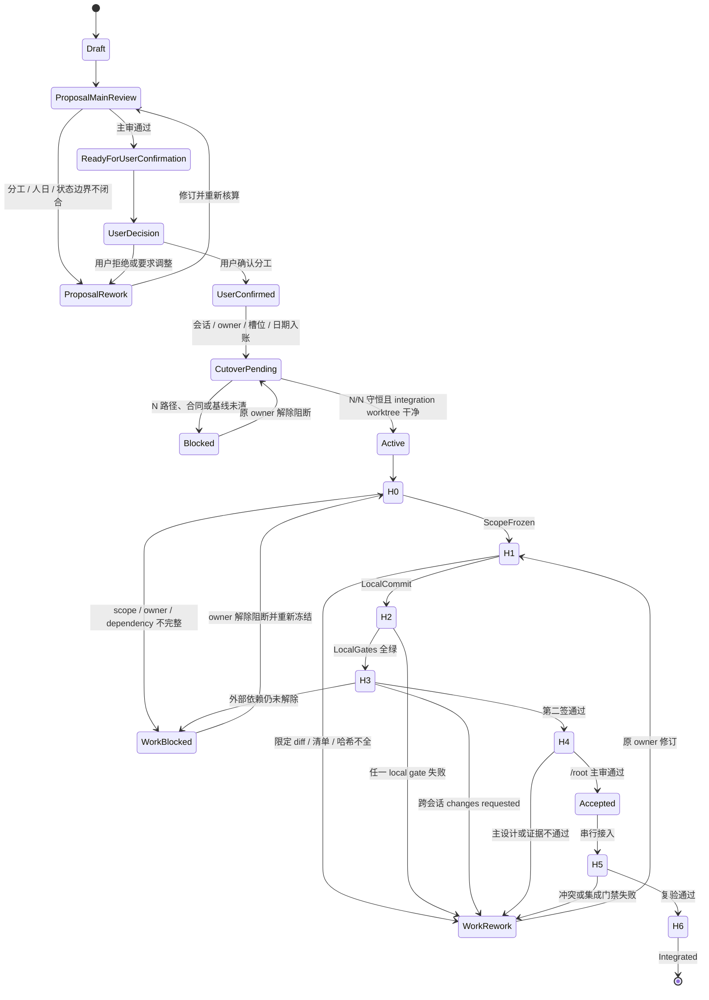

# 双会话分工提案（2026-07-14，修订稿）

## 2026-07-16 当前多 Agent 执行修订

当前 #03 收口证据按集合分层：`/root` targeted **7 suites / 216 tests PASS**（owner Solid/Grid **3 suites / 101 tests** + UI-core/Core **4 suites / 115 tests**）；独立 reviewer 的 Grid 新增 **3 tests** + 相邻全量 **74 tests** = **77 tests**，core/menu/hidden/boundary **115 tests**，ContextMenu **24 tests**。UI-core build PASS；全量 UI-core **57/57 suites、1437/1437 tests PASS**；全量 Solid **70 passed + 1 skipped suites（71 total）、1125 passed + 6 skipped tests（1131 total），0 failed**；Vite **293 modules PASS**。Full Solid `tsc` 仍是 exit 2、恰 5 条未变化的 Worker baseline diagnostics，不能写成 PASS。

2026-07-14 的双会话、人日和 dirty-cutover 内容保留为历史规划，不再指挥当前收口。当前执行只在 `/Volumes/work/self/einfach` 进行，采用“一主审 + 三条并发交付线”；主 Agent 不代替子 Agent 写专题实现。

| 槽位 / owner         | 当前职责                                                    | 允许修改范围                                                                                       | 禁止越界                                                                      | 当前交付状态                                           |
| -------------------- | ----------------------------------------------------------- | -------------------------------------------------------------------------------------------------- | ----------------------------------------------------------------------------- | ------------------------------------------------------ |
| 主 Agent `/root`     | 架构、公共合同裁决、diff review、验证证据汇总               | 评审与最终机械接入                                                                                 | 不代写 feature、不在 review 时顺手改语义                                      | C0 `MainReview verified`；C1 证据审阅中                |
| UI-core / 文档 owner | 收口 `@einfach/core` feature 状态机；随后只更新 parity 文档 | `excel/spreadsheet-ui-core` 的既定迁移范围；文档阶段仅 `excel/solid-excel/docs/online-excel-parity/**` | 文档阶段不再改源码；不动 `core/core`、`excel/excel-core-ts`、Rust、Solid | C0 `MainReview verified`；文档最终回填                 |
| Solid owner          | 把现有 Core 接到 Solid 薄绑定并复验                         | `excel/solid-excel/src-vnext/**` 及直接测试                                                              | 不复制产品状态；不宽化 backend ACK；不改 TS/Rust engine core                  | C1 `EvidenceReady`（受限）；Jest/Vite 已验，`tsc` 非绿 |
| runtime/demo owner   | adapter/runtime 合同收口、default demo 启动与证据           | `excel/solid-excel` adapter/demo 的限定 diff 与直接测试                                                  | 不重写 engine；不把 demo mock 当生产能力；不改 TS/Rust core                   | demo HTTP 200；C2 合同仍 `pending / unverified`        |

当前执行不沿用上表的历史泛化槽名冒充实时状态：三路明确为 #03 Context Hide/Unhide `MAIN_REVIEW_ACCEPTED / released`、#23 Shared-edge Contract `Blocker / Pending`、Docs Evidence `MAIN_REVIEW_ACCEPTED / released`，并按上述三路最终状态登记；规范流见 [README｜本轮三路并发→主审状态流](./README.md#本轮三路并发主审状态流)。#23 等待的是 canonical projection 的 write-order / owner / explicit-none / tie 合同裁决，不是安全告警或产品失败；裁决前禁止实现侧自行发明优先级。#03/#23 继续 `Partial`，41 项总账不变。

保护边界：`core/core`、`excel/excel-core-ts`、`excel/rust/**` 不属于本次 UI parity 迁移修改范围；若验证发现真实 engine 缺口，owner 只能提交证据与设计提案，必须先取得用户和 `/root` 的新授权。

工作表/范围 Protection（保护/解锁）不是通用安全子系统；Core verified，真实 backend/adapter canonical read 仍 C2 pending。

当前严格总账保持 **41 项 = 0 `Verified` / 35 `Partial` / 5 `Missing` / 1 `Deferred`**。#03 hidden rows/columns Static authority、Grid exact-window metadata hydration 与 Format Top Menu selection Unhide 三个 bounded slices 均已 `MAIN_REVIEW_ACCEPTED`；旧 Grid off-window residual 已移除。默认 Wave5 的真实 MenuBar、Workbook 与 dialogs 现共享同一个 Provider，Format Unhide 在 Static host 可达；但 Worker demos 无 hidden capability、Static-capable Context Menu 已具备 Hide/Unhide 可达链，跨 runtime/durable/sparse/system 缺口也仍在，因此 #03 保持 `Partial`。#11 Paste Special Phase A+B 已接受 Top Menu + Grid keyboard capability gating、dispatch-time second guard 与 `defaultPrevented` 语义；Context Menu 也已接受 canonical capability 响应式可见性与 click-time second guard，unsupported / stale revoke 零 transport（root 3/40）。随后状态边界把 7 个 public state atoms 收口为 private backing + readonly projections，外部 runtime setter fail-closed，并以 root 4/42 覆盖 `pending → local-acknowledged → refreshing → closed`；仅有既知 jsdom canvas noise。#11 仍缺 Worker `pasteRange` / real transport、comments / column-widths 与完整 E2E。#14 capability/state boundary、Static regex/provenance 与 Static CAS/Replace All 已接受，最新 root/agent 合并定向为 **4 suites / 165 tests PASS**：`replaceMatches` 返回既有 response union；缺失/畸形 requestId 在 mutation 前抛错，可关联 requestId 下的 revision/plan reject 返回 `replace-matches-not-applied` 且零写/undo/bump；整份 plan 先预检，no-op 无 undo/bump，有效变更只做一次 undo/full apply/revision bump 并 ACK 实际 revision。span 合同已冻结为按 UTF-16 code units 计数的非空半开区间 `[start, end)`；纯 zero-width regex 结果安全推进后省略，UI-core 在 ticket / mutation 前拒绝 zero / reversed span，Static 直接 replacement 返回 exact not-applied，均保持零副作用。#14 仍缺 Worker parity / real transport / E2E、generic ABA / durable cross-runtime。#04/#23 canonical borders 已接受 **8 suites / 258 tests**；#23 rotation 的纯测试证据切片也已接受，定向 2/2、邻接 **5 suites / 95 tests**，无实现/contract/Core/Worker 改动。borders 仍缺 shared-edge、merge/freeze、diagonal/full parity；rotation 仍缺真实浏览器 auto-fit/hit-area、merge/freeze/virtualization；#04/#23 都保持 `Partial`。规范状态流见下图及 [README｜已实现关键 Core 状态流](./README.md#已实现关键-core-状态流)。第 9 组数据分析与第 16 组打印完全延后，位于 41 项之外。

Static `set-format` / `merge` / `unmerge` exact ACK bounded slice 也已 `MAIN_REVIEW_ACCEPTED`：响应必须回传精确 `kind` 以及 `requestId` / `revision`（适用时含 range），UI-core strict correlation 才能进入 `local-ack → canonical projection refresh → ready`；缺失或错误 `kind` 必须停在 `outcome-unknown`，不得猜测 applied。证据为 adapter Jest **88/88**、Toolbar Playwright **10/10**、Vite build **PASS**。Wave5 demo 固定为 Static backend，Playwright 的 `wasm` / `ts` 项目只是重复验证同一 Static 链路，不是 Worker parity；Worker adapter 原有 `kind` 未改。UI-core / `@einfach/core` 仍是唯一状态中心，Solid 只做薄事件与渲染桥；相关产品行继续 `Partial`。

#20 Format Painter 新增 default/empty source → formatted target 的 visible-only Static Wave5 限定见证：可见 UI 从无格式覆盖的 C2 捕获 `{}`，刷到已设为粗体的 B2 后清除粗体，按钮 `aria-pressed` 为 `false → true → false`，console error 为 0。owner 与独立复核各自在 `wasm` / `ts` Playwright 项目标签下合计 **12/12**；两个标签运行同一个 Static backend，绝不能登记为 TS/WASM/Worker parity。#20 继续 `Partial`；capture 到成功收口及 reject / outcome-unknown / blocked 的唯一规范状态流见 [04｜Format Painter default-source lifecycle](./04-cell-formatting.md#format-painter-default-source-lifecycle)，本分工表不复制第二套状态机。

#06 keyboard-open Context Menu bounded slice 经独立审查 `ACCEPT`，但只覆盖键盘打开与焦点/关闭合同；#06 产品仍为 `Partial`，严格总账仍为 **41 = 0/35/5/1**。`Shift+F10` / `ContextMenu` key 只有在 navigation、non-composing、non-editing、non-formula 且无 Ctrl/Meta/Alt 时进入 UI-core，普通 F10 与 gated 路径返回 `none`。UI-core / Einfach 是菜单唯一业务状态；Solid 仅做 DOM anchor / focus bridge：Grid 把 `selectionSnapshot` 映射为 canonical `MenuOpenInput` 与可见 DOM anchor。缺失 anchor 或 `openMenu` 拒绝时，不调用 `preventDefault`、不打开菜单、selection 不变；成功以 `source: keyboard` 打开并聚焦首个 visible enabled menuitem；Escape 以 `cancelled` 关闭并恢复仍 connected 的 opener，pointer 打开不抢焦点。证据为独立 reviewer **3 suites / 141 tests PASS**、回归 **8 suites / 148 tests PASS**、UI-core `tsc` **0 diagnostics**、Solid 候选文件 **0 diagnostics** 与 **7-file diff-check**；这不是 full Solid `tsc` PASS，已知 Worker baseline 仍为 5 diagnostics。未跑真实浏览器 E2E，row/column/all selection 与 missing-anchor 等部分仍是源码审查边界，不得外推 TS/WASM/Worker parity 或产品完成。唯一规范图见 [02｜Keyboard Context Menu lifecycle](./02-worksheet-structure.md#keyboard-context-menu-lifecycle)，本分工表不复制第二套状态机。

#05 Freeze Panes Static authority 与 bounded history 均已 `MAIN_REVIEW_ACCEPTED`。history 定向 **10/10 PASS**：freeze 已进入 bounded delta 与 full-sheet capture，并精确保留 absent / `{0,0}`；覆盖 `Freeze A → B → undo B → undo A → redo A → redo B`、delete configured → undo restore → redo delete、invalid/stale 不建历史。仍缺 Worker/real transport parity、durable persistence/hydration、structural-transform 与系统门禁，因此 #05 保持 `Partial`；#12 也保持 `Partial`，两者都没有因限定证据升级产品总账。

Pointer 状态边界已 `MAIN_REVIEW_ACCEPTED`：public `pointerSessionAtom` / `pointerIntentAtom` 是 private backing 的 readonly projections，start/update/commit/cancel commands 是唯一 writers；状态为 `idle → active(update*) → commit intent → idle`，cancel 从 active 回 idle。唯一 Solid direct-setter fixture 已迁移到 start command；UI-core **7/7**、Solid overlay **18/18 PASS**、setter scan **0**。该切片不新增或升级产品行。两条完整 Mermaid 见 [README｜Pointer / Freeze bounded 状态流](./README.md#pointer-freeze-bounded-state-flows)。

### #03 隐藏行列并行包：bounded `MAIN_REVIEW_ACCEPTED`

#03 已形成以 UI-core / `@einfach/core` 为唯一状态中心的有界 mutation 状态链。`runViewportHiddenMutationAtom` 是 `idle / pending / local-acknowledged / canonical-reading / ready / blocked / recovery-required / unsupported` 的唯一 owner；Solid Menu 只把 `{ source, action }` 转发给 `runViewportHiddenSelectionMutationAtom`。active mutation 时 selection command 直接返回 `blocked`，保留当前 lifecycle/active ticket；invalid shape、invalid authority 或 canonical private hidden ∩ selection 为空时同样 `blocked`，零 backend transport/hidden-projection commit并保留 active hydrate。非空交集只冻结完整 `authority.window` 并 delegate 既有 lifecycle；capability/readback 缺失进 `unsupported`，requestId 耗尽进 `blocked`，两者都保留 hydrate；只有 capability/readback supported + requestId issued + mutation ticket installed 才 supersede hydrate。ACK matcher 只接受 matching sheet/request + valid revision；随后还必须通过同 ticket canonical kind/sheet/request/revision/full-window readback、strict hidden arrays 与 local hidden-projection object identity（bounded ABA guard），才在完整冻结窗口 reconcile rows/columns、保留 off-window projection并回 `ready`。当前 ticket 校验失败进 `recovery-required`；被替换的旧 continuation 只 stale-return、零旧 projection 写入。Static backend 的 per-sheet canonical `Set<number>`、一次 history/revision、undo/redo 与结构迁移仍由 authority 切片承载；Grid metadata hydration 只派发 UI-core command。五张规范 Mermaid 统一维护在 [README｜#03 bounded 状态流](./README.md#03-隐藏行列-bounded-状态流main_review_accepted)。

Top Menu 本轮前历史定向快照为 **4 suites / 171 tests**：Core hidden **95/95** + UI-core menu registry **6/6** + Solid MenuBar **61/61** + package-boundary **9/9**；前三组为 **162/162**。此前 Solid Menu **58/58**、合计 **168/168**、前三组 **159/159** 是旧时点证据，不再代表当前包。历史 authority/hydration 证据独立保留为 adapter **106/106**、UI hidden **53/53**、Solid Menu **54/54**、hydration **36/36** + Solid Grid **5/5**、root UI-core **98/98** + Grid **74/74**，不得与当前数字混算。UI-core full 当前为 **57/57 suites、1437/1437 tests PASS**，UI-core build PASS；Solid full 当前为 **70 passed / 1 skipped suites（71 total）、1125 passed / 6 skipped tests（1131 total），0 failed**；Vite **293 modules PASS** 为既有证据。Full Solid `tsc` 仍恰有 5 条禁止扩围的 Worker baseline diagnostics，不得写成全量绿。

Grid exact-window metadata hydration bounded slice 已 `MAIN_REVIEW_ACCEPTED`：Grid 只派发 `hydrateViewportSizeProjectionAtom`；UI-core 在 ticket/read 前先处理 active mutation、invalid sheet/window、unsupported 与 requestId 耗尽，valid ticket 后才冻结 exact ticket并单次 canonical read，再做全四 slices 校验与 metadata identity gate，随后一次 exact-window commit并保留 off-window/sibling sheet。更新的 valid hydrate按 latest-wins supersede 旧 hydrate；selection mutation 则只有 capability/readback supported + requestId issued + mutation ticket installed 才 supersede hydrate。所有 reject/malformed/mismatch/stale/竞争路径均零部分写入；两个 hidden arrays 同时缺席只进入 `sizes-only`，保留 hidden。旧 Grid off-window residual 已移除。默认 `VNextWave5Demo` 已在同一 `SpreadsheetUiProvider` 内挂真实 `SpreadsheetMenuBar`、Workbook 与 dialogs，Format Unhide 在默认 Static host 可达；两个 Worker demos 仍无 hidden projection/mutation capability，Static-capable Context Menu 已具备 Hide/Unhide 可达链。Worker/Rust/真实 transport parity、durable persistence/hydration、sparse runs 与完整 E2E/a11y/perf/system closure 均未完成。#03 保持 `Partial`，严格总账仍为 **41 = 0/35/5/1**；九文件精确白名单以 README 逐项清单为准，当前尚未 commit，且不含 Core/Rust/三份 Worker convergence 文件。数据分析和打印继续完全延后、位于 41 项外；`/root` 只做设计与 review，后续风险必须另开限定包。

### 默认 Wave5 host gate、TTC 与 Remove Duplicates 并行状态

本轮排期与验收必须区分“默认 Static host 已可达”和“跨 runtime parity 已完成”。默认 `VNextWave5Demo` 只有一个 `SpreadsheetUiProvider`；真实菜单、Workbook 与 dialogs 都在其中，Solid 只转发 intent，Core 独占 selection、ticket、dialog、loading/error、ACK、history 与 recovery 状态。

| 工作包                                  | 当前代码事实                                                                                      | 主审状态 / 后续排期                                                                                                       |
| --------------------------------------- | ------------------------------------------------------------------------------------------------- | ------------------------------------------------------------------------------------------------------------------------- |
| #16 Print host gate                     | `file.printPreview` 在 host render 前被 `hiddenItemIds` 过滤；零 DOM、零 click、零 Core dispatch  | 完全延后；不排实现日期、不占 Agent 槽                                                                                     |
| Text to Columns entrypoint              | 真实 Data 菜单与兼容事件都只进入 `runTextToColumnsEntrypointAtom`                                 | 默认 Static host 证据；不得宣称 TS/WASM/Worker parity                                                                     |
| #20 Format Painter visible witness      | default/empty C2 `{}` → formatted B2 清除粗体；owner 与独立复核各自 wasm/ts 项目合计 12/12        | 同一 Static backend；#20 `Partial`；状态流见 [04 规范源](./04-cell-formatting.md#format-painter-default-source-lifecycle) |
| #06 Keyboard Context Menu bounded slice | gated keyboard intent、canonical input/anchor、focus/close；独立 3/141、回归 8/148                | 无真实浏览器 E2E；#06 `Partial`；状态流见 [02 规范源](./02-worksheet-structure.md#keyboard-context-menu-lifecycle)        |
| #30 real-menu E2E                       | Data → Remove Duplicates success 与 undo 已独立验收                                               | 只证明默认 Static host；#30 保持 `Partial`                                                                                |
| Static `removeRowsExact` bounded slice  | `/root` 整文件 **125/125**、reviewer 定向 **22/22**、range 子审 **3/3** + **101,928** 个穷举 case | bounded `MAIN_REVIEW_ACCEPTED`；只覆盖 Static，#30 保持 `Partial`                                                         |
| #9 Data Analysis                        | 无本轮实现                                                                                        | 完全延后；不排实现日期、不占 Agent 槽                                                                                     |

该 bounded 接受不等于整行删除的全 metadata parity；merge、name、validation、conditional formatting、filter、freeze 等结构 metadata 缺口仍在，也不得外推为 TS/WASM/Worker parity。#20 的 12/12 也只是同一 Static backend 的两组项目标签见证，不改变这条边界。

#### Print host render gate

#### Text to Columns Core lifecycle

#### Remove Duplicates Core → Static exact lifecycle

### #12 自动填充并行包：bounded `MAIN_REVIEW_ACCEPTED`

#12 已有 Solid Grid → UI-core detector → Static backend 的数值序列窄链，但没有越界修改 `core/core`、`excel/excel-core-ts` 或 Rust。locale command 是 private backing 的唯一 writer，public atom 只读；pointer commit 只有 exact、未截断、无重复、严格一维且带 revision 的 canonical source 才进入 detector，并且只将有限非零整数/小数派发为 `fillSeries`。其他 source 继续走 `fillRange` / 受限逐格 fallback，其中 bounded per-cell fallback 已有引用平移。只有 #12 `fillSeries` bounded path 会在 Static 全计划预检成功后才建一次 undoable mutation、推进一次 revision、返回精确 ACK 并刷新 canonical projection；invalid/stale 零副作用，空有效计划 no-op ACK，undo/redo 沿该 bounded history witness 流转。

该包现为 bounded `MAIN_REVIEW_ACCEPTED`：独立 reviewer **4 suites / 144 tests PASS**；`/root` 主审通过 adapter **99/99**、fill **17/17**、scaling **16/16**；该 bounded 包接受时的历史 Solid full 快照为 **69 suites passed / 1 skipped（70 total）**、**1080 tests passed / 6 skipped（1086 total）**；当前权威 Solid full 为 **70 suites passed / 1 skipped（71 total）**、**1125 tests passed / 6 skipped（1131 total），0 failed**，Vite build **PASS**。Full Solid `tsc` 仍恰好有 5 条禁止扩围的 worker baseline diagnostics，不能写 PASS。接受只覆盖 #12 `fillSeries` 的 plan/no-op/preflight、单 mutation/单 revision 与 undo/redo witness；不得外推为 Static 全局 history/no-op 原子性完成，generic Static same-value/no-op history 仍是独立债务。bounded per-cell fallback 已有引用平移；完整 formula-series、Worker/真实 transport parity、date/weekday/month/custom、可见命令、E2E/a11y/perf/系统门禁均未实现。#12 继续 `Partial`，严格总账保持 **41 = 0/35/5/1**；第 9 组数据分析和第 16 组打印继续完全延后、位于 41 项之外。

```mermaid
stateDiagram-v2
  [*] --> HiddenRowsColumnsAccepted: #03 历史 4 suites / 171；前三组 162
  HiddenRowsColumnsAccepted --> HiddenSelectionPreflight: selection + authority + canonical hidden intersection
  HiddenSelectionPreflight --> HiddenZeroTransport: invalid or empty / blocked / preserve hydrate
  HiddenSelectionPreflight --> HiddenBaseLifecycle: nonempty / freeze full authority.window / delegate
  HiddenBaseLifecycle --> HiddenUnsupported: capability or readback absent / preserve hydrate
  HiddenBaseLifecycle --> HiddenRequestIdBlocked: requestId exhausted / preserve hydrate
  HiddenBaseLifecycle --> HiddenMutationTicket: supported + requestId issued + ticket installed / supersede hydrate
  HiddenMutationTicket --> HiddenCanonicalReadback: matching sheet/request + valid revision ACK
  HiddenCanonicalReadback --> HiddenMutationReady: same-ticket full-window strict readback + local hidden-projection object identity（bounded ABA guard）
  HiddenRowsColumnsAccepted --> HiddenHydrationTicket: historical hydration 36/36 + Grid 5/5；root 98/98 + Grid 74/74
  HiddenHydrationTicket --> HiddenHydrationZeroWrite: latest-wins / reject / malformed / stale / identity failure
  HiddenHydrationTicket --> HiddenHydrationAccepted: atomic exact-window commit；off-window + sibling preserved
  HiddenMutationReady --> HiddenRowsColumnsPartial: default Wave5 Static Unhide reachable；Worker unsupported；Static-capable Context Menu reachable
  HiddenHydrationAccepted --> HiddenRowsColumnsPartial: cross-runtime/durable/sparse/system gaps
  [*] --> FindReplaceSpanContractFrozen: UTF-16 + nonempty half-open span
  FindReplaceSpanContractFrozen --> FindReplaceGuard: #14 exact safe requestId + revision
  FindReplaceSpanContractFrozen --> FindReplaceZeroWidthClosed: pure zero-width omit；UI-core reject；Static not-applied
  FindReplaceGuard --> FindReplaceRejected: uncorrelatable requestId 抛错；其余 reject not-applied
  FindReplaceGuard --> FindReplacePreflight: full plan before undo
  FindReplacePreflight --> FindReplaceRejected: stale/missing/unadvanceable revision 或 invalid plan
  FindReplacePreflight --> FindReplaceNoOpAck: no-op / no undo / no bump
  FindReplacePreflight --> FindReplaceApply: one undo / full apply / one bump
  FindReplaceApply --> FindReplaceAck: ACK actual revision
  FindReplaceRejected --> FindReplaceZeroSideEffects: zero write / zero undo / zero bump
  FindReplaceZeroSideEffects --> FindReplacePartial
  FindReplaceZeroWidthClosed --> FindReplacePartial: Worker/transport/E2E + generic ABA/durable
  FindReplaceNoOpAck --> FindReplacePartial
  FindReplaceAck --> FindReplacePartial
  [*] --> CanonicalBorders: #04/#23 cell format.borders
  CanonicalBorders --> FourSideOverlays: four sides + six styles；none no claim
  FourSideOverlays --> BorderRerender: content/projection refresh
  BorderRerender --> CanonicalBorders: update/clear
  BorderRerender --> BorderPartial: shared-edge + merge/freeze + diagonal/full parity
  [*] --> CanonicalRotation: #23 DisplayCell format.rotation
  CanonicalRotation --> RotationStyles: default / positive / negative / vertical
  RotationStyles --> RotationRerender: content-change refetch -> update/clear
  RotationRerender --> CanonicalRotation
  RotationRerender --> RotationPartial: edit input unrotated；browser/merge/freeze/virtualization gaps
  [*] --> StaticMutationDispatch: UI-core dispatch
  StaticMutationDispatch --> StaticMutation: set-format / merge / unmerge
  StaticMutation --> StaticAckCorrelation: kind + requestId + revision
  StaticAckCorrelation --> StaticLocalAck: exact ACK
  StaticLocalAck --> StaticProjectionRefresh: canonical projection refresh
  StaticProjectionRefresh --> StaticReady: ready；Solid thin render
  StaticAckCorrelation --> StaticOutcomeUnknown: missing / wrong kind
  StaticOutcomeUnknown --> StaticPartial: do not infer applied；canonical reconciliation
  StaticReady --> StaticPartial: Wave5 Static-only；Worker parity pending
  [*] --> FreezeHistoryAccepted: #05 Static bounded history 10/10
  FreezeHistoryAccepted --> FreezeHistorySequence: A -> B -> undo B -> undo A -> redo A -> redo B
  FreezeHistoryAccepted --> FreezeDeleteSequence: delete configured -> undo restore -> redo delete
  FreezeHistoryAccepted --> FreezeRejectedNoHistory: invalid / stale
  FreezeHistorySequence --> FreezeHistoryPartial: Worker/transport/persistence/structural/system gaps
  FreezeDeleteSequence --> FreezeHistoryPartial
  FreezeRejectedNoHistory --> FreezeHistoryPartial: no history
  [*] --> PointerIdle: public atoms readonly
  PointerIdle --> PointerActive: start
  PointerActive --> PointerActive: update (0..n)
  PointerActive --> PointerCommitIntent: commit publishes intent
  PointerCommitIntent --> PointerIdle: session idle
  PointerActive --> PointerIdle: cancel
```

### 当前并行交付流

并发规则：三条子 Agent 线可以同时推进，但同一文件只有一个 owner；任何公共 contract 分歧都暂停对应调用点并交 `/root` 裁决。当前三路是 #03 Context Hide/Unhide `MAIN_REVIEW_ACCEPTED / released`、#23 Shared-edge Contract `Blocker / Pending`、Docs Evidence `MAIN_REVIEW_ACCEPTED / released`，按上述三路最终状态登记；详见 [README｜本轮三路并发→主审状态流](./README.md#本轮三路并发主审状态流)。#23 的 blocker 只表示 canonical projection 尚缺 write-order / owner / explicit-none / tie 合同，不是安全告警或产品失败，且不得由实现侧发明优先级。UI-core 最新已通过 build / typecheck / diff-check、**57/57 suites、1437/1437 tests PASS**，C0 已 `MainReview verified`。Solid 当前有效 full `--silent` 为 **70 suites passed / 1 skipped（71 total）、1125 tests passed / 6 skipped（1131 total）、0 failed、exit 0**；Vite **293 modules PASS** 是既有 build 证据，default demo `http://127.0.0.1:5173/` 返回 HTTP 200。Full Solid `tsc` exit 2，恰好 5 条禁止扩围的 worker baseline diagnostics（`worker-runtime-ts.ts` 864、1306×2、1312；`worker-runtime.ts` 264），因此 C1 只能记 `EvidenceReady`，不能记完成。#03 与 #23 仍为 `Partial`，C2、C3、E2E、a11y、性能与人工关键路径继续 `pending / unverified`。

---

以下保留 2026-07-14 双会话分工历史记录。

- **文档状态**：`UserConfirmed`；用户已于 2026-07-14 明确确认分工并要求开工，所有权表自此生效。
- **执行状态**：`CutoverPending / Blocked`；分工已确认不等于绕过 dirty cutover。首次冻结为 33 路径，随后新增共享日账 `INFLIGHT.md`，必须按最终重冻集合完成 `N/N` 守恒后，源码实现才能进入 `Active`。
- **审计基线**：HEAD `2feea483eefb`；排期、人日和门禁以 [总排期](./README.md)、[多 Agent 执行计划](./MULTI_AGENT_EXECUTION.md)及各专题文档为准。
- **会话定义**：CC-A 是引擎 / 公式近端实施会话；CC-B 是本规划与 UI / 服务近端会话。CC-B 的实现必须交给具名的非 `/root` worker；`/root` 位于 CC-B，但只负责主设计、主审和串行集成。
- **结论**：P0/P1 按 **CC-A 346 人日（66.4%）/ CC-B 175 人日（33.6%）** 完整闭合；P2 在用户单独启动后按 **CC-A 115～119 / CC-B 58 人日** 分配。两会话是所有权账，不是两套额外并发额度。
- **范围外**：第 9 组“数据分析”和第 16 组“打印”完全延后；不估时、不占槽、不预研，也不扩展现有打印预览壳。

## 1. 不可变的主设计

分工不能改变事实归属，也不能为了并行而复制产品状态。

| 层                            | 唯一职责                                                                                            | 禁止事项                                                                                        |
| ----------------------------- | --------------------------------------------------------------------------------------------------- | ----------------------------------------------------------------------------------------------- |
| Backend / service             | 持久工作簿事实、身份与 ACL、revision、幂等执行、分页和权威回执                                      | 让前端 atom、mock 或可选 no-op 冒充持久能力                                                     |
| `excel/spreadsheet-ui-core` | 以 `@einfach/core` 定义唯一前端 Source / Derived / Command atoms、mutation ledger、状态机和有界投影 | 依赖 Solid；另建状态库、parser、事实缓存或无界 `Map`                                            |
| `@einfach/solid`              | Provider、订阅和写入 hooks 等薄绑定                                                                 | 承载业务规则或复制产品状态                                                                      |
| Solid host                    | 渲染、事件转发、焦点、DOM ref 和一次性测量                                                          | 用 `createSignal`、Solid store 或组件闭包保存草稿、loading、error、offline、conflict 等产品状态 |

所有工作包必须复用 [多 Agent 执行计划中的完整状态闭环](./MULTI_AGENT_EXECUTION.md#1-不可偏离的主设计)。分工后的最小状态路径如下：

`current UI ticket` 只能阻止旧请求覆盖当前 UI；不能阻止已提交的权威事实、revision 和 ledger 结算进入 core。任何公开 port、revision 语义、公式 reference model、缓存策略或事实归属变更都先进入 `/root` 设计裁决，不允许专题线私建兼容层。

## 2. 完整工作包账本

### 2.1 P0/P1：521 人日全部分配

| 会话 | 逻辑 owner                              | 范围 / 任务编号                                                 | 组合窗口                      | P0/P1 人日 | 执行槽映射                        | 关键交付与依赖                                                                             |
| ---- | --------------------------------------- | --------------------------------------------------------------- | ----------------------------- | ---------: | --------------------------------- | ------------------------------------------------------------------------------------------ |
| CC-A | `S0.5-IMP`；公共合同 owner 仍为 `/root` | Stage 0.5 通用 transaction / revision / event envelope 定向实现 | 07-20～07-24 冻结；08-07 验收 |          8 | W1 槽 2，与 A02 共线              | 只实现 `/root` 冻结的合同；AC 的 annotation mutation 与 A02 的非批注 mutation 共用 fixture |
| CC-A | A02                                     | 第 2 组工作表结构 P0/P1 全包                                    | W1～W2                        |         93 | W1 槽 2/3 日账轮转；W2 按依赖进入 | 消费 F-1、Stage 0.5；向 A03/A04/A05/A06/A13 提供结构语义                                   |
| CC-A | A03                                     | 第 3 组基础编辑 P0/P1 全包                                      | W1～W2                        |         60 | W1 槽 3 与 A04 轮转               | 消费 F-1、A02、统一命令票据；向 AC/A13 提供事务边界                                        |
| CC-B | A04                                     | 第 4 组单元格格式 P0/P1 全包                                    | W1～W2                        |         39 | W1 槽 3 与 A03 轮转               | 消费 F-1、A02、统一 revision；对话框产品状态只进 core                                      |
| CC-A | A05                                     | 第 5 组公式 P0/P1：`F-1`、`F0～F8`、`F11`                       | W0、W2～W3                    |         63 | W0 F-1；W2 槽 1；W3 与 A06 联调   | 共享 tokenizer / AST / reference model；F11 向 A06 提供结构化引用                          |
| CC-A | A06                                     | 第 6 组表格与数据管理 P0/P1 全包                                | W2～W3                        |        122 | W2 槽 2；W3 依赖联调              | 消费 A02、F11；向 A13 提供 filter/sort/hidden 的持久语义                                   |
| CC-B | AC                                      | 批注 / 备注 / 任务：`C0=4`、`C1=8`、`C2～C9=48`                 | W0～W2                        |         60 | W1 槽 1 连续占用；W2 槽 3         | C1 只做 annotation 适配和共证，不包含 Stage 0.5 的 8 人日                                  |
| CC-B | A13                                     | 第 13 组更改、视图与版本领域 P0/P1 全包                         | W3                            |         76 | W3 槽 1                           | 消费 Stage 0.5、C1、A02、A03、A06；不重建 transaction 基座                                 |
|      |                                         | **CC-A 小计**                                                   |                               |    **346** |                                   | `8 + 93 + 60 + 63 + 122`                                                                   |
|      |                                         | **CC-B 小计**                                                   |                               |    **175** |                                   | `39 + 60 + 76`                                                                             |
|      |                                         | **总计**                                                        |                               |    **521** |                                   | 与总排期一致                                                                               |

说明：

1. 公式的 **63 人日只包含 P0/P1**，任务是 `F-1`、`F0～F8`、`F11`；不得写成“F0～F13”。
2. `C0 + C1 = 12` 人日，其中 `C0=4`、`C1=8`；Stage 0.5 公共合同另计 8 人日，不得重复计费。
3. Stage 0 的 9 人日是已包含在上表中的 `F-1=5` 与 `C0=4`，不得再次相加；Stage 0.5 的 8 人日从第 13 组原 84 人日中拆出，因此 `A13 76 + S0.5 8 = 84`。
4. `W0-DIALOG` 是既有在制 carve-out，与 A03-E4、A04-WP3 等专题项存在交叠；它通过主审后只交对应 owner 消费，禁止另一 Agent 重做，也不在 521 人日中追加预算。
5. i18n 仅作为 dirty diff 的保全对象，不属于本 parity 排期或预算；除非用户另行授权，不安排继续实现。
6. `/root` 的架构、review 和 integration 职责不另增预算，也不计成隐藏实施工作包；相关评审容量已经包含在 521 人日和固定主审槽中。

### 2.2 P2：只在用户启动门后进入

| 会话 | 逻辑 owner | P2 范围                          |         人日 | 计划窗口 | 启动约束                                              |
| ---- | ---------- | -------------------------------- | -----------: | -------- | ----------------------------------------------------- |
| CC-A | A02        | 第 2 组 P2                       |           31 | P2-A     | 10-16 P0/P1 证据门通过且用户确认                      |
| CC-A | A03        | 第 3 组 P2                       |       19～23 | P2-B     | 富粘贴等待跨组版本化合同                              |
| CC-A | A05        | `F9`、`F10`、`F12`、`F13`、`F14` |           25 | P2-A     | F9 仅为 worker RPC 接线；F13 不重建 Wave 8.2 async 链 |
| CC-A | A06        | 第 6 组 P2                       |           40 | P2-B     | 先消费第 2 组通用大纲等上游合同                       |
| CC-B | A04        | 第 4 组 P2                       |           15 | P2-A     | capability gate 保持关闭直至验收                      |
| CC-B | AC         | 批注专题 P2                      |           25 | P2-B     | 必须由用户单独确认；未确认时为 0                      |
| CC-B | A13        | 第 13 组 P2                      |           18 | P2-A     | 只做领域增强，不回填通用 revision 基座                |
|      |            | **CC-A 小计**                    | **115～119** |          | `31 + 19～23 + 25 + 40`                               |
|      |            | **CC-B 小计**                    |       **58** |          | `15 + 25 + 18`；含条件性的 AC 25                      |
|      |            | **总计**                         | **173～177** |          | 与总排期一致                                          |

P2 未获批准时不得“顺手实现”、占用 W0～W4 槽位或用风险储备预研。AC 的 25 人日还需要单独的用户门禁；未批准 AC P2 时，CC-B P2 只能承诺 33 人日，项目 P2 总量只能记 148～152 人日。第 9、16 组也不进入 P2。

## 3. 两会话与全局三执行槽

CC-A / CC-B 只表示归属与交叉评审方向。两个会话合计仍遵守 **4 个总槽：`/root` 固定 1 个主审槽 + 最多 3 个执行槽**。审计、conformance、E2E、性能和 MCP 都占执行槽，不能作为免费后台任务。

| 波次              | 总槽 0：固定                         | 执行槽 1                         | 执行槽 2                             | 执行槽 3                                                            |
| ----------------- | ------------------------------------ | -------------------------------- | ------------------------------------ | ------------------------------------------------------------------- |
| W0 07-14～07-17   | `/root`：设计冻结、真实 diff 主审    | 02/03/04 只读审计                | 05/06 只读审计                       | CC-B 具名非 root worker：`W0-DIALOG` 限定返工；空闲后再启动独立审计 |
| W1-A 07-20～07-24 | `/root`：冻结公共合同与串行接入      | CC-B AC：C1 / annotation 侧      | CC-A `S0.5-IMP` + A02 非批注 fixture | CC-A A03 / CC-B A04 按 In-flight 日账轮转                           |
| W1-B 07-27～08-07 | `/root`：M0.5 与 02/03/04 主审       | CC-B AC：C1 + M0.5               | CC-A A02                             | CC-A A03 / CC-B A04 按日账轮转                                      |
| W2 08-10～09-04   | `/root`：公式、Table、批注合同主审   | CC-A A05                         | CC-A A06                             | CC-B AC                                                             |
| W3 09-07～10-02   | `/root`：durable revision 与集成主审 | CC-B A13                         | CC-A `V-CONF` 跨组 conformance       | CC-B `V-E2E` E2E / 性能 / MCP                                       |
| W4 10-05～10-16   | `/root`：汇总证据与发布建议          | 缺陷回到原 owner；一次只激活一条 | CC-A 双后端回归                      | CC-B a11y / 性能 / MCP 复验                                         |

执行规则：

- W1 的 AC 连续占槽 1；A02/A03/A04 只能使用余下两槽，暂停任务不得算隐藏第四执行 Agent。
- `V-CONF` 由 CC-A 负责运行共享 conformance，`V-E2E` 由 CC-B 负责运行 UI/E2E/性能/MCP；发现问题后修复退回原 Axx owner，并继续占用对应槽。
- `/root` 只审合同、diff、测试证据并串行接入，不写功能实现、不修测试，也不在集成时顺手解决语义冲突；这些工作必须退回原 owner。
- CC-B 的 A04、AC、A13、`W0-DIALOG` 与 `V-E2E` 都必须在日账中登记具名非 `/root` worker；“CC-B owner”不能被解释为 `/root` 的隐藏实施任务。
- 每日 In-flight 账必须记录 `active / queued / blocked`、会话、Axx owner、槽位、基线和交接 commit；两会话不能维护互相不可见的并发账。

## 4. 现有 dirty 根工作树的无损切换门

截至首次冻结审计，分支 `claude/rust-core-state-plan-Auzcj` 的根工作树基于 `2feea483eefb`，共有 **33 个 dirty 路径：20 个 tracked modified（19 个 TS/TSX 源码或测试文件 + `excel/solid-excel/README.md`）和 13 个 untracked parity 文档文件**。用户确认后又依次新增共享日账 `INFLIGHT.md` 与盘点文件 `CUTOVER_INVENTORY.md`，因此 33/33 与 34/34 都只能保留为来源证据，当前必须重冻为 35/35；若重冻前继续出现路径，则目标自动变为最终集合的 `N/N`。这些路径不能被默认视为同一 owner，也不能直接当作“共同基线”。隔离 worktree 中已出现的源码 WIP 必须计槽并保持 quarantined，在切换完成前不得进入 H1、交接或集成。

切换必须按以下顺序执行，且本提案本身不授权 stash、reset、覆盖、删除或提交他人的 diff：

1. `/root` 冻结 dirty 根为只读救援源，记录基线 SHA、分支、`git status --porcelain=v1 --untracked-files=all` 全量清单、tracked binary diff 哈希和 untracked 文件的有序哈希清单；禁止 `reset`、`checkout`、`clean` 或混合 owner 的 stash。
2. 最终 freeze-set 的 `N/N` 个路径必须**恰好一次**登记 owner、范围和处置方式（owner 导入或 rescue-only）；本轮重冻目标当前为 35/35，即 17 个 W0-DIALOG、2 个 i18n preservation-only、16 个 docs。W0 对话框、i18n、条件格式、NameBox、测试和文档不能整树打包后再猜 owner。
3. 从记录基线创建干净的 integration worktree；dirty 根不得直接承担集成。每个 owner 再建立独立分支 / worktree，例如 `excel-parity/cc-b-w0-dialog`，CC-A 与 CC-B 不共享工作树或分支。
4. 每个 owner 只导入自己清单中的限定 patch，记录 `git diff --stat`、补丁哈希和明确排除的路径；恢复后核对 `git diff --name-only` 与 owner 清单完全一致，再运行 `git diff --check`、定向 lint、类型和直接测试。
5. 原 owner 与跨会话 reviewer 确认“内容等价且测试可复现”后提交 handoff；`/root` 只在干净 integration worktree 中机械接入，并检查 `N/N` 路径守恒和哈希一致，不替 owner 做语义修复。
6. 只有最终 freeze-set 的 `N/N` 路径全部归属、所有哈希一致、handoff 完成且 integration worktree 仍干净，cutover 才能进入 `Active`；任一缺失或不一致都转 `Blocked`。
7. dirty 根作为救援副本一直保留，直至用户明确授权归档或删除；本提案不授权提交、清理或覆盖其中任何现有 diff。

切换状态如下：

## 5. 公共合同与跨会话交接门

公共合同仍归 `/root`：共享 revision envelope、backend 公共类型、operation registry、cursor/gap、公式 reference model、根导出与汇聚文件兼容性。CC-A 承担 Stage 0.5 的 8 人日，含义是**实现 `/root` 已冻结合同的定向 patch**，不是取得合同定义权。

| 里程碑                    | 验收内容                                                                                                                                   | 明确不代表                                                            |
| ------------------------- | ------------------------------------------------------------------------------------------------------------------------------------------ | --------------------------------------------------------------------- |
| `CF-07-24 ContractFreeze` | `/root` 接受共享 transaction / revision / event 合同、类型与 fixture skeleton；消费方可据此排队                                            | 生产级 conformance 已通过，或 annotation / 非批注 mutation 已完整落地 |
| `M0.5-08-07`              | 1 条 annotation mutation 与至少 1 条第 2～6 组非批注 mutation 通过同一 fixture，并给出原子 facts/revision、ACL、gap 与 reconciliation 证据 | 后续专题可以绕过统一合同，或用 UI 本地状态冒充持久事实                |

| 上游 → 下游                       | 提供方 → 消费方                                     | 必交工件                                                                         | 日期 / 门禁                             | 失败时状态                                   |
| --------------------------------- | --------------------------------------------------- | -------------------------------------------------------------------------------- | --------------------------------------- | -------------------------------------------- |
| F-1 → A02/A03/A04                 | CC-A A05 → CC-A A02/A03、CC-B A04                   | tokenizer / AST / reference rewrite / evaluator golden fixture + commit          | 07-24 consumer gate                     | `Blocked`；禁止临时 parser / regex rewriter  |
| Stage 0.5 → AC/A02                | `/root` 冻结合同；CC-A 定向实现 → CC-B AC、CC-A A02 | 同一 envelope / registry fixture；1 条 annotation + 至少 1 条第 2～6 组 mutation | **07-24 只冻结合同；08-07 才关闭 M0.5** | `Blocked`；缺 revision 的 mutation 不合入    |
| A02 → A03/A04/A05/A06/A13         | CC-A A02 → 两会话下游                               | 结构命令、引用改写、revision conformance commit                                  | 下游实现前                              | 下游排队，不私建结构语义                     |
| A03 → AC/A13                      | CC-A A03 → CC-B AC/A13                              | transaction ID、幂等执行、撤销与冲突边界 fixture                                 | AC/A13 对应 mutation 开工前             | 下游排队，不复制 transaction 基座            |
| A05 F11 → A06 Table               | CC-A A05 → CC-A A06                                 | structured reference AST / resolver / rewrite fixture                            | 09-11 首轮；09-18 验收                  | Table 结构化引用保持 capability off          |
| A06 filter/sort → A13 Sheet Views | CC-A A06 → CC-B A13                                 | 持久 filter/sort/hidden schema、分页与隔离 fixture                               | W3 A13 开工前                           | Sheet Views 不复用本地 UI state 冒充持久视图 |
| AC → A03/A13                      | CC-B AC → CC-A A03 E3/E15、CC-B A13                 | canonical annotation event、版本化读写与 reconciliation 合同                     | E3/E15 与 A13 对应项开工前              | `Blocked`；不得用组件本地事件替代            |
| C1 + Stage 0.5 → A13              | CC-B AC + CC-A 实现 → CC-B A13                      | identity/ACL/storage/event adapter 证据、M0.5 结果                               | 08-07 后                                | 不假设第 13 组零成本复用；重估并顺延         |

所有汇聚文件继续由 `/root` 串行接入，包括 `SpreadsheetGrid.tsx`、`worker-runtime*.ts`、`worker-protocol.ts`、`worker-workbook-backend.ts`、`SpreadsheetUiProvider.tsx` 和 backend 公共类型。专题 owner 只能交定向 patch、调用点清单和绿态证据。

## 6. Review、返工与集成状态流

### 6.1 交叉评审

- CC-A 实现：由非作者的 CC-B review Agent 先审，再进入 `/root MainReview`。
- CC-B 实现：CC-A 的独立 review 是强制第二签，再进入 `/root MainReview`；`/root` 不得成为该实现的作者。
- 汇聚文件：原专题 owner 提供定向 patch，另一会话检查合同与回归，`/root` 最后应用并串行验证。
- 跨会话 review 写入 `reviews/`，必须包含基线、限定 diff、状态边界、实际命令输出、风险和 `ApproveForMainReview / ChangesRequested / Blocked` 结论；只有 `/root MainReview` 可以标记 `Accepted`。

### 6.2 H0～H6 交接门

| Gate | 状态              | 必须证据                                                                             | 未通过时                             |
| ---- | ----------------- | ------------------------------------------------------------------------------------ | ------------------------------------ |
| H0   | `ScopeFrozen`     | 基线、Axx owner、具名 worker、限定路径、core 状态边界、上游合同、槽位与日期均登记    | `Blocked`；不得开工                  |
| H1   | `LocalCommit`     | owner worktree 中只有限定 diff；提供可审计 commit / patch、路径清单与哈希            | 退回 owner 补齐，不进入测试          |
| H2   | `LocalGates`      | `diff --check`、定向 lint / typecheck / tests、必要 conformance 或 UI 证据的真实输出 | `Rework`，仍占原执行槽               |
| H3   | `CrossReview`     | 另一会话的非作者 reviewer 第二签；review 文档给出 `ApproveForMainReview`             | `Rework` 或 `Blocked`                |
| H4   | `MainReview`      | `/root` 只审主设计、状态边界、合同、限定 diff 与证据，给出 `Accepted`                | 退回原 owner；`/root` 不写修复       |
| H5   | `SerialIntegrate` | `/root` 在干净 integration worktree 机械应用已接受 handoff 并复跑受影响门禁          | 冲突或失败退回原 owner，不现场改语义 |
| H6   | `Integrated`      | 集成后 commit / diff、绿态证据、依赖与 In-flight 日账同步完成                        | 未达成前不得标 `done`                |

### 6.3 从提案到集成的状态流

`Accepted` 只表示 `/root MainReview` 已通过，仍不是 `done`；只有 `/root` 完成串行接入并复验后才标 `Integrated / done`。`Blocked` 不会因执行槽暂时释放而消失；必须保留 owner、阻断原因、受影响依赖和解除条件。

## 7. 激活检查表

- [x] 用户已于 2026-07-14 明确确认本分工；文档已进入 `UserConfirmed`。
- [ ] W0 对话框 `MainReview → Rework` 完成，跨会话第二签和 `/root` 主审通过。
- [ ] 根工作树最终 freeze-set 已按 `N/N` 逐路径登记 owner，W0 / i18n 等在制 diff 已无损迁入独立 worktree。
- [ ] `/root` 冻结公共合同；CC-A 只领取定向实现，AC 与 A02 分别登记共证 mutation。
- [x] 两会话已建立唯一 [In-flight 三槽日账](./INFLIGHT.md)；后续每次槽位变化继续同步，禁止隐藏 Agent、免费审计或 `/root` 代做。
- [ ] P2、数据分析和打印均未提前占槽；push、tag、workflow 和实际发布继续只由用户决定。

本提案是确认后的分配账；[多 Agent 执行计划](./MULTI_AGENT_EXECUTION.md) 只同步 owner / 波次 / gate，[In-flight 三槽日账](./INFLIGHT.md) 只记录实时槽位。三份文档不得各自改写人日或并发真相。
