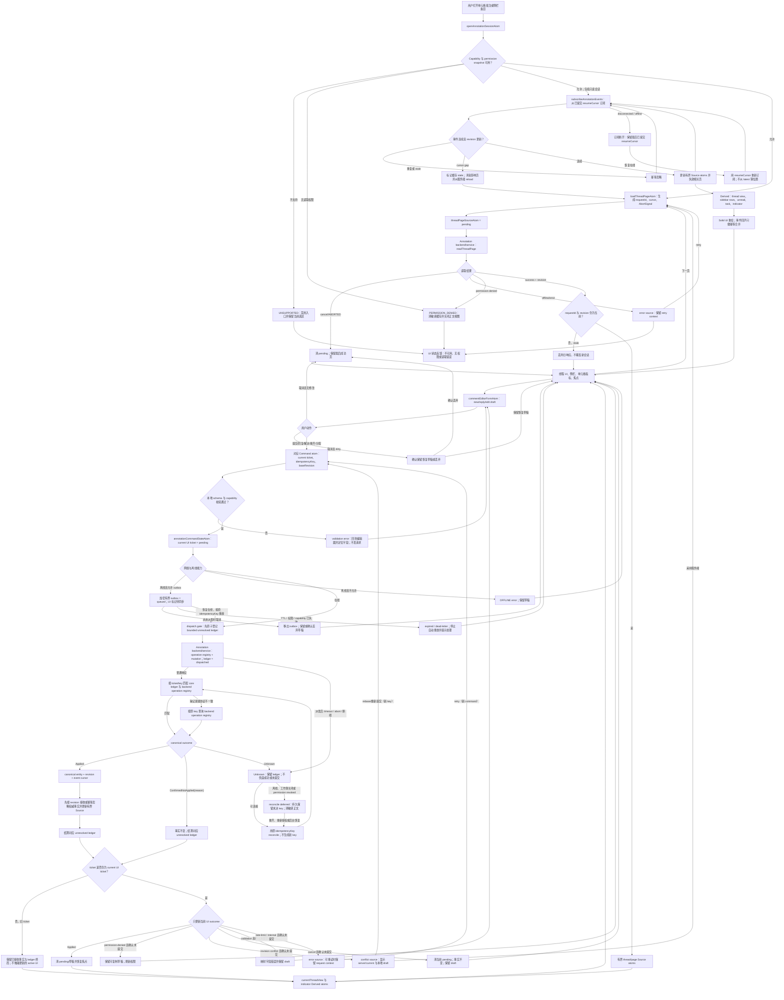

# 在线 Excel 对齐排期：批注、备注与任务

> 基线：2026-07-13，仓库提交 `7226093`。
> 专属小组技术最早窗口：P0/P1 为 2026-08-10 至 2026-08-28；若另行批准，P2 工作窗口为 2026-08-31 至 2026-09-18，含 P2 最早完成日为 09-18。它们不是组合承诺；组合计划中的 P2 只能在 2026-10-16 证据门通过且用户明确批准后启动。
> 本文不安排第 9 组“数据分析”和第 16 组“打印”；两组完全延后，也不作为本功能的隐含前置工作。
> 架构审查（2026-07-14）：目标设计以 `@einfach/core` 为唯一前端状态核心；当前只有 session/draft 壳符合，mutation 仍会绕过 command atom 直接调用可选 backend，不能标记为已收口。

## 1. 结论

当前实现只能算“批注编辑弹窗壳”，不能算在线批注已经实现：

- 默认 `vnext-wave5` 能从工具栏打开一个绑定 Einfach draft atom 的 textarea，也挂载了 `SpreadsheetCommentThread`。
- UI core 只有单个会话、单个草稿和 mutation intent 类型；没有线程读取、分页、列表、回复视图、任务或通知状态。
- backend 只有 5 个可选 mutation 端口，没有读取线程、重开、搜索、任务、通知或事件订阅合同。
- static、TS worker、WASM/Rust worker 都没有实现这些 mutation。默认 static 路径调用 `backend.postComment?.(...)` 后仍关闭弹窗，因此会把“什么都没保存”表现成成功。
- 作者和时间只出现在类型中，现有请求甚至允许客户端传 `author`；这不能代替服务端身份、权限、审计和权威时间。
- `noteIndicator`、`commentThreadId` 只存在于投影类型及 mock 测试，默认 Grid 没有真实指标渲染和刷新闭环。
- 现有单测、组件测试和 E2E 只证明弹窗与 mock request 形状，没有证明持久化、刷新后保留、多用户同步或 static/worker/service 对等。

因此，本排期先建立服务端权威事实、读写合同、revision/event stream 和能力门禁，再补默认 Wave5 的线程、备注、列表、提及、通知与任务体验。身份、权限、作者、服务端时间、持久化、通知和协作事件始终属于 backend/service；不得放进 atom 伪造。

## 2. 范围、非目标与状态口径

### 2.1 完整功能点

| 能力域     | 功能点                                                             |
| ---------- | ------------------------------------------------------------------ |
| 线程       | 新建线程、读取线程、游标分页、回复、编辑、删除、关闭与重新打开     |
| 身份       | 服务端作者、头像/显示名快照、服务端时间、编辑标记、租户/工作簿身份 |
| 单元格呈现 | 未解决/已解决指标、未读状态、hover 摘要、定位到单元格              |
| 列表与导航 | 工作表/工作簿侧栏、筛选、搜索、上一条/下一条、跨 sheet 跳转        |
| 提及与通知 | `@mention` 候选、解析、权限过滤、站内通知、已读/未读、跳转与重试   |
| 任务       | 负责人、状态、截止日期、重新分配、完成/取消、逾期派生状态          |
| 旧式备注   | 纯文本备注读取、设置、清除、编辑、指标、键盘入口和导入兼容边界     |
| 富内容     | 安全格式化文本、链接、附件引用、上传/扫描/下载权限边界             |
| 治理       | 权限、审计、速率限制、内容安全、离线、幂等、并发冲突和数据保留     |

### 2.2 本轮非目标

- 第 9 组数据分析和第 16 组打印完全延后，不估时、不借用本排期资源。
- P0/P1 只支持纯文本批注和纯文本旧式备注；富文本、附件和外部邮件/推送连接器放到 P2。
- P0/P1 不实现实时逐字输入状态、视频/语音留言或复杂项目管理工作流。
- Rust workbook engine 不负责用户身份、ACL、通知投递和协作持久化；这些事实由 annotation service 负责。
- 不用本地 undo 栈冒充协作审计日志，不用测试 fake、seed 数据、可选方法或组件内存冒充持久功能。
- Excel 文件导入导出中的批注/备注保真迁移依赖独立文件格式合同；本轮只冻结可扩展模型，不承诺 P0/P1 完成全格式往返。

### 2.3 状态判定

| 标记     | 含义                                                                                                 |
| -------- | ---------------------------------------------------------------------------------------------------- |
| 已实现   | 默认 Wave5 可达，真实 backend/service 持久化，static/service/worker 组合路径按能力合同通过自动化验收 |
| 部分实现 | 有 UI、类型、单个 atom、mock 或单路径代码，但业务闭环至少缺一层                                      |
| 未实现   | 没有用户可用的端到端链路                                                                             |
| 假可用   | 入口可点击或方法可选，但没有执行、静默 no-op、关闭后丢失或只由 fake 测试支撑                         |

## 3. 当前现状与代码证据

### 3.1 总体分层现状

| 层              | 当前事实                                                                                                                                                   | 结论                                                                          |
| --------------- | ---------------------------------------------------------------------------------------------------------------------------------------------------------- | ----------------------------------------------------------------------------- |
| 默认入口        | `excel/solid-excel/src/App.tsx:79-83` 默认选中 `vnext-wave5`；`VNextWave5Demo.tsx:285-359` 挂载 Toolbar、Grid 和 `SpreadsheetCommentThread`，但没有挂载 Menu Bar | 弹窗入口可达；菜单路径和完整侧栏不可达                                        |
| UI core         | `comments/index.ts:6-33` 只有 session、draft、intent 和 open/close/set-draft command atom                                                                  | 会话壳部分实现；无服务事实、分页或失败状态                                    |
| 类型            | `comments/types.ts:3-76` 有最小 `CellNote`、`Comment`、`CommentThread` 和五种 mutation request                                                             | 形状不等于实现；缺 reply/edit/reopen/list/search/task/notification/event 合同 |
| Backend port    | `backend/types.ts:788-793` 只有 `setNote?`、`clearNote?`、`postComment?`、`resolveCommentThread?`、`deleteComment?`                                        | 全部可选且 mutation-only；没有读取和权威返回模型                              |
| Cell projection | `backend/types.ts:131-143` 的 `DisplayCell` 可带 `noteIndicator`、`commentThreadId`                                                                        | 只有结构占位；未见真实数据源和默认 Grid 指标闭环                              |
| Solid host      | `SpreadsheetCommentThread.tsx:17-137` 只显示 cell label、textarea、Post、可选 Resolve 和 Close                                                             | 不显示现有正文、作者、时间、回复、加载或错误                                  |
| 默认 static     | 默认 Wave5 使用 static backend；adapter 中未实现五个 comments/notes 端口                                                                                   | 点击 Post 会因 optional chaining 静默跳过，然后在 60 行关闭弹窗，属于假成功   |
| worker/Rust     | worker backend、protocol、runtime 与 Rust 路径均无对应实现                                                                                                 | 没有 worker/service 组合链路，也没有 capability 降级                          |
| 测试            | core 测 session/draft/request shape；Solid 用 fake backend 测 request；E2E 只测打开、输入、关闭与编辑时禁用                                                | 没有持久化、重载、双用户、权限、冲突、worker 或通知验收                       |
| 既有设计文档    | `excel/spreadsheet-ui-core/docs/comments-notes.md` 描述了目标方向                                                                                        | 属于愿景，不是当前完成证据；其中读取、指标及入口描述需以实际代码重新验收      |

### 3.2 功能点现状表

| 功能点             | 当前状态 | 已有基础                                                       | 主要缺口                                                              | 优先级 |
| ------------------ | -------- | -------------------------------------------------------------- | --------------------------------------------------------------------- | ------ |
| 打开/关闭批注编辑  | 部分实现 | 工具栏可打开 session，Escape/Close 可关闭，草稿用 Einfach atom | 没有脏草稿确认、加载态、权限态和线程内容                              | P0     |
| 新建线程           | 假可用   | 有 `postComment?` 类型和按钮                                   | 默认 backend 无实现；无 canonical result、revision、错误与重载验证    | P0     |
| 线程读取与游标分页 | 未实现   | 有最小 `CommentThread` 类型                                    | 没有 read port、分页、缓存、空态或取消                                | P0     |
| 回复               | 未实现   | `postComment` 可携带可选 `threadId`                            | UI 不显示线程也没有 reply 模式；服务端合同未定义                      | P0     |
| 编辑/删除正文      | 部分实现 | 只有 `deleteComment?` 可选端口形状                             | adapter 未实现；没有 edit、作者权限、删除 tombstone 与恢复策略        | P0     |
| 作者与时间         | 假可用   | 类型有 `author?`、`createdAt`                                  | 未由服务端签发；作者可由客户端请求伪造；无 editedAt/identity snapshot | P0     |
| 解决线程           | 假可用   | 有 Resolve 按钮和可选 mutation                                 | 不读取当前 resolved 状态，不刷新 revision，无失败反馈                 | P0     |
| 重新打开线程       | 未实现   | 无                                                             | request 类型、按钮、权限与事件都缺失                                  | P0     |
| 单元格指标         | 假可用   | `DisplayCell` 有两个可选字段，mock 测试能透传                  | 无真实汇总投影、Grid 渲染、事件刷新和 resolved/unread 样式            | P0     |
| 旧式备注 CRUD      | 假可用   | `CellNote`、`setNote?`、`clearNote?` 类型存在                  | 无 read、adapter、UI、Shift+F2、指标、导入兼容                        | P0     |
| 侧栏/列表          | 未实现   | 默认页面已有通用 sidebar 容器                                  | 无批注 tab、分页、筛选、空态和虚拟列表                                | P1     |
| 导航与搜索         | 未实现   | 可复用 sheet/selection command                                 | 无工作簿查询、跨 sheet 定位、锚点失效处理                             | P1     |
| `@mention`         | 未实现   | 无                                                             | 无租户内候选、服务端解析、权限过滤和安全通知                          | P1     |
| 站内通知           | 未实现   | 无                                                             | 无事件、未读、ack、跳转、投递重试和偏好                               | P1     |
| 任务分配           | 未实现   | 无                                                             | 无 assignee、状态、due date、权限、事件或筛选                         | P1     |
| 离线与冲突         | 未实现   | request 有可选 revision，但未形成协议                          | 无 baseRevision、幂等 key、outbox、冲突 UI、重放与 stale 丢弃         | P0/P1  |
| 权限与审计         | 未实现   | 无                                                             | 无 ACL、IDOR 防护、不可变审计事件、限流和内容安全                     | P0     |
| 富文本             | 未实现   | textarea 只写纯文本                                            | 需冻结安全子集、序列化、粘贴清洗和 XSS 策略                           | P2     |
| 附件               | 未实现   | 无                                                             | 需对象存储、病毒扫描、签名 URL、配额、权限和删除保留策略              | P2     |

## 4. 交付目标与优先级

### 4.1 P0：真实持久线程与备注，2026-08-10 ～ 2026-08-21

1. 冻结 annotation capability、分页、mutation、错误码、revision、event stream 和幂等合同。
2. 建立服务端权威数据模型：workbook/sheet/cell anchor、thread、comment、note、identity snapshot、resolution、revision、audit event。
3. 完成线程读取、创建、回复、编辑、删除、解决、重新打开，以及旧式备注读取/设置/清除。
4. 服务端从认证上下文生成 author 和时间；每个操作执行工作簿、sheet、thread、comment 级权限校验。
5. 默认 Wave5 显示线程正文、作者、时间、分页、编辑器、pending/success/error/cancel 状态。
6. 真实 indicator summary 进入可见区域投影；线程事件能更新单元格指标和打开的线程。
7. static reference backend 与 production service adapter 运行同一 contract suite；worker/WASM 页面通过 composite adapter 接入 service，不在 Rust 内伪造协作事实。
8. 无 service/capability 时隐藏或禁用入口并解释原因；禁止 optional chaining 后关闭弹窗的静默成功。
9. 完成 stale、permission-denied、offline、conflict 和 cancellation 分支，保证草稿不丢。

### 4.2 P1：发现、协作和任务闭环，2026-08-19 ～ 2026-08-28

1. 默认 Wave5 批注侧栏：未解决/已解决、我参与、提及我、任务筛选、游标分页和虚拟化。
2. 工作簿级搜索、上一条/下一条、跨 sheet 定位；已删除/移动锚点有明确结果。
3. `@mention` 候选、服务端解析、站内通知、已读/未读、跳转和失败重试。
4. 任务负责人、状态、截止日期、重新分配、完成/取消，以及由服务端时间派生的逾期展示。
5. 加密离线 outbox、恢复提示、幂等重放和正文编辑冲突处理；不支持离线写时保留草稿并明确阻止提交。
6. 安全、可访问性、性能、双浏览器协作 E2E 和 MCP 默认入口验收。

### 4.3 P2：高级内容和外部集成，建议 2026-08-31 ～ 2026-09-18

1. 白名单富文本子集、富文本粘贴清洗和无障碍语义。
2. 附件上传、扫描、配额、签名下载、权限继承、保留与删除策略。
3. 邮件/推送连接器、通知偏好、摘要和退避重试。
4. 高级任务筛选、批量状态、提醒规则和第三方任务系统桥接。
5. `.xlsx` 旧式备注/线程的保真导入导出、迁移报告和不支持内容降级。

P2 不得反向阻塞 P0/P1 的纯文本模型；正文模型从第一天使用版本字段和内容类型，但 P0/P1 只接受 `text/plain`。

## 5. 事实归属与分层落点

| 事实/行为                     | 权威归属                                              | UI core / Solid 的责任                                            | 禁止做法                                      |
| ----------------------------- | ----------------------------------------------------- | ----------------------------------------------------------------- | --------------------------------------------- |
| 用户身份、作者、服务端时间    | Auth + annotation service                             | 展示服务端返回的 immutable snapshot                               | 客户端传作者名或用本机时间当权威时间          |
| ACL 与操作权限                | Service                                               | capability/permission source atom 只缓存服务端结论并处理失效      | 用按钮隐藏代替服务端授权                      |
| Thread/comment/note/task 正文 | Annotation service；static 仅作确定性 reference       | 保存当前有限页投影，不持有全工作簿副本                            | 把正文长期塞进组件 signal 或无界 atom family  |
| Revision、审计和事件          | Service durable log                                   | 按 revision 合并；只丢弃过期 read/event，已派发 mutation 必须对账 | 本地 undo 栈冒充协作日志                      |
| Cell indicator summary        | Service summary + workbook visible projection/overlay | 对当前 viewport 合并并渲染                                        | 扫描所有线程或逐格创建 atom                   |
| 草稿、当前 tab、pending/error | Einfach Source atoms                                  | Solid 只订阅和 dispatch command                                   | 新增 Solid `createSignal` 保存业务/表单状态   |
| 搜索和侧栏页                  | Service cursor query                                  | 缓存当前 query 的有限页和滚动锚点                                 | 把全工作簿结果一次性拉进前端                  |
| Mention/notification/task     | Service                                               | 展示、筛选、ack command 和有限页缓存                              | atom 自行推导“已通知”或本地改 assignee 当成功 |
| DOM、focus、测量句柄          | Solid host 局部                                       | 命令完成后恢复焦点与选择                                          | 把服务事实塞进 DOM dataset                    |

### 5.1 Adapter / service 能力策略

批注是协作服务能力，不是电子表格计算能力。三种运行形态按下面的边界实现，而不是强迫 Rust 重复一套用户系统：

| 运行形态               | P0/P1 行为                                                                                                                              | Capability 表达                                                         |
| ---------------------- | --------------------------------------------------------------------------------------------------------------------------------------- | ----------------------------------------------------------------------- |
| Static reference       | 确定性内存实现，可选受控 IndexedDB 持久化；完整执行线程/备注基本 contract，支持错误与 revision fixture                                  | `annotation.mode = "local"`；明确没有真实多用户和外部投递               |
| Worker / Rust workbook | workbook worker 继续负责 cell projection；host composite backend 调用 annotation service，并按 workbook revision 合并 indicator overlay | `annotation.mode = "service"` 或 `"disabled"`；Rust 不签发作者/ACL/通知 |
| Production service     | 权威持久化、身份、ACL、搜索、event stream、mentions、notifications、tasks 和 audit                                                      | 返回细粒度 read/write/resolve/assign/offline 等能力和限制               |

所有路径必须共用请求/响应 schema、错误码、revision 比较和 adapter conformance fixtures。若某能力不支持，UI 依据 capability 隐藏/禁用对应入口并说明原因；绝不能通过 `backend.method?.()` 把缺失方法当成功。

## 6. 后端/服务合同草案

以下是设计门禁要冻结的最小合同，不代表当前已存在。所有 mutation 都带 `requestId`、`idempotencyKey`、`baseRevision`、`AbortSignal` 语义。服务端 operation registry 把每个 key 归一为 `Applied(canonical entity, revision, eventCursor)`、`ConfirmedNotApplied(reason)` 或 `Unknown(idempotencyKey)`；transport error、abort、断线和前端 ticket 过期都不能自行推导 `ConfirmedNotApplied`。

| 合同                                    | 责任                                                | 关键约束                                                           |
| --------------------------------------- | --------------------------------------------------- | ------------------------------------------------------------------ |
| `getAnnotationCapabilities`             | 返回运行模式、细粒度功能、正文/页大小限制和离线策略 | 不能靠“方法存在”推断；支持按 workbook/sheet 变化                   |
| `readThreadPage`                        | 读取线程摘要和 comment cursor page                  | 稳定排序、page size 上限 50、返回 revision/nextCursor/permissions  |
| `listThreadSummaries`                   | 按 scope/filter/query 分页列线程                    | 工作簿级查询在服务端完成；page size 上限 100                       |
| `createThread`                          | 在稳定 cell anchor 新建线程和首条正文               | 服务端生成 thread/comment id、author、createdAt；幂等              |
| `postReply`                             | 回复现有线程                                        | 校验线程/anchor/workbook 归属；可按策略自动 reopen 或明确拒绝      |
| `editComment`                           | 编辑本人有权编辑的正文                              | optimistic concurrency；保留 editedAt 与 audit，不覆盖他人新版本   |
| `deleteComment`                         | 删除正文或 thread                                   | tombstone 与 thread empty policy 明确；服务端授权                  |
| `setThreadResolution`                   | 显式设置 `resolved: boolean`，覆盖 resolve/reopen   | 返回 actor/time/revision；重复请求幂等                             |
| `readNote` / `setNote` / `clearNote`    | 旧式纯文本备注 CRUD                                 | 与线程独立；定义最大长度、空白归一化和导入来源                     |
| `searchAnnotations`                     | 搜索正文、作者、提及、任务和 sheet 范围             | 服务端索引、ACL 过滤、cursor pagination；不泄漏无权内容            |
| `assignThreadTask`                      | 设置 assignee、status、dueAt 或清除任务             | assignee 必须可访问 workbook；状态转换由服务端验证                 |
| `listNotifications` / `ackNotification` | 通知页和已读确认                                    | 幂等 ack、租户隔离、事件跳转引用可失效                             |
| `getAnnotationMutationOutcome`          | 按原 idempotency key 查询普通 mutation/ack 的终局   | 普通响应与 reconcile 共用 operation registry；`Unknown` 可继续查询 |
| `subscribeAnnotationEvents`             | SSE/WebSocket revision/event stream                 | 可断点续传、心跳、重连、gap 检测；gap 时强制分页刷新               |
| `uploadAttachment`                      | P2 附件会话                                         | 预签名、扫描、大小/类型限制，未完成上传不能进入正文                |

统一错误至少包括 `UNSUPPORTED`、`UNAUTHENTICATED`、`PERMISSION_DENIED`、`NOT_FOUND`、`VALIDATION_FAILED`、`RATE_LIMITED`、`OFFLINE`、`REVISION_CONFLICT`、`STALE_ANCHOR`、`ABORTED` 和 `INTERNAL`。错误响应不得包含其他用户正文或权限细节。

### 6.1 Anchor 与结构变更合同

- 服务端主键不能只保存可变 A1 文本；应保存 workbook/sheet 身份和可追踪 cell anchor，响应可附当前 A1 label。
- 行列插删、移动、排序和 sheet 删除必须产生 anchor remap/orphan event；annotation service 消费结构 revision 后更新定位。
- orphan thread 保留审计和列表可见性，但导航显示“原单元格已删除”，不能跳到错误单元格。
- 复制/移动单元格是否复制备注或批注必须由编辑/结构合同显式决定；默认不靠 indicator 字段偶然复制。

## 7. Einfach 状态模型与缓存边界

所有产品状态，包括业务、表单、草稿、弹窗、loading、error、offline 和 conflict，都定义在 `@einfach/core`。`@einfach/solid` 只负责订阅 atom 和 dispatch command；Solid 组件保持薄绑定，不为本功能新增 `createSignal`。每个测试使用独立 `createStore()`。服务端 operation registry 属于 backend/service，不是前端 atom。

### 7.1 Source atoms

| Source atom                              | 内容                                                                                                      | 容量/清理                                          |
| ---------------------------------------- | --------------------------------------------------------------------------------------------------------- | -------------------------------------------------- |
| `annotationSessionAtom`                  | active workbook/sheet/anchor/thread、panel mode、focused comment                                          | 单会话；关闭、切 workbook、无权限时清理            |
| `annotationCapabilityAtom`               | 服务端 capability、permission snapshot、revision                                                          | 每 workbook 1 份；权限事件/登出失效                |
| `threadPageSourceAtom`                   | 当前读取页 descriptor、status、revision、cursor 和有限实体页                                              | 全 workbook LRU 最多 128 页，每页最多 50 条        |
| `threadSummaryPageSourceAtom`            | 当前 query/filter 的 summary 页与滚动锚点                                                                 | 最多 10 页、每页 100 条；query 变化淘汰旧页        |
| `commentEditorFormAtom`                  | mode、target、plain-text draft、dirty、validation、mention token                                          | 1 个 active + 最多 8 个恢复草稿；成功/明确放弃清理 |
| `annotationCommandStateAtom`             | 仅保存当前 UI command ticket、pending/error/conflict/retry context                                        | 1 个 active；新 ticket 不清除旧 mutation ledger    |
| `annotationMutationUnresolvedLedgerAtom` | 已派发普通 mutation 的 ticket、key、target、base revision、dispatch phase 与 reconcile metadata；不含正文 | 每 workbook 最多 100 条；只按 canonical 终局结算   |
| `annotationConnectivityAtom`             | online/reconnecting/event cursor/gap/outbox count                                                         | 每 workbook 1 份；断开 provider 时清理             |
| `notificationPageSourceAtom`             | 当前用户通知页与服务端已读事实                                                                            | 最多 10 页、每页 50 条；登出立即清理               |
| `notificationCurrentAckAtom`             | 每条通知当前 UI ack ticket 与 pending/error                                                               | 只控制 active UI；不得阻塞旧 ledger 结算           |
| `notificationAckLedgerAtom`              | 未决 ack ticket、原 idempotency key、派发阶段和对账元数据；不含正文                                       | 每用户最多 100 条；加密分区并按终局结果清理        |
| `taskEditorFormAtom`                     | assignee/status/dueAt draft 与 validation                                                                 | 单编辑器；提交成功或取消后清理                     |

### 7.2 Derived atoms

- `currentThreadViewAtom`：把当前有限页、permissions、loading/error 与 conflict 合成 UI view model。
- `visibleAnnotationIndicatorAtom`：只为当前 viewport 将 backend summary overlay 合成未解决、已解决、未读和 note 指标。
- `annotationSidebarRowsAtom`：从已加载 summary 页派生虚拟列表行，不复制正文。
- `canPostCommentAtom`、`canResolveThreadAtom`、`canReopenThreadAtom`、`canAssignTaskAtom`：capability、ACL、offline policy 和 command 状态的纯派生。
- `unreadAnnotationCountAtom`、`isTaskOverdueAtom`：由服务端事实和权威时间基线派生；逾期不是客户端持久字段。
- `hasDirtyAnnotationDraftAtom`：关闭、切 sheet 和重新加载前的确认门禁。

### 7.3 Command atoms

- 会话与读取：`openAnnotationSessionAtom`、`closeAnnotationSessionAtom`、`loadThreadPageAtom`、`loadNextThreadPageAtom`、`refreshThreadAtom`、`cancelAnnotationRequestAtom`。
- 正文：`createThreadAtom`、`postReplyAtom`、`editCommentAtom`、`deleteCommentAtom`、`resolveThreadAtom`、`reopenThreadAtom`。
- 备注：`openNoteEditorAtom`、`setNoteAtom`、`clearNoteAtom`。
- 发现：`setAnnotationFilterAtom`、`searchAnnotationsAtom`、`navigateToAnnotationAtom`。
- 协作：`assignThreadTaskAtom`、`updateTaskStatusAtom`、`ackNotificationAtom`、`retryAnnotationCommandAtom`、`rebaseAnnotationDraftAtom`。

`@einfach/core` 的 Command atom 负责 capability/permission 预检、requestId 和 abort controller、current UI ticket、dispatch 前原子登记 ledger、backend 调用、operation registry 对账、canonical result 合并、revision 校验、错误分类与焦点恢复意图；组件不得自己拼 mutation 后直接乐观关闭。

### 7.4 有界缓存规则

1. 禁止逐单元格 comment/note atom，也禁止为全工作簿每个 thread 永久创建 atom。
2. 若 thread view 需要动态 atom，使用稳定 key 的 `createCacheStomById`，`maxSize: 64`；关闭 thread 后进入 LRU，切 workbook 全清。
3. page payload 总上限 128 页 × 50 comments，即最多 6,400 条已加载 comment；新页按 LRU 驱逐，不把驱逐页复制到历史 atom。
4. summary cache 限当前 query 最近 10 页 × 100 条；切 filter/search 后取消旧请求并驱逐旧 query。
5. notification cache 最多 500 条；敏感缓存登出、身份切换、permission revoked 时立即清除。
6. 普通 annotation unresolved mutation ledger 每 workbook 最多 100 条；达到上限暂停新写入并强制对账。`Unknown` 不受普通 LRU/TTL 静默淘汰；工作簿切换、权限撤销或重开时先恢复不含正文的 ledger 元数据，并用原 key 对账或进入明确 deferred 状态。
7. unresolved ack ledger 每用户最多 100 条；达到上限先暂停新 ack 并强制对账，不能淘汰未知结果。条目只在 canonical `Read`、服务端明确 `ConfirmedNotApplied`，或幂等保留窗口到期且权威通知页刷新完成后删除；登出/身份切换清空后，下次登录必须先做权威刷新。
8. 恢复草稿最多 8 条、TTL 24 小时；需要本地恢复时加密并按 user/workbook 分区。提交成功或用户确认丢弃后删除。
9. offline outbox 最多 100 个 command 或 2 MiB 正文，以先到者为准；超限阻止新增并提示导出草稿，不静默丢弃。
10. event stream 只保留最后 cursor/revision 和最多 200 条不含正文的诊断 ring buffer；gap 触发刷新，不无限累积事件。

## 8. 必须实现的状态流转

下图是 P0 设计门禁。它覆盖打开线程、分页加载、编辑草稿、创建/回复/解决/重开/分配、服务端提交、revision/event stream 和 UI 投影，并把 pending、success、error、cancel、stale、offline、conflict、permission-denied 全部画入同一闭环。

图中的 read request 可用 requestId 丢弃旧页；mutation 一旦跨过 dispatch boundary，就只能通过 unresolved ledger 与 backend operation registry 得到 canonical outcome。current-ticket guard 永远在权威事实接收和 ledger 结算之后，只决定当前编辑器/提示状态。

### 8.1 线程任务与通知状态流

任务状态由服务端验证，客户端的“逾期”只是派生展示；通知只有服务端确认 ack 后才算已读。

```mermaid
stateDiagram-v2
  [*] --> NoTask
  NoTask --> AssignedOpen: assignThreadTask
  AssignedOpen --> InProgress: start
  AssignedOpen --> Completed: complete
  AssignedOpen --> Cancelled: cancel
  InProgress --> Completed: complete
  InProgress --> Cancelled: cancel
  AssignedOpen --> AssignedOpen: reassign / changeDueAt
  InProgress --> InProgress: reassign / changeDueAt
  Completed --> AssignedOpen: reopen
  Cancelled --> AssignedOpen: restore

  state NotificationFlow {
    [*] --> EventCreated
    EventCreated --> DeliveryPending: mention / assign / reply
    DeliveryPending --> Unread: in-app persisted
    DeliveryPending --> DeliveryRetry: transient failure
    DeliveryPending --> DeliveryDenied: permission revoked / recipient inaccessible
    DeliveryPending --> DeliveryDeadLetter: permanent validation / quota failure
    DeliveryRetry --> DeliveryPending: backoff
    DeliveryRetry --> DeliveryDeadLetter: retry budget exhausted
    DeliveryDenied --> DeliveryClosed: retain audit; do not create unread
    DeliveryDeadLetter --> DeliveryClosed: retain diagnostic; manual handling
    Unread --> AckPreparing: create current UI ticket + idempotencyKey
    AckPreparing --> Unread: pre-dispatch offline / error; confirmed NotDispatched
    AckPreparing --> PermissionRefreshing: pre-dispatch PERMISSION_DENIED
    AckPreparing --> AckLedgerRegistered: dispatch gate; register bounded ledger first
    AckLedgerRegistered --> AckDispatched: backend operation registry + dispatch
    AckDispatched --> AckOperationMatch: normal response
    AckDispatched --> OutcomeUnknown: post-dispatch timeout / disconnect / abort / transport error
    OutcomeUnknown --> ReconcilePending: reconnect / original idempotencyKey
    ReconcilePending --> AckOperationMatch: authoritative reconcile response
    ReconcilePending --> OutcomeUnknown: offline / transport error
    AckOperationMatch --> CanonicalAckOutcome: ledger + registry matched
    AckOperationMatch --> RegistryRecovery: missing / ambiguous; query backend registry
    RegistryRecovery --> CanonicalAckOutcome: original idempotencyKey
    CanonicalAckOutcome --> AckReadFactAccepted: Applied; accept canonical Read + revision first
    CanonicalAckOutcome --> AckLedgerSettled: ConfirmedNotApplied
    CanonicalAckOutcome --> OutcomeUnknown: Unknown; retain ledger
    AckReadFactAccepted --> AckLedgerSettled: authoritative fact accepted or idempotently present
    AckLedgerSettled --> AckCurrentGuard: terminal ledger settlement is unconditional
    AckCurrentGuard --> Read: current ticket + Applied
    AckCurrentGuard --> Unread: current ticket + ConfirmedNotApplied
    AckCurrentGuard --> PermissionRefreshing: current ticket + permission denied confirmed not applied
    AckCurrentGuard --> ResolvedOldTicket: old ticket; leave newer pending/error untouched
    ResolvedOldTicket --> Read: Applied fact already accepted
    ResolvedOldTicket --> Unread: ConfirmedNotApplied leaves fact unchanged
    PermissionRefreshing --> Unread: permission restored + canonical reload confirms unread
    PermissionRefreshing --> PermissionBlocked: permission absent; clear protected view
    PermissionBlocked --> ReconcilePending: reauthorized / refresh then original key
    Read --> Archived: retention policy
    DeliveryClosed --> Archived: retention policy
  }
```

`ackNotificationAtom` 在调用 adapter 前为每条通知生成单调递增的 `ackTicket` 和 idempotency key，并先写入 ledger。只有 backend 调用尚未开始，或 adapter 明确返回 `NotDispatched`，offline/error 才能清理该 ticket 并继续展示最后一个服务端确认的 `Unread`；一旦跨过 dispatch boundary，超时、断线、取消和无权判断的 transport error 一律进入 `OutcomeUnknown`，既不能标记 `Read`，也不能回退成“确认未读”。

普通响应和 reconcile 响应先以 `idempotencyKey/ackTicket` 在 unresolved ledger 与 backend operation registry 中定位操作并归一 canonical outcome。`Applied` 先按 revision 合并服务端 `Read` 事实，再结算 ledger；`ConfirmedNotApplied` 直接结算；`Unknown` 或无法关联的结果保留 ledger，并只用原 key 对账。完成上述处理后才比较 current ack ticket；current guard 只控制当前 pending/error 的清理，旧 ticket 已接收的权威事实和 ledger 终局不得回滚或丢弃。

服务执行阶段返回 `PERMISSION_DENIED` 时，只有 backend registry 明确 `ConfirmedNotApplied` 才能结算该 ack；否则仍是 `Unknown`。客户端随即失效 capability/permission snapshot、清除受影响的敏感通知/线程页并刷新权限。权限仍在时先权威重载再恢复交互；权限已撤销时关闭受保护视图，只保留不含正文的 ledger 元数据并标记 `permission-blocked`，同一身份重新授权后刷新权限并用原 key 对账。ledger 的 terminal settlement 不受 current-ticket guard 阻塞；只有 active pending/error/draft 等 UI 清理需要 guard。达到 ledger 上限、TTL/幂等保留窗口或登出清理时遵守 7.4 的有界规则，不静默丢弃未知结果。

权限拒绝、并发冲突、离线和校验失败不会直接推进任务状态；UI 必须回到最后一个服务端确认状态。`Overdue` 由 `dueAt < authoritativeNow && status not Completed/Cancelled` 派生，不进入持久状态机。

## 9. 默认 Wave5 UI 与交互落点

| 能力      | 默认可见入口                              | UI 行为                                               | 失败/空态                                      |
| --------- | ----------------------------------------- | ----------------------------------------------------- | ---------------------------------------------- |
| 新建批注  | Toolbar 审阅入口 + 单元格上下文菜单       | 打开 anchored editor，首条提交后显示 canonical thread | capability 缺失时禁用并解释，不打开空壳        |
| 查看/回复 | 单元格 indicator、hover summary、侧栏条目 | 线程分页、作者/时间、回复、编辑/删除菜单              | loading skeleton、空线程 tombstone、可重试错误 |
| 解决/重开 | Thread header 明确按钮                    | 权限与 pending 门禁；完成后指标和列表同步             | 冲突刷新后允许重试，不乐观假成功               |
| 旧式备注  | Context menu “新建/编辑备注”，Shift+F2    | 单一纯文本 editor，与线程视觉区分                     | 无 note capability 时入口隐藏                  |
| 侧栏      | 复用默认 sidebar 增加 Review tab          | 筛选、搜索、虚拟列表、上一条/下一条                   | 空态说明 scope；query 错误保留筛选条件         |
| 提及      | 编辑器输入 `@`                            | 服务端可访问用户候选，键盘选择，提交后生成 mention    | 不展示无权用户；解析失败不伪造通知             |
| 任务      | Thread action “分配任务”                  | assignee/status/due date 表单，全由 Einfach atom 管理 | 非法 assignee、过期权限、离线冲突明确显示      |
| 通知      | Review tab badge/通知入口                 | 未读页、ack、定位 thread/cell                         | 锚点失效时打开 thread 并说明原位置已删除       |

键盘与无障碍最低要求：焦点陷阱和 Escape 语义一致；dirty draft 关闭前确认；线程消息使用语义列表；状态变化通过 `aria-live` 播报但不重复；indicator 不能只靠颜色；所有动作可用键盘到达；定位后焦点和选区恢复到目标单元格或线程标题。

## 10. 排期、资源与人日

### 10.1 资源假设

- 4 名实施工程师：1 名 UI core/Einfach、1 名 annotation service、1 名 Solid UI、1 名 adapter/worker 集成。
- 1 名共享 QA/安全工程师按 0.5 FTE 参与；产品/设计和身份平台各提供评审，不计入实施人日。
- 平台前置窗口为 **2026-07-14 ～ 2026-08-07**，先投入 C0/C1 共 12 人日；08-10 ～ 08-28 主窗口投入其余 48 人日。两段合计仍为 60 人日，不额外占用总计划。
- C0/C1 的 12 人日只覆盖 annotation 领域合同、production identity/ACL 接入、批注数据模型，以及 storage/audit/resumable event 能力的批注适配与验证；它**不承诺**已经以零成本建成任意 workbook mutation 都可消费的通用 revision 平台。
- [总排期阶段 0.5](./README.md)另列 8 人日通用 transaction/revision/event envelope、operation registry 与 conformance fixture，预算由第 13 组原额度拆出，不计入本专题 60 人日。C1 owner 必须从 07-20 起与该公共线同波工作并映射到组合团队席位，不能等到 M0.5 后才首次领取任务，也不能把 Agent 并发数当作额外 FTE。
- 本专题负责用真实 annotation mutation 证明公共合同可落地；M0.5 还必须由至少一个第 2～6 组的非批注 mutation 通过同一 fixture。若验证暴露通用存储、ACL、事件或 operation registry 缺口，先重新估算并重排公共/下游工作，不得把差额记成“第 13 组 0 人日复用”，也不得藏入 C0/C1 的 12 人日。
- 若身份平台访问权或必要 owner 未在前置窗口到位，M0.5 与 P0 服务闭环顺延；不得用本地 atom 伪造作者、权限或持久事件。

### 10.2 主窗口工作包

| 编号 | 优先级  | 日期           | 工作包                                                                                                                | 主责             |   人日 | 依赖/退出条件                                                                                      |
| ---- | ------- | -------------- | --------------------------------------------------------------------------------------------------------------------- | ---------------- | -----: | -------------------------------------------------------------------------------------------------- |
| C0   | P0 前置 | 07-14 ～ 07-17 | annotation capability、schema、错误码、anchor、revision、幂等与安全评审                                               | Core + Service   |      4 | 批注领域合同通过；不再新增可选 no-op                                                               |
| C1   | P0 前置 | 07-20 ～ 08-07 | production identity/ACL、storage/audit/resumable event 的 annotation 适配、数据模型，并共同验证阶段 0.5 通用 envelope | Service + 公共线 |      8 | 作者/时间由服务端签发；annotation 与一个非批注 mutation 通过同一通用 fixture；不作零成本通用化承诺 |
| C2   | P0      | 08-12 ～ 08-14 | Source/Derived/Command atoms、取消、conflict/stale 分流和有界 cache factory                                           | Core             |      5 | 独立 store 单测覆盖全状态分支                                                                      |
| C3   | P0      | 08-13 ～ 08-19 | thread read/page/create/reply/edit/delete/resolve/reopen                                                              | Service + Core   |      8 | reload 后保留，revision conflict 可复现/处理                                                       |
| C4   | P0      | 08-17 ～ 08-19 | note CRUD、indicator summary、anchor remap/orphan                                                                     | Adapter          |      4 | static/service contract 一致，可见窗口不全表扫描                                                   |
| C5   | P0      | 08-17 ～ 08-21 | 默认 Wave5 thread/note UI、分页、loading/error/conflict、焦点                                                         | Solid            |      7 | 默认入口完成成功/取消/错误/无权限闭环                                                              |
| C6   | P1      | 08-20 ～ 08-24 | Review sidebar、filter/search、跨 sheet 导航、虚拟列表                                                                | Solid + Service  |      5 | 10k summaries 后端分页，前端 cache 不越界                                                          |
| C7   | P1      | 08-21 ～ 08-26 | mention、站内 notification、ack、断线重连与 cursor gap                                                                | Service + Solid  |      6 | 双用户事件/未读/跳转 E2E 通过                                                                      |
| C8   | P1      | 08-24 ～ 08-27 | task assignee/status/due date/reassign/overdue 派生                                                                   | Service + Core   |      5 | 服务端状态机与权限 contract 通过                                                                   |
| C9   | P0/P1   | 08-20 ～ 08-28 | static/service/worker 组合对等、安全、a11y、性能、E2E、MCP                                                            | Adapter + QA     |      8 | 完成定义全部绿灯，无 P0/P1 阻断                                                                    |
|      |         |                | **合计**                                                                                                              |                  | **60** |                                                                                                    |

### 10.3 里程碑

| 里程碑          | 日期       | 可验收结果                                                                                                                                                                  |
| --------------- | ---------- | --------------------------------------------------------------------------------------------------------------------------------------------------------------------------- |
| M0 批注合同冻结 | 2026-07-17 | annotation capability、权限、错误、anchor、领域 schema 和状态图通过评审                                                                                                     |
| M0.5 通用契约门 | 2026-08-07 | 通用 transaction/revision/event envelope、registry 三态、cursor/gap、ACL 与原子提交 fixture 通过；annotation 和至少一个第 2～6 组 mutation 共证，不能据此推导第 13 组零成本 |
| M1 持久线程     | 2026-08-19 | service/static reference 可读写线程和备注，刷新后保留，冲突可处理                                                                                                           |
| M2 默认入口闭环 | 2026-08-21 | Wave5 完成 thread/note 主路径和所有失败分支                                                                                                                                 |
| M3 协作闭环     | 2026-08-27 | 侧栏、搜索、mention、通知和任务通过双用户场景                                                                                                                               |
| M4 专题证据门   | 2026-08-28 | contract、security、a11y、performance、E2E、MCP 全绿并提交放行建议；是否发布仍由用户决定                                                                                    |

### 10.4 P2 容量建议

P2 预计 25 人日：富文本 6、附件服务 8、外部通知连接器 4、高级任务 3、导入导出迁移 4。它与第 13 组高级闭环存在资源冲突，因此只能在组合计划 **2026-10-16 P0/P1 证据门**通过且用户明确批准后启动；未获用户决定时不占 P2-B 资源，也不默认挤占 Phase 3 的共享集成线。

## 11. 依赖关系

| 上游/协作线           | 本功能依赖                                                                                                                                   | 未满足时处理                                                                                                                   |
| --------------------- | -------------------------------------------------------------------------------------------------------------------------------------------- | ------------------------------------------------------------------------------------------------------------------------------ |
| Identity/Auth/ACL     | 服务端用户、租户、工作簿权限、可提及用户                                                                                                     | 不交付 production 协作写入；禁止客户端造 author                                                                                |
| 阶段 0.5 通用修订合同 | 公共 8 人日冻结 transaction/revision/event envelope、registry 三态、cursor/gap、ACL 和跨领域 conformance；C1 用 annotation mutation 共同验证 | 未由 annotation 与至少一个第 2～6 组 mutation 通过同一 fixture 时，M0.5 不成立且下游顺延；发现平台缺口就重估，不宣称零成本复用 |
| Annotation 平台适配   | C0/C1 的 12 人日交付批注领域 schema、identity/ACL 接入、storage/audit/event 适配、服务端时钟与 annotation revision/event cursor              | 只证明批注闭环；不得把领域适配外推为任意 workbook revision、版本物化或 Sheet Views 已建成                                      |
| 第 2 组结构操作       | anchor remap、row/column delete/move、sheet delete                                                                                           | 明确 orphan，不按旧 A1 错误跳转                                                                                                |
| 第 3 组编辑事务       | 复制/移动是否带 note/comment、稳定 transaction/idempotency                                                                                   | 未冻结前不实现隐含复制语义                                                                                                     |
| Workbook projection   | visible cell indicator overlay 和 viewport revision                                                                                          | 无 summary 时不做全线程扫描                                                                                                    |
| Search/index          | 工作簿侧栏正文/作者/任务搜索                                                                                                                 | P1 可先 filter，不在前端下载全量代替索引                                                                                       |
| Notification infra    | 站内持久通知、外部连接器                                                                                                                     | P1 以站内为门禁；外部投递留 P2                                                                                                 |

## 12. 测试与验证矩阵

| 测试层          | 必测内容                                                                                                               | 门禁                                                                       |
| --------------- | ---------------------------------------------------------------------------------------------------------------------- | -------------------------------------------------------------------------- |
| Core unit       | 每个 Source/Derived/Command atom；pending/success/error/cancel/stale/offline/conflict/permission；两类 ledger/LRU/清理 | 每例独立 `createStore()`；旧 ticket 的终局先落事实/结算且不清新 UI         |
| Service unit    | ACL、身份签发、幂等、revision compare、task state machine、mention scope、audit                                        | 客户端 author/time 被忽略或拒绝；IDOR 不泄漏                               |
| Contract        | 同一 fixture 跑 static reference 与 service adapter；worker composite capability                                       | CRUD/reopen/note/page/error schema 一致；unsupported 明确                  |
| Integration     | event cursor 重连/gap、anchor remap、projection indicator、offline outbox 重放、post-dispatch timeout/reconcile        | 旧 ticket Applied 仍收事实；ConfirmedNotApplied 仍结算；Unknown 不静默淘汰 |
| Solid component | thread page、sidebar、editor、dirty close、焦点、a11y、权限按钮态                                                      | 不新增本功能 `createSignal`；组件不直接持久业务事实                        |
| Playwright E2E  | 默认 Wave5 新建→重载→回复→解决→重开→搜索→导航；note CRUD                                                               | 真实 adapter，不用 fake method 判成功                                      |
| 双上下文 E2E    | A 回复/提及/分配，B 收事件/通知/任务；并发编辑冲突                                                                     | canonical revision 一致，权限撤销立即生效                                  |
| Offline E2E     | 断网提交、保留草稿、outbox 重放、幂等、超限                                                                            | 不丢正文、不重复 comment、不假成功                                         |
| Security        | XSS、恶意 mention、跨 workbook/thread IDOR、CSRF、限流、日志脱敏、附件 P2                                              | 正文不进错误日志；未授权响应无内容侧信道                                   |
| Performance     | 10k thread summaries、1k event burst、快速切 thread/search、长时 LRU                                                   | UI 不全表扫描；cache 上限可断言；无持续增长                                |
| MCP 浏览器      | 默认入口、指标、侧栏、键盘、焦点、响应式布局、console/network                                                          | 无新增 warning/error；截图与交互记录归档                                   |

MCP 验证至少覆盖 Chromium 默认 Wave5、worker/WASM 组合页和窄视口；涉及无障碍的核心流程还要用键盘与屏幕阅读器语义检查。测试桩只用于触发边界错误，不能作为持久化完成证据。

## 13. 安全、隐私与审计

1. 服务端从认证上下文签发 actor、author snapshot 和 timestamp；mutation body 不接受可伪造 author。
2. 所有 read/write/search/event/attachment 请求校验 tenant、workbook、sheet、thread、comment 归属，防止顺序 ID 或 guessed UUID 跨域读取。
3. P0/P1 正文按纯文本渲染；链接自动识别时执行 URL scheme 白名单。P2 富文本先 sanitize 再存储和再渲染双层防护。
4. mention 候选只返回当前用户有权看到且可访问该工作簿的主体；通知正文摘要遵守最小披露。
5. 审计记录 mutation metadata、actor、target、revision、result 和 request correlation，不记录完整正文、离线草稿或附件内容。
6. 对发帖、搜索、mention、附件和通知设置服务端限流、配额和滥用检测；客户端倒计时只是提示，不是安全边界。
7. 登出、身份切换、permission revoked 时清除正文页、notification 页、draft 恢复和 outbox；本地恢复数据加密并有 TTL。
8. 删除采用明确 retention/tombstone 策略；用户界面的“删除”不能与后台合规保留语义冲突。

## 14. 风险与缓解

| 风险                              | 影响                            | 缓解                                                                          |
| --------------------------------- | ------------------------------- | ----------------------------------------------------------------------------- |
| 身份/ACL/event service 延迟       | 无法形成 production 闭环        | M0 前确认 owner；不以 local atom 降级冒充；主窗口顺延而非假完成               |
| thread 与 workbook revision 漂移  | 指标、锚点或正文 stale          | 独立 annotation revision + workbook anchor revision；event gap 强制刷新       |
| 行列结构变更破坏定位              | 跳错单元格或 thread orphan 丢失 | 稳定 anchor、remap event、orphan 可见且不可误跳                               |
| 大量线程导致内存增长              | 长会话卡顿/崩溃                 | 服务端 cursor、虚拟列表、128 page/64 thread cache 硬上限和断言                |
| optional backend 方法继续静默失败 | 数据丢失感知与错误信任          | capability 门禁；mutation 缺失返回 `UNSUPPORTED`；成功必须有 canonical result |
| 离线重放生成重复回复              | 重复数据和通知                  | idempotencyKey 持久化到 outbox，服务端去重，ack 后再删除                      |
| 并发编辑覆盖正文                  | 用户内容丢失                    | baseRevision、冲突 diff/rebase、保留本地 draft，不做 last-write-wins 静默覆盖 |
| mention/附件带来安全面            | 泄漏、XSS、恶意文件             | scope 过滤、sanitize、扫描、签名 URL、配额和安全测试                          |
| 任务范围膨胀                      | 延误 thread 基础闭环            | P0 先线程/备注；P1 任务只做最小状态机；高级规则留 P2                          |

## 15. 完成定义（DoD）

P0/P1 只有同时满足以下条件才算完成：

1. 默认 `vnext-wave5` 能真实完成新建、重载读取、分页、回复、编辑、删除、解决、重开和旧式备注 CRUD。
2. Review sidebar 能按工作簿/工作表、resolved、mentions 和 tasks 分页筛选、搜索并准确跨 sheet 导航。
3. `@mention`、站内通知、任务分配/状态/due date 在两个登录上下文之间形成服务端权威闭环。
4. 作者、时间、权限、revision、通知和审计全部由 backend/service 返回；客户端无法伪造，也无法越权读写。
5. static reference 与 production service adapter 通过同一 contract suite；worker/WASM 使用明确 composite capability。缺能力时入口禁用，不存在静默 no-op。
6. state flow 中 pending、success、error、cancel、stale、offline、conflict 和 permission-denied 都有 unit + 至少一层 integration/E2E 证明。
7. event stream 更新打开线程、侧栏、未读与可见 cell indicator；重复/stale event 幂等忽略，cursor gap 能恢复。
8. 所有业务、表单、草稿、loading/error/conflict 状态使用 Einfach；本功能不新增 Solid `createSignal`，没有逐格 atom 或无界 thread/page cache。
9. cache 的 64 thread、128 comment page、10 summary page、500 notification、每 workbook 100 unresolved annotation mutation、每用户 100 unresolved ack、8 draft、100 outbox 限制都有自动化断言和生命周期清理测试；`Unknown` 不因 LRU/TTL 静默丢失。
10. 安全、隐私、键盘、ARIA、性能、Playwright 双上下文和 MCP 浏览器验证全部通过，默认入口无新增 console warning/error。
11. 代码、backend schema、i18n、错误码、迁移说明和本文同步；现有 `comments-notes.md` 中与事实不符的愿景描述在实现落地时一并校正。
12. 数据分析和打印未被偷偷纳入实现或验收范围；如需启动，必须重新盘点、单独确认并重新排期。
