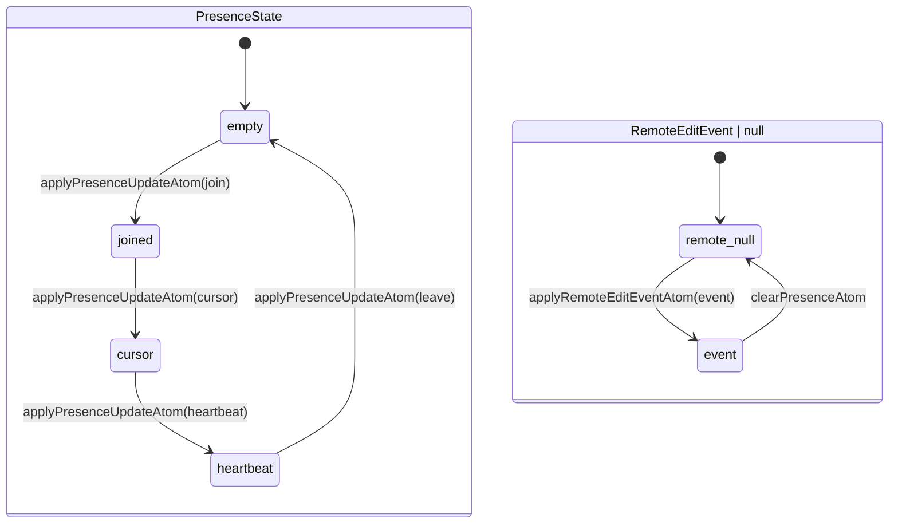

# collab-presence

Collaboration presence: remote cursors and edit awareness in `@einfach/spreadsheet-ui-core`.

---

## Goal

Provide bounded UI-core state for remote participants and cursors, plus the
latest remote-edit attribution event. Rendering, transport wiring, and any
diagnostics presentation remain host responsibilities.

---

## Scope

- Bounded participant list (cap N, recommended 32).
- Per-participant remote cursor: sheet, selection subset, last-seen timestamp.
- Edit attribution: link incoming `BackendMutationResult` revisions to a participant.
- Optional host publication of local `SelectionState` through the backend port.
- Optional host conflict hint when a local draft cell is also targeted by a remote participant.

**Out of scope**

- CRDT / OT internals — those live entirely in the backend.
- Voice, video, or any media channel.
- @-mentions and notifications.
- Full activity feed or audit log.
- Presence avatars or rich user profiles (host UI concern).

---

## State (UI core)

The mutable source atoms are module-private backing atoms. Public state is
exposed as `Atom<T>` read projections, so consumers can subscribe/read but
cannot call `store.setter` on either public state atom. Only the three command
atoms below may mutate the private backing state.

```ts
const presenceStateBackingAtom = atom<PresenceState>(DEFAULT_PRESENCE_STATE)
const lastRemoteEditEventBackingAtom = atom<RemoteEditEvent | null>(null)

export const presenceStateAtom: Atom<PresenceState> = atom((get) =>
  get(presenceStateBackingAtom),
)

export const lastRemoteEditEventAtom: Atom<RemoteEditEvent | null> = atom((get) =>
  get(lastRemoteEditEventBackingAtom),
)

export const remoteCursorsAtom = atom<RemoteCursor[]>((get) =>
  deriveRemoteCursors(get(presenceStateBackingAtom)),
)

export const applyPresenceUpdateAtom = atom(
  null,
  (get, set, update: PresenceUpdate): void => {
    set(
      presenceStateBackingAtom,
      applyPresenceUpdate(get(presenceStateBackingAtom), update),
    )
  },
)

export const applyRemoteEditEventAtom = atom(
  null,
  (_get, set, event: RemoteEditEvent): void => {
    set(lastRemoteEditEventBackingAtom, event)
  },
)

export const clearPresenceAtom = atom(null, (_get, set): void => {
  set(presenceStateBackingAtom, DEFAULT_PRESENCE_STATE)
  set(lastRemoteEditEventBackingAtom, null)
})
```

Consumer writes therefore go through commands only:

```ts
store.setter(applyPresenceUpdateAtom, update)
store.setter(applyRemoteEditEventAtom, event)
store.setter(clearPresenceAtom)
```

`PresenceState` stores only display-needed slices: the participant roster and
the latest cursor per participant. `lastRemoteEditEventAtom` is a separate,
bounded latest-event slot. Neither state stores workbook facts, formula cache,
or unbounded per-cell data.

## State flow

The nodes below are observable test checkpoints, not additional product status
values. All transitions are dispatched through command atoms.



`clearPresenceAtom` performs both resets in one command invocation: presence
returns to `empty` and the latest remote-edit event returns to `null`.

---

## Types

```ts
/** A remote collaborator visible to the local user. */
export interface Participant {
  id: string
  displayName: string
  /** CSS-compatible color token; host UI assigns, UI core stores verbatim. */
  colorHint?: string
  lastSeenAt: number // timestamp supplied by join/heartbeat; cursor updates may use Date.now()
}

export interface RemoteCursor {
  participantId: string
  sheetId: string
  selection: SelectionState
}

export type PresenceUpdate =
  | { kind: 'join'; participant: Participant }
  | { kind: 'leave'; participantId: string }
  | { kind: 'cursor'; participantId: string; sheetId: string; selection: SelectionState }
  | { kind: 'heartbeat'; participantId: string; at: number }

/** Attribution record carried alongside a remote revision. */
export interface RemoteEditEvent {
  participantId: string
  revision: number | string
  affectedRange?: CellRange
  transactionId?: string
}

export interface PresenceState {
  participants: Participant[]
  cursors: Record<string, RemoteCursor>
}

export const MAX_PARTICIPANTS = 32
```

---

## Backend port

Two optional methods are added to `SpreadsheetBackend`:

```ts
export interface SpreadsheetBackend {
  // ...existing methods...

  /**
   * Subscribe to presence updates from the backend transport.
   * Returns an unsubscribe function.
   * UI core does NOT open sockets; the host adapter wires transport and calls
   * applyPresenceUpdateAtom when updates arrive.
   */
  subscribePresence?(handler: (update: PresenceUpdate) => void): () => void

  /**
   * Publish the local user's current cursor to the backend transport.
   * Whether and when to call this optional port is a host concern.
   */
  publishLocalPresence?(request: PublishLocalPresenceRequest): Promise<void>
}
```

**Push vs poll**: prefer push (`subscribePresence`). If the backend only
supports polling, the host adapter implements the poll loop and still calls
`applyPresenceUpdateAtom` on each tick — the UI core remains unaware of the
transport mechanism.

**No sockets in UI core**: this package must not import WebSocket, EventSource,
or any transport primitive. All transport is owned by the host adapter.

---

## Integration points

**Selection** — a host that publishes local presence reads `selectionAtom`,
maps it to `PublishLocalPresenceRequest`, and calls the optional
`publishLocalPresence` port. Remote cursors are read from
`remoteCursorsAtom` and may be rendered in a separate overlay channel. Reading
remote cursors does not mutate `selectionAtom`.

**Workspace** — when a `RemoteEditEvent` arrives via
`applyRemoteEditEventAtom`, a host may also advance `viewportRevision` (via
`advanceWorkspaceViewportAtom`) so the projection pipeline re-requests visible
cells incorporating the new revision. Attribution is read separately from
`lastRemoteEditEventAtom`.

**Viewport** — scroll-to-remote-cursor is an optional host-level command. The
UI core exposes no built-in scroll-to-participant atom; the host reads
`remoteCursorsAtom` and issues a `scrollToCellAtom`-equivalent command at its
discretion.

**Diagnostics** — presence transport errors (subscription failure, publish
timeout) should be routed through the existing diagnostics channel, tagged with
the participant id as the source when available.

**Editing** — when `editingStateAtom` has an active draft cell, the host
adapter may derive a warning if any `RemoteCursor` in `remoteCursorsAtom`
targets the same `sheetId` + cell coordinate. The UI core surfaces this as a
read of `remoteCursorsAtom`; the warning presentation is host-side.

---

## Risks & open questions

- **Cap N participants**: 32 is the recommended cap. Overflow evicts the
  participant with the oldest `lastSeenAt`. Higher caps increase derived atom
  recalculation cost on every cursor move from any peer.
- **Color collision**: `colorHint` is assigned by the host or server; the UI
  core stores it verbatim and cannot guarantee uniqueness. Host should assign
  from a palette and resolve conflicts before publishing.
- **Churn on selection moves**: rapid cursor movement from N participants causes
  N `applyPresenceUpdateAtom` writes per move event. Consider debouncing
  publish on the local side and throttling incoming updates in the host adapter
  before writing to the atom.
- **Ordering of presence vs revision events**: a `RemoteEditEvent` may arrive
  before the corresponding `PresenceUpdate` registers the participant. The atom
  stores the latest event without requiring a known `participantId`; any later
  correlation is a host concern.
- **Transport disconnect fallback**: if `subscribePresence` drops, a host can
  dispatch a `leave` update per known participant or invoke
  `clearPresenceAtom`; it must not write `presenceStateAtom` directly.
- **Privacy of cursor publication**: `publishLocalPresence` sends the local
  user's selection to the server. Host adapters must obtain user consent before
  enabling this; the backend port is optional so hosts can omit it entirely.

---

## Test surface

`test/presence.test.ts`

- Public state atoms are readonly at type level and reject reflected runtime
  writes without changing the previously observed references.
- `applyPresenceUpdateAtom`: join, cursor, heartbeat, leave, and overflow
  eviction beyond `MAX_PARTICIPANTS`.
- `applyRemoteEditEventAtom`: stores the latest event without requiring a known
  participant.
- `clearPresenceAtom`: resets presence and the latest remote-edit event in one
  command invocation.
- `presenceStateAtom`: read back the roster and cursor map after command writes.
- `remoteCursorsAtom` atom: derived value re-evaluates after presence update.
- Overflow eviction: inserting 33 participants drops the one with oldest
  `lastSeenAt`.
- State flows: `empty → join → cursor → heartbeat → leave` and
  `remote null → event → clear`.

## State Decision Template

- Private source atoms: presence state and latest remote-edit backing atoms.
- Public readonly atoms: `presenceStateAtom`, `lastRemoteEditEventAtom`.
- Derived atoms: `remoteCursorsAtom`.
- Commands: `applyPresenceUpdateAtom`, `applyRemoteEditEventAtom`,
  `clearPresenceAtom`.
- Scale bound: capped at `MAX_PARTICIPANTS`; no per-cell atoms.
- Backend reads: `subscribePresence` / `publishLocalPresence` (both optional).
- Per-cell/per-row/per-col atom risk: none; cursor stored as a `SelectionState`,
  not expanded to cell grid.
- Tests: `test/presence.test.ts`.
