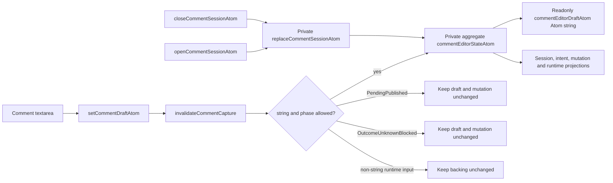
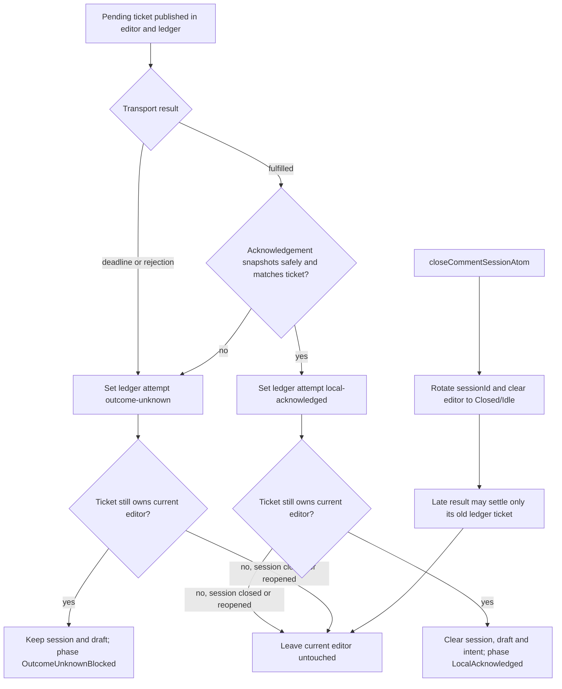

# comments-notes

Cell-anchored notes and threaded comments share projection metadata, but they do not share editor
authority. Note text and thread bodies remain backend-owned. UI Core owns only the active comment
editor, its bounded mutation evidence, and request/session identities.

## Current scope

Implemented in `src/comments/`:

- exported note/comment/thread and request types;
- `noteIndicator` and `commentThreadId` passthrough on projected `DisplayCell` values;
- one active comment session and draft;
- post/resolve mutation dispatch through an optional selected port;
- immutable request tickets, a 15-second Core deadline, strict local acknowledgement validation,
  and a bounded 32-attempt ledger;
- read-only draft, mutation, ledger, and runtime projections.

Not implemented by this module:

- storage or projection of note text and comment-thread bodies;
- note/comment delete commands;
- identity, ACL, notifications, mentions, or presence;
- canonical confirmation that a locally acknowledged mutation has been projected.

`LocalAcknowledged` means only that the selected transport returned evidence matching the Core
ticket. It must not be presented as canonical posted/resolved state.

## State authority and public API

The private `commentEditorStateAtom` is the aggregate authority:

```ts
interface CommentEditorAuthorityState {
  readonly sessionId: number
  readonly session: Readonly<CommentSessionState> | null
  readonly draft: string
  readonly intent: CommentIntent | null
  readonly mutation: CommentMutationState
}
```

The public editor API is:

| API                                    | Boundary             | Current behavior                                                                                   |
| -------------------------------------- | -------------------- | -------------------------------------------------------------------------------------------------- |
| `commentEditorDraftAtom: Atom<string>` | read-only projection | Reads `draft` from the private aggregate; direct store writes throw.                               |
| `setCommentDraftAtom`                  | command              | Invalidates launch capture first, applies the phase gate, then updates the private aggregate.      |
| `openCommentSessionAtom`               | command              | Snapshots the target, rotates `sessionId`, and clears draft/intent/mutation.                       |
| `closeCommentSessionAtom`              | command              | Rotates `sessionId`, clears the session and draft, and returns editor mutation to `Idle`.          |
| `commentSessionAtom`                   | compatibility facade | Reads the private aggregate and retains its current session-replacement writer.                    |
| `commentIntentAtom`                    | compatibility facade | Reads/writes intent and invalidates a launch capture before a write.                               |
| `runCommentMutationAtom`               | async command        | Reserves and publishes one immutable post/resolve ticket, then invokes one captured optional port. |
| `commentMutationStateAtom`             | read-only projection | Frozen editor-local phase/action/request/error.                                                    |
| `commentOperationAttemptLedgerAtom`    | read-only projection | Frozen bounded local attempt evidence.                                                             |
| `commentRuntimeStatusAtom`             | read-only projection | `Closed`, `OpenClean`, `OpenDirty`, or the non-idle mutation phase.                                |
| `commentMutationPendingAtom`           | derived read-only    | True when the ledger contains a pending attempt.                                                   |
| `commentMutationBlockedAtom`           | derived read-only    | True when the ledger contains an outcome-unknown attempt.                                          |
| `commentMutationSubmissionBlockedAtom` | derived read-only    | True during a launch capture/reservation or while pending/unknown evidence exists.                 |

The draft debug/API names remain:

```ts
commentEditorDraftAtom.debugLabel = 'spreadsheet.comments.draft'
setCommentDraftAtom.debugLabel = 'spreadsheet.comments.setDraft'
```

This boundary change is deliberately narrow: `commentEditorDraftAtom` is no longer a public
writer. Textarea code must use `setCommentDraftAtom`; session open/close reset the same private
aggregate through the session replacement command. No UI-local draft mirror is allowed.

## Draft write flow

The invalidation happens before validation and phase gating. That ordering is intentional: a
re-entrant draft command invalidates a caller-owned launch capture even if the proposed value is
later rejected.



Allowed draft edits reset an `ErrorOpen`/`LocalAcknowledged` editor mutation to `Idle`. Draft edits
cannot change a `PendingPublished` or `OutcomeUnknownBlocked` editor.

## Session and mutation states

```mermaid
stateDiagram-v2
  [*] --> Closed
  Closed --> OpenClean: open session
  OpenClean --> OpenDirty: set non-empty draft
  OpenDirty --> OpenClean: set empty draft
  OpenClean --> ErrorOpen: invalid resolve or unavailable port
  OpenDirty --> ErrorOpen: invalid post or unavailable port
  OpenDirty --> PendingPublished: reserve ticket and publish pending
  OpenClean --> PendingPublished: valid resolve
  PendingPublished --> LocalAcknowledged: exact ticket-bound acknowledgement
  PendingPublished --> OutcomeUnknownBlocked: timeout, reject, invalid or mismatched acknowledgement
  ErrorOpen --> OpenClean: allowed empty draft edit
  ErrorOpen --> OpenDirty: allowed non-empty draft edit
  Closed --> Closed: close rotates session identity
  OpenClean --> Closed: close and clear
  OpenDirty --> Closed: close and clear
  ErrorOpen --> Closed: close and clear
  PendingPublished --> Closed: close rotates authority; old ledger ticket survives
  OutcomeUnknownBlocked --> Closed: close clears editor; unknown ledger still blocks globally
  LocalAcknowledged --> Closed: close resets the local evidence phase
  LocalAcknowledged --> OpenClean: open a new session
```



`LocalAcknowledged` already has `session = null`, `draft = ''`, and `intent = null`; its distinct
runtime label preserves the local evidence phase until a later session replacement resets it.

### Close, acknowledgement, and error branches



Closing/reopening does not erase pending or outcome-unknown ledger evidence. This is why
`commentRuntimeStatusAtom` can be `Closed` while `commentMutationBlockedAtom` is still true. An old
ticket may settle its own ledger row, but the `sessionId` and exact target checks prevent it from
closing or overwriting a newer editor.

## Mutation contract

`runCommentMutationAtom` accepts:

```ts
interface RunCommentMutationInput {
  readonly action: 'post' | 'resolve'
  readonly source?: {
    readonly postComment?: (request: PostCommentRequest) => unknown | Promise<unknown>
    readonly resolveCommentThread?: (
      request: ResolveCommentThreadRequest,
    ) => unknown | Promise<unknown>
  }
}
```

Core reads `action`, `source`, and the selected function exactly once under a launch capture. A
re-entrant session/draft/intent change revokes that capture and produces zero transport calls.
After reservation, Core publishes `PendingPublished`, the pending ticket, and ledger evidence
before invoking the selected function.

An acknowledgement is accepted as local evidence only when:

- it is an object with the exact `sheetId` and safe-integer `requestId` from the ticket;
- `revision`, when present, is a finite number or string;
- `affectedRange`, when present, is the exact one-cell ticket target;
- acknowledgement snapshot getters do not re-enter and revoke Core authority.

Timeout, synchronous throw, rejected promise, malformed acknowledgement, mismatch, or capture loss
all become `outcome-unknown`. The attempt is retained and submission remains blocked.

The attempt ledger holds at most `COMMENT_MUTATION_LEDGER_MAX` (32) entries. Capacity pressure may
evict only old `local-acknowledged` evidence; `pending` and `outcome-unknown` entries are never
evicted.

## Current types

The active target uses a nested cell coordinate and an optional thread id:

```ts
interface CommentSessionState {
  sheetId: string
  cell: { row: number; col: number }
  threadId?: string
}

interface PostCommentRequest {
  kind: 'post-comment'
  sheetId: string
  cell: { row: number; col: number }
  threadId?: string
  body: string
  author?: string
  requestId?: number
  revision?: ProjectionRevision
}

interface ResolveCommentThreadRequest {
  kind: 'resolve-comment-thread'
  sheetId: string
  threadId: string
  requestId?: number
  revision?: ProjectionRevision
}
```

`SetNoteRequest` and `ClearNoteRequest` also use `cell: { row, col }`. They are exported contract
shapes; this module does not yet expose note mutation commands.

`DisplayCell.noteIndicator?: boolean` and `DisplayCell.commentThreadId?: string` remain sparse
visible-projection metadata. Thread bodies must not be materialized into the visible window or an
atom family keyed by cell.

## Test evidence

`test/comments-notes.test.ts` covers:

- command-owned normal draft updates and session reset;
- runtime rejection of direct `commentEditorDraftAtom` writes;
- launch-capture invalidation through a re-entrant `setCommentDraftAtom` call;
- no-op draft commands in `PendingPublished` and `OutcomeUnknownBlocked`;
- pending-before-transport publication, deadline/rejection/acknowledgement branches, late
  settlement isolation, per-store identity isolation, and bounded-ledger eviction.

`test/package-boundary.test.ts` adds compile-time writability assertions, runtime fail-closed direct
write evidence, a source scan for `Atom<string>`, and a guard against internal
`set(commentEditorDraftAtom, ...)` calls.

The package-boundary suite also guards `src/` from importing React, Solid, DOM runtime, workers, or
WASM glue.
