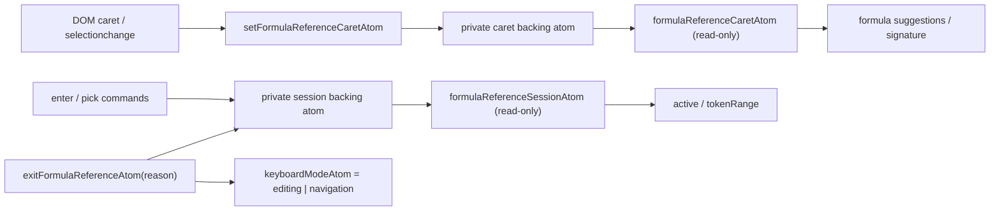

# Formula Reference Picking Mode

## Goal

When a user starts a formula (typing `=`, or an operator mid-draft), subsequent
pointer clicks and arrow keystrokes should insert or update a cell/range
reference in the draft instead of moving the primary selection. The mode exits
when the user commits, cancels, or types a character that terminates a reference
token (e.g. `)`, Enter, Escape).

## Scope

- Detect entry condition from caret position and draft content.
- Track the active picking session: anchor cell, insertion point (caret index),
  and the pending token's character range in the draft.
- Intercept pointer clicks and arrow keys; rewrite the draft with the resolved
  A1/A1:B2 token; do not advance the primary selection.
- Exit cleanly back to editing mode; leave primary selection unchanged.
- Mirror the draft update through formula-bar state.
- Support single-cell and rectangular range (drag) references in one session.

**Out of scope**

- Cross-sheet reference syntax (`Sheet2!A1`) — reserved, see open questions.
- Named range insertion.
- Absolute/relative toggling (F4) — noted as open question, not implemented.
- Multi-range union references (`A1,C3`).
- Keyboard-driven formula completion / autocomplete overlay.
- Any workbook-side formula parsing or validation.

## State (UI core)

### Private backing and public read-only state

```ts
const formulaReferenceSessionBackingAtom = atom<FormulaReferenceSession | null>(null)

// The single active picking session; null when mode is inactive. Consumers can
// observe it but cannot use it as a Store.setter target.
export const formulaReferenceSessionAtom: Atom<FormulaReferenceSession | null> = atom((get) =>
  get(formulaReferenceSessionBackingAtom),
)
formulaReferenceSessionAtom.debugLabel = 'spreadsheet.formulaReference.session'

const formulaReferenceCaretBackingAtom = atom<number>(-1)

// Caret index inside the current draft string; -1 means unknown / not tracked.
// This is also a public read-only projection.
export const formulaReferenceCaretAtom: Atom<number> = atom((get) =>
  get(formulaReferenceCaretBackingAtom),
)
formulaReferenceCaretAtom.debugLabel = 'spreadsheet.formulaReference.caret'
```

### Derived atoms

```ts
// True only while a session is live.
export const formulaReferenceActiveAtom = atom((get) => get(formulaReferenceSessionAtom) !== null)
formulaReferenceActiveAtom.debugLabel = 'spreadsheet.formulaReference.active'

// The pending token character range in the draft (start inclusive, end exclusive).
// Null when no token has been inserted yet this session.
export const formulaReferenceTokenRangeAtom = atom(
  (get) => get(formulaReferenceSessionAtom)?.tokenRange ?? null,
)
formulaReferenceTokenRangeAtom.debugLabel = 'spreadsheet.formulaReference.tokenRange'
```

### Command atoms

```ts
// Sync the host DOM caret through a command; writes the private caret backing.
export const setFormulaReferenceCaretAtom: WritableAtom<null, [number], void> = atom(
  null,
  (_get, set, caret: number) => set(formulaReferenceCaretBackingAtom, caret),
)
setFormulaReferenceCaretAtom.debugLabel = 'spreadsheet.formulaReference.setCaret'

// Enter picking mode. Captures the anchor cell and insertion caret.
export const enterFormulaReferenceAtom = atom(
  null,
  (get, set, input: EnterFormulaReferenceInput) => { ... },
)
enterFormulaReferenceAtom.debugLabel = 'spreadsheet.formulaReference.enter'

// Update the draft with the currently picked cell/range; overwrites tokenRange.
export const pickFormulaReferenceAtom = atom(
  null,
  (get, set, input: FormulaReferencePickInput) => { ... },
)
pickFormulaReferenceAtom.debugLabel = 'spreadsheet.formulaReference.pick'

// Exit picking mode through the private session backing and restore keyboard
// mode to editing while a draft is active, otherwise to navigation.
export const exitFormulaReferenceAtom = atom(
  null,
  (get, set, reason: FormulaReferenceExitReason) => { ... },
)
exitFormulaReferenceAtom.debugLabel = 'spreadsheet.formulaReference.exit'
```

Scale bound: one session object, one caret index. No per-cell atoms.



## Types

```ts
export interface FormulaReferenceSession {
  /** Cell being edited (anchor of the editing session). */
  anchorCell: CellCoord
  sheetId: string
  /** Caret position in the draft at the moment the session was entered. */
  insertionCaret: number
  /**
   * Character range [start, end) of the last inserted reference token.
   * Null until the first pick resolves.
   */
  tokenRange: FormulaReferenceTokenRange | null
  /** Whether the pointer is currently being dragged (range pick in progress). */
  dragging: boolean
}

export interface FormulaReferenceTokenRange {
  start: number
  end: number
}

export interface FormulaReferenceInsertionPoint {
  caretIndex: number
  draft: string
}

export interface EnterFormulaReferenceInput {
  anchorCell: CellCoord
  sheetId: string
  insertionCaret: number
  draft: string
}

export interface FormulaReferencePickInput {
  /** Single cell or rectangular range being picked. */
  pickAnchor: CellCoord
  pickFocus: CellCoord
  sheetId: string
  /** True while a pointer drag is still in progress. */
  dragging: boolean
}

export type FormulaReferenceExitReason =
  | 'commit'
  | 'cancel'
  | 'operator-typed'
  | 'separator-typed'
  | 'close-paren-typed'

export interface FormulaReferenceInsertIntent {
  type: 'formulaReference.insert'
  draft: string
  caretAfter: number
}
```

## Backend port

No new backend port methods are required. Reference token serialisation
(cell-coord to A1 notation) is a pure UI-core helper — it needs no workbook
facts. If the host adapter later needs to validate a cross-sheet reference it
should do so through the existing diagnostics pathway.

## Integration points

**Selection** — While `formulaReferenceActiveAtom` is true, pointer-down on a
grid cell must route through `pickFormulaReferenceAtom` rather than the normal
`selectCellAtom`/`selectRangeAtom` path. The primary `SelectionState` is
frozen for the duration of the session and restored on exit. Selection docs
should document this freeze contract.

**Keyboard** — In `formula-reference` mode, Arrow keys produce a
`formulaReference.arrowPick` intent (row/col delta) rather than
`selection.move`. Enter and Escape emit `formulaReference.exit` with reason
`'commit'` or `'cancel'` respectively. Any printable character that would end a
reference token (`)`, `,`, `+`, `-`, `*`, `/`, `^`, `&`, `%`, `<`, `>`, `=`,
space) exits picking mode first, then the character is passed to the editing
draft. The keyboard module already declares `KeyboardMode = 'formula-reference'`
and should gate intent routing on that value.

**Editing** — `pickFormulaReferenceAtom` calls `editingDraftAtom`'s write path
to surgically replace `[tokenRange.start, tokenRange.end)` in the current draft
with the freshly-serialised A1 token, updating `tokenRange.end` to
`start + token.length`. The editing session status stays `'drafting'`
throughout; only the draft string changes.

**Formula-bar** — The formula-bar draft mirrors `editingSessionAtom.draft`.
Its DOM selection events dispatch `setFormulaReferenceCaretAtom`; the host must
not write `formulaReferenceCaretAtom` directly. Draft updates still flow through
the existing editing command path. The formula-bar should visually highlight
`[tokenRange.start, tokenRange.end)`, but that is a rendering concern for the
host adapter; the token range is available from
`formulaReferenceTokenRangeAtom`.

**Pointer** — Pointer-down enters drag mode (`dragging: true`). Pointer-move
updates `pickFocus` while keeping `pickAnchor` fixed, emitting intermediate pick
events. Pointer-up finalises the token and sets `dragging: false`. A plain click
(no drag) sets `pickAnchor === pickFocus`, producing a single-cell `A1` token.
A drag produces a `A1:B2` token. The pointer module must check
`formulaReferenceActiveAtom` before deciding whether a click starts a new
selection session.

## Mode transition — trigger predicate

Entry from `editing` to `formula-reference` fires when **all** of:

1. `editingSessionAtom.status === 'drafting'`
2. The character at `caret - 1` (in the draft) is one of: `=`, `+`, `-`, `*`,
   `/`, `^`, `&`, `(`, `,`, `<`, `>`, `%`
3. The character at `caret` is either end-of-string or a closing character (`)`)

Condition 2 is the minimal trigger predicate. A host adapter dispatches the DOM
caret index to `setFormulaReferenceCaretAtom` on every `selectionchange` event;
the command writes the private backing atom and the public
`formulaReferenceCaretAtom` projection updates. The Solid host adapter's
`syncFormulaReferenceCaret` then evaluates the UI-core pure predicate and
dispatches `enterFormulaReferenceAtom` when it matches.

## Risks & open questions

- **Cross-sheet references** — `Sheet2!A1` syntax requires knowing the target
  sheet name at serialisation time. The picking session currently captures a
  single `sheetId`. Multi-sheet picking (clicking a sheet tab mid-session) needs
  a defined hand-off protocol with the sheet-tabs module.

- **F4 abs/rel toggling** — Pressing F4 while in formula-reference mode should
  cycle the token between `A1`, `$A$1`, `$A1`, `A$1`. This requires the token
  range and an abs/rel bitmask field on `FormulaReferenceSession`. Not modelled
  yet; reserve the field.

- **Nested function argument context** — When the caret is inside a nested
  function call (e.g. `=SUM(IF(`, `)`) the trigger predicate may fire
  incorrectly on `)` or `,`. A lightweight paren-depth counter on entry would
  disambiguate but adds parsing cost.

- **Exit on operator / separator typed** — Determining which characters exit the
  mode requires agreeing on a canonical set. The predicate above lists a working
  set; host adapters must not extend it unilaterally.

- **Caret sync latency** — DOM `selectionchange` fires asynchronously in some
  browsers. If the user types quickly the caret atom may lag one keystroke.
  Debounce strategy (or eager caret update on `keydown`) must be decided by the
  host adapter contract.

- **Formula-bar vs cell input source** — The user may start editing in the
  formula-bar rather than the cell. The trigger predicate must apply equally to
  both; the `insertionCaret` must reflect the formula-bar DOM caret when
  `EditingInputSource === 'formula-bar'`.

## Test surface — `test/formula-reference-mode.test.ts`

```
enterFormulaReferenceAtom
  - sets session with correct anchorCell and insertionCaret
  - sets formulaReferenceActiveAtom to true
  - sets keyboardModeAtom to formula-reference
  - does not alter editingSessionAtom.status

setFormulaReferenceCaretAtom
  - updates the public read-only caret state through its command

pickFormulaReferenceAtom (single cell)
  - inserts A1 token at insertion caret when no prior tokenRange
  - replaces prior tokenRange with new token
  - updates tokenRange.end after replacement

pickFormulaReferenceAtom (range / drag)
  - serialises anchor != focus as A1:B2 token
  - sets dragging: true while drag is in progress
  - sets dragging: false on pointer-up pick

exitFormulaReferenceAtom
  - clears session (null)
  - sets formulaReferenceActiveAtom to false
  - restores editing keyboard mode while the draft remains active
  - leaves editingSessionAtom.draft unchanged (token already spliced)

trigger predicate helper
  - returns true after '=' at caret
  - returns true after ',' at caret
  - returns false when caret follows an alphanumeric character
  - returns false when editingSessionAtom.status !== 'drafting'

draft splice helper
  - inserts token at caret when tokenRange is null
  - replaces [start, end) with new token, returns updated end index
```
