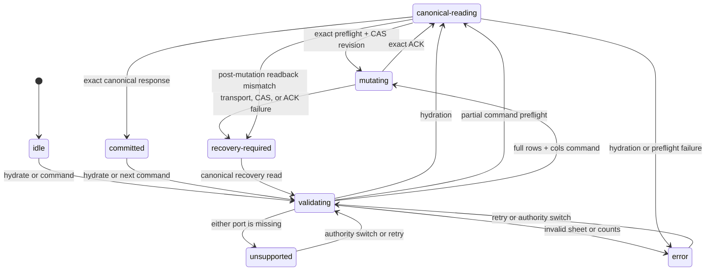

# Frozen panes: canonical authority contract

This document records the implemented freeze-panes state contract. The workbook backend is the
canonical authority; `@einfach/spreadsheet-ui-core` owns the framework-neutral controller and a
read-only projection, while `excel/solid-excel` renders and dispatches commands through that controller.

## Authority and state ownership

- `viewportFreezeBackingAtom` is private. It is updated only after an exact canonical backend read.
- `viewportFreezeAtom` is the public read-only projection. There is no public setter atom and product
  code must not seed or optimistically mutate it.
- `viewportFreezeProjectionAuthorityAtom` is a read-only identity/readiness gate containing the
  backend object, sheet id, request id, revision, and `ready` flag for the projection.
- `isViewportFreezeProjectionReady(authority, backend, sheetId)` is the required consumer gate. A
  projection is usable only when both ports exist and the backend identity and sheet id match.
- `viewportFreezeLifecycleAtom` exposes controller progress for diagnostics and UI feedback.
- `readViewportFreezeCanonicalAtom` hydrates from the current backend and sheet.
- `runViewportFreezeMutationAtom` performs validated mutation, acknowledgement matching, and
  canonical readback. It is the only product mutation path.

The backing value may retain the last confirmed value during a source or sheet transition. This is a
cache detail, not authority: renderers and menus must ignore it until the readiness gate matches the
current backend object and sheet id. Therefore backend A cannot leak its freeze projection into
backend B, even when both use the same sheet id and Einfach store.

## Capability contract

Freeze panes are supported only when the backend provides both methods:

```ts
interface ViewportFreezeControllerPort {
  readFreezeConfig?: (request: ReadFreezeConfigRequest) => Promise<ReadFreezeConfigResult>
  setFreezeConfig?: (request: SetFreezeConfigRequest) => Promise<BackendMutationResult>
}
```

Providing only one method is unsupported. There is no UI-only fallback:

- the menu bar disables freeze commands;
- the context menu hides freeze commands;
- grid, SVG, and Canvas divider rendering remains gated off;
- command dispatch performs no backend call and cannot change the projection.

This prevents an editable-looking local state from diverging from workbook state.

## Lifecycle

The public lifecycle statuses are `idle`, `validating`, `mutating`, `canonical-reading`, `committed`,
`error`, `recovery-required`, and `unsupported`.



Every operation has a controller-issued request id and captures the exact backend object and sheet
id. A response is accepted only when its request id and sheet id match the active ticket and its
revision is valid. A newer authoritative hydration cancels an older ticket; the older operation then
returns `stale` and cannot commit to the shared projection.

### Full mutation

A command that supplies both `rows` and `cols` follows:

```text
validating -> mutating -> canonical-reading -> committed
```

The controller sends the full pair, requires an exact mutation acknowledgement, then reads the same
revision back. The projection changes only after that readback is exact.

### Partial mutation and compare-and-set

A command that supplies only one axis must preserve the sibling axis from canonical workbook state:

```text
validating -> canonical-reading (preflight) -> mutating (CAS)
           -> canonical-reading (readback) -> committed
```

The preflight returns `{ freeze, revision }`. The controller combines the requested axis with the
canonical sibling and sends the preflight revision as the mutation precondition. If another writer
changes the workbook between preflight and mutation, the backend rejects the stale revision. The
controller enters `recovery-required`; it never overwrites the newer state and never publishes the
unconfirmed request.

The same rule applies after ACK: if state advances before readback, a read result whose revision no
longer equals the acknowledged revision cannot be committed and the lifecycle becomes
`recovery-required`.

## Static backend semantics

The static backend keeps freeze configuration per sheet. `readFreezeConfig` always returns the
backend's current revision; it does not echo a caller-provided revision. `setFreezeConfig` validates
non-negative safe integers and, when a revision precondition is present, performs compare-and-set
against the current backend revision. A rejected CAS neither writes freeze state nor bumps revision.

## Solid consumer rules

- `SpreadsheetGrid` hydrates canonical freeze state for the mounted backend and sheet and gates both
  frozen geometry and boundary attributes by authority readiness.
- `SpreadsheetGridOverlay` and `SpreadsheetGridOverlaySvg` subscribe to both the projection and the
  authority gate. Canvas rendering also checks the current provider backend callback before drawing.
- `SpreadsheetMenuBar` and `SpreadsheetContextMenu` dispatch only through
  `runViewportFreezeMutationAtom`.
- Context-menu `Unfreeze` visibility is derived only from a ready projection for the exact backend
  and target sheet, never from a stale cached value.

## Verification map

- [Controller implementation](../src/viewport/window.ts)
- [Controller lifecycle and race tests](../test/frozen-panes.test.ts)
- [Static backend implementation](../../solid-excel/src-vnext/adapter/static-backend.ts)
- [Static authority race tests](../../solid-excel/test/vnext-freeze-authority.test.ts)
- [Grid authority tests](../../solid-excel/test/vnext-grid.test.tsx)
- [Canvas gate tests](../../solid-excel/test/vnext-grid-overlay.test.tsx)
- [SVG gate tests](../../solid-excel/test/vnext-grid-overlay-svg.test.tsx)
- [Menu bar capability tests](../../solid-excel/test/vnext-menu-bar.test.tsx)
- [Context menu capability tests](../../solid-excel/test/vnext-context-menu.test.tsx)

Focused verification commands:

```sh
npx jest excel/spreadsheet-ui-core/test/frozen-panes.test.ts --runInBand --coverage=false
npx jest excel/solid-excel/test/vnext-freeze-authority.test.ts excel/solid-excel/test/vnext-grid.test.tsx excel/solid-excel/test/vnext-grid-overlay.test.tsx excel/solid-excel/test/vnext-grid-overlay-svg.test.tsx excel/solid-excel/test/vnext-menu-bar.test.tsx excel/solid-excel/test/vnext-context-menu.test.tsx --runInBand --coverage=false
npm run build -w @einfach/spreadsheet-ui-core
npm exec -w @einfach/solid-excel -- vite build
```
