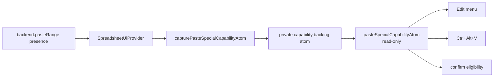
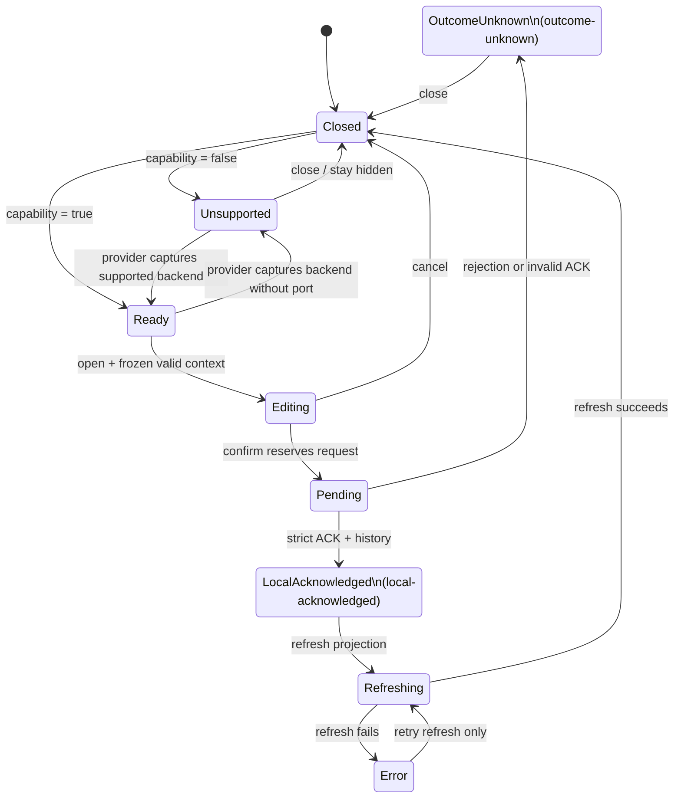

# Wave 7 — Data operations + Navigation

Planning doc for the five Wave 7 features in `@einfach/spreadsheet-ui-core`:
Text to Columns, Remove Duplicates, Paste Special, Go To / Go To Special, and
the full Data Validation dialog. Wave 7 follows the Wave 1-4 conventions: every
new `SpreadsheetBackend` method is optional, every atom carries a
`spreadsheet.<feature>.<name>` `debugLabel`, every cache has an explicit cap,
and no per-cell or per-row atoms are introduced.

---

## Purpose

Close the gap between the existing primitive operation set (`setCellInput`,
`clearRange`, `importCellChunks`, `setValidationRule`) and the
dialog-driven workflows users expect from a spreadsheet. Three of the five
sub-features (7.1, 7.2, 7.4) are pure orchestrations over already-shipped
backend ports; two (7.3, 7.5) require additive port surface.

## Sub-feature inventory

| # | Feature | Dialog | Existing backend? | New port? |
|---|---|---|---|---|
| 7.1 | Text to Columns | `SpreadsheetTextToColumnsDialog.tsx` | `importCellChunks` | no |
| 7.2 | Remove Duplicates | `SpreadsheetRemoveDuplicatesDialog.tsx` | `readRangeProjection` | `removeDuplicates?` |
| 7.3 | Paste Special | `SpreadsheetPasteSpecialDialog.tsx` | `importCells` / `setFormatRange` | `pasteRange?` |
| 7.4 | Go To / Go To Special | `SpreadsheetGoToDialog.tsx` | `readRangeProjection`, `listNamedRanges` | no |
| 7.5 | Data Validation full | `SpreadsheetDataValidationDialog.tsx` (expand) | `setValidationRule` | no (type widening only) |

---

## 7.1 Text to Columns

A 3-step wizard that splits a single-column selection into multiple columns by
delimiter or fixed-width slice positions. The dialog reads the source column's
display values, computes per-row split tokens, and emits one
`importCellChunks` plan starting at the selection's column so undo collapses
into a single history entry.

### Wizard state machine (Step 1 → 2 → 3)

The wizard is a single discriminated-union atom; backward steps preserve prior
choices.

- **Step 1.** Choose `mode: 'delimited' | 'fixed'`.
- **Step 2 (delimited).** Set `delimiters: Set<'tab'|'semicolon'|'comma'|'space'|'other'>`,
  `otherChar`, `treatConsecutiveAsOne: boolean`, `textQualifier: '"' | "'" | 'none'`.
- **Step 2 (fixed).** Set `breakpoints: readonly number[]` in characters from
  the start of the source string.
- **Step 3.** Per-output-column `format: 'general' | 'text' | 'date' | 'skip'`.
  Columns marked `skip` are dropped from the import plan.

### Atoms

New module: `src/text-to-columns/`.

```ts
textToColumnsWizardAtom         // atom<TextToColumnsWizardState>
textToColumnsPreviewAtom        // derived; first 100 source rows split tokens
openTextToColumnsAtom           // command
closeTextToColumnsAtom          // command
advanceTextToColumnsStepAtom    // command, direction: 'next' | 'back'
commitTextToColumnsAtom         // command, emits importCellChunks
```

All `debugLabel` follow `spreadsheet.textToColumns.<name>`. Preview cap of 100
rows holds even when the source range is 100k tall; full split is deferred
until commit.

### Backend port (no new methods)

Reuses `importCellChunks`. The original source column is overwritten as part
of the same transaction so undo restores the original full text in one step.

### Test plan

`test/text-to-columns.test.ts`: Step 1 default `'delimited'` preserved across
advance; `comma + space` with `treatConsecutiveAsOne` collapses runs; text
qualifier `"` strips outer quotes and unescapes doubled quotes; fixed-width
breakpoints past row length emit empty strings; `format: 'skip'` removes a
column from the emit plan; commit no-op when selection is not a single column;
preview cap holds at 100 rows on a 100k source.

### Risks

- **Date parsing locale.** UI core stays locale-free; `format: 'date'` takes
  an optional `parseDate(input): string | null` from the host adapter and
  degrades to `'general'` when absent.
- **Source column overwrite.** One `importCellChunks` call, not many
  `setCellInput` calls — otherwise undo replays N steps.
- **Multi-column selection.** Reject at `openTextToColumnsAtom` rather than
  silently picking column 1.

---

## 7.2 Remove Duplicates

Compares rows by selected columns within a contiguous range and rewrites the
range with duplicates removed, preserving first-occurrence ordering.

### Backend method needed

Backend handles deduplication so UI never reads the full range. New optional
port:

```ts
export interface RemoveDuplicatesRequest extends SheetRef {
  kind: 'remove-duplicates'
  range: CellRange
  keyColumns: readonly number[]   // absolute column indices, not range-relative
  hasHeaders: boolean             // when true, range.rowStart is the header row
  requestId?: ProjectionRequestId
  revision?: ProjectionRevision
}

export interface RemoveDuplicatesResult extends BackendMutationResult {
  kind: 'remove-duplicates'
  duplicatesRemoved: number
  uniqueRemaining: number
}

removeDuplicates?(request: RemoveDuplicatesRequest): Promise<RemoveDuplicatesResult>
```

### UI

New module: `src/remove-duplicates/`. Single-step dialog: range readout, "My
data has headers" checkbox, scrollable list of columns with per-column
checkboxes (default all checked), OK / Cancel. Post-commit summary toast:
"N duplicates removed, M unique remaining."

### Atoms

```ts
removeDuplicatesDialogAtom      // atom<RemoveDuplicatesDialogState>
openRemoveDuplicatesAtom        // command
closeRemoveDuplicatesAtom       // command
toggleRemoveDuplicatesColumnAtom // command, colIndex: number
setRemoveDuplicatesHeadersAtom  // command, hasHeaders: boolean
commitRemoveDuplicatesAtom      // command
```

Summary lives inside `removeDuplicatesDialogAtom.summary` so the host adapter
can render it inline; cleared on close.

### Test plan

`test/remove-duplicates.test.ts`: dialog opens with all columns checked;
toggling flips column presence in `keyColumns`; commit is a no-op when
`keyColumns` is empty or `removeDuplicates` is absent; summary populates from
`duplicatesRemoved`; `hasHeaders: true` forwarded unchanged.

### Risks

- **Equality semantics.** Displayed value vs. raw input — backend-defined,
  host-adapter README documents the choice (Excel uses displayed value).
- **Formula refs to removed rows.** Backend-defined, mirroring
  `clear-cells-endpoint.md`.
- **Range-attached rules.** Conditional-format and validation rules attached
  by range survive on remaining rows; rules attached to a deleted row are lost.

---

## 7.3 Paste Special

Current parity status: **Partial**. The static backend supports the optional
`pasteRange` port. Worker and WorkerTS omit it, and the Context Menu entry is
still absent. The supported entrypoints are the capability-gated Edit menu and
Ctrl+Alt+V shortcut. This status does not change the overall parity counts.

### Implemented contract

`openPasteSpecialAtom` freezes the current target selection, clipboard source,
payload, and default options. Later selection or clipboard changes cannot
redirect a request already represented by that session.

```ts
export type PasteSpecialKind =
  | 'values'
  | 'formats'
  | 'values-and-formats'
  | 'all'
  | 'transpose'
  | 'column-widths'
  | 'comments'

export interface PasteSpecialOptions {
  kind: PasteSpecialKind
  op: 'none' | 'add' | 'subtract' | 'multiply' | 'divide'
  transpose: boolean
  skipBlanks: boolean
}

export interface PasteRangeRequest {
  kind: 'paste-range'
  sheetId: string
  target: CellRange
  source: {
    sheetId: string
    range: CellRange
    payload?: ClipboardPayloadDescriptor | null
  }
  pasteKind: PasteSpecialKind
  op: PasteSpecialOptions['op']
  transpose: boolean
  skipBlanks: boolean
  requestId?: ProjectionRequestId
  revision?: ProjectionRevision
}

pasteRange?(request: PasteRangeRequest): Promise<PasteRangeResult>
```

There is deliberately no missing-port fallback. When `pasteRange` is absent,
the capability is false, entrypoints stay unavailable, a forced open is
blocked with an explanation, and no mutation transport is sent.

### Capability ownership and entrypoints

`SpreadsheetUiProvider` captures `backend.pasteRange` presence at provider
creation. `capturePasteSpecialCapabilityAtom` is the only writer of a private
backing atom; public consumers read the canonical, read-only
`pasteSpecialCapabilityAtom`. Solid's deprecated `pasteSpecialSupportedAtom`
is the same atom object and exists only for compatibility.



The dialog is mounted in Smoke, Worker, and WorkerTS demos. Mounting the
dialog is inert while closed and never captures capability itself. On Worker
and WorkerTS, the missing port therefore produces zero dialog-open dispatch
and zero Paste Special transport through the supported entrypoints.

| Surface / backend        | Static                     | Worker      | WorkerTS    |
| ------------------------ | -------------------------- | ----------- | ----------- |
| Edit menu                | available                  | hidden      | hidden      |
| Ctrl+Alt+V               | opens with valid clipboard | inert       | inert       |
| Dialog component mounted | yes                        | yes         | yes         |
| `pasteRange` transport   | supported                  | port absent | port absent |
| Context Menu entry       | absent                     | absent      | absent      |

### Core state and commands

```ts
pasteSpecialCapabilityAtom // read-only capability projection
pasteSpecialOpenAtom // Core-owned visibility
pasteSpecialOptionsAtom // Core-owned form draft
pasteSpecialSessionAtom // frozen session snapshot
pasteSpecialLifecycleAtom // mutation lifecycle
pasteSpecialErrorAtom // user-visible diagnostic
pasteSpecialCanEditAtom // derived UI permission
pasteSpecialCanConfirmAtom // derived UI permission
pasteSpecialCanCloseAtom // derived UI permission

capturePasteSpecialCapabilityAtom // only capability writer
openPasteSpecialAtom // freeze and open
patchPasteSpecialOptionsAtom // patch draft + session
confirmPasteSpecialAtom // reserve/send/ACK/history/refresh
closePasteSpecialAtom // invalidate and reset
```

`Ready` and `Unsupported` are conceptual capability/entry states. The stored
Core lifecycle labels are shown in parentheses where names differ.



Pending work cannot be closed or replaced. A transport rejection or invalid
acknowledgement becomes `outcome-unknown`; Core does not resend because the
remote mutation may already have applied. After a strict acknowledgement,
history is appended once. If refresh fails, retry performs only the refresh
and never duplicates the paste.

### Tests

`test/paste-special.test.ts` covers read-only capability capture, frozen
context, unsupported kinds, request identity, strict acknowledgement,
outcome-unknown behavior, refresh-only retry, close blocking, and history.
`excel/solid-excel/test/vnext-paste-special.test.tsx` covers alias identity,
provider-time supported/unsupported capture without dialog ownership,
worker-shaped missing-port inert behavior, and the thin dialog projection.

### Remaining gaps and risks

- **Context Menu parity.** There is no Paste Special item yet; #11 remains
  Partial until that entrypoint and its tests exist.
- **Worker parity.** Worker and WorkerTS expose no `pasteRange` port. They are
  correctly unsupported, not silently routed through another mutation API.
- **Arithmetic with non-numeric targets.** `add` / `subtract` / `multiply` /
  `divide` uses the documented static-backend behavior; any future worker
  implementation must match it.
- **Unsupported kinds.** `column-widths` and `comments` remain visible but
  disabled with an explanation and cannot reach transport.

---

## 7.4 Go To / Go To Special

Two views inside one dialog, toggled by a tab control. Both feed the existing
`setSelectionAtom` plus `scrollToCellAtom`; neither needs a new backend port.

### Reference parsing

The Go To text input accepts A1 (`B12`), A1:B5 range (`B12:D18`),
sheet-qualified (`Sheet2!B12`), and named range (`MyRange`). Constants resolve
but are rejected for navigation with a typed error. Parser lives in
`src/go-to/reference-parser.ts` as a pure function returning
`{ sheetId, range } | { error: ReferenceParseError }`. Reuses
`columnLabelToIndex` from `src/clipboard/index.ts`; named-range lookup goes
through `nameRegistryCacheAtom`.

### Selection-by-criterion algorithms

Go To Special selects cells in the current sheet matching one criterion. All
algorithms run against `readRangeProjection` over the sheet's used range;
output is a `MultiRangeSelection` written through `setSelectionAtom`.

| Criterion | Implementation |
|---|---|
| `comments` | `DisplayCell.commentThreadId != null` |
| `constants.{numbers,text,logicals,errors}` | `valueKind` match and `formula == null` |
| `formulas.{numbers,text,logicals,errors}` | `formula != null`, filtered by `valueKind` |
| `blanks` | `valueKind === 'blank' \|\| displayValue === ''` |
| `current-region` | Expand outward from active cell to blank-row / blank-col border |
| `row-differences` / `column-differences` | Compare row's / column's first cell against the rest |
| `last-cell` | Bottom-right of used range |
| `visible-cells-only` | Skip rows/cols hidden by filter or `hiddenRowIndices` |
| `conditional-formats` / `data-validation` | `DisplayCell.conditionalFormat` / `validation` echoes |
| `current-array` / `objects` / `precedents` / `dependents` | inert in v1 (see Risks) |

### UI

New module: `src/go-to/`. Tab toggle "Go To" | "Go To Special". Go To pane:
text input, list of `nameRegistryCacheAtom` names, recent-jumps list
(`goToRecentAtom`, cap 10). Go To Special pane: single radio list of criteria
with numeric / text / logical / error sub-checkboxes under `constants` and
`formulas`. Enter or "Go" commits.

### Atoms

```ts
goToDialogAtom                  // atom<GoToDialogState>, includes active tab
goToRecentAtom                  // atom<readonly GoToRecentEntry[]>, cap 10
openGoToAtom                    // command
closeGoToAtom                   // command
navigateToReferenceAtom         // command; parses, switches sheet, sets selection, scrolls
selectByCriterionAtom           // command; scans used range, sets multi-range selection
```

### Test plan

`test/go-to.test.ts`: reference parser accepts `A1`, `A1:B5`, `Sheet2!A1`,
registered named range, rejects invalid syntax with a typed error;
`goToRecentAtom` caps at 10, deduplicates same-target jumps;
`selectByCriterionAtom('blanks')` selects only blank cells in used range;
`selectByCriterionAtom('constants.numbers')` excludes formula-resulting
numbers; `selectByCriterionAtom('visible-cells-only')` excludes filter-hidden
rows via the backend hidden-row state; cross-sheet navigation sequences sheet
switch →
bounds → selection → scroll.

### Risks (precedents/dependents need engine integration)

- **Precedents / dependents** require a formula dependency graph. Without it
  these criteria are disabled in the radio list. The matching `traceDependencies?`
  port is **not** added in Wave 7 — punted to a future formula-graph wave.
- **Used-range size.** Scanning pulls a potentially large projection. Page
  the scan via `RangeProjectionRequest` chunks; cap at 50 000 matched coords
  and surface `truncated` when hit.
- **Sheet-switch race.** Selection write must wait for the sheet switch and
  bounds resolution before scrolling.

---

## 7.5 Data Validation complete

The current dialog (`excel/solid-excel/src-vnext/data-validation/`) is a shell over
the four `ValidationRule` kinds (`list`, `range`, `regex`, `formula`). Wave 7
widens the rule shape to the full Excel-style schema and grows the dialog to
three tabs.

### Atom shape extensions (validation type + criteria + messages)

The existing exports — `validationRuleEditorAtom`,
`openValidationRuleEditorAtom`, `closeValidationRuleEditorAtom`,
`setValidationDraftAtom`, `evaluateValidationLocal`, `validationStatusAtom` —
stay. `ValidationRule` widens additively; existing
`'list' | 'range' | 'regex' | 'formula'` rules remain valid.

```ts
export type ValidationCriterion =
  | 'between' | 'not-between' | 'equal' | 'not-equal'
  | 'greater' | 'less' | 'greater-equal' | 'less-equal'

// New rule kinds. min/max bound the criterion; date/time use ISO strings.
type Bounded<K extends string, V> = { kind: K; criterion: ValidationCriterion; min?: V; max?: V }
export type ValidationWholeNumberRule = Bounded<'whole-number', number>
export type ValidationDecimalRule     = Bounded<'decimal',      number>
export type ValidationDateRule        = Bounded<'date',         string>
export type ValidationTimeRule        = Bounded<'time',         string>
export type ValidationTextLengthRule  = Bounded<'text-length',  number>
export interface ValidationCustomFormulaRule { kind: 'custom-formula'; formula: string }
```

`ValidationListRule` gains optional `sourceRef` for `=NamedRange` /
`=Sheet!A1:A10`; backend resolves at eval time, `values` is the last seen
snapshot. Editor state and `SetValidationRuleRequest` add `ignoreBlank?: boolean`,
`inputMessage?: { show; title?; body? }`, and
`errorAlert?: { show; style: 'stop' | 'warning' | 'information'; title?; body? }`.

### Range references via named ranges

`sourceRef.startsWith('=')` triggers a name-or-range lookup against
`nameRegistryCacheAtom`. Range-kind names resolve to a lazily-pulled cell list;
constant-kind names reduce to a single-value list. Reference syntax is shared
with 7.4: parser lives in `src/go-to/reference-parser.ts`, re-imported by
`src/data-validation/`.

### UI 3-tab dialog

- **Settings.** Allow dropdown (any / whole-number / decimal / list / date /
  time / text-length / custom-formula), criterion dropdown (shown when
  numeric / date / time / text-length), value inputs, Ignore blank checkbox,
  range readout.
- **Input Message.** Show-when-selected checkbox, title, body textarea.
- **Error Alert.** Show-on-invalid checkbox, style dropdown, title, body.

Footer: Clear All / OK / Cancel.

### Engine integration (validation runs in projection layer or backend?)

`evaluateValidationLocal` is extended to cover the new `whole-number`,
`decimal`, `date`, `time`, `text-length` kinds — all pure, no backend round
trip. `custom-formula` continues to require a backend eval pass: UI returns
`null` and waits for `DisplayCell.validation` from the projection. This keeps
the projection layer as the single source of truth for formula-driven
outcomes.

### Test plan

`test/data-validation.test.ts` gains: `whole-number` `between` 1-10 accepts
`5`, rejects `0`, `11`, `5.5`; `decimal` `greater-equal` `0` rejects
negatives; `text-length` rejects strings outside bounds, counting code units;
`list` with `sourceRef: '=Colors'` evaluates against the resolved named
range and falls back to cached `values` when reference is missing;
`ignoreBlank: true` returns `null` outcome for empty input; `inputMessage`
and `errorAlert.style` round-trip through `SetValidationRuleRequest`; tab
switching preserves draft state across tabs.

### Risks

- **Date / time locale.** Atom layer stays ISO-only; dialog converts at edge.
- **List source size.** Cap cached `values` at 1024 entries; backend
  re-fetches on demand.
- **Custom formula support.** Without a backend formula engine the rule is
  accepted but never evaluates; host adapter must flag capability so the
  dialog can grey out the option.
- **Existing-rule discovery.** Projection echoes `DisplayCell.validation`
  (outcome), not the rule itself. The dialog opens with a blank draft plus a
  "Replace existing rule?" warning when the active cell carries validation.
  An optional `getValidationRule?(coord)` port would close this gap; not
  added in Wave 7.

---

## File impact estimate

| Area | New | Modified |
|---|---:|---:|
| `src/text-to-columns/` (new) | 3 (index, types, README) | — |
| `src/remove-duplicates/` (new) | 3 | — |
| `src/paste-special/` (new) | 3 | — |
| `src/go-to/` (new) | 4 (incl. `reference-parser.ts`) | — |
| `src/data-validation/` | — | `index.ts`, `types.ts` |
| `src/backend/types.ts` | — | +2 request/result interfaces, +2 ports |
| `excel/solid-excel/src-vnext/text-to-columns/` (new) | 1 dialog | — |
| `excel/solid-excel/src-vnext/remove-duplicates/` (new) | 1 dialog | — |
| `excel/solid-excel/src-vnext/paste-special/` (new) | 1 dialog | — |
| `excel/solid-excel/src-vnext/go-to/` (new) | 1 dialog | — |
| `excel/solid-excel/src-vnext/data-validation/` | — | grow dialog |

Index exports update `src/index.ts` once per new module.

## Test impact

Five new test files, one expanded:

- `test/text-to-columns.test.ts`
- `test/remove-duplicates.test.ts`
- `test/paste-special.test.ts`
- `test/go-to.test.ts`
- `test/data-validation.test.ts` — expanded for the 7.5 widening

`package-boundary.test.ts` updated with the four new module exports.

## Risks and unknowns

- **Precedents / dependents (7.4)** listed but inert in v1 — need a
  formula-graph wave before they light up.
- **`removeDuplicates` semantics** (displayed value vs. raw input, blank
  equality) need an explicit host-adapter contract.
- **`pasteRange` rollout.** Backends without the port lose channels other
  than `values` / `all`. Document capability matrix in
  `src/backend/README.md`.
- **Validation `custom-formula` capability flag.** Capability-flagging
  pattern is not yet uniform across the doc set — open question.
- **Single-undo composition.** Each Wave 7 commit must produce one history
  entry. Multi-call sequences (e.g. Text to Columns overwrite + append)
  must route through a single backend transaction; align with `history.md`.

## Out of scope (Advanced Filter, Subtotal, Group/Outline — Excel-only)

- **Advanced Filter.** Criteria-range semantics across sheets; no UI primitive
  in this stack.
- **Subtotal.** Requires aggregate-row insertion plus outline rows; depends on
  a group / outline layer that does not exist.
- **Group / Outline.** Row/column grouping with collapse/expand. Adds a third
  hiding mechanism on top of `hiddenRowIndices` and filter-hidden; Wave 2
  defers explicitly.
- **Consolidate.** Aggregates multi-sheet ranges; punted with Advanced Filter.
- **Scenarios.** Workbook-level what-if storage; no canonical model.
- **Floating objects (charts, images).** Pre-existing roadmap exclusion.
