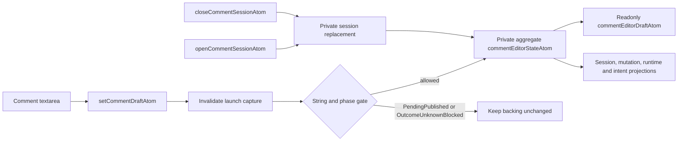

# comments

Cell-anchored notes and threaded-comment editor authority owned by
`@einfach/spreadsheet-ui-core`.

## Authority and API

- `commentEditorStateAtom` is the private aggregate backing for session identity, session,
  draft, intent, and mutation phase.
- `commentEditorDraftAtom: Atom<string>` is a public read-only projection. A direct store setter
  fails at runtime.
- Textarea changes use `setCommentDraftAtom`. The command invalidates an in-progress launch
  capture before checking the phase gate, then writes the private backing only when the phase is
  neither `PendingPublished` nor `OutcomeUnknownBlocked`.
- `openCommentSessionAtom` and `closeCommentSessionAtom` replace the session, rotate its identity,
  and reset draft, intent, and mutation state.
- `runCommentMutationAtom` is the bounded post/resolve command. It publishes immutable pending
  evidence before transport and accepts only a ticket-matching acknowledgement as local evidence.
- `commentMutationStateAtom`, `commentOperationAttemptLedgerAtom`, and
  `commentRuntimeStatusAtom` are read-only public projections.
- `commentSessionAtom` and `commentIntentAtom` retain their current compatibility writers; this
  slice narrows the draft boundary only.

## Draft flow

Closing a session clears the editor authority even when an old transport is still pending. A late
acknowledgement or error can settle the old bounded ledger entry, but its ticket cannot overwrite a
reopened session.

Scale remains bounded to one editor authority and a 32-entry attempt ledger. Thread bodies and
note text stay in backend/adapter ownership; there are no per-cell atom families.

Tests: `test/comments-notes.test.ts` and `test/package-boundary.test.ts`.
