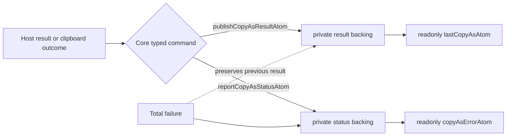

# copy-as

Pure encoders that serialise a `DisplayCell[]` projection of the active
selection into the three clipboard flavours the host writes on
`Ctrl+Shift+C`:

- `text/html` — a `<table>` with inline styles derived from each cell's
  `SpreadsheetCellFormat`.
- `text/plain` — Excel-compatible TSV (tab between columns, `\n` between
  rows; inner newlines and tabs collapsed to spaces).
- `text/markdown` — a GitHub Flavoured Markdown table.

The encoders are pure data transforms. They never touch the DOM, never
issue backend requests, and never read other atoms — the host hands them a
`CopyAsInput` snapshot built from the current projection and they hand back
strings.

## State Decision Template

- Source atoms: private Core backing atoms hold the latest successful result
  and user-visible status.
- Derived atoms: `lastCopyAsAtom` and `copyAsErrorAtom` are read-only public
  projections consumed by tests, diagnostics, and status surfaces.
- Commands: hosts publish successful payloads through
  `publishCopyAsResultAtom` and report or clear status through
  `reportCopyAsStatusAtom`. A total failure updates only status and preserves
  the previous successful result.
- Scale bound: one latest-result snapshot plus one small status value; no
  per-cell or per-range families. The result is replaced on each success.
- Backend reads: none. Copy-as consumes the `DisplayCell[]` the host has
  already projected for the rectangle (typically via
  `readRangeProjection` with `reason: 'clipboard'`).
- Per-cell atom risk: none — the snapshot is a single object.
- Tests: `test/copy-as.test.ts`.

## Public encoder API

```ts
export function encodeSelectionAsHtml(input: CopyAsInput): string
export function encodeSelectionAsMarkdown(input: CopyAsInput): string
export function encodeSelectionAsPlainText(input: CopyAsInput): string
export function encodeSelectionForClipboard(input: CopyAsInput): CopyAsResult
export function copyAsVisibleRows(
  rect: CopyAsRect,
  hiddenRows: ReadonlySet<number> | readonly number[] | undefined,
): number[]
export function normalizeCopyAsHiddenRows(
  hiddenRows: ReadonlySet<number> | readonly number[] | undefined,
): ReadonlySet<number>
```

`CopyAsInput.cells` is sparse — only occupied cells from the projection.
The encoders iterate `rect`, not `cells`, so empty cells in the rectangle
render as empty `<td>` / blank GFM cell / empty plain-text column.

### `hiddenRows` — copy skips filtered-out rows

`CopyAsInput.hiddenRows` lists sheet-absolute rows inside `rect` that emit
nothing at all: no `<tr>`, no GFM row, no TSV line. Omitting it (or passing
an empty set) emits every row, which is the pre-hardening behaviour.

**Populate with filter-hidden rows only** — `viewportFilterHiddenAtom`,
never the `effectiveHiddenAtom` union. Excel's copy is asymmetric:

| row is…          | copied? | how to skip it                            |
| ---------------- | ------- | ----------------------------------------- |
| filter-hidden    | no      | automatic, no user action                 |
| manually hidden  | yes     | `Go To Special → Visible cells only` only |

Passing the union would drop manually hidden rows out of the clipboard and
manufacture a divergence from Excel. This is the same rule the S3 guards
follow: anything that MOVES DATA reads the filter subset, only navigation
and rendering read the union.

Knock-on effects the encoders handle:

- **Markdown header** is the first VISIBLE row of `rect`, not necessarily
  `rect.startRow`. A rect with no visible rows encodes to `''`.
- **HTML `rowspan`** is re-clipped to the number of visible rows in the
  merge's intersection with `rect`, and the emitted anchor moves to the
  first visible row of that intersection. A merge whose in-rect slice is
  entirely hidden is dropped. Without this the table would claim more rows
  than it emits.
- Rows listed outside `rect` are inert.

Under today's display-compaction filter a filtered-out row has no display
slot, so it never lands inside `rect` and this parameter is always empty —
the encoders are accidentally correct. The guard exists for the S5 adapter
flip, after which a filter-hidden row keeps its index inside `rect` while
contributing no cells. See
`excel/solid-excel/docs/online-excel-parity/design-filter-hidden-rows.md` §8.2.

## HTML encoder semantics

- Root element: `<table style="border-collapse: collapse; border: 1px solid #ccc">`.
- One `<tr>` per non-`hiddenRows` row in `rect`; one `<td>` per column. Empty cells emit a
  `<td></td>` with the per-cell border + padding style but no content.
- Cell text is HTML-escaped (`&`, `<`, `>`, `"`, `'`); embedded line breaks
  become `<br>` after escaping.
- Per-cell style is derived from `DisplayCell.format`:

  | source field      | css                                       |
  | ----------------- | ----------------------------------------- |
  | `bold`            | `font-weight: bold`                       |
  | `italic`          | `font-style: italic`                      |
  | `underline`       | `text-decoration: underline`              |
  | `strikethrough`   | `text-decoration: line-through`           |
  | `underline` + `strikethrough` | `text-decoration: underline line-through` |
  | `align`           | `text-align: left/right/center/justify`   |
  | `verticalAlign`   | `vertical-align: top/middle/bottom`       |
  | `bgColor`         | `background-color`                        |
  | `fgColor`         | `color`                                   |
  | `fontFamily`      | `font-family`                             |
  | `fontSize` (pt)   | `font-size: Npt`                          |

  Alignment values without a clean CSS equivalent (`'fill'`,
  `'distributed'`) are dropped silently.

- Merge handling: when a `DisplayCell` carries `mergedSpan: { rows, cols }`
  with either dimension > 1, the encoder emits `rowspan="rows"` /
  `colspan="cols"` on the anchor `<td>` and **omits** the cells covered by
  the span entirely from the markup. Single-row / single-col degenerate
  spans (1×1) emit neither attribute.
- Optional `columnWidths` / `rowHeights` produce a `<colgroup>` with
  `<col style="width: Npx">` and `<tr style="height: Npx">` respectively;
  hosts that don't supply these maps get a layout-neutral table.

## Markdown encoder semantics

- First non-`hiddenRows` row of `rect` is the header row.
- Columns separated by ` | `, rows separated by `\n`.
- Separator after the header is a single ` --- ` per column.
- Cell text escaping: backslash doubled, `|` escaped as `\|`, newlines
  replaced with `<br>` (GFM table cells are single-line).
- Formatting: `**bold**` and `*italic*` wrap the cell text **after**
  escaping. Underline, strikethrough, colors, fonts, and number-format
  metadata are dropped silently — GFM tables can't express them.
- Empty cells emit a literal empty column (no `**` wrap, no whitespace
  surprises).

### Known limitation: merge cells in Markdown

GFM tables cannot express row/colspan. The merge anchor carries the
content; the covered cells render blank. Hosts that need lossless merge
round-trip should rely on the HTML flavour instead.

Detection uses both `DisplayCell.mergedSpan` (set on anchors) and
`DisplayCell.mergeAnchor` (set on covered cells, pointing back to the
anchor). The four anchor / covered × in-rect / out-of-rect combinations
behave as follows:

| anchor in rect | covered in rect | behaviour                            |
| -------------- | --------------- | ------------------------------------ |
| yes            | yes             | anchor writes content; covered blank |
| yes            | no              | anchor writes content (covered N/A)  |
| no             | yes             | covered renders blank (no leakage)   |
| no             | no              | merge ignored                        |

The "anchor outside the rect, covered cells inside" case used to leak the
covered cells' projection-side placeholder values into the table; the
encoder now blanks them so the selection rectangle is the only thing the
clipboard ever sees.

### Known limitation: clipped merges in HTML

When the selection rectangle only partially overlaps a merge, the HTML
encoder clips the emitted `rowspan` / `colspan` to the intersection so
the table can never reference cells outside the selection. When the true
anchor falls *outside* the rect, a synthetic anchor is placed at the
top-left of the intersection and rendered blank (no content is leaked
from outside the selection). The format on a synthetic anchor is also
omitted — only the true anchor carries style.

## Plain text (Excel-compatible TSV)

- `\t` between columns, `\n` between rows.
- Inner `\n` and `\t` in cell text are replaced with a single space —
  this mirrors what Excel does when it writes a multi-line cell to
  `text/plain`.
- No formatting; covered cells of a merge emit empty columns (the anchor
  emits its content once on its column index).

## Atom contract

```ts
export const lastCopyAsAtom: Atom<CopyAsResult | null>
export const copyAsErrorAtom: Atom<CopyAsError | null>
export const publishCopyAsResultAtom: WritableAtom<null, [CopyAsResult], void>
export const reportCopyAsStatusAtom: WritableAtom<null, [CopyAsError | null], void>
// debugLabel = 'spreadsheet.copyAs.last'
```

Core owns both private backing atoms. Hosts can only write through typed
commands; public consumers receive read-only projections. PNG publishes its
snapshot before attempting the system clipboard. Any later clipboard failure
reports degraded status without clearing that snapshot.


