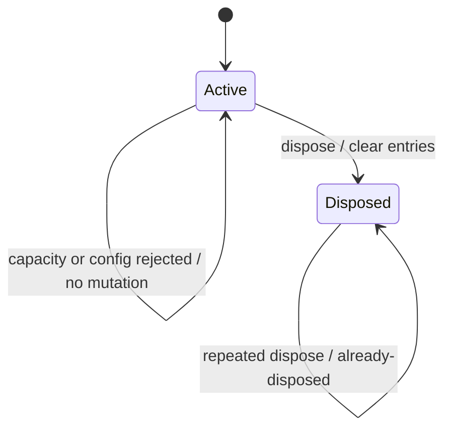

# custom-formulas

Owns the user-defined custom-formula registry (Wave 8). UI core stores
registrations as plain `{ name, source, description?, paramLabels? }`
records keyed by uppercase name; the Solid host diffs the registry atom
and forwards add/remove to the worker, which `new Function('args',
source)`s the body and hands the resulting callable to the WASM
`Workbook` via `registerCustomFormula`.

The source-string boundary deliberately rules out a `(args) => ...` JS
function travelling across `postMessage`: closures cannot be cloned, and
`fn.toString()` + regex parsing for the body silently drops captured
state. Asking the host for a body string is both cheaper and safer —
the only thing the worker can see is the explicit `args` array.

**Authoritative engine contract:** `excel/rust/excel-core/src/CUSTOM_FORMULAS.md`
documents the WASM-side marshaling, error-token round-tripping, and the
exact precedence order the evaluator uses to resolve a name. This file
is the JS-side host API; the Rust doc wins on any disagreement about
the value boundary.

## State Decision Template

- Source atom:
  - Private `customFormulaRegistryStateAtom`: one aggregate per
    `@einfach/core` store owning `{ status, maxEntries, entries }`. The
    default cap is `256`; hosts may configure any safe integer from `0`
    through the hard ceiling `10_000`.
- Derived atoms:
  - `customFormulaRegistryAtom`:
    `ReadonlyMap<name, CustomFormulaRegistration>`. Mutations can only go
    through the command atoms, so callers cannot bypass capacity or
    lifecycle rules through the public atom API.
  - `customFormulaRegistryLifecycleAtom`: exposes
    `{ status: 'active' | 'disposed', maxEntries, size }` for host UI and
    diagnostics.
  - The host defines a derived `customFormulasSupportedAtom` reading
    `backend.registerCustomFormula != null` and uses it to gate optional
    UI (none in MVP — registration is programmatic, not menu-driven).
- Commands:
  - `configureCustomFormulaRegistryAtom(maxEntries)` — changes the cap
    without eviction. Invalid caps and caps below the current size return
    an explicit rejected outcome and leave state untouched.
  - `registerCustomFormulaAtom(registration)` — add or replace by name.
    Invalid names still throw for backwards compatibility. Capacity and
    disposed-state failures return explicit rejected outcomes; replacing
    an existing name remains valid at capacity.
  - `unregisterCustomFormulaAtom(name)` — reports `removed` or `not-found`.
  - `resetCustomFormulaRegistryAtom` — clears entries, preserves the cap,
    and remains active so the store can register/configure again.
  - `disposeCustomFormulaRegistryAtom` — clears entries and terminally
    disposes this store. Later register, unregister, configure, and reset
    commands reject explicitly without mutation.
- Helper:
  - `validateCustomFormulaName(name)` — returns
    `{ ok: true } | { ok: false; reason }` where `reason` is one of
    `'name-empty' | 'name-format' | 'name-shadows-builtin'`. Hosts that
    want a UI affordance can call this directly without round-tripping
    through the register atom.
- Scale bound: one bounded map per store; no per-name families. Capacity
  rejection never evicts an older formula and never publishes a new map.
- Backend reads: optional `registerCustomFormula(name, source)` /
  `unregisterCustomFormula(name)`. Host adapters that omit these
  methods make accepted registry changes core-only (the host effect
  skips the worker call); this is the same degraded-feature shape every
  other Wave 7/8 optional port uses.
- Per-cell atom risk: none.
- Tests: `test/custom-formulas.test.ts` (core),
  `excel/solid-excel/test/vnext-custom-formulas.test.tsx` (host).

### Compatibility boundary

Existing repository consumers that read or subscribe to
`customFormulaRegistryAtom`, and existing calls to the register/unregister
command atoms, keep their call shape. The public registry atom itself is now
read-only: its former direct-setter capability is intentionally removed because
it could bypass capacity and lifecycle invariants. This is a type-level breaking
boundary for external consumers that wrote a replacement map directly; migrate
those writes to the configure/register/unregister/reset/dispose commands.

## Registry lifecycle



The registry transition only governs UI-core state. It does **not** prove
that an asynchronous backend registration which acknowledges after reset or
dispose has been removed remotely. Closing that late-ACK race belongs in the
Solid Provider integration, where the in-flight request and backend handle
are owned; it is a separate follow-up rather than an implied core guarantee.

## Name rules

- Regex: `/^[A-Z][A-Z0-9_.]*$/`. Register requires the as-written name to
  satisfy the upper-case format. Unregister normalizes incoming names, so
  `'mytax'` and `'MYTAX'` resolve to the same registry slot.
- Must not shadow a name in `BUILTIN_FORMULA_NAMES`. That set unions
  two sources:
  1. `ENGINE_BUILTIN_FORMULA_NAMES` — the authoritative mirror of the
     Rust evaluator's `is_builtin_function_name` arms, auto-generated
     by `scripts/extract-builtin-names.mjs` from
     `excel/rust/excel-core/src/eval.rs` (currently 426 names including
     `LAMBDA`, `LET`, `IFERROR`, `XLOOKUP`, `MAP`, `REDUCE`, …).
  2. `FORMULA_FUNCTION_SPECS` — the IntelliSense seed registry under
     `formula-functions/registry.ts`.
- Re-registering an existing custom name silently replaces the previous
  source / metadata (Excel semantics).

If the Rust engine adds a new built-in arm, re-run
`node excel/spreadsheet-ui-core/scripts/extract-builtin-names.mjs`
to refresh `engine-builtin-names.ts`.

## JS callback signature

The worker compiles the registered `source` into:

```ts
(args: ReadonlyArray<CustomFormulaArg>) => CustomFormulaReturn
```

A scalar arg (`=MYFN(B2)`) lands in `args[i]` as a
`CustomFormulaScalar` (`number | string | boolean | null`). A range
arg (`=MYFN(A1:A10)` / `=MYFN(A1:C5)`) lands in `args[i]` as a 2-D
`ReadonlyArray<ReadonlyArray<CustomFormulaScalar>>` because the WASM
bridge marshals `Value::Array` directly to a nested JS array (row-major).

Defensive bodies should branch on `Array.isArray(args[i])` and fall
back to a single-cell projection — see the `SUMSQ2` demo in
`excel/solid-excel/src-vnext/demos/VNextWorkerDemo.tsx`:

```js
// =SUMSQ2(A1:A10)
const xs = Array.isArray(args[0]) ? args[0].flat() : [args[0]]
return xs.reduce((s, v) => s + Number(v) * Number(v), 0)
```

## Source-string contract

The `source` field is the body of a function whose single parameter is
bound to `args` (Array). The worker constructs the live function via
`new Function('args', source)` — or the AsyncFunction constructor when
the registration sets `isAsync: true`, in which case the body may
`await`.

Throwing inside the body produces `#ERROR!` with the thrown message.
Returning `undefined` is treated the same as returning `null`.

## Async custom formulas (`isAsync`, Wave 8.2)

```ts
store.setter(registerCustomFormulaAtom, {
  name: 'SLOWTAX',
  source: 'const rate = await self.myRateTable.get(args[1]); return args[0] * rate',
  isAsync: true,
})
```

While the returned Promise is in flight the cell shows `#BUSY!`, which
propagates to dependents like any error (`IFERROR` will swallow it).
When it settles, the worker writes the value back into the engine and
exactly the observing formulas re-derive; the UI refreshes through the
normal dirty/projection path.

Semantics to know before reaching for it:

- **Memoized per (name, args) until the next registry change.** The
  callback runs once per distinct argument tuple; re-registering (any
  custom formula) clears the memo and re-executes on next read. No TTL
  and no manual refresh in v1 — suits deterministic-per-args work, not
  live data feeds. Avoid volatile args (`=SLOWTAX(A1, NOW())`).
- **Error mapping**: throw / Promise rejection → `#VALUE!` (message in
  the worker console); returning an error token or `{ error }` works
  like the sync path; returning the reserved `#BUSY!` token demotes to
  `#VALUE!`.
- **Degradation**: a backend/wasm build without the async ports rejects
  the registration with `ASYNC_CUSTOM_FORMULA_UNSUPPORTED` instead of
  silently registering a Promise-returning sync callback.

Engine contract details: `excel/rust/excel-core/src/CUSTOM_FORMULAS.md`
§ "Async custom formulas (Wave 8.2)".

Plain-value contract (see `CustomFormulaArg` / `CustomFormulaReturn`):

| direction | shape                                                                              |
| --------- | ---------------------------------------------------------------------------------- |
| in        | `Array<CustomFormulaScalar \| ReadonlyArray<ReadonlyArray<CustomFormulaScalar>>>`  |
| out       | `number \| string \| boolean \| null \| undefined`                                 |

where `CustomFormulaScalar = number | string | boolean | null`. See
`excel/rust/excel-core/src/CUSTOM_FORMULAS.md` "Marshaling" for the full
JsValue ↔ Value mapping, including the structured-error return form
(`{ error: '#DIV/0!' }`) and the Excel error tokens that round-trip
back to `Value::Error`.

## Dependency tracking

Custom formulas track **only the dependencies the parser sees**:
`=MYFN(B2, C3:C10)` registers `B2` and the `C3:C10` range as deps of
the cell, so mutating any of those re-evaluates `MYFN`.

Custom callbacks **must not read cells via a side channel**. The MVP
host API does not expose a workbook getter inside the callback — the
only inputs are the explicit `args` array — so there's no foot-gun to
hit today, but the rule is load-bearing for any future API addition:

- A future `args.workbook.getCell('Sheet1!B2')` (or similar) would
  require the registration site to declare the extra deps explicitly,
  e.g. via a `deps: string[]` field on `CustomFormulaRegistration`.
  Without that the engine has no edge to dirty when the side-read cell
  mutates, and the callback's cached result silently drifts.
- The Rust evaluator's invalidation path
  (`invalidate_all_formulas_for_custom_function_change`) only fires on
  register / unregister, not on cell mutation. It is intentionally
  a sledgehammer for source-replacement; per-cell dep tracking for
  side reads is **out of scope** for this wave.

If you find yourself wanting a side-channel read, file an issue
referencing `TODO(custom-formula-deps)` so the engine + UI tracks the
new contract together.
