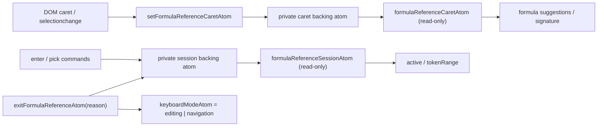

# formula-reference

Owns the formula-reference picking session: entering pick mode, inserting A1/A1:B2 tokens into the editing draft, and exiting back to normal editing.

## State Decision Template

- Public read-only state atoms (projected from private backing atoms):
  - `formulaReferenceSessionAtom`: active pick session (anchorCell, sheetId, insertionCaret, tokenRange, dragging); null when inactive.
  - `formulaReferenceCaretAtom`: current DOM caret index inside the draft. `-1` means unknown.
- Derived atoms:
  - `formulaReferenceActiveAtom`: true while a session is live.
  - `formulaReferenceTokenRangeAtom`: `[start, end)` of the last inserted token; null before the first pick.
- Commands:
  - `setFormulaReferenceCaretAtom` — accepts the host's DOM caret index and updates the private caret backing atom.
  - `enterFormulaReferenceAtom` — captures anchorCell and insertionCaret; does not alter editing status.
  - `pickFormulaReferenceAtom` — splices a serialised A1/A1:B2 token into `editingDraftAtom`; updates `tokenRange`.
  - `exitFormulaReferenceAtom` — nulls the private session backing atom and restores `keyboardModeAtom` to `editing` or `navigation`; editing draft is already correct.
- Scale bound: one session object, one caret index. No per-cell atoms.
- Backend reads: none. Token serialisation (coord → A1) is a pure UI-core helper.
- Per-cell/per-row/per-col atom risk: none.
- Tests: `test/formula-reference-mode.test.ts`.

## Integration points

**Selection** — While `formulaReferenceActiveAtom` is true, pointer-down on a grid cell must route through `pickFormulaReferenceAtom` rather than the normal `selectCellAtom`/`selectRangeAtom` path. The primary `SelectionState` is frozen for the duration of the session and restored on exit. UI core does not enforce this freeze; host adapters must check `formulaReferenceActiveAtom` before routing pointer clicks.

**Keyboard** — In `formula-reference` mode, Arrow keys produce `formulaReference.arrowPick` intents rather than `selection.move`; Enter/Escape emit `formulaReference.exit`, which the host routes through `exitFormulaReferenceAtom`.

**Editing** — `pickFormulaReferenceAtom` calls `editingDraftAtom`'s write path to surgically replace `[tokenRange.start, tokenRange.end)` with the freshly-serialised token. The editing session status stays `'drafting'` throughout.

**Formula-bar** — The formula-bar draft mirrors `editingSessionAtom.draft`. Its DOM selection events must dispatch `setFormulaReferenceCaretAtom`; hosts must not write `formulaReferenceCaretAtom` directly. The token range available from `formulaReferenceTokenRangeAtom` can be used by the host adapter to highlight the active reference span.

**Trigger predicate** — `shouldEnterFormulaReferenceMode(draft, caret)` returns true when the character at `caret - 1` is one of `= + - * / ^ & ( , < > %` and the character at `caret` is end-of-string or `)`. Host adapters call this on every caret update.
