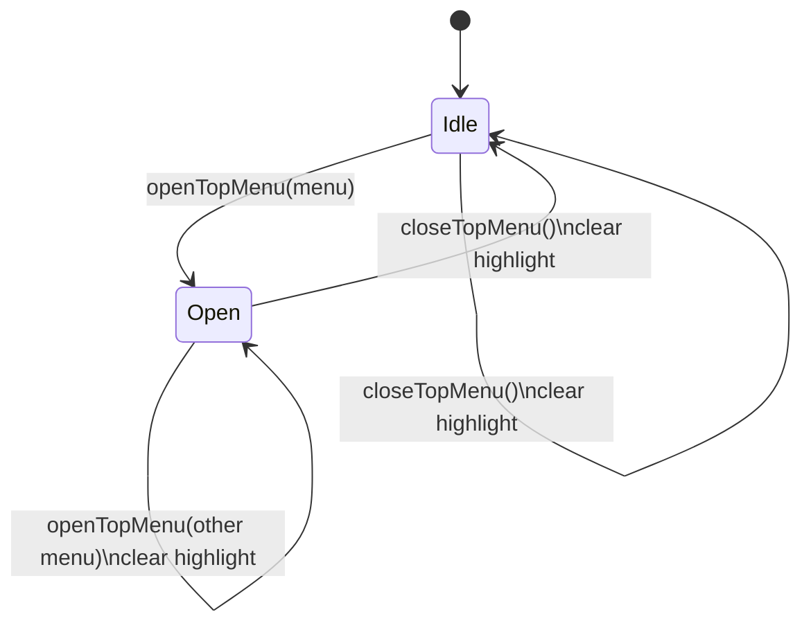
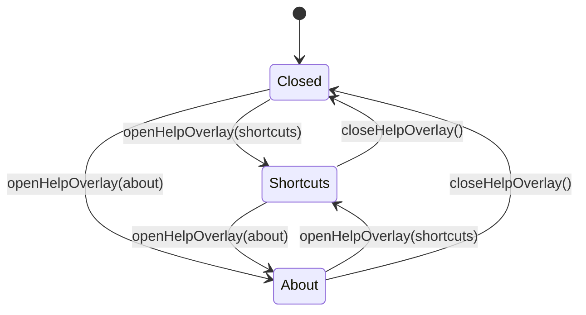

# Top menu state boundary

`menu-bar` owns the framework-independent state for the spreadsheet's File / Edit / Insert /
Format / Data / View / Help menu and the two Help overlays. `@einfach/core` is the only state
source; Solid reads the public projections and dispatches the command atoms.

## Public state and commands

| Public state           | Meaning                                  | Write boundary                                       |
| ---------------------- | ---------------------------------------- | ---------------------------------------------------- |
| `topMenuOpenAtom`      | `idle` or the currently open top-menu id | `openTopMenuAtom`, `closeTopMenuAtom`                |
| `topMenuHighlightAtom` | Currently highlighted item id            | No public write command yet; currently always `null` |
| `helpOverlayAtom`      | `closed`, `shortcuts`, or `about`        | `openHelpOverlayAtom`, `closeHelpOverlayAtom`        |

The three public atoms are read-only projections over module-private backing atoms. Existing
command atoms remain readable: both top-menu commands read the current `TopMenuOpenState`, and
both Help commands read the current `HelpOverlayKind`.

Directional item highlighting is not implemented in UI core. Opening, switching, or closing a
top menu clears the private highlight backing state to `null`; this module does not invent an
arrow-key/highlight transition before a real host interaction contract exists.

## Top menu flow

The host may close a menu after dispatching a selected registry entry, but UI core has no
separate `dispatching` menu state.

## Help overlay flow

The Help overlay state is independent from `topMenuOpenAtom`. The Solid host closes the menu when
it dispatches a Help entry and then opens the requested overlay through the corresponding command.
