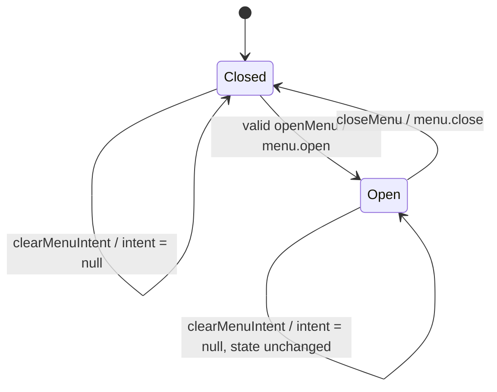
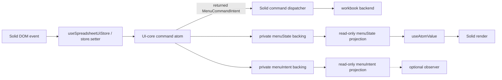

# menu

Owns menu open/close state, compact targets, highlight, and command intent. `@einfach/core`
is the single source of truth; framework bindings may render or dispatch commands, but must not
mirror menu product state in Solid signals or another state system.

## State Decision Template

- Private source atoms: `menuStateBackingAtom`, `menuIntentBackingAtom`
- Public read-only projections: `menuStateAtom`, `menuIntentAtom`
- Derived atoms: `menuOpenAtom`, `menuTargetAtom`, `menuPositionAtom`, `menuHighlightAtom`, `menuCommandIntentAtom`
- Commands: `dispatchMenuIntentAtom`, `openMenuAtom`, `updateMenuHighlightAtom`,
  `dispatchMenuCommandAtom`, `closeMenuAtom`, `clearMenuIntentAtom`
- Scale bound: one open menu and one last emitted intent
- Backend reads: none in the core module; execution stays in the adapter/backend layer
- Per-cell/per-row/per-col atom risk: low, because targets stay compact and never expand to per-cell state
- Tests: open, highlight, command dispatch, close, and invalid-target rejection

## State Flow

`dispatchMenuIntentAtom` remains the compatibility path for an already typed `MenuIntent`. It
applies that intent directly and intentionally does not expand the validation or normalization
performed by the intent factories.

## Core / Solid Boundary

Solid is a thin binding: events obtain the UI store with `useSpreadsheetUiStore` and call
`store.setter` with UI-core command atoms. Executable commands return a `MenuCommandIntent`
directly to the Solid dispatcher, which invokes the backend; execution does not depend on a
`menuIntentAtom` subscription. Public projections remain read-only inputs for rendering or
observation, and only the private UI-core backing atoms are writable state sources.

## Readable Command Contract

The command atoms intentionally keep their existing getter values; they are not write-only
`null` sentinels:

- `dispatchMenuIntentAtom`, `openMenuAtom`, `closeMenuAtom`, and
  `updateMenuHighlightAtom` read the current `MenuState` and return the resulting `MenuState`
  from a write.
- `dispatchMenuCommandAtom` reads the latest `MenuCommandIntent | null` and returns the emitted
  command intent, or `null` when the current target does not allow the command.
- `clearMenuIntentAtom` reads the latest `MenuIntent | null`; writing it clears the intent and
  returns `void`.

## Contract Notes

- `menuStateAtom` projects only the current menu descriptor, not workbook facts.
- `menuIntentAtom` projects the last emitted menu intent for adapter consumption.
- `MenuTarget` remains compact: cell/range/row/column/all/sheet-tab are represented by sheet-local references and bounded ranges only.
- `MenuCommandIntent` is intentionally declarative. Copy, cut, paste, clear, row/column insert/delete, and formatting-open commands are handed off to the higher-level adapter or operations layer.
- The menu core must not create per-cell atoms or cache full workbook facts.
