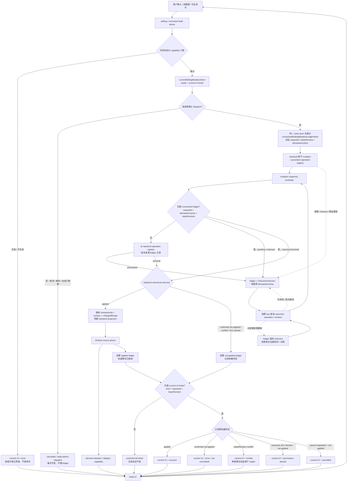
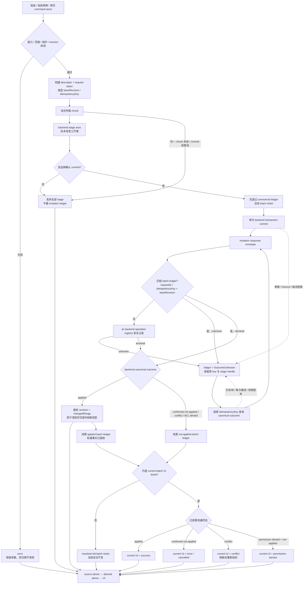
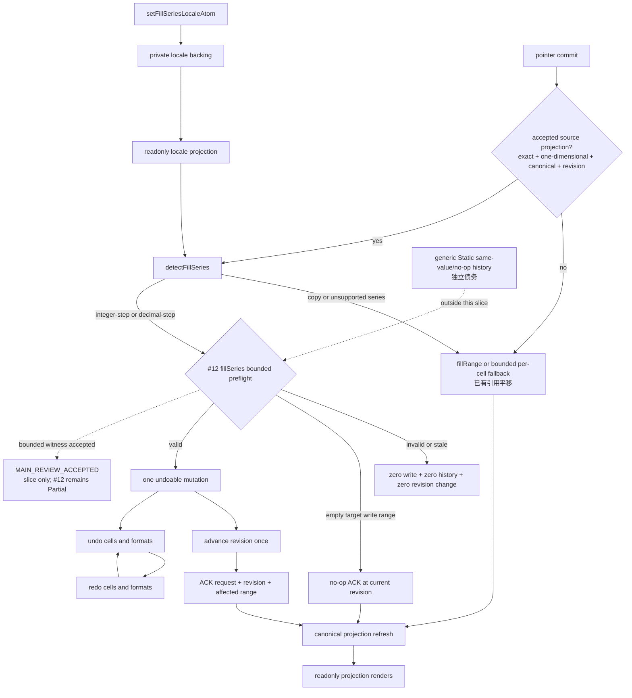
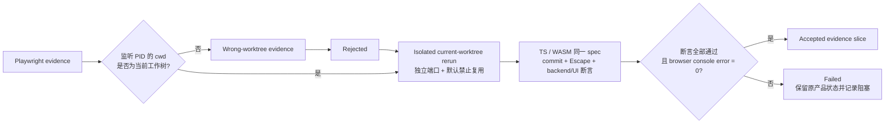
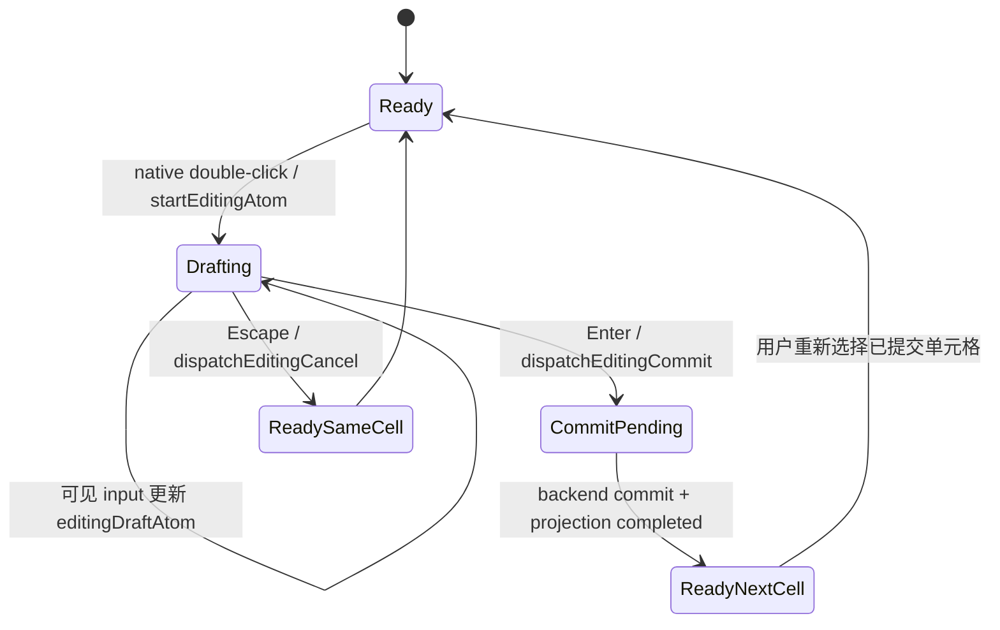
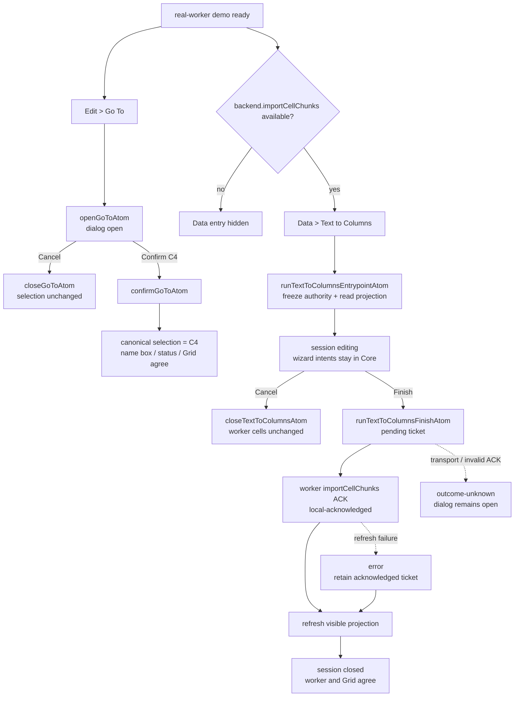
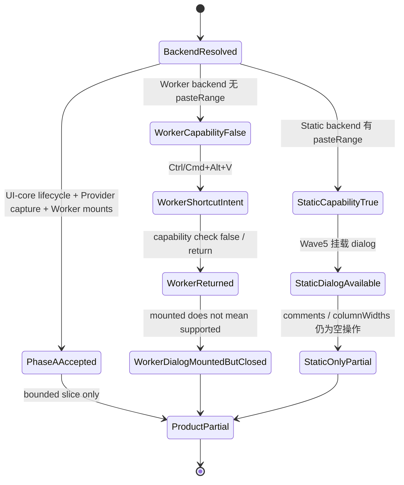
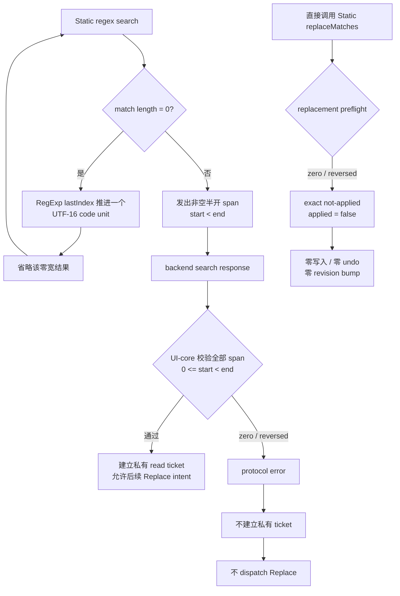

# 03 数据输入与基础编辑：现状、优先级与执行排期

> 基线：2026-07-13，仓库提交 7226093。
>
> 当前工作树架构复核：2026-07-14；下文“现状”以当前未提交工作树为准。
>
> 主交付窗口：2026-07-20 至 2026-08-07。
>
> 本文只覆盖第 3 组“数据输入与基础编辑”。第 9 组数据分析、第 16 组打印完全延后，不占本窗口人力。

> 架构审查：目标设计以 `@einfach/core` 为唯一前端产品状态核心。当前工作树已把查找替换的表单字段与查询结果迁入 core hooks，但 Solid 组件仍直接编排 backend 异步调用，响应写回也没有 session/request identity；这还不是薄绑定。Go To 与 Text to Columns 的产品状态和命令生命周期已经收口到 `@einfach/spreadsheet-ui-core` 的 Einfach atoms，real-worker Solid demo 只挂载共享菜单、对话框并转发宿主端口；但本组整体仍只能标为“部分收口”。#11 Paste Special Phase A bounded slice 已 `MAIN_REVIEW_ACCEPTED`：capability/session/lifecycle 在 UI-core Einfach atoms，Provider 捕获 backend port，两个 real-worker demo 均挂载 dialog；Worker backend 仍无 `pasteRange`，所以快捷键在 transport 前终止。Context Menu 入口与 Worker transport 未闭环，产品仍为 `Partial`。#12 的 locale 已收口为 private backing + readonly projection，Solid Grid 已在严格 canonical projection + revision 门禁后调用纯 detector，并只向 Static dispatch 数值 `fillSeries`；该 bounded slice 已 `MAIN_REVIEW_ACCEPTED`，但 #12 仍为 `Partial`，不能升级产品状态。当前查找替换迁移 diff 的主审结论是 `MainReview → Rework`，不能计作已完成。

## 1. 结论

当前版本已经有“单元格编辑、公式栏、基础系统剪贴板、基础填充、查找替换、粘贴特殊对话框”的骨架，但还不能按在线 Excel 对标完成：

- 多项能力只在 static backend 存在，worker backend 没有对应端口。
- 部分 UI 展示了选项但执行为空操作，典型是“仅批注”“列宽”粘贴。
- 默认 Wave5 页面未挂载菜单栏，若功能只存在于快捷键或未挂载菜单中，用户实际上不可发现。
- 日期、时间、布尔值仍按普通文本或数字输入，没有统一的值语义合同。
- 剪贴板仍可能退化为逐单元格调用；#12 数值序列在严格门禁下已有一次 Static mutation，bounded per-cell fallback 已有引用平移，但完整 formula-series、Worker/真实 transport parity 与大范围系统门禁尚未闭环。
- 查找替换对话框的字段已迁入 core，但当前异步结果没有绑定 open session/request identity：旧查询 A 可在关闭重开或发起查询 B 后覆盖新会话；backend 副作用和完整 lifecycle 仍由 Solid 编排。“工作簿范围”“Ctrl+H”“全部替换”也仍存在名实不符。

因此本窗口先用 P0 修复数据安全、状态规范和 static/worker 对等，再交付高频 P1；Flash Fill 与拼写检查列为 P2，放到主窗口之后。所有“可选能力”在未实现前必须隐藏或禁用并解释原因，不允许可点击的空操作。

## 2. 范围与状态口径

### 2.1 本组完整功能点

1. 单元格直接输入、公式栏输入、编辑提交和取消。
2. 文本、数字、公式、日期、时间和布尔值输入语义。
3. 多行编辑、Alt+Enter 换行、IME 输入。
4. 清空内容与基础键盘编辑。
5. 复制、剪切、粘贴、跨工作表粘贴和大范围粘贴。
6. 拖拽移动选区。
7. 粘贴特殊：值、公式、格式、值和格式、全部、转置、运算、跳过空白、批注、列宽。
8. 填充柄、向下填充、向右填充、复制填充和序列填充。
9. 数字、日期、星期、月份、自定义列表序列。
10. Flash Fill。
11. AutoSum。
12. 单元格复选框。
13. 超链接创建、编辑、移除和打开。
14. 查找、替换、查找全部、全部替换、通配符和作用域。
15. 拼写检查。
16. 编辑相关快捷键、浏览器冲突、无障碍和错误反馈。

### 2.2 不在本文交付范围

- 第 9 组数据分析和第 16 组打印：完全延后。
- 批注正文、列宽模型、保护、数据验证、公式函数实现由各自功能组负责；本文只定义编辑入口、粘贴/移动时的协作合同和验收依赖。
- 多人协同冲突解决、离线合并和 Excel 文件导入导出不是本组实现目标。
- HYPERLINK、SUM 等公式函数的计算正确性由公式组负责；本文负责创建公式或富文本链接的交互链路。
- P0/P1 不追求 Excel 所有区域设置的智能猜测；只交付有版本、有测试、可配置且 static/worker 一致的输入规则。

### 2.3 状态口径

| 标记     | 含义                                                             |
| -------- | ---------------------------------------------------------------- |
| 已实现   | 默认 Wave5 有用户入口，static/worker 均可执行，有自动化验收      |
| 部分实现 | 有代码或单后端能力，但入口、语义、对等性、原子性或测试至少缺一项 |
| 未实现   | 没有可用的端到端链路                                             |
| 假可用   | UI 可选或接口存在，但实际为空操作、错误作用域或不可达            |

“代码里出现名称”不计为实现；必须满足 UI 可达、后端落地、撤销重做、错误路径和测试闭环。

## 3. 逐项现状与证据

| 功能点            | 当前状态 | 代码与测试证据                                                                                                                                      | 现状判断                                                                                                                       |
| ----------------- | -------- | --------------------------------------------------------------------------------------------------------------------------------------------------- | ------------------------------------------------------------------------------------------------------------------------------ |
| 单元格直接编辑    | 部分实现 | Grid 通过 `startEditingAtom`、`dispatchEditingCommit` / `dispatchEditingCancel` 接线；独立 real-backend spec 在 TS/WASM 合计 2/2                    | native double-click、Enter 提交下移、Escape 丢弃及 canonical UI 已覆盖；仍缺统一值语义、多行、Worker undo/redo 与完整系统门禁  |
| 公式栏编辑        | 部分实现 | solid/excel/src-vnext/formula-bar/SpreadsheetFormulaBar.tsx:171 附近提交；279 附近仍是单行 input                                                    | 与单元格共享编辑原子是正确方向，但不能输入换行，且日期/布尔语义仍由后端各自解释                                                |
| 数字与公式输入    | 部分实现 | static-backend.ts:1454-1507 区分 blank、formula、number、string；worker-workbook-backend.ts:1314-1339 单独处理公式                                  | 两后端均有基础能力，但分类规则未形成共享合同，边界值、区域设置和错误表现可能漂移                                               |
| 日期、时间输入    | 未实现   | backend/types.ts:251-252 只有日期/时间数字格式；两套 setCellInput 路径没有日期序列解析合同                                                          | 显示格式存在不代表值语义已实现；需明确日期系统、区域设置、时区与 1900 闰日兼容策略                                             |
| 布尔输入          | 未实现   | worker-protocol.ts 可传 boolean，static 也能投影已有 boolean；但 UI 输入和 setCellInput 未把 TRUE/FALSE 分类为布尔                                  | 只能显示已有布尔值，不能可靠地通过普通编辑创建布尔值                                                                           |
| 多行编辑          | 未实现   | Grid 和 Formula Bar 都使用单行 input；未找到 Alt+Enter 与换行保留路径                                                                               | 必须改为可自适应 textarea，并解决 IME、行高、剪贴板编码和显示                                                                  |
| 删除/清空         | 部分实现 | keyboard 核心支持 Backspace/Delete；Grid 最终调用清空逻辑                                                                                           | 基础可用，但需纳入保护、合并区、撤销事务和统一错误提示验收                                                                     |
| 普通复制          | 部分实现 | Grid 通过 projection/TSV 写系统剪贴板；`vnext-clipboard-real-backend.spec.ts` 的 copy + paste、cut + paste 在 TS/WASM 合计 4/4                      | 可见 UI 的值、选区、Name Box、Formula Bar、status 已覆盖；大范围仍收集 chunks 后 join，且缺无损富值/元数据与 Worker undo/redo  |
| 大范围复制        | 部分实现 | 两后端都有 exportRangeTsv；Grid 大范围路径仍收集 chunks 后 join                                                                                     | 后端可分块，但 UI 仍可能保留第二份完整字符串，未达到 O(chunk) 额外内存目标                                                     |
| 剪切与移动语义    | 假可用   | Grid 在系统剪贴板写入成功后立即 `clearSelectionRange()`；4/4 E2E 只断言 paste 后最终源空/目标有值                                                   | 测试刻意不冻结 paste 前清源时机；当前仍在粘贴成功前清源，失败可丢数据，也不等同 Excel 的原子移动语义                           |
| 普通粘贴          | 部分实现 | 两后端有批量 import 端口，但 Grid 当前仍按 chunk 内每个 cell 调 `setCellInput`，完成后才压入一个本地 history frame                                  | 4/4 只证明小范围成功投影；批量端口未被真实使用，多次非原子写入失败时难以回滚，Worker 也没有权威 undo/redo                      |
| 跨工作表剪贴板    | 部分实现 | 内部标记只包含 A1 类来源地址，Grid 组装元数据时使用当前 sheetId                                                                                     | 缺工作簿和源工作表身份，公式相对引用、剪切清源和富元数据无法可靠处理                                                           |
| 公式引用平移      | 部分实现 | clipboard/index.ts 的 shiftFormulaRefs 采用正则平移                                                                                                 | 对绝对/混合引用、工作表引用、结构化引用和字符串字面量缺少解析器级保证                                                          |
| 粘贴特殊 UI/状态  | 部分实现 | Phase A bounded slice 已接受：UI-core capability/session/lifecycle、Provider capture、两个 Worker demo dialog mount；独立 2 suites / 33 tests、UI-core tsc、11-file diff-check | Context Menu 入口仍缺；Worker 无 `pasteRange`，capability=false，快捷键在 transport 前 return；Static 不能替代 Worker parity |
| 粘贴特殊执行      | 假可用   | static backend 有 `pasteRange`、undo/redo，但 comments/column-widths 为空操作；worker backend 无 `pasteRange`、`undoTransaction`、`redoTransaction` | Worker 没有执行链，Static 仍有静默 no-op kind；缺“仅公式”、完整元数据语义与跨后端事务对等                                      |
| 填充柄与复制填充  | 部分实现 | Grid 的 pointer commit 先尝试 gated numeric `fillSeries`，不满足条件时保留 `fillRange` / bounded per-cell fallback；该逐格路径已有引用平移；Static 有两种端口，Worker 均缺 | fallback 仍可能逐格；完整 formula-series、Worker/真实 transport parity、可见 Fill 命令和完整系统门禁未闭环                    |
| 序列填充          | 部分实现 | Solid Grid 已从 exact、non-truncated、无重复、范围内且带 revision 的一维 canonical projection 调用 `detectFillSeries`；仅整数/十进制向 Static dispatch | #12 `fillSeries` bounded path 的 preflight、单 undoable mutation、revision/ACK/refresh 与 undo/redo witness 已 `MAIN_REVIEW_ACCEPTED`；不得外推为 Static 全局 history/no-op 原子性完成，generic Static same-value/no-op history 仍是独立债务；星期/月只检测不 dispatch，日期/custom/Worker 均缺 |
| 拖拽移动选区      | 未实现   | pointer 只覆盖拖拽选区和填充柄；未找到选区边框拖动和 moveRange                                                                                      | 需要独立预览状态、命中规则、原子后端移动和跨表/重叠语义                                                                        |
| Flash Fill        | 未实现   | 未找到实现、端口或产品测试                                                                                                                          | 属于推断型能力，放 P2；P0/P1 不以简单复制冒充 Flash Fill                                                                       |
| AutoSum           | 未实现   | 有 SUM 公式基础，但未找到 AutoSum 命令或范围推断 UI                                                                                                 | 需实现连续数字区域推断、公式落点和可撤销提交                                                                                   |
| 单元格复选框      | 未实现   | boolean 可显示为 TRUE/FALSE；现有 checkbox 仅用于对话框，Grid 无单元格控件                                                                          | 应把控件元数据与布尔值分离，不能为每个单元格创建状态原子                                                                       |
| 超链接展示        | 部分实现 | Grid 382-435 将 rich hyperlink 渲染为 span；没有可访问链接或打开处理                                                                                | 能看到文本不等于能打开；还缺 URL 安全、键盘访问和上下文操作                                                                    |
| 超链接编辑        | 假可用   | static-backend.ts:2030 有 setCellRichValue，worker 无；menu-bar insert.hyperlink 仍是占位，且默认 Wave5 不挂载菜单栏                                | 创建、编辑、移除均无默认可达闭环                                                                                               |
| 查找对话框        | 部分实现 | 当前工作树以 `findReplaceFormAtom` / `findReplaceFormQueryAtom` 保存表单与查询，Solid 通过 hooks 读写；关闭/重开已有 core 测试                      | `MainReview → Rework`：Solid 仍直接调用 backend，查询写回无 session/request identity，旧响应可覆盖新会话；不能认定状态迁移完成 |
| 查找作用域        | 假可用   | resolveSearchScope 对 workbook 实际仍落到当前工作表；static 有 searchRange，worker 无                                                               | UI 暴露的工作簿范围不成立，必须实现或隐藏                                                                                      |
| 查找全部/全部替换 | 假可用   | MAX_FIND_PAGE=500；static replaceMatches 仅处理当前匹配页                                                                                           | “全部替换”实际最多处理 500 条且不是后端原子查询，不能按已实现统计                                                              |
| 查找 span 合同    | 部分实现 | 公共类型已冻结 UTF-16 code-unit、半开且非空的 `[matchStart, matchEnd)`；UI-core 和 Static 均 fail closed；定向测试 62/62                              | 零宽结果按合同省略，不提供插入语义；Worker、真实 transport/E2E、generic ABA/durable 仍缺，#14 保持 `Partial`                    |
| 通配符            | 未实现   | 当前只有 substring/whole/regex；没有 Excel 风格的星号、问号和波浪号转义                                                                             | regex 不是通配符替代品，需独立解析与测试                                                                                       |
| Ctrl+F/Ctrl+H     | 部分实现 | Grid 2076-2087 都只打开对话框；对话框打开时又把 activeTab 重置为 find                                                                               | Ctrl+H 不能稳定打开“替换”页，命令语义错误                                                                                      |
| 拼写检查          | 未实现   | 未找到词典、provider、问题列表或单元格文本检查流程                                                                                                  | P2 采用可插拔 provider；默认不把工作簿文本发送到网络                                                                           |
| 基础键盘/IME      | 部分实现 | keyboard 核心有模式原子、方向键、Tab、Enter、F2、撤销重做、复制粘贴和 IME guard                                                                     | 缺 Alt+Enter、Ctrl+D/R、Ctrl+K、Ctrl+E、F7、Alt+=；菜单、工具栏、上下文菜单与快捷键尚未共用命令注册表                          |
| 自动化覆盖        | 部分实现 | core、Solid 和 E2E 已覆盖基础 clipboard、formula bar、paste special、find/replace、fill smoke；BACKEND_PARITY.md 是历史记录                         | 缺日期/布尔、多行、移动、Flash Fill、AutoSum、单元格复选框、链接交互、拼写及完整 adapter 对等套件；历史报告不能替代当前绿灯    |

## 4. 目标与非目标

### 4.1 主窗口目标

- 用户能从默认 Wave5 的可见 UI 找到每项 P0/P1 功能；快捷键是加速路径，不是唯一入口。
- 同一操作从工具栏、菜单、上下文菜单或快捷键触发时，进入同一个 command 和 capability 门禁。
- static、WASM worker、TS worker 对 P0/P1 得到相同的值、格式、历史记录、错误码和投影结果。
- 写操作要么一次成功并产生一条撤销记录，要么失败且工作簿完全不变。
- 大范围复制、粘贴、填充、查找和移动不把完整单元格矩阵放入 UI 原子，也不退化为逐格 RPC。
- 日期/时间/布尔和多行文本在编辑、复制、粘贴、撤销重做及两后端之间语义一致。
- 所有对话框、表单、loading/error、选择和预览状态遵守 Einfach-only。

### 4.2 主窗口非目标

- P2 的 Flash Fill 和拼写检查不作为 2026-08-07 发布门禁。
- 不在本窗口实现云词典、AI 推断服务或工作簿数据上传。
- 不为尚未完成的批注、列宽或其他跨组元数据伪造成功；合同未就绪时选项应禁用并显示依赖。
- 不通过静态端特判、测试专用事件或隐藏入口制造“看似对等”。

## 5. 优先级

### P0：数据安全与基础闭环，必须先完成

1. 冻结输入语义、批量事务、能力清单和统一 command 合同。
2. 日期、时间、布尔输入；多行编辑和 Alt+Enter。
3. 普通复制/剪切/粘贴的版本化载荷、分块、跨表身份、原子提交和失败不清源。
4. 粘贴特殊 static/worker 对等；未支持的批注/列宽选项真实禁用。
5. 基础复制填充与公式引用平移，两 worker 路径对等。
6. 查找/替换状态迁移到 Einfach；Ctrl+H 正确；真实 sheet/workbook 范围；全部替换后端原子执行。
7. 基础快捷键、IME、错误反馈、撤销重做和 adapter conformance 测试。

### P1：高频编辑能力，在主窗口交付

1. 数字、日期、星期、月份和自定义列表序列填充；Fill Down/Right。
2. AutoSum。
3. 超链接创建、编辑、移除、安全打开。
4. 拖拽移动选区。
5. 单元格复选框。
6. 查找全部、Excel 风格通配符、结果分页和快捷键补齐。

### P2：推断型或 provider 型能力，主窗口后启动

1. Flash Fill 预览、置信度、确认和批量应用。
2. 拼写检查 provider、问题列表、忽略词和个人词典。
3. 批注、列宽等跨组合同就绪后的粘贴特殊增强。
4. 高级跨工作簿移动、外部应用富粘贴兼容矩阵。

## 6. 建议后端合同

以下名称是计划中的合同草案，不代表当前已经存在。E0 评审后冻结，后续实现不得由 UI 猜测后端差异。

| 合同                              | 责任                                                                                         | 关键要求                                                                                                                                      |
| --------------------------------- | -------------------------------------------------------------------------------------------- | --------------------------------------------------------------------------------------------------------------------------------------------- |
| EditingCapabilities               | 描述输入类型、pasteSpecial kinds、fill modes、search scopes、rich value、cell control 等能力 | 不能只用“方法是否存在”判断；选项级能力必须可查询，static/worker 结果一致                                                                      |
| CellInputContext / setCellValue   | 传入 raw input、locale、timezone、date system、显式 value kind                               | 解析器共享；保留原始字符串；定义 TRUE/FALSE、日期歧义、1900 日期系统和换行                                                                    |
| ClipboardEnvelope v1              | 描述 workbookId、sheetId、sourceRange、cut token、MIME、formula reference mode 和元数据版本  | UI 原子只保存 descriptor/token；正文走系统剪贴板或宿主临时存储并设置 TTL                                                                      |
| applyClipboard / importCellChunks | 批量粘贴和内部富粘贴                                                                         | 分块传输、一次事务、校验后提交、失败零变更；禁止 UI 逐格 setCellInput                                                                         |
| moveRange                         | 剪切完成和拖拽移动                                                                           | 原子移动值、公式、格式和元数据；定义重叠、跨表、合并、保护、引用更新和撤销                                                                    |
| pasteRange v2                     | 粘贴特殊                                                                                     | 明确 values、formulas、formats、all、transpose、operators、skipBlanks、comments、columnWidths；响应返回 applied/unsupported，不允许静默 no-op |
| previewFill / fillRange           | 复制和序列填充                                                                               | 后端应用大范围；公式通过解析树平移；预览返回紧凑模式、范围和少量样例                                                                          |
| searchWorkbook / replaceByQuery   | 查找、查找全部和全部替换                                                                     | 游标分页、稳定排序、通配符、公式/值模式；replace-all 在后端一次事务完成，不受 UI 500 条页上限影响                                             |
| setCellRichValue                  | 超链接富值 mutation                                                                          | static/worker 同合同；URL 规范化和安全策略由共享层执行                                                                                        |
| setCellControl                    | 单元格复选框等控件元数据                                                                     | 值仍由工作簿保存；控件元数据不进入每单元格 UI 状态                                                                                            |
| previewFlashFill / applyFlashFill | P2 Flash Fill                                                                                | 确定性版本、样例、置信度、理由和确认 token；应用仍是一次批量事务                                                                              |
| SpellcheckProvider                | P2 拼写检查                                                                                  | 与 workbook backend 解耦；本地优先、网络默认关闭、明确隐私和超时                                                                              |

所有 mutation 统一返回 transactionId、changedRange、recalc impact、projection version 和结构化 error code。历史记录由后端事务边界决定，UI 不得在多次局部写入后补记一条伪原子历史。

## 7. UI 可达性

默认 Wave5 当前挂载 Toolbar、Formula Bar、Grid、Context Menu 和若干 Dialog，但没有挂载 SpreadsheetMenuBar。主窗口必须选择“挂载菜单栏”或“在现有工具栏的更多菜单补齐入口”；无论采用哪种布局，下表的可见路径都是验收条件。

| 功能       | 必须存在的可见入口          | 快捷键/指针辅助                                   | 失败或不可用表现                             |
| ---------- | --------------------------- | ------------------------------------------------- | -------------------------------------------- |
| 多行编辑   | 单元格和公式栏编辑器        | Alt+Enter；Enter 提交；IME composition 时不误提交 | 禁止编辑时显示原因，不吞键                   |
| 粘贴特殊   | 编辑菜单或上下文菜单        | Ctrl/Cmd+Alt+V                                    | 能力不支持的 kind 禁用并显示原因             |
| 填充       | Home/编辑区的 Fill 菜单     | 填充柄、Ctrl/Cmd+D、Ctrl/Cmd+R                    | 大范围或受保护区域显示结构化错误             |
| AutoSum    | 工具栏可见按钮或更多菜单    | Alt+=，冲突平台可配置                             | 无可推断数字区域时先展示候选范围，不静默写错 |
| 超链接     | Insert/插入菜单或上下文菜单 | Ctrl/Cmd+K                                        | 不安全 URL 阻止保存/打开并给出说明           |
| 拖拽移动   | 选区边框可命中并有移动光标  | 拖动预览和放置指示                                | 越界、合并冲突、保护或权限失败时源区域不变   |
| 复选框     | Insert/插入菜单             | Space 切换当前控件                                | 只读或验证失败时不改变值                     |
| 查找替换   | Toolbar 已有入口并补全页签  | Ctrl/Cmd+F、Ctrl/Cmd+H                            | workbook scope 不可用时不展示该选项          |
| Flash Fill | P2 Data/数据菜单            | Ctrl/Cmd+E                                        | 先预览和确认，不直接覆盖                     |
| 拼写       | P2 Review/审阅菜单          | F7                                                | provider 未配置时说明本地/隐私状态           |

所有入口共用一个命令注册表，命令至少包含 canExecute、disabledReason、execute、shortcut 和 telemetry name。UI 不得直接绕过命令层调用某个 backend 的可选方法。

## 8. Einfach-only 状态设计

### 8.1 强制规则

- 产品状态、表单状态、弹窗状态、loading/error、剪贴板状态、预览和选区移动状态只用 @einfach/core 原子、派生原子和 write atom。
- `SpreadsheetFindReplaceDialog.tsx` 当前已不再以 `createSignal` 保存 activeTab、needle、replacement、case、whole、regex、searchFormulas、scope；这部分不得回退。但该 diff 尚未过主审：backend 调用仍在 Solid，查询写回缺少 session/request guard，必须返工到 framework-agnostic command/read/write atom 后才能合入。
- Solid 本地只保留不可观察的 DOM ref、瞬时 caret/selection API 句柄等视图细节；任何会影响业务行为、重开恢复、命令门控或测试结果的值都必须进入 Einfach store。
- 测试按用例创建隔离 createStore()，不共享默认 store。
- 禁止 Redux、Zustand、Jotai、Recoil、MobX、Valtio 以及 Solid createSignal/createStore 承载本组产品状态。

### 8.2 状态分层与上限

| 状态                                | 设计                                                                                               | 明确上限                                                   |
| ----------------------------------- | -------------------------------------------------------------------------------------------------- | ---------------------------------------------------------- |
| editingSessionAtom                  | 当前单元格、raw draft、mode、composition、validation/error；沿用现有编辑会话，不复制第二份草稿     | 单一会话；draft 上限随单元格输入合同约束                   |
| clipboardDescriptorAtom             | source workbook/sheet/range、cut/copy、payload token、capabilities、status/error                   | 不保存单元格矩阵和完整 TSV；token 有 TTL，完成或关闭即释放 |
| pasteSpecialFormAtom                | kind、operation、skipBlanks、transpose、source descriptor                                          | 单一弹窗会话；选项来自 capability manifest                 |
| findReplaceFormAtom                 | 页签、needle、replacement、flags、scope；只保存当前表单草稿，不复制 query/mutation 状态            | 单一有界会话；关闭或重开生成新 sessionId                   |
| findReplaceQueryAtom                | 当前 read ticket、sessionId、requestId、cursor、结果页与 read error                                | 结果页最多 500 条；晚到结果须匹配完整 identity             |
| currentEditingMutationAtom          | 当前 UI mutation ticket 与展示终态；适用于编辑、替换、粘贴、填充、移动等写入                       | 单一 current ticket；被替换不删除旧 ledger 记录            |
| unresolvedEditingMutationLedgerAtom | 已 dispatch、尚无 canonical 终态的紧凑 mutation ticket；冻结 requestId/baseRevision/idempotencyKey | 每 workbook 最多 64 条；未知记录不得 LRU 淘汰              |
| fillPreviewAtom                     | sourceRange、targetRange、mode、series descriptor、少量样例、request token                         | 样例最多 32 个；不保存目标区域所有值                       |
| rangeMoveSessionAtom                | sourceRange、candidateTarget、operation、validation/status                                         | 只保存两个紧凑范围和 token；不保存被移动 cells             |
| hyperlinkFormAtom                   | address、displayText、url、open policy、validation/error                                           | 单一弹窗会话                                               |
| cellControlCommandAtom              | 当前目标范围、control type、next value、status                                                     | 不创建 per-cell atom；投影仍来自可见窗口                   |
| flashFillPreviewAtom                | P2 pattern version、source/target ranges、confidence、token、可见样例                              | 样例最多 50 个；token 过期即清理                           |
| spellcheckSessionAtom               | P2 provider、scope、cursor、issues、ignored words、status                                          | 问题页最多 500 条；个人词典采用持久层并设配额              |

按 `sheetId`、`workbookId` 动态生成的跨框架或 Solid 业务 atom 只有一条合法路径：

- 工厂在 `vanilla/spreadsheet-ui-core` 模块作用域稳定定义，只从 `@einfach/core` 使用 `createCacheStom` 或 `createCacheStomById`；Solid 组件只通过 `@einfach/solid` 的 Provider/hooks 读取和写入这些 atom。不得在 Solid 方案中引入 React 专属的 `CacheProvider/useCache`，也不得用模块级 `Map`、Solid store 或组件闭包自建缓存。
- key 必须由稳定标量组成，例如 `workbookId + sheetId + stateKind`；不得使用临时对象、数组字面量或完整 selection 作为 key。工厂必须显式设置 `maxSize`，活跃工作表会话初始上限为 32，严禁按 `cellId` 创建动态 atom。
- 每个 workbook 使用独立 Einfach store。工作簿关闭时 teardown 该 store/Provider、订阅和未完成异步任务，并移除 workbook session registry；LRU 工厂只保留有界 atom 身份，不得在 atom 外另存业务数据。重新打开工作簿时从 backend 权威投影重新初始化，不能复用已销毁 store 的产品状态。

### 8.3 编辑与命令状态流

下图是待实现的目标状态机，不是当前工作树已具备的能力。editing atom 负责单元格/公式栏草稿，command atom 负责替换、粘贴、填充、移动、链接、复选框等命令；二者都只能通过 write atom 进入后端。响应必须先结算独立 unresolved ledger，再由 current UI guard 决定是否更新眼前会话。

状态规则：

- current UI ticket 只能由 write atom 创建；每个命令会话最多一个。ticket 只含 requestId、idempotency key、baseRevision、affectedRange 和紧凑参数摘要，不保存单元格矩阵。发送闸确认 dispatch 时，必须先把同一 ticket 登记进独立 ledger。
- dispatch 后的断联、timeout、worker 崩溃或响应丢失一律进入 outcome unknown；timeout 不是“未提交”证据，不得转 error/cancel、释放 idempotency key、自动生成新 key 重试或覆盖权威 source。
- outcome unknown 重连后必须按原 idempotency key 对账：普通响应和对账响应先定位 ledger；`applied` 先接收已提交事实与 revision 再结算，`confirmed not-applied` 直接结算；仍未知或再次离线继续保留。current UI guard 只在结算后决定能否更新眼前会话。
- 执行期 ACL 拒绝只有在后端明确返回“未提交”时才进入独立 permission 状态；本地预检通过不保证执行权限，对账期权限撤销也不能反推事务未提交。
- conflict 与 stale-before-dispatch / resolved-old 不得合并：baseRevision conflict 必须刷新权威事实并让用户决定是否按新基线重试；旧 UI ticket 只失去覆盖当前会话的资格，不能让已 dispatch mutation 的权威结果消失。
- backend 已提交后不能在 UI 伪造 cancel；此时只能通过正常 undo transaction 回退。
- success 先推进 revision/projection，再更新 source atom；derived atom 只从 source atom 推导，禁止 mutation 直接写多份镜像状态。
- `subscribeContentChanges` 是与 mutation ticket/ledger 正交的引擎推送通道：当前 revision-less coarse ping 只触发相应窗口重新读取，既不创建 `idempotencyKey`，也不充当 mutation response 或 canonical outcome。未来若增加 `sheetId/resultRevision/changedRanges` payload，也只能用于精准失效和 refetch；已 dispatch mutation 仍须走原 ledger/registry 对账链路。

### 8.4 粘贴与填充批事务状态流

这是批事务的目标状态机。粘贴和填充可以在 commit 前分块传输到 stage，但所有 chunk 只属于同一个 request token；只有发送闸确认 commit 时才登记 mutation ledger。任何 chunk 失败都必须整体丢弃 stage，剪切源区域只能在权威事务成功提交时一并清除。

批事务的额外门禁：

- chunk 不得形成局部 revision、局部历史或局部 UI 投影；只有 Commit 能改变工作簿。
- Commit dispatch 后没有收到权威 terminal response 时必须进入 outcome unknown；不能把 timeout、断联、worker 重启或响应丢失当作 rollback/未提交，也不能清理剪切源或换新 key 重放。
- 对账响应和普通提交响应都必须先定位 batch ledger；`applied` 先接收已提交事实与 revision 再结算，`confirmed not-applied` 直接结算，随后才运行 current UI guard。事实接收不受 UI ticket 是否过期影响；仍未知/再次离线继续保留原 key；对账期权限撤销时保持未决并等待授权查询。
- 填充预览只保存 sourceRange、targetRange、series descriptor、token 和至多 32 个样例。
- 粘贴正文不进入 atom；atom 只保存 ClipboardEnvelope descriptor、token、进度和结构化错误。
- 剪切、拖拽移动和普通粘贴共用 move/apply transaction 语义，成功前源数据始终保留。

#### #12 当前 bounded 数值序列填充状态流（bounded `MAIN_REVIEW_ACCEPTED`）

下图记录当前代码事实，不代表 E5/E7 或产品门禁已经完成。locale command 是 private backing
的唯一 writer；Solid 只读取 readonly locale 和 canonical range projection、转发 backend 请求，
不创建第二份序列状态。

该 bounded 路径已 `MAIN_REVIEW_ACCEPTED`：独立 reviewer **4 suites / 144 tests PASS**；`/root`
主审通过 adapter **99/99**、fill **17/17**、scaling **16/16**；Solid full 为 **69 suites passed /
1 skipped（70 total）**、**1080 tests passed / 6 skipped（1086 total）**，Vite build **PASS**。
Full Solid `tsc` 仍恰好有 5 条禁止扩围的 worker baseline diagnostics，不能写 PASS。接受只覆盖
#12 `fillSeries` 的 plan/no-op/preflight、单 mutation/单 revision 与 undo/redo witness；不得外推为
Static 全局 history/no-op 原子性完成，generic Static same-value/no-op history 仍是独立债务。
bounded per-cell fallback 已有引用平移，但完整 formula-series、Worker/真实 transport parity、
日期/星期/月/custom 序列、可见 Fill Down/Right、保护/capability、完整 E2E/性能/a11y 均未实现。
因此严格总账中的 #12 保持 `Partial`，总账仍为 **41 = 0/35/5/1**；第 9 组数据分析和第 16 组
打印继续完全延后、位于 41 项之外。

### 8.5 E2E 证据状态流

E2E 通过只说明该次运行覆盖的交互切片，不自动提升本章任何功能点的产品状态。验收前必须把监听端口对应进程的 `cwd` 纳入证据；来自其他工作树的页面即使断言通过或失败，也必须作废后重跑。

#### #08 当前直接编辑状态流

直接编辑的草稿、lifecycle 与命令状态保留在 UI-core 的 Einfach atoms；Solid Grid 只从 native pointer/keyboard 事件进入 command，并在 completed outcome 后移动 selection。独立 spec 在 TS/WASM 合计 **2/2**，只使用可见 DOM，console error 为 **0**。

Enter 只有在 `dispatchEditingCommit` 返回 `completed` 后才调用 `selectCellAtom` 下移；Escape 只取消 drafting session，不派发 backend mutation。该限定链路不等于统一值语义、多行编辑、Worker undo/redo 或系统发布门禁已经完成，#08 仍为 `Partial`。

2026-07-16 本切片的证据结算如下：

- 端口 `5174` 的旧证据已拒绝：监听进程 PID `48572` 的 `cwd` 是 `/Volumes/work/self/einfach-online-excel-integration-v2/solid/excel`，不是当前工作树。
- 当前工作树从 `/Volumes/work/self/einfach/solid/excel` 以独立端口 `EINFACH_E2E_PORT=5318` 自动启动 Vite；测试结束后由 Playwright 关闭该临时进程，不复用其他工作树服务。
- 命令为 `EINFACH_E2E_PORT=5318 npx playwright test e2e/vnext-real-backend-smoke.spec.ts --project=ts --project=wasm --workers=1`。WASM 为 6 passed，TS 为 6 passed；合计 12 passed、0 skipped、0 fixme。
- 独立 `vnext-direct-edit-real-backend.spec.ts` 在 TS/WASM 合计 **2/2**：B4 经 native double-click 把 `10` 提交为 `21`，Enter 后 selection 下移 B5；C4 草稿改为 `discarded` 后按 Escape，投影仍为 `source` 且 selection 留在 C4。全程没有 debug client、`page.evaluate` 或直接状态注入，console error 为 0。
- 独立 `vnext-clipboard-real-backend.spec.ts` 在 TS/WASM 合计 **4/4**：copy + paste 保留 B4 并填充 D4，cut + paste 最终清空 C4 并填充 E4，同时验证 Grid、Name Box、Formula Bar 与 status。该 spec 不断言 paste 前源值为空，当前立即清源与 Worker 无 undo/redo 的 blocker 均未被掩盖。
- `Edit > Go To` 的既有限定链路继续覆盖取消后选区保持 A1、确认 C4 后 Name Box、status 与 Grid canonical selection 一致。
- 独立 `vnext-text-to-columns-real-backend.spec.ts` 在 TS/WASM 合计 **2/2**：初始 `north,south` 通过可见 Grid 编辑写入，Data 菜单与 wizard 经真实 worker `importCellChunks` ACK 和 projection refresh 后变为 A4=`north`、B4=`south`，并保持 canonical A4 selection/status。全程没有 debug client、`page.evaluate` 或直接状态注入，console error 为 0。
- 这些结果只接纳各自 real-backend 交互切片；#08、#10、#13 与本章其他未满足完整完成定义的能力继续保持 `Partial`。

### 8.6 real-worker Go To / Text to Columns 状态流

两个 real-worker demo 现在只薄挂载共享 `SpreadsheetMenuBar`、`SpreadsheetGoToDialog` 和 `SpreadsheetTextToColumnsDialog`。Go To 的输入、开关、错误、历史与 canonical selection 提交，以及 Text to Columns 的入口读取、wizard、session/request identity、mutation lifecycle 和关闭条件，均由 `@einfach/spreadsheet-ui-core` 中基于 `@einfach/core` 的 atoms/commands 持有；Solid 只投影 DOM、转发用户 intent 和 backend 端口，并在 ACK 后请求可见窗口刷新。没有为 demo 增加第二份产品状态、事件桥或测试专用写入口。

状态门禁：

- `importCellChunks` 不存在时，Text to Columns 的 Data 菜单项保持隐藏；存在时才允许入口读取和提交，避免可点击空操作。
- 取消只关闭未提交会话，不触发 worker mutation；Finish 后在严格 ACK 和可见 projection refresh 都成功之前不关闭对话框。
- 最新独立 E2E 不创建 debug client；初始数据只通过真实 Grid 编辑，提交只通过可见 Data 菜单和 wizard，不允许 `page.evaluate`、直接状态注入或 debug event 代写/代提交。TS/WASM 合计 2/2 只证明该限定路径，Worker 无 undo/redo 与完整系统门禁仍使 #13 保持 `Partial`。

### 8.7 #11 Paste Special Phase A 已接受状态流

#11 Phase A bounded slice 已 `MAIN_REVIEW_ACCEPTED`。独立 reviewer 通过 **2 suites / 33 tests**、UI-core tsc 与 **11-file diff-check**；full Solid tsc 仍只有禁止扩围的 runtime baseline。接受范围为 UI-core capability/session/lifecycle、Provider backend-port capture 与两个 real-worker demo 的 `SpreadsheetPasteSpecialDialog` mount；不包括 Context Menu 入口或 Worker `pasteRange`。

代码门禁的精确顺序是 Provider 通过 `capturePasteSpecialCapabilityAtom` 捕获 backend port → derived `pasteSpecialSupportedAtom` → Grid shortcut capability 检查。Worker capability 为 false 时 Grid 在 `preventDefault()` 和 `openPasteSpecialAtom` 之前返回；dialog mount 只证明宿主接线，不表示 transport 可用。Context Menu 入口与 Worker `pasteRange` 仍缺，Static backend 的 `pasteRange`、undo/redo 与 Wave5 dialog 也不能提升 Worker parity；#11 保持 `Partial`。

### 8.8 #14 非空查找 span 合同（已冻结）

这是已经通过主审的当前代码事实，不是未来零宽替换的目标设计。公共 `FindMatch` / replacement span 以所选 target 的 **UTF-16 code-unit offset** 计数，使用半开区间 `[matchStart, matchEnd)`，且每个可接受结果必须满足 `0 <= matchStart < matchEnd`。因此当前合同明确“不支持并省略零宽结果”，而不是把零宽位置解释成插入点。

合同与门禁如下：

- Static 正则遇到零宽结果时显式推进一个 UTF-16 code unit 后继续搜索，保证终止并省略该结果；纯 `^`、`$`、lookahead 不产生可替换 match。它不定义零宽插入、排序、分页或高亮语义。
- UI-core 在接受查询页和创建私有 ticket 之前校验 span；zero-width 或 reversed span 进入 `FIND_REPLACE_PROTOCOL_ERROR`，`hasTicketedResult=false`，随后 Replace intent 不会调用 `replaceMatches`。产品状态和命令门禁仍由 UI-core 的 Einfach atoms 掌握，Solid 只做投影与意图转发。
- 绕过 UI-core 直接向 Static 提交零宽 replacement span，也会在 mutation 前的全计划 preflight 返回精确关联的 `replace-matches-not-applied`；cell、undo 栈和 revision 均不变化。
- 本切片的定向验收为 **62/62**，UI-core build 与 tsc 均通过。它只冻结非空 span/fail-closed 边界；没有证明 Worker 或真实 transport/E2E，也没有补齐 generic ABA/durable operation registry。

所以旧的“zero-width span contract limitation”口径应改为：**非空合同已冻结，零宽按合同不支持并省略；真正零宽插入语义仍未实现。** 如果以后要支持零宽替换，必须先版本化定义插入位置、同位置顺序、分页/高亮、撤销和 revision 语义，再让 UI-core、Static、Worker 与真实 transport 共用同一 conformance fixture；不得只在 Static 增加特判制造假 parity。#14 整体仍为 `Partial`。

## 9. static/worker 对等门禁

| 能力                    | static 当前                             | worker 当前              | 本窗口门禁                                                 |
| ----------------------- | --------------------------------------- | ------------------------ | ---------------------------------------------------------- |
| setCellInput            | 有；blank/formula/number/string         | 有；formula 与普通值分支 | 共用输入解析 fixture，日期/时间/布尔/多行结果完全一致      |
| clipboard export/import | 两类批量端口均有                        | 两类批量端口均有         | Grid 必须真实使用分块 import；同载荷同结果、同错误、同事务 |
| pasteRange              | 有，但 comments/columnWidths 空操作     | 无                       | P0 两端同支持集；不支持项从 capability 中移除并在 UI 禁用  |
| fillRange/fillSeries    | Static 有 `fillRange`；strict numeric `fillSeries` 已由 Solid Grid 接线、bounded slice `MAIN_REVIEW_ACCEPTED` | 无 | P0 复制填充对等；P1 日期/星期/月/custom 序列对等；公式引用、真实 transport 与系统门禁通过 |
| search/replace          | static 有 searchRange/replaceMatches    | 无                       | P0 两端支持 sheet/workbook query 和原子 replace-all        |
| setCellRichValue        | 有                                      | 无                       | P1 两端支持超链接创建、编辑、移除                          |
| moveRange               | 无                                      | 无                       | P1 两端同合同，重叠/跨表/保护 fixture 一致                 |
| setCellControl          | 无                                      | 无                       | P1 两端支持复选框元数据和值提交                            |
| Flash Fill              | 无                                      | 无                       | P2 先共享预览合同，再允许任一端暴露能力                    |

每个合同建立一套 backend-conformance fixture，并对 static、WASM worker、TS worker 运行。P0/P1 发布不接受“static 绿、worker 隐藏”的降级，也不接受某 worker 通过逐单元格 RPC 模拟批量操作。

## 10. 执行排期

### 10.1 人力假设

按 5 条并行执行线排期：合同/核心状态、static backend、worker/backend、Solid UI/交互、QA/可访问性。主窗口共有 15 个工作日，理论容量 75 人日；功能包计划 60 人日，预留 15 人日用于评审、联调、缺陷和跨组等待。若少于 5 名稳定投入人员，优先保证全部 P0，P1 按 E7、E8、E9、E10、E11、E12 的顺序顺延，不压缩测试门禁。

### 10.2 主窗口工作包

| 工作包                  | 日期           | 优先级 | 内容与交付物                                                                                                    | 人日 | 主要依赖                        |
| ----------------------- | -------------- | ------ | --------------------------------------------------------------------------------------------------------------- | ---: | ------------------------------- |
| E0 合同与状态基线       | 07-20 至 07-21 | P0     | 冻结 capability、输入、批量事务、clipboard envelope、command registry；建立状态决策记录和 conformance harness   |    3 | 无                              |
| E1 输入语义与多行       | 07-20 至 07-24 | P0     | 共享输入解析；日期/时间/布尔；Grid/Formula Bar textarea；Alt+Enter、IME、换行显示与撤销                         |    6 | E0 的 input 草案可并行评审      |
| E2 安全剪贴板与剪切     | 07-20 至 07-27 | P0     | 多 MIME/version envelope、跨表身份、分块导入、原子粘贴、失败不清源、公式引用解析、权限错误                      |    7 | E0；历史/事务合同               |
| E3 粘贴特殊对等         | 07-22 至 07-28 | P0     | worker pasteRange；仅公式；选项级 capability；消除 comments/columnWidths 静默 no-op；单事务撤销                 |    5 | E0、E2；批注/列宽组给出支持状态 |
| E4 查找替换闭环         | 07-23 至 07-30 | P0     | 保持 core 表单状态不回退；Ctrl+H；真实作用域；worker search；后端原子 replace-all；分页游标；统一请求票据与对账 |    7 | E0；worker query 通道           |
| E5 基础填充对等         | 07-27 至 07-31 | P0     | 复制填充、公式 AST 引用平移、worker fillRange、填充柄错误/撤销路径                                              |    4 | E0、公式引用服务                |
| E6 P0 集成门禁          | 07-30 至 08-04 | P0     | 三后端 conformance、Wave5 可见入口、性能/内存/可访问性、错误回滚、E2E 与 MCP 验收                               |    4 | E1-E5                           |
| E7 序列填充与 Fill 命令 | 08-03 至 08-06 | P1     | 数字/日期/星期/月/自定义列表；Fill Down/Right；预览与命令入口                                                   |    5 | E5、日期语义                    |
| E8 AutoSum              | 08-03 至 08-04 | P1     | 连续数值范围推断、候选高亮、公式落点、Alt+=、单事务撤销                                                         |    2 | 公式组 SUM 可用                 |
| E9 超链接闭环           | 08-03 至 08-07 | P1     | 原子表单、URL 安全、创建/编辑/移除、可访问打开、worker rich value、复制粘贴保留                                 |    5 | E0、E2                          |
| E10 拖拽移动            | 08-03 至 08-07 | P1     | 选区边框命中、紧凑预览、moveRange、重叠/跨表/保护/合并规则、撤销                                                |    5 | E0、E2；合并/保护合同           |
| E11 单元格复选框        | 08-05 至 08-07 | P1     | 控件元数据合同、插入/移除、点击与 Space、可访问性、两后端投影                                                   |    3 | E0；验证/保护合同               |
| E12 查找与快捷键增强    | 08-05 至 08-07 | P1     | 查找全部、通配符、结果导航；Ctrl+D/R/K、浏览器冲突矩阵和统一 command                                            |    4 | E4、E7、E9                      |
| 合计                    | 07-20 至 08-07 | P0/P1  | 计划工作量，不含 15 人日风险储备                                                                                |   60 | 5 条并行线                      |

### 10.3 里程碑

| 里程碑         | 日期  | 通过条件                                                        |
| -------------- | ----- | --------------------------------------------------------------- |
| M0 合同冻结    | 07-21 | E0 类型、能力清单、状态决策记录和 fixture 评审通过              |
| M1 P0 功能冻结 | 07-31 | E1-E5 完成代码与单测；无已知静默 no-op                          |
| M2 P0 发布门禁 | 08-04 | static、WASM worker、TS worker conformance 和 P0 E2E 全绿       |
| M3 P1 RC       | 08-07 | E7-E12 达到完成定义；不满足的工作包独立 feature-gate，不拖低 P0 |

### 10.4 后续窗口

| 工作包             | 建议日期             | 优先级 | 人日 | 说明                                                                         |
| ------------------ | -------------------- | ------ | ---: | ---------------------------------------------------------------------------- |
| E13 Flash Fill     | 08-10 至 08-21       | P2     |   10 | 先确定本地确定性算法和隐私边界，再做 preview/apply；不得调用未批准的网络服务 |
| E14 拼写检查       | 08-17 至 08-21       | P2     |    5 | provider、本地语言包、分页问题列表、忽略/个人词典和无障碍交互                |
| E15 跨组富粘贴补齐 | 依赖功能组合同后安排 | P2     |  4-8 | 批注、列宽等元数据只有在对应组提供版本化读写合同后启用                       |

数据分析与打印不进入上述后续包，继续完全延后，需单独重新立项。

## 11. 测试与验收

### 11.1 单元测试

- 输入解析：空白、科学计数、前导零、TRUE/FALSE、本地化布尔、日期歧义、1900 日期系统、时区边界、换行和公式前缀。
- 公式引用：相对、绝对、混合、跨表、范围、字符串字面量；复制、填充、粘贴和移动分别测试。
- TSV/富剪贴板：制表符、CRLF/LF、单元格内换行、空尾列、富值、非法或旧版本 envelope。
- 粘贴特殊：每种 kind、四类算术、skip blanks、transpose、unsupported kind；禁止 no-op 成功。
- 填充：正负/小数步长、日期跨月/闰年、星期/月、自定义列表、反向拖动。
- 查找：大小写、whole、公式/值、星号/问号/波浪号、UTF-16 非空 span 与零宽省略、分页稳定性和真正 replace-all；未来若支持零宽插入，必须先冻结跨后端版本化合同。
- 所有 Einfach 状态测试使用独立 createStore()；增加 bounded-cache 驱逐和 dispose 测试。

### 11.2 backend conformance

- 同一 fixture 对 static、WASM worker、TS worker 运行，比较最终 cell value/type/format/rich metadata、changedRange、history 和 error code。
- 为每个 mutation 测试成功、参数非法、权限/保护失败、执行中断和重试；失败后投影与版本不得变化。
- 大范围路径通过 spy/trace 证明使用单个批量事务和有界 chunk，不允许 N 个 setCellInput RPC。

### 11.3 E2E 矩阵

- 默认 Wave5 可见入口，不调用测试专用 window event。
- 单元格与公式栏：日期/布尔/多行/IME、Enter/Tab/Escape/Alt+Enter。
- 剪贴板：系统权限允许与拒绝、跨工作表 copy/cut、粘贴失败不清源、100k 单元格分块、撤销重做。
- 粘贴特殊：每个可见 kind 在三后端结果一致；不支持项真实禁用。
- 填充/移动：鼠标和键盘两条路径、公式引用、重叠、越界、保护和合并冲突。
- AutoSum、复选框和超链接：鼠标、键盘、screen-reader 名称、安全 URL 和撤销。
- 查找替换：Ctrl+F/Ctrl+H 页签、sheet/workbook、Find All 分页、超过 500 条的 Replace All。
- 本组现有 stale skip 必须清理；BACKEND_PARITY.md 更新为当前实际运行结果，不以历史记录充当验收。

### 11.4 MCP 人工验收

使用 Playwright MCP 和 Chrome DevTools MCP 在默认路由分别验证 static、WASM worker、TS worker：

1. 从可见 UI 完成一次操作，不借助内部事件。
2. 检查交互前后 DOM、可访问名称、焦点顺序和禁用原因。
3. 检查 Console 无新增 error/warning，Worker/Network 无失败请求或未处理 rejection。
4. 对大范围粘贴、填充、查找和移动记录 Performance/Memory；额外 UI 内存应随 chunk/可见窗口增长，不应创建完整二维副本或逐格 RPC。
5. 截取关键状态证据并在验收记录中注明 backend、route、commit 和操作步骤。

## 12. 风险与应对

| 风险                                   | 影响                       | 应对                                                                         |
| -------------------------------------- | -------------------------- | ---------------------------------------------------------------------------- |
| Worker 协议扩展多、WASM/TS worker 漂移 | P0 对等延期                | E0 先冻结 wire schema；共享 fixture；协议带 version/capabilities             |
| 日期区域设置与 Excel 兼容争议          | 同一输入得到不同值         | 输入合同显式携带 locale/timezone/date system；歧义输入采用可配置且可测试规则 |
| 大范围操作仍在 UI 展开                 | 卡顿、内存峰值、浏览器崩溃 | token+chunk；后端批量事务；DevTools trace 验证，不只看功能结果               |
| 系统剪贴板权限和浏览器 MIME 差异       | 粘贴失败或富信息丢失       | rich MIME + text/html + text/plain 降级；失败不清源；明确权限反馈            |
| 公式引用继续用正则                     | 数据静默错误               | 复用公式 tokenizer/parser 或引用 AST；覆盖绝对/混合/跨表 fixture             |
| 批注、列宽、保护、合并依赖未就绪       | UI 出现假可用              | 选项级 capability 和 disabledReason；合同成熟前保持 feature-gated            |
| 五条执行线不足                         | P1 在 08-07 前堆积         | 不牺牲 P0 和测试；按 E7→E12 顺序交付，未达定义的 P1 独立顺延                 |
| 快捷键被浏览器或系统占用               | 行为不一致                 | command registry 统一；Mac/Windows/Linux E2E 矩阵；冲突时提供可见入口        |
| Flash Fill/拼写引入隐私问题            | 工作簿文本外泄             | P2 本地优先、网络默认关闭；provider 明示数据边界和用户同意                   |

## 13. 完成定义

任一功能点只有同时满足以下条件才可标记“已实现”：

- 默认 Wave5 存在可见、可发现、可访问的入口，快捷键和上下文路径调用同一 command。
- static、WASM worker、TS worker 通过同一 conformance fixture；不存在单后端隐藏降级。
- 操作有明确能力门禁，不支持时禁用并给出原因；不存在静默 no-op。
- mutation 原子提交，失败零变更；成功只产生一条可撤销、可重做历史记录。
- 产品、表单、弹窗、loading/error、剪贴板和预览状态均为 Einfach-only；无 Solid createSignal/createStore 承载产品状态；动态缓存有 maxSize 和清理测试。
- 大范围操作使用后端批量/分块合同，UI 原子不保存完整矩阵，trace 证明没有逐单元格 RPC。
- 单测、三后端 conformance、E2E 和 MCP 人工验收通过；本组无未说明的 skip。
- 键盘、IME、焦点、screen reader、i18n 和错误恢复均有覆盖。
- 相关合同、状态决策记录、用户入口和 BACKEND_PARITY 当前结果同步更新。

P0 未全部满足时不得以“static 可演示”作为发布依据；P1 未达到上述定义时保持 feature-gated 并按工作包独立顺延。
