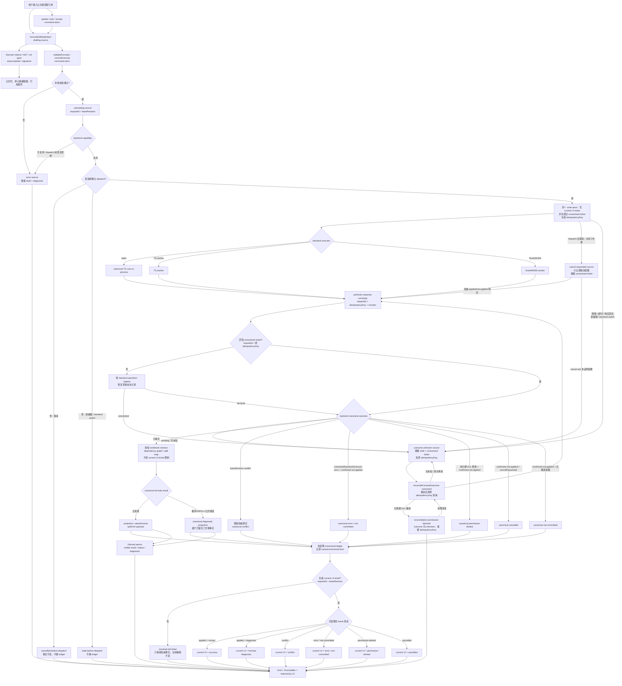
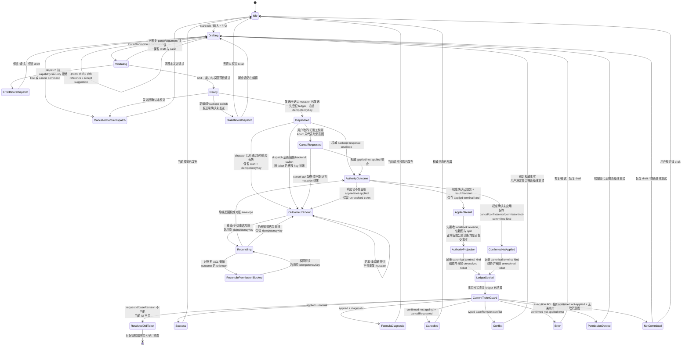
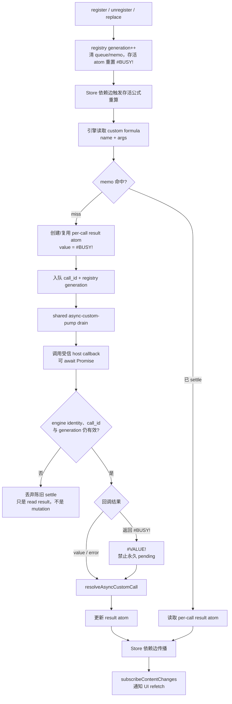

# 在线 Excel 功能对齐：05 公式与计算

> 版本：2026-07-14 HEAD `2feea48` 现状审计与实施排期稿
> 当前工作树架构复核：2026-07-14（含 Wave 8.2 async custom formulas）
> 主交付窗口：2026-08-10 ～ 2026-09-18
> P2 增强窗口：2026-09-07 ～ 2026-10-02
> 估算口径：1 人日 = 1 名工程师 1 个完整工作日；估算包含实现、自测、联调、代码评审和验收，不包含跨组等待时间。

> 架构审查：目标设计以 `@einfach/core` Source / Derived / Command atoms 为唯一前端产品状态核心，backend 保有工作簿持久事实与权威 revision，Solid 只做薄绑定。当前公式编辑、草稿、引用选取和名称管理已有 core 基础，但“公式/名称写入 mutation”仍会先结束编辑再调用 backend，缺统一的 request/revision、取消、stale response 与 outcome reconciliation 状态机；现状是“核心已建、mutation 生命周期未闭环”。这一结论不适用于已落地的 Wave 8.2 异步自定义公式内部 read/settle 契约，两者不得共用一套 ledger 模型。

## 1. 结论

公式能力已有不少可复用资产，但“引擎里有函数”“UI 有组件”和“默认在线 Excel 已完成”是三件不同的事，当前不能按完整实现计数：

- 默认入口为 `vnext-wave5`，可看到公式栏、引用选取、函数自动补全和名称管理器；默认后端却是 `createStaticSpreadsheetBackend`，其公式求值器明确是小型 demo evaluator，只实现基础 A1、少量运算符和 21 个函数，不支持跨 sheet。
- `@einfach/excel-core-ts` 与 Rust/WASM 已经分别具备更完整的解析、依赖、错误值、函数与动态数组能力；TS 函数名审计达到约 500 个，不代表这些能力已在默认入口、自动补全、static 后端和两类 worker 中形成一致闭环。
- 公式编辑现有 `editingSessionAtom`、`editingDraftAtom`、引用选取 atom 和命令 atom，但提交时会先结束编辑，再异步调用 backend；没有统一的 validating/calculating/success/error/cancel/stale 状态，也没有 request/revision 防止旧计算覆盖新编辑。
- 名称管理已有 UI、bounded cache 和 CRUD；static evaluator 不解析名称。Rust engine 与 WASM 桥已支持 `defineName("SQUARE", "=LAMBDA(x,x*x)")`，真实缺口是 `worker-runtime.ts` 仍在 RPC 分支人为拒绝 `defineName/undefineName`，上层又吞掉该 unsupported，因此 UI 仍可能看起来保存成功。
- 动态数组和 `#SPILL!` 在 TS/Rust 引擎中已有基础，默认 static 没有；`IMAGE` 当前只是公式引擎返回的文本哨兵，没有单元格图片渲染、安全策略与取消；“显示公式”、传统 CSE 数组公式、外部工作簿引用、结构化引用均没有产品闭环。
- 同步自定义公式已贯通 backend 端口；Wave 8.2 又已落地异步调用、`#BUSY!` pending、settle、级联调度、call generation 陈旧保护、engine identity guard 与 512 项有界 memo，并有 TS/WASM 双引擎测试。现存 `new Function` 仅是受信宿主的执行机制，不是权限沙箱；缺口是当前信任边界复核、用户源码隔离、远程 provider 与 TTL/手动刷新，不得重建 Wave 8.2 执行链。

因此，P0/P1 的目标不是继续扩充一套 demo evaluator，而是先统一公式契约、状态流、解析/引用改写和三后端基线，让默认入口真实获得可验证的一致能力；结构化引用作为第 6 组 Table P1 的跨组依赖同步交付。P2 主要收口 LAMBDA worker RPC、外部引用、`IMAGE`、iframe 沙箱、远程 provider 与 TTL/手动刷新；已存同步/异步自定义公式执行契约只做 conformance 保护，不重做。

## 2. 范围与基准边界

### 2.1 本计划负责

- 公式输入、公式栏、单元格内编辑、引用选取、编辑状态和提交/取消。
- 运算符、A1/绝对/混合引用、范围、整行整列、跨 sheet 引用、复制和结构变更时的引用改写。
- 函数自动补全、参数签名、插入函数入口、函数目录与主要函数族。
- 错误值、循环引用、依赖图、revision、增量重算、陈旧结果拦截和显示公式。
- 现代函数、LET/LAMBDA、高阶函数、动态数组、溢出区域和传统 CSE 的兼容边界。
- 名称管理、名称解析、范围/常量/LAMBDA 名称和撤销/重做。
- static、TS worker、Rust/WASM worker 的能力声明、黄金用例和一致性门槛。
- `IMAGE`、外部引用、异步/远程/自定义公式的宿主协议、安全、取消和资源限制。
- 结构化引用与第 6 组表格能力之间的接口，不承担表格对象本身的实现。

### 2.2 明确不负责

- **第 9 组“数据分析”完全延后**：模拟分析、方案管理器、单变量求解、分析工具库、预测工作表、数据透视等不进入任何阶段。
- **第 16 组“打印”完全延后**：打印公式、分页、PDF、页眉页脚和打印区域均不进入本排期。
- VBA、Office Scripts、宏录制、XLL/COM 插件、DDE/RTD 不在浏览器公式运行时基线内，本计划不排期实现或兼容执行。
- `WEBSERVICE`、`FILTERXML`、`STOCKHISTORY` 等网络/服务函数不直接开放浏览器网络访问。P2 只定义受控 provider 协议和 capability；没有明确授权、域名策略与取消能力时返回结构化“不支持”，不得静默执行。
- 表格创建、表格样式、列身份、表格增删行等归第 6 组；本组只消费冻结后的表格 schema/event 契约并实现公式解析、依赖和重写。
- 本文档只制定后续实施计划，不修改现有源码。

## 3. 审计口径

状态说明：

- `已实现`：默认可达链路可用，行为完整且有对应自动化证据。
- `部分实现`：已有模型、组件、某个后端或测试，但未形成默认入口的跨层闭环。
- `未实现`：没有用户可用闭环，或只有占位返回。
- `存在风险`：路径可运行，但安全、正确性或一致性不满足生产要求。
- `测试证据`：已有自动化只证明某条基础路径可运行；它本身不等于该功能已形成产品闭环。

源码与现有测试是现状依据；proposal、handoff 和 README 只作线索。尤其不能把存在组件、类型、函数名清单或测试桩判为完整实现。

## 4. 逐功能现状与证据

| 功能域        | 功能点                                           | 当前状态                     | 现状与证据                                                                                                                                                                                                                     | 目标优先级             |
| ------------- | ------------------------------------------------ | ---------------------------- | ------------------------------------------------------------------------------------------------------------------------------------------------------------------------------------------------------------------------------ | ---------------------- |
| 默认可达性    | 默认打开公式主链路                               | 部分实现                     | `solid/excel/src/App.tsx` 默认 tab 为 `vnext-wave5`；`VNextWave5Demo.tsx` 挂载 Toolbar、FormulaBar、Grid、Name Manager、FormulaAutocomplete                                                                                    | P0                     |
| 默认可达性    | “公式”菜单/插入函数入口                          | 未实现                       | menu top-level 只有 file/edit/insert/format/data/view/help；Wave 5 未挂载 `SpreadsheetMenuBar`，也未找到可达的 Insert Function/fx 对话框                                                                                       | P0/P1                  |
| 输入编辑      | 公式栏与单元格公式编辑                           | 部分实现                     | `editingSessionAtom`、`editingDraftAtom`、start/commit/cancel 命令已使用 Einfach；状态只覆盖 idle/drafting/cancelled                                                                                                           | P0                     |
| 输入编辑      | 提交、校验、计算、失败、取消、陈旧结果           | 未实现                       | `edit-dispatch.ts` 先结束编辑，再 await `backend.setCellInput`；没有 requestId、Abort、revision guard 或统一错误态                                                                                                             | P0                     |
| 引用选取      | 编辑时点击单元格/拖选范围                        | 部分实现                     | `formula-reference` 可识别公式上下文并写回 A1/range；序列化仅当前 sheet，未保留 sheet qualifier 与绝对维度                                                                                                                     | P0                     |
| 词法/运算符   | `+ - * / ^`、比较、一元、括号                    | 部分实现                     | static evaluator 支持基础集合；TS/Rust 更完整；尚无跨后端共同 grammar/version 门槛                                                                                                                                             | P0                     |
| 词法/运算符   | `&`、`%`、数组字面量、range operators、spill `#` | 部分实现                     | UI 的触发字符包含 `&`/`%`，static tokenizer/evaluator 不完整；TS parser 已覆盖更多语法，默认链路未接入                                                                                                                         | P0/P1                  |
| 引用          | A1、`$A$1`、`A$1`、`$A1`                         | 部分实现                     | 引擎可解析的能力不一致；当前 UI 引用选取/clipboard 改写不能完整保持绝对/混合引用                                                                                                                                               | P0                     |
| 引用          | 整行/整列、quoted sheet、跨 sheet                | 部分实现                     | TS parser/dependency 已有支持，static 明确不支持 cross-sheet；默认入口因此不能算完成                                                                                                                                           | P0                     |
| 引用          | 外部工作簿引用                                   | 未实现                       | 未发现 `[Book.xlsx]Sheet1!A1` 的可用解析、解析器、缓存、权限或失效闭环                                                                                                                                                         | P2                     |
| 引用改写      | 复制/粘贴、填充时相对引用位移                    | 部分实现                     | UI clipboard 存在公式引用位移，但不是共享 AST rewrite，复杂字符串、绝对维度和新语法存在损坏风险                                                                                                                                | P0                     |
| 引用改写      | 插删/移动行列、sheet rename/delete               | 部分实现                     | Rust 有更多结构改写能力；TS core 缺少完整结构操作，三后端未共享同一重写结果                                                                                                                                                    | P0/P1                  |
| 函数输入      | 自动补全                                         | 部分实现                     | Wave 5 已挂载；UI registry 只有 21 个函数，结果最多显示 8 条，与引擎约 500 函数目录不一致                                                                                                                                      | P1                     |
| 函数输入      | 参数签名/当前参数提示                            | 部分实现                     | caret-local parser 与 signature derived atom 已存在；对嵌套、转义字符串、结构化引用、locale 分隔符覆盖不足                                                                                                                     | P1                     |
| 函数输入      | 插入函数、分类、搜索、参数表单                   | 未实现                       | 未找到默认可达的完整 Insert Function/fx 对话框                                                                                                                                                                                 | P1                     |
| 主要函数族    | 数学、统计、逻辑、文本、查找引用、日期时间       | 部分实现                     | static 只实现 21 个常用函数；TS/Rust 已广泛实现，仍有 locale、格式和个别语义差异                                                                                                                                               | P0/P1                  |
| 现代函数      | XLOOKUP/XMATCH、LET、LAMBDA、高阶函数            | 部分实现                     | TS core 有现代函数与 LAMBDA 路径；Rust engine 与 WASM 桥已支持 LAMBDA name binding，真实缺口是 Rust/WASM `worker-runtime.ts` 的 `defineName/undefineName` RPC 人为拒绝，默认 static 仍未覆盖                                   | P1/P2                  |
| 动态数组      | FILTER/SORT/UNIQUE/SEQUENCE、数组返回            | 部分实现                     | TS/Rust 有数组求值与测试；static 没有，默认 UI 的结果投影/编辑边界未形成共同验收                                                                                                                                               | P1                     |
| 动态数组      | spill、`#SPILL!`、spill 引用                     | 部分实现                     | worker TS 有 bounded spill lookup，TS/Rust 有测试；三后端、错误码、结构变更与历史语义尚未统一                                                                                                                                  | P1                     |
| 传统数组      | Ctrl+Shift+Enter/CSE                             | 未实现                       | 未发现 CSE 输入手势、array-formula 范围元数据与不可局部编辑的产品语义；动态数组不能替代 CSE 兼容                                                                                                                               | P1 边界/P2 兼容        |
| 名称          | 名称管理器 UI 与 CRUD                            | 部分实现                     | Wave 5 工具栏可达；`named-ranges` 使用 Einfach 且 cache 上限 500；UI CRUD 有 E2E                                                                                                                                               | P1                     |
| 名称          | 范围/常量/LAMBDA 名称参与求值                    | 部分实现                     | worker backend 会向引擎 `defineName`；static evaluator 不解析名称；Rust/WASM 引擎能力已存在，但 worker RPC 拒绝后上层可吞掉 `NAME_BINDING_UNSUPPORTED`，导致 UI 假成功                                                         | P1/P2                  |
| 错误          | Excel 错误值与 async pending 展示                | 部分实现                     | worker TS 列出 `#DIV/0!`、`#N/A`、`#REF!`、`#VALUE!`、`#NAME?`、`#NUM!`、`#SPILL!`、`#CALC!` 等；`#BUSY!` 是 Wave 8.2 保留的异步 pending 令牌，不是容量/配额错误；static 常退化为 `#ERROR!`                                    | P0                     |
| 错误          | 循环引用检测与诊断                               | 部分实现                     | static 返回 `#CYCLE!`；worker 路径另有 `#CIRCULAR!` 检测，错误码和提交语义不一致                                                                                                                                               | P0                     |
| 查看          | 显示公式                                         | 未实现                       | 现有 `toggle-formula-bar` 只控制公式栏；未找到工作表级 Show Formulas 投影模式                                                                                                                                                  | P1                     |
| IMAGE         | `IMAGE()` 求值与图片显示                         | 部分实现                     | TS/Rust 可返回 `<IMAGE: ...>` 文本哨兵；Solid 网格没有安全图片投影、加载/失败/取消闭环                                                                                                                                         | P2                     |
| 自定义公式    | 同步注册、backend 转发与调用                     | 已实现（宿主接口）/ 存在风险 | backend 端口与 TS/WASM worker 宿主已贯通；`new Function('args', source)` 只允许受信宿主源，它不提供用户源码沙箱、CPU/内存预算或权限隔离                                                                                        | 当前安全门禁 + P2 沙箱 |
| 自定义公式    | Promise 异步调用、pending、settle 与失效         | 已实现（宿主接口）/ 存在风险 | Wave 8.2 已有 `(name,args)` memo、`#BUSY!` pending、shared pump、call id/generation 和 engine identity guard、级联结算、512 项 cap 及 TS/WASM 测试；返回 `#BUSY!` 会降级为 `#VALUE!`；风险仅指受信宿主边界，不代表执行机制缺失 | 保持现契约；P2 只增强  |
| 远程 provider | 网络读、取消、重试、TTL/手动刷新                 | 未实现                       | 尚无受控 remote provider 契约；它与 Wave 8.2 memoize-until-registry-change 是两套契约，只有未来已 dispatch 的副作用 mutation 才使用 unresolved ledger/idempotency/reconciliation                                               | P2                     |
| 结构化引用    | `Table1[Column]`、`[@Column]`                    | 未实现                       | TS 计划文档明确 v1 不含 structured refs/implicit intersection；需第 6 组表格 schema                                                                                                                                            | P1                     |
| 依赖与重算    | 依赖图、增量重算、revision                       | 部分实现                     | TS workbook 有 point/range/cross-sheet/name/spill dependency；static 只有递归 Set cycle check，不是工作簿依赖图                                                                                                                | P0                     |
| 测试          | 默认 Wave 5 基础公式 E2E                         | 测试证据                     | `formula-flow.spec.ts` 覆盖基础公式、21 函数、引用选取、autocomplete、commit/cancel/history；这只证明已有基础路径，不代表公式产品能力完整                                                                                      | P0 门禁                |
| 测试          | worker/TS/Rust 公式测试                          | 部分实现                     | formula-bar、formulas-wasm、worker-ts、lambda、core function/array tests 均存在；缺少同一 fixture 三后端强制双/三跑                                                                                                            | P0                     |

## 5. 当前 21 函数与“500 函数”应如何解释

默认自动补全和 static evaluator 当前实际对齐的是以下 21 个函数：

`SUM`、`AVERAGE`、`COUNT`、`MIN`、`MAX`、`IF`、`SUMIF`、`COUNTIF`、`ABS`、`ROUND`、`CONCAT`、`AND`、`OR`、`NOT`、`LEN`、`LOWER`、`UPPER`、`TRIM`、`SQRT`、`MOD`、`VLOOKUP`。

`vanilla/excel-core-ts/docs/FUNCTION_QUALITY_2026-06-05.md` 记录 TS engine 的函数名与 Rust 达到 500/500 名称对齐，这是重要资产，但上线判断必须同时满足四项：

1. parser 能正确解析该函数所需语法；
2. static/TS worker/Rust worker 的 capability 与语义明确；
3. UI catalog、参数元数据、错误值、locale 和格式行为可用；
4. 同一黄金 fixture 跨后端通过。

已知差异包括 `TEXT`/`DOLLAR`/`FIXED` 的 locale/格式、`PHONETIC` 元数据、`DATEDIF`/`TIME` 的行为和 `RATE` 性能。排期不能用“函数名存在”替代语义验收。

## 6. 优先级与可交付结果

### P0：公式主链路正确且三后端不撒谎

1. 统一 `FormulaCapabilityManifest`、grammar version、function catalog version、错误码、requestId 和 revision 契约。
2. 建立共享 tokenizer/AST/reference rewriter；修复绝对/混合引用、quoted sheet、跨 sheet、字符串转义和复制/结构变化改写。
3. static 后端改为复用 `excel-core-ts` 的 in-process parser/evaluator/dependency 能力；删除或冻结 tiny evaluator，禁止继续扩出第四套语义。
4. 将公式提交建模为 validating → calculating → success/error/cancel/stale；后端失败时保留 draft，不允许旧请求覆盖新 revision。
5. 统一基础运算符、跨 sheet、主要错误值、循环引用、依赖图和增量刷新结果。
6. 在默认 Wave 5 补齐真实可达的公式入口，并让不支持能力显式 disabled/unsupported。

### P1：完成日常公式生产链路

1. 用统一函数目录驱动 autocomplete、签名帮助与 Insert Function；优先完成数学、统计、逻辑、文本、日期时间、查找引用函数族。
2. 名称管理器写入后必须进入实际解析/依赖/重算；范围、常量、LAMBDA 能力按后端准确展示。
3. 动态数组/spill 在三后端形成共同投影、错误、历史、复制和结构变化语义。
4. 增加 Show Formulas；明确 CSE 为导入/兼容语义还是交互式创建能力，不能把动态数组冒充 CSE。
5. 基于第 6 组冻结的 table contract 完成结构化引用与 implicit intersection，并通过 Table rename/resize 联调。
6. 完成默认入口 E2E、跨后端 golden suite、性能门槛和 MCP 浏览器验收。

### P2：增强与受控扩展

1. 接通 Rust/WASM worker 已有的 `defineName/undefineName` RPC，对 LET/LAMBDA/高阶函数做 capability 与双引擎 conformance；不另排 WASM LAMBDA 引擎实现。
2. 外部工作簿引用的 provider、缓存、权限、版本和断链语义。
3. `IMAGE` 的富投影、资源加载、安全、失败、取消和可访问性。
4. iframe 沙箱、远程 provider、TTL/手动刷新及安全测试；不重建 Wave 8.2 的 async drain/settle/memo/陈旧保护。

## 7. 排期与人日

假设主窗口由 3 名工程师并行，P2 由 1.5～2 名工程师继续；下表中的依赖等待不计人日，但会影响日期。P0/P1 合计 63 人日，P2 合计 25 人日，总计 **88 人日**。F9 根据 HEAD 从“引擎开发”下调为 2 人日 RPC 接线，腾出的 4 人日单列为 F14 TS/WASM conformance 缓冲，不挤压已有正确性、状态机或安全门禁，因此与 README 总账保持一致。

已上线 custom 能力的当前信任边界审查前移为 **2026-07-17 硬门禁**：确认只有受信宿主源可到达 `new Function`；若用户/工作簿可注入任意 source，必须在产品 capability 中立即禁用，不等待 09 月 P2 沙箱。该门禁属阶段 0 现状审计的必要输出，不重建执行机制；P2 安全工作仍只面向不受信源码隔离与未来 provider。

跨组前置窗口为 **2026-07-14 ～ 2026-07-24**：公式线先用 5 人日交付最小共享 tokenizer、AST、引用改写和条件公式 evaluator 合同，07-17 完成实现，07-24 完成第 2、3、4 组消费门禁。该工作量从原 F0/F1 中前移，总人日不增加。第 2 组在 07-20～07-23 只能开展非公式元数据、事务壳、transformer 清点、contract harness，或候选 core fixture 集成；所有公式依赖的改写与合并必须等到 07-24 门禁通过。第 2、3、4 组均不得另建临时 parser、regex rewriter 或其他过渡语法实现。

| 编号 | 优先级  | 日期                           | 工作包                     | 交付物                                                                                                              | 人日 |
| ---- | ------- | ------------------------------ | -------------------------- | ------------------------------------------------------------------------------------------------------------------- | ---: |
| F-1  | P0 前置 | 07-14 ～ 07-17；07-24 消费门禁 | 最小共享语法底座           | tokenizer/AST/reference rewrite core、条件公式 evaluator port、golden fixture；供第 2、3、4 组先行消费              |    5 |
| F0   | P0      | 08-10 ～ 08-11                 | 契约与状态基线收口         | capability/grammar/catalog version、标准错误码、request/revision/cancel 协议；合并前置合同反馈                      |    3 |
| F1   | P0      | 08-10 ～ 08-17                 | 共享 parser 与引用改写扩展 | 在 F-1 上补齐完整 A1/绝对/混合/跨 sheet、复制与结构改写、fuzz fixture                                               |    6 |
| F2   | P0      | 08-13 ～ 08-20                 | static 收敛与后端基线      | static 复用 TS core；static/TS/Rust 基础公式 golden matrix                                                          |    8 |
| F3   | P0      | 08-18 ～ 08-21                 | 生命周期与默认可达         | validating/calculating/error/cancel/conflict/stale、canonical formula diagnostic、错误保留 draft、默认入口          |    5 |
| F4   | P1      | 08-24 ～ 08-28                 | 函数输入体验               | 统一 catalog、autocomplete、signature、Insert Function、名称建议                                                    |    6 |
| F5   | P1      | 08-24 ～ 08-31                 | 主要函数族语义             | 常用函数跨后端 fixture；locale/format/性能差异分级                                                                  |    6 |
| F6   | P1      | 08-27 ～ 09-01                 | 名称闭环                   | range/value/LAMBDA 名称解析、依赖、撤销、能力门禁                                                                   |    5 |
| F7   | P1      | 08-31 ～ 09-03                 | 数组与查看                 | dynamic array、spill、Show Formulas、CSE 兼容边界                                                                   |    8 |
| F8   | P1      | 09-01 ～ 09-04                 | 发布门槛                   | unit/integration/E2E/MCP/性能、迁移和回滚说明                                                                       |    5 |
| F9   | P2      | 09-07 ～ 09-08                 | LAMBDA worker RPC 接线     | 删除 `worker-runtime.ts` 人为拒绝，接通引擎/WASM 已有 `defineName/undefineName`；修正 capability 和 UI 假成功       |    2 |
| F14  | P2 缓冲 | 09-09 ～ 09-11                 | TS/WASM conformance 缓冲   | LAMBDA/name/custom async 双引擎 fixture、错误归一、回归与差异收口；不新建执行机制                                   |    4 |
| F10  | P2      | 09-10 ～ 09-18                 | 外部引用                   | external reference AST、provider、缓存、权限、断链/刷新                                                             |    6 |
| F11  | P1      | 09-07 ～ 09-18                 | 结构化引用                 | table AST、resolver、dependency、rewrite、autocomplete 联调；09-11 首轮 fixture 贯通，09-18 随第 6 组 Table P1 完成 |    6 |
| F12  | P2      | 09-21 ～ 09-25                 | IMAGE                      | rich cell projection、加载/失败/取消、CSP/URL/a11y                                                                  |    5 |
| F13  | P2      | 09-24 ～ 10-02                 | 沙箱与远程 provider        | iframe 沙箱、remote provider、TTL/手动刷新、权限/配额/取消与安全测试；明确不重做 Wave 8.2 async custom 执行链       |    8 |

### 7.1 里程碑

| 里程碑                              | 日期       | 验收含义                                                                                             |
| ----------------------------------- | ---------- | ---------------------------------------------------------------------------------------------------- |
| M-0 现有 custom 信任边界门禁        | 2026-07-17 | 确认 `new Function` 仅受信宿主可达；无沙箱的用户源码通路必须禁用 capability，不等待 P2               |
| M-1 跨组语法底座                    | 2026-07-24 | 第 2、3、4 组以同一 tokenizer/AST/reference/evaluator fixture 通过消费门禁，禁止并行临时解析器       |
| M0 契约冻结                         | 2026-08-12 | 状态、错误码、revision、capability、三后端 fixture schema 冻结                                       |
| M1 P0 完成                          | 2026-08-21 | 默认入口基础公式和跨 sheet 可用；错误/取消/conflict/stale 与已提交公式诊断流转正确；三后端基础集一致 |
| M2 P1 功能冻结                      | 2026-09-03 | catalog/Insert Function、名称、数组、Show Formulas 完成                                              |
| M3 基础 P0/P1 发布门槛              | 2026-09-04 | 除结构化引用联调外的 CI、E2E、MCP、性能和回滚方案通过                                                |
| M4 结构化引用 P1 验收 / P2 接口冻结 | 2026-09-18 | Table rename/resize 联调通过；external/remote provider 契约冻结；Wave 8.2 契约保持不变               |
| M5 P2 验收                          | 2026-10-02 | capability-gated 增强项完成；当前 trust-boundary 门禁持续通过，未来用户源码仅经沙箱可达              |

## 8. 分层落点

| 层             | 建议落点                                                                                            | 职责与约束                                                                                                  |
| -------------- | --------------------------------------------------------------------------------------------------- | ----------------------------------------------------------------------------------------------------------- |
| 公式领域核心   | `vanilla/excel-core-ts/src/*`                                                                       | canonical tokenizer/parser/AST、引用重写、函数目录、依赖图、in-process static evaluator；不得依赖 Solid/DOM |
| Rust 公式核心  | Rust workbook/formula modules                                                                       | 对齐已承诺的 grammar/function/error/spill fixture；能力缺失显式返回 unsupported                             |
| UI 状态核心    | `vanilla/spreadsheet-ui-core/src/editing`、`formula-reference`、`formula-functions`、`named-ranges` | 只放 Einfach source/derived/command atoms、纯选择器与命令；不直接访问 DOM                                   |
| backend 契约   | `vanilla/spreadsheet-ui-core/src/backend`                                                           | capability、formula request/result、revision、cancel、projection 和结构化诊断                               |
| static adapter | `solid/excel/src-vnext/adapter/static-backend.ts`                                                   | 同线程调用 canonical TS core；不保留独立 tiny grammar/function 实现                                         |
| worker adapter | `worker-runtime-ts.ts`、`worker-runtime.ts`、`worker-workbook-backend.ts`                           | RPC、Abort、request/revision、capability 握手、错误归一化；不吞掉不支持能力                                 |
| Solid host     | formula bar/autocomplete/grid/menu/name manager                                                     | 订阅 atoms、派发 command、渲染投影与无障碍 UI；业务状态不得使用 `createSignal`                              |
| 测试           | core tests、Solid unit、`solid/excel/e2e`                                                           | 单后端语义、三后端 golden、默认可达 UI、MCP、性能和安全                                                     |

## 9. Einfach 状态设计

### 9.1 Source atoms

建议用一个编辑会话源状态，而不是给每个单元格建 atom：

```ts
type FormulaEditState =
  | { status: 'idle' }
  | {
      status:
        | 'drafting'
        | 'validating'
        | 'calculating'
        | 'dispatched'
        | 'cancel-requested'
        | 'outcome-unknown'
        | 'reconciling'
      requestId: string
      workbookId: string
      sheetId: string
      cell: { row: number; col: number }
      baseRevision: number
      draft: string
      caret: number
      idempotencyKey: string
      diagnostic?: FormulaDiagnostic
    }
  | {
      status:
        | 'success'
        | 'formula-diagnostic'
        | 'error'
        | 'permission-denied'
        | 'not-committed'
        | 'cancelled'
        | 'stale'
        | 'conflict'
      requestId: string
      baseRevision: number
      resultRevision?: number
      idempotencyKey?: string
      outcomeKnowledge?: 'confirmed-not-committed' | 'unknown'
      permissionContext?: 'execution' | 'reconciliation'
      diagnostic?: FormulaDiagnostic
      recoverableDraft?: string
    }

type UnresolvedFormulaTicket = {
  status: 'dispatched' | 'cancel-requested' | 'outcome-unknown' | 'reconciling'
  requestId: string
  workbookId: string
  sheetId: string
  cell: { row: number; col: number }
  baseRevision: number
  draft: string
  idempotencyKey: string
  cancelRequested: boolean
}
```

Source 状态包括：

- `formulaEditStateAtom`：当前 UI 编辑/提交生命周期。
- `formulaUnresolvedTicketsAtom`：以 `requestId` 索引的有界未决票据表。mutation 一旦 dispatch 就必须写入；取消意图、Abort、新编辑或 backend switch 都不能删除票据，只有权威的 applied/not-applied 结论落入终态后才能移除。每张票据冻结原 `idempotencyKey`，供未知结果对账复用。
- `formulaCapabilityAtom`：backend 握手结果，含 grammar/catalog 版本与 feature flags。
- `formulaCatalogVersionAtom`：当前函数元数据版本和 locale。
- `formulaViewModeAtom`：values/formulas 显示模式，工作表或工作簿级别必须先冻结语义。
- 现有 `nameRegistryCacheAtom`、名称编辑器和 draft atoms：保留 bounded 设计。
- `formulaCalculationSummaryAtom`：只保存工作簿级 pending 数、最近 revision 和当前请求摘要，不保存每格计算状态。

`AbortController`、worker port 等不可序列化资源放在命令执行器的有界 request registry 中，以 `requestId` 关联；Abort 后可以释放传输资源，但对应 unresolved ticket 必须继续留在 source atom 中。取消结果必须回写 atom，不能把业务状态藏在局部变量。

### 9.2 Derived atoms

- 当前 draft 的 tokens、AST、active reference span、引用着色和 validation diagnostics。
- autocomplete 列表、当前 signature/argument index、名称/函数混合建议。
- `canCommit`、`isBusy`、`visibleDiagnostic`、`displayFormulaOrValue`。
- 基于 backend projection 的 visible formula results；不把整张 sheet 镜像到 UI store。
- capability-derived 的可用/禁用原因，例如 Rust/WASM worker 尚未接通 LAMBDA `defineName` RPC 时展示明确原因；不得把 adapter 接线缺口误报为引擎不支持。

Derived atom 必须保持纯计算；不发 RPC、不注册 listener、不创建定时器。

### 9.3 Command atoms

- `startFormulaEditAtom`、`updateFormulaDraftAtom`、`moveFormulaCaretAtom`。
- `enterReferencePickAtom`、`pickFormulaReferenceAtom`、`exitReferencePickAtom`。
- `validateFormulaAtom`、`commitFormulaAtom`、`cancelFormulaAtom`、`retryFormulaAtom`、`reconcileFormulaOutcomeAtom`；对账命令必须复用原 `idempotencyKey`，不能重新提交 mutation。
- `acceptFormulaSuggestionAtom`、`openInsertFunctionAtom`、`insertFunctionAtom`。
- `toggleShowFormulasAtom`。
- `create/update/deleteNameAtom`，以及 P2 的 refresh/cancel external、register/unregister custom provider 命令。

命令 atom 负责跨 atom 原子更新和副作用编排；Solid 组件不得直接拼接状态或调用 worker 后再自行猜测成功。

### 9.4 容量、缓存与清理

- **禁止逐单元格 atom**，也禁止按坐标动态创建无界 Provider cache。工作簿单元格、AST、依赖图和 spill 区归 backend engine；UI 只持当前编辑会话与可视投影。
- 函数 catalog 可作为约 500 项的版本化不可变元数据列表；不为每个函数创建 atom。
- 可见建议仍限制为 8 条；查询结果只允许在 framework-agnostic core 使用 `@einfach/core` 的 `createCacheStom` / `createCacheStomById({ maxSize: 32 })`。工厂归属 workbook/session，key 只含稳定标量；workbook/locale/catalog version 变化时精准失效，teardown 时销毁 store、订阅和工厂引用。不得使用“等价缓存”、框架 Provider 或模块级 `Map` 保存业务数据。
- 名称缓存保持最多 500 条；达到上限必须分页、拒绝新增或显示诊断，不能静默截断。
- 最近 validation diagnostics 最多保留 50 个 request；成功投影后清理无恢复价值的 draft。
- Wave 8.2 自定义公式已在引擎内使用 `(name,args)` memo 和 per-call result atom，缓存上限为 512；miss 时 result atom 以 `#BUSY!` 表示尚未 settle，host callback 返回 `#BUSY!` 会降级为 `#VALUE!` 防止永久 pending。`#BUSY!` 只是 pending 令牌，任何容量/并发/配额拒绝都必须使用独立稳定 diagnostic/capability code。
- 现有 custom memo 是 **memoize-until-registry-change**：同名同参在任一 register/unregister/replace 前只执行一次，registry generation 改变时粗粒度清理队列/memo 并把存活 call atom 重置为 `#BUSY!`。现契约没有 TTL 或手动刷新；需要重跑时重新注册。
- Store 依赖边是 custom result 失效与传播的唯一权威；不增加 per-name 或 address→formula 反向索引。未来需要更精细的失效也使用 per-call atom / epoch root，不扫描工作簿。
- 未来 remote provider 另建有界 request registry，不改写上述 custom memo 契约。纯 read/evaluation 请求可按 request/formula revision 取消或丢弃陈旧回包；只有伴随副作用且已 dispatch 的 mutation 才使用 `@einfach/core` 有界 unresolved ledger、原 `idempotencyKey` 与 backend operation registry 对账，必须先接受权威事实、再结算 ledger、最后过 current-ticket guard。
- spill/dependency 结果由引擎按 revision 管理，UI 不复制成长期 Map；可视窗口离开后释放富投影资源。

## 10. 状态与数据流转

本节 10.1/10.2 的 request/idempotency/ledger 状态机只适用于会改变权威工作簿事实的公式提交、名称写入和未来 provider-registration/副作用 mutation。它不适用于 Wave 8.2 自定义公式的内部 read/settle；后者是引擎结果 atom 的 memo/settle 协议，详见 §14。只有“未 dispatch 的 read settle 已失效”才能丢弃；任何已 dispatch mutation 都必须先按 ledger/registry 匹配并接收权威事实，不得用 stale 快捷路径丢弃。

### 10.1 从用户编辑到 UI 投影

这不是组件调用图：图中 source/command/backend revision/derived 分别是状态所有者；旧 request 不能发布到 UI，已 dispatch 且失去权威响应的 unresolved ticket 还必须保留为 outcome-unknown 并完成对账。current-ticket guard 只决定能否更新当前 UI projection，不能拿它丢弃未决票据或猜测 mutation 未提交。



### 10.2 生命周期状态机



状态不允许出现“UI 已 idle，但 backend 仍在无归属地计算”的中间态。mutation 一旦 dispatch，就先登记 unresolved ticket；取消意图、Abort、当前编辑被替换或晚到响应都不能直接删除它。正常响应与对账响应先按 `requestId`/原 `idempotencyKey` 找到票据并接受后端权威结论：确认已提交就把票据终结为 `Success` 或 `FormulaDiagnostic`，确认未应用且存在取消意图才进入 `Cancelled`，仍无法确认则进入 `OutcomeUnknown`。只有在终态已确定后，current-ticket guard 才校验 `requestId + baseRevision + resultRevision` 是否仍可发布；guard 失败只阻止旧响应覆盖当前 projection，不能把已提交结果改判成 `Cancelled` 或把 unresolved ticket 静默丢弃。

`Cancelled` 因而表示“权威确认 mutation 未应用”，而不是“客户端曾发送取消请求”。`StaleBeforeDispatch` 只表示发送闸确认 mutation 尚未发送、但 request/revision 已被更新事实取代；已 dispatch 的旧票据在权威结算后只进入 `ResolvedOldTicket`，不能改判为 stale。`Conflict` 又与二者不同：它保留草稿、刷新权威事实并要求用户决定是否按新基线重试。

一旦 mutation 已 dispatch，断联、超时、响应丢失或仅收到 cancel ack 都不能证明“未提交”，必须进入 `OutcomeUnknown`，保留 draft、request/revision 和原 `idempotencyKey`；重连后只能执行幂等对账，不能重新提交 mutation。对账的权威分支只有“已提交”“确认未提交”“仍未知/再次离线”和“对账期权限撤销”。执行期 ACL 拒绝且确认未应用时进入 `PermissionDenied`；对账期 ACL 撤销则进入 `ReconcilePermissionBlocked` 并保持 outcome unknown，权限恢复后必须沿用原 key 继续对账。canonical 公式诊断属于已提交工作簿事实并产生 revision；只有明确发生在 dispatch 前或由后端权威确认未提交的命令、能力、安全、资源/provider 失败才能进入 `Error`/`NotCommitted`，timeout 不得直接进入 `Error`。

## 11. parser、tokenizer 与引用改写

P0 必须收敛为一个 canonical AST/span 模型，所有复制、填充、结构变化和 sheet 变化都消费同一模型。禁止继续用正则或字符扫描分别实现公式重写。

### 11.1 P0 语法与保真要求

- 字符串和双引号转义、错误字面量、函数/名称 token。
- A1、绝对/混合引用、范围、整行/整列、quoted/unquoted sheet。
- 运算符优先级：算术、拼接、比较、percent、一元、括号和已承诺的 range operators。
- array/spill token 已存在时必须保真；暂未支持的 structured/external token 也不得被复制操作破坏，应返回结构化 unsupported。
- AST 节点保留 source span；未变化片段原样保留，避免格式化整条公式造成不必要 diff。

### 11.2 重写触发点

- copy/paste、drag fill、move range。
- insert/delete/move row/column。
- sheet rename/delete/reorder。
- named range rename/delete。
- table column rename 和 table resize（P1，经第 6 组事件）。

每个重写都输出 `{ formula, diagnostics, changedRefs, dependencyDelta }`，并与原始结构命令进入同一 history transaction；失败时整个事务回滚，不能只移动数据而留下错误引用。

## 12. 与第 6 组结构化引用的接口边界

| 能力        | 第 6 组负责                                           | 第 5 组负责                                     |
| ----------- | ----------------------------------------------------- | ----------------------------------------------- |
| Table 身份  | 稳定 `tableId`、display name、sheet/range             | 在 AST 中保存/解析 table identity               |
| Column 身份 | 稳定 `columnId`、display name、顺序                   | `Table1[Column]`、`[@Column]` token 与 resolver |
| 结构变化    | resize、增删行列、rename 事件及 before/after revision | dependency delta、公式重写、stale 处理          |
| 当前行语义  | 提供 row context/table membership                     | implicit intersection 与 `@` 求值               |
| UI 建议     | 提供可见 table/column catalog                         | autocomplete、signature、着色和插入             |
| 历史        | table mutation transaction id                         | 把 formula rewrite 合并进同一事务               |

接口冻结门槛：最迟 2026-08-14 确定 table/column 稳定 ID、rename/resize event、revision 和 undo transaction contract。若未冻结，F11 顺延，不允许以字符串匹配 table display name 临时上线。

## 13. static / TS worker / Rust-WASM 一致性策略

1. **能力先握手**：每个 backend 返回 grammar version、function catalog version、error model、dynamic-array/name/LAMBDA/external/custom flags。UI 只展示真实可用能力。
2. **static 复用 TS core**：默认 Wave 5 的同线程 backend 调用 canonical TS parser/evaluator/dependency graph；`static-formula-eval.ts` 冻结后删除，不再添加函数。
3. **同一黄金用例三跑**：fixture 包含 workbook/sheets/cells/names/formula、期望 value/error/spill/dependencies 和 revision。CI 分别跑 static、TS worker、Rust/WASM。
4. **基线能力 must-match**：P0/P1 承诺的语法、函数、错误、循环、跨 sheet、名称和 spill 必须完全一致；不允许宽松 snapshot。
5. **增强能力 capability-gated**：Rust engine/WASM 已支持 LAMBDA name binding；在 `worker-runtime.ts` 的 `defineName/undefineName` RPC 接通且双引擎 fixture 通过前，UI/adapter 返回统一“worker 接线未就绪” unsupported，不得误报为引擎不支持，也不得让 Name Manager 假成功。
6. **错误码归一化**：统一 `#CYCLE!`/`#CIRCULAR!` 等内部差异，对用户输出和 diagnostic code 建立一对一映射；公式错误与命令失败分开建模。`#BUSY!` 单列为 async pending 令牌，只能在等待 settle 期间投影，不得映射为并发、容量、quota 或 capability 错误；callback 返回它时按现契约降级为 `#VALUE!`。
7. **revision 防倒退**：response 必须带 requestId、baseRevision、resultRevision。对已 dispatch mutation，adapter 先按原 key 匹配 ledger/registry；`Applied` 必须幂等接收 canonical workbook revision、dependency graph、spill map 和 projection facts，再结算 ledger，最后才以 current UI ticket 决定是否发布当前编辑 UI。revision 比较只阻止旧 projection 倒退，不能丢弃已提交事实。
8. **差异登记**：locale、格式、精度、随机/volatile 函数、日期 serial 和性能差异进入机器可读 allowlist，并有 owner/截止日期；不得永久 `skip`。

## 14. 异步、远程、自定义公式的安全与取消

这里必须区分两类已有/未来契约：Wave 8.2 custom 是已实现的引擎 read/settle 契约；remote provider 是 P2 尚未实现的网络与权限契约。两者不共享 request ledger，也不能互相改写失效规则。

### 14.1 已实现：Wave 8.2 custom 状态流转

同步与异步 custom formula 已经贯通 backend 端口。异步路径使用引擎内的 per-call result atom 与 Store 依赖边；Solid host 只负责根据 core/backend 投影渲染，不保存每个公式调用状态。



该状态流的 load-bearing 规则是：

- memo key 为 `(name,args)`；同名同参在任一 registry change 前只执行一次，目前无 TTL/手动刷新。
- `#BUSY!` 只表示 result atom 尚未 settle；现有 512 项 cap 会对无依赖、无订阅的 result atom 做 best-effort sweep。若未来仍需显式拒绝容量或 quota，使用独立 diagnostic，不冒用 `#BUSY!`。
- call id/generation 保护 registry 变更，engine identity guard 保护 init/restore 后引擎替换；这些 guard 可丢弃陈旧的纯 read settle，不推导“已 dispatch mutation 未提交”。
- Store 依赖边是唯一失效权威；registry invalidation 故意粗粒度，不新建 per-name 或 address→formula 反向索引。
- F13 不重写本图的 enqueue/drain/await/settle/cascade 链；只在其外围增加不受信源码隔离、remote provider 与新刷新策略。

### 14.2 契约分界

| 维度       | 现有 Wave 8.2 custom read/settle                                | 未来 remote provider 纯 read/evaluation                                       | 未来 remote provider 副作用 mutation                                                                  |
| ---------- | --------------------------------------------------------------- | ----------------------------------------------------------------------------- | ----------------------------------------------------------------------------------------------------- |
| 状态权威   | backend engine 的 per-call result atom + Store 依赖边           | backend/provider 返回的 typed result；`@einfach/core` 仅保存当前产品请求摘要  | backend 持久事实、workbook revision 与 operation registry；`@einfach/core` 保存有界 unresolved ledger |
| 身份       | `(name,args)` + call id + registry generation + engine identity | `requestId + formulaCell + formulaRevision + providerVersion`                 | `requestId + 原 idempotencyKey + baseRevision`                                                        |
| pending    | `#BUSY!` 仅为引擎 pending 令牌                                  | 可投影 pending；超限必须是独立 diagnostic                                     | `dispatched/outcome-unknown/reconciling`；不用 `#BUSY!` 表示 operation 配额                           |
| 失效/取消  | registry generation 或 engine identity 不匹配可丢弃陈旧 settle  | 公式/依赖/provider version 变化可 abort；旧 read result 不覆盖当前 projection | dispatch 后 abort 只是取消意图；响应不得按 stale 丢弃，必须先对账权威 outcome                         |
| cache/刷新 | memoize-until-registry-change；无 TTL/手动刷新                  | 只缓存声明为纯函数的结果；可设有界 LRU/TTL 与手动刷新                         | operation registry 存幂等结果，不把 mutation 当作纯函数 memo                                          |
| 对账       | 无 UI mutation ledger；settle 仅更新引擎 result atom            | 无 mutation ledger；丢弃陈旧 read response 即可                               | 按原 key 查 operation registry；先接收 canonical facts，再结算 ledger，最后 current-ticket guard      |

### 14.3 安全门禁

- **当前门禁（2026-07-17）**：`new Function` 不是权限沙箱，仅可执行受信宿主注册的 source。审查 backend 端口、导入、协作和 UI 入口的可达性；只要未受信工作簿/用户源码可达，就立即禁用 custom source capability。
- **P2 沙箱**：不在主线程、worker global 或宿主闭包中直接执行用户源码。使用无 `allow-same-origin` 的 sandboxed iframe + structured-clone `postMessage`、受限 DSL，或具备 CPU/内存配额的隔离运行时。
- provider manifest 声明函数名、参数/返回 schema、纯度、volatile、网络需求、权限、timeout 和版本。网络只能通过宿主代理；默认拒绝，显式 allowlist 域名、方法、响应大小、重定向和凭据策略。
- 禁止访问 DOM、cookies、localStorage、任意 import、文件系统和 worker global。URL、凭据和错误消息必须脱敏，审计日志不记录公式中的密钥。
- timeout、quota、permission denied、provider unavailable 与公式错误使用不同稳定 diagnostic code；不得把任何一项映射成 `#BUSY!`。

### 14.4 未来 remote provider 的取消与一致性

- 每次纯 read/evaluation 调用携带 `requestId + workbookId + formulaCell + formulaRevision + providerVersion + AbortSignal`。公式、依赖、provider version 变化或工作簿关闭时 abort；陈旧结果不覆盖 cell/projection/cache。
- 只缓存声明为纯函数的结果；key 包含 provider version、normalized args、权限上下文和 locale，使用有界 LRU/TTL，且手动刷新是明确 command，不是渲染副作用。
- 若 provider 协议会 dispatch 副作用 mutation，必须在发送前向 `@einfach/core` 有界 unresolved ledger 登记原 `idempotencyKey`；backend 持久 operation registry 与 canonical outcome。dispatch 后 timeout/断联/取消进入 `outcome-unknown`，绝不按 stale 删除。
- 对账必须复用原 key；权威回包先更新 backend workbook revision/事实投影，再结算 ledger，最后 current-ticket guard 才决定是否更新当前编辑 UI。

## 15. `IMAGE`、CSE 和外部引用的产品语义

### 15.1 `IMAGE`

- engine 输出 typed `ImageFormulaValue`，不得再让 UI 解析 `<IMAGE: ...>` 字符串。
- projection 包含 URL/alt/sizing mode/requestId/status；Solid 网格负责 lazy load、占位、错误和 a11y。
- URL 使用 https、allowlist/代理、内容类型和大小限制；禁止 `javascript:`、本地文件和任意 data URI。
- 滚出可视区、公式变化或工作簿关闭时取消加载并释放对象 URL；不得形成逐单元格无界资源缓存。

### 15.2 CSE

- P1 冻结兼容策略：至少能识别导入的 legacy array-formula range，整块展示/选择，禁止只编辑其中一个单元格，并提供“迁移为动态数组”说明。
- 若要支持新建，P2 增加 Ctrl+Shift+Enter command、array range metadata、整块 history 和跨后端 fixture；没有元数据前不得仅把按键映射成普通 Enter。

### 15.3 外部引用

- AST 分离 workbook locator、sheet 和 cell/range；display name 不作为唯一身份。
- provider 返回版本/etag、权限和 last refreshed；断链仍保留公式文本与最近值，并显示明确 stale/permission/broken-link 状态。
- 刷新是显式 command，可取消、可审计、受并发/响应大小限制；不在渲染或 derived atom 中发网络请求。

## 16. 测试、E2E、MCP 与性能

### 16.1 单元与属性测试

- 所有 atom 测试使用独立 `createStore()`，覆盖 drafting → validating → calculating → dispatched → success/error/permission/cancel/stale，以及 outcome-unknown → reconciling 的全路径。
- tokenizer/parser 对 strings、escaped quotes、sheet names、absolute refs、arrays、错误值、names 做 round-trip/property/fuzz。
- reference rewriter 对 copy/fill/insert/delete/move/rename 做表驱动用例，验证 untouched spans 保真和 dependency delta。
- 函数按 family 建 golden fixtures，特别覆盖空值、错误传播、日期 serial、locale、精度、数组和 volatile。
- 依赖图覆盖 point/range/cross-sheet/name/spill、循环、diamond dependency 和 revision invalidation。
- 保持 Wave 8.2 现契约 conformance：覆盖 `#BUSY! → settle`、同名同参只执行一次、registry change 重置/陈旧 settle 丢弃、engine identity guard、级联 drain、512 项 cap sweep 及 callback 返回 `#BUSY! → #VALUE!`；不为测试新建另一套 async 运行时。

### 16.2 adapter 与集成测试

- 同一 fixture 在 `static | worker-ts | worker-wasm` 三种 backend 跑 value/error/formula/spill/deps/revision 比对。
- F14 单列 TS/WASM conformance 缓冲，覆盖 LAMBDA `defineName`、name dependency、sync/async custom 注册、pending/settle 与引擎替换；该缓冲不从提交正确性、ledger/reconciliation 或安全测试中挤出。
- 模拟 out-of-order response、dispatch 后取消再收到已提交响应、worker crash、backend switch、dispatch 后断联/超时/响应丢失；断言取消竞态中的已提交结果进入 success/公式诊断，只有权威确认未应用才进入 cancelled，未知结果保留 unresolved ticket 与同一 idempotency key，并覆盖对账的已提交、确认未提交、仍未知和权限撤销四个权威分支；current-ticket guard 必须阻止旧响应覆盖新编辑。
- 名称 CRUD 必须紧接求值断言；不再只验证对话框文本。
- 现有 custom 测试首先证明只有受信 source 可达；P2 沙箱/remote 测试另行覆盖恶意源码、重入、无限循环、超大返回、网络拒绝、secret 脱敏和取消。远程纯 read 测试可 stale-drop；已 dispatch 副作用 mutation 测试必须走 ledger/idempotency/reconciliation，不得混为同一断言。

### 16.3 默认入口 E2E

- 从默认 `vnext-wave5` 真实操作公式栏、单元格、引用选取、autocomplete、Insert Function、Name Manager 和 Show Formulas。
- 覆盖 A1/mixed/cross-sheet、复制/填充、sheet rename、错误值、循环、spill blocked/clear、撤销/重做。
- 后端矩阵至少覆盖核心 smoke；P0/P1 golden 不允许只在独立 demo 页面通过。
- P1 覆盖 structured refs 与 Table rename/resize；P2 覆盖 external broken/refresh、IMAGE load/fail/cancel、custom capability disabled/enabled。

### 16.4 MCP 前端验收

- 用浏览器 MCP 打开默认 route，完成输入、跨 sheet 选取、错误修复、取消、动态数组和名称交互。
- 检查 console error/warning、worker/network 请求、焦点与键盘、ARIA live 状态和截图。
- 对计算中快速二次编辑进行人工竞态验证；截图/DOM 证明最终显示的是新 revision。
- MCP 是发布验收，不替代自动化测试；验收记录写明 backend、build hash、浏览器和日期。

### 16.5 性能门槛

- 约 500 函数 catalog 下 autocomplete 查询 p95 < 10 ms，可见建议始终不超过 8。
- 一般公式 draft 的 parse/derived 更新 p95 < 16 ms；不得在每个键入同步扫描工作簿。
- 主线程公式提交/投影不得出现 > 50 ms long task；重计算在 worker 或分片执行。
- 既有 scale suite 不回退超过 10%；超大 dependency/spill 用例有明确预算和超限错误。
- 长会话反复编辑/取消 1,000 次后，request registry、建议 cache 和 rich projection 资源回到上限内。

## 17. 依赖与风险

### 17.1 外部依赖

| 依赖                 | 所需输入                                                     | 截止日期       | 未满足时处理                                              |
| -------------------- | ------------------------------------------------------------ | -------------- | --------------------------------------------------------- |
| 第 1 组 shell/menu   | 默认入口挂载公式/插入函数命令与快捷键路由                    | 08-21          | P0 保留 toolbar/fx 入口，禁止只在隐藏 demo 验收           |
| 第 3 组编辑/历史     | 单次公式提交、结构变化与引用重写的原子 history transaction   | 08-17          | 暂停结构改写上线，不做半事务                              |
| 第 6 组表格          | stable table/column ID、row context、mutation event/revision | 08-14 接口冻结 | F11 顺延，不做字符串 hack                                 |
| worker/runtime P0    | capability handshake、cancel、request/revision envelope      | 08-12          | 缺口 capability 明确降级；不改写已有 Wave 8.2 shared pump |
| LAMBDA worker RPC    | Rust/WASM 已有 `defineName/undefineName` 能力的 adapter 接线 | 09-08          | F9 未完成前明确降级，不得误报为引擎不支持或让 UI 假成功   |
| i18n/格式            | locale、参数分隔符、日期/数字格式契约                        | 08-24          | 差异进入显式 capability/allowlist                         |
| 现有 custom 安全门禁 | `new Function` 受信宿主可达性审查                            | 07-17          | 只要不受信 source 可达就立即禁用 capability               |
| P2 安全评审          | sandbox/remote/IMAGE provider threat model                   | 09-11          | F12/F13 不进入生产 capability                             |

### 17.2 主要风险

| 风险                               | 影响                             | 缓解措施                                                        |
| ---------------------------------- | -------------------------------- | --------------------------------------------------------------- |
| 把 500 个函数名当 500 个完整函数   | 误报完成度，线上语义不一致       | 按函数族 golden + backend matrix + locale/format 分类验收       |
| 多套 parser/regex rewriter 漂移    | 复制或结构操作静默改坏公式       | canonical AST/span；所有重写入口复用；fuzz/property test        |
| static、TS、WASM capability 不一致 | 默认 demo 假成功或同文件结果不同 | capability 握手、must-match baseline、明确 unsupported          |
| 旧计算覆盖新编辑                   | 用户看到回滚值或丢失公式         | requestId/baseRevision/resultRevision + abort/stale state       |
| spill 与结构操作竞态               | 覆盖用户数据、历史不可恢复       | 引擎事务、occupied check、整块 spill metadata 和 rollback       |
| 现有 `new Function` 信任边界       | 未受信 source 导致代码执行       | 07-17 可达性审查；只允许受信宿主，否则立即禁用 capability       |
| 未来 sandbox/远程网络              | 代码执行、数据泄露、DoS          | 隔离运行时、权限、独立 quota diagnostic、超时、cancel、安全测试 |
| locale/日期/精度差异               | 跨地区工作簿结果变化             | 机器可读差异清单、固定 serial/locale fixture、release gate      |
| 第 6 组接口延迟                    | structured refs 返工             | 08-14 冻结稳定 ID/event；未冻结则顺延 F11                       |

## 18. 完成定义（DoD）

P0/P1 只有同时满足以下条件才算完成：

- 默认 `vnext-wave5` 可操作对应功能，不依赖隐藏 demo 或手工切换 backend 才成立。
- 公式编辑状态真实经过 validating/calculating/dispatched，并可观察 success/error/permission/cancel/stale；dispatch 后取消仍保留 unresolved ticket，权威确认已提交时进入 success/公式诊断、确认未应用时才进入 cancelled，结果未知时进入 outcome-unknown/reconciling 并以原 idempotency key 对账；current-ticket guard 阻止旧响应覆盖新编辑。
- static 不再使用独立 tiny evaluator 扩功能；基础 grammar、跨 sheet、错误、名称和动态数组按约定复用/对齐核心引擎。
- 所有公式业务、表单、loading/error 状态只使用 Einfach；未新增 Solid `createSignal` 保存业务状态。
- 没有逐单元格 atom、无界动态 atom 或无界 Provider cache；Wave 8.2 custom 保持 512 项 cap + memoize-until-registry-change 且不添加 TTL，未来 remote read cache 才需上限、TTL、失效和销毁测试。
- copy/fill/结构/sheet rename 走共享 AST reference rewrite，绝对/混合/quoted sheet/strings 保真。
- UI 函数目录来自版本化 catalog；每个显示为可用的函数均有当前 backend capability 和至少一条黄金语义用例。
- 名称保存后能实际参与求值和依赖；Rust/WASM worker 已有的 LAMBDA 引擎能力经 RPC 正确接通，任何未接通 backend 都不会假成功。
- dynamic array/spill、循环和标准错误有一致的用户输出、structured diagnostic 和跨后端 fixture。
- Show Formulas 完成；CSE 明确实现导入兼容或 capability-gated，文档/UI 不混称动态数组。
- 结构化引用与第 6 组共享稳定 table/column identity 和 mutation event；rename/resize 的解析、依赖与重写在三后端一致。
- 当前 custom 的 07-17 受信宿主门禁通过，Wave 8.2 memo/settle/陈旧保护与 Store 依赖边契约不回退；P2 的 external/IMAGE/sandbox/remote 通过安全评审、取消与资源上限，未达标时默认不可达。
- unit、integration、三后端 golden、默认入口 E2E、MCP、性能与内存门槛全部通过，console 无新增 error/warning。
- Data Analysis 和 Print 没有被顺带实现或计入公式验收。

## 19. 关键证据索引

| 证据                                                                                       | 说明                                                                                         |
| ------------------------------------------------------------------------------------------ | -------------------------------------------------------------------------------------------- |
| `solid/excel/src/App.tsx`                                                                  | 默认 tab 为 `vnext-wave5`                                                                    |
| `solid/excel/src-vnext/demos/VNextWave5Demo.tsx`                                           | 默认使用 static backend，并挂载公式栏、autocomplete、名称管理器和 Grid                       |
| `solid/excel/src-vnext/provider/edit-dispatch.ts`                                          | 当前 commit 先结束编辑再 await backend，缺少统一 pending/cancel/stale                        |
| `vanilla/spreadsheet-ui-core/src/editing/index.ts`                                         | 当前编辑 source/command atoms 与有限状态                                                     |
| `vanilla/spreadsheet-ui-core/src/formula-reference/index.ts`                               | 引用触发、token range、pick command 与当前 A1/range 序列化                                   |
| `vanilla/spreadsheet-ui-core/src/formula-functions/registry.ts`                            | 默认自动补全的 21 个函数                                                                     |
| `vanilla/spreadsheet-ui-core/src/formula-functions/parse.ts`                               | 当前 caret-local 函数/参数解析                                                               |
| `solid/excel/src-vnext/adapter/static-formula-eval.ts`                                     | tiny static evaluator、有限运算符/函数、无 cross-sheet                                       |
| `solid/excel/src-vnext/adapter/worker-runtime-ts.ts`                                       | TS engine worker；使用共享 pump 处理 sync/async custom host 路径                             |
| `solid/excel/src-vnext/adapter/worker-runtime.ts`                                          | Rust/WASM worker 使用共享 async custom pump；当前在 RPC 层人为拒绝 `defineName/undefineName` |
| `solid/excel/src-vnext/adapter/async-custom-pump.ts`                                       | TS/WASM 共享 drain/await/settle/级联编排和 engine identity guard                             |
| `solid/excel/src-vnext/adapter/worker-workbook-backend.ts`                                 | 名称向 engine 转发；当前会吞掉 worker RPC 人为产生的 `NAME_BINDING_UNSUPPORTED`              |
| `vanilla/spreadsheet-ui-core/src/named-ranges/index.ts`                                    | 名称 atom、命令与 max 500 cache                                                              |
| `vanilla/excel-core-ts/src/parser/*`、`src/eval/*`、`src/deps.ts`                          | TS parser、函数、数组、名称与 dependency graph 基础                                          |
| `vanilla/excel-core-ts/docs/FUNCTION_QUALITY_2026-06-05.md`                                | 500/500 函数名审计及已知语义/locale 缺口                                                     |
| `rust/excel-core/src/CUSTOM_FORMULAS.md`                                                   | custom registry 粗粒度失效、Store 依赖边与 Wave 8.2 async memo/pending/settle/cap/安全契约   |
| `rust/wasm/src/lib.rs`、`rust/excel-core/src/workbook.rs`                                  | WASM 出入口与 engine 已支持 async custom、`defineName` 和 LAMBDA name binding                |
| `solid/excel/test/excel-core-ts-custom-formulas.test.ts`、`vnext-custom-formulas.test.tsx` | TS/WASM custom formula 注册、async pending/settle、陈旧保护与级联测试证据                    |
| `solid/excel/e2e/formula-flow.spec.ts`                                                     | 默认 Wave 5 基础公式、引用、autocomplete、编辑历史测试                                       |
| `solid/excel/e2e/formulas-wasm.spec.ts`、`formula-bar.spec.ts`                             | WASM/worker 基础公式与错误测试                                                               |
| `solid/excel/e2e/toolbar-name-manager.spec.ts`、`vnext-worker-ts-lambda.spec.ts`           | 名称 UI CRUD 与 TS worker LAMBDA 路径测试                                                    |
