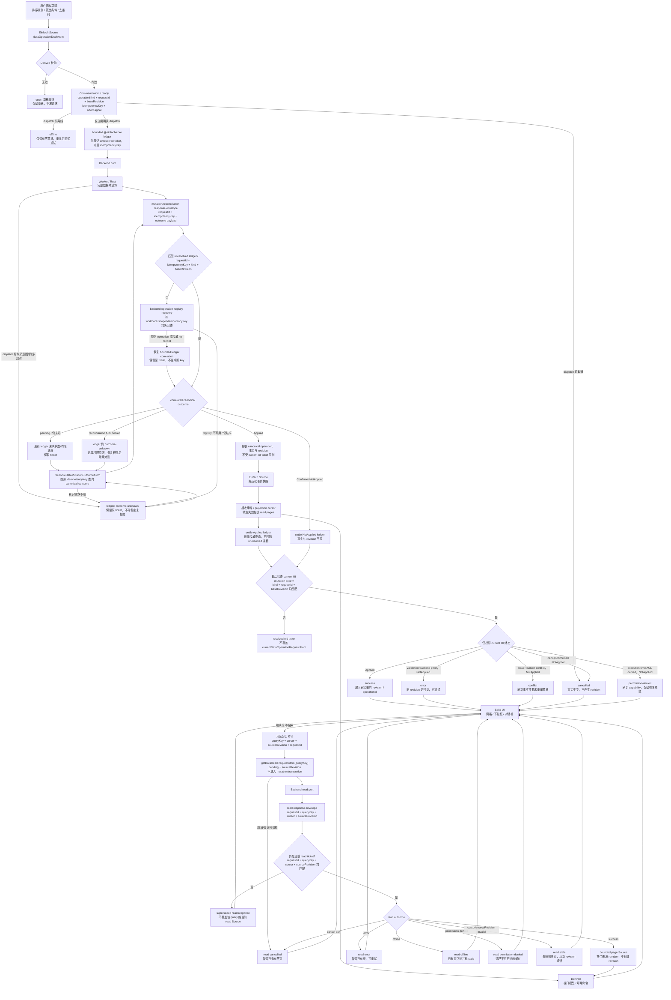
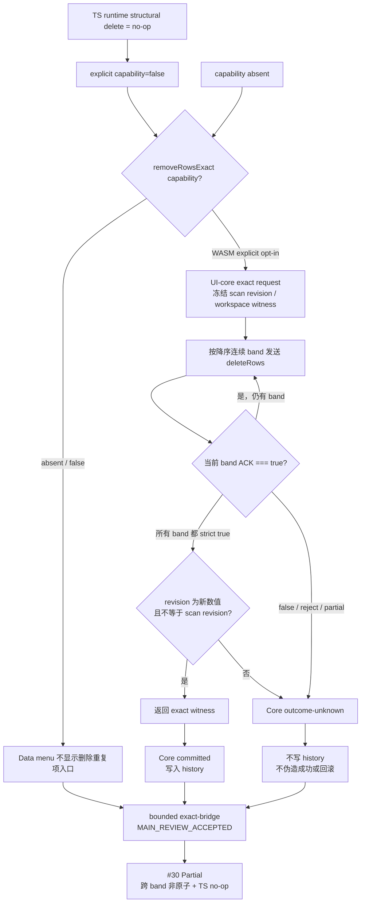
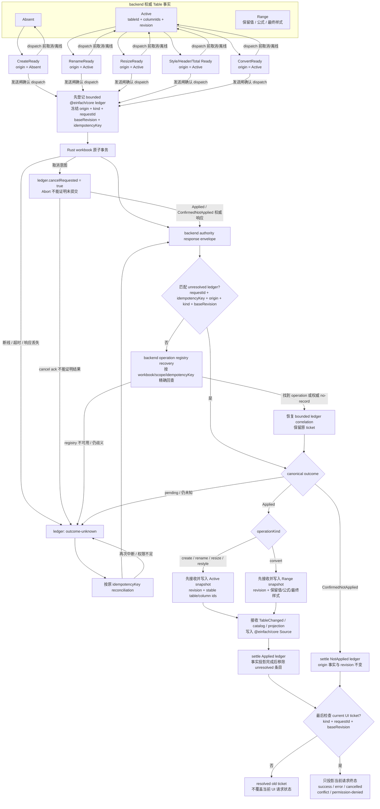

# 06｜表格与数据管理排期

> 基线日期：2026-07-13
>
> 当前工作树架构复核：2026-07-14
>
> 实施窗口：2026-08-10 ～ 2026-10-02
>
> 范围：排序、筛选、删除重复项、Excel Table、分级显示与汇总、合并计算、切片器
>
> 明确延后：数据分析、打印

> 架构审查：目标设计以 `@einfach/core` Source / Derived / Command atoms 为唯一前端产品状态核心，筛选、排序、Table 和删除重复项的持久事实由 backend/Rust 掌握。当前筛选下拉仍以 8 处 Solid `createSignal` 保存搜索、勾选和条件草稿，筛选/排序权威 overlay 仍有主线程 host `Map`，删除重复项预览仍保存完整 `DisplayCell[]`，因此本组尚未以 core 完整收口；P0 必须先迁移草稿、统一 command ticket，并以后端 revision 投影替换 host 权威状态。

## 1. 结论

当前不是“数据功能已经完成、只差补入口”的状态。

- 默认 `vnext-wave5` 的工具栏可以进入单列排序与筛选，但完整“数据”菜单没有挂载。
- 当前筛选值来自已加载投影，存在值列表不完整风险；筛选/排序的 worker 路径首次仍会读取整列哨兵范围，状态权威也停留在主线程。
- 删除重复项已有 UI-core、Solid 对话框、静态路径与显式 capability gate。WASM exact bridge 只有在每个降序连续 band 都严格 ACK `true` 且返回新的数值 revision 时才提交；TS runtime 的结构删除仍是 no-op，所以 capability 为 `false`、入口隐藏。预览仍在主线程同步扫描完整输入，跨 band 删除也不具备事务原子性，因此 #30 仍是 `Partial`。
- 自定义多级排序、高级筛选、Excel Table 对象、结构化引用、数据分级汇总、与通用大纲的组合、合并计算和切片器均没有可交付实现。
- `SUBTOTAL` 公式函数已经存在，不等于“数据 > 分类汇总”功能已经实现；后者还需要插入汇总行、接入第 2 组通用大纲层级、处理隐藏/筛选行语义。

当前工作树另有一批对话框状态迁移 diff，主 agent 的结论为 `MainReview → Rework`，不能计入上述完成度。以数据验证为例，`validationRuleEditorAtom` 与 `validationRuleFormAtom` 同时保存可编辑规则；在编辑 A 时直接打开 B，form 未按新 target 重建，可能把 A 的规则提交到 B。异步请求和聚焦流程仍由 Solid 组件持有。该批次必须先消除双状态源、补 reopen/race 测试并把异步状态机下沉 core，才可进入实现统计。

因此本组按三段推进：

1. **P0，2026-08-10 ～ 08-21**：把现有排序、自动筛选、清除筛选、删除重复项做成默认可达、跨后端正确、可取消且不阻塞主线程的完整能力，并交付自定义多级排序。
2. **P1，2026-08-24 ～ 09-18**：交付 Excel Table 的完整生命周期和与第 5 组协同的结构化引用。
3. **P2，2026-09-21 ～ 10-02**：交付高级筛选、数据分级汇总与第 2 组通用大纲的组合、合并计算和单表切片器基线。P2 各能力按功能块独立验收，不挤占 P0/P1 的质量窗口。

## 2. 状态口径

| 状态        | 判定标准                                                                                    |
| ----------- | ------------------------------------------------------------------------------------------- |
| ✅ 已实现   | 默认界面可达，静态后端与 worker/Rust 行为一致，状态可恢复，有单测、契约测试和真实浏览器 E2E |
| 🟡 部分实现 | 有组件、类型、测试钩子或单后端实现，但入口、语义、持久化、性能或跨后端一致性至少一项不完整  |
| ❌ 未实现   | 没有贯通 UI、状态、后端、持久化与测试的实现                                                 |

组件存在、类型存在、测试能通过自定义事件打开，均不能单独计为“已实现”。

## 3. 功能点与现状证据

|   # | 功能点                          | 当前状态 | 已有证据                                                                       | 主要缺口                                                                                   | 排期 |
| --: | ------------------------------- | :------: | ------------------------------------------------------------------------------ | ------------------------------------------------------------------------------------------ | ---- |
|   1 | 升序、降序                      |    🟡    | 工具栏可打开 `SpreadsheetFilterDropdown`；静态后端与 worker 适配器能计算投影   | worker 首次变更会读取 `0..EXCEL_MAX_SHEET_ROW`；状态留在主线程；无基于 revision 的冲突处理 | P0   |
|   2 | 自定义/多级排序                 |    🟡    | 核心状态可保存多个排序指令，后加入列可作为首关键字                             | 没有添加、删除、重排排序级别的默认 UI，也没有大小写、空值、错误值、稳定性契约              | P0   |
|   3 | 自动筛选：值列表                |    🟡    | 下拉框支持勾选值；有单测与工具栏 E2E                                           | distinct values 只从当前投影收集并缓存，最多 10,000 项且截断无提示；离屏值可能缺失         | P0   |
|   4 | 自动筛选：文本/数字条件         |    🟡    | 支持 equals、contains、range、list                                             | UI 未区分文本、数字、日期；空白、错误值、区域设置和大小写语义未形成契约                    | P0   |
|   5 | 清除当前列筛选/排序             |    🟡    | 下拉框内有当前列清除能力                                                       | 缺“清除整张表筛选”和默认“数据”入口；清除后的 revision、撤销和并发语义不完整                | P0   |
|   6 | 高级筛选                        |    ❌    | Wave 7 文档明确列为未覆盖                                                      | 无条件区域、原地筛选/复制到其他位置、唯一记录输出                                          | P2   |
|   7 | 删除重复项                      |    🟡    | exact bridge 已主审；owner Jest 4 suites / 15 tests；root 真实 E2E WASM/TS 4/4 | TS 结构删除 no-op，故 capability=false/入口隐藏；预览主线程全量扫描；跨 band 非原子        | P0   |
|   8 | Excel Table 创建/“套用表格格式” |    ❌    | 无 Table 领域模型或 backend port                                               | 需要表对象、范围占用校验、表头推断、名称生成、原子创建                                     | P1   |
|   9 | Table 名称                      |    ❌    | 普通命名区域能力不能替代 Table 名称                                            | 需要 workbook 级唯一性、重命名传播、撤销/重做与导入导出                                    | P1   |
|  10 | Table 样式                      |    ❌    | 普通单元格格式不能表达 Table 样式语义                                          | 需要 style id、首/末列、条纹行/列、主题映射和局部覆盖优先级                                | P1   |
|  11 | Table 表头行                    |    ❌    | 当前筛选实现假设第 0 行为表头                                                  | 需要显式表头状态、自动生成列名、重名消歧和显示开关                                         | P1   |
|  12 | Table 汇总行                    |    ❌    | TS/Rust 已有 `SUBTOTAL` 函数                                                   | 没有 Table total row、列级汇总配置、筛选行可见性语义和结构化引用                           | P1   |
|  13 | Table 调整大小                  |    ❌    | 无表对象范围模型                                                               | 需要扩展/收缩校验、列映射、结构化引用重绑定和一次 revision 提交                            | P1   |
|  14 | Table 转换为区域                |    ❌    | 无表对象生命周期                                                               | 需要移除表语义但保留值/公式/最终样式，并正确处理依赖公式                                   | P1   |
|  15 | Table 结构化引用                |    ❌    | named ranges 文档明确排除 `Table1[Column]`                                     | 第 6 组提供表/列元数据，第 5 组扩展唯一的公式解析、绑定、依赖和计算链；禁止另写解析器      | P1   |
|  16 | 数据分级汇总                    |    ❌    | `SUBTOTAL` 公式存在                                                            | 缺按字段分组、插入/移除汇总行、重复执行替换、可见行语义和原子事务                          | P2   |
|  17 | 数据操作与大纲/分级显示组合     |    ❌    | 第 2 组负责通用 outline 领域模型，本组当前未接入                               | 缺分级汇总生成的 group 与通用大纲、分页、筛选/排序稳定行身份的组合规则                     | P2   |
|  18 | 合并计算                        |    ❌    | 无数据命令与结果模型                                                           | 缺跨区域引用、标签匹配、SUM/COUNT/AVERAGE 等聚合、目标冲突校验和来源追踪                   | P2   |
|  19 | 切片器                          |    ❌    | 无 slicer 模型                                                                 | P2 只交付单表、单字段、多选/清除和持久化；跨表、数据透视表切片器不在本期                   | P2   |

### 3.1 已核实的关键事实

1. 默认演示 `vnext-wave5` 挂载工具栏、网格、筛选下拉框和删除重复项对话框，但明确不挂载完整菜单栏；真实 worker demo 另有 Data menu 接线，是否显示删除重复项由 adapter capability 决定。
2. 删除重复项不是所有 backend 都默认可达：WASM 显式 opt in exact capability；TS runtime 因结构删除 no-op 而显式关闭 capability，菜单入口必须隐藏。
3. `SpreadsheetFilterDropdown` 内仍用多个 Solid `createSignal` 保存搜索词、勾选值和条件草稿；这些均是产品交互状态，P0 必须迁入 Einfach。
4. 筛选值列表由当前 `spreadsheetProjectionSnapshotAtom` 累积而来，并非后端针对完整数据范围返回的 distinct-value 分页。
5. 当前实现用首列文本 `total` / `summary` 识别并钉住汇总行。这会误判正常数据，也不支持中文或其他区域设置，必须改为显式行角色元数据。
6. worker 筛选/排序为保证离屏正确性，首次会对当前列带读取整张工作表行域；之后依靠 display-row cache 才缩回视口。正确性已有测试，但性能与权威边界仍不合格。
7. worker 的筛选/排序 overlay 存在主线程 Map 中，没有进入 Rust workbook。删除重复项的 WASM bridge 已要求所有 band 严格 ACK `true` 并返回新 revision；但多个 RPC 仍不是单次原子命令，任一 `false`、reject 或 partial 只能进入 `outcome-unknown`，不得写 history。TS 结构删除仍为 no-op。
8. 现有 `Table.test.tsx` 等 DOM “table” 命名不能作为 Excel Table 对象的实现证据。

## 4. 范围与非目标

### 4.1 本期范围

- 排序、自动筛选、清除筛选/排序、删除重复项的默认入口与完整状态流。
- 多级排序、完整数据域 distinct values、离屏正确性和静态/worker/Rust 一致性。
- Excel Table 创建、命名、样式、表头行、汇总行、调整大小、转换为区域和结构化引用。
- 高级筛选、分级汇总与通用大纲的组合、合并计算。
- 单表切片器基线。
- 导入导出时保留本期新增的数据模型；未支持字段必须显式报 capability，不允许静默丢失。

### 4.2 明确非目标

- 数据透视表、Power Query、预测、假设分析、统计分析工具库等“数据分析”能力。
- 任何打印、分页预览、页眉页脚和打印区域能力。
- 跨表/数据透视表切片器联动、时间线切片器和自定义切片器主题。
- 另建一套结构化引用 parser 或 formula engine。
- 用每行 atom、每单元格 atom 表达百万行数据。
- 在主线程对完整表格做 distinct、排序、筛选、去重或汇总扫描。

## 5. 优先级和验收边界

### P0：正确、可达、可取消的数据操作

窗口：2026-08-10 ～ 2026-08-21。

- 默认 Wave5 增加明确“数据”入口，排序、筛选、清除筛选、删除重复项不再依赖隐藏事件。
- 自定义排序支持多个级别的添加、删除、重排和 asc/desc。
- distinct values 改为后端游标分页，搜索和“全选”基于查询条件，不把完整集合搬到主线程。
- 清除当前列和清除整表筛选/排序均为 revision-aware command，并支持撤销/重做。
- 删除重复项改为“分页预览 + 单次原子提交”；取消、失败或冲突后不得出现半删除。
- 移除 `total/summary` 文本猜测，改用显式 header/data/total/summary 行角色。
- 产品状态从 Solid local state 迁到 Einfach；组件只读取 Source/Derived atom 并 dispatch Command。
- worker/Rust 成为数据运算和提交的权威路径；静态后端遵循同一契约。

P0 不以“已有测试继续通过”为完成标准，必须补默认入口 E2E、离屏数据、取消、冲突和失败回滚。

### P1：Excel Table 生命周期

窗口：2026-08-24 ～ 2026-09-18。

- 创建、重命名、样式、表头行、汇总行、调整大小和转换为区域。
- Table 元数据进入 workbook revision、历史记录、worker/Rust 持久化和导入导出。
- 结构化引用贯通 tokenize/parse/bind/dependency/recalc/display。
- 调整表范围、改表名、改列名后，引用和依赖图按同一事务版本重绑定。
- 普通区域筛选与 Table AutoFilter 共享后端算子，但状态作用域分别为 range/table，不互相伪装。

### P2：高级数据能力

窗口：2026-09-21 ～ 2026-10-02。

- 高级筛选：条件区域、原地筛选、复制结果、唯一记录。
- 数据分级汇总：按一个或多个字段分组，插入/移除汇总行，并把分组交给第 2 组拥有的通用大纲模型。
- 大纲组合：本组只负责汇总、筛选、排序与通用 outline 的适配和稳定行身份；行组层级、展开/折叠及持久化由第 2 组交付，不在本组重复建设或重复计人日。
- 合并计算：多区域、按位置或标签匹配，首批支持 SUM、COUNT、AVERAGE、MIN、MAX。
- 切片器基线：单个 Table、单字段、多选、清除、筛选状态同步和文件持久化。

P2 是独立的上线门。人员不足时按“切片器 → 合并计算 → 高级筛选与分级汇总/大纲组合”的顺序整体切块，不允许留下只有按钮或只支持静态后端的半实现。

## 6. 依赖与跨组所有权

| 依赖                     | 第 6 组负责                                                      | 对方负责                                                             | 阻塞点                                                 |
| ------------------------ | ---------------------------------------------------------------- | -------------------------------------------------------------------- | ------------------------------------------------------ |
| 第 5 组公式              | Table/TableColumn 稳定 id、名称、范围、列序、变更事件和 revision | 结构化引用 tokenizer/parser、绑定、依赖图、错误码和计算              | 2026-08-14 前冻结元数据契约；不得复制 parser           |
| 第 2 组工作表结构        | 数据操作提交与 Table 元数据事务、分级汇总到 outline 的适配       | 插删行列、重命名 sheet、删除 sheet 的结构变更事件和通用 outline 模型 | Table 调整大小必须消费统一结构事件；本组不重复实现大纲 |
| 第 3 组编辑              | 命令负载、后端事务和 operation id                                | undo/redo 历史协议、粘贴与填充事件                                   | 去重、汇总、转换区域必须单步撤销                       |
| 第 4 组格式              | Table style 语义、区域和开关                                     | 最终格式合成、主题 token、局部格式覆盖                               | 明确 Table style 与手工单元格格式优先级                |
| 批注专题                 | 无数据语义耦合                                                   | 批注锚点随行列结构变化                                               | 数据排序仅改变投影，不移动批注；实体删除才发结构事件   |
| 第 13 组更改、视图与版本 | 发布筛选/排序/Table mutation 的 operation 与 revision            | Show Changes 消费事件；Sheet Views 隔离并持久化筛选/排序状态         | 不能把个人 Sheet View 状态写成全局筛选事实             |

结构化引用的硬边界：

- 第 6 组只发布结构化的 `TableCatalogSnapshot`、`TableChanged` 和稳定 table/column id。
- 第 5 组是公式文本解析的唯一所有者。
- 第 6 组不得用正则识别 `Table1[Column]`，不得维护第二份依赖图，也不得直接修改公式文本。

## 7. 分层设计

| 层               | 职责                                                                               | 禁止事项                                                           |
| ---------------- | ---------------------------------------------------------------------------------- | ------------------------------------------------------------------ |
| Solid host       | 对话框、菜单、键盘、焦点、无障碍；订阅 atoms、派发 commands                        | 新增 `createSignal` 保存业务、表单、loading 或 error；扫描完整数据 |
| UI core          | 基于 `@einfach/core` 的 Source/Derived/Command atoms、草稿校验、请求状态、有界缓存 | 每行/每单元格 atom；把后端事实复制成无限 Map；依赖 Solid 原语      |
| Backend port     | capability、游标分页、revision、取消、冲突和原子事务协议                           | 用 UI 文案判断行类型；无 revision 的最后写入覆盖                   |
| Static backend   | 小数据和测试的参考实现，与契约保持完全一致                                         | 形成另一套行为或错误码                                             |
| Worker transport | request id、AbortSignal/Cancel、流式分页、背压                                     | 让 UI 等待不可取消的长任务                                         |
| Rust workbook    | 完整数据域筛选、排序、去重、汇总、Table 元数据与事务提交                           | 把首次整表结果搬回主线程；以投影缓存作为权威数据                   |
| Projection       | 根据 revision、operation 和 cursor 输出窗口页                                      | 用 `Total/Summary` 文案推断行角色                                  |

## 8. Einfach 状态设计

### 8.1 Source atoms

建议以“少量会话状态 + 后端事实快照”建模：

| Atom                               | 内容                                                                                                                                                                                                                     | 生命周期/上限                                                                                                                        |
| ---------------------------------- | ------------------------------------------------------------------------------------------------------------------------------------------------------------------------------------------------------------------------ | ------------------------------------------------------------------------------------------------------------------------------------ |
| `activeDataDialogAtom`             | 当前对话框 kind、sheet/table id、baseRevision                                                                                                                                                                            | 单实例，关闭即释放                                                                                                                   |
| `dataOperationDraftAtom`           | 排序级别、筛选条件、去重 key、Table 配置等表单草稿                                                                                                                                                                       | 单实例；切换实体时重建                                                                                                               |
| `currentDataOperationRequestAtom`  | 当前 UI mutation ticket：`idle/ready/dispatched/outcome-unknown/reconciling/success/error/cancelled/conflict/permission-denied/stale`；`operationKind + requestId + baseRevision + idempotencyKey`                       | 只控制当前 UI 状态和最近一次当前终态；被新请求取代不能删除旧 mutation ledger 条目                                                    |
| `unresolvedDataMutationLedgerAtom` | 以 `requestId` 索引已 dispatch、尚无权威终态的 mutation；冻结 `workbookId + scope + operationKind + baseRevision + idempotencyKey + cancelRequested + status`                                                            | 每活动 workbook 最多 64 条；只在权威 applied/not-applied 结论结算后移除，达到上限时阻止新 mutation 并优先对账，禁止 LRU 淘汰未决条目 |
| `getDataReadRequestAtom(queryKey)` | 独立 read ticket Source：`idle/pending/success/cancelled/stale/error/offline/permission-denied`；保存 `queryKey + cursor + sourceRevision + requestId`；`queryKey` 是包含 workbook、scope 与 query hash 的规范稳定字符串 | `createCacheStomById({ maxSize: 32 })`；与 mutation 并行，按 workbook/session teardown                                               |
| `filterSortSnapshotAtom`           | 后端返回的规范化条件、稳定 id、revision                                                                                                                                                                                  | 每 sheet 一个粗粒度快照，按活动工作簿释放                                                                                            |
| `distinctValuesPageAtom`           | `queryKey + sourceRevision + cursor` 对应的分页结果                                                                                                                                                                      | pageSize ≤ 200；最多 20 页/查询                                                                                                      |
| `removeDuplicatesPreviewAtom`      | 计数、有限样本、cursor、previewToken                                                                                                                                                                                     | 不保存整块 `DisplayCell[]`；样本 ≤ 200 行                                                                                            |
| `tableCatalogPageAtom`             | Table 摘要页、revision、cursor                                                                                                                                                                                           | pageSize ≤ 100；最多 8 页                                                                                                            |
| `outlineProjectionAtom`            | 当前视口需要的分组节点和展开状态                                                                                                                                                                                         | 视口前后各 1 页；不为每行建 atom                                                                                                     |

动态 sheet/table/read atom 只能在 framework-agnostic UI core 中通过 `@einfach/core` 的
`createCacheStom` / `createCacheStomById` 创建，并遵守：

- 每个工厂显式设置 `maxSize: 32`，key 使用稳定的
  `workbookId + sheet/table/range + queryHash`，不能传临时对象；
- 工厂归属于 workbook/session scope，不得建立跨工作簿的 module-level 全局工厂；workbook
  关闭或 session teardown 时销毁对应 Einfach store、订阅和工厂引用，使整组缓存可回收；
- revision 改变后只失效相关 query key 和页；已 dispatch 的 unresolved mutation ledger
  不属于 LRU cache，不能随 cache teardown 静默丢弃；
- teardown 前先对账未决 mutation；仍未知的票据必须转交同一 64 条预算内、有界且可审计的恢复队列并告警，
  不能伪装成 `cancelled`。恢复队列不可用或已满时阻止新的 mutation；
- 禁止无界 module-level Map，也不使用框架 Provider 充当 atom cache。

### 8.2 Derived atoms

- `validatedDataOperationDraftAtom`：字段存在性、范围合法性、排序级别重复、名称冲突。
- `canSubmitDataOperationAtom`：草稿有效、当前 mutation 可提交、ledger 未满、capability 满足且 baseRevision 可提交；独立 read pending 不阻塞 mutation。
- `visibleDistinctValuesAtom`：仅合并已加载分页，不推断“这就是全部值”。
- `tableDisplayModelAtom`：Table 元数据、样式配置与当前投影的轻量组合。
- `dataOperationProgressAtom`：由当前 UI mutation ticket 的后端阶段和计数组装可显示进度。
- `dataReadStatusAtom(queryKey)`：从对应 read Source 纯派生 success/loading/cancelled/error/offline/permission-denied/stale 展示；不读取 mutation 状态。

Derived atom 必须纯计算，不发请求、不写 atom、不遍历整表。

### 8.3 Command atoms

- `openDataOperationAtom`、`updateDataOperationDraftAtom`、`cancelDataOperationAtom`、
  `reconcileDataMutationOutcomeAtom`。
- `loadDistinctValuesPageAtom`、`previewRemoveDuplicatesAtom`、`cancelDataReadAtom`。
- `applyFilterSortAtom`、`clearFilterSortAtom`、`executeRemoveDuplicatesAtom`。
- `createTableAtom`、`renameTableAtom`、`resizeTableAtom`、`convertTableToRangeAtom`。
- `applySubtotalAtom`、`setOutlineExpandedAtom`、`executeConsolidateAtom`、`applySlicerSelectionAtom`。

Mutation command 使用最新 draft/source 快照，发出
`operationKind + requestId + baseRevision + idempotencyKey`；发送闸确认 dispatch 时，必须先把冻结
ticket 原子登记到 `unresolvedDataMutationLedgerAtom`。Mutation 或 reconciliation 响应先按
`requestId + idempotencyKey` 匹配 unresolved ledger；miss 必须回查 backend operation registry，不能把
响应当作 stale 丢弃。取得 canonical outcome 后，`Applied` 先接收权威 revision、事实、事件和投影，再
结算 ledger；`ConfirmedNotApplied` 直接结算，`Unknown` 保持未决。最后才由 current-ticket guard 决定
是否更新 `currentDataOperationRequestAtom`；旧 ticket 的权威结果和 backend revision 仍必须被接收，
不能因当前 UI 已切换而丢弃。

Read command 单独携带 `queryKey + cursor + sourceRevision + requestId`，只更新对应
`getDataReadRequestAtom(queryKey)` 和有界页缓存；read 没有 `idempotencyKey`，不进入 mutation ledger，
也不复用 mutation 的 current-ticket guard。Solid 组件只订阅这些 core atoms 并派发 command，不能在
组件局部保存请求、loading 或 error 状态。

## 9. 状态流转图

以下 9.1～9.3 均是待实现的目标状态机，不是对当前工作树已经 core-first 的证明；验收必须回到实际 atom、backend contract、race test 与默认入口证据。

### 9.1 筛选、排序与去重

状态规则：

- Mutation `pending` 期间不乐观改写筛选/排序权威状态；可以显示草稿预览，但必须与已提交投影视觉区分。Read `pending` 只属于对应 `queryKey`，可以和 mutation 并行。
- `success` 必须同时带新 revision 和 operation id；投影页也必须标记同一 revision。
- `error`、`cancelled` 不得产生部分数据变更。
- `conflict` 不自动重放具有破坏性的去重、汇总或转换区域命令。
- Mutation 的 current-ticket mismatch 只表示“不能覆盖当前 UI ticket”，不是丢弃权威结果：普通响应和对账响应都先匹配 unresolved ledger；ledger miss 必须通过 backend operation registry 恢复 correlation，不能直接丢弃。
- 去重、汇总、转换区域等破坏性写入一旦 dispatch，断线、超时、Abort 或 UI 切换必须进入 `outcome-unknown → idempotency reconciliation`；只复用原 key。`Applied` 必须先接收 revision、事实、事件和投影，再结算 ledger；`ConfirmedNotApplied` 才直接结算；`Unknown` 保持未决。current-ticket guard 最后执行且只控制当前 UI，不能用前端回滚猜测结果。
- Read 的晚到 superseded response 不写回当前 read Source 或 cache；backend 明确返回 cursor/sourceRevision invalid 时，当前 read Source 进入 `stale` 并精准失效相关页。
- 分页、搜索是独立读状态机：返回页可以携带其来源 revision，但绝不能创建新 revision，也不能回流到写事务的 `Backend port`。Mutation 成功只使相关 query stale/失效，不复用或覆盖 read ticket。

#### 9.1.1 #30 当前 capability / exact ACK 限定闭环

下图是当前代码已经覆盖的窄桥接流，不是上面“单次原子提交”目标态的完成声明。owner 定向 Jest 为 **4 suites / 15 tests PASS**；`/root` 已稳定复跑同一真实 E2E spec 的 WASM/TS 两项目合计 **4/4 PASS**，bounded exact-bridge 切片为 `MAIN_REVIEW_ACCEPTED`。

WASM 的 exact witness 只证明 adapter 逐 band 收到严格成功回执并观察到 revision 前进；它没有把多个 band 合并成 backend 单事务。因此后续目标仍是 `executeRemoveDuplicates` 单 request、全成或全败，并由 canonical operation/revision 对账。

### 9.2 Excel Table 生命周期

Table 不使用“前端先加对象、后端失败再删除”的乐观创建。每次生命周期变化都是单个
workbook 事务，历史记录也只产生一个 operation。`origin + operationKind + requestId +
baseRevision + idempotencyKey` 冻结在 ledger ticket 中；backend 或 reconciliation 结果先匹配 ledger，
miss 时回查 backend operation registry。`Applied` 先把 snapshot、revision、`TableChanged` 和 catalog
投影写入 core，再结算 ledger；`ConfirmedNotApplied` 直接结算，`Unknown` 保留。current-ticket guard
最后才执行。旧 create ticket 即使已被新 UI 请求取代，canonical committed 仍会把 backend Table 事实
推进到 `Active`；guard 只阻止它覆盖当前请求状态，不能阻止事实和 revision 入库。

未应用的 rename/resize/restyle/convert 始终回到权威 `Active`，未应用的 create 回到 `Absent`；草稿
可保留在其有界会话状态中。所有重试均从 origin 的最新权威事实与 revision 重新校验。dispatch 后的
取消、断线或超时进入同一个 unresolved ledger 的 `outcome-unknown → reconciliation`，核对期间禁止用
新 key 重发同一破坏性写入。

### 9.3 Table resize 与结构化引用跨组流转

```mermaid
flowchart LR
    subgraph G6["第 6 组：Table 与数据模型"]
        A["用户调整 Table 范围"] --> B["resizeTableCommand<br/>baseRevision"]
        B -->|发送闸确认 dispatch| L["先登记 bounded @einfach/core ledger<br/>requestId + baseRevision<br/>unresolved resize ticket + idempotencyKey"]
        L --> C["Rust 原子校验与提交"]
        C --> R["response envelope"]
        C -->|dispatch 后取消/断线/超时| O["ledger: ResizeOutcomeUnknown<br/>保留原 idempotencyKey"]
        O --> Q["idempotency reconciliation<br/>按原 key 查询 canonical operation/revision"]
        Q --> R
        Q -->|再次中断 / 仍 pending| O
        R --> LM{"匹配 unresolved resize ledger?<br/>requestId + idempotencyKey + baseRevision"}
        LM -->|是| OUTCOME{"canonical outcome"}
        LM -->|否| OREG["backend operation registry recovery<br/>按 workbook/table/idempotencyKey 精确回查"]
        OREG -->|找到 operation 或权威 no-record| RESTORE["恢复 bounded ledger correlation<br/>保留原 ticket"]
        RESTORE --> OUTCOME
        OREG -->|registry 不可用 / 仍歧义| O
        OUTCOME -->|pending / unknown| O
        OUTCOME -->|Applied| D["先接收 canonical Table snapshot + revision<br/>发布 TableChanged：stable ids / old-new range"]
        OUTCOME -->|ConfirmedNotApplied| SETN["settle NotApplied resize ledger<br/>保留旧 Table 与旧公式投影"]
        SETA["settle Applied resize ledger<br/>事实、事件与公式投影均已接收"] --> CG{"最后检查 current UI resize ticket?<br/>kind + requestId + baseRevision"}
        SETN --> CG
        CG -->|否| Y["resolved old resize ticket<br/>不覆盖当前 UI 请求状态"]
        CG -->|是| UX["只投影当前请求终态<br/>success / error / conflict<br/>permission-denied / cancelled"]
    end

    subgraph G5["第 5 组：唯一公式管线"]
        E["结构化引用 binder<br/>禁止第二 parser"]
        E --> F["依赖图按稳定 id 重绑定"]
        F --> G["增量 recalculation"]
    end

    subgraph Shared["共享投影与 UI"]
        G --> H["值、错误与依赖 revision"]
        H --> I["projection page"]
        I --> J["Einfach Source / Derived"]
        J --> K["网格、公式栏与 Table UI"]
    end

    D --> REV{"revision > lastAppliedRevision?"}
    REV -->|是| E
    REV -->|否：已应用的旧 revision 或 duplicate| Z["确认 authoritative projection 已物化<br/>不重复绑定或重算"]
    J --> SETA
    Z --> SETA
    UX --> K
```

第 6 组不修改公式文本。resize 的 canonical committed 结果无论是否仍是 current UI ticket，都发布稳定
id、范围变化和 revision；普通响应和对账响应都先匹配 unresolved ledger，miss 必须通过 backend
operation registry 恢复 correlation。第 5 组只在 `revision > lastAppliedRevision` 时应用事件并据此完成
结构化引用绑定与重算；`revision <= lastAppliedRevision` 表示对应权威投影已经物化，不重复绑定，但仍要结算
原 resize ledger。事件晚到不等于 stale：只要 revision 更新，仍必须按序接收。`Applied` 只有在 Table 事实、
`TableChanged`、公式 revision 和共享投影全部接收后才结算；current UI guard 最后执行，且只控制请求状态投影。

## 10. 后端契约

### 10.1 必要接口

| 接口                                | 输入要点                                                                                                          | 输出要点                                                                                                                       |
| ----------------------------------- | ----------------------------------------------------------------------------------------------------------------- | ------------------------------------------------------------------------------------------------------------------------------ |
| `queryDistinctValues`               | queryKey、requestId、sheet/table/range、column id、filter context、search、cursor、pageSize ≤ 200、sourceRevision | 回显 requestId/queryKey/cursor/sourceRevision；值/计数页、nextCursor、isComplete                                               |
| `applyFilterSort`                   | 范围、规范化过滤树、排序级别、baseRevision、requestId、idempotencyKey                                             | operationId、新 revision、首个 projection cursor                                                                               |
| `clearFilterSort`                   | 当前列或整个作用域、baseRevision、requestId、idempotencyKey                                                       | 原子清除结果                                                                                                                   |
| `previewRemoveDuplicates`           | queryKey、requestId、范围、key columns、header/comparison、cursor、sourceRevision                                 | 回显 requestId/queryKey/cursor/sourceRevision；count、最多 200 行样本、previewToken，不回传完整单元格矩阵                      |
| `executeRemoveDuplicates`           | previewToken、baseRevision、requestId、idempotencyKey                                                             | 单个 operationId、新 revision、删除数；全成或全败                                                                              |
| `create/update/resize/convertTable` | 稳定 id、范围、列映射、style、header/total 配置、baseRevision、requestId、idempotencyKey                          | Table snapshot、新 revision、`TableChanged`                                                                                    |
| `queryMutationOutcome`              | workbook/scope、operationKind、requestId、baseRevision、idempotencyKey                                            | operation registry 的 canonical `Applied` / `ConfirmedNotApplied` / `Unknown`、operationId 与 revision；重复查询不重复执行写入 |
| `applySubtotal`                     | 范围、group fields、aggregate specs、replaceExisting、baseRevision、requestId、idempotencyKey                     | outline root、插入行数、operationId、新 revision                                                                               |
| `executeConsolidate`                | source ranges、label mode、aggregate、target、baseRevision、requestId、idempotencyKey                             | 结果区域、来源摘要、新 revision                                                                                                |
| `applySlicerSelection`              | tableId、columnId、selected keys/query、baseRevision、requestId、idempotencyKey                                   | 规范化选择、filter revision、projection cursor                                                                                 |

### 10.2 revision、取消与缓存

- 所有写命令必须携带 `baseRevision`；后端只接受精确匹配或返回 typed conflict。
- 所有破坏性写命令必须携带稳定 `idempotencyKey`；dispatch 后结果未知时只允许调用 `queryMutationOutcome` 核对，不得生成新 key 重放写入。
- 发送闸确认 mutation dispatch 时先登记有界 unresolved ledger；所有 execution/reconciliation 响应先匹配 ledger，miss 经 backend operation registry 恢复。`Applied` 先接收 revision、事实、事件和投影再结算，`ConfirmedNotApplied` 结算，`Unknown` 保留；current-ticket guard 最后只决定当前 UI 请求状态。
- 长操作支持 `AbortSignal`，worker transport 将其映射为 cancel request；Rust 在提交点前检查取消。
- 去重、汇总、合并计算和 Table 转换必须使用 copy-on-write 或事务日志，取消/异常不留下部分修改。
- Read command 必须回显 `queryKey + cursor + sourceRevision + requestId`；分页 cursor 与 sourceRevision 绑定，revision 变化后旧 cursor 返回 typed stale，不允许继续拼接，也不写 mutation 状态。
- 动态 atom cache key 至少包含 workbook、sheet/table、range、query；只用 `@einfach/core` 的 `createCacheStom` / `createCacheStomById`，每个工厂 `maxSize: 32`，LRU 到上限后立即释放。
- cache 工厂归属 workbook/session scope；teardown 时销毁对应 store、订阅和工厂引用。operation 成功时精准标记/失效相关 read Source 与 projection/distinct/preview pages，不做全局无界缓存。

## 11. 静态后端、worker 与 Rust 一致性

| 语义                    | Static             | Worker transport                                  | Rust                              | 一致性要求                                                                             |
| ----------------------- | ------------------ | ------------------------------------------------- | --------------------------------- | -------------------------------------------------------------------------------------- |
| 排序比较器              | 参考实现           | 只传命令和页                                      | 权威计算                          | 空白、数字、文本、日期、错误值、区域设置、稳定排序 golden case 完全一致                |
| 筛选谓词                | 参考实现           | 不做主线程全表过滤                                | 权威计算                          | equals/contains/range/list 与高级条件树结果一致                                        |
| distinct values         | 可直接计算但仍分页 | 流式 page/cancel                                  | 完整数据域扫描、索引或分块        | 同一 revision 的值、计数、完成标志一致                                                 |
| 去重                    | 已有静态路径       | 当前 WASM 逐 band strict ACK；TS capability=false | WASM 可删除行，但尚无单次去重事务 | 当前 exact witness 要求全 band `true` + 新数值 revision；目标仍是单 request 全成或全败 |
| Table                   | 完整元数据         | 传 `TableChanged`                                 | workbook 权威存储                 | id、名称、范围、列、style、header/total 一致                                           |
| 分级汇总与 outline 适配 | 参考实现           | 分页投影                                          | 分组、插入，并接入第 2 组通用大纲 | 稳定行身份与 revision 一致；通用大纲本体不在本组重复实现                               |
| 合并计算/切片器         | 参考实现           | 可取消命令                                        | 权威计算/选择状态                 | 错误码、结果和历史记录一致                                                             |

P0 必须删除下列架构性例外：

- worker 首次筛选/排序通过 `0..1,048,575` 行读取把完整列域暴露给主线程。
- 筛选/排序 overlay 只存在主线程 Map，Rust workbook 不知道真实状态。
- 去重仍按连续段发多个 worker 删除 RPC；即使当前 WASM exact bridge 要求逐段 strict `true`，也不能冒充单次原子事务。
- 用已加载投影拼 distinct values。
- 用 `Total/Summary` 字符串判断汇总行。

权威筛选/排序下沉时必须保留现有 Audit D-7 的窗口化读取契约：`worker-workbook-backend.ts` 当前用带 content generation 的 display-row permutation cache，并通过 `sourceRowRangeForWindow` 把可视 display window 映射为有界 source row band。它只是迁移期性能契约，不是最终权威状态；Rust 接管筛选/排序事实后，permutation/cursor 也应由 backend 按 revision 持有，主线程只消费窗口页和稳定 row identity。禁止在下沉过程中退回每次 viewport refresh 都读取 `0..EXCEL_MAX_SHEET_ROW`，也禁止继续把主线程 cache 当权威 overlay。

## 12. 排期、资源和产出

资源基线：

- 4 名开发：1 名 Rust/事务，1 名 backend/worker，1 名 UI core/Einfach，1 名 Solid/交互与无障碍。
- 0.5～1 名 QA/自动化贯穿；第 5 组在 09-07 ～ 09-18 提供公式集成配合。
- 预计约 144 开发人日 + 18 QA 人日。以下人日包含编码、单测、契约与评审，不把联调和性能验收藏到最后。

| 周期           | 优先级 | 工作包                                                                                                                                       | 开发人日 | QA 人日 | 周验收物                                          |
| -------------- | ------ | -------------------------------------------------------------------------------------------------------------------------------------------- | -------: | ------: | ------------------------------------------------- |
| 08-10 ～ 08-14 | P0     | 后端数据操作协议、revision/cancel/error；默认数据入口；Einfach 草稿、current mutation、unresolved ledger 与独立 read 状态；distinct 分页骨架 |       18 |       2 | 接口冻结；入口 E2E；不再新增 Solid 本地产品状态   |
| 08-17 ～ 08-21 | P0     | Rust/worker 离屏筛选排序；多级排序；清除整表；原子去重；去除文本汇总猜测；性能基线                                                           |       20 |       3 | P0 功能、契约、E2E、MCP 和性能门全部通过          |
| 08-24 ～ 08-28 | P1     | Table 领域模型、创建、命名、表头、稳定列 id、导入导出骨架                                                                                    |       18 |       2 | 创建/重命名/重开文件/撤销闭环                     |
| 08-31 ～ 09-04 | P1     | Table style、条纹与首末列、汇总行、普通区域筛选与 Table AutoFilter 作用域                                                                    |       18 |       2 | 样式优先级和 total-row 语义契约通过               |
| 09-07 ～ 09-11 | P1     | resize、转换为区域、结构事件、与第 5 组结构化引用 binder 联调                                                                                |       18 |       2 | resize/convert 单事务；结构引用能解析、绑定和刷新 |
| 09-14 ～ 09-18 | P1     | 结构化引用增量重算、历史/导入导出、跨后端 parity、Table 性能与无障碍                                                                         |       16 |       3 | P1 DoD；跨组回归套件进入必跑                      |
| 09-21 ～ 09-25 | P2     | 高级筛选；分级汇总接入第 2 组通用大纲；合并计算核心，按三条开发线并行                                                                        |       20 |       2 | 三项均具备静态/worker/Rust 契约与可取消 E2E       |
| 09-28 ～ 10-02 | P2     | 单表切片器；P2 组合语义；大数据、导入导出、MCP 与回归收口                                                                                    |       16 |       2 | P2 独立上线门通过；遗留项明确切块而非半实现       |

### 12.1 关键日期

- **2026-08-12**：数据操作 backend contract 评审通过。
- **2026-08-14**：Table 元数据与 `TableChanged` 契约草案冻结并交给第 5 组；后续实现不得破坏稳定 id 与事件语义。
- **2026-08-21**：P0 冻结；Table 契约的 P0 验证版通过跨组评审。
- **2026-09-04**：Table 基础生命周期和样式冻结。
- **2026-09-11**：结构化引用端到端首通。
- **2026-09-18**：P1 冻结。
- **2026-10-02**：P2 冻结。
- **2026-10-05 ～ 10-16**：只参与总项目稳定化，不新增本组功能。

## 13. 测试与验证

### 13.1 单元测试

- 比较器：空白、0、负数、NaN 语义、文本、日期、布尔、错误值、混合类型、稳定排序。
- 筛选：equals、contains、range、list、空白、错误值、大小写、区域设置、条件树。
- 多级排序：级别添加/删除/重排、相同值次关键字、撤销/重做。
- 去重：header 开关、key 组合、大小写/空白、公式显示值与底层值策略、全重复/无重复。
- Table：名称生成与冲突、列名消歧、样式开关、total 配置、resize 列映射、convert 保留规则。
- Einfach：每个测试创建独立 `createStore()`；覆盖 current UI ticket 与 unresolved ledger 分离、ledger miss 的 backend registry 恢复、旧 ticket 的 Applied 事实/事件/投影先接收后结算、原 idempotencyKey 对账、64 条上限及满载拒绝新 mutation。
- Read/cache：覆盖每个 `queryKey` 的 pending/success/cancelled/stale/error/offline/permission-denied、cursor/sourceRevision/requestId guard、与 mutation 并行，以及 `maxSize: 32` LRU 淘汰和 workbook/session teardown 释放。

### 13.2 后端契约测试

同一 fixture 同时跑 static 与 worker/Rust，比较：

- 规范化 filter/sort state、projection row identity 和 revision。
- 离屏命中行、distinct 分页、cursor 失效和 search。
- Audit D-7 回归：相同 revision/filter/sort 下滚动只读取映射后的有界 source row band；内容 generation、规则或列带变化会失效 permutation；权威下沉后由 backend cursor 提供同等窗口契约。
- 去重预览计数、样本、原子提交、注入中途失败后的零修改。
- Table create/rename/resize/convert、导入导出 round-trip、undo/redo。
- 结构化引用在改表名、改列名、resize 和 convert 后的值/错误/依赖。
- subtotal/outline、consolidate 和 slicer 与筛选/排序组合后的结果。

### 13.3 Solid 组件与 E2E

- 从默认 `vnext-wave5` 可见控件完成排序、筛选、清除和删除重复项，不调用 window 自定义事件。
- 键盘与屏幕阅读器可操作排序级别、筛选列表、Table 配置和切片器。
- pending 期间显示进度和取消；error 保留草稿；conflict 提供刷新；取消后数据未改变。
- Read pending/error 与 mutation 状态独立展示；同一 workbook 中分页 read 与 mutation 并行时互不覆盖，mutation 成功只精准失效相关 read query。
- 旧 mutation 被新 UI ticket 取代后，其晚到 `Applied` 结果仍先更新 committed backend 事实、revision、事件与投影再结算 ledger；`ConfirmedNotApplied` 结算，`Unknown` 保留；两者都不覆盖当前请求状态。
- 从创建 Table 到结构化引用计算，再到 resize、汇总行、转换区域的完整用户旅程。
- 刷新页面、重开文件、撤销/重做后状态一致。

### 13.4 MCP 实机验证

每个优先级关闭前，用真实浏览器 MCP 执行并留证：

- 默认路由和默认 UI 可达性。
- console error/warning、未处理 Promise、worker 崩溃和网络错误为 0。
- 筛选下拉滚动、搜索、取消；多级排序拖动；Table resize；分级汇总生成的大纲折叠；切片器多选。
- Chrome Performance 中确认主线程没有整表扫描长任务。
- Accessibility tree 中菜单、对话框、列表、排序状态和切片器具备正确 role/name/state。

MCP 验证不能替代 Playwright 断言；两者都要进入验收记录。

### 13.5 性能门

测试数据：1,048,576 行稀疏 sheet、100,000 个实际数据行、20 列、5 个 Table、3 级排序和组合筛选。

| 指标                                            |                      目标 |
| ----------------------------------------------- | ------------------------: |
| UI command dispatch 到 worker 接收              |               p95 ≤ 50 ms |
| 主线程单个 data-op task                         | p95 ≤ 16 ms，最大 ≤ 50 ms |
| 首个筛选/排序投影页（本地 worker，100k 数据行） |              p95 ≤ 500 ms |
| 后续投影翻页                                    |              p95 ≤ 100 ms |
| distinct 首屏 200 项                            |              p95 ≤ 300 ms |
| 取消到 pending 消失                             |              p95 ≤ 150 ms |
| UI core 数据操作缓存                            |    ≤ 10 MiB/活动 workbook |

性能采样必须证明：

- 主线程读取量与视口/页大小相关，而不是与 `EXCEL_MAX_SHEET_ROW` 相关。
- D-7 permutation 命中后的每次 viewport refresh 不得重新读取理论全行域；权威下沉后的 cursor/window page 必须保持同一上界。
- 没有为 100,000 行创建 100,000 个 atom。
- 取消或被取代的 read 响应不会继续填 cache；mutation 的权威晚到 `Applied` 结果仍先物化事实与投影，再完成 ledger 结算。
- 每个动态 atom 工厂始终不超过 32 个 key；反复打开/关闭 workbook/session 后 store、订阅和工厂引用可释放，heap 不持续增长。

## 14. 风险与缓解

| 风险                                              | 影响                                | 缓解                                                                                         |
| ------------------------------------------------- | ----------------------------------- | -------------------------------------------------------------------------------------------- |
| 结构化引用解析边界不清                            | 两套 parser 分叉，resize 后公式错误 | 08-14 前冻结事件与元数据；第 5 组拥有唯一 parser/binder                                      |
| worker 只做 transport、主线程继续持有权威 overlay | 离屏/历史/导入导出不一致            | P0 将规范化状态和运算下沉 Rust；契约测试禁止主线程全域读取                                   |
| 去重事务跨多个 RPC                                | 中途失败造成部分删除                | 单 worker request + Rust 事务日志；失败注入测试                                              |
| current UI ticket 覆盖未决 mutation               | 丢失已提交结果或重复执行破坏性写入  | 独立 64 条 unresolved ledger；Applied 先落权威事实/投影再结算，最后做 UI guard；只复用原 key |
| read 与 mutation 共用请求状态                     | loading/error 相互覆盖，晚到页污染  | 按 queryKey 的独立 core read Source；request/cursor/revision guard                           |
| Table style 与手工格式冲突                        | 视觉结果不可预测                    | 第 4 组共同冻结分层优先级；保存语义 style id 而非只烘焙颜色                                  |
| 汇总行仍靠显示文本识别                            | 误判业务数据且国际化失败            | 显式 row role/table metadata；为“Total”“Summary”“合计”正常数据加回归                         |
| 高级筛选/分级汇总与大纲组合/切片器压缩 P1         | Table 质量下降                      | P2 独立门、整块切除；不借 P1 人力提前做按钮                                                  |
| 大数据缓存无上限                                  | 内存持续增长                        | core cache 工厂 `maxSize: 32` + workbook/session teardown；记录 heap                         |
| 公式 `SUBTOTAL` 与隐藏行语义不完整                | 汇总值和 Excel 不一致               | 把可见性语义写入 TS/Rust golden contract，区分 1–11 与 101–111                               |

## 15. 完成定义（DoD）

### P0 DoD

- 默认 UI 能进入排序、筛选、清除筛选和删除重复项。
- 多级排序有完整编辑 UI，结果在 static 和 worker/Rust 完全一致。
- distinct values 来自完整数据域的游标分页，不依赖当前投影累积。
- 离屏筛选/排序正确，且主线程没有全表/整列扫描。
- 去重预览分页、提交原子；取消、失败、stale、conflict 均有自动化覆盖。
- `Total/Summary` 猜测已删除，行角色显式化。
- 本组新增业务、表单、loading、error 状态全部由 Einfach 承载，没有新增产品态 `createSignal`。
- current UI mutation ticket 与最多 64 条 unresolved mutation ledger 分离；ledger miss 经 backend operation registry 恢复；Applied 先接收权威 revision、事实、事件和投影再结算，最后由 current-ticket guard 只控制 UI，旧 committed ticket 不丢 backend 事实。
- 分页/搜索使用按 `queryKey` 的独立 core read Source，完整覆盖 cursor/sourceRevision/requestId 与 pending/cancelled/stale/error/offline/permission-denied，并可与 mutation 并行。
- 动态 atom 只使用 workbook/session-scoped `@einfach/core` `createCacheStom` / `createCacheStomById`，每个工厂 `maxSize: 32`，teardown 释放通过自动化与 heap 记录验证。

### P1 DoD

- Table 创建、名称、样式、表头、汇总、resize、convert 在默认 UI 可达。
- Table 元数据在 static、worker/Rust、历史记录和导入导出中一致。
- 结构化引用由第 5 组唯一公式管线解析；resize/rename/column rename 后依赖正确增量重算。
- Table 全生命周期 E2E、契约、MCP、无障碍和性能门通过。
- 转换为区域保留值、公式与最终样式，移除 Table 语义，并对失效结构化引用给出明确结果。

### P2 DoD

- 高级筛选、分级汇总与第 2 组大纲组合、合并计算和单表切片器均有默认入口。
- 每项都有 static 与 worker/Rust parity、revision/cancel/conflict、undo/redo 和导入导出覆盖。
- 筛选、排序、Table total、大纲、切片器组合使用时有稳定行身份和确定性结果。
- 任一未达标能力按完整功能块移出本期；不存在仅有组件、类型、测试钩子或单后端的“完成项”。

### 全组 DoD

- 单元、契约、Solid、Playwright E2E、MCP 实机和性能测试全部留有可复查记录。
- 没有每行/每单元格 atom，没有无界缓存或框架 Provider atom cache，没有主线程整表扫描。
- unresolved mutation 在 teardown 时已得到权威终态或转交同一 64 条预算内、有界且可审计的恢复队列；不会因关闭 UI/session 被静默当作 cancelled。
- 数据分析与打印没有混入本组范围。
