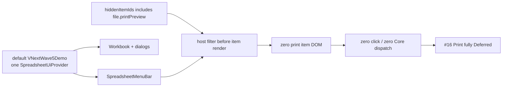
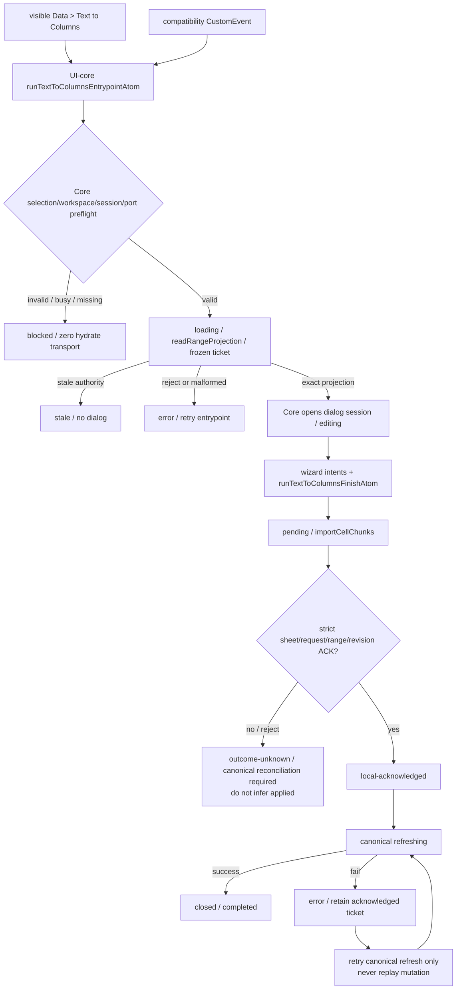
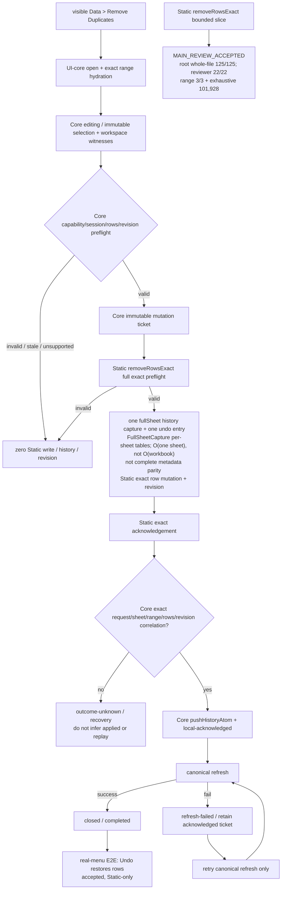
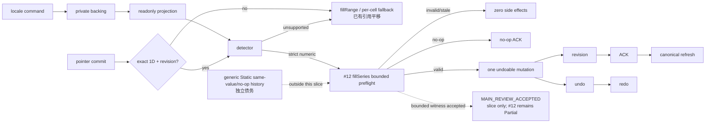

# Dirty 根切换盘点（WORK_SPLIT §4）

## 2026-07-16 当前目录收口声明

本轮不再执行 2026-07-14 的 worktree cutover。唯一交付源已经确定为 `/Volumes/work/self/einfach`，下方 35-path、旧 SHA、旧 owner 与隔离 worktree 仅保留为历史事故记录，不能再用于恢复 patch、判断当前完成度或覆盖当前代码。

### 当前规则

当前 #03 收口证据按集合分层：`/root` targeted **7 suites / 216 tests PASS**（owner Solid/Grid **3 suites / 101 tests** + UI-core/Core **4 suites / 115 tests**）；独立 reviewer 的 Grid 新增 **3 tests** + 相邻全量 **74 tests** = **77 tests**，core/menu/hidden/boundary **115 tests**，ContextMenu **24 tests**。UI-core build PASS；全量 UI-core **57/57 suites、1437/1437 tests PASS**；全量 Solid **70 passed + 1 skipped suites（71 total）、1125 passed + 6 skipped tests（1131 total），0 failed**；Vite **293 modules PASS**。Full Solid `tsc` 仍是 exit 2、恰 5 条未变化的 Worker baseline diagnostics，不能写成 PASS。

| 项目                                                          | 当前裁决                                                                                                                                                                                                                                                                                                                                                                                                                                                                                                                                                                                                                                                                                    |
| ------------------------------------------------------------- | ------------------------------------------------------------------------------------------------------------------------------------------------------------------------------------------------------------------------------------------------------------------------------------------------------------------------------------------------------------------------------------------------------------------------------------------------------------------------------------------------------------------------------------------------------------------------------------------------------------------------------------------------------------------------------------------- |
| 正确根目录                                                    | `/Volumes/work/self/einfach`                                                                                                                                                                                                                                                                                                                                                                                                                                                                                                                                                                                                                                                                |
| 其他 `einfach-online-excel-*` / integration / rescue worktree | 只读历史参考；禁止继续搬运                                                                                                                                                                                                                                                                                                                                                                                                                                                                                                                                                                                                                                                                  |
| 当前未提交修改                                                | 以正确根目录即时 `git status --short` 为准；并行 owner 仍在写，不能沿用 2026-07-14 的 35-path 计数                                                                                                                                                                                                                                                                                                                                                                                                                                                                                                                                                                                          |
| commit 状态                                                   | 当前收口是未提交 working-tree 交付；本轮文档更新不自行 commit/push                                                                                                                                                                                                                                                                                                                                                                                                                                                                                                                                                                                                                          |
| 严格产品盘点                                                  | 41 项 = 0 `Verified` / 35 `Partial` / 5 `Missing` / 1 `Deferred`；40 项 active unfinished + 1 Deferred；35 Partial 唯一主归属 C1=6、C2=21、C3=8                                                                                                                                                                                                                                                                                                                                                                                                                                                                                                                                             |
| UI-core 代码边界                                              | `vanilla/spreadsheet-ui-core/**`；31 项有直接实现和测试、4 项部分实现；当前 `/root` 全量为 build PASS + 57/57 suites、1437/1437 tests；本轮前历史快照为 56/56、1432/1432（历史 C0 基线 55/1253、capacity 55/1261、projection 55/1274），不等于产品完成                                                                                                                                                                                                                                                                                                                                                                                                                                      |
| Solid 代码边界                                                | `solid/excel/src-vnext/**` 与直接测试；当前 `/root` full `--silent` 为 70 suites passed / 1 skipped（71 total）、1125 tests passed / 6 skipped（1131 total）、0 failed、exit 0；本轮前历史快照为 69+1 suites、1122+6 tests；既有 Vite build 证据为 PASS（293 modules；历史 projection 基线为 61+1 / 966+6）                                                                                                                                                                                                                                                                                                                                                                                 |
| Full Solid `tsc`                                              | `npx tsc --noEmit --pretty false -p solid/excel/tsconfig.json` exit 2 / 恰好 5 diagnostics：`worker-runtime-ts.ts` 864、1306×2、1312，`worker-runtime.ts` 264；均为禁止扩围 baseline，不声明 PASS                                                                                                                                                                                                                                                                                                                                                                                                                                                                                           |
| default demo                                                  | `http://127.0.0.1:5173/` 返回 HTTP 200；只证明服务可访问，人工路径与 console 未验证                                                                                                                                                                                                                                                                                                                                                                                                                                                                                                                                                                                                         |
| 后续门禁                                                      | #14 capability + regex/provenance + Static CAS/Replace All 已接受，root/agent 4 suites / 165 tests；UTF-16 非空半开 span、zero-width omit/reject 已闭合，仍缺 Worker/transport/E2E、generic ABA/durable。#04/#23 canonical borders 8/258 与 #23 rotation 邻接 5/95 已接受；仍缺 shared-edge、merge/freeze、diagonal/full parity 与 rotation 真实浏览器 auto-fit/hit-area、merge/freeze/virtualization。另有 #29 3/108、#05 authority 25/25 + 171/171 + boundary 5/5 + two builds、#05 Static history 10/10、Pointer 7/7 + Solid overlay 18/18 + setter 0、#11 Phase A 2/33、Phase B reviewer 6/123 + root 5/135、Context 3/40、状态边界 4/42；限定包不升级产品总账，C3 与系统门禁仍 pending |
| Static mutation ACK                                           | `set-format` / `merge` / `unmerge` exact `kind` + `requestId` / `revision` 已接受：adapter 88/88、Toolbar 10/10、Vite build PASS；Wave5 固定 Static，双项目不是 Worker parity；bad kind 仍为 `outcome-unknown`；相关产品行保持 `Partial`                                                                                                                                                                                                                                                                                                                                                                                                                                                    |
| #20 Format Painter Static witness                             | default/empty C2 `{}` → formatted B2 清除粗体的 visible-only Wave5 见证；owner 与独立复核各自在 wasm/ts Playwright 项目合计 12/12、console error 0；两个项目复用同一 Static backend，不是 Worker parity；#20 保持 `Partial`；状态流只见 [04 规范源](./04-cell-formatting.md#format-painter-default-source-lifecycle)                                                                                                                                                                                                                                                                                                                                                                        |
| #06 Keyboard Context Menu bounded slice                       | 独立 `ACCEPT` 仅覆盖 gated keyboard intent、canonical input/anchor bridge 与 focus/close contract；3 suites / 141 tests + 回归 8 suites / 148 tests，UI-core `tsc` 0、Solid 候选 0 diagnostics、7-file diff-check；无真实浏览器 E2E，部分路径仅源码审查；#06 保持 `Partial`；状态流只见 [02 规范源](./02-worksheet-structure.md#keyboard-context-menu-lifecycle)                                                                                                                                                                                                                                                                                                                            |
| 架构结论边界                                                  | 仅本批 vnext 业务状态已收敛；不表示整个 legacy Solid 已迁完；Protection 是工作表/范围编辑锁，不是通用安全子系统，生产 mutation/canonical read 缺失，仍为 C2 blocker                                                                                                                                                                                                                                                                                                                                                                                                                                                                                                                         |
| engine 保护边界                                               | `vanilla/core/**`、`vanilla/excel-core-ts/**`、`rust/**` 不属于此次 UI parity 迁移                                                                                                                                                                                                                                                                                                                                                                                                                                                                                                                                                                                                          |
| 文档边界                                                      | `solid/excel/docs/online-excel-parity/**`；只记录代码证据，不反向驱动未授权源码变更                                                                                                                                                                                                                                                                                                                                                                                                                                                                                                                                                                                                         |

当前三路交付已分别完成最终流转：#03 Context Hide/Unhide 为 `MAIN_REVIEW_ACCEPTED / released`，#23 Shared-edge Contract 为 `Blocker / Pending`，Docs Evidence 为 `MAIN_REVIEW_ACCEPTED / released`；状态流见 [README｜本轮三路并发→主审状态流](./README.md#本轮三路并发主审状态流)。#23 的 blocker 仅表示 canonical projection 尚缺 write-order / owner / explicit-none / tie 合同，不是安全告警或产品失败；裁决前不允许写实现或发明优先级。#03/#23 仍为 `Partial`，严格总账不变。

### #06 Keyboard Context Menu bounded acceptance

#06 keyboard-open Context Menu bounded slice 经独立审查 `ACCEPT`，但只覆盖键盘打开与焦点/关闭合同；#06 产品仍为 `Partial`，严格总账仍为 **41 = 0/35/5/1**。只有 `Shift+F10` / `ContextMenu` key 在 navigation、non-composing、non-editing、non-formula 且无 Ctrl/Meta/Alt 时进入 UI-core；普通 F10 与 gated 路径均返回 `none`。UI-core / Einfach 是菜单唯一业务状态；Solid 仅做 DOM anchor / focus bridge：Grid 把 `selectionSnapshot` 映射为 canonical `MenuOpenInput` 与可见 DOM anchor。缺失 anchor 或 `openMenu` 拒绝时，不调用 `preventDefault`、不打开菜单、selection 不变；成功以 `source: keyboard` 打开并聚焦首个 visible enabled menuitem。Escape 以 `cancelled` 关闭并恢复仍 connected 的 opener；pointer 打开不抢焦点。

接受证据为独立 reviewer **3 suites / 141 tests PASS**、回归 **8 suites / 148 tests PASS**、UI-core `tsc` **0 diagnostics**、Solid 候选文件 **0 diagnostics** 与 **7-file diff-check**。这不是 full Solid `tsc` PASS；已知 Worker baseline 仍为 5 diagnostics。未运行真实浏览器 E2E，row/column/all selection 与 missing-anchor 等部分仍是源码审查边界；不得外推 TS/WASM/Worker parity 或产品完成。唯一规范图见 [02｜Keyboard Context Menu lifecycle](./02-worksheet-structure.md#keyboard-context-menu-lifecycle)，本 cutover 账不复制第二套状态机。

### #03 隐藏行列限定切片（bounded `MAIN_REVIEW_ACCEPTED`）

#03 的限定实现以 UI-core / `@einfach/core` 为状态中心：`runViewportHiddenMutationAtom` 独占 mutation lifecycle，新增 `runViewportHiddenSelectionMutationAtom` 从唯一 selection region 与 canonical private hidden projection 的交集派生 Unhide indices；Solid Menu 只转发 `{ source, action }`，不持有第二状态源。Static backend 使用 per-sheet canonical `Set<number>`，严格预检后完成 mutation、same-ticket canonical window readback、一次 history/revision、undo/redo，以及行列与 sheet 结构变更迁移。hidden mutation ACK 的 UI-core 匹配粒度严格是相同 `sheetId`、相同 `requestId` 与合法非空/有限 `revision`；它不额外匹配 `kind`、action、indices 或 window。随后 canonical readback 才严格匹配 `kind/sheet/request/revision/full window` 与两份 canonical hidden arrays，并以本地 hidden-projection object identity 作为 bounded ABA guard。Grid 只派发 `hydrateViewportSizeProjectionAtom`；UI-core 独占 hydration ticket、四 metadata slices 校验、latest-wins/mutation arbitration、metadata identity/ABA 与一次 exact-window commit。五张规范 Mermaid 统一见 [README｜#03 bounded 状态流](./README.md#03-隐藏行列-bounded-状态流main_review_accepted)。

Static authority、exact-window hydration 与 Format Top Menu selection Unhide bounded slices 均已 `MAIN_REVIEW_ACCEPTED`。本轮前 Unhide 历史定向快照为 **4 suites / 171 tests**：Core hidden **95/95** + UI-core menu registry **6/6** + Solid MenuBar **61/61** + package-boundary **9/9**；前三组为 **162/162**。此前 Solid Menu **58/58**、合计 **168/168**、前三组 **159/159** 是旧时点证据，不再代表当前包。既有 authority/hydration 证据继续独立保留为 adapter **106/106**、UI hidden **53/53**、Solid Menu **54/54**、hydration **36/36**、Solid Grid **5/5**，以及 root UI-core **98/98** + Grid **74/74**，不得与当前切片数字混算。当前 full 为 UI-core **57/57 suites、1437/1437 tests PASS**，UI-core build PASS；Solid **70 passed / 1 skipped suites（71 total）、1125 passed / 6 skipped tests（1131 total），0 failed**；Vite **293 modules PASS** 为既有证据。Full Solid `tsc` 仍恰有 5 条禁止扩围的 Worker baseline diagnostics，不声明全量 PASS。

Grid hydration 的旧 off-window residual 已移除：UI-core 在 ticket/read 前先处理 active mutation、invalid sheet/window、unsupported 与 requestId 耗尽；valid ticket 后才单次 canonical read，全 slices 校验完成后 atomic exact-window commit 并保留 off-window/sibling sheet。更新的 valid hydrate采用 latest-wins。对 selection Unhide 而言，active mutation 直接 `blocked` 并保留既有 lifecycle/ticket；invalid authority/selection 或空 canonical intersection 为 `blocked`，缺 action capability/readback 为 `unsupported`，requestId 耗尽为 `blocked`，这些分支都不会安装 mutation ticket，因而不会 supersede active hydrate。只有 resolver 有效、capability/readback 存在、requestId 成功签发并实际安装 mutation ticket 时，才会 supersede 旧 hydrate；旧 continuation 随后只返回 `stale`，零旧 projection 写入。当前 mutation ticket 的 ACK、canonical readback 或 local hidden-projection object identity 校验失败进入 `recovery-required`；两个 hidden arrays 同时缺席的 hydrate 兼容路径走 `sizes-only` 且保留 hidden。

默认 `VNextWave5Demo` 现在把真实 `SpreadsheetMenuBar`、Workbook 与 dialogs 挂在同一个 `SpreadsheetUiProvider` 内，Format → Row/Column Unhide 在默认 Static host 已可达；Solid 仍只转发 intent，hidden authority 与 lifecycle 继续由 UI-core / `@einfach/core` 独占。产品可达性仍未闭合：两个 Worker backend 都没有 hidden projection/mutation capability，Static-capable Context Menu 已具备真实 Hide/Unhide 可达链；UI-core 在 visibility 与 click time 都重验 capability；Worker backend 没有 hidden capability 时隐藏命令并 fail-closed，绝不呈现可用命令。Worker/Rust/真实 transport parity、durable persistence/hydration、sparse runs 与完整 E2E/a11y/perf/system closure 仍缺，#03 保持 `Partial`；严格总账仍为 **41 = 0/35/5/1**，数据分析/打印继续完全延后且位于 41 项外。Top Menu Unhide 九文件白名单以 README 的逐项清单为准，当前均未 commit；adapter 等全局脏改属于其他并发包，本切片未触碰三份 Worker convergence 文件、`vanilla/core/**`、`vanilla/excel-core-ts/**` 或 `rust/**`。本轮只同步本文件，不 commit/push。

### 默认 Wave5 host gate、TTC 与 Remove Duplicates 当前事实

默认 `VNextWave5Demo` 只建立一个 `SpreadsheetUiProvider`，真实 `SpreadsheetMenuBar`、Workbook、Text to Columns / Remove Duplicates dialogs 与其他 overlays 都在该 Provider 内。Solid host 只负责 DOM、事件转发和渲染；selection、ticket、loading/error、ACK、history 与 recovery 状态仍以 UI-core / `@einfach/core` 为唯一来源。

- **#16 Print 完全延后**：host 传入 `hiddenItemIds={['file.printPreview']}`，`SpreadsheetMenuBar` 在渲染前过滤该 registry item，因此默认 host 中打印项为零 DOM、零 click、零 Core dispatch。仓库内通用 registry item、overlay 或 shell 的存在不算打印实现，也不改变完全延期状态。
- **Text to Columns**：真实 Data 菜单和兼容 `CustomEvent` 都只调用 `runTextToColumnsEntrypointAtom`；hydrate、dialog、finish、严格 ACK、canonical refresh 与 recovery 全归 Core。当前真实菜单证据只覆盖默认 Static host，不宣称 TS/WASM/Worker parity。
- **#20 Format Painter**：从无格式覆盖的 C2 捕获 `{}` 并刷到已设为粗体的 B2，visible-only 见证确认目标粗体被清除；owner 与独立复核各自在 wasm/ts 项目合计 **12/12**。两个项目都运行同一个 Static backend，绝不能写成 TS/WASM/Worker parity；#20 仍为 `Partial`，状态流只引用 [04 规范源](./04-cell-formatting.md#format-painter-default-source-lifecycle)。
- **#30 Remove Duplicates**：真实 Data 菜单的 success 与 undo E2E 已独立验收，只证明默认 Static host。Static `removeRowsExact` bounded slice 已 `MAIN_REVIEW_ACCEPTED`：`/root` 整文件 **125/125**、reviewer 定向 **22/22**、range 子审 **3/3**，并通过 **101,928** 个 range 穷举 case。该接受只覆盖 Static exact preflight / mutation / revision / ACK / history / recovery，不等于整行删除的全 metadata parity；merge、name、validation、conditional formatting、filter、freeze 等结构 metadata 缺口仍在。#30 继续 `Partial`，不外推 TS/WASM/Worker parity。
- **总账与延期门**：严格总账固定为 **41 = 0/35/5/1**；第 9 组数据分析和第 16 组打印继续完全延后。

#### Print host render gate

#### Text to Columns Core lifecycle

#### Remove Duplicates Core → Static exact lifecycle

### #12 自动填充限定切片（bounded `MAIN_REVIEW_ACCEPTED`）

当前正确根内，#12 已从旧版未接线状态推进为 bounded Static 数值链：locale command 写 private backing、readonly atom 投影；Grid pointer commit 通过 exact/non-truncated/unique/strict-1D/revision gate 后调用 detector，仅有限非零整数/小数派发 `fillSeries`，否则保留 `fillRange` / 受限逐格 fallback；该 bounded per-cell fallback 已有引用平移。只有 #12 `fillSeries` bounded path 会先在 Static 中预检整份计划，再做一次 undoable mutation、一次 revision、精确 ACK 和 canonical refresh；invalid/stale 零写入/零历史/零 revision，空有效计划 no-op ACK，并保留 undo/redo。

该限定路径现为 bounded `MAIN_REVIEW_ACCEPTED`：独立 reviewer **4 suites / 144 tests PASS**；`/root` 主审通过 adapter **99/99**、fill **17/17**、scaling **16/16**；该 bounded 包接受时的历史 Solid full 快照为 **69 suites passed / 1 skipped（70 total）**、**1080 tests passed / 6 skipped（1086 total）**；当前权威 Solid full 为 **70 suites passed / 1 skipped（71 total）**、**1125 tests passed / 6 skipped（1131 total），0 failed**，Vite build **PASS**。Full Solid `tsc` 仍恰好有 5 条禁止扩围的 worker baseline diagnostics，不能写 PASS。接受只覆盖 #12 `fillSeries` 的 plan/no-op/preflight、单 mutation/单 revision 与 undo/redo witness；不得外推为 Static 全局 history/no-op 原子性完成，generic Static same-value/no-op history 仍是独立债务。bounded per-cell fallback 已有引用平移，但完整 formula-series、Worker/真实 transport parity、date/weekday/month/custom、可见命令与系统门禁均未实现。#12 继续 `Partial`；严格 **41 = 0/35/5/1** 不变，数据分析/打印仍完全延后且在 41 项外。本次文档同步不 commit/push，也不触碰 `vanilla/core`、`vanilla/excel-core-ts` 或 Rust。

主审冻结时必须重新运行当前根目录的 `git status --short` 与限定 diff；不得把本文件下方历史哈希当作今天的 commit 或 clean-worktree 证明。

### 当前波次限定路径

下列同时记录当前 active 与刚释放的 bounded owner，不是整个 dirty worktree 计数；其余未提交路径属于先前工作或用户，当前 owner 必须保留且不得顺手格式化。浏览器实证可能不产生源码 diff，因此本波次不再用固定路径总数冒充完成度。`/root` 只 review，不占执行槽。

| 槽位状态 | Agent / 包                                         | 限定路径 / 输出                                                             | 当前状态                                                                                                                                                                                                                                                                                    |
| -------- | -------------------------------------------------- | --------------------------------------------------------------------------- | ------------------------------------------------------------------------------------------------------------------------------------------------------------------------------------------------------------------------------------------------------------------------------------------- |
| released | #03 Context Hide/Unhide                            | 主审冻结白名单内的限定 diff 与直接测试                                      | `MAIN_REVIEW_ACCEPTED / released`；`/root` targeted 7 suites / 216 tests PASS；#03 `Partial`                                                                                                                                                                                                |
| pending  | #23 Shared-edge contract                           | canonical projection 合同与可验证规则                                       | `Contract Blocker / Pending`；裁决前不写实现；#23 `Partial`                                                                                                                                                                                                                                 |
| released | `/root/docs_evidence_refresh`                      | `solid/excel/docs/online-excel-parity/**`                                   | `Docs Evidence MAIN_REVIEW_ACCEPTED / released`；只交文档 diff 与检查                                                                                                                                                                                                                       |
| released | `/root/freeze_panes_static_authority`              | #05 冻结窗格 Static authority 有界实现与测试                                | `MAIN_REVIEW_ACCEPTED`；owner 槽已释放                                                                                                                                                                                                                                                      |
| released | `/root/update_parity_docs_current_truth`           | #05 与 #11 Phase A+B + Context Menu + 状态边界 accepted 状态流              | `MAIN_REVIEW_ACCEPTED`；Context 3/40、状态边界 4/42                                                                                                                                                                                                                                         |
| released | `/root/find_replace_capability_truth`              | #14 capability + Static regex/provenance + CAS/Replace All                  | `MAIN_REVIEW_ACCEPTED`；root/agent 4 suites / 165 tests                                                                                                                                                                                                                                     |
| released | #04/#23 canonical visual projection                | borders 四边渲染 + rotation 证据切片                                        | `MAIN_REVIEW_ACCEPTED`；borders 8/258；rotation 邻接 5/95                                                                                                                                                                                                                                   |
| released | Static format / merge exact ACK                    | `set-format` / `merge` / `unmerge` strict ACK                               | `MAIN_REVIEW_ACCEPTED`；88/88、10/10、build；Wave5 Static-only                                                                                                                                                                                                                              |
| released | #20 Format Painter Static visible witness          | default/empty C2 `{}` → formatted B2 清除粗体                               | owner 与独立复核各自在 wasm/ts Playwright 项目合计 12/12、console error 0；两项目复用同一 Static backend，不是 Worker parity；#20 `Partial`；状态流见 [04 规范源](./04-cell-formatting.md#format-painter-default-source-lifecycle)                                                          |
| released | #06 Keyboard Context Menu bounded slice            | gated keyboard intent + canonical input/anchor + focus/close contract       | 独立 3 suites / 141 tests、回归 8 suites / 148 tests；UI-core `tsc` 0、Solid 候选 0 diagnostics、7-file diff-check；无真实浏览器 E2E；#06 `Partial`；状态流见 [02 规范源](./02-worksheet-structure.md#keyboard-context-menu-lifecycle)                                                      |
| released | #29 filter/sort capability truth                   | Worker unsupported + bounded canonical read                                 | `MAIN_REVIEW_ACCEPTED`；3 suites / 108 tests                                                                                                                                                                                                                                                |
| released | #12 bounded numeric `fillSeries`                   | exact canonical 1D + Static preflight/history witness                       | `MAIN_REVIEW_ACCEPTED`；reviewer 4/144，root 99/99 + 17/17 + 16/16                                                                                                                                                                                                                          |
| released | #05 Static bounded history                         | freeze delta / capture + bounded undo/redo                                  | `MAIN_REVIEW_ACCEPTED`；targeted 10/10；#05 仍 `Partial`                                                                                                                                                                                                                                    |
| released | Pointer readonly boundary                          | readonly public / private backing / commands                                | `MAIN_REVIEW_ACCEPTED`；7/7 + Solid 18/18 + setter 0；总账不变                                                                                                                                                                                                                              |
| released | #03 hidden authority + hydration + Top Menu Unhide | UI-core lifecycle + Static Set/history + hydration + selection intersection | `MAIN_REVIEW_ACCEPTED`；历史 4 suites / 171 = 95 + 6 + 61 + 9，前三组 162；旧时点 168/159；历史 hydration 36/36 + Grid 5/5、root 98/98 + Grid 74/74；九文件未 commit；默认 Wave5 Static MenuBar/Unhide 可达，Worker 无 hidden capability、Static-capable Context Menu 已可达；#03 `Partial` |
| released | #30 real Data menu success / undo E2E              | 默认 Wave5 Static host 真实菜单闭环                                         | 已独立验收；只证明 Static host，不代表 TS/WASM/Worker parity；#30 `Partial`                                                                                                                                                                                                                 |
| released | Static `removeRowsExact` bounded slice             | exact preflight / mutation / revision / ACK / history / recovery            | `MAIN_REVIEW_ACCEPTED`；root 整文件 125/125、reviewer 22/22、range 3/3 + 穷举 101,928；Static-only，#30 `Partial`，结构 metadata parity 未闭合                                                                                                                                              |

Static mutation ACK 切片只修正响应关联事实：精确 `kind` 以及 `requestId` / `revision`（适用时含 range）通过 UI-core strict validator 后，状态从 `dispatch → Static mutation → local-ack → canonical projection refresh → ready`；缺失或错误 `kind` 必须进入 `outcome-unknown`，等待 canonical reconciliation，不能猜测 applied。接受证据为 adapter Jest **88/88**、Toolbar Playwright **10/10**、Vite build **PASS**。Wave5 demo 固定 Static，`wasm` / `ts` 两项目只是重复验证同一 Static 路径；Worker adapter 原有 `kind` 未改，因此 Worker parity 仍待补。UI-core / `@einfach/core` 是唯一状态中心，Solid 仅为薄桥；41 项总账不变，相关行仍为 `Partial`。

#20 Format Painter 的 default/empty → formatted 可见见证同样固定在 Static host；owner 与独立复核各自的 wasm/ts 项目合计 **12/12** 不能外推 Worker parity。capture 到成功收口和 reject / outcome-unknown / blocked 的完整 lifecycle 只引用 [04 规范源](./04-cell-formatting.md#format-painter-default-source-lifecycle)。

`/root/provider_projection_authority` 是槽 1 hard-cap 之后的独立 #31 owner-handoff：Provider projection-owner 的 targeted **2 suites / 23 tests**、related **4 suites / 33 tests** 与限定门禁由 owner 报绿；`/root` 独立通过 provider/status/provider-base **3 suites / 31 tests**、源码审查、Prettier 与 diff-check，现已 `MAIN_REVIEW_ACCEPTED`，不得记到 `/root/c1_status_hard_cap` 名下。

前置接受包分开记录：`/root/c2_custom_formula_capacity` 只对应 capacity/lifecycle 四文件包；`C2-PROVIDER` 只对应 Provider late-ACK 包；不得用同一 Owner 行混写两个限定包。两包均已限定主审接受，#26 仍为产品 `Partial`。

Formula Reference 与 Copy-As 也必须分开记账，且都已 `MAIN_REVIEW_ACCEPTED`，不占当前三槽。Formula Reference 的 Solid DOM/caret/grid/keyboard intent 只派发 UI-core command，状态停留在 private backing 并经 readonly atoms 投影；证据为 **5 suites / 56 tests PASS**、UI-core build PASS，Full Solid `tsc` 仍仅有 5 条禁止扩围的 `worker-runtime*` baseline，#09 仍为 `Partial`。Copy-As 先发布 private backing / readonly snapshot 与测试 mirror，再尝试 clipboard；编码或 clipboard 失败只更新 status、保留 snapshot；证据为 **3 suites / 62 tests PASS**、UI-core build PASS、public atom direct setter **0** 与 publish-before-clipboard 顺序回归，#10 仍为 `Partial`。两包均保持 `@einfach/core` + UI-core 为唯一产品状态中心，Solid 只是薄适配。

Top Menu 与 Context Menu 也必须分开记账，且都已 `MAIN_REVIEW_ACCEPTED`，不占当前三槽、不提升产品行。Top Menu 为 3 个 public readonly projections / private backing，4 个 command atoms 保持 getter / args / result 兼容；UI-core + Solid 定向 **2 suites / 53 tests PASS**，build / 定点 `tsc` PASS，public atom direct setter **0**。Context Menu 为 2 个 public readonly projections / private backing，command getter / args / result 兼容；UI-core menu **6 tests PASS**、Solid 定向 **75 tests PASS**，build / 定点 `tsc` PASS，public atom direct setter **0**。Solid 通过 `useSpreadsheetUiStore` / `store.setter` 取得 UI-core command 真实返回的 `MenuCommandIntent`，再直接派发到 backend；执行不依赖订阅 `menuIntentAtom`。两包均保持 `@einfach/core` + UI-core 为状态权威、Solid 为薄适配。

Protection 不在槽 2 的修复范围：protocol/engine 没有生产 `setRangeLock` / `readSheetProtection`，当前只能保留 conformance 与 blocker 证据，不能写入假 ACK。Named Range 前置包只允许 Static outcome/authority、Worker engine ACK 后发布 overlay、拒绝不 bump revision、dispose late-ACK gate、串行 mutation gate 和 static/worker-ts/worker-wasm capability factory；4/4 demo 显式注入，主审复跑 adapter/provider/name-manager/core named-ranges 4 suites / 154 tests 与定点 strict `tsc`、Vite、diff check 均通过。真实 WASM 支持/持久化仍缺，#27 保持 `Partial`。

自定义公式 capacity/lifecycle 已是前置接受包：owner 通过 direct Jest 1 suite / 59 tests、UI-core full 55 suites / 1261 tests、Solid caller 1 suite / 13 tests、package build、额外 strict targeted `tsc` 和 scoped diff-check；ESLint 0 errors / 1 个既有 `@jest/globals` warning。`/root` 独立复跑 direct + Solid 2 suites / 72 tests、UI-core build、全仓 direct-setter `rg` 和 diff-check并接受。`customFormulaRegistryAtom` 的 getter/subscriber 与 command callers 保持调用兼容；直接 setter 类型能力被有意移除，是外部 setter consumer 的 type-level breaking boundary，不能笼统宣称公共 API 全面兼容。

已接受的 C2-PROVIDER 当时只允许改 `solid/excel/src-vnext/provider/SpreadsheetUiProvider.tsx` 与 `solid/excel/test/vnext-custom-formulas.test.tsx`，仅必要时在 provider 下抽纯 helper。Provider 第一版串行补偿泵曾因 stale unregister failure 跨 generation 的无限重试/cleanup barrier 漏洞被主审退回；owner 已按最新 desired 与 installed 是否仍不一致修复，并补 deferred failure 与持续 churn 的有界回归。owner targeted Jest exit 0、2 suites / 26 tests、0 snapshots，唯一 warning 是故障注入 `worker boom`；Vite build exit 0、291 modules、2.97s，仅既有 JSX/chunk warnings；full Solid `tsc` exit 2、仍仅 5 条 `worker-runtime*` baseline，两个触及文件 0 error；scoped ESLint exit 0、0 errors / 2 test dependency warnings；Prettier 与 scoped diff-check exit 0。`/root` 又独立通过 custom-formulas 1 suite / 18 tests 与 provider 1 suite / 8 tests，合计 2 suites / 26 tests，并完成 code review、Prettier 与 diff-check，现已 `MAIN_REVIEW_ACCEPTED`。本包仅触及 Provider 与 vnext custom-formulas test，未改 Core/runtime/adapter/TS/Rust；限定包接受不升级产品状态，#26 保持 `Partial`。

projection-refresh-lifecycle 限定包已 `MAIN_REVIEW_ACCEPTED`。UI-core 每 store 只保留一个 active 和一个 latest queued visible request；Solid 只运行一条共享 transport loop，queued caller 不发第二 transport。主审证据为 UI-core full **55 suites / 1274 tests PASS**、Solid full **61 suites passed / 1 skipped、966 tests passed / 6 skipped、0 failed** 与 Vite build **PASS**；Full Solid `tsc` 仍只有 5 条禁止扩围的既有 diagnostics。#41 仍为产品 `Partial`。

C1 旧 Playwright 8 passed / 4 skipped 因 `reuseExistingServer` 命中另一个 integration-v2 worktree，已经撤销为当前根证据。owner 在 5293 首次隔离复跑并在 5294 格式化复验，两次均为 WASM 5 passed / 1 fixme、TS 5 passed / 1 fixme，合计 10 passed / 2 skipped。`/root` 以 `EINFACH_E2E_PORT=5393 npx playwright test e2e/vnext-real-backend-smoke.spec.ts --workers=1` 独立复跑；自启 Vite PID 6441、cwd 为 `/Volumes/work/self/einfach/solid/excel`、HTTP 200，仍为 10 passed / 2 skipped、exit 0。两 backend 的 native dblclick commit+Escape 均通过，browser console error = 0；Vite 只有既有 JSX transform 与 wasm-pack 更新 warning。该旧限定包当时的唯一 fixme 是 Worker demo 未挂 Go To/Text to Columns，现已由下述新挂载切片解除；没有为旧假阴性修改 Grid 或产品源码。旧限定 E2E 已 `MAIN_REVIEW_ACCEPTED`，但 status hard-cap、多选、完整分列语义与系统门禁仍未闭环，产品状态保持 `Partial`。

当前 C1 Worker Go To/TTC 挂载切片已获 `MAIN_REVIEW_ACCEPTED`：owner 在 5318 回执 TS/WASM 各 6/6、0 skip / 0 fixme、console error 0、3 suites / 78 tests 与 build PASS；`/root` 在独立端口 5418 复核，Vite PID 11473、cwd 为 `/Volumes/work/self/einfach/solid/excel`、HTTP 200，TS/WASM 合计 12/12、0 skip / 0 fixme，并独立通过目标 Jest 3 suites / 78 tests。限定包接受不改写产品完成度，#06、#13 与其余 C1 产品行仍为 `Partial`。

#06 后续限定证据为 Go To parser **87/87**、Name Box **18/18**、真实 backend 多选 WASM **1/1** + TS **1/1**，console error **0**。该窄链只证明名称解析/边界、跨 sheet 先切 workspace 再 scroll、失败无 workspace/viewport/selection 副作用，以及追加多选后恢复单区；#06 完整产品与系统门禁仍未闭环，继续为 `Partial`。

status-hard-cap 限定包已 `MAIN_REVIEW_ACCEPTED`。UI-core 独占 raw selection snapshot、selection coverage/sheet truth、50k cell cap 和 50k membership-check cap；Solid 只同步 raw sheetId/window/cells/upstream truncated 并渲染派生结果，不持有本地业务状态/cache/coverage。`/root` 独立 targeted status + core **2 suites / 47 tests PASS**，接受时 UI-core full **55 suites / 1274 tests PASS**；#31 保持产品 `Partial`。

#14 find/replace capability truth、Static regex/provenance 与 Static CAS/Replace All bounded slices 已 `MAIN_REVIEW_ACCEPTED`，最新 root/agent 合并定向证据为 **4 suites / 165 tests PASS**。UI-core 是 capability 与会话状态中心，capability 在请求 pending 时独立捕获；Solid 只提交 intent 与渲染投影。span 合同已冻结为按 UTF-16 code units 计数的非空半开区间 `[start, end)`；纯 zero-width regex 结果安全 skip/advance 后省略。UI-core 在 ticket / mutation 前拒绝 zero / reversed span 并 fail-closed；Static 直接 zero-width replacement 精确返回 `{kind: 'replace-matches-not-applied'}`，保持零写入、零 undo、零 revision bump。Static 还已闭合真实 consuming spans、同单元格 multi/global、invalid regex fail-closed，以及 `displayValue` / `formula` target 与定向替换。`SpreadsheetBackend.replaceMatches` 复用 `ReplaceMatchesResponse` union：不可关联的缺失/畸形 `requestId` 在 mutation 前抛错；有效 requestId 下的缺失/陈旧 revision、不可推进 revision 或整份 plan 预检失败返回 `{kind: 'replace-matches-not-applied'}`，零写入、零 undo、零 bump。预检发生在 `beginUndoableMutation` 前；no-op ACK 不建 undo、不 bump；有效变更只建一次 undo、应用整份 plan、bump 一次并 ACK 实际 revision。剩余 blocker 恰为 Worker parity / real transport / E2E、generic ABA / durable cross-runtime concerns。限定接受不升级产品行，#14 继续为 `Partial`。

#04/#23 canonical four-border rendering bounded slice 已 `MAIN_REVIEW_ACCEPTED`：Grid 只读 canonical `cell()?.format?.borders`，投影 top/right/bottom/left 与 thin / medium / thick / dashed / dotted / double；`none` 不绘制、不发布 `data-borders` claim。publish 更新/移除与 content/projection refresh 都回到 canonical projection 重渲染；selection outline/fill handle z-index 3 高于 border overlay z-index 1。root 独立合并定向 **8 suites / 258 tests PASS**；剩余 shared-edge、merge/freeze、diagonal/full Excel parity，#04/#23 仍为 `Partial`。

#23 rotation 是同一 canonical visual projection 上的独立证据切片，已 `MAIN_REVIEW_ACCEPTED`：只新增 `vnext-grid-cell-rotation.test.tsx`，无实现、contract、Core 或 Worker 改动；定向 **2/2**、邻接 **5 suites / 95 tests PASS**。Grid 从 canonical `DisplayCell.format.rotation` 投影 default / 正负角度 / vertical style；content change refetch 后更新或清除 rotation 并重渲染，编辑 input 不继承 rotation。剩余真实浏览器 auto-fit/hit-area 与 merge/freeze/virtualization；#23 保持 `Partial`。

#29 filter/sort capability truth 限定包已 `MAIN_REVIEW_ACCEPTED`：独立门禁为 **3 suites / 108 tests PASS**。Worker 没有 `setFilterSort`；UI-core capability 明确为 unsupported，入口禁用，只读取 bounded canonical window；不得新增 Map/cache/overlay、行置换或假 revision。Static 能力保持原状，#29 继续为产品 `Partial`。

#05 Freeze Panes Static authority bounded slice 已 `MAIN_REVIEW_ACCEPTED`，owner 槽已释放。证据为 UI-core **25/25**、Solid **171/171**、boundary **5/5**、两个 build **PASS**。后续 Static bounded history targeted **10/10 PASS**：freeze 已进入 bounded delta 与 full-sheet capture，精确保留 absent / `{0,0}`；覆盖 `Freeze A → B → undo B → undo A → redo A → redo B`、delete configured → undo restore → redo delete、invalid/stale 不建历史。仍缺 Worker/real transport parity、durable persistence/hydration、structural-transform 与系统门禁，#05 保持 `Partial`。完整 Mermaid 见 [README｜Pointer / Freeze bounded 状态流](./README.md#pointer-freeze-bounded-state-flows)。

Pointer readonly boundary 已 `MAIN_REVIEW_ACCEPTED`：public `pointerSessionAtom` / `pointerIntentAtom` 是 private backing 的 readonly projections，start/update/commit/cancel commands 是唯一 writers；`idle → active(update*) → commit intent → idle`，cancel 从 active 回 idle。唯一 Solid direct-setter fixture 已迁移为 command，UI-core **7/7**、Solid overlay **18/18 PASS**、setter scan **0**。该切片不升级产品行；完整 Mermaid 同见 [README｜Pointer / Freeze bounded 状态流](./README.md#pointer-freeze-bounded-state-flows)。

#11 Paste Special Phase A + Phase B、Context Menu 与状态边界 bounded slices 已 `MAIN_REVIEW_ACCEPTED`。Phase A reviewer **2 suites / 33 tests**，接受 UI-core lifecycle、Provider port capture 与 real-worker demo dialog mount。Phase B 接受 Top Menu + Grid keyboard canonical capability gating、dispatch-time second guard 与 `defaultPrevented` 语义；reviewer **6 suites / 123 tests PASS**，root **5 suites / 135 tests PASS**。Context Menu 响应式读取 canonical capability，click-time second guard 通过后才创建 Core session；unsupported / stale revoke 零 transport，root **3 suites / 40 tests PASS**。状态边界将 7 个 public state atoms 改为 private backing + readonly projections，外部 runtime setter fail-closed，真实 lifecycle 覆盖 `pending → local-acknowledged → refreshing → closed`；root **4 suites / 42 tests PASS**，仅有既知 jsdom canvas console noise。Worker `pasteRange` / real transport、comments / column-widths 与完整 E2E 仍缺，#11 保持 `Partial`。

#31 raw-number canonical projection 限定切片已 `MAIN_REVIEW_ACCEPTED`：backend raw number 由 adapter 在 display format 前写入 `numericValue`，再由 Provider 投影到 UI-core backing/derived aggregates，Status Bar 只读消费；formula string 保持 string，number 缺 raw/non-finite 时仍计数并置 `truncated`，不得反解析 `displayValue`。owner **5 suites / 157 tests**；root UI-core **2 suites / 45 tests**、Solid **3 suites / 112 tests**；独立终审 **5 suites / 157 tests**。真实 backend E2E 为 **9/10**；唯一预期失败是 TS worker/runtime 尚未实现 number formatting，不把这一预期差异写成新的阻断项；#31 继续为 `Partial`。

Sheet reorder 有界 adapter 切片已 `MAIN_REVIEW_ACCEPTED`。worker adapter 在 `moveSheet` stable-id/index remap 窗口合并早到的 `cellsDirty`，move ACK 后读取 canonical sheet list、重建 lookup，再 flush dirty 并稳定 active projection；失败路径通过 `finally` 解开 gate。`/root` 独立通过 full vnext-adapter **1 suite / 82 tests**，真实 backend reorder E2E 为 TS **1/1**、WASM **1/1**。本包未改 runtime/engine/Grid；#01 仍为产品 `Partial`。

第 9 组数据分析、第 16 组打印继续完全延后，位于 41 项严格总账之外，也不属于任何当前波次后续动作。

```mermaid
stateDiagram-v2
  [*] --> WrongWorktreeHistory: 2026-07-14 多 worktree 记录
  WrongWorktreeHistory --> CorrectRootSelected: 用户确认正确目录
  CorrectRootSelected --> CodeTruthFrozen: 41 = 0 Verified / 35 Partial / 5 Missing / 1 Deferred
  note right of CodeTruthFrozen
    UI-core：31 项直接实现和测试 + 4 项部分实现
    产品 Partial：C1=6 / C2=21 / C3=8
  end note
  CodeTruthFrozen --> NamedRangePackageAccepted: 限定包 4 suites / 154 tests 已主审
  NamedRangePackageAccepted --> AcceptedPredecessors: C1 10/2 + C1 mount 12/12 + C2 capacity/Provider 已接受
  AcceptedPredecessors --> FormulaReferenceAccepted: 5/56 + UI-core build
  FormulaReferenceAccepted --> RemainingVerification: #09 仍为 Partial
  AcceptedPredecessors --> CopyAsAccepted: 3/62 + setter 0 + 顺序回归
  CopyAsAccepted --> RemainingVerification: #10 仍为 Partial
  AcceptedPredecessors --> TopMenuBoundaryAccepted: 3 readonly + 4 commands + 2/53
  TopMenuBoundaryAccepted --> RemainingVerification: 不提升产品行
  AcceptedPredecessors --> ContextMenuBoundaryAccepted: 2 readonly + menu 6 + Solid 75
  ContextMenuBoundaryAccepted --> RemainingVerification: returned intent transport；不提升产品行
  AcceptedPredecessors --> GoToNameBoxEvidence: #06 parser 87/87 + Name Box 18/18
  GoToNameBoxEvidence --> MultiSelectEvidence: TS/WASM 真实多选 2/2
  MultiSelectEvidence --> RemainingVerification: #06 完整产品与系统门禁未闭环
  AcceptedPredecessors --> BoundedPackagesTracked: /root 主审；accepted 包释放执行槽
  BoundedPackagesTracked --> FindReplaceAccepted: #14 capability + regex/provenance + Static CAS/Replace All
  FindReplaceAccepted --> FindReplaceSpanContractFrozen: UTF-16 + nonempty half-open span
  FindReplaceSpanContractFrozen --> FindReplaceGuard: exact safe requestId + revision guard
  FindReplaceSpanContractFrozen --> FindReplaceZeroWidthClosed: pure zero-width omit；UI-core reject；Static not-applied
  FindReplaceGuard --> FindReplaceRejected: uncorrelatable requestId 抛错；其余 reject 返回 not-applied
  FindReplaceGuard --> FindReplacePreflight: full plan preflight before undo
  FindReplacePreflight --> FindReplaceRejected: stale/missing/unadvanceable revision 或 invalid plan
  FindReplacePreflight --> FindReplaceNoOpAck: no-op / no undo / no bump
  FindReplacePreflight --> FindReplaceApply: one undo / full apply / one bump
  FindReplaceApply --> FindReplaceAck: ACK actual revision
  FindReplaceRejected --> FindReplaceZeroSideEffects: zero write / zero undo / zero bump
  FindReplaceZeroSideEffects --> FindReplaceRemaining
  FindReplaceZeroWidthClosed --> FindReplaceRemaining: Worker/transport/E2E + generic ABA/durable
  FindReplaceNoOpAck --> FindReplaceRemaining
  FindReplaceAck --> FindReplaceRemaining
  FindReplaceRemaining --> RemainingVerification: root/agent 4/165；#14 Partial
  BoundedPackagesTracked --> CanonicalBordersAccepted: #04/#23 root 8 suites / 258 tests
  CanonicalBordersAccepted --> CanonicalBorderProjection: cell format.borders
  CanonicalBorderProjection --> FourSideOverlays: four sides + six styles；none 不绘制
  FourSideOverlays --> BorderRerender: content/projection refresh
  BorderRerender --> CanonicalBorderProjection: update/clear canonical borders
  BorderRerender --> BorderRemaining: shared-edge + merge/freeze + diagonal/full parity
  BorderRemaining --> RemainingVerification: #04/#23 Partial
  BoundedPackagesTracked --> RotationEvidenceAccepted: #23 only test；2/2 + adjacent 5/95
  RotationEvidenceAccepted --> CanonicalRotationProjection: DisplayCell format.rotation
  CanonicalRotationProjection --> RotationStyleProjection: default / positive / negative / vertical
  RotationStyleProjection --> RotationRerender: content-change refetch -> updated/cleared
  RotationRerender --> CanonicalRotationProjection
  RotationRerender --> RotationRemaining: browser auto-fit/hit-area + merge/freeze/virtualization
  RotationRemaining --> RemainingVerification: edit input 不继承 rotation；#23 Partial
  BoundedPackagesTracked --> FilterSortAccepted: #29 3 suites / 108 tests
  FilterSortAccepted --> FilterSortWorkerDisabled: Worker 无 setFilterSort；入口禁用
  FilterSortWorkerDisabled --> RemainingVerification: bounded canonical window；产品仍为 Partial
  BoundedPackagesTracked --> FreezePanesAccepted: #05 Static authority MAIN_REVIEW_ACCEPTED
  FreezePanesAccepted --> FreezePanesOwnerReleased: UI-core 25/25 + Solid 171/171 + boundary 5/5 + two builds
  FreezePanesOwnerReleased --> FreezeHistoryAccepted: Static bounded history 10/10
  FreezeHistoryAccepted --> FreezeHistorySequences: A→B→undo B→undo A→redo A→redo B；delete/restore/delete
  FreezeHistoryAccepted --> FreezeHistoryRejected: invalid/stale 不建历史
  FreezeHistorySequences --> RemainingVerification: Worker / transport / persistence / structural / system gaps
  FreezeHistoryRejected --> RemainingVerification
  BoundedPackagesTracked --> PointerBoundaryAccepted: readonly public + private backing + command-only writes
  PointerBoundaryAccepted --> ProductLedgerUnchanged: 7/7 + Solid 18/18 + setter 0
  BoundedPackagesTracked --> PasteSpecialPhaseABAccepted: #11 Phase A 2/33 + Phase B reviewer 6/123 / root 5/135
  PasteSpecialPhaseABAccepted --> PasteSpecialContextMenuAccepted: canonical visibility + click guard；root 3/40
  PasteSpecialContextMenuAccepted --> PasteSpecialReadonlyBoundaryAccepted: 7 readonly + setter fail-closed；root 4/42
  PasteSpecialReadonlyBoundaryAccepted --> RemainingVerification: Worker / real transport / comments / column-widths / E2E gaps remain
  BoundedPackagesTracked --> StaticMutationAckAccepted: set-format / merge / unmerge exact ACK
  StaticMutationAckAccepted --> StaticAckCorrelation: kind + requestId + revision
  StaticAckCorrelation --> StaticLocalAck: exact ACK
  StaticLocalAck --> StaticProjectionRefresh: canonical projection refresh
  StaticProjectionRefresh --> StaticReady: ready；Solid thin render
  StaticAckCorrelation --> StaticOutcomeUnknown: missing / wrong kind
  StaticOutcomeUnknown --> RemainingVerification: do not infer applied；canonical reconciliation
  StaticReady --> RemainingVerification: Wave5 Static-only；Worker parity pending
  BoundedPackagesTracked --> C1StatusHardCapAccepted: root 2/47 + UI-core 55/1274
  C1StatusHardCapAccepted --> StatusNarrowEvidence: raw-number owner 5/157；E2E WASM 5/5 + TS 4/5
  StatusNarrowEvidence --> StatusProviderOwnerAccepted: Provider owner 2/23 + related 4/33；root 3/31
  StatusProviderOwnerAccepted --> RawNumberAccepted: pre-format numericValue -> Provider -> UI-core aggregates
  RawNumberAccepted --> TsFormatExpectedFailure: E2E 9/10；worker-ts number-format 未实现
  TsFormatExpectedFailure --> RemainingVerification: #31 仍为 Partial
  BoundedPackagesTracked --> C2ProjectionAccepted: UI-core 55/1274 + Solid 0 fail + build PASS
  BoundedPackagesTracked --> DocsSyncActive: 6 个文档同步 + Static exact ACK
  C2ProjectionAccepted --> RemainingVerification: 限定接受仍不升级 #41
  BoundedPackagesTracked --> C1SheetReorderAccepted: adapter 1/82 + TS/WASM 1/1
  C1SheetReorderAccepted --> RemainingVerification: 限定接受仍不升级 #01
  AcceptedPredecessors --> ProtectionBlocked: 缺生产 lock write + canonical read
  DocsSyncActive --> MainReview: Mermaid / totals / links / diff 检查后交接
  MainReview --> RemainingVerification: C3 / E2E / a11y / 性能仍 pending
  ProtectionBlocked --> FutureCapabilityPackage: 另行冻结真实 backend 能力
  RemainingVerification --> CommitReady: 全部承诺范围通过且用户授权提交
```

Formula Reference、Copy-As、Top/Context Menu、Go To parser、Name Box、多选、status bounded aggregation/config、Provider projection-owner lifecycle、projection latest-only、Sheet reorder remap gate、#14 capability + Static regex/provenance + CAS/Replace All、#04/#23 borders、#23 rotation、Static format / merge exact ACK、#29、#05 与 #11 Phase A+B + Context Menu + 状态边界已接受流的规范状态统一维护在 [README｜已实现关键 Core 状态流](./README.md#已实现关键-core-状态流)。Pointer readonly 与 #05 Static bounded history 的完整 Mermaid 见 [README｜Pointer / Freeze bounded 状态流](./README.md#pointer-freeze-bounded-state-flows)，明确包含连续 set/undo/redo、delete/restore/delete、invalid/stale 零历史及 Pointer idle/active/update/commit-intent/cancel；#20 default-source Format Painter lifecycle 只见 [04 规范源](./04-cell-formatting.md#format-painter-default-source-lifecycle)。UI-core / `@einfach/core` 是唯一状态中心，Solid 不持有第二份 lifecycle；限定接受不改变 0/35/5/1 产品总账。这里仅记录 cutover 与主审状态，不另建第二套事实。

---

以下是 2026-07-14 历史切换盘点，不再是当前操作清单。

- **基线**：`2feea483eefb`，分支 `claude/rust-core-state-plan-Auzcj`。
- **盘点时刻**：2026-07-14（CC-A 首次声明时为 34/34；本文件自身加入后最终集合为 **35/35 = 20 tracked M + 15 untracked**）。下表原哈希是 CC-A 时点证据，不能替代 `/root` 最终复冻；任何漂移即 `Blocked`。
- **状态**：`Owned35 / FinalReFreezePending`。最终 owner 以文末 `/root` 确认矩阵为准，不以会话自报代替主审。

## 路径清单与归属声明

### Tracked modified（20）——CC-A 首次归属声明（已由文末 `/root` 矩阵覆盖）

| 路径                                                                                  | diff 哈希      | Owner                            | 处置                            |
| ------------------------------------------------------------------------------------- | -------------- | -------------------------------- | ------------------------------- |
| `solid/excel/README.md`                                                               | `426d2164e8d7` | CC-B                             | owner 导入                      |
| `solid/excel/src-vnext/conditional-formatting/SpreadsheetConditionalFormatDialog.tsx` | `5c51d9c65f02` | CC-B                             | owner 导入（W0-DIALOG Rework）  |
| `solid/excel/src-vnext/data-validation/SpreadsheetDataValidationDialog.tsx`           | `139ad2f0cc81` | CC-B                             | owner 导入（W0-DIALOG Rework）  |
| `solid/excel/src-vnext/find-replace/SpreadsheetFindReplaceDialog.tsx`                 | `b784e22b3423` | CC-B                             | owner 导入（W0-DIALOG Rework）  |
| `solid/excel/src-vnext/name-box/SpreadsheetNameBox.tsx`                               | `cd56858ed9a3` | CC-B（含 CC-A 救援修复，见注 1） | owner 导入                      |
| `solid/excel/src-vnext/protection/SpreadsheetProtectionUnlockDialog.tsx`              | `5deb4108d5a4` | CC-B                             | owner 导入（W0-DIALOG Rework）  |
| `solid/excel/src/LocaleSwitcher.tsx`                                                  | `ee0e64573ca3` | CC-B                             | owner 导入（i18n 保全，不排期） |
| `solid/excel/src/i18n/index.ts`                                                       | `d504a0de405f` | CC-B                             | owner 导入（i18n 保全，不排期） |
| `vanilla/spreadsheet-ui-core/src/conditional-formatting/index.ts`                     | `160855a75580` | CC-B                             | owner 导入（W0-DIALOG）         |
| `vanilla/spreadsheet-ui-core/src/conditional-formatting/types.ts`                     | `8f6bdc47a274` | CC-B                             | owner 导入（W0-DIALOG）         |
| `vanilla/spreadsheet-ui-core/src/data-validation/index.ts`                            | `0fff4ab5dbf2` | CC-B                             | owner 导入（W0-DIALOG）         |
| `vanilla/spreadsheet-ui-core/src/data-validation/types.ts`                            | `f5ee04f1d5cb` | CC-B                             | owner 导入（W0-DIALOG）         |
| `vanilla/spreadsheet-ui-core/src/find-replace/index.ts`                               | `9722dd9a662b` | CC-B                             | owner 导入（W0-DIALOG）         |
| `vanilla/spreadsheet-ui-core/src/find-replace/types.ts`                               | `c420a428ae0b` | CC-B                             | owner 导入（W0-DIALOG）         |
| `vanilla/spreadsheet-ui-core/src/name-box/index.ts`                                   | `3655bce84aa3` | CC-B                             | owner 导入（W0-DIALOG）         |
| `vanilla/spreadsheet-ui-core/src/protection/index.ts`                                 | `383080378428` | CC-B                             | owner 导入（W0-DIALOG）         |
| `vanilla/spreadsheet-ui-core/test/conditional-formatting.test.ts`                     | `72fcbc0dd2b5` | CC-B                             | owner 导入（W0-DIALOG）         |
| `vanilla/spreadsheet-ui-core/test/data-validation.test.ts`                            | `4d349b4af09f` | CC-B                             | owner 导入（W0-DIALOG，注 2）   |
| `vanilla/spreadsheet-ui-core/test/find-replace.test.ts`                               | `e712ffb7d20d` | CC-B                             | owner 导入（W0-DIALOG）         |
| `vanilla/spreadsheet-ui-core/test/protection.test.ts`                                 | `de8001ce08bb` | CC-B                             | owner 导入（W0-DIALOG）         |

注 1：`SpreadsheetNameBox.tsx` 当前 diff = CC-B 的 signal→atom 重构 **+ CC-A 于 2026-07-14 删除尾部两行编辑残片的救援修复**（当时残片卡死全仓 pre-commit 与 dev server）。按 `/root` 既定口径随 W0-DIALOG 归 CC-B 一并消费，CC-A 不另行认领。
注 2：`data-validation.test.ts` 内含一条把 retarget 污染固化为预期的用例（见 reviews/2026-07-14-CC-A-w0-dialog-migration.md BLOCKER-5），owner 导入时应随 Rework 修订，不宜原样落库。

### Untracked（14）——CC-A 首次盘点时的 parity 协调文档

| 路径                                               | 内容哈希                                                               | Owner                                                | 处置                 |
| -------------------------------------------------- | ---------------------------------------------------------------------- | ---------------------------------------------------- | -------------------- |
| `…/02-worksheet-structure.md`                      | `930ac1265754`                                                         | CC-B                                                 | `/root` 文档批次导入 |
| `…/03-editing.md`                                  | `75e952a437d0`                                                         | CC-B                                                 | 同上                 |
| `…/04-cell-formatting.md`                          | `0a460516d2ce`                                                         | CC-B                                                 | 同上                 |
| `…/05-formulas.md`                                 | `cfc866979bdf`                                                         | CC-B                                                 | 同上                 |
| `…/06-tables-data-management.md`                   | `512db0770a92`                                                         | CC-B                                                 | 同上                 |
| `…/13-changes-views-versions.md`                   | `8bb68ffa9ca4`                                                         | CC-B                                                 | 同上                 |
| `…/comments-notes-tasks.md`                        | `09a27a3cb99b`                                                         | CC-B                                                 | 同上                 |
| `…/MULTI_AGENT_EXECUTION.md`                       | `7e131e53b72a`                                                         | CC-B                                                 | 同上                 |
| `…/README.md`                                      | `5e0a712b7191`                                                         | CC-B                                                 | 同上                 |
| `…/REVIEW-2026-07-14.md`                           | `a399f6caf23d`                                                         | **CC-A**（后经用户/CC-B 格式化，内容为不可回写基线） | `/root` 文档批次导入 |
| `…/WORK_SPLIT_PROPOSAL-2026-07-14.md`              | `1e4d01c7e6db`                                                         | CC-A 初稿 / **CC-B 修订稿为准**                      | `/root` 文档批次导入 |
| `…/INFLIGHT.md`                                    | `d1b4bf39e034`（CC-A 盘点时点；日账持续更新，哈希以 `/root` 重冻为准） | `/root`（共享日账）                                  | `/root` 文档批次导入 |
| `…/reviews/README.md`                              | `ee13b923e619`                                                         | **CC-A**                                             | `/root` 文档批次导入 |
| `…/reviews/2026-07-14-CC-A-w0-dialog-migration.md` | `1f4bac816e25`                                                         | **CC-A**                                             | `/root` 文档批次导入 |

### 盘点外披露（不在 dirty 根内）

- CC-A 隔离 worktree `excel-parity/cc-a-a05-f1`（基线 `2feea48`）现有 **1 个未提交预研文件**：`vanilla/excel-core-ts/src/rewrite/index.ts`（F-1 引用改写核心草稿）。它在 `/root` 裁决前动工，不计交付，但按当前裁决已真实占用执行槽并保持 `active / quarantined`；H0 与 cutover 关闭前不得进入 H1、提交交接或集成。

## 待办

- [x] `/root` 已确认最终 35 个路径各有且仅有一个 disposition。
- [x] clean integration worktree 已建立：`excel-parity/integration-2026-07-14`，基线 `2feea483eefb`。
- [ ] 账本格式化后由独立盘点 Agent 最终复冻 hash。
- [ ] W0 owner 限定恢复 17 个路径并核对等价；i18n 继续 rescue-only；docs 单独恢复。

## `/root` 最终 owner 纠偏

本文件是第 35 个 dirty 路径，因此上面的“34/34”只能作为历史时点；“CC-B 名下 29 行”也不是最终分配。主设计确认如下：

| Owner / disposition                 |   数量 | 裁决                                                                                                            |
| ----------------------------------- | -----: | --------------------------------------------------------------------------------------------------------------- |
| W0-DIALOG / CC-B 具名非-root worker |     17 | 仅恢复 5 个 Solid 对话框、8 个 ui-core source/types、4 个直接测试；进入既有 `MainReview → Rework`，不得原样落库 |
| i18n preservation-only              |      2 | `LocaleSwitcher.tsx` 与 `src/i18n/index.ts` 只保全，不自动进入 parity 集成；私有第二 store 留待用户另行授权处理 |
| DOCS / `/root` 文档主审与限定集成   |     16 | `solid/excel/README.md` 加 parity 目录 15 个文件（含本文件）；与 W0 patch 分包，不能记作 CC-B 功能实现          |
| **合计**                            | **35** | **20 tracked + 15 untracked，恰好一次归属**                                                                     |

F-1 的隔离 WIP 不属于 dirty 根 35 路径，但只要在运行就占执行槽。它在 H0/cutover 关闭前保持 `active / quarantined`，不得以“预研”名义成为隐藏并发。
