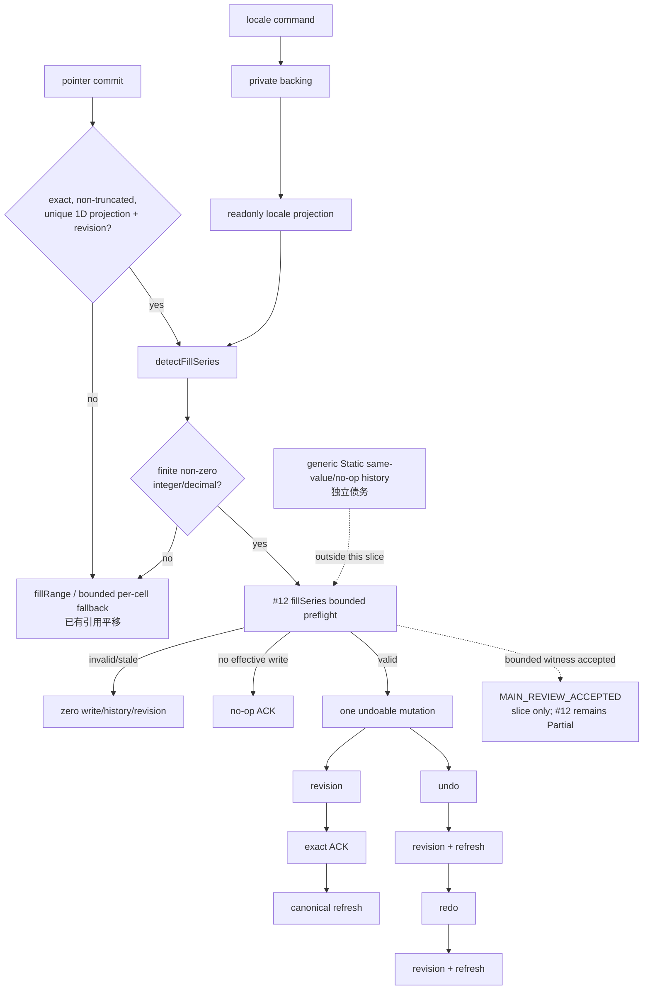
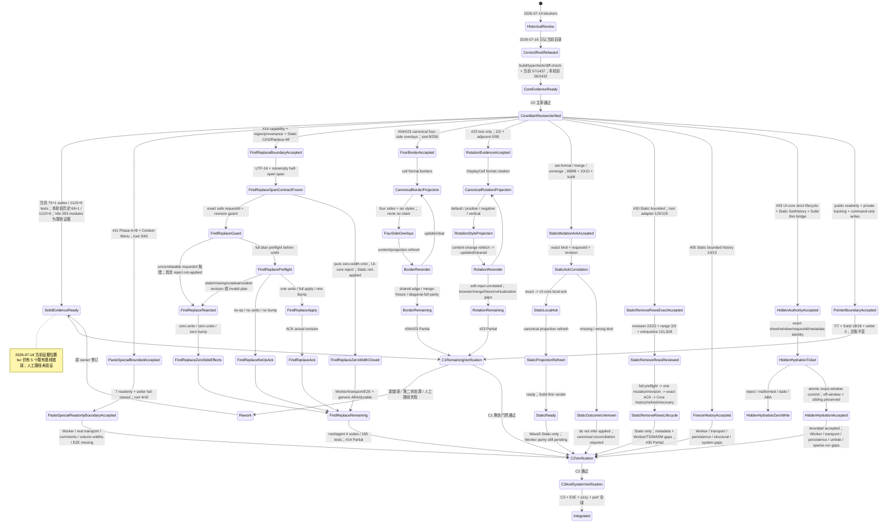

# Online-Excel-Parity 计划评审（2026-07-14）

## 2026-07-16 收口复审附录

本节是当前代码复审结论；下方 2026-07-14 内容保留为当时的不可回写评审记录。两者冲突时，只以 `/Volumes/work/self/einfach` 当前代码、当前验证输出和本附录为准，旧 worktree 只作历史线索。

### 2026-07-17 #03 hidden rows/columns bounded `MAIN_REVIEW_ACCEPTED` 复审增补

当前 #03 收口证据按集合分层：`/root` targeted **7 suites / 216 tests PASS**（owner Solid/Grid **3 suites / 101 tests** + UI-core/Core **4 suites / 115 tests**）；独立 reviewer 的 Grid 新增 **3 tests** + 相邻全量 **74 tests** = **77 tests**，core/menu/hidden/boundary **115 tests**，ContextMenu **24 tests**。UI-core build PASS；全量 UI-core **57/57 suites、1437/1437 tests PASS**；全量 Solid **70 passed + 1 skipped suites（71 total）、1125 passed + 6 skipped tests（1131 total），0 failed**；Vite **293 modules PASS**。Full Solid `tsc` 仍是 exit 2、恰 5 条未变化的 Worker baseline diagnostics，不能写成 PASS。

#03 的旧版“隐藏只改本地 atom、没有 backend/history”口径已经失效。当前 UI-core 以 private backing + readonly projection 管理每表 UI hidden projection，`runViewportHiddenMutationAtom` 统一四种 hide/unhide lifecycle；Static 用每表 canonical `Set<number>` 保存事实与 history。新接受的 Format Top Menu selection Unhide 只由 Solid 转发 `{ source, action }` 到 `runViewportHiddenSelectionMutationAtom`：active mutation 时 `blocked` 且保留当前 lifecycle/active ticket；按 action/source → exactly one region → primary sheet → region sheet 与 primary 一致 → valid range → authority ready → source object identity → authority sheet → non-null valid revision → valid authority.window → target-axis coverage 预检，再用 canonical private hidden ∩ selection 派生 indices。invalid shape、invalid authority 或空交集都写 `blocked`，零 backend transport/hidden-projection commit并保留 active hydrate。非空交集只冻结完整 `authority.window` 并 delegate 既有 lifecycle；capability/readback 缺失进 `unsupported`，requestId 耗尽进 `blocked`，两者都保留 hydrate；只有 supported + requestId issued + mutation ticket installed 才 supersede hydrate。matching sheet/request + valid revision ACK、同 ticket canonical kind/sheet/request/revision/full-window readback、strict hidden arrays 与 local hidden-projection object identity（bounded ABA guard）全部通过，才在完整冻结窗口 reconcile rows/columns、保留 off-window projection并回 `ready`；当前 ticket 的校验失败进 `recovery-required`，被替换的旧 continuation 只 stale-return、零旧 projection 写入。Solid 不持有第二状态源。

Top Menu 本轮前历史定向快照为 **4 suites / 171 tests**：Core hidden **95/95** + UI-core menu **6/6** + Solid MenuBar **61/61** + package-boundary **9/9**；前三组 **162/162**，boundary 单独 **9/9**。此前 Solid Menu **58/58**、总计 **168/168** 与前三组 **159/159** 仅保留为历史时点证据。历史 authority/hydration 证据继续独立保留为 adapter **106/106**、UI hidden **53/53**、Solid Menu **54/54**、hydration **36/36** + Solid Grid **5/5**、root UI-core **98/98** + Grid **74/74**。当前全量 gate 为 UI-core **57/57 suites、1437/1437 tests**、build/typecheck PASS，Solid **70 passed + 1 skipped suites（71 total）、1125 passed + 6 skipped tests（1131 total），0 failed**。既有 Vite build 为 PASS（293 modules）。Full Solid `tsc` 非绿且精确仅有 5 条未修改、禁止扩围的 `worker-runtime*` baseline diagnostics。五张状态流见 [README｜#03 隐藏行列 bounded 状态流](./README.md#03-隐藏行列-bounded-状态流main_review_accepted)；本轮三路是 #03 Context Hide/Unhide `MAIN_REVIEW_ACCEPTED / released`、#23 Shared-edge Contract `Blocker / Pending`、Docs Evidence `MAIN_REVIEW_ACCEPTED / released`，已分别完成上述最终流转，见 [README｜本轮三路并发→主审状态流](./README.md#本轮三路并发主审状态流)。#23 不是安全告警或产品失败，裁决前不写实现；#03/#23 保持 `Partial`。

限定接受不升级产品行。默认 `VNextWave5Demo` 现在把真实 `SpreadsheetMenuBar` 挂在与 Workbook 相同的 `SpreadsheetUiProvider` 内，Format 菜单中的 Row Unhide / Column Unhide 在默认 Wave5 Static host 可达。两个 Worker backend 仍没有 hidden projection/mutation capability；Static-capable Context Menu 已具备真实 Hide/Unhide 可达链。UI-core 在菜单可见性与点击时重验 capability；Worker backend 没有 hidden capability 时隐藏命令并 fail-closed，绝不显示可用命令。Worker/Rust/真实 transport、durable/sparse 与系统门禁仍缺，所以 #03 保持 `Partial`，严格总账仍为 **41 = 0 `Verified` / 35 `Partial` / 5 `Missing` / 1 `Deferred`**。九文件白名单由 README 逐项冻结；adapter 脏改不在本切片，本切片未触碰 Core/Rust/三份 Worker convergence 文件且尚未 commit。数据分析和打印继续完全延后。

### 2026-07-17 Wave5 真实菜单 host 接线复审增补

默认 Wave5 host 的真实 `SpreadsheetMenuBar`、Workbook、Text to Columns / Remove Duplicates dialogs 都位于同一个 `SpreadsheetUiProvider`。可见 Data > Text to Columns 菜单与兼容 `CustomEvent` 都只调用 UI-core 的 `runTextToColumnsEntrypointAtom`；hydrate、dialog、apply、严格 ACK 与 recovery 生命周期仍由 UI-core / `@einfach/core` 独占，Solid 只是事件与渲染薄桥。默认真实 MenuBar 的 Data > Remove Duplicates success / undo E2E 已独立验收，只证明 Static host，#30 仍为 `Partial`。host 通过 `hiddenItemIds={['file.printPreview']}` 在渲染前过滤打印入口，所以默认 host 没有打印菜单 DOM，也不会产生 click/Core dispatch；这只落实“完全延后”的 host gate，不构成 #16 Print 实现，也不删除其他 host 可用的 generic registry item / shell。完整状态流见 [README｜Wave5 真实菜单、Text to Columns 与打印 host gate](./README.md#wave5-真实菜单text-to-columns-与打印-host-gatestatic-only-e2e)。

新增 Wave5 E2E 只证明默认 **Static host** 的真实菜单、Format Unhide 可达性、Remove Duplicates success / undo 和打印入口隐藏，不能外推成 TS/WASM parity。此前 #13 可见菜单的 TS/WASM **2/2** 真实 backend 证据继续独立保留；本增补不覆盖或重解释该证据。

### 2026-07-17 #12 bounded `MAIN_REVIEW_ACCEPTED` 复审增补

#12 的旧版未接线口径已经失效。当前 Grid 只有在 pointer commit 拿到未截断、无重复、精确覆盖、带 revision 的严格一维 canonical source 后才调用 UI-core `detectFillSeries`；仅有限、非零的整数/小数序列进入 `fillSeries`，其余仍走 `fillRange` / 受限逐格 fallback，其中 bounded per-cell fallback 已有引用平移。locale 的唯一写入口是 command，状态留在 private backing 并经 readonly atom 投影。只有 #12 `fillSeries` bounded path 会先在 Static 中预检整份计划，成功只做一次 undoable mutation、一次 revision、精确 ACK 与 canonical refetch；invalid/stale 保持零写入/零历史/零 revision，空有效计划走 no-op ACK，并保留 undo/redo。

本增补现为 bounded `MAIN_REVIEW_ACCEPTED`。独立 reviewer **4 suites / 144 tests PASS**；`/root` 主审 adapter **99/99**、fill **17/17**、scaling **16/16**；该 bounded 包接受时的历史 Solid full 快照为 **69 passed / 1 skipped suites（70 total）、1080 passed / 6 skipped tests（1086 total）**；当前权威 Solid full 为 **70 passed / 1 skipped suites（71 total）、1125 passed / 6 skipped tests（1131 total），0 failed**，Vite build **PASS**；Full Solid `tsc` 仍仅 5 条禁止扩围的 Worker baseline diagnostics。接受范围仅限 #12 `fillSeries` 的 plan/no-op/preflight/单 mutation/单 revision 与 undo/redo witness，不得外推为 Static 全局 history/no-op 原子性完成；generic Static same-value/no-op history 仍是独立债务。bounded per-cell fallback 已有引用平移，但完整 formula-series、Worker/真实 transport parity、date/weekday/month/custom、可见命令及 E2E/a11y/perf/系统门禁均未实现。#12 保持 `Partial`，严格总账仍为 **41 = 0 `Verified` / 35 `Partial` / 5 `Missing` / 1 `Deferred`**；第 9 组数据分析与第 16 组打印继续完全延后且位于 41 项之外。

### 当前裁决

| 复审项                              | 2026-07-16 代码结论                                                                                                                                                                               | 证据 / 限制                                                                                                                                                                                                                                                                                                                                                                                                                                                                                                                                                                                                                                                                                      | 主审状态                     |
| ----------------------------------- | ------------------------------------------------------------------------------------------------------------------------------------------------------------------------------------------------- | ------------------------------------------------------------------------------------------------------------------------------------------------------------------------------------------------------------------------------------------------------------------------------------------------------------------------------------------------------------------------------------------------------------------------------------------------------------------------------------------------------------------------------------------------------------------------------------------------------------------------------------------------------------------------------------------------ | ---------------------------- |
| 唯一交付源                          | 正确目录已统一为 `/Volumes/work/self/einfach`                                                                                                                                                     | 禁止从 `einfach-online-excel-*` 或其他旧 worktree 再搬运                                                                                                                                                                                                                                                                                                                                                                                                                                                                                                                                                                                                                                         | `Accepted as boundary`       |
| 状态核心                            | 本批次 vnext 业务状态已收敛到只依赖 `@einfach/core` 的 UI-core                                                                                                                                    | `vanilla/spreadsheet-ui-core/package.json` 与本批 feature atoms/store；不表示整个 legacy Solid 已迁完，本裁决也不代替 C1 对 Solid 接线的剩余检查                                                                                                                                                                                                                                                                                                                                                                                                                                                                                                                                                 | `MainReview verified`        |
| UI-core 实现                        | 本轮 feature Core 已收口到正确目录                                                                                                                                                                | `comments`、`editing`、`filter-sort`、`format-cells`、`format-painter`、`go-to`、`history`、`operations`、`paste-special`、`projection`、`selection`、`sheet-tabs`、`status-bar`、`text-to-columns`、`workspace`、`conditional-formatting`、`data-validation`、`find-replace`、`name-box`、`named-ranges`、`toolbar`、`remove-duplicates`、`protection`                                                                                                                                                                                                                                                                                                                                          | `MainReview verified`        |
| UI-core 验证                        | 当前 `/root` 全量 57/57 suites、1437/1437 tests PASS；UI-core build PASS；本轮前 56/56、1432/1432 仅为历史快照                                                                                    | 只证明 framework-agnostic Core 直接行为；早期 C0 的 55/1253 与后续 55/1261、55/1274、56/1328 仅保留为对应时点证据                                                                                                                                                                                                                                                                                                                                                                                                                                                                                                                                                                                | `C0 verified`                |
| 工作表/范围 Protection（保护/解锁） | Core 严格恢复状态已覆盖：`Editing → Verifying → Mutating → CanonicalRefreshing → Closed/Editing/RecoveryRequired`                                                                                 | 不是通用安全子系统；recovery 只允许 canonical read，不得 mutation replay；identity/revision witness 必须精确；Core verified，真实 backend/adapter canonical read 仍 C2 pending                                                                                                                                                                                                                                                                                                                                                                                                                                                                                                                   | `Core verified / C2 pending` |
| load/restore 与 stale response      | projection/workspace 与保护恢复使用 latest-read gate                                                                                                                                              | 旧 A/B response 不得覆盖新 sheet、restore 后状态或新 editor session                                                                                                                                                                                                                                                                                                                                                                                                                                                                                                                                                                                                                              | `Core verified`              |
| 公共合同                            | 未为专题实现随意扩大根导出；Static `removeRowsExact` 只按现有 bounded consumer contract 接受                                                                                                      | 该裁决不扩大为 Worker/TS/WASM 合同，也不证明完整 row-deletion metadata parity；named-range 继续按其独立 bounded 裁决记账                                                                                                                                                                                                                                                                                                                                                                                                                                                                                                                                                                         | `Bounded accepted / guarded` |
| Solid Jest / Vite                   | 当前 `/root` full `--silent` 为 70 suites passed + 1 skipped（71 total）；1125 tests passed + 6 skipped（1131 total），0 failed、exit 0；本轮前 69+1 / 1122+6 仅为历史快照；Vite 293 modules PASS | Full Solid `tsc` 仍为 exit 2、恰 5 条 Worker baseline diagnostics；这些命令不证明人工功能路径已闭环                                                                                                                                                                                                                                                                                                                                                                                                                                                                                                                                                                                              | `C1 EvidenceReady`           |
| Solid `tsc`                         | 命令 exit 2，恰好 5 条 diagnostics                                                                                                                                                                | 均为禁止扩围且未修改的 worker baseline：`worker-runtime-ts.ts` 864、1306×2、1312，`worker-runtime.ts` 264；明确不得写成 `tsc PASS`                                                                                                                                                                                                                                                                                                                                                                                                                                                                                                                                                               | `C1 not complete`            |
| #03 Hidden rows/columns             | Static authority + Grid hydration + Format Top Menu selection Unhide 已接受；产品仍为 `Partial`                                                                                                   | 历史 4 suites / 171 = 95 + 6 + 61 + 9，前三组 162；旧 168/159 仅为历史；历史 hydration 36/36 + Grid 5/5、root 98/98 + Grid 74/74。Core 持有 ACK/readback 与 click-time selection gate；默认 Wave5 同 Provider 真实菜单使 Unhide 在 Static host 可达，但 Worker 菜单无 hidden capability、Static-capable Context Menu 已可达，新增 E2E 也仅为 Static-only。五张 Mermaid 见 [README｜已实现关键 Core 状态流](./README.md#已实现关键-core-状态流)                                                                                                                                                                                                                                                   | `Bounded accepted`           |
| #05 Freeze Panes                    | Static authority 与 bounded undo/redo slices 已接受；产品仍为 `Partial`                                                                                                                           | authority 证据为 UI-core 25/25、Solid 171/171、boundary 5/5、两个 build；history targeted 10/10，覆盖 `Freeze A → B → undo B → undo A → redo A → redo B`、delete configured → undo restore → redo delete、invalid/stale 不建历史。仍缺 Worker/real transport、durable persistence/hydration、structural-transform 与系统门禁；完整 Mermaid 见 [README｜Pointer / Freeze bounded 状态流](./README.md#pointer-freeze-bounded-state-flows)                                                                                                                                                                                                                                                          | `Bounded accepted`           |
| Pointer 状态边界                    | public readonly / private backing / command-only writes 已接受                                                                                                                                    | `pointerSessionAtom` / `pointerIntentAtom` 只读；start/update/commit/cancel commands 是唯一写入口，commit intent 后回 idle。唯一 Solid direct-setter fixture 已迁移；UI-core 7/7、Solid overlay 18/18、setter scan 0。完整 Mermaid 见 [README｜Pointer / Freeze bounded 状态流](./README.md#pointer-freeze-bounded-state-flows)                                                                                                                                                                                                                                                                                                                                                                  | `Boundary accepted`          |
| #12 Auto Fill                       | Static numeric `fillSeries` bounded witness 已接受；产品仍为 `Partial`                                                                                                                            | 独立 reviewer 4 suites / 144 tests；root adapter 99/99、fill 17/17、scaling 16/16；仅接受 exact canonical 1D + revision、preflight、单 mutation/revision、ACK/refresh 与 undo/redo witness。generic Static no-op history、完整 formula-series、Worker/transport 与系统门禁仍缺                                                                                                                                                                                                                                                                                                                                                                                                                   | `Bounded accepted`           |
| #11 Paste Special                   | Phase A + Phase B、Context Menu 与状态边界 bounded slices 已接受；产品仍为 `Partial`                                                                                                              | Context Menu 响应式读取 canonical capability，click-time second guard 后才创建 Core session，unsupported / stale revoke 零 transport（root 3/40）；7 个 public state atoms 已收口为 private backing + readonly projections，外部 setter fail-closed，真实 lifecycle 为 `pending → local-acknowledged → refreshing → closed`（root 4/42，仅既知 jsdom canvas console noise）。Worker `pasteRange` / real transport、comments / column-widths、完整 E2E 仍缺。完整命令/ACK/恢复流见 [README｜已实现关键 Core 状态流](./README.md#已实现关键-core-状态流)                                                                                                                                           | `Bounded accepted`           |
| #14 Find / Replace                  | capability/state、Static regex/provenance 与 CAS/Replace All atomic bounded slices 已接受；产品仍为 `Partial`                                                                                     | `replaceMatches` 返回既有 response 联合；Static exact requestId+revision guard、全计划 preflight、exact not-applied 零副作用、no-op 无 undo/bump、成功单 undo/单 bump/实际 revision ACK 已由 root/agent 4 suites / 165 tests 接受；此前 capability 82/82 + build、regex/provenance root 4/157 + focused 6/6 保留。span 合同已冻结为 UTF-16 code units 的非空半开 `[start, end)`；纯 zero-width 结果安全推进后省略，UI-core 在 ticket/mutation 前拒绝 zero/reversed span，Static 直接 replacement 返回 exact not-applied，均零副作用。仍缺 Worker parity/real transport/E2E、generic ABA/durable cross-runtime；完整状态流见 [README｜已实现关键 Core 状态流](./README.md#已实现关键-core-状态流) | `Bounded accepted`           |
| #04/#23 canonical 四边框            | canonical projection → four-side overlay bounded slice 已接受；两项仍为 `Partial`                                                                                                                 | Grid 只读 `cell()?.format?.borders`，真实绘制 top/right/bottom/left 与 6 种样式；none 不绘制/不宣称 `data-borders`，projection 可更新/移除；selection/fill-handle z-index 3 高于 border z-index 1；无 Solid mirror。root 8 suites / 258 tests。仍缺 adjacent shared-edge conflict、merge/freeze、diagonal/full Excel parity；状态流见 README                                                                                                                                                                                                                                                                                                                                                     | `Bounded accepted`           |
| #23 canonical rotation              | 纯测试证据切片已接受；#23 仍为 `Partial`                                                                                                                                                          | 仅新增 `vnext-grid-cell-rotation.test.tsx`，无实现/contract/Core/Worker 改动；定向 2/2、邻接 5 suites / 95 tests PASS。canonical `DisplayCell.format.rotation` 投影 default/正负角度/vertical style；content-change refetch 后更新/清除并重渲染，编辑 input 不继承 rotation。仍缺真实浏览器 auto-fit/hit-area、merge/freeze/virtualization                                                                                                                                                                                                                                                                                                                                                       | `Bounded accepted`           |
| Static 格式 / 合并 exact ACK        | `set-format`、`merge`、`unmerge` 精确 ACK bounded slice 已接受；相关产品行仍为 `Partial`                                                                                                          | Static 回传与请求一致的 `kind` + `requestId` / `revision`（适用时含 range）；UI-core strict correlation 走 `local-ack → canonical projection refresh → ready`，错误/缺失 `kind` 仍进 `outcome-unknown`。adapter Jest 88/88、Toolbar Playwright 10/10、Vite build PASS。Wave5 固定 Static，wasm/ts 两项目只是重复 Static 验证，不是 Worker parity；Worker adapter 原有 `kind` 且未改                                                                                                                                                                                                                                                                                                              | `Bounded accepted`           |
| #30 Static `removeRowsExact`        | exact row-removal bounded slice 已最终接受；产品仍为 `Partial`                                                                                                                                    | `/root` adapter 整文件 125/125、独立 reviewer 22/22、range child 3/3 + 101,928 穷举。只接受 Static 的完整预检、invalid/stale 零副作用、一个 `fullSheet` history capture（当前 `FullSheetCapture` 覆盖的 per-sheet tables，O(one sheet)，非 O(workbook)）/ 一个 undo entry / 一次 mutation/revision、exact ACK，以及 UI-core history / canonical refresh / recovery；该 capture 不等于完整 metadata parity。不与既有 exact-bridge owner 4/15、root WASM/TS 4/4 混算，也不证明 Worker/TS/WASM 或 merge/name/validation/conditional-formatting/filter/freeze 等 metadata parity                                                                                                                     | `Bounded accepted`           |
| default demo                        | `http://127.0.0.1:5173/` 返回 HTTP 200                                                                                                                                                            | 只证明服务可访问；人工关键路径与 console 仍未验证                                                                                                                                                                                                                                                                                                                                                                                                                                                                                                                                                                                                                                                | `Availability verified`      |
| C2 backend/adapter                  | Static exact ACK 仅有上述 bounded acceptance；完整 C2 尚未验证                                                                                                                                    | Worker/真实 transport parity、restore/stale gates 与跨运行时合同证据仍缺；不得用 Wave5 的 Static 双项目结果代替                                                                                                                                                                                                                                                                                                                                                                                                                                                                                                                                                                                  | `Bounded / overall pending`  |
| C3 / E2E / a11y / perf              | 尚未验证                                                                                                                                                                                          | 未闭环能力与系统级门禁不能由 UI-core 或 Solid Jest/Vite 结果代替                                                                                                                                                                                                                                                                                                                                                                                                                                                                                                                                                                                                                                 | `Pending / unverified`       |
| 第 9 组数据分析                     | 本批次无新增、完全延后                                                                                                                                                                            | 不排期、不占槽、不做“顺手前置”                                                                                                                                                                                                                                                                                                                                                                                                                                                                                                                                                                                                                                                                   | `Deferred`                   |
| 第 16 组打印                        | 本批次无功能实现、完全延后                                                                                                                                                                        | 默认 Wave5 host 以 `hiddenItemIds` 在渲染前隐藏 `file.printPreview`，只证明无入口/无 dispatch；现有 generic print 壳或测试不能升级为完成声明                                                                                                                                                                                                                                                                                                                                                                                                                                                                                                                                                     | `Deferred`                   |

### 复审结论

当前结论是 **`C0 MainReview verified`**；C1 仅推进到带限制的 `EvidenceReady`。#03 hidden Static authority + Grid exact-window hydration + Top Menu selection Unhide、#05 Static authority + bounded history、Pointer、#12、#11、#14、#04/#23、Static exact ACK 与 Static `removeRowsExact` 都只是 bounded acceptance。状态切片保持 UI-core / `@einfach/core` 为状态权威、Solid 为薄桥；默认 Wave5 同 Provider 真实菜单只闭合 Static host 的 Format Unhide 可达性。#03 的产品缺口仍是 Worker demo 无 hidden capability/Context Menu reachability，以及 durable/sparse/system gaps；Static-capable Context Menu 已可达，绝不能外推成“Worker 菜单可用”。新增 Wave5 E2E 仅为 Static-only；#16 的隐藏打印入口只落实延后 gate，不是功能实现。严格总账保持 **0 `Verified` / 35 `Partial` / 5 `Missing` / 1 `Deferred`（41 项）**；数据分析/打印继续完全延后。完整 Worker/transport/E2E、durable、C3、a11y、性能仍 `pending / unverified`，整套 Online Excel 仍不是 `Integrated`。

---

以下是 2026-07-14 历史 MainReview 原文。

- **评审对象**：本目录 9 份文档（README、02/03/04/05/06、comments-notes-tasks、13-changes、MULTI_AGENT_EXECUTION），共 4186 行，基于 2026-07-13 审计快照撰写。
- **评审方法**：四个维度并行独立审（基线事实核对 / 公式与数据线 / 排期估算与依赖 / 多 agent 执行模型），主审交叉校验。每条发现均给出 计划文档:行号 + 代码佐证 文件:行号。
- **对照基线**：git HEAD `2feea48`（含 2026-07-13/14 落地的 Wave 8.2 async custom formulas 全部 10 个提交）。
- **结论**：按本计划自己的状态机判 **`MainReview → Rework`**。内容审计质量高（基线断言抽查 8/8 吻合、521 人日双向算术闭合、06 线零缺陷），但存在 4 个 blocker，修订后方可启动 W1。阶段 0（W0 审计）可以继续，但产出须以修订后的文档为准。

---

## 一、最重要：不该做什么（负面清单）

> 修订与后续执行中，以下每一条都是"做了就返工"级别的红线。逐条附依据。

### A. 不要重复建设已经落地的东西

1. **不要重做异步自定义公式的执行机制。** 异步执行、结算、陈旧丢弃、级联编排已全部落地并通过双引擎测试：引擎契约 `rust/excel-core/src/CUSTOM_FORMULAS.md` § "Async custom formulas (Wave 8.2)"，共享 pump `solid/excel/src-vnext/adapter/async-custom-pump.ts`，wasm 出入口 `rust/wasm/src/lib.rs`（`registerCustomFormulaAsync` / `drainAsyncCustomRequests` / `resolveAsyncCustomCall`）。F13（05-formulas.md:160，8 人日）只应保留：iframe 沙箱、远程 provider 协议、TTL/手动刷新（RTD 语义）。
2. **不要给 WASM 排"LAMBDA 引擎缺口"的活。** 引擎和 wasm 桥都已支持 `defineName("SQUARE", "=LAMBDA(x, x*x)")`（`rust/wasm/src/lib.rs:2065-2090`、`rust/excel-core/src/workbook.rs:309/324-344`）。真实缺口只是 `worker-runtime.ts:1776-1787` 一处人为的 RPC 拒绝。F9（05-formulas.md:156，6 人日）是接线活，不是引擎活。
3. **不要重新"定义"已存在的 backend 端口形状。** `mergeRange/unmergeRange/readFreezeConfig/setFreezeConfig/hideRows/hideColumns` 等端口类型已在 `vanilla/spreadsheet-ui-core/src/backend/types.ts:779-786` 声明，缺的是 adapter 实现。02-worksheet-structure.md:116 的"定义端口"应改为"补齐实现"。
4. **不要绕开或复制 `subscribeContentChanges`。** 引擎自发内容变更（异步 settle、未来协同）→ UI 刷新的通道已存在（`backend/types.ts` 尾部 + `SpreadsheetGrid.tsx:1017-1023`）。任何"引擎推送"类需求走这个口扩展，不另开通道。

### B. 不要动摇已定契约

5. **不要把 `#BUSY!` 用作"并发超限/容量"错误码。**（05-formulas.md:288 的建议必须改。）`#BUSY!` 是引擎保留的异步 pending 令牌：settle 后被真实值替换；回调返回它会被降级为 `#VALUE!` 以防单元格永挂（CUSTOM_FORMULAS.md:157/195-227）。超限另取错误码或 capability error。同时把 `#BUSY!` 补进 05-formulas.md:85 的错误码归一化清单，单列 pending 语义。
6. **不要用 §14 的 per-request（requestId/idempotencyKey/reconciliation）模型覆盖自定义公式。** 自定义公式的契约是 **memoize-until-registry-change**（同名同参在注册表变更前只执行一次，CUSTOM_FORMULAS.md § Async 标注为 load-bearing API rule）。§14 模型只适用于尚未实现的远程 provider；两套模型的适用边界必须在 05-formulas §14 里写清，不能混用。
7. **不要在引擎里加 per-name / address→formula 反向索引。** Store 依赖边是唯一失效权威，注册表失效故意粗粒度（CUSTOM_FORMULAS.md § Registry invalidation、`rust/docs/ATOM_DELEGATION_MAINLINE.md`）。任何"精确失效"需求走 per-call atom / epoch root 模式。
8. **不要破坏仓库三条铁律**（各文档已承诺，执行期同样适用）：ui-core 不 import DOM/worker/WASM/Solid；禁 per-cell/per-row/per-col atom family（大表一律走可视窗口投影或声明了 cap 的有界缓存）；backend 端口"方法存在性=能力"，UI 按缺失自动降级。

### C. 不要在执行编排上踩今天刚踩过的坑

9. **专题线不要直接改汇聚文件。** `SpreadsheetGrid.tsx`（3429 行）、`worker-runtime.ts` / `worker-runtime-ts.ts` / `worker-protocol.ts` / `worker-workbook-backend.ts`、`SpreadsheetUiProvider.tsx` 是七条线的必经汇聚点，但 MULTI_AGENT_EXECUTION.md:58-68 的所有权表没有覆盖它们。修订时必须指定单一接线 owner（或主 agent 持有 + 专题线只交定向补丁串行合入）。
10. **不要在共享工作树上留中间态。** pre-commit（`.husky/pre-commit`）跑全仓 `npm run build && npm test`，任何一个 agent 的半截改动会卡死所有人的提交与 dev server——2026-07-14 当天 name-box 两行残片真实造成过此事故。修订必须补"隔离与提交纪律"章节：每线独立 worktree/分支、绿态才合入、主 agent 串行集成。
11. **不要用 `npm run eslint` 做定向 lint。** 该脚本固定全仓 `./ --fix`，追加文件参数无效，会误改并行会话的在制文件。定向检查直接调 `npx eslint --config rules/.eslintrc <文件>`（不带 `--fix`）。
12. **不要另立第三套协作协议、也不要丢 `blocked` 态。** MULTI_AGENT_EXECUTION 与既有 `vanilla/spreadsheet-ui-core/docs/AGENT_COLLABORATION.md` 平行存在、互不引用：状态机词汇不对齐（新方案没有 `blocked`——它正是既有协议处理同文件冲突的机制）、CC/Codex 与 A0x 无映射、可执行的命令门禁被替换成了判据勾选。修订须明确取舍关系并把命令门禁绑回来。
13. **发布动作不归 agent。** W4 的"发布 P0/P1"（README.md:144）必须显式标注为用户决策门：agent 只产出 DoD 全绿证据与建议，**不执行 push、不创建 tag、不改 `.github/workflows`**。"唯一发布裁决"（MULTI_AGENT_EXECUTION.md:78/90）的措辞需改为"唯一发布**建议**汇总"。

### D. 不要做这些排期假设

14. **不要假设批注平台"零成本通用化"。** 第 13 组 84 人日建立在"identity/ACL/存储/事件平台 0 人日复用批注 C0/C1"上（13-changes:500/510），而 C0/C1 只有 12 人日、按批注领域建设。必须在 C1 验收门（M0.5）里显式验证"通用 workbook revision 事件契约"，否则该假设作废。
15. **不要让依赖最密集的阶段满载。** 阶段 1 容量 165 / 需求 165、零缓冲（README.md:141），却同时装着批注平台底座这个全局单点。至少挪 10% 到阶段 2 的 42 人日余量里。
16. **不要把"3 个并发 agent"与"11 FTE 吞吐"当两本互不相干的账。** README 要求阶段 1 15 天交付 165 人日 ≈ 11 FTE，波次表每波只挂 3 条专题线（MULTI_AGENT_EXECUTION.md:56/75）；且"当前启动批次"（:84-90）列了 5 个并发、自破上限，批注 agent 首次出现在 W2（08-10）却要满足 M0.5=08-07 的里程碑。三处必须对齐成一本账。

---

## 二、Blockers（放行前必须修）

| #   | 问题                                                                                                                                                                                                                    | 计划出处                                           | 代码佐证                                                                                        |
| --- | ----------------------------------------------------------------------------------------------------------------------------------------------------------------------------------------------------------------------- | -------------------------------------------------- | ----------------------------------------------------------------------------------------------- |
| B1  | **对 7-14 HEAD 失准**：05-formulas 的"异步/自定义/LAMBDA"三块按 7-13 快照写成"未实现/全部待建"；F13 重复排工、"无法防陈旧覆盖"的断言不成立（引擎有 call_id+generation、pump 有引擎身份守卫、缓存有 cap 512 三重防护）   | 05-formulas.md:20/79/84/89/90/136/156/160/288、§14 | CUSTOM_FORMULAS.md:178-268；async-custom-pump.ts；lib.rs:2538；SpreadsheetUiProvider.tsx:45-101 |
| B2  | **revision log 时序倒挂**：2~6 组的每条 mutation 都要原子登记修订记录，但契约冻结被排在阶段 3 的第 13 组自己身上（09-07 动工），早期组要么留洞要么回填返工。需前置为"阶段 0.5 统一 revision/transaction 契约冻结"硬门禁 | README.md:161；13-changes:60/129/516/539/592       | —（文档内部时序矛盾）                                                                           |
| B3  | **汇聚文件无 owner、无合入仲裁**（见负面清单 #9）                                                                                                                                                                       | MULTI_AGENT_EXECUTION.md:58-68                     | SpreadsheetGrid.tsx 3429 行；worker-runtime\*.ts 共 ~130KB                                      |
| B4  | **零 worktree/分支/提交纪律约定**（见负面清单 #10），与全仓 pre-commit 直接冲突                                                                                                                                         | MULTI_AGENT_EXECUTION.md 全文无命中                | .husky/pre-commit；package.json:20                                                              |

## 三、Major（修订时应处理）

1. `#BUSY!` 语义冲突（负面清单 #5）。05-formulas.md:85/288。
2. WASM LAMBDA 误判为引擎缺口，F9 高估（负面清单 #2）。05-formulas.md:79/84/156/266/483。
3. 同步自定义公式已是贯通 backend 端口的可用能力，计划记为"P2 默认关闭/待建"；安全评审（05-formulas.md:578，09-11 截止）晚于能力已上线的事实，需前移。
4. 04 条件格式的 revision-keyed 统计缓存收不到引擎自发变更（`subscribeContentChanges` 无 revision payload）的失效信号 → 陈旧 overlay。04-cell-formatting.md:207 vs SpreadsheetGrid.tsx:1020-1023。
5. 阶段 1 零缓冲 + 批注平台单点 + 批注 agent 波次晚于其里程碑（负面清单 #15/#16）。README.md:130/141；comments:443-463；MULTI_AGENT_EXECUTION.md:74-76/84-90。
6. 两套协作协议并存互不引用（负面清单 #12）。MULTI_AGENT_EXECUTION.md:117-135/151-162 vs AGENT_COLLABORATION.md:29-36/88-118。
7. W4 发布门未标注用户决策（负面清单 #13）。

## 四、Minor（随手修）

- 02:42 Merge & Center 机理描述反了：代码是"只合并、彻底不施加居中"（toolbar/SpreadsheetToolbar.tsx:972-991），不是"居中成为独立历史项"。
- 03 §状态机应补一句：`subscribeContentChanges` 的 revision-less refetch 与 current-ticket/ledger 模型正交共存，不要把引擎 push 塞进 idempotencyKey 体系。
- README:130-131"专属小组最早结束"列在含/不含 P2 上口径不一（批注 09-18、13 组 10-16 都是含 P2 的日期），统一口径或拆两列。
- 05-formulas §19 证据索引补 `CUSTOM_FORMULAS.md`、`async-custom-pump.ts`。
- 06 的 P0 迁移路径显式引用 D-7 permutation 缓存（worker-workbook-backend.ts:361-374）作为"权威下沉后仍需保留的窗口化读取契约"。
- 双引擎（wasm+TS）conformance 的额度偏紧（第 5 组 63 人日、13 组 adapter 12 人日），建议单列 conformance 缓冲。
- MULTI_AGENT_EXECUTION 补"审计/E2E 线同样占专题并发额度"的口径，MCP 验证触发条件（AGENT_COLLABORATION.md:111-118 五要素）纳入各线 SelfChecked 前置而非 W4 统一补。

## 五、正向确认（不需要改的）

- 基线事实抽查 8/8 吻合（冻结前端-only、隐藏行列 `number[]`、merge static/worker 差异、边框 data-attr、paste-special no-op、find-replace 迁移、SheetMetadata 形状、CF cap 200），行号引用精确。
- 521 人日分组/阶段双向闭合，11 人构成、65 工作日、20% 缓冲、阶段 0 防重复计数全部自洽。
- 06-tables 线与代码精确对齐，下沉方向正确，零 blocker。
- 治理层设计（主设计冻结、dispatch 前后取消语义、ledger/reconciliation、返工规则）成熟；波次表本身未超并发上限。
- 计划全程无弧中 push/CI/workflow 动作（合规），问题仅是 W4 缺"需用户决策"注解。

## 六、建议的修订顺序

1. **对 HEAD 重校准**（B1 + Major 1/2/3/4）：以 `2feea48` 为基线重写 05-formulas §4 现状表、§9.4、§14、F9/F13，04 的 7.4/7.5 缓存失效路径，03 状态机补注。
2. **前置 revision 契约**（B2）：新增阶段 0.5 工作包 + "未登记 revision 的 mutation 不许合入"门禁，人日从 13 组拆出。
3. **补执行编排**（B3/B4 + Major 5/6/7）：汇聚文件所有权表、worktree/分支/提交纪律章节、与 AGENT_COLLABORATION 的取舍声明、并发账本统一、W4 用户决策注解。
4. Minor 顺手清掉。

---

_评审：Claude（主审）+ 4 个并行维度 agent。发现均已过主审交叉校验；对"计划 vs 代码"的每条冲突断言，代码侧行号在 HEAD `2feea48` 验证。_
