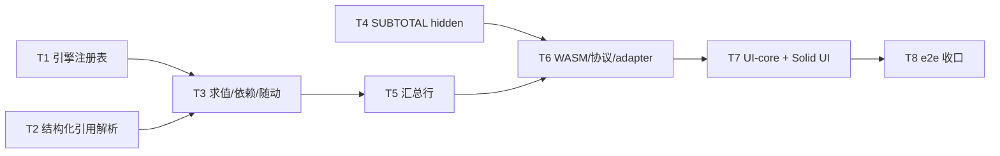

# #32 Excel Table（结构化引用、小计）设计文档

> 状态：设计稿（2026-07-19）。分支 `claude/rust-core-state-plan-Auzcj`，代码事实核对于 HEAD `c93a9dc`（文中行号为该时点，落地时以符号名为准）。
> 产品口径：#32 严格状态 `Missing`，canonical 归属 **引擎数据事实**（[CANONICAL_OWNERSHIP.md](./CANONICAL_OWNERSHIP.md) §3 行 32）；SUBTOTAL hidden 语义按 §7-1 裁决落地。本文档不改变严格总账 **41 = 0/35/5/1**，任何切片验收均为有界切片证据，不升级产品行。

## 1. 结论摘要

- **Table 模型建在引擎内**（`rust/excel-core`）：workbook 级注册表（名称唯一性与 named ranges / 内建函数 / 自定义公式共享一个命名空间约束），range 级事实随结构操作随动。
- **结构化引用只由 formula.rs 这一个 parser 承担**（延续 06 分册"禁止第二 parser"硬边界）：新增 `Expr::TableRef` AST 变体；`[` `]` `@` 当前在 tokenizer 中零词法角色，语法空间干净。
- **求值走"TableRef → 具体 SheetRange"的延迟解析**：解析结果复用既有 range 求值 / 流式遍历 / spill 物化机制；`[@列]` 用既有 `EvalProvider::current_cell()`（ROW()/COLUMN() 已在用）。
- **SUBTOTAL 101-111 hidden 语义 = 宿主推送端口**（§7-1"求值上下文推送"选推送端口而非每次重算传参）：UI-core hidden canonical 集合经新端口 `setEvalHiddenRows` 全量喂给引擎，引擎存为只读求值输入 + epoch 原子；失效复用引擎的 einfach 原子依赖图，精确到"真正读过 hidden 输入的公式"。
- **汇总行是 Table 内部行为**（非 sheet 结构操作）：toggle 扩/缩表 range 一行，被占则显式拒绝；每列小计以 `=SUBTOTAL(1xx, 表[列])` 经正常 `try_set_formula` 写入，公式单元格即事实（无双份真值）。
- **TS worker（`vanilla/excel-core-ts`）不实现**：capability 显式 `false`，fail-closed；WASM 是唯一真实路径。static-backend 不实现（端口缺失 → UI 隐藏入口）。

## 2. 背景与既有裁决约束

### 2.1 必须遵守的裁决

| 来源                                | 约束                                                                                                                                                                                       |
| ----------------------------------- | ------------------------------------------------------------------------------------------------------------------------------------------------------------------------------------------ |
| CANONICAL_OWNERSHIP §3 #32          | Table / 结构化引用 / 小计 = 引擎数据事实，新建时按引擎数据口径实现                                                                                                                         |
| CANONICAL_OWNERSHIP §7-1            | SUBTOTAL 101-111 hidden：宿主把 per-sheet 隐藏行集合作为**只读求值输入**喂给引擎（可选推送端口或求值参数）；引擎不建 hidden 模型、不感知来源（手动/filter 同一集合）；不在宿主复刻聚合语义 |
| CANONICAL_OWNERSHIP 横切规则        | WASM 唯一真实后端口径；TS worker fail-closed 开发后备，禁止假 ACK；undo = 宿主编排，不建引擎事务日志                                                                                       |
| 06 分册"结构化引用的硬边界"         | 公式文本解析唯一所有者是公式管线（formula.rs）；不得用正则识别 `Table1[Column]`、不得维护第二份依赖图                                                                                      |
| Luckysheet 参照范围（#32 任务口径） | 数据表格化 + 结构化引用（`Table1[Col]`、`[@Col]`、`#All/#Data/#Headers/#Totals`）+ 汇总行（SUBTOTAL 自动生成）为主体；表格带状样式、表内自动扩展可延后                                     |

### 2.2 引擎现状（代码真值，支撑后文所有选型）

- **解析器**：`rust/excel-core/src/formula.rs` 为手写字符级递归下降（无独立 token 枚举），入口 `parse_formula`（行 200），identifier 分流在 `parse_identifier`（行 791-963）：紧跟 `(` → `FuncCall`（名字大写化）；依次尝试 `!`（sheet 限定）、A1 地址、整列区间；全不匹配兜底 `Expr::Name`（保留大小写）。`[` `]` `@` 当前无任何词法角色；`#` 仅两个角色（错误字面量 `parse_error_literal` 行 563、spill 后缀 `parse_spill_suffix` 行 431）。
- **求值器**：`eval.rs` 主入口 `eval_expr_with_provider`（行 953）+ `eval_func` 巨型 match（行 2347）。`EvalProvider`（行 746-919）已有 `current_cell()`/`set_current_cell()`（行 805/813，ROW()/COLUMN() 在用）、`lookup_named`、`for_each_range_cell`（流式逐 cell 携带地址）。裸标识符 `Expr::Name` 求值期解析顺序：LET 帧 → `lookup_named` → `#NAME?`（行 1017-1034）；函数调用解析顺序：内建 → defined-name LAMBDA → host custom → `#NAME?`（`eval_named_call` 行 9364-9416）。
- **SUBTOTAL 现状**：`fn_subtotal`（行 19674-19698）把 101-111 **直接减 100 折算成 1-11**（已知 conformance gap）；共享体 `run_subtotal`（行 19487）经 `for_each_arg_value(arg, provider, |addr, v|)` 流式遍历——**回调携带单元格地址，即 hidden 过滤的天然接缝**。`AGGREGATE`（行 19701 起）同样未实现 ignore-hidden 选项。
- **命名注册表**：`workbook.rs` `named_values: BTreeMap<String, NamedEntry>`（行 131，workbook 级，key 大写、`canonical_name` 保留原大小写）；`define_name` 是 **parse + 立即求值存 Value 的 eager 快照**（行 324-345）——因此 Table 引用不能挂在 `named_values` 上，必须独立注册表 + 延迟解析。名称校验 `validate_name`（行 517-535）：`[A-Za-z_][A-Za-z0-9_]*`、≤255；`define_name_value` 用 `is_builtin_function_name`（eval.rs 行 104）拒绝内建名（`WorkbookError::ReservedName`）。
- **依赖图 = Rust 版 einfach 原子框架**（`rust/core/`，`vanilla/core` 的逐函数移植）：每 sheet 一个 `Store`（`sheet.rs:583`），公式求值经 `AtomFormulaProvider`（行 1516-1690）读 facade 原子自动登记依赖边；失效走 `Store::dependencies_change` 反向依赖 DFS（`rust/core/src/store.rs:799-838`），**key-granular**。Range 依赖分层：≤256 cell 逐 cell 边（Tier A），更大依赖 band/列/sheet 级 **geometry epoch 原子**（`depend_range_geometry_epochs`，`sheet.rs:1315-1343`）——"epoch 原子 + 侧存储"是本设计 hidden 集合与 Table 几何失效直接复用的既有模式。
- **结构操作**：`shift.rs` 只做公式引用重写纯函数（`ShiftEdit` 行 121、AST 重写 + parked 文本重写 + `render_formula` 行 761）；编排在 `sheet.rs::apply_structural_shift`（行 5158-5195）：spill 锚点、cell 格式、range 格式、行高列宽各自有手写随动循环，**没有统一 range-follow 钩子**；**named ranges 不随动**（eager Value 无 range 可随）；条件格式不随动。结构入口是 Sheet 方法，wasm 直连（`rust/wasm/src/lib.rs:2112` `insert_row` 直接委托 `sheet.insert_row`）——Table 随动需要 workbook 级包装（见 §4.3）。
- **引擎无 hidden 概念**（全量 grep 仅 `#[doc(hidden)]`）；行高列宽为引擎事实（`row_heights: BTreeMap<u32,u32>`，`sheet.rs:655`）。
- **JS 侧**：hidden 行 canonical 在 UI-core `vanilla/spreadsheet-ui-core/src/viewport/hidden.ts`（`viewportHiddenAtom`，per-sheet 排序去重 number[]；已有 fire-and-forget 持久化镜像端口先例 `persistHiddenMutation`）。worker 协议 `{id, cmd, payload}` / `{id, ok, result|error}`（`adapter/worker-protocol.ts`）；capability 声明 `WorkerRuntimeCapabilitiesWire`（行 216-227）+ TS runtime 全 `false` 先例（`worker-runtime-ts.ts:110-116`）+ adapter `runtimeSupports` 撤端口（`worker-workbook-backend.ts:1167-1169`，端口 `undefined` → UI 隐藏）。菜单按 capability 整条隐藏的先例：`data.removeDuplicates`（`menu-bar/index.ts:432` + `SpreadsheetMenuBar.tsx resolveCapability` 行 166-182）。自定义公式的 Provider diff→端口转发先例：`SpreadsheetUiProvider.tsx`。

### 2.3 与 06 分册的关系

[06-tables-data-management.md](./06-tables-data-management.md) 的 P1"Excel Table 生命周期"是完整目标态（样式、resize、mutation ledger、TableChanged 事件流）。本文档是 #32 的 **MVP 落地设计**：遵守其硬边界（唯一 parser、稳定元数据、backend 权威），但把交付面裁到 §3 的 in 清单；ledger/对账协议沿用当前 adapter 既有请求纪律（requestId + 严格 ACK），不在 MVP 建 06 分册的完整 unresolved-ledger 状态机。冲突处以 CANONICAL_OWNERSHIP 与本文档为准。

## 3. 范围裁剪（MVP in / out）

### 3.1 In（MVP 必交付）

| #   | 内容                 | 说明                                                                                                                                                                                                          |
| --- | -------------------- | ------------------------------------------------------------------------------------------------------------------------------------------------------------------------------------------------------------- |
| I1  | Table 定义           | 创建（选区 + 表头行，MVP 表头必有）、删除/转换为区域（保留值与公式）、重命名（含引用公式文本重写）；名称 workbook 级唯一                                                                                      |
| I2  | 结构化引用解析求值   | `Table1[Col]`、`[@Col]` / `Table1[@Col]`、多列区段 `Table1[[ColA]:[ColB]]`、`Table1[#All/#Data/#Headers/#Totals]`、`[#This Row]`（`@` 别名）、裸 `Table1`（= #Data）、表内裸 `[Col]`；跨 sheet 引用他表 Table |
| I3  | 表头编辑联动         | 编辑表头单元格 = 列重命名，联动重写引用公式（与表重命名共用同一 rewrite walker）                                                                                                                              |
| I4  | 结构操作随动         | 插删行列对 Table range 的平移/扩缩/删除，含 totals 行；表内插列自动命名 `ColumnN`                                                                                                                             |
| I5  | 汇总行               | per-table toggle + per-column 函数选择（none/average/count/countNums/max/min/sum/stdDev/var → SUBTOTAL 101-111），引擎生成公式写入                                                                            |
| I6  | SUBTOTAL hidden 语义 | §7-1 落地：`setEvalHiddenRows` 推送端口 + 101-111 按隐藏行过滤 + hidden 变化精确失效重算                                                                                                                      |
| I7  | 依赖追踪             | Table range/名称变化 → 引用公式失效重算（epoch 原子机制，§8）                                                                                                                                                 |
| I8  | UI 面                | Data 菜单"转换为表格"轻对话框、"汇总行"开关、totals 单元格函数下拉（context menu）、Name Manager 只读列示表格；全部按 capability 门禁                                                                         |
| I9  | 贯通                 | WASM bindings + worker 协议 + adapter 端口 + capability（TS 显式 false、static 缺端口）                                                                                                                       |

### 3.2 Out（明确延后，非本期验收项）

| 延后项                                              | 归属去向                                                      |
| --------------------------------------------------- | ------------------------------------------------------------- |
| 表格样式 / 带状行 / 样式库                          | 格式域（06 分册 P1 样式条目）；#32 是数据事实项，样式与其正交 |
| 表内自动扩展（表下方输入自动并入）                  | 后续切片；涉及编辑管线拦截                                    |
| Table AutoFilter（表头筛选按钮）与 filter-sort 联动 | 沿用现有 #29 filter-sort，不在表头叠加入口                    |
| resize（拖拽/对话框改表范围）                       | 06 分册 P1；MVP 中表 range 只经结构操作随动变化               |
| 组合限定 `Table1[[#Headers],[Col]]`、`'` 转义列名   | 语法扩展切片                                                  |
| 公式栏结构化引用高亮 / 自动补全表名列名             | `formula-reference` 模块扩展（现有 parser.ts 只认 A1）        |
| calculated column（表内公式列自动填充）             | 后续切片                                                      |
| Table 元数据入 persistence v1 / xlsx 导入导出       | §12 已知缺口，走 §4-3"注册态重放协议"同框                     |
| Table 生命周期操作进 undo 时间线                    | §12 已知缺口（快照原语不含注册表）                            |
| AGGREGATE options 1/3/5/7 的 ignore-hidden          | 可选顺带切片（复用 I6 同一接缝），不作为 #32 验收项           |
| `vanilla/excel-core-ts` 实现                        | 永久性裁决：不实现，capability false                          |
| SUBTOTAL 1-11 的"仅排除 filter 隐藏"精确语义        | §6.3：§7-1 单一集合下不可区分来源，记为 conformance 边界      |

## 4. Table 模型（引擎内注册表）

### 4.1 数据结构与归属

Table 参与公式解析求值，必须建在引擎内。存储在 **workbook 级**（名称唯一性是 workbook 语义，Excel 亦然），条目锚定到 sheet：

```rust
// rust/excel-core/src/workbook.rs
pub struct TableEntry {
    canonical_name: String, // 用户原始大小写；key 为大写（沿 NamedEntry 惯例）
    sheet_name: String,     // 锚定 sheet（rename_sheet/remove_sheet 钩子维护，见 §4.4）
    range: CellRange,       // 含表头行 + 数据行 + totals 行（若开）——随动天然覆盖 totals
    has_headers: bool,      // MVP 恒 true
    has_totals: bool,
    columns: Vec<String>,   // 列名（顺序即列序；大小写不敏感匹配、保留显示大小写）
}
// Workbook 新增字段：tables: BTreeMap<String, TableEntry>
```

派生区域（不单独存储）：`#All` = range 全部；`#Headers` = 首行；`#Totals` = `has_totals` 时末行，否则求值 `#REF!`；`#Data` = 去头去 totals。数据行数为 0 时 `#Data` 求值 `#REF!`（与 Excel"保留一个空数据行"存在已知差异，记入 conformance 备注）。

上限（有界声明，engine enforced）：每 workbook 表数 ≤ **256**（超出 `TableError::TooManyTables`）；表名 ≤ 255（复用 `validate_name`）；列数受 range 宽度约束。

生命周期 API（`Workbook`）：`define_table(name_opt, sheet, range, has_headers) -> Result<String>`（`name_opt=None` 时引擎自动生成 `Table1..N`；列名取表头单元格文本，空/重名自动消歧 `Column1..`）、`delete_table(name)`（转换为区域：只移除表语义，值/公式/格式不动）、`rename_table(name, new_name)`、`rename_table_column(name, old, new)`、`set_table_totals_row(name, on)`、`set_table_total_function(name, column, fn)`、`list_tables()`。创建校验：range 规范化非空、不与既有 Table 重叠（`TableError::RangeOverlap`）；与 merge/spill 的交互不在创建期校验（求值期自然表现），记为已知边界。

### 4.2 名称唯一性与 shadow 规则交互

命名空间裁决：**Table 名与 defined names 共用一个 workbook 命名空间**（Excel 语义；也免去求值期歧义仲裁）。落地为定义期双向互斥：

1. `define_table` 拒绝：`validate_name` 不过、`is_builtin_function_name` 命中（`ReservedName`）、与 `named_values` 冲突、与既有 table 冲突（均大小写不敏感）。
2. `define_name` / `define_name_value` 增加对 `tables` 的对称检查（新错误 `WorkbookError::NameConflict`）。
3. **新增守卫：拒绝可解析为 A1 地址 / 整列区间的表名**（如 `AB12`、`A`）。否则 `parse_identifier` 的 cell-ref 分支先命中，裸表名永远不可达。注：`named_values` 今天同样存在该潜在坑（`validate_name` 只查字符集），为既有缺口，不在本期修，仅在 Table 侧收紧。
4. 与自定义公式：custom formula 只经函数调用语法（紧跟 `(`）分派，表引用紧跟 `[` 或裸名，词法即不冲突；求值期分派顺序（内建 → LAMBDA → custom → `#NAME?`）不变，Table 不进入函数分派链。

### 4.3 结构操作随动

现状结构入口是 `Sheet::insert_row/...`，wasm 直连 sheet；Table 在 workbook 层，故新增 **workbook 级结构包装**：

```rust
// workbook.rs 新增（wasm binding 改为调用它们，不再直连 sheet）
pub fn insert_rows(&mut self, sheet_index, at, count) -> Result<...> {
    // 1) 委托 sheet.insert_row（既有 apply_structural_shift 全套：cell/公式/spill/格式/行高随动）
    // 2) remap_tables_after_shift(sheet, edit)：对该 sheet 的每个 TableEntry.range
    //    复用 shift.rs 的角点位移数学（与 relocate_cells 中 range_formats 同规则）
    // 3) bump tables-epoch（§8），使引用公式失效
}
```

随动规则（MVP，逐条测试矩阵化）：

| 操作                         | Table range 行为                                                                                                                                        |
| ---------------------------- | ------------------------------------------------------------------------------------------------------------------------------------------------------- |
| 表上方插/删行、表左侧插/删列 | 整体平移                                                                                                                                                |
| 数据区内插行                 | range 增高（totals 随 range 尾部下移）                                                                                                                  |
| 表内插列                     | range 增宽，`columns` 在对应位插入自动名 `ColumnN`（避让既有列名）                                                                                      |
| 删除覆盖部分数据行/列        | range 收缩；被删列从 `columns` 移除，引用该列的公式**求值期** `#REF!`（不做文本 `#REF!` 哨兵重写——与 A1 引用的 `retarget_formula_refs` 行为差异，见下） |
| 删除覆盖表头行               | 整表删除（表语义移除，等价 delete_table）                                                                                                               |
| 删除全部数据行（表头仍在）   | 保留 0 数据行表，`#Data` 引用 `#REF!`（与 Excel 差异已在 §4.1 注明）                                                                                    |

**为何列删除不写 `#REF!` 哨兵**：结构化引用按名解析、无 A1 坐标可重写；把 `Table1[Gone]` 文本改成 `Table1[#REF!]` 需要新一类哨兵语法且不可逆（同 §4-1 快照原语的不可逆论证）。求值期 `#REF!` 语义等价、实现面小，且宿主编排 undo 恢复列后公式自动复活。

**表/列重命名的公式文本重写**：复用 `retarget_formula_refs` + `retarget_parked_sources` 的两通道模式（hydrated AST 改写 + parked 文本改写 + `render_formula` 回渲染），新增 walker 只匹配 `Expr::TableRef` 的表名/列名字段；遍历所有 sheet 的公式（成本同结构操作一个数量级，重命名为低频对话框操作，可接受）。

### 4.4 sheet 生命周期钩子

- `rename_sheet`：同步更新 `TableEntry.sheet_name`（单循环）。
- `remove_sheet`：删除锚定其上的全部 Table（引用它们的他 sheet 公式求值期 `#NAME?`）；与 §4-3"deleteSheet 级恢复需注册态重放"同框——persistence v1 与快照原语均不含 tables，恢复需宿主重放（§12）。
- `move_sheet`：以 sheet_name 锚定，天然免疫。

## 5. 结构化引用

### 5.1 语法（MVP 文法）

```
tableref     := IDENT '[' inner ']'          // Table1[...]，IDENT 已被 parse_identifier 读出
             |  '[' inner ']'                // 表内裸引用（parse_primary 新分支，表由 current_cell 定位）
inner        := colspec | '@' colspec | special | '[' colref ']' ':' '[' colref ']'
colspec      := colref | '[' colref ']'      // 含空格等字符的列名用内层方括号
special      := '#All' | '#Data' | '#Headers' | '#Totals' | '#This Row'   // 大小写不敏感
colref       := 除 '[' ']' '#' '@' 外的任意字符序列（保留内部空格，首尾 trim）
裸表名        := IDENT                        // 求值期解析为 #Data（§5.3）
```

- 组合限定（`[[#Headers],[Col]]`）、`'` 转义、`Table1[]` 空引用：**延后**（§3.2）。
- `#` 冲突面：错误字面量（`#REF!` 等）只在 `parse_primary` 顶层分支触发；`special` 关键字在方括号子语法内解析，两者上下文互斥，零冲突。spill 后缀 `#` 跟在 CellRef 之后，同样不相交。
- `@` 冲突面：当前 `@` 完全无词法角色；顶层隐式交集 `@A1:A10`（Excel 的 `_xlfn.SINGLE`）不在 MVP。

### 5.2 解析器与 AST 改动面

- `formula.rs`：新 AST 变体

  ```rust
  Expr::TableRef {
      table: Option<String>,     // None = 表内裸引用，求值期按 current_cell 定位
      area: TableArea,           // All | Data | Headers | Totals | ThisRow
      columns: Option<(String, String)>, // None = 整区域；单列时两端相同
  }
  ```

  挂点仅两处：`parse_identifier`（行 791 起，identifier 后 peek `[`，置于 `!`/A1/整列尝试之后、`Expr::Name` 兜底之前）与 `parse_primary`（行 478 起，新增 `'['` 分支）。

- 新变体触发**编译器强制的穷尽匹配清扫**：`shift.rs`（`map_addrs`/`shift_range_corners`/`shift_refs` 对 TableRef 为透传——它不含 A1 坐标，结构操作经注册表随动而非 AST 重写；`render_formula` 新增回渲染臂，含列名内层方括号的最小必要加括）与 `eval.rs`/`sheet.rs` 的全部 `match expr` 点。T2 切片先以"求值臂返回 `#NAME?` 占位"独立着陆，T3 替换为真实求值（见 §13）。
- 静态依赖收集（`FormulaRecord.deps/static_ranges`）：TableRef 不贡献静态地址（同 `DynamicRange`/`SpillRef` 先例，动态解析引用已有成例）；反应式失效完全由原子边承担（§8）。

### 5.3 求值语义

`Expr::TableRef` 求值 = **解析到具体 `SheetRange` + 委托既有机制**。两处消费点：`eval_expr_with_provider` 的值上下文臂（区域物化为 `Value::Array`，天然获得 spill 语义——`=Table1[Col]` 溢出成列）与 `for_each_arg_value` 的流式臂（`SUM(Table1[Col])` 走 Tier A/B 依赖与流式聚合，零新聚合代码）。

解析规则：

1. `EvalProvider` 新增 `lookup_table(&self, name: Option<&str>) -> Option<ResolvedTable>`（默认 `None`，遗留 shim 自动 `#NAME?`）。`WorkbookEvalProvider` 实现：`name=Some` 查注册表；`name=None`（裸 `[Col]`/`[@Col]`）取 `current_cell()` + 当前 sheet，找包含它的 Table，找不到 → `#VALUE!`。
2. `ThisRow`（`@`）：`current_cell()` 行号与 `#Data` 行区间求交；行不在数据区（含 `current_cell()==None`，如 eager `define_name` 求值上下文）→ `#VALUE!`（Excel 同）。交出的是单行单列/单行多列区域。
3. 列名大小写不敏感匹配 `columns`；未命中 → `#REF!`（对应 §4.3 删除列语义）。`#Totals` 而 `has_totals=false` → `#REF!`。
4. 跨 sheet：解析产物统一为"锚定 sheet 的 SheetRange"，A sheet 公式引用 B sheet 的表走既有跨 sheet 读路径，单元格级失效语义与字面 `B!A1:A10` 完全一致。
5. 循环：解析后的区域若含公式自身单元格（如表内写 `=SUM(Table1[#All])`），既有 facade 读的 in-flight 环检测返回 `#CYCLE!`，无需新机制（测试矩阵覆盖）。

### 5.4 解析优先级（与既有名字空间）

- 词法层：`IDENT[` 无歧义归 TableRef（`[` 今天无角色）；`IDENT(` 仍归函数；裸 `IDENT` 仍产 `Expr::Name`。
- 裸表名求值：`Expr::Name` 解析链插入一步——LET 帧 → `lookup_named` → **`lookup_table`（返回 #Data 区域）** → `#NAME?`。由于 §4.2 定义期互斥，named 与 table 不可能同名，链序仅是实现顺序而非语义仲裁。

## 6. SUBTOTAL hidden 语义落地（§7-1）

### 6.1 机制选型：推送端口（否决每次重算传参）

| 候选                                         | 判定                                                                                                                                                                                                                                      |
| -------------------------------------------- | ----------------------------------------------------------------------------------------------------------------------------------------------------------------------------------------------------------------------------------------- |
| **可选推送端口 `setEvalHiddenRows`（选定）** | hidden 变更时宿主全量推送 per-sheet 集合。引擎重算由编辑在 worker 内自触发，宿主并不拥有"每次 recalc 前"的钩子时机；推送端口与既有 hidden 持久化镜像（`persistHiddenMutation`）、自定义公式注册转发（Provider diff → 端口）同构，落点现成 |
| 求值参数（每次 recalc 前传 hidden set）      | 需要为"引擎自触发的重算"发明宿主前置钩子，改动求值入口签名链（eval.rs 16k+ 行穿参，`LET_FRAMES` 注释已论证过此路不通）；否决                                                                                                              |

推送语义：**全量替换**（幂等、无 delta 漂移；UI-core canonical 本就是 per-sheet 排序去重数组，直接序列化）。合并集合（手动 + filter 同源），引擎不感知来源——严格按 §7-1。注意现状 filter 可见性走 backend 虚拟行空间（#29 翻转为 UI-core canonical 是既定顺序第 3 步），MVP 推送源即 `viewportHiddenAtom`；filter 翻转落地后其可见性并入同一集合推送，端口形状不变。

### 6.2 引擎侧落地与失效

- 存储：**epoch 原子 + 侧存储**（照抄 range geometry epoch 既有模式）：`Sheet` 新增 `eval_hidden_rows: RefCell<Rc<HashSet<u32>>>` + per-sheet `hidden_epoch` 原子。`Workbook::set_eval_hidden_rows(sheet_index, rows)` 替换集合并 `store.set(hidden_epoch, +1)`。
- 求值接缝：`fn_subtotal` 拆分——fn_num 1-11 走现状；**101-111 分支**取 `provider.hidden_rows(sheet)`（`EvalProvider` 新方法，默认 `None`；`AtomFormulaProvider` 实现内做 **tracked read**（`args.get(hidden_epoch)`）再读侧存储），`for_each_arg_value` 回调里按 `addr.row ∈ hidden` 跳过；跨 sheet 引用取**被引用区域所在 sheet** 的集合。
- 失效粒度：**能挂，且免费**。只有 101-111 的求值路径读 hidden_epoch → 只有这些公式持有该依赖边 → `set_eval_hidden_rows` 的一次 `store.set` 经 `dependencies_change` 精确唤醒它们；1-11 与无关公式零重算。epoch bump 广播到每个 sheet 的 store（O(sheet 数) 次 `store.set`，MVP 简化；per-sheet 精化列为后续优化），失效仍精确到"真正读过的公式"。重算结果经既有 `subscribe_cell` → `subscribeContentChanges` 端口驱动投影刷新（9888a3b 已上线），UI 无新通路。

### 6.3 conformance 边界（明示，不隐藏）

- §7-1 单一集合 ⇒ 无法实现 Excel 中"1-11 排除 filter 隐藏但包含手动隐藏"的精确区分；MVP：1-11 完全不过滤（维持现状），101-111 按合并集合过滤。差异记入 conformance 样例集的 `known-divergence` 段。
- `AGGREGATE` options 1/3/5/7 复用同一接缝，列为可选顺带切片（§3.2）。
- 隐藏**列**不影响 SUBTOTAL（Excel 同）；端口仅行集合。

## 7. 汇总行

- **toggle 是 Table 内部行为，不是 sheet 结构操作**：`set_table_totals_row(name, true)` 检查 range 下一行在表列宽内是否全空——被占则 `Err(TableError::TotalsRowBlocked)`（宿主提示用户，**不做隐式插行**；与 Excel 自动下移行为的差异记录在案，自动腾挪延后）；空则 range 增高一行、`has_totals=true`、默认在**最后一列**写 `=SUBTOTAL(109, 表[列])`（Excel 默认）。`false`：清空 totals 行表列内单元格、range 缩一行。
- **每列函数选择**：`set_table_total_function(name, column, fn)`，fn ∈ none/average/count/countNums/max/min/sum/stdDev/var，映射 SUBTOTAL 101/103/102/104/105/109/107/110（none = 清格）。公式经 `try_set_formula` 正常写入 ⇒ 自动进重算依赖图、可被宿主编排 undo 的 cell 级快照捕获。
- **单一真值**：TableEntry 不存每列函数选择；totals 单元格公式即事实，UI 下拉回显由前端反解该格公式的 `SUBTOTAL(1xx, ...)` 头（有界、纯文本前缀匹配，不算第二 parser——不解析任意公式，只识别自家生成形态；识别失败显示"自定义"）。
- 用户手改 totals 单元格为任意公式：合法，toggle off 时一并清除（行为写入测试）。

## 8. 依赖追踪与失效（Table 几何）

- 单元格**内容**变化：TableRef 解析为 SheetRange 后走 Tier A/B 既有边，零新机制。
- 表**几何/名称**变化（重命名、随动、totals toggle、删除）：每 sheet store 新增一枚 **`tables_epoch` 原子**；`lookup_table` 解析时 tracked read 本 sheet 的 tables_epoch；任何 table 变更把所有 sheet 的 tables_epoch 各 bump 一次（O(sheet 数)，规避跨 store 边问题）。代价：任一表几何变化会重算**所有含 TableRef 的公式**（表级粗粒度、公式级精确）；表操作是低频对话框/结构操作，可接受。per-table epoch 精化列为后续优化项。
- 重命名同时伴随公式文本重写（§4.3），重写本身经 `set_formula` 路径已触发相关公式重建，epoch 兜底覆盖"未被文本重写但语义受影响"的场景（如 `[#Totals]` 引用在 toggle 时）。
- T3 门禁包含跨 sheet 失效冒烟测试（A sheet 公式引用 B sheet 表，B 表几何变化 → A 公式重算），验证广播路径闭合。

## 9. UI 面（全部按 capability 门禁，端口缺失整条隐藏）

| 入口                  | 落点                                                                                                                                                                                                           | 说明                                                                                                                                                                                        |
| --------------------- | -------------------------------------------------------------------------------------------------------------------------------------------------------------------------------------------------------------- | ------------------------------------------------------------------------------------------------------------------------------------------------------------------------------------------- |
| Data 菜单"转换为表格" | `menu-bar/index.ts` DATA_ITEMS 新条目 `data.createTable`（`isAvailable: 'capability'`, `capabilityKey: 'createTable'`）+ `SpreadsheetMenuBar.tsx` `resolveCapability` 新 case（`backend.createTable != null`） | 打开轻对话框（下行）                                                                                                                                                                        |
| 创建表对话框          | 新 `solid/excel/src-vnext/tables/SpreadsheetCreateTableDialog.tsx`                                                                                                                                             | 严格沿 `SpreadsheetFindReplaceDialog` 惯例（open-atom + createSignal 局部态 + false→true 边沿重置）；内容 = 选区 range 文本（可改）+ "表包含标题"勾选（MVP 恒选，仅展示）+ 名称（留空自动） |
| 汇总行开关            | Data 菜单 `data.toggleTotalsRow`（capability + 选区在表内时可用）                                                                                                                                              | 命令直发，无对话框                                                                                                                                                                          |
| totals 函数下拉       | `context-menu/SpreadsheetContextMenu.tsx` 新子菜单（仅当右键单元格为某表 totals 行格）                                                                                                                         | 九项函数 + none；回显反解 §7                                                                                                                                                                |
| Name Manager 列示     | `SpreadsheetNameManagerDialog.tsx` 增只读"表格"区段（来源 `tableCatalogAtom`）                                                                                                                                 | MVP 只读列示（名称/范围/sheet）；改名走后续                                                                                                                                                 |
| 公式栏高亮            | 延后（§3.2）                                                                                                                                                                                                   | `formula-reference/parser.ts` 现只认 A1，不动                                                                                                                                               |

UI-core 新 feature 目录 `vanilla/spreadsheet-ui-core/src/tables/`（README + 惯例齐全）：

- source：`tableCatalogAtom`（`debugLabel = 'spreadsheet.tables.catalog'`，有界缓存 cap **256**，与引擎上限一致）
- derived：`tablesSupportedAtom`（端口存在性检测，主流 method-presence 模式）、`activeCellTableAtom`（选区所在表，投影派生）
- command：`createTableAtom` / `deleteTableAtom` / `toggleTotalsRowAtom` / `setTotalsFunctionAtom` / `refreshTableCatalogAtom`
- hidden 推送：`SpreadsheetUiProvider.tsx` 内订阅 `viewportHiddenAtom`，变更即 per-sheet 全量调 `backend.setEvalHiddenRows?.(...)`（照抄自定义公式注册表 diff→转发先例；端口缺失静默跳过，无假 ACK）

## 10. WASM / 协议 / adapter 贯通清单 + capability

新增一条引擎能力的固定三层路径（§2.2 探明）：excel-core 方法 → `rust/wasm/src/lib.rs` `#[wasm_bindgen]` 薄委托（+ serde JSON DTO）→ worker 协议命令 → adapter 端口。逐项清单：

| 层             | 文件                                                | 内容                                                                                                                                                                                                                 |
| -------------- | --------------------------------------------------- | -------------------------------------------------------------------------------------------------------------------------------------------------------------------------------------------------------------------- |
| 引擎           | `rust/excel-core/src/workbook.rs`（+`lib.rs` 导出） | §4/§6/§7 全部 API + `TableError`                                                                                                                                                                                     |
| WASM           | `rust/wasm/src/lib.rs`                              | `createTable`/`deleteTable`/`renameTable`/`renameTableColumn`/`setTableTotalsRow`/`setTableTotalFunction`/`listTables`（`TableCatalogJSON` DTO）/`setEvalHiddenRows`；结构操作 binding 改调 workbook 级包装（§4.3）  |
| 协议           | `solid/excel/src-vnext/adapter/worker-protocol.ts`  | 上述命令 wire 类型；`WorkerRuntimeCapabilitiesWire` 新增两个 family：`structuredTables`、`evalHiddenRows`                                                                                                            |
| WASM runtime   | `adapter/worker-runtime.ts`                         | 命令 switch 新臂（WASM 不实现 `describeCapabilities` → client 得 `null` → 全信任，既有语义不变）                                                                                                                     |
| TS runtime     | `adapter/worker-runtime-ts.ts`                      | `TS_WORKER_RUNTIME_CAPABILITIES` 增 `structuredTables: false, evalHiddenRows: false`；对应命令回 `rpcError('UNSUPPORTED')`——**fail-closed，禁止假 ACK**                                                              |
| adapter        | `adapter/worker-workbook-backend.ts`                | 端口实现 + `runtimeSupports('structuredTables'/'evalHiddenRows')` 撤端口（getter 返回 `undefined` → UI 隐藏）                                                                                                        |
| 端口合同       | `vanilla/spreadsheet-ui-core/src/backend/types.ts`  | 可选端口签名：`createTable?`/`deleteTable?`/`renameTable?`/`setTableTotalsRow?`/`setTableTotalFunction?`/`listTables?`/`setEvalHiddenRows?`；mutation 类返回 `BackendMutationResult`（沿用 requestId/revision 纪律） |
| static-backend | `adapter/static-backend.ts`                         | **不实现**（沿 remove-duplicates WASM-only 先例）；smoke demo 中 Table 入口隐藏即为正确降级表现                                                                                                                      |

## 11. 测试与验收计划

### 11.1 Rust（引擎层，`cargo test -p einfach-excel-core`）

| 套件（新文件于 `rust/excel-core/tests/`）       | 矩阵                                                                                                                                                                                       |
| ----------------------------------------------- | ------------------------------------------------------------------------------------------------------------------------------------------------------------------------------------------ |
| `table_lifecycle.rs`                            | 创建/自动命名/列名消歧/重叠拒绝/重命名/删除保值/唯一性与 named・内建・A1 形名守卫/256 上限/sheet 钩子                                                                                      |
| `table_parser.rs`（或 formula.rs 内 mod tests） | §5.1 全形态正例 + 负例（未闭合 `]`、空列名、`#Bogus`、嵌套错位）；`render_formula` 往返（parse→render→parse 不动点）                                                                       |
| `table_structured_refs.rs`                      | 每 area × 单列/区段/整表 × 值上下文（spill 物化）/聚合参数上下文 × 同 sheet/跨 sheet；`[@Col]` 在数据区内/外/无 current_cell；未知表 `#NAME?`、未知列/`#Totals` 关 `#REF!`；`#CYCLE!`      |
| `table_shift.rs`                                | §4.3 随动矩阵逐行 + 随动后引用公式重算正确 + 表/列重命名文本重写（hydrated + parked 两通道）                                                                                               |
| `subtotal_hidden.rs`                            | 101-111 × 9 函数 × 隐藏组合；1-11 不受隐藏影响（**分歧测试**：同数据同隐藏下 9 与 109 结果不同）；hidden 变更精确失效（无关公式不重算，经 epoch 依赖断言）；跨 sheet 引用取被引 sheet 集合 |
| 既有 `architecture_invariants.rs`               | 若其枚举 Expr/AST 不变式，随 TableRef 更新                                                                                                                                                 |

### 11.2 结构化引用 conformance 样例集

固定 fixture 表 + `公式文本 → 期望值` 清单（≥40 条，含 `known-divergence` 段：0 数据行 `#REF!`、1-11 不过滤 hidden、列删除无哨兵重写、totals 被占拒绝）。落为 Rust 数据驱动测试；同一清单在 e2e 抽 5-8 条对 WASM 单口径复核（横切规则：只对 WASM 验证）。

### 11.3 JS 层

- UI-core：`npx jest vanilla/spreadsheet-ui-core --no-coverage` — tables atoms 套件（catalog 有界性、capability 检测、命令请求形状、hidden 推送 payload）。
- solid：`npx jest solid/excel --no-coverage` — 对话框边沿重置、菜单 capability 隐藏（TS runtime false ⇒ 条目不渲染的 fail-closed 定向测试）、Name Manager 表格区段。
- e2e：新 `solid/excel/e2e/excel-table.spec.ts`，**仅 WASM 项目**：选区建表 → 输入 `=SUM(Table1[Col])` 见值 → 开汇总行改 average → 隐藏一行观察 `SUBTOTAL(109)` 变化而 `SUBTOTAL(9)` 不变 → 表上方插行后引用仍正确。合入后按惯例做一次 playwright MCP 实机走查（可见变更冒烟纪律）。

### 11.4 验收口径

全部切片 `MAIN_REVIEW_ACCEPTED` + e2e 闭环后，#32 依 README 流程凭真实证据申请升级；本文档任何内容不预写产品行。

## 12. 已知缺口与后续（记录在案，不阻塞 MVP 验收）

1. **persistence v1 / 快照原语不含 tables 注册表**：restore 后 Table 语义丢失（值仍在）。与自定义公式注册表、named values 同属 §4-3"注册态重放协议"，后续统一补 `listTables` 重放。
2. **Table 生命周期操作不入 undo 时间线**（同因 1）；totals 公式写入与结构随动中的 cell 级变化仍被宿主编排 undo 的既有 cell 快照覆盖。
3. **Excel 行为差异**：0 数据行、totals 被占拒绝而非自动腾挪、列删除求值期 `#REF!`、1-11 hidden 不区分来源——全部进 conformance `known-divergence`。
4. **粒度优化**：tables_epoch / hidden_epoch 的 per-table、per-sheet 精化。
5. **named_values 的 A1 形名潜在坑**（§4.2 条 3）——既有缺口，另行开条目。

## 13. 分切片实施计划（供主控直接派单）



T1、T2、T4 三路可并行起步；T4 与 Table 主线零耦合，可最早单独贯通（其端口部分可提前并入 T6 的第一批）。

| 切片 | 内容                                                              | 文件边界（只许动这些）                                                                                                                                                                                                                                                                                                       | 门禁（全过才 MAIN_REVIEW_ACCEPTED）                                                                                                                           | 依赖                                           |
| ---- | ----------------------------------------------------------------- | ---------------------------------------------------------------------------------------------------------------------------------------------------------------------------------------------------------------------------------------------------------------------------------------------------------------------------- | ------------------------------------------------------------------------------------------------------------------------------------------------------------- | ---------------------------------------------- |
| T1   | 引擎 Table 注册表与生命周期（§4.1/4.2/4.4；不含随动与求值）       | `rust/excel-core/src/workbook.rs`、`rust/excel-core/src/lib.rs`、`rust/excel-core/tests/table_lifecycle.rs`                                                                                                                                                                                                                  | `cargo test -p einfach-excel-core` 全量 PASS（含新套件）；不触碰 formula.rs/eval.rs/sheet.rs                                                                  | 无                                             |
| T2   | 结构化引用解析（§5.1/5.2）；eval 侧穷尽匹配以 `#NAME?` 占位臂着陆 | `rust/excel-core/src/formula.rs`、`shift.rs`（穷尽匹配 + render 臂）、`eval.rs`/`sheet.rs` 仅新增占位匹配臂、`tests/table_parser.rs`                                                                                                                                                                                         | cargo 全量 PASS + parser 矩阵 + render 往返不动点                                                                                                             | 无                                             |
| T3   | 求值 + 依赖 + 随动 + 重命名重写（§5.3/5.4/§8/§4.3）               | `eval.rs`（TableRef 臂、`lookup_table`）、`sheet.rs`（tables_epoch、provider 实现）、`workbook.rs`（结构包装、remap、rewrite walker）、`shift.rs`（角点位移复用）、`tests/table_structured_refs.rs`、`tests/table_shift.rs`                                                                                                  | cargo 全量 PASS + §11.1 两矩阵 + 跨 sheet 失效冒烟                                                                                                            | T1+T2                                          |
| T4   | SUBTOTAL hidden（§6）：分支拆分 + `set_eval_hidden_rows` + epoch  | `eval.rs`（fn_subtotal、`EvalProvider::hidden_rows`）、`sheet.rs`（hidden 侧存储 + epoch）、`workbook.rs`（set API）、`tests/subtotal_hidden.rs`                                                                                                                                                                             | cargo 全量 PASS + hidden 矩阵 + 1-11/101-111 分歧测试 + 精确失效断言                                                                                          | 无                                             |
| T5   | 汇总行引擎语义（§7）                                              | `workbook.rs`、`tests/table_totals.rs`                                                                                                                                                                                                                                                                                       | cargo 全量 PASS + totals 矩阵（含被占拒绝、toggle off 清格、写入公式参与重算）                                                                                | T3                                             |
| T6   | WASM + 协议 + adapter + capability（§10 全表）                    | `rust/wasm/src/lib.rs`、`adapter/worker-protocol.ts`、`adapter/worker-runtime.ts`、`adapter/worker-runtime-ts.ts`、`adapter/worker-workbook-backend.ts`、`vanilla/spreadsheet-ui-core/src/backend/types.ts`                                                                                                                  | `npm run build:wasm` PASS；`npx jest solid/excel --no-coverage` PASS；TS fail-closed 定向测试（UNSUPPORTED + capability false）；无假 ACK 审查                | T1+T3+T4+T5（hidden 端口子集可仅依赖 T4 先行） |
| T7   | UI-core tables 模块 + Solid UI + hidden 推送接线（§9）            | `vanilla/spreadsheet-ui-core/src/tables/`（新）、`src/menu-bar/index.ts`、`solid/excel/src-vnext/tables/`（新）、`src-vnext/menu-bar/SpreadsheetMenuBar.tsx`、`src-vnext/context-menu/SpreadsheetContextMenu.tsx`、`src-vnext/named-ranges/SpreadsheetNameManagerDialog.tsx`、`src-vnext/provider/SpreadsheetUiProvider.tsx` | `npx jest vanilla/spreadsheet-ui-core --no-coverage` 与 `npx jest solid/excel --no-coverage` 全量 PASS；atom 惯例审查（debugLabel/有界缓存/无 per-cell atom） | T6                                             |
| T8   | e2e + 冒烟收口（§11.3）                                           | `solid/excel/e2e/excel-table.spec.ts`（新）、必要的 demo 挂载（`src-vnext/demos/`）                                                                                                                                                                                                                                          | e2e WASM 项目 PASS + playwright MCP 实机走查记录 + conformance 抽测复核                                                                                       | T7                                             |

横切纪律（每切片同守）：不 push、不动 `.github/workflows`；`npm run eslint` 为全仓 --fix，定向 lint 用 `npx eslint <files>`；每切片证据只写有界事实，#32 产品行保持 `Missing` 直至 §11.4 流程。
