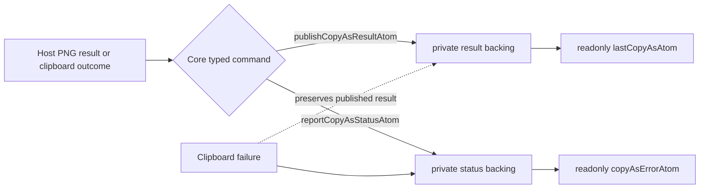

# Wave 8 — PNG export design (8.4 / 8.5 slice)

## Purpose

Concrete PoC design for the PNG slice of Wave 8: "range screenshot + copy as
PNG". The umbrella wave doc (`wave-8-formula-extension-and-export.md`)
sketches a full backend port, atom contract, and DOM/canvas dual paths.
This doc narrows that to the smallest workable end-to-end shape we can land
without dragging in canvas dependencies, registering a new toolbar item, or
touching the engine.

The shipped PoC must:

1. Define an OPTIONAL `exportRangeAsImage` port on `SpreadsheetBackend`.
2. Provide a framework-agnostic `encodeSelectionAsImage` helper that turns a
   selection + backend into a `Blob | null` (null when the host port is
   missing — every Wave-8 port is optional and UI core stays inert).
3. Ship a Solid host PoC that renders the visible range via an
   `<svg>` + `<foreignObject>` data-URL → `` → `<canvas>.toBlob`
   pipeline. No new npm dependencies, no canvas-dom polyfill.
4. Add the `image` variant to `lastCopyAsAtom` so Solid host can mirror a
   successful PNG write through the same diagnostics atom the text triple
   uses.

The intent is "minimum demoable", not "Excel parity". CF gradients, custom
paint, merged-cell overflow, and ligatured fonts are all explicit
non-goals for the PoC.

## Backend port shape

```ts
export interface RangeImageExportRequest extends SheetRef {
  kind: 'export-range-image'
  range: CellRange
  /** Defaults to 'png'; PoC only emits 'png'. */
  format?: 'png'
  /** Defaults to 1 (CSS px). 2 = retina. */
  scale?: number
  requestId?: ProjectionRequestId
  revision?: ProjectionRevision
}

export interface RangeImageExportResult extends SheetRef {
  kind: 'range-image'
  range: CellRange
  /** Raw PNG bytes. UI core wraps in a Blob; host owns the encoder. */
  bytes: Uint8Array
  width: number
  height: number
  mimeType: 'image/png'
  requestId?: ProjectionRequestId
  revision?: ProjectionRevision
}

// On SpreadsheetBackend:
exportRangeAsImage?(request: RangeImageExportRequest): Promise<RangeImageExportResult>
```

Returning bytes (not a Blob) keeps the port serialisable across a worker
boundary if a future host wants to push the rendering off the main thread —
`Uint8Array` postMessages cleanly, `Blob` does not always. The PoC host
adapter happens to render on the main thread so the conversion is a
no-cost wrap.

## UI core encoder

```ts
// vanilla/spreadsheet-ui-core/src/copy-as/encodeSelectionAsImage.ts

export async function encodeSelectionAsImage(
  input: { sheetId: string; rect: CopyAsRect },
  backend: SpreadsheetBackend,
): Promise<Blob | null> {
  if (!backend.exportRangeAsImage) return null
  const range: CellRange = {
    rowStart: input.rect.startRow,
    colStart: input.rect.startCol,
    rowEnd: input.rect.endRow,
    colEnd: input.rect.endCol,
  }
  const result = await backend.exportRangeAsImage({
    kind: 'export-range-image',
    sheetId: input.sheetId,
    range,
  })
  return new Blob([result.bytes], { type: result.mimeType })
}
```

Returns `null` if the backend omits the port. Returns a `Blob` typed
`image/png` on success. No DOM access (everything runs through the
backend).

## `lastCopyAsAtom` integration

Today `CopyAsResult` is the text triple `{ html, plainText, markdown }`.
The PoC widens the atom value to a union so the same atom carries both
flavours:

```ts
export type CopyAsResult =
  | { kind?: 'text'; html: string; plainText: string; markdown: string }
  | { kind: 'image'; mimeType: 'image/png'; blob: Blob }
```

`kind` is optional on the text variant for backwards compatibility with
persisted diagnostics. Hosts publish either variant through
`store.setter(publishCopyAsResultAtom, result)`; `lastCopyAsAtom` is a
read-only projection over Core-owned private state.

The host reports clipboard outcomes through `reportCopyAsStatusAtom`.
The PNG path publishes the successfully encoded result before its
system-clipboard attempt; a later clipboard failure updates only the status
and preserves the previous successful result.



Diagnostics consumers must narrow before touching `.html` / `.blob`.

## Solid host implementation (PoC strategy)

The simplest viable rendering path uses SVG `<foreignObject>` plus a
canvas:

1. Adapter receives `exportRangeAsImage({ range })`.
2. Pull the projection via the existing `readRangeProjection` so we get
   the same `DisplayCell[]` the text encoders use.
3. Reuse `encodeSelectionAsHtml` to produce a styled `<table>` for the
   selection. This already understands per-cell format (`bold`, `bgColor`,
   `align`, etc.) and merges. The HTML encoder is the single source of
   truth for "what a cell looks like in copy-as".
4. Wrap the table in an SVG document:
   ```xml
   <svg xmlns="..." width="W" height="H">
     <foreignObject width="100%" height="100%">
       <div xmlns="http://www.w3.org/1999/xhtml">{table}</div>
     </foreignObject>
   </svg>
   ```
5. Encode the SVG as a `data:` URL and load it into a hidden `Image()`.
   When `onload` fires, paint it onto an `OffscreenCanvas` (or a regular
   `<canvas>` when offscreen is unavailable) and call `toBlob('image/png')`
   to get the bytes. `Blob` → `arrayBuffer()` → `Uint8Array`.

Width and height are derived from
`(colEnd - colStart + 1) × defaultColWidth × scale` and
`(rowEnd - rowStart + 1) × defaultRowHeight × scale`. The PoC uses the
existing default width/height constants from `viewport`; per-cell size
overrides via `readViewportSizeProjection` are a Wave-8 follow-up.

### Known PoC limitations

- **Same-origin only.** `foreignObject` SVGs can taint a canvas if the
  embedded HTML loads cross-origin images; tainted canvases throw on
  `toBlob`. The PoC clips fonts to `system-ui` so we never reach into
  network territory.
- **No CF gradients.** Conditional-format gradients live in CSS the host
  doesn't have visibility into yet; the PoC reuses the static
  `SpreadsheetCellFormat` decoration only.
- **No merged-cell overflow.** `<foreignObject>` already handles
  `rowspan` / `colspan` because the HTML encoder emits real `<td>`
  attributes — so basic merges round-trip for free.
- **Resolution.** Default `scale = 1`. Hosts can bump to 2 for retina;
  the SVG path stays sharp at any scale because the HTML re-rasters in
  the canvas paint step.
- **jsdom.** The Jest environment has no real `<canvas>` paint pipeline.
  Solid-host tests mock `exportRangeAsImage` directly instead of running
  the SVG pipeline end-to-end. The pipeline is exercised in
  `solid/excel` Playwright e2e in a follow-up arc.

## Current `lastCopyAsAtom` wiring

The Solid host now implements the `Ctrl+Shift+P` keyboard binding, the
`navigator.clipboard.write` + `ClipboardItem({ 'image/png': blob })` call,
and typed result/status commands. Successful encoding publishes the snapshot
and diagnostics mirror before the system clipboard attempt; rejection updates
only status and preserves that snapshot. Only advanced rendering fidelity such
as conditional-format gradients and ligature/font parity remains deferred.

## Test plan

- `vanilla/spreadsheet-ui-core/test/copy-as-image.test.ts`
  - Backend without `exportRangeAsImage` → encoder returns `null`.
  - Backend with mocked `exportRangeAsImage` returning a 1×1 PNG byte
    sequence → encoder returns a `Blob` typed `image/png` whose
    `arrayBuffer` matches the input bytes.
  - `lastCopyAsAtom` accepts the `{ kind: 'image', blob }` variant.
- `solid/excel` host-level smoke test (follow-up) — assert the
  `exportRangeAsImage` PoC adapter returns a non-empty PNG byte sequence
  for a 2×2 selection. Don't pin pixel content. Skipped in CI under
  jsdom; reactivated under Playwright.

## File impact

- `vanilla/spreadsheet-ui-core/src/backend/types.ts` — add request /
  result types + optional method (~30 LOC).
- `vanilla/spreadsheet-ui-core/src/copy-as/types.ts` — widen
  `CopyAsResult` union (~10 LOC).
- `vanilla/spreadsheet-ui-core/src/copy-as/encodeSelectionAsImage.ts` —
  new (~30 LOC).
- `vanilla/spreadsheet-ui-core/src/copy-as/index.ts` — re-export (~2 LOC).
- `vanilla/spreadsheet-ui-core/test/copy-as-image.test.ts` — new
  (~80 LOC).
- `solid/excel/src-vnext/copy-as/` — new dir with PoC adapter
  (`renderRangeAsImage.ts`, ~120 LOC) — deferred to a follow-up commit
  if time permits.

Total PoC: ~150 LOC code + ~80 LOC test, plus design doc.

## Closed since the PoC

All 7 post-PoC items shipped in the 2026-06-11 closure arc:

1. ✅ `withHostImageRenderer` wraps any backend lacking `exportRangeAsImage`
   with a host-side renderer at dispatch time (smarter than per-backend
   advertising — the worker backends don't need to know about rendering).
   `d51b5ea`.
2. ✅ `Ctrl+Shift+P` keyboard intent in `keyboard/index.ts:281` returns
   `clipboard.copyAsImage`. `d078e9f`.
3. ✅ `navigator.clipboard.write` of `ClipboardItem({'image/png': blob})`
   via `writeImageToClipboard`. Falls back to mirror-only when the system
   clipboard rejects. `d51b5ea`.
4. ✅ `MAX_EXPORT_PIXELS` (16,777,216 = 4096²) cap; `'image-too-large'`
   error variant on `copyAsErrorAtom`. `d078e9f`.
5. ✅ Per-cell sizes read via `readViewportSizeProjection` and threaded
   through `projectViewportSizes` → `columnWidths`/`rowHeights` maps +
   median fallback. `5ef8482`.
6. ✅ Canvas-direct paint fallback: when SVG/foreignObject rasterisation
   throws (headless Chromium fails `createImageBitmap` on SVG blobs),
   `paintCellsToCanvasPng` draws cells via Canvas 2D primitives directly.
   Same path is the natural fit for a future Wave 5 canvas overlay. `d355961`.
7. ✅ Playwright e2e `solid/excel/e2e/copy-as-png.spec.ts` asserts
   `Ctrl+Shift+P` over 2×2 selection mirrors a non-empty `image/png`
   Blob into `__einfach_lastCopyAs__`. Passes on both backends. `d355961`.
