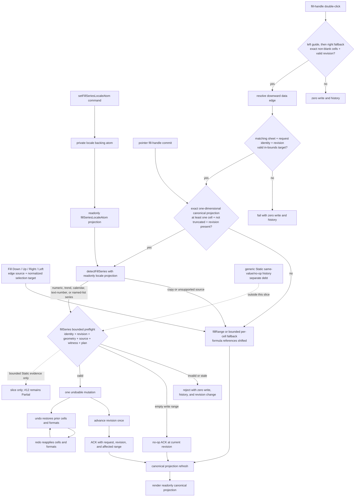

# auto-fill

Owns fill-series locale state, pure series detection, and the command/request path shared by
fill-handle drag, fill-handle double-click, and the visible Fill Down / Up / Right / Left commands.

## State Decision Template

- Private source atom: `fillSeriesLocaleBackingAtom` stores the single bounded locale object.
- Readonly projection: `fillSeriesLocaleAtom` exposes locale data without a public write path.
- Command: `setFillSeriesLocaleAtom` is the only supported writer and replaces the locale at workbook
  initialization or locale change.
- Detection: `detectFillSeries` is a pure function. The Solid Grid calls it only after reading a
  non-truncated, exact, one-dimensional source projection with a revision witness.
- Scale bound: one `FillSeriesLocaleOptions` object and one bounded source projection; there are no
  per-cell, per-row, or per-column atoms.
- Tests: `test/auto-fill-series.test.ts`; the bounded Solid/Static integration witness is
  `MAIN_REVIEW_ACCEPTED` and does not promote product parity.

## Bounded product connection

The command path now serves fill-handle drag, fill-handle double-click, and the visible Fill Down /
Up / Right / Left commands. The four visible commands always use copy semantics: the top row is the
source for Down, the bottom row for Up, the leftmost column for Right, and the rightmost column for
Left. Their target is the complete normalized selection. A selection with no extension along the
requested axis is a no-op.

Double-click prefers the adjacent left guide and falls back to the right guide. It resolves the
downward data edge only from an exact, non-blank guide projection, and the data-edge response must
match that projection's request identity and revision. Active filters, the bottom sheet boundary, a
missing valid guide, or a guide that ends at the source produce no mutation or history.

Series-capable intents dispatch `fillSeries` only from a complete, non-truncated, duplicate-free,
in-range, one-dimensional canonical source projection carrying a revision. Depending on the kind,
the source may contain one date-formatted number, one text-number or named-list seed, two uniform
numeric observations, or at least three observations for a least-squares linear trend. Formula
cells and mixed or unsupported sources remain copy operations.

The executable kinds are uniform integer and decimal steps, least-squares linear trends, calendar
day/week/month steps, text-number patterns such as `Item009`, built-in or locale weekday/month
names, and custom lists. Built-in English short and long weekday/month names are available without
host locale initialization. Every copy result, missing backend capability, rejected projection, or
`copyOnly` intent keeps the existing `fillRange` or bounded per-cell fallback. That bounded
per-cell path already shifts formula references; full formula-series semantics and Worker parity
are not implemented.

The bounded `fillSeries` path in the Static backend independently re-reads the canonical source and
preflights geometry, source cardinality, kind, step, text pattern, named-list witness, and the
complete generated write plan before creating history. Date-kind series validate the VALUE type
only (canonical, non-formula numbers) — Excel dates are plain serial numbers, so fill arithmetic
ignores number format (display-only); there is no effective-date-format gate. Built-in list
witnesses must exactly match their canonical lists. A valid write is one undoable mutation, advances
the projection revision once, returns an ACK, and is followed by a canonical projection refresh.
Invalid or stale requests have zero writes, zero history entries, and zero revision advancement; an
empty write range returns a no-op ACK. Undo and redo replay the same bounded history entry. These
guarantees are scoped to this Static path and must not be generalized to generic Static
same-value/no-op history. Product item #12 stays **Partial**, not a completed product capability.

A shared `MAX_AUTO_FILL_CELLS` cap (1,048,576 cells — one full Excel column) rejects an oversized
fill request before any read or RPC, identically enforced by the Rust engine
(`rust/excel-core/src/auto_fill.rs`) and both TS backends (`static-backend.ts`,
`worker-workbook-backend.ts`).

A fill whose formulas would close a dependency cycle always lands (Excel parity): cycle-closing
cells read as `#CYCLE!` and every other cell in the same drag still computes, matching what typing
the same formulas in by hand would produce.

Static-path tests also cover format behavior at this bounded layer: `fillRange` repeats effective
source formats, including formats supplied by range-format layers, and default/blank source
formats clear target formatting where the repeated pattern requires it. `fillSeries` has equivalent
source-format repetition and target-format clearing evidence. Undo restores the prior values and
formats.

## Deferred scope

Worker / real-transport atomic execution and format parity remain open; the bounded Static
mutation and format evidence above cannot be generalized to those paths. Preview UI, full
formula-series semantics, broader Excel-compatible format propagation policy, system
capability/protection gates, and complete E2E/performance/accessibility evidence also remain open.
Custom-list persistence and an authoritative backend registry remain host concerns even though
detection, dispatch, and the bounded request witness are connected. These bounded paths do not
establish complete Excel auto-fill parity.

This bounded package slice keeps product item #12 **Partial** and does not change the strict product
ledger (**41 = 0 Verified / 35 Partial / 5 Missing / 1 Deferred**). Data analysis (#9) and printing
(#16) remain fully deferred outside those 41 items.
