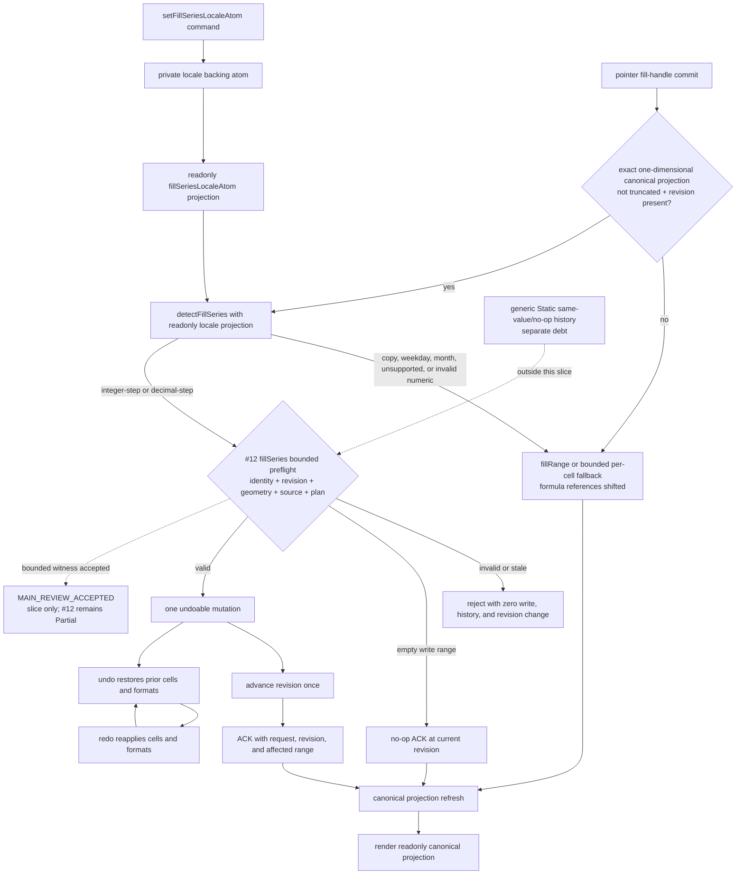

# auto-fill

Owns fill-series locale state and pure series detection for fill-handle drag operations.

## State Decision Template

- Private source atom: `fillSeriesLocaleBackingAtom` stores the single bounded locale object.
- Readonly projection: `fillSeriesLocaleAtom` exposes locale data without a public write path.
- Command: `setFillSeriesLocaleAtom` is the only supported writer and replaces the locale at workbook
  initialization or locale change.
- Detection: `detectFillSeries` is a pure function. The Solid Grid calls it only after reading a
  non-truncated, exact, one-dimensional source projection with a revision witness.
- Scale bound: one `FillSeriesLocaleOptions` object and one bounded source projection; there are no
  per-cell, per-row, or per-column atoms.
- Tests: `test/auto-fill-series.test.ts`; the bounded Solid/Static integration witness is
  `MAIN_REVIEW_ACCEPTED` and does not promote product parity.

## Bounded product connection

The current Solid Grid dispatches `fillSeries` only for a strict one-dimensional source containing
at least two canonical, finite, non-formula numeric cells. The accepted projection must be complete,
non-truncated, duplicate-free, in range, and carry a revision. Only `integer-step` and
`decimal-step` detector results enter the compact series mutation. Every other detector result,
missing capability, rejected projection, or `copyOnly` intent keeps the existing `fillRange` or
bounded per-cell fallback. That bounded per-cell path already shifts formula references; full
formula-series semantics and Worker parity are not implemented.

Only the current #12 `fillSeries` bounded path in the Static backend preflights the complete request
and generated write plan before creating history. A valid write is one undoable mutation, advances
the projection revision once, returns an ACK, and is followed by a canonical projection refresh.
Invalid or stale requests have zero writes, zero history entries, and zero revision advancement; an
empty write range returns a no-op ACK. Undo and redo replay the same bounded history entry. These
plan/no-op/preflight/single-mutation/revision and undo/redo observations are now accepted only as the
bounded #12 witness (`MAIN_REVIEW_ACCEPTED`): an independent reviewer passed 4 suites / 144 tests;
main review passed adapter 99/99, fill 17/17, and scaling 16/16; Solid full passed 69 suites with 1
skipped (70 total) and 1080 tests with 6 skipped (1086 total); Vite build passed. Full Solid `tsc`
still reports exactly five forbidden worker-baseline diagnostics. This acceptance must not be
generalized to global Static history/no-op atomicity; generic Static same-value/no-op history remains
a separate debt. Product item #12 stays **Partial**, not a completed product capability.

## Deferred scope

Date-day, date-week, and date-month detection (`FillSeriesKind` variants `'date-day'`,
`'date-week'`, and `'date-month'`) is not implemented by `detectFillSeries`. Weekday and month-name
detection exists in the pure detector but is not dispatched as `fillSeries` by the Solid Grid.
`customLists` is stored in locale state but has no detector/dispatch implementation. The bounded
per-cell fallback already shifts formula references, but full formula-series semantics and Worker /
real-transport parity, visible Fill commands, system capability/protection gates, and complete
E2E/performance/accessibility evidence remain open.

This bounded package slice keeps product item #12 **Partial** and does not change the strict product
ledger (**41 = 0 Verified / 35 Partial / 5 Missing / 1 Deferred**). Data analysis (#9) and printing
(#16) remain fully deferred outside those 41 items.
