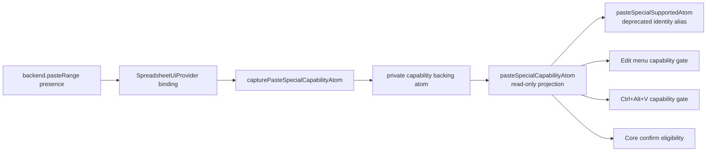
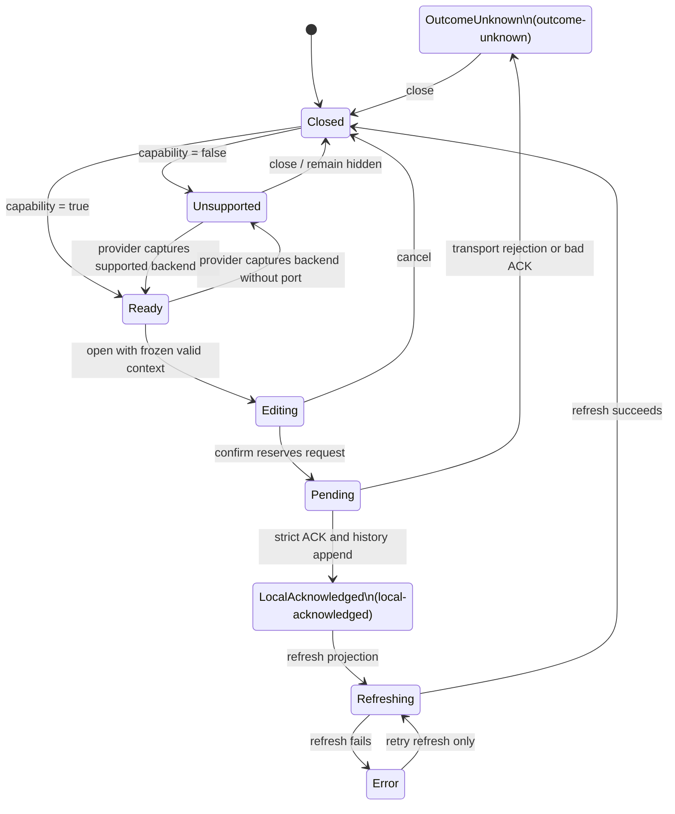

# paste-special

Owns the Paste Special capability, frozen session, form draft, mutation
lifecycle, history hand-off, and projection-refresh sequencing. The Solid
dialog is a projection of this Core state; it does not own or discover the
capability.

Parity item #11: the static backend AND the worker adapter implement
`pasteRange` (the worker path composes existing RPCs over the shared
`solid/excel/src-vnext/adapter/paste-range-plan.ts` helpers). The Edit menu
and Ctrl+Alt+V are capability-gated. A backend may subdivide the capability
fail-closed via `pasteRangeSupportedKinds` (projected by
`pasteSpecialSupportedKindsAtom`): the TS worker runtime declares only the
value-leg kinds (`values` / `transpose`), so format-leg kinds block
pre-dispatch with `pasteSpecialBackendKindError(kind)` and
`openPasteSpecialAtom` falls back to the first supported kind.

## State Decision Template

- Private source atoms:
  - the capability backing atom is module-private and is written only by
    `capturePasteSpecialCapabilityAtom`;
  - the active mutation ticket is module-private and protects request
    identity, acknowledgement, history, and refresh ordering.
- Public state atoms:
  - `pasteSpecialCapabilityAtom`: read-only capability projection;
  - `pasteSpecialSupportedKindsAtom`: read-only projection of the captured
    backend's kind subdivision (defaults to every Core-supported kind);
  - `pasteSpecialOpenAtom`, `pasteSpecialOptionsAtom`,
    `pasteSpecialSessionAtom`, `pasteSpecialLifecycleAtom`, and
    `pasteSpecialErrorAtom`: Core-owned dialog/session state.
- Derived atoms:
  - `pasteSpecialCanEditAtom`, `pasteSpecialCanConfirmAtom`, and
    `pasteSpecialCanCloseAtom` project allowed UI actions;
  - Solid's deprecated `pasteSpecialSupportedAtom` is an identity alias of
    `pasteSpecialCapabilityAtom`, not another state source.
- Commands:
  - `capturePasteSpecialCapabilityAtom` — captures the active backend port;
  - `openPasteSpecialAtom` — freezes sheet, target, clipboard source, payload,
    and default options into one session;
  - `closePasteSpecialAtom` — invalidates the session and resets the draft;
  - `patchPasteSpecialOptionsAtom` — updates the draft and frozen session;
  - `confirmPasteSpecialAtom` — reserves one request, invokes `pasteRange`,
    validates the acknowledgement, appends history, and refreshes projection.
- Scale bound: a single dialog instance; no per-cell families.
- Backend port: optional `pasteRange(PasteRangeRequest)`. Absence is
  unsupported; Core never falls back to a different write transport.
- Per-cell atom risk: none — the dialog edits a single options object.
- Tests: `test/paste-special.test.ts` (core), `test/vnext-paste-special.test.tsx` (host).

`SpreadsheetUiProvider` captures method presence when it binds the backend.
Mounting or unmounting `SpreadsheetPasteSpecialDialog` cannot change the
capability.

`Ready` and `Unsupported` below are conceptual capability/entry states. The
stored lifecycle uses `closed`, `editing`, `blocked`, `pending`,
`outcome-unknown`, `local-acknowledged`, `refreshing`, and `error`.

## Arithmetic semantics

When `op` is `'add' | 'subtract' | 'multiply' | 'divide'`, the backend
combines the source value with the existing target value per cell. The
reference implementation in `solid/excel/src-vnext/adapter/static-backend.ts`
defines the contract; worker backends are expected to match.

| source | target | op       | result                                  |
| ------ | ------ | -------- | --------------------------------------- |
| number | number | any      | `target ⊕ source`                       |
| number | text   | any      | `0 ⊕ source` (text target treated as 0) |
| number | blank  | any      | `0 ⊕ source`                            |
| text   | _any_  | any      | **skip** (target preserved verbatim)    |
| error  | _any_  | any      | **skip** (error pass-through)           |
| _any_  | error  | any      | **skip** (error pass-through)           |
| number | number | divide   | `#DIV/0!` literal when `source = 0`     |

Notes:

- "skip" means the backend leaves the existing target cell exactly as it
  was — no overwrite with the source string, no clear.
- "error" detection is a `displayValue` literal starting with `#` (e.g.
  `#DIV/0!`, `#VALUE!`, `#REF!`, `#NAME?`, `#NUM!`, `#N/A`). This is the
  same shape `valueKind: 'error'` cells project.
- `op = 'none'` (default) bypasses all of the above and writes the source
  input directly.

Host-side coverage lives in
`solid/excel/test/vnext-paste-special-arithmetic.test.ts`.
